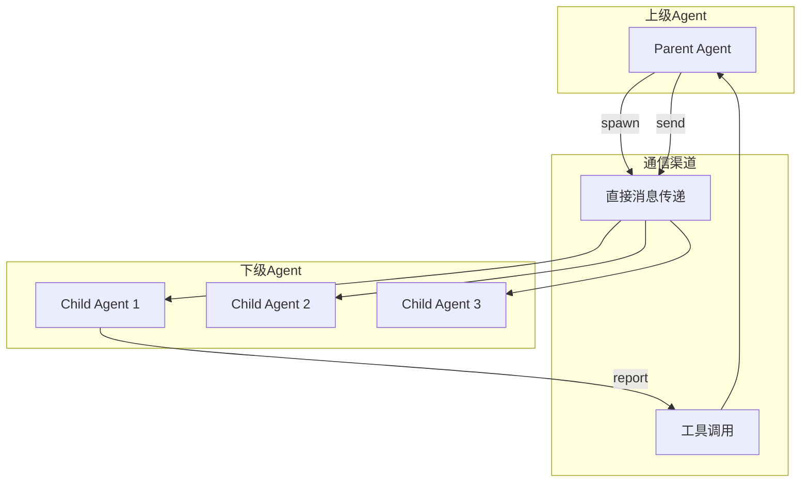
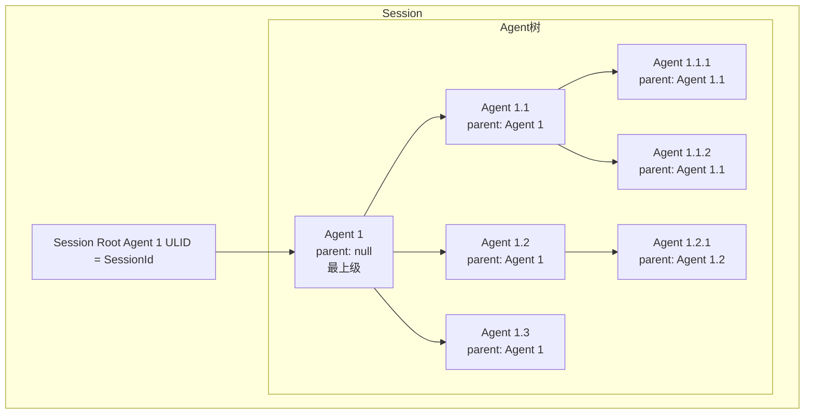

# TECH-AGENT: 多智能体协作模块

本文档描述Neco项目的多智能体协作模块设计，包括SubAgent模式、通信机制和Agent生命周期。

## 1. 模块概述

多智能体协作模块实现SubAgent模式，支持动态创建下级Agent、上下级通信和Agent树形结构管理。

## 2. 核心概念

### 2.1 SubAgent模式



**设计原则：**

- **层次化结构**：上级Agent可以创建多个下级Agent
- **通信隔离**：下级Agent不能直接相互通信，必须通过上级
- **生命周期管理**：上级Agent可以监控和控制下级Agent
- **权限继承**：下级Agent继承上级的部分权限

### 2.2 Agent树结构



## 3. 数据结构设计

### 3.1 Agent定义

```rust
/// Agent实例
pub struct Agent {
    /// Agent唯一标识
    pub ulid: AgentUlid,
    
    /// 上级Agent（None表示根Agent）
    pub parent_ulid: Option<AgentUlid>,
    
    /// 下级Agent列表
    pub children: Vec<AgentUlid>,
    
    /// Agent配置
    pub config: AgentConfig,
    
    /// 消息历史
    pub messages: Vec<Message>,
    
    /// Agent状态
    pub state: AgentState,
    
    /// 激活的工具列表
    pub active_tools: Vec<ToolId>,
    
    /// 激活的MCP服务器
    pub active_mcp_servers: Vec<String>,
    
    /// 激活的Skills
    pub active_skills: Vec<String>,
    
    /// 创建时间
    pub created_at: DateTime<Utc>,
    
    /// 最后活动时间
    pub last_activity: DateTime<Utc>,
}

/// Agent配置
pub struct AgentConfig {
    /// 使用的模型组
    pub model_group: String,
    
    /// 激活的提示词组件
    pub prompts: Vec<String>,
    
    /// Agent定义来源路径
    pub agent_def: Option<PathBuf>,
    
    /// 最大下级Agent数量
    pub max_children: Option<u32>,
    
    /// 是否可以创建下级Agent
    pub can_spawn_children: bool,
}

/// Agent状态
#[derive(Debug, Clone, Copy, PartialEq, Eq)]
pub enum AgentState {
    /// 空闲
    Idle,
    /// 运行中（正在处理消息）
    Running,
    /// 等待工具调用完成
    WaitingForTool,
    /// 等待用户输入
    WaitingForUser,
    /// 已完成
    Completed,
    /// 错误状态
    Error,
}
```

### 3.2 Agent间通信

```rust
/// Agent间消息
#[derive(Debug, Clone)]
pub struct InterAgentMessage {
    /// 消息ID
    pub id: String,
    
    /// 发送方
    pub from: AgentUlid,
    
    /// 接收方
    pub to: AgentUlid,
    
    /// 消息类型
    pub message_type: MessageType,
    
    /// 内容
    pub content: String,
    
    /// 时间戳
    pub timestamp: DateTime<Utc>,
    
    /// 是否需要回复
    pub requires_response: bool,
}

/// 消息类型
#[derive(Debug, Clone)]
pub enum MessageType {
    /// 任务分配
    TaskAssignment {
        task_id: String,
        priority: TaskPriority,
        deadline: Option<DateTime<Utc>>,
    },
    
    /// 进度报告
    ProgressReport {
        task_id: String,
        progress: f64,
        status: TaskStatus,
    },
    
    /// 结果汇报
    ResultReport {
        task_id: String,
        result: String,
        success: bool,
    },
    
    /// 询问/澄清
    ClarificationRequest {
        question: String,
        context: String,
    },
    
    /// 普通消息
    General,
}

#[derive(Debug, Clone, Copy, PartialEq, Eq)]
pub enum TaskPriority {
    Low,
    Normal,
    High,
    Critical,
}

#[derive(Debug, Clone, Copy, PartialEq, Eq)]
pub enum TaskStatus {
    Pending,
    InProgress,
    Blocked,
    Completed,
    Failed,
}
```

## 4. Agent管理器

### 4.1 核心结构

```rust
/// Agent管理器
pub struct AgentManager {
    /// Session引用
    session: Arc<RwLock<Session>>,
    
    /// 模型客户端
    model_client: Arc<dyn ModelClient>,
    
    /// 工具注册表
    tool_registry: Arc<ToolRegistry>,
    
    /// 配置
    config: ConfigManager,
    
    /// 消息发送通道
    message_tx: mpsc::Sender<InterAgentMessage>,
}

impl AgentManager {
    /// 创建根Agent
    pub async fn create_root_agent(
        &self,
        agent_id: &str,
    ) -> Result<AgentUlid, AgentError> {
        // TODO: 实现创建根Agent的逻辑
        // 1. 查找Agent定义
        // 2. 解析Agent定义
        // 3. 创建Session
        // 4. 加载提示词
    }
    
    /// 生成下级Agent
    pub async fn spawn_child_agent(
        &self,
        parent_ulid: AgentUlid,
        agent_id: &str,
        overrides: AgentConfigOverrides,
    ) -> Result<AgentUlid, AgentError> {
        // TODO: 实现生成下级Agent的逻辑
        // 1. 检查父Agent存在性和权限
        // 2. 检查数量限制
        // 3. 查找并解析Agent定义
        // 4. 应用配置覆盖
        // 5. 创建子Agent
        // 6. 加载提示词
        // 7. 添加child提示词
    }
    
    /// 查找Agent定义
    async fn find_agent_definition(
        &self,
        agent_id: &str,
    ) -> Result<AgentDefinition, AgentError> {
        // TODO: 实现查找Agent定义的逻辑
        // 1. 先在工作流目录查找
        // 2. 在配置目录查找
        // 3. 如果都不存在则返回错误
    }
}
```

### 4.2 Agent提示词加载

```rust
impl AgentManager {
    /// 加载Agent提示词
    async fn load_agent_prompts(
        &self,
        session: &mut Session,
        ulid: &AgentUlid,
    ) -> Result<(), AgentError> {
        // TODO: 实现加载Agent提示词的逻辑
        // 1. 获取Agent配置
        // 2. 加载每个提示词组件
        // 3. 合并为系统消息
        // 4. 添加为第一条消息
    }
    
    /// 加载提示词组件
    async fn load_prompt_component(
        &self,
        name: &str,
    ) -> Result<String, AgentError> {
        // TODO: 实现加载提示词组件的逻辑
        // 1. 检查内置提示词
        // 2. 从文件加载自定义提示词
        // 3. 返回提示词内容或错误
    }
    
    /// 为子Agent添加child提示词
    async fn add_child_prompt(
        &self,
        session: &mut Session,
        child_ulid: &AgentUlid,
    ) -> Result<(), AgentError> {
        // TODO: 实现为子Agent添加child提示词的逻辑
        // 1. 检查是否为子Agent
        // 2. 加载multi-agent-child提示词
        // 3. 添加到Agent消息历史
    }
}
```

## 5. Agent通信工具

### 5.1 spawn工具

```rust
/// multi-agent::spawn 工具
pub struct SpawnAgentTool {
    agent_manager: Arc<AgentManager>,
}

impl ToolProvider for SpawnAgentTool {
    fn name(&self) -> &str {
        "multi-agent::spawn"
    }
    
    fn description(&self) -> &str {
        "生成一个下级Agent来执行特定任务"
    }
    
    fn schema(&self) -> Value {
        json!({
            "type": "object",
            "properties": {
                "agent_id": {
                    "type": "string",
                    "description": "要生成的Agent标识（如 'researcher'）"
                },
                "task": {
                    "type": "string",
                    "description": "分配给下级Agent的任务描述"
                },
                "model_group": {
                    "type": "string",
                    "description": "覆盖使用的模型组（可选）"
                },
                "prompts": {
                    "type": "array",
                    "items": { "type": "string" },
                    "description": "覆盖使用的提示词组件（可选）"
                }
            },
            "required": ["agent_id", "task"]
        })
    }
    
    async fn execute(
        &self,
        caller_ulid: AgentUlid,
        args: Value,
    ) -> Result<ToolResult, ToolError> {
        // TODO: 实现spawn工具执行逻辑
        // 1. 解析参数（agent_id, task等）
        // 2. 构建配置覆盖
        // 3. 生成子Agent
        // 4. 发送初始任务
        // 5. 返回结果
    }
}
```

### 5.2 send工具

```rust
/// multi-agent::send 工具
pub struct SendMessageTool {
    agent_manager: Arc<AgentManager>,
    message_tx: mpsc::Sender<InterAgentMessage>,
}

impl ToolProvider for SendMessageTool {
    fn name(&self) -> &str {
        "multi-agent::send"
    }
    
    fn description(&self) -> &str {
        "向指定Agent发送消息"
    }
    
    fn schema(&self) -> Value {
        json!({
            "type": "object",
            "properties": {
                "target_agent": {
                    "type": "string",
                    "description": "目标Agent的ULID"
                },
                "message": {
                    "type": "string",
                    "description": "消息内容"
                },
                "message_type": {
                    "type": "string",
                    "enum": ["task", "query", "response", "general"],
                    "description": "消息类型"
                }
            },
            "required": ["target_agent", "message"]
        })
    }
    
    async fn execute(
        &self,
        caller_ulid: AgentUlid,
        args: Value,
    ) -> Result<ToolResult, ToolError> {
        // TODO: 实现send工具执行逻辑
        // 1. 解析参数（target_agent, message等）
        // 2. 解析目标ULID
        // 3. 验证通信权限
        // 4. 发送消息
        // 5. 返回结果
    }
}
```

### 5.3 report工具（下级向上级汇报）

```rust
/// 下级Agent向上级汇报
pub struct ReportTool {
    agent_manager: Arc<AgentManager>,
}

impl ToolProvider for ReportTool {
    fn name(&self) -> &str {
        "multi-agent::report"
    }
    
    fn description(&self) -> &str {
        "向上级Agent汇报任务进度或结果"
    }
    
    fn schema(&self) -> Value {
        json!({
            "type": "object",
            "properties": {
                "report_type": {
                    "type": "string",
                    "enum": ["progress", "result", "question"],
                    "description": "汇报类型"
                },
                "content": {
                    "type": "string",
                    "description": "汇报内容"
                },
                "progress": {
                    "type": "number",
                    "description": "进度百分比（0-100）"
                }
            },
            "required": ["report_type", "content"]
        })
    }
    
    async fn execute(
        &self,
        caller_ulid: AgentUlid,
        args: Value,
    ) -> Result<ToolResult, ToolError> {
        // TODO: 实现report工具执行逻辑
        // 1. 获取父Agent信息
        // 2. 解析汇报参数
        // 3. 根据汇报类型构建消息
        // 4. 发送汇报消息
        // 5. 返回结果
    }
}
```

## 6. 消息处理流程

### 6.1 消息路由器

```rust
/// Agent消息路由器
pub struct AgentMessageRouter {
    /// 消息接收队列
    rx: mpsc::Receiver<InterAgentMessage>,
    
    /// Agent管理器
    agent_manager: Arc<AgentManager>,
    
    /// 等待回复的回调
    pending_responses: Arc<RwLock<HashMap<String, oneshot::Sender<InterAgentMessage>>>>,
}

impl AgentMessageRouter {
    /// 启动消息路由循环
    pub async fn run(mut self) {
        // TODO: 实现消息路由循环
        // 持续接收并处理消息
        while let Some(msg) = self.rx.recv().await {
            self.handle_message(msg).await;
        }
    }
    
    /// 处理单条消息
    async fn handle_message(
        &self,
        msg: InterAgentMessage,
    ) {
        // TODO: 实现单条消息处理逻辑
        // 1. 存储消息到Session
        // 2. 检查是否有等待的回调
        // 3. 触发目标Agent处理
    }
    
    /// 发送消息并等待回复
    pub async fn send_and_wait(
        &self,
        msg: InterAgentMessage,
        timeout: Duration,
    ) -> Result<InterAgentMessage, AgentError> {
        // TODO: 实现发送消息并等待回复的逻辑
        // 1. 创建等待通道
        // 2. 注册等待回调
        // 3. 发送消息
        // 4. 等待回复或超时
    }
}
```

### 6.2 Agent消息处理

```rust
impl AgentManager {
    /// 处理Agent的消息
    pub async fn process_agent_message(
        &self,
        ulid: AgentUlid,
    ) -> Result<(), AgentError> {
        // TODO: 实现Agent消息处理逻辑
        // 1. 获取Agent上下文和检查状态
        // 2. 更新状态为运行中
        // 3. 调用模型
        // 4. 处理响应或错误
    }
}
```

## 7. 内置提示词组件

### 7.1 multi-agent提示词

```markdown
# multi-agent 提示词组件

你有能力生成下级Agent来协助完成任务。当你发现任务可以拆分为多个独立子任务时，可以使用 `multi-agent::spawn` 工具创建专门的下级Agent。

## 使用场景

1. **并行研究**：需要同时研究多个不同主题时
2. **分工协作**：不同方面需要不同专业知识的Agent
3. **效率提升**：可以并行执行的任务

## 创建下级Agent

使用 `multi-agent::spawn` 工具：
- `agent_id`: 要使用的Agent定义（如 'researcher'）
- `task`: 明确的任务描述
- `model_group`: （可选）覆盖模型组
- `prompts`: （可选）覆盖提示词组件

## 与下级Agent通信

- 使用 `multi-agent::send` 向指定下级Agent发送消息
- 下级Agent完成任务后会主动汇报

## 注意事项

- 保持对整体进度的掌控
- 适时要求下级Agent汇报进展
- 合并下级Agent的结果
```

### 7.2 multi-agent-child提示词

```markdown
# multi-agent-child 提示词组件

你是一个下级Agent，被上级Agent创建来完成特定任务。

## 你的职责

1. **专注执行**：专注于被分配的任务
2. **主动汇报**：定期向上级汇报进度和结果
3. **寻求帮助**：遇到困难时及时询问上级

## 可用工具

- `multi-agent::report`: 向上级汇报进度或结果
  - `report_type`: "progress" | "result" | "question"
  - `content`: 汇报内容
  - `progress`: （可选）进度百分比

## 工作流程

1. 理解任务要求
2. 制定执行计划
3. 定期汇报进展
4. 完成后提交结果
5. 等待下一步指示

## 注意事项

- 不能创建自己的下级Agent（只有上级Agent可以）
- 只能通过report工具与上级通信
- 不要直接访问用户，所有交互通过上级转发
```

## 8. 错误处理

```rust
#[derive(Debug, Error)]
pub enum AgentError {
    #[error("Agent未找到")]
    AgentNotFound,
    
    #[error("父Agent未找到")]
    ParentNotFound,
    
    #[error("Agent定义未找到: {0}")]
    AgentDefinitionNotFound(String),
    
    #[error("提示词未找到: {0}")]
    PromptNotFound(String),
    
    #[error("该Agent不能创建下级Agent")]
    CannotSpawnChildren,
    
    #[error("已达到最大下级Agent数量")]
    MaxChildrenReached,
    
    #[error("通信权限不足")]
    CommunicationNotAllowed,
    
    #[error("没有上级Agent")]
    NoParentAgent,
    
    #[error("模型调用错误: {0}")]
    Model(#[from] ModelError),
    
    #[error("工具错误: {0}")]
    Tool(#[from] ToolError),
    
    #[error("IO错误: {0}")]
    Io(#[from] std::io::Error),
    
    #[error("超时")]
    Timeout,
    
    #[error("通道已关闭")]
    ChannelClosed,
}
```

---

*关联文档：*
- [TECH.md](../TECH.md) - 总体架构文档
- [TECH-SESSION.md](../TECH-SESSION.md) - Session管理模块
- [TECH-WORKFLOW.md](../TECH-WORKFLOW.md) - 工作流模块
