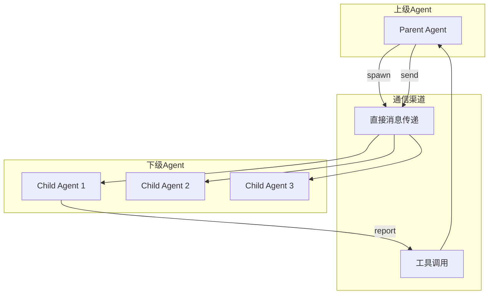
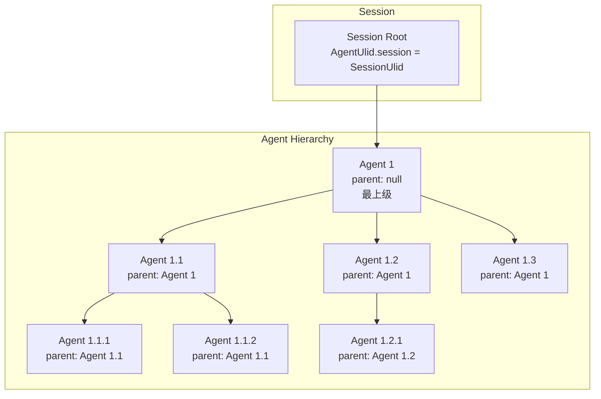
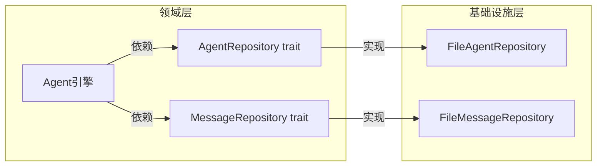
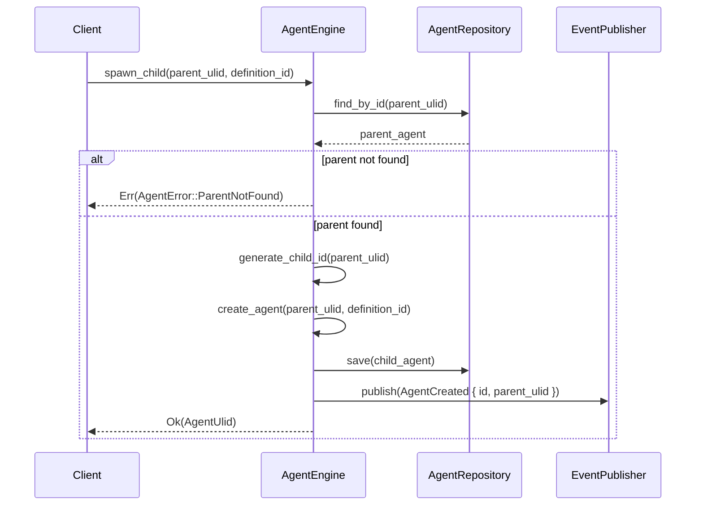
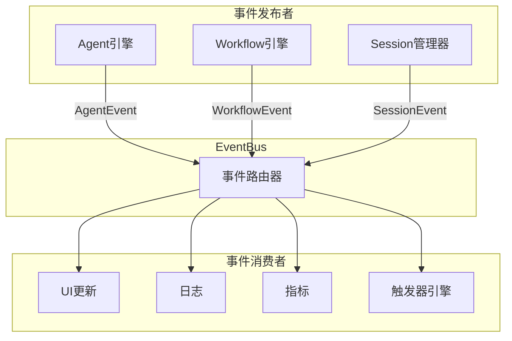
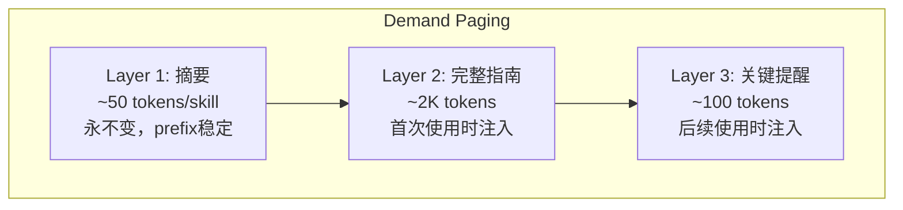

# TECH-AGENT: 多智能体协作模块

本文档描述NeoCo项目的多智能体协作模块设计，采用领域驱动设计，分离Agent引擎与领域模型。

## 1. 模块概述

多智能体协作模块实现SubAgent模式，支持动态创建下级Agent、上下级通信和Agent树形结构管理。

**设计原则：**
- Agent引擎负责生命周期管理，不持有领域模型
- 领域模型（Agent）不含外部依赖
- 通过事件系统传播状态变更

## 2. 核心概念

### 2.1 SubAgent模式



**设计原则：**
- **层次化结构**：上级Agent可以创建多个下级Agent
- **通信隔离**：下级Agent不能直接相互通信，必须通过上级
- **生命周期管理**：上级Agent可以监控和控制下级Agent
- **权限继承**：下级Agent继承上级的部分权限

### 2.2 Agent树结构



## 3. Agent引擎设计

### 3.1 仓储接口定义

> 为解决循环依赖问题，在 `neoco-core` 中定义领域仓储接口：



**Agent仓储接口：**

```rust
/// Agent仓储接口
#[async_trait]
pub trait AgentRepository: Send + Sync {
    async fn save(&self, agent: &Agent) -> Result<(), StorageError>;
    async fn find_by_id(&self, id: &AgentUlid) -> Result<Option<Agent>, StorageError>;
    async fn find_children(&self, parent_ulid: &AgentUlid) -> Result<Vec<Agent>, StorageError>;
}

/// 消息仓储接口
#[async_trait]
pub trait MessageRepository: Send + Sync {
    async fn append(&self, agent_ulid: &AgentUlid, message: &Message) -> Result<(), StorageError>;
    async fn list(&self, agent_ulid: &AgentUlid) -> Result<Vec<Message>, StorageError>;
    async fn delete_prefix(&self, agent_ulid: &AgentUlid, before_id: MessageId) -> Result<(), StorageError>;
}
```

**错误场景说明：**

| 方法 | 错误场景 | 返回行为 |
|------|---------|---------|
| `save` | 序列化失败、IO错误、存储空间不足 | 返回 `StorageError` |
| `save` | 并发冲突（文件被其他进程修改） | 返回 `StorageError::Conflict`，调用方应重试 |
| `save` | 存储不可用（磁盘故障、权限问题） | 返回 `StorageError::Unavailable` |
| `find_by_id` | ID不存在 | 返回 `Ok(None)` |
| `find_by_id` | 文件损坏、解析失败 | 返回 `Err(StorageError::Corruption)` |
| `find_by_id` | 存储不可用 | 返回 `Err(StorageError::Unavailable)` |
| `find_children` | 父ID不存在 | 返回空Vec `Ok(vec![])` |
| `find_children` | 权限错误 | 返回 `Err(StorageError::PermissionDenied)` |
| `find_children` | 存储不可用 | 返回 `Err(StorageError::Unavailable)` |

### 3.2 领域模型定义

```rust
/// Agent状态
#[derive(Debug, Clone, PartialEq, Eq, Serialize, Deserialize)]
pub enum AgentState {
    Idle,
    Running,
    Waiting,
    Completed,
    Failed,
}

/// Agent领域模型
pub struct Agent {
    id: AgentUlid,
    parent_ulid: Option<AgentUlid>,
    definition_id: String,
    state: AgentState,
    model_group: Option<String>,
    system_prompt: Option<String>,
    created_at: DateTime<Utc>,
    updated_at: DateTime<Utc>,
}

impl Agent {
    pub fn id(&self) -> &AgentUlid { &self.id }
    pub fn parent_ulid(&self) -> Option<&AgentUlid> { self.parent_ulid.as_ref() }
    pub fn definition_id(&self) -> &str { &self.definition_id }
    pub fn state(&self) -> &AgentState { &self.state }
    pub fn model_group(&self) -> Option<&str> { self.model_group.as_deref() }
    pub fn system_prompt(&self) -> Option<&str> { self.system_prompt.as_deref() }
    pub fn created_at(&self) -> DateTime<Utc> { self.created_at }
    pub fn updated_at(&self) -> DateTime<Utc> { self.updated_at }
    
    pub fn set_state(&mut self, new_state: AgentState, timestamp: DateTime<Utc>) {
        self.state = new_state;
        self.updated_at = timestamp;
    }
    
    pub fn set_model_group(&mut self, model_group: Option<String>, timestamp: DateTime<Utc>) {
        self.model_group = model_group;
        self.updated_at = timestamp;
    }
    
    pub fn set_system_prompt(&mut self, prompt: Option<String>, timestamp: DateTime<Utc>) {
        self.system_prompt = prompt;
        self.updated_at = timestamp;
    }
}
```

**Agent字段说明：**

| 字段 | 类型 | 说明 |
|------|------|------|
| `id` | AgentUlid | Agent唯一标识 |
| `parent_ulid` | Option\<AgentUlid\> | 父Agent ID |
| `definition_id` | String | Agent定义标识 |
| `state` | AgentState | Agent当前状态 |
| `model_group` | Option\<String\> | 使用的模型组 |
| `system_prompt` | Option\<String\> | Agent运行时使用的系统提示词，可覆盖或扩展定义中的默认提示词 |
| `created_at` | DateTime\<Utc\> | Agent实例创建的时间戳 |
| `updated_at` | DateTime\<Utc\> | Agent实例最后更新的时间戳（状态变更、属性修改等） |

### 3.3 Agent引擎核心

> **注意**：Agent引擎不直接持有领域模型，通过仓储接口访问

```rust
/// Agent引擎（应用层）
pub struct AgentEngine {
    session_manager: Arc<SessionManager>,
    model_client: Arc<dyn ModelClient>,
    tool_registry: Arc<dyn ToolRegistry>,
    config: Config,
    event_publisher: Arc<dyn EventPublisher>,
}

impl AgentEngine {
    pub fn builder() -> AgentEngineBuilder {
        AgentEngineBuilder::new()
    }
    
    pub async fn run_agent(
        &self,
        agent_ulid: AgentUlid,
        input: String,
    ) -> Result<AgentResult, AgentError> {
        // TODO: 实现Agent运行逻辑
        // 1. 从Session加载Agent
        // 2. 构建上下文
        // 3. 调用模型
        // 4. 处理工具调用
        // 5. 返回结果
        unimplemented!()
    }
}

pub struct AgentEngineBuilder {
    session_manager: Option<Arc<SessionManager>>,
    model_client: Option<Arc<dyn ModelClient>>,
    tool_registry: Option<Arc<dyn ToolRegistry>>,
    config: Option<Config>,
    event_publisher: Option<Arc<dyn EventPublisher>>,
}

impl AgentEngineBuilder {
    pub fn new() -> Self {
        Self {
            session_manager: None,
            model_client: None,
            tool_registry: None,
            config: None,
            event_publisher: None,
        }
    }
    
    pub fn session_manager(mut self, manager: Arc<SessionManager>) -> Self {
        self.session_manager = Some(manager);
        self
    }
    
    pub fn model_client(mut self, client: Arc<dyn ModelClient>) -> Self {
        self.model_client = Some(client);
        self
    }
    
    pub fn tool_registry(mut self, registry: Arc<dyn ToolRegistry>) -> Self {
        self.tool_registry = Some(registry);
        self
    }
    
    pub fn config(mut self, config: Config) -> Self {
        self.config = Some(config);
        self
    }
    
    pub fn event_publisher(mut self, publisher: Arc<dyn EventPublisher>) -> Self {
        self.event_publisher = Some(publisher);
        self
    }
    
    pub fn build(self) -> Result<AgentEngine, AgentError> {
        Ok(AgentEngine {
            session_manager: self.session_manager.ok_or(AgentError::Config("session_manager is required".into()))?,
            model_client: self.model_client.ok_or(AgentError::Config("model_client is required".into()))?,
            tool_registry: self.tool_registry.ok_or(AgentError::Config("tool_registry is required".into()))?,
            config: self.config.ok_or(AgentError::Config("config is required".into()))?,
            event_publisher: self.event_publisher.ok_or(AgentError::Config("event_publisher is required".into()))?,
        })
    }
}
```

**run_agent 执行流程：**

```mermaid
sequenceDiagram
    participant Client
    participant Engine as AgentEngine
    participant Repo as AgentRepository
    participant Model as ModelClient
    participant Tools as ToolRegistry
    participant Events as EventPublisher

    Client->>Engine: run_agent(agent_id, input)
    Engine->>Repo: find_by_id(agent_id)
    Repo-->>Engine: agent
    
    alt agent not found
        Engine-->>Client: Err(AgentError::NotFound)
    else agent found
        Engine->>Events: publish(AgentStarted)
        
        Engine->>Repo: find_children(agent_id)
        Repo-->>Engine: children
        
        Engine->>Engine: build_context(agent, children)
        
        loop 模型调用循环
            Engine->>Model: chat(context, input)
            Model-->>Engine: response
            
            alt 有工具调用
                Engine->>Tools: execute_tools(tool_calls)
                Tools-->>Engine: tool_results
                Engine->>Events: publish(ToolCalled)
            else 无工具调用
                break 模型返回最终结果
            end
        end
        
        Engine->>Repo: save(agent)
        Engine->>Events: publish(AgentCompleted)
        Engine-->>Client: Ok(result)
    end
```
    
    pub async fn spawn_child(
        &self,
        parent_ulid: AgentUlid,
        definition_id: String,
    ) -> Result<AgentUlid, AgentError> {
        // TODO: 实现子Agent创建逻辑
        // 1. 验证父Agent存在
        // 2. 在Session中创建子Agent
        // 3. 发布AgentCreated事件
        // 4. 返回AgentUlid
        unimplemented!()
    }
```

**spawn_child 执行流程：**



/// Agent执行结果
pub struct AgentResult {
    pub output: String,
    pub messages: Vec<Message>,
    pub tool_calls: Vec<ToolCall>,
}
```

### 3.4 Agent间通信

```rust
/// Agent间消息
#[derive(Debug, Clone)]
pub struct InterAgentMessage {
    pub id: MessageId,
    pub from: AgentUlid,
    pub to: AgentUlid,
    pub message_type: MessageType,
    pub content: String,
    pub timestamp: DateTime<Utc>,
    pub requires_response: bool,
}

/// 消息类型
#[derive(Debug, Clone)]
pub enum MessageType {
    TaskAssignment {
        task_id: String,
        priority: TaskPriority,
        deadline: Option<DateTime<Utc>>,
    },
    ProgressReport {
        task_id: String,
        progress: f64,
        status: TaskStatus,
    },
    ResultReport {
        task_id: String,
        result: String,
        success: bool,
    },
    ClarificationRequest {
        question: String,
        context: String,
    },
    General,
}

#[derive(Debug, Clone, Copy, PartialEq, Eq)]
pub enum TaskPriority {
    Low,
    Normal,
    High,
    Critical,
}

#[derive(Debug, Clone, Copy, PartialEq, Eq)]
pub enum TaskStatus {
    Pending,
    InProgress,
    Blocked,
    Completed,
    Failed,
}
```

## 4. 工具实现

### 4.1 multi-agent::spawn 工具

```rust
pub struct SpawnAgentTool {
    agent_engine: Arc<AgentEngine>,
}

#[async_trait]
impl ToolExecutor for SpawnAgentTool {
    fn definition(&self) -> &ToolDefinition {
        static DEF: Lazy<ToolDefinition> = Lazy::new(|| ToolDefinition {
            id: ToolId::new("multi-agent", "spawn"),
            description: "生成一个下级Agent来执行特定任务".into(),
            schema: json!({
                "type": "object",
                "properties": {
                    "agent_id": {
                        "type": "string",
                        "description": "要生成的Agent标识"
                    },
                    "task": {
                        "type": "string",
                        "description": "分配给下级Agent的任务描述"
                    },
                    "model_group": {
                        "type": "string",
                        "description": "覆盖使用的模型组（可选）。\n子Agent默认继承父Agent的model_group，\n可通过此参数覆盖继承的值。\n\n层级继承语义：\n- 如果不提供此参数，子Agent使用父Agent的model_group\n- 如果提供此参数，子Agent使用指定的model_group，忽略继承值\n- model_group命名规则：使用kebab-case格式，如 'gpt-4', 'claude-3-opus'\n- model_group必须在配置文件中预先定义"
                    }
                },
                "required": ["agent_id", "task"]
            }),
            capabilities: ToolCapabilities::default(),
            timeout: Duration::from_secs(30),
        });
        &DEF
    }
    
    async fn execute(
        &self,
        context: &ToolContext,
        args: Value,
    ) -> Result<ToolResult, ToolError> {
        // TODO: 实现spawn工具执行逻辑
        // 1. 解析参数
        // 2. 创建子Agent
        // 3. 发送初始任务
        // 4. 返回结果
        unimplemented!()
    }
}
```

### 4.2 multi-agent::send 工具

```rust
pub struct SendMessageTool {
    agent_engine: Arc<AgentEngine>,
}

#[async_trait]
impl ToolExecutor for SendMessageTool {
    fn definition(&self) -> &ToolDefinition {
        static DEF: Lazy<ToolDefinition> = Lazy::new(|| ToolDefinition {
            id: ToolId::new("multi-agent", "send"),
            description: "向指定Agent发送消息".into(),
            schema: json!({
                "type": "object",
                "properties": {
                    "target_agent": {
                        "type": "string",
                        "description": "目标Agent的ID"
                    },
                    "message": {
                        "type": "string",
                        "description": "消息内容"
                    },
                    "message_type": {
                        "type": "string",
                        "enum": ["task", "query", "response", "general"],
                        "description": "消息类型"
                    }
                },
                "required": ["target_agent", "message"]
            }),
            capabilities: ToolCapabilities::default(),
            timeout: Duration::from_secs(30),
        });
        &DEF
    }
    
    async fn execute(
        &self,
        context: &ToolContext,
        args: Value,
    ) -> Result<ToolResult, ToolError> {
        // TODO: 实现send工具执行逻辑
        unimplemented!()
    }
}
```

### 4.3 multi-agent::report 工具

```rust
pub struct ReportTool {
    agent_engine: Arc<AgentEngine>,
}

#[async_trait]
impl ToolExecutor for ReportTool {
    fn definition(&self) -> &ToolDefinition {
        static DEF: Lazy<ToolDefinition> = Lazy::new(|| ToolDefinition {
            id: ToolId::new("multi-agent", "report"),
            description: "向上级Agent汇报任务进度或结果".into(),
            schema: json!({
                "type": "object",
                "properties": {
                    "report_type": {
                        "type": "string",
                        "enum": ["progress", "result", "question"],
                        "description": "汇报类型"
                    },
                    "content": {
                        "type": "string",
                        "description": "汇报内容"
                    },
                    "progress": {
                        "type": "number",
                        "description": "进度百分比（0-100）"
                    }
                },
                "required": ["report_type", "content"]
            }),
            capabilities: ToolCapabilities::default(),
            timeout: Duration::from_secs(30),
        });
        &DEF
    }
    
    async fn execute(
        &self,
        context: &ToolContext,
        args: Value,
    ) -> Result<ToolResult, ToolError> {
        // TODO: 实现report工具执行逻辑
        unimplemented!()
    }
}
```

## 5. 事件驱动架构

### 5.1 事件系统架构



### 5.2 事件类型定义

```rust
pub enum Event {
    Session(SessionEvent),
    Agent(AgentEvent),
    Workflow(WorkflowEvent),
    Tool(ToolEvent),
    System(SystemEvent),
}

pub enum AgentEvent {
    Created { id: AgentUlid, parent_ulid: Option<AgentUlid> },
    StateChanged { id: AgentUlid, old: AgentState, new: AgentState },
    MessageAdded { id: AgentUlid, message_id: MessageId },
    ToolCalled { id: AgentUlid, tool_ulid: ToolId },
    ToolResult { id: AgentUlid, tool_ulid: ToolId, success: bool },
    Completed { id: AgentUlid, output: String },
    Error { id: AgentUlid, error: String },
}

pub enum SessionEvent {
    Created { id: SessionUlid, session_type: SessionType },
    Updated { id: SessionUlid },
    Deleted { id: SessionUlid },
}

pub enum WorkflowEvent {
    Started { session_ulid: SessionUlid, definition: String },
    NodeStarted { session_ulid: SessionUlid, node_ulid: NodeUlid },
    NodeCompleted { session_ulid: SessionUlid, node_ulid: NodeUlid, result: String },
    Transition { session_ulid: SessionUlid, from: NodeUlid, to: NodeUlid },
    Completed { session_ulid: SessionUlid },
    Failed { session_ulid: SessionUlid, error: String },
}
```

### 5.3 触发器模式

```rust
pub enum TriggerPattern {
    /// 匹配所有事件（包括SessionEvent、AgentEvent、WorkflowEvent、ToolEvent、SystemEvent的所有变体）
    All,
    /// 匹配特定生命周期事件
    Lifecycle { events: Vec<LifecycleEvent> },
    /// 匹配特定类型Agent创建
    AgentSpawned { agent_type: Option<String> },
    /// 匹配Agent终止（包括Completed、Failed状态）
    AgentTerminated,
    /// 匹配系统关键字（精确匹配，不区分大小写）
    SystemKeyword { keywords: Vec<String> },
    /// 匹配消息内容（正则表达式，使用regex crate语法）
    ContentMatch { pattern: String },
}

pub struct TriggerHandler {
    pub id: String,
    pub pattern: TriggerPattern,
    pub action: TriggerAction,
    pub enabled: bool,
}

pub enum TriggerAction {
    /// 执行指定工具
    ExecuteTool { tool_name: String, args: Value },
    /// 向指定Agent发送消息
    SendMessage { target: AgentUlid, content: String },
    /// 触发回调函数
    Callback { callback_id: String },
    /// 记录日志
    Log { level: LogLevel, message: String },
    /// 发出事件
    EmitEvent { event_type: String, payload: Value },
}
```

**触发器模式说明：**

| 模式 | 触发条件 | 使用场景 | 详细说明 |
|------|---------|---------|---------|
| `All` | 所有事件类型 | 全局日志、监控 | 包含所有Event变体：SessionEvent、AgentEvent、WorkflowEvent、ToolEvent、SystemEvent及其所有子变体 |
| `Lifecycle` | 特定生命周期事件 | Agent状态跟踪 | 需指定events列表，如：[Created, StateChanged, Completed] |
| `AgentSpawned` | Agent创建时 | 初始化配置 | agent_type为None时匹配所有Agent，为Some时匹配特定definition_id |
| `AgentTerminated` | Agent终止时 | 资源清理 | 匹配Agent状态变为Completed或Failed的事件 |
| `SystemKeyword` | 消息包含关键字 | 快捷命令响应 | 关键字精确匹配（不区分大小写），适用于消息内容和系统命令 |
| `ContentMatch` | 消息匹配正则 | 复杂内容过滤 | 使用regex crate语法，支持前瞻、后顾、捕获组等高级特性 |

## 6. Agent技能加载（Demand Paging）

> **核心理念**：不要预装所有可能用到的技能。按需加载是空间局部性的基础。

### 6.1 三层加载模型



| 层级 | 内容 | Token | 加载时机 |
|------|------|-------|---------|
| Layer 1 | 摘要 | ~50/skill | 始终在 system prompt，永不变 |
| Layer 2 | 完整指南 | ~2K | 首次使用工具时附着在 tool_result |
| Layer 3 | 关键提醒 | ~100 | 5-20轮后使用，错误触发重载 |

**判断标准**：如果一段信息放进 system prompt 后，有 >30% 的 session 不会用到它，就不该预装。

### 6.2 空间局部性原则

> 相关信息应该在 token 序列中物理相邻。

**错误做法**：
```
System Prompt: 身份 + 浏览器指南(2k) + Shell指南(1k) + 代码重构指南(3k) + ...
                                        ↑ 指南在开头
Agent 第42轮执行浏览器操作:              ↑ 中间隔了几万个token，Lost in Middle
```

**正确做法**：
```
... | tool_call(browser_navigate, url) | tool_result(浏览器操作指南 + 实际结果)
                                                    ^^^^^^^^^^^^^^^^^
                                        指南和操作物理相邻 → 空间局部性
```

### 6.3 提示词组件加载实现

```rust
impl AgentEngine {
    /// 按需加载技能（Demand Paging）
    pub async fn load_skill(
        &self,
        skill_name: &str,
        usage_context: &UsageContext,
    ) -> Result<SkillContent, AgentError> {
        // TODO: 实现三层加载
        // Layer 1: 摘要始终加载（已在 system prompt）
        // Layer 2: 首次使用时，加载完整指南作为 tool_result
        // Layer 3: 后续使用，加载关键提醒
        unimplemented!()
    }
    
    /// 检查是否需要重载完整指南
    pub fn should_reload_full_guide(
        &self,
        skill_name: &str,
        error_count: usize,
    ) -> bool {
        // TODO: 实现重载判断逻辑
        // 连续 2 次同类工具出错 → 自动重新注入完整指南
        unimplemented!()
    }
}

pub struct UsageContext {
    pub tool_name: String,
    pub turn: usize,
    pub recent_errors: usize,
}

pub enum SkillContent {
    Summary(String),
    FullGuide(String),
    Reminder(String),
}
```

## 7. 错误处理

> **注意**: 所有模块错误类型统一在 `neoco-core` 的 `AppError` 中汇总。

```rust
#[derive(Debug, Error)]
pub enum AgentError {
    #[error("Agent不存在: {0}")]
    NotFound(AgentUlid),
    
    #[error("父Agent不存在")]
    ParentNotFound,
    
    #[error("Agent定义未找到: {0}")]
    DefinitionNotFound(String),
    
    #[error("提示词未找到: {0}")]
    PromptNotFound(String),
    
    #[error("不能创建下级Agent")]
    CannotSpawnChildren,
    
    #[error("已达到最大下级Agent数量")]
    MaxChildrenReached,
    
    #[error("通信权限不足")]
    PermissionDenied,
    
    #[error("没有上级Agent")]
    NoParentAgent,
    
    #[error("模型调用错误: {0}")]
    Model(#[from] ModelError),
    
    #[error("工具错误: {0}")]
    Tool(#[from] ToolError),
    
    #[error("配置错误: {0}")]
    Config(String),
    
    #[error("超时")]
    Timeout,
    
    #[error("通道已关闭")]
    ChannelClosed,
}

impl AgentError {
    pub fn is_recoverable(&self) -> bool {
        match self {
            Self::Timeout | Self::ChannelClosed => true,
            Self::Model(e) => e.is_retryable(),
            Self::Tool(e) => e.is_retryable(),
            Self::NotFound(_) | Self::ParentNotFound | Self::DefinitionNotFound(_)
            | Self::PromptNotFound(_) | Self::CannotSpawnChildren
            | Self::MaxChildrenReached | Self::PermissionDenied
            | Self::NoParentAgent | Self::Config(_) => false,
        }
    }
}
```

---

*关联文档：*
- [TECH.md](TECH.md) - 总体架构文档
- [TECH-SESSION.md](TECH-SESSION.md) - Session管理模块
- [TECH-WORKFLOW.md](TECH-WORKFLOW.md) - 工作流模块
- [TECH-TOOL.md](TECH-TOOL.md) - 工具模块
- [TECH-PROMPT.md](TECH-PROMPT.md) - 提示词组件模块
