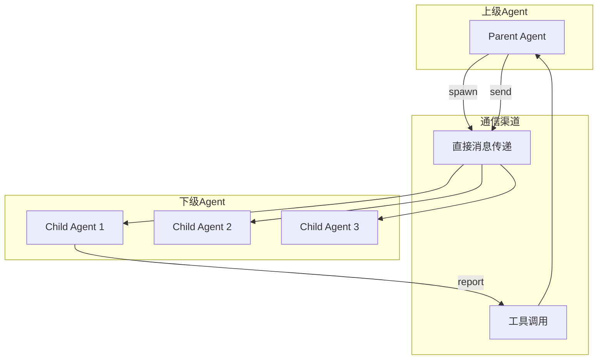
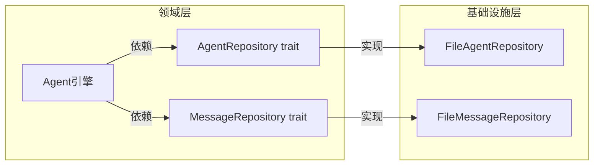
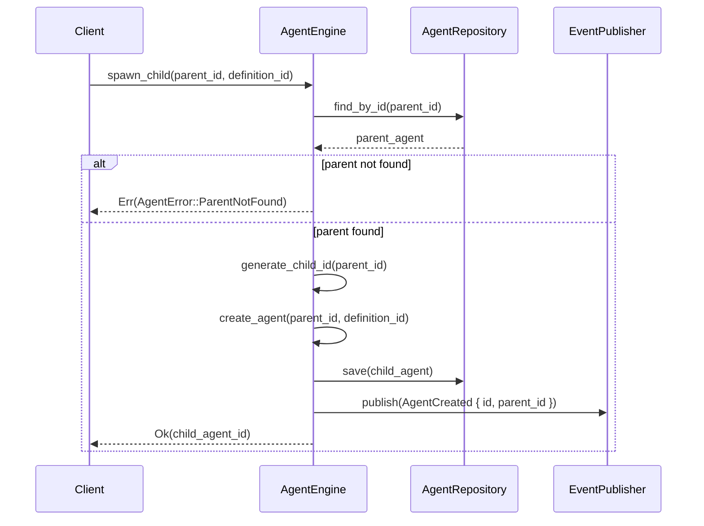
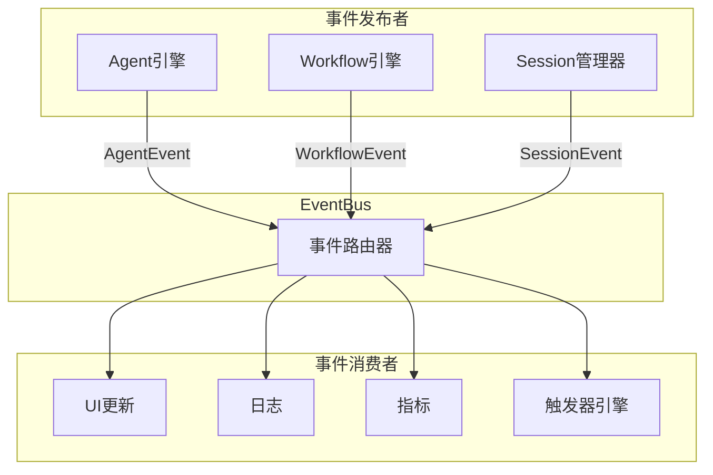

# TECH-AGENT: 多智能体协作模块

本文档描述Neco项目的多智能体协作模块设计，采用领域驱动设计，分离Agent引擎与领域模型。

## 1. 模块概述

多智能体协作模块实现SubAgent模式，支持动态创建下级Agent、上下级通信和Agent树形结构管理。

**设计原则：**
- Agent引擎负责生命周期管理，不持有领域模型
- 领域模型（Agent）不含外部依赖
- 通过事件系统传播状态变更

## 2. 核心概念

### 2.1 SubAgent模式



**设计原则：**
- **层次化结构**：上级Agent可以创建多个下级Agent
- **通信隔离**：下级Agent不能直接相互通信，必须通过上级
- **生命周期管理**：上级Agent可以监控和控制下级Agent
- **权限继承**：下级Agent继承上级的部分权限

### 2.2 Agent树结构


## 3. Agent引擎设计

### 3.1 仓储接口定义

> 为解决循环依赖问题，在 `neco-core` 中定义领域仓储接口：



**Agent仓储接口：**

```rust
/// Agent仓储接口
#[async_trait]
pub trait AgentRepository: Send + Sync {
    async fn save(&self, agent: &Agent) -> Result<(), StorageError>;
    async fn find_by_id(&self, id: &AgentId) -> Result<Option<Agent>, StorageError>;
    async fn find_children(&self, parent_id: &AgentId) -> Result<Vec<Agent>, StorageError>;
}

/// 消息仓储接口
#[async_trait]
pub trait MessageRepository: Send + Sync {
    async fn save(&self, message: &Message) -> Result<(), StorageError>;
    async fn find_by_session(&self, session_id: &SessionId) -> Result<Vec<Message>, StorageError>;
}
```

### 3.2 领域模型定义

```rust
/// Agent状态
#[derive(Debug, Clone, PartialEq, Eq, Serialize, Deserialize)]
pub enum AgentState {
    Idle,
    Running,
    Waiting,
    Completed,
    Failed,
}

/// Agent领域模型
pub struct Agent {
    pub id: AgentId,
    pub parent_id: Option<AgentId>,
    pub definition_id: String,
    pub state: AgentState,
    pub model_group: Option<String>,
    pub system_prompt: Option<String>,
    pub created_at: DateTime<Utc>,
    pub updated_at: DateTime<Utc>,
    // ... 其他字段
}
```

**Agent字段说明：**

| 字段 | 类型 | 说明 |
|------|------|------|
| `id` | AgentId | Agent唯一标识 |
| `parent_id` | Option\<AgentId\> | 父Agent ID |
| `definition_id` | String | Agent定义标识 |
| `state` | AgentState | Agent当前状态 |
| `model_group` | Option\<String\> | 使用的模型组 |
| `system_prompt` | Option\<String\> | Agent运行时使用的系统提示词，可覆盖或扩展定义中的默认提示词 |
| `created_at` | DateTime\<Utc\> | Agent实例创建的时间戳 |
| `updated_at` | DateTime\<Utc\> | Agent实例最后更新的时间戳（状态变更、属性修改等） |

### 3.3 Agent引擎核心

> **注意**：Agent引擎不直接持有领域模型，通过仓储接口访问

```rust
/// Agent引擎（应用层）
pub struct AgentEngine {
    session_manager: Arc<SessionManager>,
    model_client: Arc<dyn ModelClient>,
    tool_registry: Arc<dyn ToolRegistry>,
    config: Config,
    event_publisher: Arc<dyn EventPublisher>,
}

impl AgentEngine {
    pub async fn run_agent(
        &self,
        agent_id: AgentId,
        input: String,
    ) -> Result<AgentResult, AgentError> {
        // TODO: 实现Agent运行逻辑
        // 1. 从Session加载Agent
        // 2. 构建上下文
        // 3. 调用模型
        // 4. 处理工具调用
        // 5. 返回结果
        unimplemented!()
    }
```

**run_agent 执行流程：**

```mermaid
sequenceDiagram
    participant Client
    participant Engine as AgentEngine
    participant Repo as AgentRepository
    participant Model as ModelClient
    participant Tools as ToolRegistry
    participant Events as EventPublisher

    Client->>Engine: run_agent(agent_id, input)
    Engine->>Repo: find_by_id(agent_id)
    Repo-->>Engine: agent
    
    alt agent not found
        Engine-->>Client: Err(AgentError::NotFound)
    else agent found
        Engine->>Events: publish(AgentStarted)
        
        Engine->>Repo: find_children(agent_id)
        Repo-->>Engine: children
        
        Engine->>Engine: build_context(agent, children)
        
        loop 模型调用循环
            Engine->>Model: chat(context, input)
            Model-->>Engine: response
            
            alt 有工具调用
                Engine->>Tools: execute_tools(tool_calls)
                Tools-->>Engine: tool_results
                Engine->>Events: publish(ToolCalled)
            else 无工具调用
                break 模型返回最终结果
            end
        end
        
        Engine->>Repo: save(agent)
        Engine->>Events: publish(AgentCompleted)
        Engine-->>Client: Ok(result)
    end
```
    
    pub async fn spawn_child(
        &self,
        parent_id: AgentId,
        definition_id: String,
    ) -> Result<AgentId, AgentError> {
        // TODO: 实现子Agent创建逻辑
        // 1. 验证父Agent存在
        // 2. 在Session中创建子Agent
        // 3. 发布AgentCreated事件
        // 4. 返回AgentId
        unimplemented!()
    }
```

**spawn_child 执行流程：**


}

/// Agent执行结果
pub struct AgentResult {
    pub output: String,
    pub messages: Vec<Message>,
    pub tool_calls: Vec<ToolCall>,
}
```

### 3.4 Agent间通信

```rust
/// Agent间消息
#[derive(Debug, Clone)]
pub struct InterAgentMessage {
    pub id: MessageId,
    pub from: AgentId,
    pub to: AgentId,
    pub message_type: MessageType,
    pub content: String,
    pub timestamp: DateTime<Utc>,
    pub requires_response: bool,
}

/// 消息类型
#[derive(Debug, Clone)]
pub enum MessageType {
    TaskAssignment {
        task_id: String,
        priority: TaskPriority,
        deadline: Option<DateTime<Utc>>,
    },
    ProgressReport {
        task_id: String,
        progress: f64,
        status: TaskStatus,
    },
    ResultReport {
        task_id: String,
        result: String,
        success: bool,
    },
    ClarificationRequest {
        question: String,
        context: String,
    },
    General,
}

#[derive(Debug, Clone, Copy, PartialEq, Eq)]
pub enum TaskPriority {
    Low,
    Normal,
    High,
    Critical,
}

#[derive(Debug, Clone, Copy, PartialEq, Eq)]
pub enum TaskStatus {
    Pending,
    InProgress,
    Blocked,
    Completed,
    Failed,
}
```

## 4. 工具实现

### 4.1 multi-agent::spawn 工具

```rust
pub struct SpawnAgentTool {
    agent_engine: Arc<AgentEngine>,
}

#[async_trait]
impl ToolExecutor for SpawnAgentTool {
    fn definition(&self) -> &ToolDefinition {
        static DEF: Lazy<ToolDefinition> = Lazy::new(|| ToolDefinition {
            id: ToolId("multi-agent::spawn".into()),
            description: "生成一个下级Agent来执行特定任务".into(),
            schema: json!({
                "type": "object",
                "properties": {
                    "agent_id": {
                        "type": "string",
                        "description": "要生成的Agent标识"
                    },
                    "task": {
                        "type": "string",
                        "description": "分配给下级Agent的任务描述"
                    },
                    "model_group": {
                        "type": "string",
                        "description": "覆盖使用的模型组（可选）"
                    }
                },
                "required": ["agent_id", "task"]
            }),
            capabilities: ToolCapabilities::default(),
            timeout: Duration::from_secs(30),
        });
        &DEF
    }
    
    async fn execute(
        &self,
        context: &ToolContext,
        args: Value,
    ) -> Result<ToolResult, ToolError> {
        // TODO: 实现spawn工具执行逻辑
        // 1. 解析参数
        // 2. 创建子Agent
        // 3. 发送初始任务
        // 4. 返回结果
        unimplemented!()
    }
}
```

### 4.2 multi-agent::send 工具

```rust
pub struct SendMessageTool {
    agent_engine: Arc<AgentEngine>,
}

#[async_trait]
impl ToolExecutor for SendMessageTool {
    fn definition(&self) -> &ToolDefinition {
        static DEF: Lazy<ToolDefinition> = Lazy::new(|| ToolDefinition {
            id: ToolId("multi-agent::send".into()),
            description: "向指定Agent发送消息".into(),
            schema: json!({
                "type": "object",
                "properties": {
                    "target_agent": {
                        "type": "string",
                        "description": "目标Agent的ID"
                    },
                    "message": {
                        "type": "string",
                        "description": "消息内容"
                    },
                    "message_type": {
                        "type": "string",
                        "enum": ["task", "query", "response", "general"],
                        "description": "消息类型"
                    }
                },
                "required": ["target_agent", "message"]
            }),
            capabilities: ToolCapabilities::default(),
            timeout: Duration::from_secs(30),
        });
        &DEF
    }
    
    async fn execute(
        &self,
        context: &ToolContext,
        args: Value,
    ) -> Result<ToolResult, ToolError> {
        // TODO: 实现send工具执行逻辑
        unimplemented!()
    }
}
```

### 4.3 multi-agent::report 工具

```rust
pub struct ReportTool {
    agent_engine: Arc<AgentEngine>,
}

#[async_trait]
impl ToolExecutor for ReportTool {
    fn definition(&self) -> &ToolDefinition {
        static DEF: Lazy<ToolDefinition> = Lazy::new(|| ToolDefinition {
            id: ToolId("multi-agent::report".into()),
            description: "向上级Agent汇报任务进度或结果".into(),
            schema: json!({
                "type": "object",
                "properties": {
                    "report_type": {
                        "type": "string",
                        "enum": ["progress", "result", "question"],
                        "description": "汇报类型"
                    },
                    "content": {
                        "type": "string",
                        "description": "汇报内容"
                    },
                    "progress": {
                        "type": "number",
                        "description": "进度百分比（0-100）"
                    }
                },
                "required": ["report_type", "content"]
            }),
            capabilities: ToolCapabilities::default(),
            timeout: Duration::from_secs(30),
        });
        &DEF
    }
    
    async fn execute(
        &self,
        context: &ToolContext,
        args: Value,
    ) -> Result<ToolResult, ToolError> {
        // TODO: 实现report工具执行逻辑
        unimplemented!()
    }
}
```

## 5. 事件驱动架构

### 5.1 事件系统架构



### 5.2 事件类型定义

```rust
pub enum Event {
    Session(SessionEvent),
    Agent(AgentEvent),
    Workflow(WorkflowEvent),
    Tool(ToolEvent),
    System(SystemEvent),
}

pub enum AgentEvent {
    Created { id: AgentId, parent_id: Option<AgentId> },
    StateChanged { id: AgentId, old: AgentState, new: AgentState },
    MessageAdded { id: AgentId, message_id: MessageId },
    ToolCalled { id: AgentId, tool_id: ToolId },
    ToolResult { id: AgentId, tool_id: ToolId, success: bool },
    Completed { id: AgentId, output: String },
    Error { id: AgentId, error: String },
}

pub enum SessionEvent {
    Created { id: SessionId, session_type: SessionType },
    Updated { id: SessionId },
    Deleted { id: SessionId },
}

pub enum WorkflowEvent {
    Started { session_id: SessionId, definition: String },
    NodeStarted { session_id: SessionId, node_id: NodeId },
    NodeCompleted { session_id: SessionId, node_id: NodeId, result: String },
    Transition { session_id: SessionId, from: NodeId, to: NodeId },
    Completed { session_id: SessionId },
    Failed { session_id: SessionId, error: String },
}
```

### 5.3 触发器模式

```rust
pub enum TriggerPattern {
    All,
    Lifecycle { events: Vec<LifecycleEvent> },
    AgentSpawned { agent_type: Option<String> },
    AgentTerminated,
    SystemKeyword { keywords: Vec<String> },
    ContentMatch { pattern: String },
}

pub struct TriggerHandler {
    pub id: String,
    pub pattern: TriggerPattern,
    pub action: TriggerAction,
    pub enabled: bool,
}

pub enum TriggerAction {
    ExecuteTool { tool_name: String, args: Value },
    SendMessage { target: AgentId, content: String },
    Callback { callback_id: String },
    Log { level: LogLevel, message: String },
    EmitEvent { event_type: String, payload: Value },
}
```

## 6. Agent提示词加载

### 6.1 提示词组件加载

```rust
impl AgentEngine {
    pub async fn load_prompts(
        &self,
        agent: &Agent,
        session: &Session,
    ) -> Result<Vec<String>, AgentError> {
        // TODO: 实现提示词加载逻辑
        // 1. 获取Agent定义中的prompts列表
        // 2. 加载每个提示词组件
        // 3. 合并为系统消息
        unimplemented!()
    }
    
    pub async fn load_prompt_component(
        &self,
        name: &str,
    ) -> Result<String, AgentError> {
        // TODO: 实现提示词组件加载
        // 1. 检查内置提示词
        // 2. 从文件加载自定义提示词
        // 3. 返回内容
        unimplemented!()
    }
}
```

## 7. 错误处理

> **注意**: 所有模块错误类型统一在 `neco-core` 的 `AppError` 中汇总。

```rust
#[derive(Debug, Error)]
pub enum AgentError {
    #[error("Agent不存在: {0}")]
    NotFound(AgentId),
    
    #[error("父Agent不存在")]
    ParentNotFound,
    
    #[error("Agent定义未找到: {0}")]
    DefinitionNotFound(String),
    
    #[error("提示词未找到: {0}")]
    PromptNotFound(String),
    
    #[error("不能创建下级Agent")]
    CannotSpawnChildren,
    
    #[error("已达到最大下级Agent数量")]
    MaxChildrenReached,
    
    #[error("通信权限不足")]
    PermissionDenied,
    
    #[error("没有上级Agent")]
    NoParentAgent,
    
    #[error("模型调用错误: {0}")]
    Model(#[from] ModelError),
    
    #[error("工具错误: {0}")]
    Tool(#[from] ToolError),
    
    #[error("超时")]
    Timeout,
    
    #[error("通道已关闭")]
    ChannelClosed,
}
```

---

*关联文档：*
- [TECH.md](TECH.md) - 总体架构文档
- [TECH-SESSION.md](TECH-SESSION.md) - Session管理模块
- [TECH-WORKFLOW.md](TECH-WORKFLOW.md) - 工作流模块
- [TECH-TOOL.md](TECH-TOOL.md) - 工具模块
- [TECH-PROMPT.md](TECH-PROMPT.md) - 提示词组件模块
