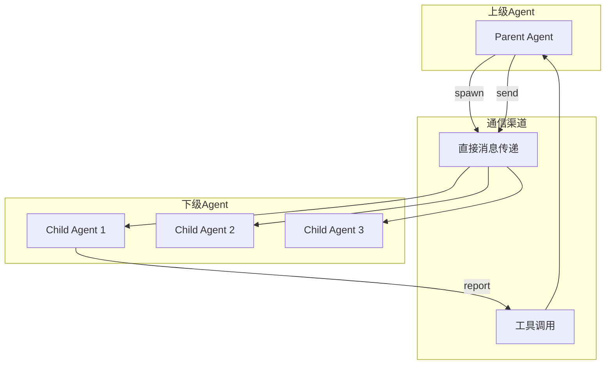
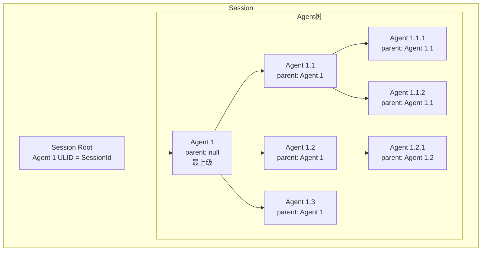

# TECH-AGENT: 多智能体协作模块

本文档描述Neco项目的多智能体协作模块设计，包括SubAgent模式、通信机制和Agent生命周期。

## 1. 模块概述

多智能体协作模块实现SubAgent模式，支持动态创建下级Agent、上下级通信和Agent树形结构管理。

## 2. 核心概念

### 2.1 SubAgent模式



**设计原则：**

- **层次化结构**：上级Agent可以创建多个下级Agent
- **通信隔离**：下级Agent不能直接相互通信，必须通过上级
- **生命周期管理**：上级Agent可以监控和控制下级Agent
- **权限继承**：下级Agent继承上级的部分权限

### 2.2 Agent树结构



## 3. 数据结构设计

### 3.1 Agent定义

```rust
/// Agent实例
pub struct Agent {
    /// Agent唯一标识
    pub ulid: AgentUlid,
    
    /// 上级Agent（None表示根Agent）
    pub parent_ulid: Option<AgentUlid>,
    
    /// 下级Agent列表
    pub children: Vec<AgentUlid>,
    
    /// Agent配置
    pub config: AgentConfig,
    
    /// 消息历史
    pub messages: Vec<Message>,
    
    /// Agent状态
    pub state: AgentState,
    
    /// 激活的工具列表
    pub active_tools: Vec<ToolId>,
    
    /// 激活的MCP服务器
    pub active_mcp_servers: Vec<String>,
    
    /// 激活的Skills
    pub active_skills: Vec<String>,
    
    /// 创建时间
    pub created_at: DateTime<Utc>,
    
    /// 最后活动时间
    pub last_activity: DateTime<Utc>,
}

/// Agent配置
pub struct AgentConfig {
    /// 使用的模型组
    pub model_group: String,
    
    /// 激活的提示词组件
    pub prompts: Vec<String>,
    
    /// Agent定义来源路径
    pub agent_def: Option<PathBuf>,
    
    /// 最大下级Agent数量
    pub max_children: Option<u32>,
    
    /// 是否可以创建下级Agent
    pub can_spawn_children: bool,
}

/// Agent状态
#[derive(Debug, Clone, Copy, PartialEq, Eq)]
pub enum AgentState {
    /// 空闲
    Idle,
    /// 运行中（正在处理消息）
    Running,
    /// 等待工具调用完成
    WaitingForTool,
    /// 等待用户输入
    WaitingForUser,
    /// 已完成
    Completed,
    /// 错误状态
    Error,
}
```

### 3.2 Agent间通信

```rust
/// Agent间消息
#[derive(Debug, Clone)]
pub struct InterAgentMessage {
    /// 消息ID
    pub id: String,
    
    /// 发送方
    pub from: AgentUlid,
    
    /// 接收方
    pub to: AgentUlid,
    
    /// 消息类型
    pub message_type: MessageType,
    
    /// 内容
    pub content: String,
    
    /// 时间戳
    pub timestamp: DateTime<Utc>,
    
    /// 是否需要回复
    pub requires_response: bool,
}

/// 消息类型
#[derive(Debug, Clone)]
pub enum MessageType {
    /// 任务分配
    TaskAssignment {
        task_id: String,
        priority: TaskPriority,
        deadline: Option<DateTime<Utc>>,
    },
    
    /// 进度报告
    ProgressReport {
        task_id: String,
        progress: f64,
        status: TaskStatus,
    },
    
    /// 结果汇报
    ResultReport {
        task_id: String,
        result: String,
        success: bool,
    },
    
    /// 询问/澄清
    ClarificationRequest {
        question: String,
        context: String,
    },
    
    /// 普通消息
    General,
}

#[derive(Debug, Clone, Copy, PartialEq, Eq)]
pub enum TaskPriority {
    Low,
    Normal,
    High,
    Critical,
}

#[derive(Debug, Clone, Copy, PartialEq, Eq)]
pub enum TaskStatus {
    Pending,
    InProgress,
    Blocked,
    Completed,
    Failed,
}
```

## 4. Agent管理器

### 4.1 核心结构

```rust
/// Agent管理器
pub struct AgentManager {
    /// Session引用
    session: Arc<RwLock<Session>>,
    
    /// 模型客户端
    model_client: Arc<dyn ModelClient>,
    
    /// 工具注册表
    tool_registry: Arc<ToolRegistry>,
    
    /// 配置
    config: ConfigManager,
    
    /// 消息发送通道
    message_tx: mpsc::Sender<InterAgentMessage>,
}

impl AgentManager {
    /// 创建根Agent
    pub async fn create_root_agent(
        &self,
        agent_id: &str,
    ) -> Result<AgentUlid, AgentError> {
        // 查找Agent定义
        let agent_def = self.find_agent_definition(agent_id).await?;
        
        // 解析Agent定义
        let agent_config = self.parse_agent_config(&agent_def).await?;
        
        // 创建Session
        let mut session = self.session.write().await;
        let ulid = session.create_root_agent(agent_config)?;
        
        // 加载提示词
        self.load_agent_prompts(&mut session, &ulid).await?;
        
        Ok(ulid)
    }
    
    /// 生成下级Agent
    pub async fn spawn_child_agent(
        &self,
        parent_ulid: AgentUlid,
        agent_id: &str,
        overrides: AgentConfigOverrides,
    ) -> Result<AgentUlid, AgentError> {
        let mut session = self.session.write().await;
        
        // 检查父Agent是否存在
        let parent = session.agents.get(&parent_ulid)
            .ok_or(AgentError::ParentNotFound)?;
        
        // 检查权限
        if !parent.config.can_spawn_children {
            return Err(AgentError::CannotSpawnChildren);
        }
        
        // 检查数量限制
        if let Some(max) = parent.config.max_children {
            if parent.children.len() >= max as usize {
                return Err(AgentError::MaxChildrenReached);
            }
        }
        
        // 查找Agent定义
        let agent_def = self.find_agent_definition(agent_id).await?;
        let mut agent_config = self.parse_agent_config(&agent_def).await?;
        
        // 应用覆盖配置
        if let Some(model_group) = overrides.model_group {
            agent_config.model_group = model_group;
        }
        if let Some(prompts) = overrides.prompts {
            agent_config.prompts = prompts;
        }
        
        // 创建子Agent
        let child_ulid = session.spawn_child_agent(
            parent_ulid,
            agent_config
        )?;
        
        // 加载提示词
        self.load_agent_prompts(&mut session, &child_ulid).await?;
        
        // 添加multi-agent-child提示词
        self.add_child_prompt(&mut session, &child_ulid).await?;
        
        Ok(child_ulid)
    }
    
    /// 查找Agent定义
    async fn find_agent_definition(
        &self,
        agent_id: &str,
    ) -> Result<AgentDefinition, AgentError> {
        // 1. 先在工作流目录查找
        let workflow_agent_path = self.config
            .workflow_dir()
            .join("agents")
            .join(format!("{}.md", agent_id));
        
        if workflow_agent_path.exists() {
            let content = fs::read_to_string(&workflow_agent_path).await?;
            return Ok(AgentDefinition::from_str(&content)?);
        }
        
        // 2. 在配置目录查找
        let config_agent_path = self.config
            .config_dir()
            .join("agents")
            .join(format!("{}.md", agent_id));
        
        if config_agent_path.exists() {
            let content = fs::read_to_string(&config_agent_path).await?;
            return Ok(AgentDefinition::from_str(&content)?);
        }
        
        Err(AgentError::AgentDefinitionNotFound(agent_id.to_string()))
    }
}
```

### 4.2 Agent提示词加载

```rust
impl AgentManager {
    /// 加载Agent提示词
    async fn load_agent_prompts(
        &self,
        session: &mut Session,
        ulid: &AgentUlid,
    ) -> Result<(), AgentError> {
        let agent = session.agents.get(ulid)
            .ok_or(AgentError::AgentNotFound)?;
        
        let mut system_messages = Vec::new();
        
        // 加载每个提示词组件
        for prompt_name in &agent.config.prompts {
            let prompt_content = self.load_prompt_component(prompt_name).await?;
            system_messages.push(prompt_content);
        }
        
        // 合并为系统消息
        let combined_prompt = system_messages.join("\n\n");
        
        // 添加为第一条消息
        session.add_message(
            ulid.clone(),
            Role::System,
            combined_prompt,
            None,
            None,
        ).await?;
        
        Ok(())
    }
    
    /// 加载提示词组件
    async fn load_prompt_component(
        &self,
        name: &str,
    ) -> Result<String, AgentError> {
        // 内置提示词
        match name {
            "base" => return Ok(BASE_PROMPT.to_string()),
            "multi-agent" => return Ok(MULTI_AGENT_PROMPT.to_string()),
            "multi-agent-child" => {
                return Ok(MULTI_AGENT_CHILD_PROMPT.to_string())
            }
            _ => {}
        }
        
        // 从文件加载
        let prompt_path = self.config
            .config_dir()
            .join("prompts")
            .join(format!("{}.md", name));
        
        if prompt_path.exists() {
            let content = fs::read_to_string(&prompt_path).await?;
            return Ok(content);
        }
        
        Err(AgentError::PromptNotFound(name.to_string()))
    }
    
    /// 为子Agent添加child提示词
    async fn add_child_prompt(
        &self,
        session: &mut Session,
        child_ulid: &AgentUlid,
    ) -> Result<(), AgentError> {
        let child = session.agents.get(child_ulid)
            .ok_or(AgentError::AgentNotFound)?;
        
        if child.parent_ulid.is_some() {
            // 添加multi-agent-child提示词
            let child_prompt = self.load_prompt_component(
                "multi-agent-child"
            ).await?;
            
            session.add_message(
                child_ulid.clone(),
                Role::System,
                child_prompt,
                None,
                None,
            ).await?;
        }
        
        Ok(())
    }
}
```

## 5. Agent通信工具

### 5.1 spawn工具

```rust
/// multi-agent::spawn 工具
pub struct SpawnAgentTool {
    agent_manager: Arc<AgentManager>,
}

impl ToolProvider for SpawnAgentTool {
    fn name(&self) -> &str {
        "multi-agent::spawn"
    }
    
    fn description(&self) -> &str {
        "生成一个下级Agent来执行特定任务"
    }
    
    fn schema(&self) -> Value {
        json!({
            "type": "object",
            "properties": {
                "agent_id": {
                    "type": "string",
                    "description": "要生成的Agent标识（如 'researcher'）"
                },
                "task": {
                    "type": "string",
                    "description": "分配给下级Agent的任务描述"
                },
                "model_group": {
                    "type": "string",
                    "description": "覆盖使用的模型组（可选）"
                },
                "prompts": {
                    "type": "array",
                    "items": { "type": "string" },
                    "description": "覆盖使用的提示词组件（可选）"
                }
            },
            "required": ["agent_id", "task"]
        })
    }
    
    async fn execute(
        &self,
        caller_ulid: AgentUlid,
        args: Value,
    ) -> Result<ToolResult, ToolError> {
        let agent_id = args["agent_id"].as_str()
            .ok_or(ToolError::InvalidArgs)?;
        let task = args["task"].as_str()
            .ok_or(ToolError::InvalidArgs)?;
        
        let overrides = AgentConfigOverrides {
            model_group: args["model_group"].as_str().map(|s| s.to_string()),
            prompts: args["prompts"].as_array()
                .map(|arr| arr.iter()
                    .filter_map(|v| v.as_str().map(|s| s.to_string()))
                    .collect()),
        };
        
        // 生成子Agent
        let child_ulid = self.agent_manager
            .spawn_child_agent(caller_ulid, agent_id, overrides)
            .await?;
        
        // 发送初始任务
        self.agent_manager.send_message(
            caller_ulid,
            child_ulid,
            task.to_string(),
        ).await?;
        
        Ok(ToolResult {
            output: format!(
                "已生成Agent {} (ID: {})，任务已发送。",
                agent_id, child_ulid
            ),
            metadata: json!({
                "child_ulid": child_ulid.to_string(),
            }),
        })
    }
}
```

### 5.2 send工具

```rust
/// multi-agent::send 工具
pub struct SendMessageTool {
    agent_manager: Arc<AgentManager>,
    message_tx: mpsc::Sender<InterAgentMessage>,
}

impl ToolProvider for SendMessageTool {
    fn name(&self) -> &str {
        "multi-agent::send"
    }
    
    fn description(&self) -> &str {
        "向指定Agent发送消息"
    }
    
    fn schema(&self) -> Value {
        json!({
            "type": "object",
            "properties": {
                "target_agent": {
                    "type": "string",
                    "description": "目标Agent的ULID"
                },
                "message": {
                    "type": "string",
                    "description": "消息内容"
                },
                "message_type": {
                    "type": "string",
                    "enum": ["task", "query", "response", "general"],
                    "description": "消息类型"
                }
            },
            "required": ["target_agent", "message"]
        })
    }
    
    async fn execute(
        &self,
        caller_ulid: AgentUlid,
        args: Value,
    ) -> Result<ToolResult, ToolError> {
        let target_str = args["target_agent"].as_str()
            .ok_or(ToolError::InvalidArgs)?;
        let message = args["message"].as_str()
            .ok_or(ToolError::InvalidArgs)?;
        
        // 解析目标ULID
        let target_ulid: AgentUlid = target_str.parse()
            .map_err(|_| ToolError::InvalidArgs)?;
        
        // 验证通信权限（只能发给下级或上级）
        self.verify_communication_permission(
            caller_ulid,
            target_ulid
        ).await?;
        
        // 发送消息
        self.agent_manager.send_message(
            caller_ulid,
            target_ulid,
            message.to_string(),
        ).await?;
        
        Ok(ToolResult {
            output: "消息已发送".to_string(),
            metadata: json!({}),
        })
    }
}
```

### 5.3 report工具（下级向上级汇报）

```rust
/// 下级Agent向上级汇报
pub struct ReportTool {
    agent_manager: Arc<AgentManager>,
}

impl ToolProvider for ReportTool {
    fn name(&self) -> &str {
        "multi-agent::report"
    }
    
    fn description(&self) -> &str {
        "向上级Agent汇报任务进度或结果"
    }
    
    fn schema(&self) -> Value {
        json!({
            "type": "object",
            "properties": {
                "report_type": {
                    "type": "string",
                    "enum": ["progress", "result", "question"],
                    "description": "汇报类型"
                },
                "content": {
                    "type": "string",
                    "description": "汇报内容"
                },
                "progress": {
                    "type": "number",
                    "description": "进度百分比（0-100）"
                }
            },
            "required": ["report_type", "content"]
        })
    }
    
    async fn execute(
        &self,
        caller_ulid: AgentUlid,
        args: Value,
    ) -> Result<ToolResult, ToolError> {
        let session = self.agent_manager.session.read().await;
        
        // 获取父Agent
        let caller = session.agents.get(&caller_ulid)
            .ok_or(ToolError::AgentNotFound)?;
        
        let parent_ulid = caller.parent_ulid
            .ok_or(ToolError::NoParentAgent)?;
        
        drop(session);
        
        // 发送汇报
        let report_type = args["report_type"].as_str()
            .ok_or(ToolError::InvalidArgs)?;
        let content = args["content"].as_str()
            .ok_or(ToolError::InvalidArgs)?;
        
        let message_type = match report_type {
            "progress" => {
                let progress = args["progress"].as_f64()
                    .unwrap_or(0.0);
                MessageType::ProgressReport {
                    task_id: "current".to_string(),
                    progress,
                    status: TaskStatus::InProgress,
                }
            }
            "result" => MessageType::ResultReport {
                task_id: "current".to_string(),
                result: content.to_string(),
                success: true,
            },
            "question" => MessageType::ClarificationRequest {
                question: content.to_string(),
                context: String::new(),
            },
            _ => MessageType::General,
        };
        
        self.agent_manager.send_inter_agent_message(
            InterAgentMessage {
                id: Ulid::new().to_string(),
                from: caller_ulid,
                to: parent_ulid,
                message_type,
                content: content.to_string(),
                timestamp: Utc::now(),
                requires_response: report_type == "question",
            }
        ).await?;
        
        Ok(ToolResult {
            output: "汇报已发送给上级Agent".to_string(),
            metadata: json!({}),
        })
    }
}
```

## 6. 消息处理流程

### 6.1 消息路由器

```rust
/// Agent消息路由器
pub struct AgentMessageRouter {
    /// 消息接收队列
    rx: mpsc::Receiver<InterAgentMessage>,
    
    /// Agent管理器
    agent_manager: Arc<AgentManager>,
    
    /// 等待回复的回调
    pending_responses: Arc<RwLock<HashMap<String, oneshot::Sender<InterAgentMessage>>>>,
}

impl AgentMessageRouter {
    /// 启动消息路由循环
    pub async fn run(mut self) {
        while let Some(msg) = self.rx.recv().await {
            self.handle_message(msg).await;
        }
    }
    
    /// 处理单条消息
    async fn handle_message(
        &self,
        msg: InterAgentMessage,
    ) {
        // 1. 存储消息到Session
        {
            let mut session = self.agent_manager.session.write().await;
            
            // 作为消息添加到目标Agent
            let _ = session.add_message(
                msg.to.clone(),
                Role::User,
                format!("[来自 {}]: {}", msg.from, msg.content),
                None,
                None,
            ).await;
        }
        
        // 2. 检查是否有等待的回调
        {
            let mut pending = self.pending_responses.write().await;
            if let Some(tx) = pending.remove(&msg.id) {
                // 有等待的回调，直接发送
                let _ = tx.send(msg);
                return;
            }
        }
        
        // 3. 触发目标Agent处理
        let agent_manager = self.agent_manager.clone();
        tokio::spawn(async move {
            let _ = agent_manager.process_agent_message(msg.to).await;
        });
    }
    
    /// 发送消息并等待回复
    pub async fn send_and_wait(
        &self,
        msg: InterAgentMessage,
        timeout: Duration,
    ) -> Result<InterAgentMessage, AgentError> {
        let (tx, rx) = oneshot::channel();
        
        // 注册等待
        {
            let mut pending = self.pending_responses.write().await;
            pending.insert(msg.id.clone(), tx);
        }
        
        // 发送消息
        self.agent_manager.send_inter_agent_message(msg).await?;
        
        // 等待回复
        match timeout::timeout(timeout, rx).await {
            Ok(Ok(response)) => Ok(response),
            Ok(Err(_)) => Err(AgentError::ChannelClosed),
            Err(_) => Err(AgentError::Timeout),
        }
    }
}
```

### 6.2 Agent消息处理

```rust
impl AgentManager {
    /// 处理Agent的消息
    pub async fn process_agent_message(
        &self,
        ulid: AgentUlid,
    ) -> Result<(), AgentError> {
        // 获取Agent上下文
        let context = {
            let session = self.session.read().await;
            let agent = session.agents.get(&ulid)
                .ok_or(AgentError::AgentNotFound)?;
            
            if agent.state == AgentState::Running {
                // 已经在处理中
                return Ok(());
            }
            
            // 构建上下文
            self.build_context(&session,
                &ulid
            )?
        };
        
        // 更新状态为运行中
        {
            let mut session = self.session.write().await;
            if let Some(agent) = session.agents.get_mut(&ulid) {
                agent.state = AgentState::Running;
            }
        }
        
        // 调用模型
        match self.model_client.chat_completion(context).await {
            Ok(response) => {
                // 处理响应
                self.handle_model_response(ulid, response).await?;
            }
            Err(e) => {
                // 处理错误
                self.handle_model_error(ulid, e).await?;
            }
        }
        
        Ok(())
    }
}
```

## 7. 内置提示词组件

### 7.1 multi-agent提示词

```markdown
# multi-agent 提示词组件

你有能力生成下级Agent来协助完成任务。当你发现任务可以拆分为多个独立子任务时，可以使用 `multi-agent::spawn` 工具创建专门的下级Agent。

## 使用场景

1. **并行研究**：需要同时研究多个不同主题时
2. **分工协作**：不同方面需要不同专业知识的Agent
3. **效率提升**：可以并行执行的任务

## 创建下级Agent

使用 `multi-agent::spawn` 工具：
- `agent_id`: 要使用的Agent定义（如 'researcher'）
- `task`: 明确的任务描述
- `model_group`: （可选）覆盖模型组
- `prompts`: （可选）覆盖提示词组件

## 与下级Agent通信

- 使用 `multi-agent::send` 向指定下级Agent发送消息
- 下级Agent完成任务后会主动汇报

## 注意事项

- 保持对整体进度的掌控
- 适时要求下级Agent汇报进展
- 合并下级Agent的结果
```

### 7.2 multi-agent-child提示词

```markdown
# multi-agent-child 提示词组件

你是一个下级Agent，被上级Agent创建来完成特定任务。

## 你的职责

1. **专注执行**：专注于被分配的任务
2. **主动汇报**：定期向上级汇报进度和结果
3. **寻求帮助**：遇到困难时及时询问上级

## 可用工具

- `multi-agent::report`: 向上级汇报进度或结果
  - `report_type`: "progress" | "result" | "question"
  - `content`: 汇报内容
  - `progress`: （可选）进度百分比

## 工作流程

1. 理解任务要求
2. 制定执行计划
3. 定期汇报进展
4. 完成后提交结果
5. 等待下一步指示

## 注意事项

- 不能创建自己的下级Agent（只有上级Agent可以）
- 只能通过report工具与上级通信
- 不要直接访问用户，所有交互通过上级转发
```

## 8. 错误处理

```rust
#[derive(Debug, Error)]
pub enum AgentError {
    #[error("Agent未找到")]
    AgentNotFound,
    
    #[error("父Agent未找到")]
    ParentNotFound,
    
    #[error("Agent定义未找到: {0}")]
    AgentDefinitionNotFound(String),
    
    #[error("提示词未找到: {0}")]
    PromptNotFound(String),
    
    #[error("该Agent不能创建下级Agent")]
    CannotSpawnChildren,
    
    #[error("已达到最大下级Agent数量")]
    MaxChildrenReached,
    
    #[error("通信权限不足")]
    CommunicationNotAllowed,
    
    #[error("没有上级Agent")]
    NoParentAgent,
    
    #[error("模型调用错误: {0}")]
    Model(#[from] ModelError),
    
    #[error("工具错误: {0}")]
    Tool(#[from] ToolError),
    
    #[error("IO错误: {0}")]
    Io(#[from] std::io::Error),
    
    #[error("超时")]
    Timeout,
    
    #[error("通道已关闭")]
    ChannelClosed,
}
```

---

*关联文档：*
- [TECH.md](TECH.md) - 总体架构文档
- [TECH-SESSION.md](TECH-SESSION.md) - Session管理模块
- [TECH-WORKFLOW.md](TECH-WORKFLOW.md) - 工作流模块
