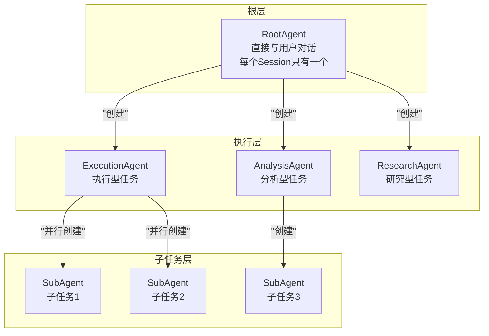
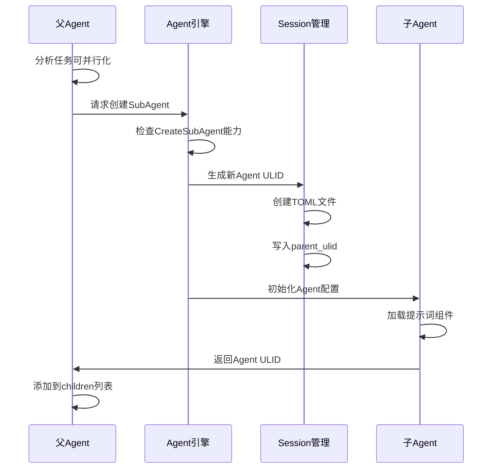
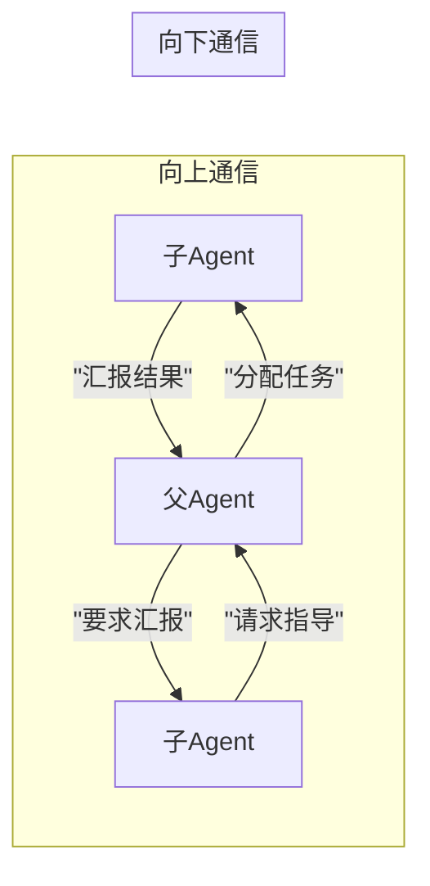
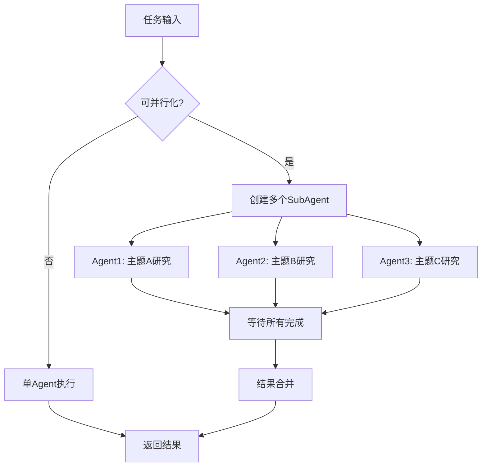
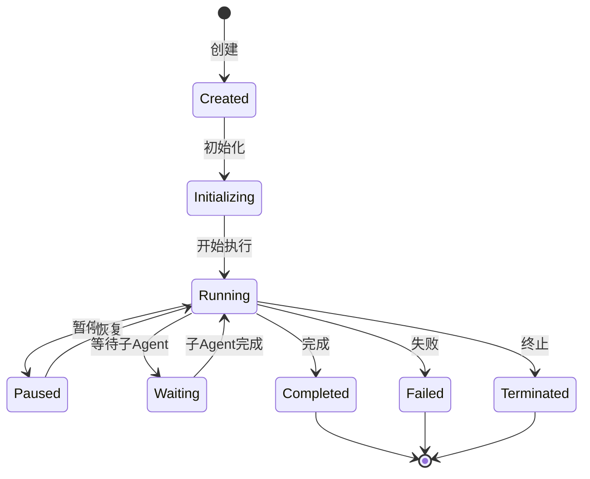
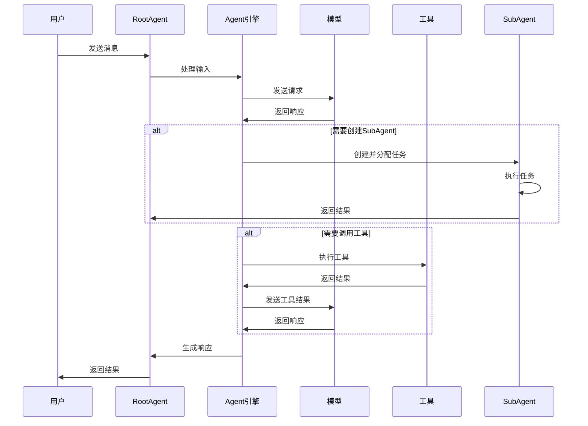

# Agent 执行技术文档

## 概述

Agent 执行模块是 Neco 系统的核心执行引擎，负责智能体的行为控制、任务执行和多智能体协作。采用树形层次结构设计，支持动态 SubAgent 创建和上下级通信。

---

## Agent 树形结构

### 树形层次架构



### 层次说明

#### 1. RootAgent（最上层 Agent）

**特点**：
- 每个 Session 只有一个 RootAgent
- 直接与用户对话
- 负责初始任务分析和分解
- 可创建多个下级 Agent

**标识**：Agent ULID 与 Session ID 相同

#### 2. 中间层 Agent

**类型**：
- **ExecutionAgent**：执行型，专注于代码执行、文件操作等
- **AnalysisAgent**：分析型，专注于需求分析、代码审查等
- **ResearchAgent**：研究型，专注于信息收集、技术调研等
- **ReviewAgent**：审阅型，专注于代码审查、文档审阅等

**特点**：
- 可被 RootAgent 或其他上级 Agent 创建
- 可继续创建下级 Agent
- 负责特定领域的任务

#### 3. 叶子 Agent

**特点**：
- 不再创建下级 Agent
- 专注于单一任务执行
- 完成后向上级汇报

---

## Agent 类型定义

### 类型枚举

```rust
pub enum AgentType {
    Root,       // 最上层Agent，直接与用户对话
    Execution,  // 执行型Agent，只能用于执行
    Analysis,   // 分析型Agent
    Review,     // 审阅型Agent
    Research,   // 研究型Agent
}
```

### 类型特性

| 类型 | 可创建 SubAgent | 可执行工具 | 典型用途 |
|------|----------------|------------|----------|
| Root | 是 | 是 | 用户交互、任务分解 |
| Execution | 可选 | 是 | 代码编写、文件操作 |
| Analysis | 可选 | 是 | 需求分析、架构设计 |
| Review | 否 | 是 | 代码审查、文档审阅 |
| Research | 是 | 是 | 技术调研、信息收集 |

---

## 能力系统

### 能力定义

```rust
pub enum Capability {
    // 智能体管理
    CreateSubAgent,      // 创建下级Agent的能力
    KillSubAgent,        // 终止下级Agent

    // 工具执行
    ToolExecution,       // 执行工具的能力
    ToolAll,            // 执行所有工具（危险）

    // 工作流控制
    WorkflowControl,     // 控制工作流流转
    NodeTransition,      // 触发节点转场

    // 通信能力
    Communication,       // 与上下级通信
    Broadcast,          // 广播消息

    // 模型调用
    ModelQuery,         // 查询模型
    ModelToolCall,      // 调用模型工具
}
```

### 能力检查

每个 Agent 在执行操作前需要检查是否具备相应能力：

1. **创建 SubAgent**：检查 `CreateSubAgent` 能力
2. **执行工具**：检查 `ToolExecution` 能力和具体工具权限
3. **节点转场**：检查 `NodeTransition` 能力
4. **发送消息**：检查 `Communication` 能力

---

## SubAgent 创建机制

### 创建流程



### 创建配置

```rust
pub struct SubAgentConfig {
    pub agent_type: AgentType,           // Agent类型
    pub agent_definition: String,        // Agent定义名称（agents/xxx.md）
    pub model: Option<String>,           // 覆盖模型配置
    pub model_group: Option<String>,     // 覆盖模型组
    pub prompts: Option<Vec<String>>,     // 覆盖提示词组件
    pub capabilities: Vec<Capability>,   // 能力集合
    pub initial_context: Option<String>, // 初始上下文
}
```

### 创建行为

1. **Agent 定义查找**：

   - **优先级 1**：`workflows/<workflow_name>/agents/<agent_name>.md`（工作流特定）
     - 仅在 SubAgent 创建工作于某个工作流节点内时生效
     - 允许工作流自定义特定 Agent 行为
   - **优先级 2**：`~/.config/neco/agents/<agent_name>.md`（全局配置）
     - 用户自定义的 Agent 定义
   - **优先级 3**：内置默认 Agent（系统提供）
     - 当上述路径都找不到时使用的默认实现
   - **同名 Agent 覆盖规则**：高优先级覆盖低优先级
   - **错误处理**：如果所有路径都找不到指定 Agent，返回 AgentNotFound 错误

2. **配置继承与覆盖**：
   - 继承父 Agent 的默认配置
   - 允许覆盖 model、model_group、prompts 等字段
   - 新 Agent 获得独立的能力集合

3. **生命周期绑定**：
   - 子 Agent 生命周期由父 Agent 管理
   - 父 Agent 终止时，子 Agent 自动终止
   - 子 Agent 完成后，结果返回父 Agent

---

## 上下级通信机制

### 通信方式



### 通信工具

#### 1. 汇报工具（子 -> 父）

```rust
// 子Agent向上级汇报执行结果
pub struct ReportToParent {
    pub message: String,           // 汇报内容
    pub status: TaskStatus,        // 任务状态
    pub artifacts: Vec<Artifact>,  // 产出物
}

pub enum TaskStatus {
    InProgress,
    Completed,
    Blocked,
    Failed,
}
```

#### 2. 指导工具（父 -> 子）

```rust
// 父Agent向子Agent发送指导或任务
pub struct GuideSubAgent {
    pub target_agent: AgentUlid,   // 目标子Agent
    pub instruction: String,       // 指导内容
    pub priority: Priority,        // 优先级
}

pub enum Priority {
    Low,
    Normal,
    High,
    Urgent,
}
```

#### 3. 消息传递机制

- **写入方式**：通过 Session 文件追加消息
- **读取方式**：定期轮询或事件通知
- **格式**：标准的 Message 结构，role 字段标识来源

---

## 并行执行模式

### 并行任务分配



### 执行流程

1. **任务分析**：RootAgent 分析任务是否可以并行
2. **子任务划分**：将任务划分为独立的子任务
3. **并行创建**：同时创建多个 SubAgent
4. **独立执行**：每个 SubAgent 独立执行任务
5. **结果收集**：等待所有 SubAgent 完成
6. **结果合并**：汇总各子任务结果
7. **生成响应**：基于汇总结果生成最终响应

### 同步机制

```rust
pub struct ParallelExecution {
    pub subagents: Vec<AgentUlid>,
    pub results: Arc<Mutex<Vec<SubAgentResult>>>,
    pub completion_notifier: broadcast::Sender<()>,
}

pub struct SubAgentResult {
    pub agent_ulid: AgentUlid,
    pub status: CompletionStatus,
    pub output: String,
    pub artifacts: Vec<Artifact>,
}
```

---

## 生命周期管理

### 生命周期状态



### 状态说明

| 状态 | 说明 | 可转换到 |
|------|------|----------|
| Created | 已创建但未初始化 | Initializing |
| Initializing | 正在加载配置和历史 | Running, Failed |
| Running | 正常运行中 | Paused, Waiting, Completed, Failed, Terminated |
| Paused | 暂停执行 | Running, Terminated |
| Waiting | 等待子 Agent 完成 | Running |
| Completed | 正常完成 | - |
| Failed | 执行失败 | - |
| Terminated | 被终止 | - |

### 生命周期事件

```rust
pub enum AgentLifecycleEvent {
    Created { agent_ulid: AgentUlid, parent_ulid: Option<AgentUlid> },
    Initialized { agent_ulid: AgentUlid },
    Started { agent_ulid: AgentUlid },
    Paused { agent_ulid: AgentUlid },
    Resumed { agent_ulid: AgentUlid },
    SubAgentCreated { parent: AgentUlid, child: AgentUlid },
    SubAgentCompleted { parent: AgentUlid, child: AgentUlid },
    Completed { agent_ulid: AgentUlid },
    Failed { agent_ulid: AgentUlid, error: String },
    Terminated { agent_ulid: AgentUlid },
}
```

---

## 执行流程

### 标准执行流程



### 执行步骤

1. **接收输入**：接收用户消息或上级 Agent 任务
2. **加载上下文**：从 Session 加载历史消息
3. **调用模型**：发送请求到 LLM
4. **解析响应**：解析模型返回的响应
5. **处理工具调用**：如有工具调用，执行工具
6. **创建 SubAgent**：如需并行任务，创建 SubAgent
7. **收集结果**：等待 SubAgent 完成并收集结果
8. **生成响应**：整合所有结果生成最终响应
9. **保存状态**：更新 Session 文件

---

## 参考设计模式

### OpenFang 借鉴

#### 1. 能力系统（Capability-Based Security）

```rust
// OpenFang的能力定义示例
pub enum Capability {
    FileRead(String),      // 匹配glob模式
    FileWrite(String),     // 匹配glob模式
    NetConnect(String),    // 连接到特定主机
    ToolInvoke(String),    // 调用特定工具
    AgentSpawn,           // 生成子智能体
    LlmMaxTokens(u64),    // 最大token预算
}
```

**借鉴点**：
- 细粒度的权限控制
- 模式匹配支持（glob）
- 运行时权限检查

#### 2. 审批系统（Risk Level-based）

```rust
pub enum RiskLevel {
    Low,      // 低风险，自动批准
    Medium,   // 中风险，可选审批
    High,     // 高风险，需要审批
    Critical, // 关键风险，必须审批
}
```

**借鉴点**：
- 基于风险等级的审批流程
- 可配置的审批策略
- 超时机制

#### 3. 运行模式（Agent Mode）

```rust
pub enum AgentMode {
    Observe,   // 只读模式
    Assist,    // 受限模式（仅只读工具）
    Full,      // 完全模式
}
```

**借鉴点**：
- 限制 Agent 的操作范围
- 安全沙箱机制

---

## 设计模式

### 1. 组合模式（Composite Pattern）

Agent 树使用组合模式组织：
- 统一处理单个 Agent 和 Agent 组合
- 支持递归操作（如遍历、终止）

### 2. 责任链模式（Chain of Responsibility）

消息处理使用责任链：
- 消息沿着 Agent 树向上传递
- 每个节点可处理或继续传递

### 3. 观察者模式（Observer Pattern）

生命周期事件使用观察者：
- 订阅 Agent 生命周期事件
- 事件发生时通知观察者

### 4. 策略模式（Strategy Pattern）

Agent 类型使用策略模式：
- 不同类型 Agent 有不同执行策略
- 可动态切换执行策略

---

*本文档遵循 REQUIREMENT.md 中 SubAgent 模式和上下级协作相关需求设计。*
