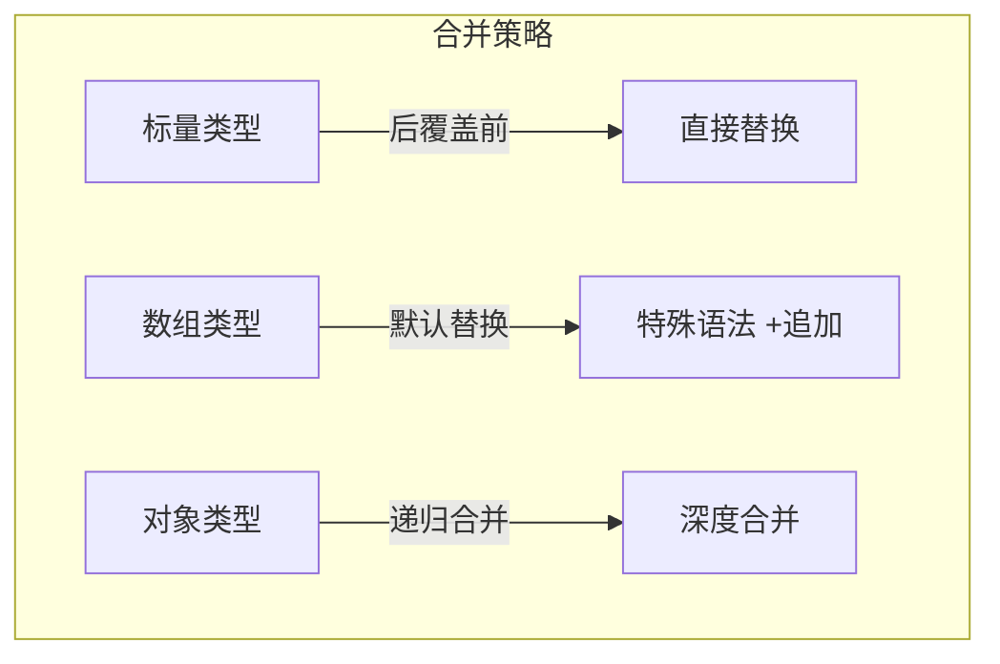
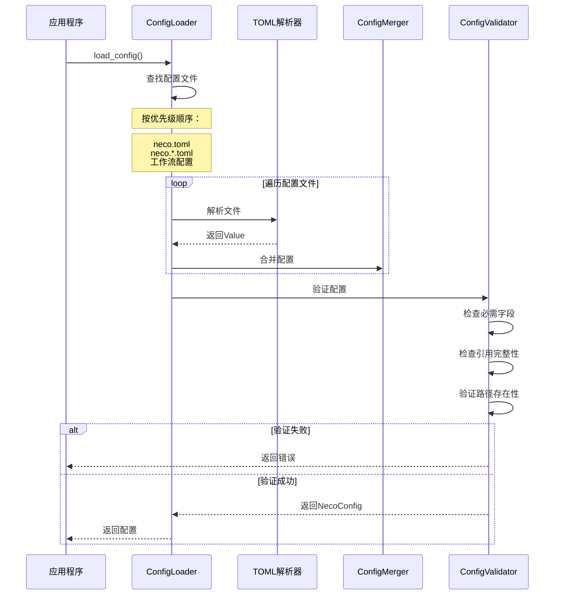
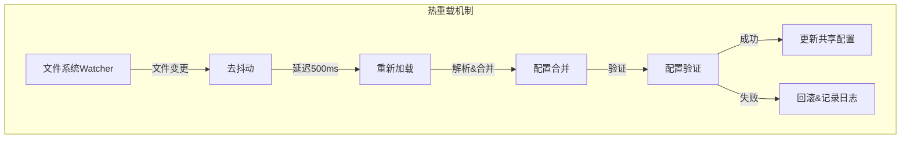

# TECH-CONFIG: 配置管理模块

本文档描述Neco项目的配置管理模块设计，包括配置加载、合并策略和访问接口。

## 1. 模块概述

配置管理模块负责加载、验证和提供所有配置数据。配置分为静态配置（用户定义）和动态配置（运行时）。

## 2. 配置来源

### 2.1 配置目录结构

```
~/.config/neco/                    # 主配置目录
├── neco.toml                     # 主配置文件
├── neco.<tag>.toml               # 带标签的配置文件
├── prompts/
│   ├── base.md                   # 基础提示词组件
│   └── multi-agent.md            # 多智能体提示词
├── agents/
│   ├── coder.md                  # Agent定义
│   └── reviewer.md
├── skills/                       # Skills目录
└── workflows/
    └── prd/
        ├── workflow.toml         # 工作流定义
        ├── neco.toml             # 工作流特定配置
        └── agents/
            └── review.md         # 工作流特定Agent
```

### 2.2 配置优先级

```mermaid
graph BT
    subgraph "优先级从高到低"
        A[环境变量]
        B[命令行参数]
        C[工作流特定配置]
        D[带标签配置 neco.<tag>.toml]
        E[主配置 neco.toml]
        F[内置默认值]
    end
    
    A > B > C > D > E > F
```

## 3. 数据结构设计

### 3.1 配置根结构

```rust
/// 完整配置结构
pub struct NecoConfig {
    /// 模型组定义
    pub model_groups: HashMap<String, ModelGroup>,
    
    /// 模型提供商定义
    pub model_providers: HashMap<String, ModelProvider>,
    
    /// MCP服务器定义
    pub mcp_servers: HashMap<String, McpServer>,
    
    /// 系统配置
    pub system: SystemConfig,
    
    /// 配置来源追踪（用于调试）
    _sources: ConfigSources,
}

/// 配置来源追踪
struct ConfigSources {
    files: Vec<PathBuf>,
    env_vars: HashMap<String, String>,
}
```

### 3.2 模型组配置

```rust
/// 模型组：用于故障转移和负载均衡
pub struct ModelGroup {
    /// 模型标识符列表（按优先级排序）
    /// 格式: "provider/model" 或 "provider/model?param=value"
    pub models: Vec<String>,
}

/// 模型标识符解析
pub struct ModelRef {
    /// 提供商ID
    pub provider_id: String,
    /// 模型名称
    pub model_name: String,
    /// 调用参数（覆盖默认值）
    pub params: HashMap<String, String>,
}

impl FromStr for ModelRef {
    type Err = ConfigError;
    
    fn from_str(s: &str) -> Result<Self, Self::Err> {
        // TODO: 实现 ModelRef 的解析逻辑
        // 解析格式: "provider/model?temperature=0.1&reasoning_effort=high"
        // 1. 分割查询字符串和路径部分
        // 2. 分割提供商ID和模型名称
        // 3. 解析查询参数到 HashMap
        // 4. 返回 ModelRef 实例
        unimplemented!()
    }
}
```

### 3.3 模型提供商配置

```rust
/// 模型提供商配置
pub struct ModelProvider {
    /// 提供商类型（决定如何调用）
    pub provider_type: ProviderType,
    
    /// 显示名称
    pub name: String,
    
    /// API基础URL
    pub base_url: Url,
    
    /// API密钥配置
    pub api_key: ApiKeyConfig,
    
    /// 默认请求参数
    pub default_params: HashMap<String, Value>,
    
    /// 超时配置
    pub timeout: Duration,
    
    /// 重试配置
    pub retry: RetryConfig,
}

/// 提供商类型
pub enum ProviderType {
    /// OpenAI兼容API
    OpenAI,
    /// Anthropic API
    Anthropic,
    /// OpenRouter API
    OpenRouter,
    /// OpenAI Responses API（预留）
    OpenAIResponses,
}

/// API密钥配置（三种方式，优先级从高到低）
pub enum ApiKeyConfig {
    /// 单个环境变量
    Env(String),
    /// 多个环境变量（轮询使用）
    EnvList(Vec<String>),
    /// 直接写入（不推荐，仅用于测试）
    Direct(SecretString),
}

impl ApiKeyConfig {
    /// 获取API密钥
    pub fn get_key(&self) -> Result<SecretString, ConfigError> {
        // TODO: 实现API密钥获取逻辑
        // 1. 根据配置类型（单环境变量、环境变量列表、直接值）
        // 2. 尝试获取环境变量或使用直接值
        // 3. 返回 SecretString 或错误
        match self {
            ApiKeyConfig::Env(var) => {
                // TODO: 从环境变量获取密钥
                unimplemented!()
            },
            ApiKeyConfig::EnvList(vars) => {
                // TODO: 遍历环境变量列表，找到第一个可用的
                unimplemented!()
            },
            ApiKeyConfig::Direct(key) => Ok(key.clone()),
        }
    }
}

/// 重试配置
pub struct RetryConfig {
    /// 最大重试次数
    pub max_retries: u32,
    /// 初始退避时间
    pub initial_backoff: Duration,
    /// 退避乘数
    pub backoff_multiplier: f64,
    /// 最大退避时间
    pub max_backoff: Duration,
}

impl Default for RetryConfig {
    fn default() -> Self {
        // TODO: 设置合理的重试默认值
        Self {
            max_retries: 3,
            initial_backoff: Duration::from_secs(1),
            backoff_multiplier: 2.0,
            max_backoff: Duration::from_secs(4),
        }
    }
}
```

### 3.4 MCP服务器配置

```rust
/// MCP服务器配置
pub struct McpServer {
    /// 传输类型
    pub transport: McpTransport,
    
    /// 环境变量
    pub env: HashMap<String, String>,
    
    /// 服务器状态（运行时填充）
    #[serde(skip)]
    pub status: ServerStatus,
}

/// MCP传输方式
pub enum McpTransport {
    /// 本地stdio传输
    Stdio {
        /// 命令
        command: String,
        /// 参数
        args: Vec<String>,
    },
    /// HTTP传输
    Http {
        /// 服务器URL
        url: Url,
        /// Bearer Token环境变量名
        bearer_token_env: Option<String>,
        /// 额外HTTP头
        headers: HashMap<String, String>,
    },
}

impl McpServer {
    /// 判断是否使用stdio模式
    pub fn is_stdio(&self) -> bool {
        // TODO: 检查传输类型是否为 Stdio
        // 使用模式匹配判断 transport 类型
        unimplemented!()
    }
    
    /// 获取bearer token（HTTP模式）
    pub fn get_bearer_token(&self) -> Option<String> {
        // TODO: 获取HTTP模式的bearer token
        // 1. 检查传输类型是否为Http
        // 2. 如果有bearer_token_env环境变量，尝试获取其值
        // 3. 返回token或None
        unimplemented!()
    }
}
```

### 3.5 系统配置

```rust
/// 系统级配置
pub struct SystemConfig {
    /// 存储配置
    pub storage: StorageConfig,
    
    /// 上下文压缩配置
    pub context: ContextConfig,
    
    /// 工具配置
    pub tools: ToolsConfig,
    
    /// UI配置
    pub ui: UiConfig,
}

/// 存储配置
pub struct StorageConfig {
    /// Session存储目录
    pub session_dir: PathBuf,
    /// 是否启用压缩
    pub compression: bool,
}

/// 上下文配置
pub struct ContextConfig {
    /// 自动压缩阈值（上下文窗口百分比）
    pub auto_compact_threshold: f64,
    /// 是否启用自动压缩
    pub auto_compact_enabled: bool,
}

/// 工具配置
pub struct ToolsConfig {
    /// 超时配置（按工具前缀匹配）
    pub timeouts: HashMap<String, Duration>,
    /// 默认超时
    pub default_timeout: Duration,
}

impl ToolsConfig {
    /// 获取工具超时（最长前缀匹配）
    pub fn get_timeout(&self, tool_id: &str) -> Duration {
        // TODO: 实现工具超时获取逻辑
        // 1. 遍历所有timeout前缀配置
        // 2. 找到与tool_id匹配的最长前缀
        // 3. 返回对应的超时时间，若无匹配则返回默认超时
        unimplemented!()
    }
}

/// UI配置
pub struct UiConfig {
    /// 默认运行模式
    pub default_mode: RunMode,
}

pub enum RunMode {
    Direct,
    Repl,
    Daemon,
}
```

## 4. 配置合并策略

### 4.1 合并规则



**详细规则：**

| 类型 | 策略 | 示例 |
|-----|------|------|
| 标量（字符串、数字、布尔） | 后覆盖前 | `name = "new"` 覆盖旧值 |
| 数组 | 后替换前 | `models = ["a", "b"]` 完全替换 |
| 数组追加 | 特殊语法 `+` | `models = ["+c", "+d"]` 追加元素 |
| 对象 | 递归深度合并 | 字段级合并，子对象递归 |

### 4.2 合并实现

```rust
/// 配置合并器
pub struct ConfigMerger;

impl ConfigMerger {
    /// 合并两个配置值
    pub fn merge(base: &mut Value, override_: Value) {
        // TODO: 实现配置合并逻辑
        // 1. 处理对象类型的递归合并
        // 2. 处理数组类型的特殊追加语法（+前缀）
        // 3. 处理标量类型的直接替换
        unimplemented!()
    }
}
```

## 5. 配置加载流程

### 5.1 加载时序



### 5.2 配置验证

```rust
/// 配置验证器
pub struct ConfigValidator;

impl ConfigValidator {
    /// 验证完整配置
    pub fn validate(config: &NecoConfig) -> Result<(), ConfigError> {
        // TODO: 实现配置验证逻辑
        // 1. 验证模型组引用有效性
        // 2. 验证提供商配置
        // 3. 验证MCP服务器配置
        // 4. 验证目录存在性
        unimplemented!()
    }
    
    fn validate_model_groups(config: &NecoConfig) -> Result<(), ConfigError> {
        // TODO: 实现模型组验证逻辑
        // 1. 遍历所有模型组
        // 2. 验证每个模型引用的格式和有效性
        // 3. 检查引用的提供商是否存在
        unimplemented!()
    }
    
    fn validate_providers(config: &NecoConfig) -> Result<(), ConfigError> {
        // TODO: 实现提供商验证逻辑
        // 1. 遍历所有模型提供商
        // 2. 验证API密钥可访问性
        // 3. 记录警告而非错误（非阻塞）
        unimplemented!()
    }
}
```

## 6. 热重载支持

### 6.1 热重载流程



### 6.2 线程安全配置访问

```rust
/// 线程安全的配置管理器
pub struct ConfigManager {
    /// 当前配置（读写锁）
    config: RwLock<Arc<NecoConfig>>,
    /// 配置变更通知
    change_tx: broadcast::Sender<ConfigChange>,
}

impl ConfigManager {
    /// 获取当前配置（只读）
    pub fn get_config(&self) -> Arc<NecoConfig> {
        // TODO: 实现线程安全的配置获取
        // 1. 获取读锁
        // 2. 克隆配置
        // 3. 释放锁并返回
        unimplemented!()
    }
    
    /// 更新配置（热重载）
    pub fn update_config(&self, new_config: NecoConfig) -> Result<(), ConfigError> {
        // TODO: 实现配置热重载逻辑
        // 1. 验证新配置
        // 2. 计算配置差异
        // 3. 更新内部配置
        // 4. 通知订阅者变更
        unimplemented!()
    }
    
    /// 订阅配置变更
    pub fn subscribe_changes(&self) -> broadcast::Receiver<ConfigChange> {
        // TODO: 实现配置变更订阅功能
        // 返回变更通知的广播接收器
        unimplemented!()
    }
}

/// 配置变更通知
pub struct ConfigChange {
    pub changes: Vec<ConfigDiff>,
}

pub enum ConfigDiff {
    ModelGroupAdded(String),
    ModelGroupRemoved(String),
    ModelProviderChanged(String),
    McpServerAdded(String),
    McpServerRemoved(String),
}
```

## 7. 使用示例

### 7.1 TOML配置示例

```toml
# neco.toml - 主配置文件

# 模型组定义
[model_groups.frontier]
models = ["zhipuai/glm-4.7"]

[model_groups.smart]
models = ["zhipuai/glm-4.7?reasoning_effort=high"]

[model_groups.balanced]
models = ["zhipuai/glm-4.7", "minimax-cn/MiniMax-M2.5"]

# 模型提供商定义
[model_providers.zhipuai]
type = "openai"
name = "ZhipuAI"
base_url = "https://open.bigmodel.cn/api/paas/v4"
api_key_env = "ZHIPU_API_KEY"

[model_providers.zhipuai.retry]
max_retries = 3
initial_backoff = 1
backoff_multiplier = 2

# MCP服务器定义
[mcp_servers.context7]
command = "npx"
args = ["-y", "@upstash/context7-mcp"]

[mcp_servers.context7.env]
MY_ENV_VAR = "MY_ENV_VALUE"

[mcp_servers.figma]
url = "https://mcp.figma.com/mcp"
bearer_token_env = "FIGMA_OAUTH_TOKEN"
http_headers = { "X-Figma-Region" = "us-east-1" }

# 系统配置
[system]

[system.storage]
session_dir = "~/.local/neco"
compression = true

[system.context]
auto_compact_threshold = 0.9
auto_compact_enabled = true

[system.tools]
default_timeout = 30

[system.tools.timeouts]
"fs" = 10
"fs::read" = 5
"mcp" = 60
```

### 7.2 代码使用示例

```rust
use neco_config::{ConfigLoader, ConfigManager};

// TODO: 实现配置加载和使用逻辑
// 1. 创建配置加载器并指定配置目录
// 2. 加载配置文件并处理错误
// 3. 访问模型组、提供商等配置项
// 4. 解析模型引用并获取提供商信息
// 5. 获取API密钥和工具超时等运行时配置

// TODO: 代码示例实现
```

## 8. 错误类型

```rust
#[derive(Debug, Error)]
pub enum ConfigError {
    #[error("配置文件未找到: {0}")]
    FileNotFound(PathBuf),
    
    #[error("TOML解析错误: {0}")]
    ParseError(#[from] toml::de::Error),
    
    #[error("无效的模型引用 '{model}' 在组 '{group}'")]
    InvalidModelRef {
        group: String,
        model: String,
        source: ParseError,
    },
    
    #[error("提供商未找到: {provider} (在组 {group} 中引用)")]
    ProviderNotFound {
        group: String,
        provider: String,
    },
    
    #[error("环境变量未找到: {0}")]
    EnvVarNotFound(String),
    
    #[error("没有可用的环境变量")]
    NoEnvVarFound,
    
    #[error("配置验证失败: {0}")]
    ValidationError(String),
    
    #[error("热重载失败，已回滚")]
    HotReloadFailed,
}
```

---

*关联文档：*
- [TECH.md](TECH.md) - 总体架构文档
- [TECH-MODEL.md](TECH-MODEL.md) - 模型服务模块
- [TECH-SESSION.md](TECH-SESSION.md) - Session管理模块