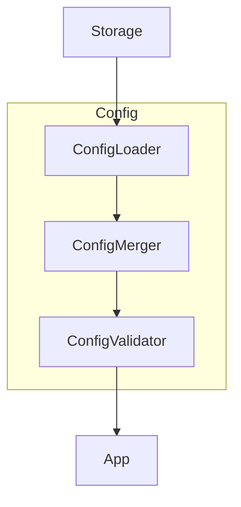
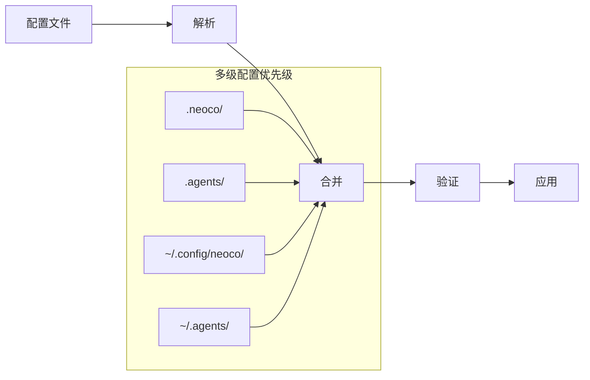
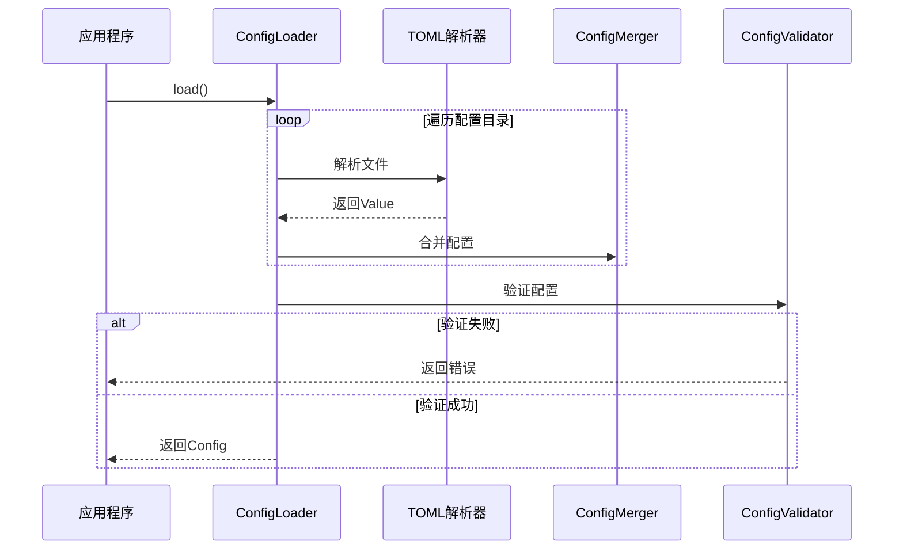

# TECH-CONFIG: 配置管理模块

本文档描述NeoCo项目的配置管理模块设计，采用类型安全的配置结构。

## 模块架构图



## 1. 模块概述

配置管理模块负责加载、验证和提供所有配置数据。

**设计原则：**
- 类型安全的配置结构
- 编译期配置验证
- 统一的配置加载器

## 2. 配置来源

### 2.1 配置目录结构

NeoCo 支持多级配置目录，按优先级从高到低：

1. **当前项目配置**：`.neoco/` 目录
2. **当前项目配置**：`.agents/` 目录
3. **主配置目录**：`~/.config/neoco/`
4. **通用配置目录**：`~/.agents/`

```
# 优先级从高到低

.neoco/                          # 当前项目 .neoco（最高）
├── neoco.toml
├── prompts/
├── agents/
├── skills/
└── workflows/

.agents/                        # 当前项目 .agents
├── prompts/
├── agents/
├── skills/
└── workflows/

~/.config/neoco/                 # 主配置目录
├── neoco.toml
├── neoco.<tag>.toml
├── prompts/
├── agents/
├── skills/
└── workflows/

~/.agents/                      # 通用配置目录（最低）
├── prompts/
├── agents/
├── skills/
└── workflows/
```

### 2.2 Agent查找优先级

工作流中的Agent定义查找优先级（从高到低）：

1. **最高优先级**：`workflows/<workflow_id>/agents/<agent_id>.md`（工作流特定配置）
2. **次优先**：`.neoco/agents/<agent_id>.md`（当前项目 .neoco）
3. **次优先**：`.agents/agents/<agent_id>.md`（当前项目 .agents）
4. **次后备**：`~/.config/neoco/agents/<agent_id>.md`（全局主配置）
5. **最后后备**：`~/.agents/agents/<agent_id>.md`（全局通用配置）

> 注：工作流特定配置优先级最高，体现"工作流目录 > 配置目录"规则

## 3. 配置数据结构

### 3.1 完整配置

```rust
/// 完整配置（根结构）
#[derive(Debug, Clone, Serialize, Deserialize)]
pub struct Config {
    pub model_groups: ModelGroups,
    pub model_providers: ModelProviders,
    pub mcp_servers: McpServers,
    pub system: SystemConfig,
}

/// 模型组配置
/// 格式示例：
/// [model_groups.frontier]
/// models = ["zhipuai/glm-4.7"]
/// [model_groups.smart]
/// models = ["zhipuai/glm-4.7?reasoning_effort=high"]
#[derive(Debug, Clone, Default, Serialize, Deserialize)]
pub struct ModelGroups(HashMap<String, ModelGroup>);

impl ModelGroups {
    pub fn get(&self, key: &str) -> Option<&ModelGroup> {
        self.0.get(key)
    }
    
    pub fn insert(&mut self, key: String, value: ModelGroup) -> Option<ModelGroup> {
        self.0.insert(key, value)
    }
    
    pub fn iter(&self) -> impl Iterator<Item = (&String, &ModelGroup)> {
        self.0.iter()
    }
}

impl std::ops::Deref for ModelGroups {
    type Target = HashMap<String, ModelGroup>;
    
    fn deref(&self) -> &Self::Target {
        &self.0
    }
}

#[derive(Debug, Clone, Serialize, Deserialize)]
pub struct ModelGroup {
    /// 模型列表，支持字符串数组格式
    /// 格式：["provider/model", "provider/model?param=value"]
    /// 追加语法：["+new-model"] 表示追加而非替换
    pub models: Vec<String>,
}

impl ModelGroup {
    pub fn parse_model_string(s: &str) -> Result<(&str, HashMap<String, String>), ConfigError> {
        // 格式：provider/model?param=value
        // TODO(#??): 实现解析逻辑
        unimplemented!()
    }
}

/// 模型组引用
#[derive(Debug, Clone, Serialize, Deserialize)]
pub struct ModelGroupRef(String);

impl ModelGroupRef {
    pub fn new(s: impl Into<String>) -> Self {
        Self(s.into())
    }
    
    pub fn as_str(&self) -> &str {
        &self.0
    }
}

impl Default for ModelGroupRef {
    fn default() -> Self {
        Self("fast".to_string())
    }
}

impl std::ops::Deref for ModelGroupRef {
    type Target = str;
    fn deref(&self) -> &Self::Target {
        &self.0
    }
}

/// 模型提供商配置
/// 格式示例：
/// [model_providers.zhipuai]
/// type = "openai"
/// name = "ZhipuAI"
/// base = "https://open.bigmodel.cn/api/paas/v4"
/// api_key_env = "ZHIPU_API_KEY"
/// 
/// [model_providers.minimax-cn]
/// type = "openai"
/// name = "MiniMax (CN)"
/// base = "https://api.minimaxi.com/v1"
/// api_key_envs = ["MINIMAX_API_KEY", "MINIMAX_API_KEY_2"]
#[derive(Debug, Clone, Default, Serialize, Deserialize)]
pub struct ModelProviders(HashMap<String, ModelProvider>);

impl ModelProviders {
    pub fn get(&self, key: &str) -> Option<&ModelProvider> {
        self.0.get(key)
    }
    
    pub fn insert(&mut self, key: String, value: ModelProvider) -> Option<ModelProvider> {
        self.0.insert(key, value)
    }
}

impl std::ops::Deref for ModelProviders {
    type Target = HashMap<String, ModelProvider>;
    
    fn deref(&self) -> &Self::Target {
        &self.0
    }
}

#[derive(Debug, Clone, Serialize, Deserialize)]
pub struct ModelProvider {
    #[serde(rename = "type")]
    pub provider_type: ProviderType,
    pub name: String,
    /// API基础URL
    pub base: String,
    /// API密钥（环境变量名）
    #[serde(default)]
    pub api_key_env: Option<String>,
    /// API密钥列表（多个环境变量，轮询使用）
    #[serde(default, rename = "api_key_envs")]
    pub api_key_envs: Vec<String>,
    /// 直接嵌入的API密钥（不推荐）
    #[serde(default)]
    pub api_key: Option<String>,
    #[serde(default)]
    pub default_params: HashMap<String, Value>,
    #[serde(default)]
    pub retry: RetryConfig,
    #[serde(default)]
    pub timeout: Option<Duration>,
}

impl ModelProvider {
    /// 获取API密钥，按优先级：api_key_env > api_key_envs > api_key
    pub fn resolve_api_key(&self) -> Result<SecretString, ConfigError> {
        // TODO(#??): 实现解析逻辑
        // 优先级：api_key_env > api_key_envs > api_key
        unimplemented!()
    }
}

#[derive(Debug, Clone, Copy, PartialEq, Eq, Serialize, Deserialize)]
pub enum ProviderType {
    #[serde(rename = "openai")]
    OpenAI,
    #[serde(rename = "anthropic")]
    Anthropic,
    #[serde(rename = "openrouter")]
    OpenRouter,
}

/// 重试配置
#[derive(Debug, Clone, Serialize, Deserialize)]
pub struct RetryConfig {
    #[serde(default = "default_max_retries")]
    pub max_retries: u32,
    #[serde(default)]
    pub initial_backoff: Duration,
    #[serde(default = "default_backoff_multiplier")]
    pub backoff_multiplier: f64,
    #[serde(default)]
    pub max_backoff: Duration,
}

fn default_max_retries() -> u32 { 3 }
fn default_backoff_multiplier() -> f64 { 2.0 }

impl Default for RetryConfig {
    fn default() -> Self {
        Self {
            max_retries: 3,
            initial_backoff: Duration::from_secs(1),
            backoff_multiplier: 2.0,
            max_backoff: Duration::from_secs(4),
        }
    }
}

/// MCP服务器配置
/// 格式示例（本地stdio形式）：
/// [mcp_servers.context7]
/// command = "npx"
/// args = ["-y", "@upstash/context7-mcp"]
/// env = { MY_ENV_VAR = "MY_ENV_VALUE" }
/// 
/// 格式示例（HTTP形式）：
/// [mcp_servers.figma]
/// url = "https://mcp.figma.com/mcp"
/// bearer_token_env = "FIGMA_OAUTH_TOKEN"
/// http_headers = { "X-Figma-Region" = "us-east-1" }
#[derive(Debug, Clone, Default, Serialize, Deserialize)]
pub struct McpServers(HashMap<String, McpServerConfig>);

impl McpServers {
    pub fn get(&self, key: &str) -> Option<&McpServerConfig> {
        self.0.get(key)
    }
    
    pub fn insert(&mut self, key: String, value: McpServerConfig) -> Option<McpServerConfig> {
        self.0.insert(key, value)
    }
}

impl std::ops::Deref for McpServers {
    type Target = HashMap<String, McpServerConfig>;
    
    fn deref(&self) -> &Self::Target {
        &self.0
    }
}

#[derive(Debug, Clone, Serialize, Deserialize)]
pub struct McpServerConfig {
    /// Stdio模式：命令
    #[serde(default)]
    pub command: Option<String>,
    /// Stdio模式：命令参数
    #[serde(default)]
    pub args: Option<Vec<String>>,
    /// Stdio模式：环境变量
    #[serde(default)]
    pub env: HashMap<String, String>,
    /// HTTP模式：URL
    #[serde(default)]
    pub url: Option<String>,
    /// HTTP模式：Bearer Token环境变量名
    #[serde(default, rename = "bearer_token_env")]
    pub bearer_token_env: Option<String>,
    /// HTTP模式：自定义请求头
    #[serde(default, rename = "http_headers")]
    pub http_headers: HashMap<String, String>,
}
```

### 3.2 系统配置

```rust
/// 系统配置
#[derive(Debug, Clone, Serialize, Deserialize)]
pub struct SystemConfig {
    pub storage: StorageConfig,
    pub context: ContextConfig,
    pub tools: ToolsConfig,
    pub ui: UiConfig,
}

#[derive(Debug, Clone, Serialize, Deserialize)]
pub struct StorageConfig {
    pub session_dir: PathBuf,
    #[serde(default = "default_compression")]
    pub compression: bool,
}

fn default_compression() -> bool { true }

#[derive(Debug, Clone, Serialize, Deserialize)]
pub struct ContextConfig {
    #[serde(default = "default_compact_threshold")]
    pub auto_compact_threshold: f64,
    #[serde(default = "default_true")]
    pub auto_compact_enabled: bool,
    #[serde(default)]
    pub compact_model_group: ModelGroupRef,
    #[serde(default = "default_keep_recent_messages")]
    pub keep_recent_messages: usize,
}

fn default_compact_threshold() -> f64 { 0.9 }
fn default_true() -> bool { true }
fn default_keep_recent_messages() -> usize { 10 }

#[derive(Debug, Clone, Serialize, Deserialize)]
pub struct ToolsConfig {
    #[serde(default)]
    pub timeouts: HashMap<String, Duration>,
    #[serde(default = "default_tool_timeout")]
    pub default_timeout: Duration,
}

fn default_tool_timeout() -> Duration { Duration::from_secs(10) }

#[derive(Debug, Clone, Serialize, Deserialize)]
pub struct UiConfig {
    #[serde(default)]
    pub default_mode: RunMode,
}

#[derive(Debug, Clone, Copy, Default, Serialize, Deserialize)]
#[serde(rename_all = "lowercase")]
pub enum RunMode {
    /// TUI交互模式（默认）：不提供参数时启动
    #[default]
    Tui,
    /// CLI直接模式：使用 -m/--message 参数启动
    Cli,
    /// 后台守护进程模式：使用 daemon 子命令启动
    Daemon,
}
```

## 4. 配置数据流

### 4.1 完整流程

配置数据从源到应用的完整处理流程如下：



### 4.2 优先级处理逻辑

多级配置按以下优先级处理（从高到低）：

1. **当前项目 `.neoco/`** - 最高优先级，用于项目特定配置
2. **当前项目 `.agents/`** - 项目级通用配置
3. **`~/.config/neoco/`** - 用户主配置目录
4. **`~/.agents/`** - 最低优先级，通用默认配置

**合并规则：**
- 高优先级配置覆盖低优先级相同键
- 数组类型采用替换而非合并
  - 字符串数组：如需追加而非替换，使用特殊语法 `"+<item>"`（例如 `models = ["+new-model"]`）
  - 对象数组：使用 TOML 内联表语法追加对象（例如 `models = [+{ provider = "openai", name = "gpt-5.2" }]`）
  - 转义：以 `+` 开头的字符串值需使用 `++` 前缀表示字面值（例如 `models = [++my-value]` 表示值为 `+my-value`）
- 嵌套对象采用深度合并

**格式优先级：**
- TOML格式（`.toml`）始终优先于YAML格式（`.yaml`）
- 整体加载顺序（从先到后）：`neoco.yaml` → `neoco.<tag>.yaml` → `neoco.toml` → `neoco.<tag>.toml`
  - 先加载的配置被后加载的覆盖，因此优先级为：`neoco.toml` > `neoco.<tag>.toml` > `neoco.yaml` > `neoco.<tag>.yaml`
  - 带标签的配置按`<tag>`数字/字母顺序依次加载

## 5. 配置加载器

### 5.1 配置加载流程



### 5.2 ConfigSource Trait

配置源抽象，允许扩展不同的配置来源：

```rust
pub trait ConfigSource: Send + Sync {
    fn load(&self) -> Result<Config, ConfigError>;
    fn watch(&self) -> Result<Box<dyn Stream<Item = Result<Config, ConfigError>> + Send>, ConfigError>;
}
```

### 5.3 配置加载器实现

```rust
pub struct ConfigLoader {
    config_dirs: Vec<PathBuf>,
    cache: std::sync::OnceLock<Config>,
}

impl ConfigLoader {
    pub fn new() -> Self {
        let dirs = vec![
            PathBuf::from(".neoco"),
            PathBuf::from(".agents"),
            dirs::config_dir().unwrap_or_default().join("neoco"),
            dirs::home_dir().unwrap_or_default().join(".agents"),
        ];
        Self { 
            config_dirs: dirs,
            cache: std::sync::OnceLock::new(),
        }
    }
    
    pub fn with_dirs(dirs: Vec<PathBuf>) -> Self {
        Self {
            config_dirs: dirs,
            cache: std::sync::OnceLock::new(),
        }
    }
    
    pub fn load(&self) -> Result<&Config, ConfigError> {
        // 使用OnceLock缓存配置，首次加载后复用
        self.cache.get_or_try_init(|| {
            // TODO(#??): 实现配置加载逻辑
            // 1. 查找所有配置文件
            // 2. 按优先级解析和合并
            // 3. 验证配置
            // 4. 返回Config
            unimplemented!()
        })
    }
    
    pub fn load_workflow_config(&self, workflow_dir: &Path) -> Result<Config, ConfigError> {
        // TODO(#??): 加载工作流特定配置
        unimplemented!()
    }
}
```

### 4.3 配置验证

```rust
pub struct ConfigValidator;

impl ConfigValidator {
    pub fn validate(config: &Config) -> Result<(), ConfigError> {
        // 验证模型组
        Self::validate_model_groups(config)?;
        // 验证提供商
        Self::validate_providers(config)?;
        // 验证MCP服务器
        Self::validate_mcp_servers(config)?;
        
        Ok(())
    }
    
    fn validate_model_groups(config: &Config) -> Result<(), ConfigError> {
        // [TODO] 实现要点说明
        // 1. 遍历所有模型组，检查每个组是否有模型
        // 2. 检查模型引用的 provider 是否在 model_providers 中存在
        // 3. 如果模型组为空，返回 ValidationError
        // 4. 如果 provider 不存在，返回包含 provider 名称和模型组名称的错误信息
        unimplemented!()
    }
    
    fn validate_providers(config: &Config) -> Result<(), ConfigError> {
        // [TODO] 实现要点说明
        // 1. 遍历所有模型提供商配置
        // 2. 调用 provider.resolve_api_key() 验证 API 密钥是否可获取（优先级：api_key_env > api_key_envs > api_key）
        // 3. 验证 base 是否有有效的主机名
        // 4. 返回对应的验证错误信息
        unimplemented!()
    }
    
    fn validate_mcp_servers(config: &Config) -> Result<(), ConfigError> {
        // [TODO] 实现要点说明
        // 1. 遍历所有 MCP 服务器配置
        // 2. 验证 Stdio 类型：检查 command 是否存在
        // 3. 验证 Http 类型：检查 url 是否有效
        // 4. 返回对应的验证错误信息
        unimplemented!()
    }
}
```

## 5. 配置示例

```toml
# neoco.toml

# 模型组定义（字符串数组格式）
[model_groups.frontier]
models = ["zhipuai/glm-4.7"]

[model_groups.smart]
models = ["zhipuai/glm-4.7?reasoning_effort=high"]

[model_groups.review]
models = ["zhipuai/glm-4.7?reasoning_effort=high&temperature=0.1"]

[model_groups.balanced]
models = ["zhipuai/glm-4.7", "minimax-cn/MiniMax-M2.5"]

[model_groups.fast]
models = ["zhipuai/glm-4.7-flashx"]

[model_groups.image]
models = ["zhipuai/glm-4.6v"]

# 模型提供商配置（扁平结构）
[model_providers.zhipuai]
type = "openai"
name = "ZhipuAI"
base = "https://open.bigmodel.cn/api/paas/v4"
api_key_env = "ZHIPU_API_KEY"

[model_providers.zhipuai-coding-plan]
type = "openai"
name = "ZhipuAI Coding Plan"
base = "https://open.bigmodel.cn/api/coding/paas/v4"
api_key_env = "ZHIPU_API_KEY"

[model_providers.minimax-cn]
type = "openai"
name = "MiniMax (CN)"
base = "https://api.minimaxi.com/v1"
api_key_envs = ["MINIMAX_API_KEY", "MINIMAX_API_KEY_2"]

# MCP服务器配置（本地stdio形式，扁平结构）
[mcp_servers.context7]
command = "npx"
args = ["-y", "@upstash/context7-mcp"]
env = { MY_ENV_VAR = "MY_ENV_VALUE" }

# MCP服务器配置（HTTP形式）
[mcp_servers.figma]
url = "https://mcp.figma.com/mcp"
bearer_token_env = "FIGMA_OAUTH_TOKEN"
http_headers = { "X-Figma-Region" = "us-east-1" }

# 数组追加语法示例
# models = ["+new-model"]  # 追加而非替换

[system]
[system.storage]
session_dir = "~/.local/neoco"
compression = true

[system.context]
auto_compact_threshold = 0.9
auto_compact_enabled = true
compact_model_group = "fast"
keep_recent_messages = 10

[system.tools]
default_timeout = { secs = 10, nanos = 0 }
timeouts = { "fs" = { secs = 10, nanos = 0 }, "mcp" = { secs = 60, nanos = 0 } }

[system.ui]
default_mode = "tui"
```

## 6. 错误类型

```rust
#[derive(Debug, Error)]
pub enum ConfigError {
    #[error("配置文件未找到: {0}")]
    FileNotFound(PathBuf),
    
    #[error("解析错误: {0}")]
    ParseError(#[source] toml::de::Error),
    
    #[error("验证失败: {0}")]
    ValidationError(String),
    
    #[error("环境变量未找到: {0}")]
    EnvVarNotFound(String),
    
    #[error("没有可用的环境变量")]
    NoEnvVarFound,
    
    #[error("热重载失败")]
    HotReloadFailed,
}
```

---

*关联文档：*
- [TECH.md](TECH.md) - 总体架构文档
- [TECH-MODEL.md](TECH-MODEL.md) - 模型服务模块
- [TECH-SESSION.md](TECH-SESSION.md) - Session管理模块
