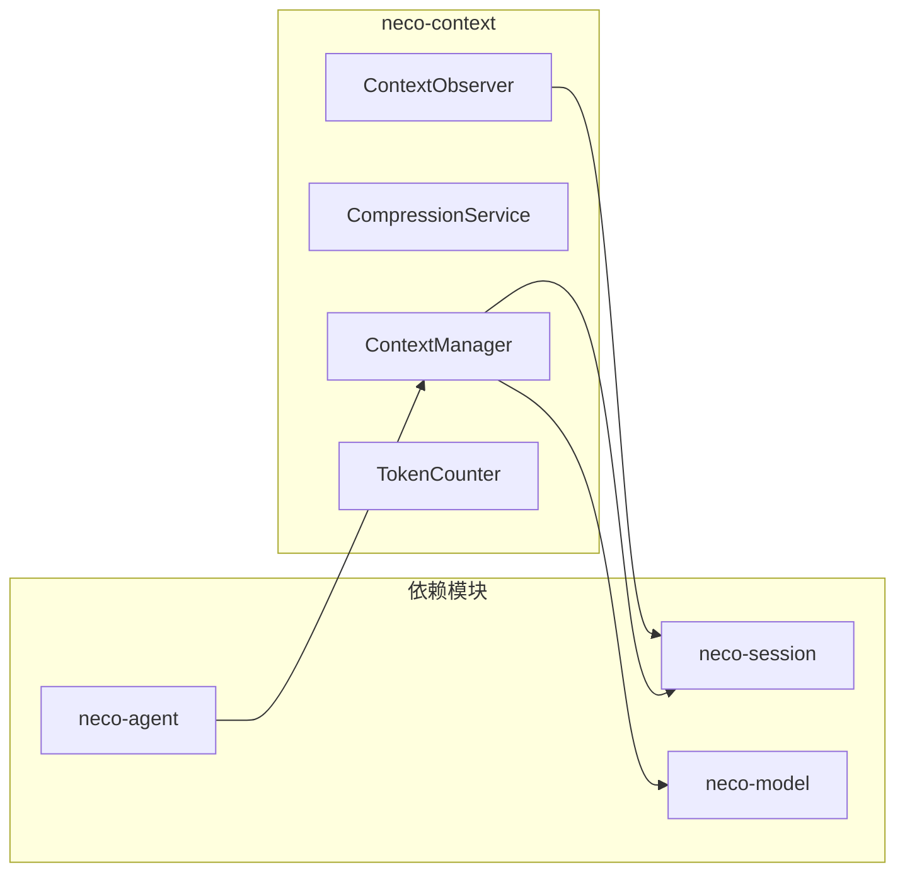
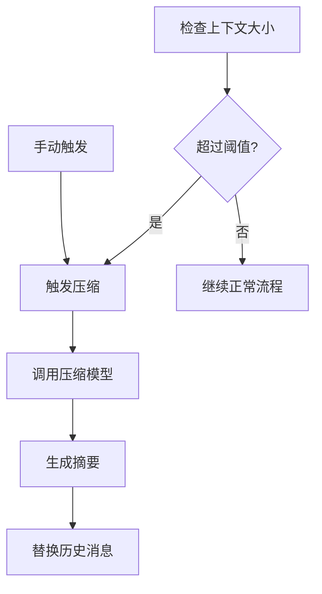
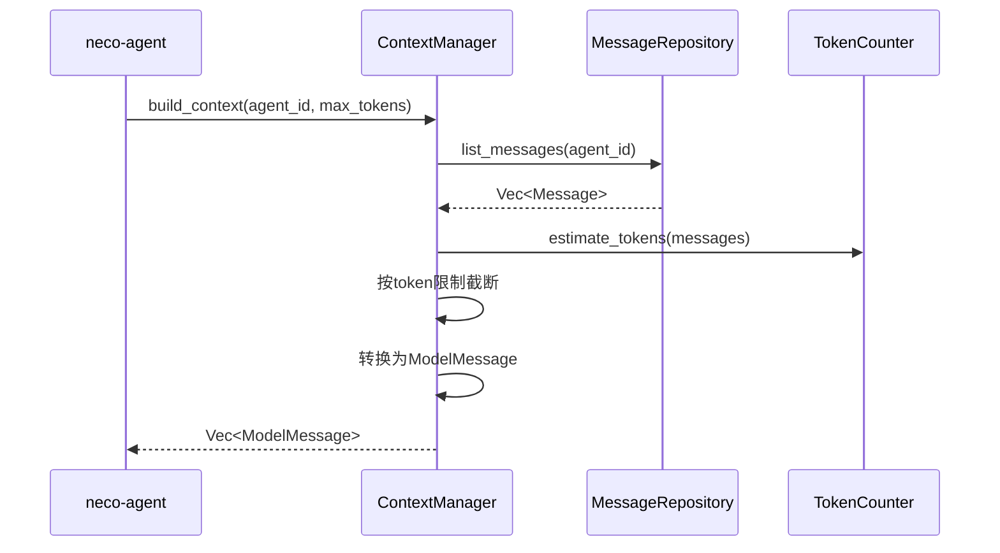
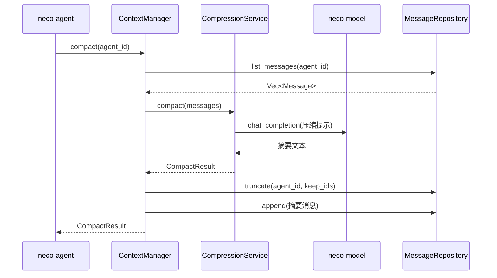
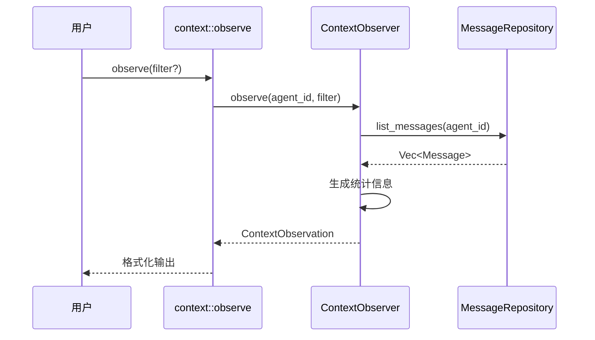

# TECH-CONTEXT: 上下文管理模块

本文档描述Neco项目的上下文管理模块设计，采用领域驱动设计，分离领域模型与基础设施。

## 1. 模块概述

上下文管理模块负责：
1. 监控上下文大小，触发自动或手动压缩
2. 提供上下文观测功能

### 1.1 模块边界



### 1.2 核心职责

| 组件 | 职责 |
|------|------|
| `ContextManager` | 上下文生命周期管理、触发压缩 |
| `CompressionService` | 执行压缩逻辑、调用模型生成摘要 |
| `ContextObserver` | 提供上下文观测能力 |
| `TokenCounter` | Token数量估算 |

## 2. 核心概念

### 2.1 压缩触发条件



**触发方式：**

| 方式 | 触发条件 | 说明 |
|-----|---------|------|
| 自动触发 | 上下文大小 > 窗口×阈值 | 默认90% |
| 手动触发 | /compact命令 | 用户主动 |

## 3. 核心Trait定义

### 3.1 ContextManager

```rust
#[async_trait]
pub trait ContextManager: Send + Sync {
    /// 构建上下文消息列表
    async fn build_context(
        &self,
        agent_id: &AgentId,
        max_tokens: usize,
    ) -> Result<Vec<ModelMessage>, ContextError>;
    
    /// 检查是否需要压缩
    async fn should_compact(&self, agent_id: &AgentId) -> bool;
    
    /// 执行压缩
    async fn compact(
        &self,
        agent_id: &AgentId,
    ) -> Result<CompactResult, ContextError>;
    
    /// 获取上下文统计信息
    async fn get_stats(
        &self,
        agent_id: &AgentId,
    ) -> Result<ContextStats, ContextError>;
}
```

### 3.2 ContextManager实现

```rust
pub struct ContextManagerImpl {
    session_repo: Arc<dyn SessionRepository>,
    message_repo: Arc<dyn MessageRepository>,
    compression_service: Arc<CompressionService>,
    config: ContextConfig,
}

#[async_trait]
impl ContextManager for ContextManagerImpl {
    async fn build_context(
        &self,
        agent_id: &AgentId,
        max_tokens: usize,
    ) -> Result<Vec<ModelMessage>, ContextError> {
        // TODO: 实现上下文构建
        // 1. 从MessageRepository获取消息
        // 2. 按token限制截断
        // 3. 转换为ModelMessage返回
        unimplemented!()
    }
    
    async fn should_compact(&self, agent_id: &AgentId) -> bool {
        // TODO: 实现压缩检查
        // 1. 从MessageRepository获取消息
        // 2. 计算token数量
        // 3. 判断是否超过阈值
        unimplemented!()
    }
    
    async fn compact(
        &self,
        agent_id: &AgentId,
    ) -> Result<CompactResult, ContextError> {
        // TODO: 实现压缩
        // 1. 获取消息列表
        // 2. 调用CompressionService
        // 3. 截断旧消息
        // 4. 添加摘要消息
        unimplemented!()
    }
    
    async fn get_stats(
        &self,
        agent_id: &AgentId,
    ) -> Result<ContextStats, ContextError> {
        // TODO: 实现统计获取
        unimplemented!()
    }
}

## 4. 数据流

### 4.1 消息获取流程



### 4.2 压缩执行流程



### 4.3 观测流程



## 5. 上下文观测

### 5.1 观测接口

```rust
#[async_trait]
pub trait ContextObserver: Send + Sync {
    async fn observe(
        &self,
        agent: &Agent,
        filter: Option<ContextFilter>,
    ) -> Result<ContextObservation, ContextError>;
}

pub struct ContextFilter {
    pub roles: Option<Vec<Role>>,
    pub min_id: Option<MessageId>,
    pub max_id: Option<MessageId>,
    pub with_tool_calls: Option<bool>,
}

pub struct ContextObservation {
    pub messages: Vec<MessageSummary>,
    pub stats: ContextStats,
}

pub struct MessageSummary {
    pub id: MessageId,
    pub role: Role,
    pub content_preview: String,
    pub size_chars: usize,
    pub size_tokens: usize,
    pub timestamp: DateTime<Utc>,
}

pub struct ContextStats {
    pub total_messages: usize,
    pub total_chars: usize,
    pub total_tokens: usize,
    pub usage_percent: f64,
    pub role_counts: HashMap<Role, usize>,
}
```

### 5.2 context::observe 工具

```rust
pub struct ObserveTool {
    observer: Arc<dyn ContextObserver>,
}

#[async_trait]
impl ToolExecutor for ObserveTool {
    fn definition(&self) -> &ToolDefinition {
        // [TODO] 实现工具定义
        // 1. 定义工具ID和描述
        // 2. 定义参数schema
        // 3. 设置超时时间
        unimplemented!()
    }
    
    async fn execute(
        &self,
        context: &ToolContext,
        args: Value,
    ) -> Result<ToolResult, ToolError> {
        // TODO: 实现观测功能
        unimplemented!()
    }
}
```

## 6. 上下文压缩

### 6.1 压缩配置

```rust
pub struct ContextConfig {
    pub auto_compact_enabled: bool,
    pub auto_compact_threshold: f64,
    pub compact_model_group: ModelGroupRef,
    pub keep_recent_messages: usize,
}

pub struct ModelGroupRef(String);

impl ModelGroupRef {
    // TODO: 实现构造方法
    pub fn new(s: impl Into<String>) -> Self {
        todo!()
    }
    
    // TODO: 实现转换为字符串
    pub fn as_str(&self) -> &str {
        todo!()
    }
}

impl Default for ContextConfig {
    // TODO: 实现默认值
    fn default() -> Self {
        todo!()
    }
}
```

### 6.2 压缩结果

```rust
pub struct CompactResult {
    pub original_count: usize,
    pub compacted_count: usize,
    pub summary: String,
    pub preserved_ids: Vec<MessageId>,
    pub token_savings: TokenSavings,
    pub duration: Duration,
}

#[derive(Debug, Clone)]
pub struct TokenSavings {
    pub before: u32,
    pub after: u32,
    pub saved: u32,
    pub saved_percent: f64,
}
```

### 6.3 压缩服务

```rust
pub struct CompressionService {
    model_client: Arc<dyn ModelClient>,
    config: ContextConfig,
    token_counter: Arc<dyn TokenCounter>,
}

impl CompressionService {
    pub fn should_compact(&self, messages: &[Message], context_window: usize) -> bool {
        // [TODO] 实现压缩条件检查
        // 1. 计算当前token数量
        // 2. 计算阈值
        // 3. 比较判断是否需要压缩
        unimplemented!()
    }
    
    pub async fn compact(
        &self,
        messages: &[Message],
    ) -> Result<CompactResult, ContextError> {
        // TODO: 实现压缩逻辑
        // 1. 分离保留/压缩消息
        // 2. 调用模型生成摘要
        // 3. 构建新消息列表
        // 4. 返回结果
        unimplemented!()
    }
}
```

## 7. Token计数

```rust
pub trait TokenCounter: Send + Sync {
    fn estimate_string_tokens(&self, text: &str) -> usize;
    fn estimate_tokens(&self, messages: &[Message]) -> usize;
    fn estimate_message_tokens(&self, message: &Message) -> usize;
}

pub struct SimpleCounter;

impl TokenCounter for SimpleCounter {
    fn estimate_string_tokens(&self, text: &str) -> usize {
        // [TODO] 实现字符串token估算
        // 1. 考虑字符编码和token化方式
        // 2. 返回估算的token数量
        unimplemented!()
    }
    
    fn estimate_tokens(&self, messages: &[Message]) -> usize {
        // [TODO] 实现消息列表token估算
        // 1. 遍历每条消息
        // 2. 累加每条消息的token数
        unimplemented!()
    }
    
    fn estimate_message_tokens(&self, message: &Message) -> usize {
        // [TODO] 实现单条消息token估算
        // 1. 计算内容部分的token
        // 2. 计算tool_calls部分的token
        // 3. 考虑role等额外开销
        unimplemented!()
    }
}
```

## 8. 错误处理

```rust
#[derive(Debug, Error)]
pub enum ContextError {
    #[error("Agent不存在: {0}")]
    AgentNotFound(AgentId),
    
    #[error("模型调用错误: {0}")]
    Model(#[from] ModelError),
    
    #[error("没有可压缩的消息")]
    NothingToCompact,
    
    #[error("Token计算错误: {0}")]
    TokenCalculation(String),
    
    #[error("配置错误: {0}")]
    Config(String),
}
```

---

*关联文档：*
- [TECH.md](TECH.md) - 总体架构文档
- [TECH-SESSION.md](TECH-SESSION.md) - Session管理模块
- [TECH-MODEL.md](TECH-MODEL.md) - 模型服务模块
