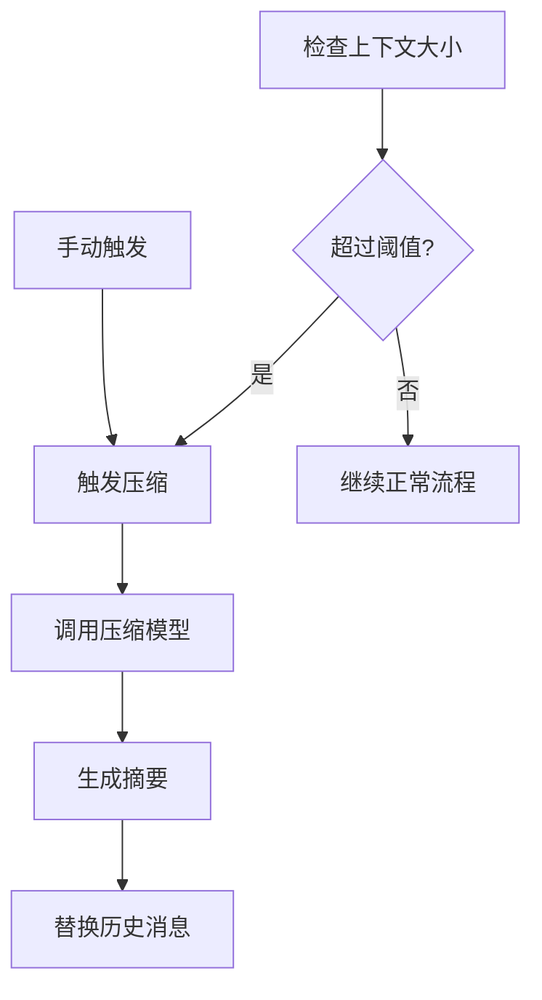

# TECH-CONTEXT: 上下文管理模块

本文档描述Neco项目的上下文管理模块设计。

## 1. 模块概述

上下文管理模块负责：
1. 监控上下文大小，触发自动或手动压缩
2. 提供上下文观测功能

## 2. 核心概念

### 2.1 压缩触发条件



**触发方式：**

| 方式 | 触发条件 | 说明 |
|-----|---------|------|
| 自动触发 | 上下文大小 > 窗口×阈值 | 默认90% |
| 手动触发 | /compact命令 | 用户主动 |

## 3. 上下文观测

### 3.1 观测接口

```rust
#[async_trait]
pub trait ContextObserver: Send + Sync {
    async fn observe(
        &self,
        agent: &Agent,
        filter: Option<ContextFilter>,
    ) -> Result<ContextObservation, ContextError>;
}

pub struct ContextFilter {
    pub roles: Option<Vec<Role>>,
    pub min_id: Option<u64>,
    pub max_id: Option<u64>,
    pub with_tool_calls: Option<bool>,
}

pub struct ContextObservation {
    pub messages: Vec<MessageSummary>,
    pub stats: ContextStats,
}

pub struct MessageSummary {
    pub id: u64,
    pub role: Role,
    pub content_preview: String,
    pub size_chars: usize,
    pub size_tokens: usize,
    pub timestamp: DateTime<Utc>,
}

pub struct ContextStats {
    pub total_messages: usize,
    pub total_chars: usize,
    pub total_tokens: usize,
    pub usage_percent: f64,
    pub role_counts: HashMap<Role, usize>,
}
```

### 3.2 context::observe 工具

```rust
pub struct ObserveTool {
    observer: Arc<dyn ContextObserver>,
}

#[async_trait]
impl ToolExecutor for ObserveTool {
    fn definition(&self) -> &ToolDefinition {
        static DEF: Lazy<ToolDefinition> = Lazy::new(|| ToolDefinition {
            id: ToolId("context::observe".into()),
            description: "查看当前上下文的详细信息".into(),
            schema: json!({
                "type": "object",
                "properties": {
                    "roles": {
                        "type": "array",
                        "items": { "type": "string" },
                        "description": "只显示指定角色的消息"
                    },
                    "sort": {
                        "type": "string",
                        "enum": ["id_asc", "id_desc", "size_asc", "size_desc"],
                        "description": "排序方式"
                    },
                    "format": {
                        "type": "string",
                        "enum": ["table", "json", "summary"],
                        "description": "输出格式"
                    }
                }
            }),
            capabilities: ToolCapabilities::default(),
            timeout: Duration::from_secs(5),
        });
        &DEF
    }
    
    async fn execute(
        &self,
        context: &ToolContext,
        args: Value,
    ) -> Result<ToolResult, ToolError> {
        // TODO: 实现观测功能
        unimplemented!()
    }
}
```

## 4. 上下文压缩

### 4.1 压缩配置

```rust
pub struct ContextConfig {
    pub auto_compact_enabled: bool,
    pub auto_compact_threshold: f64,
    pub compact_model_group: String,
    pub keep_recent_messages: usize,
}

impl Default for ContextConfig {
    fn default() -> Self {
        Self {
            auto_compact_enabled: true,
            auto_compact_threshold: 0.9,
            compact_model_group: "fast".to_string(),
            keep_recent_messages: 10,
        }
    }
}
```

### 4.2 压缩结果

```rust
pub struct CompactResult {
    pub original_count: usize,
    pub compacted_count: usize,
    pub summary: String,
    pub preserved_ids: Vec<u64>,
    pub token_savings: TokenSavings,
    pub duration: Duration,
}

#[derive(Debug, Clone)]
pub struct TokenSavings {
    pub before: u32,
    pub after: u32,
    pub saved: u32,
    pub saved_percent: f64,
}
```

### 4.3 压缩服务

```rust
pub struct CompressionService {
    model_client: Arc<dyn ModelClient>,
    config: ContextConfig,
    token_counter: Arc<dyn TokenCounter>,
}

impl CompressionService {
    pub fn should_compact(&self, messages: &[Message], context_window: usize) -> bool {
        let tokens = self.token_counter.estimate_tokens(messages);
        let threshold = (context_window as f64 * self.config.auto_compact_threshold) as usize;
        tokens >= threshold
    }
    
    pub async fn compact(
        &self,
        messages: &[Message],
    ) -> Result<CompactResult, ContextError> {
        // TODO: 实现压缩逻辑
        // 1. 分离保留/压缩消息
        // 2. 调用模型生成摘要
        // 3. 构建新消息列表
        // 4. 返回结果
        unimplemented!()
    }
}
```

## 5. Token计数

```rust
pub trait TokenCounter: Send + Sync {
    fn estimate_string_tokens(&self, text: &str) -> usize;
    fn estimate_tokens(&self, messages: &[Message]) -> usize;
    fn estimate_message_tokens(&self, message: &Message) -> usize;
}

pub struct SimpleCounter;

impl TokenCounter for SimpleCounter {
    fn estimate_string_tokens(&self, text: &str) -> usize {
        text.len() / 4 + 4
    }
    
    fn estimate_tokens(&self, messages: &[Message]) -> usize {
        messages.iter().map(|m| self.estimate_message_tokens(m)).sum()
    }
    
    fn estimate_message_tokens(&self, message: &Message) -> usize {
        let content = message.content.len();
        let tool_calls = message.tool_calls.as_ref()
            .map(|tc| tc.iter()
                .map(|t| t.function.name.len() + t.function.arguments.len())
                .sum::<usize>())
            .unwrap_or(0);
        (content + tool_calls) / 4 + 4
    }
}
```

## 6. 错误处理

```rust
#[derive(Debug, Error)]
pub enum ContextError {
    #[error("模型调用错误: {0}")]
    Model(#[from] ModelError),
    
    #[error("没有可压缩的消息")]
    NothingToCompact,
    
    #[error("Token计算错误: {0}")]
    TokenCalculation(String),
    
    #[error("配置错误: {0}")]
    Config(String),
}
```

---

*关联文档：*
- [TECH.md](TECH.md) - 总体架构文档
- [TECH-SESSION.md](TECH-SESSION.md) - Session管理模块
- [TECH-MODEL.md](TECH-MODEL.md) - 模型服务模块
