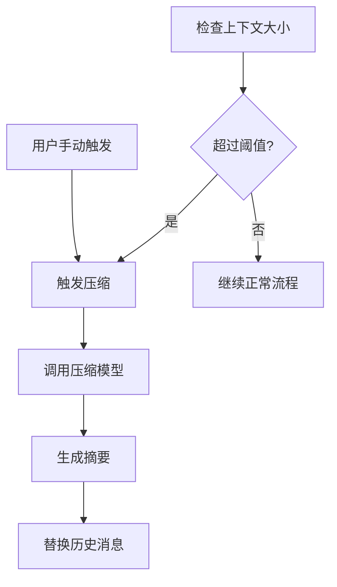
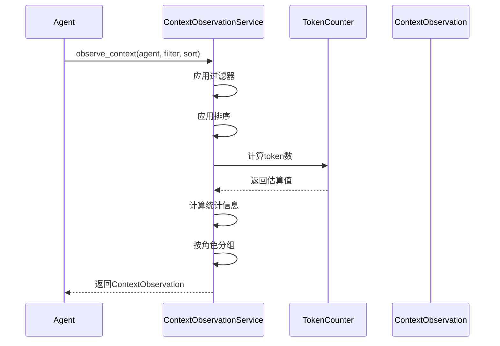

# TECH-CONTEXT: 上下文管理模块

本文档描述Neco项目的上下文管理模块设计，包括上下文压缩和上下文观测功能。

## 1. 模块概述

上下文管理模块负责：
1. 监控上下文大小，当达到阈值时自动触发压缩，或响应手动压缩请求
2. 提供上下文观测功能，允许查看当前上下文的详细状态信息

## 2. 核心概念

### 2.1 压缩触发条件



**触发方式：**

| 方式 | 触发条件 | 配置项 | 说明 |
|-----|---------|--------|------|
| 自动触发 | 上下文大小 > 窗口大小 × 阈值 | `auto_compact_threshold` (默认90%) | 当上下文占用超过阈值时自动压缩 |
| 手动触发 | 用户输入 `/compact` 命令 | - | 用户主动触发 |
| 程序触发 | 代码显式调用 | `Session::manual_compact()` | 开发者通过Session API触发 |

### 2.2 压缩策略

```rust
/// 压缩策略
pub enum CompactStrategy {
    /// 保留最近N条消息，压缩之前的
    KeepRecent { count: usize },
    
    /// 保留系统消息和用户的第一条消息，压缩中间部分
    KeepImportant,
    
    /// 智能选择（基于消息重要性）
    SmartSelect,
    
    /// 全部压缩为单条摘要
    FullSummary,
}
```

## 3. 上下文观测功能

### 3.1 上下文观测服务接口

```rust
/// 上下文观测服务接口
#[async_trait]
pub trait ContextObservationService: Send + Sync {
    /// 创建观测服务
    fn new(token_counter: Arc<dyn TokenCounter>) -> Self
    where
        Self: Sized;

    /// 观测Agent上下文
    async fn observe_context(
        &self,
        agent: &Agent,
        filter: Option<ContextFilter>,
        sort: Option<ContextSortOrder>,
        context_window: usize,
    ) -> Result<ContextObservation, ContextError>;
}
```

### 3.3 观测流程



### 3.4 工具参数Schema

```json
{
  "type": "object",
  "properties": {
    "roles": {
      "type": "array",
      "items": {
        "type": "string",
        "enum": ["system", "user", "assistant", "tool"]
      },
      "description": "只显示指定角色的消息"
    },
    "min_id": {
      "type": "integer",
      "description": "最小消息ID"
    },
    "max_id": {
      "type": "integer",
      "description": "最大消息ID"
    },
    "with_tool_calls": {
      "type": "boolean",
      "description": "是否只显示包含工具调用的消息"
    },
    "sort": {
      "type": "string",
      "enum": ["id_asc", "id_desc", "size_asc", "size_desc", "time_asc", "time_desc"],
      "description": "排序方式"
    },
    "format": {
      "type": "string",
      "enum": ["table", "json", "summary"],
      "description": "输出格式"
    }
  }
}
```

### 3.5 输出格式化接口

```rust
/// 上下文观测输出格式化器接口
pub trait ObservationFormatter: Send + Sync {
    /// 格式化为表格
    fn format_table(observation: &ContextObservation) -> String;
    
    /// 格式化为JSON
    fn format_json(observation: &ContextObservation) -> Result<String, ContextError>;
    
    /// 格式化为摘要
    fn format_summary(observation: &ContextObservation) -> String;
}
```

**输出格式示例：**

*table格式：*
```text
## 上下文统计
- 总消息数: 15
- 总字符数: 12,458
- 总token数: 3,245
- 使用率: 2.5%

## 消息列表
| ID | 角色      | 大小   | Token | 预览          |
|----|-----------|--------|-------|---------------|
| 1  | system    | 1,245  | 320   | You are...    |
| 2  | user      | 156    | 40    | Hello...      |
```

*summary格式：*
```text
# 上下文摘要
当前上下文共有 15 条消息，总计 3,245 tokens，使用率为 2.5%

## 按角色分组
系统提示词: 2 条
用户消息: 6 条
助手消息: 5 条
工具返回: 2 条
```

## 4. 上下文压缩模块

### 4.1 压缩配置

> 通用系统配置定义见 [TECH-CONFIG.md#3.5](./TECH-CONFIG.md#35-系统配置)。

```rust
/// 上下文压缩配置（模块内部使用）
pub struct ContextConfig {
    /// 是否启用自动压缩
    pub auto_compact_enabled: bool,
    
    /// 自动压缩阈值（上下文窗口百分比）
    pub auto_compact_threshold: f64,
    
    /// 压缩使用的模型组
    pub compact_model_group: String,
    
    /// 保留的最近消息数量（不压缩）
    pub keep_recent_messages: usize,
    
    /// 压缩提示词
    pub compact_prompt: String,
}

impl Default for ContextConfig {
    fn default() -> Self {
        // TODO: 实现默认配置
    }
}

/// 默认压缩提示词
const DEFAULT_COMPACT_PROMPT: &str = r#"
压缩以下对话内容，提取所有有价值的信息。

需要回答以下问题：
1. 需求是什么？
2. 目标在哪里？
3. 现在做到了哪一步？
4. 接下来要做什么？
5. 其它信息。

请用简洁的语言总结，保留所有关键细节。
"#;
```

### 4.2 压缩结果

```rust
/// 压缩结果
pub struct CompactResult {
    /// 压缩前的消息数量
    pub original_count: usize,
    
    /// 压缩后的消息数量
    pub compacted_count: usize,
    
    /// 压缩后的摘要消息
    pub summary_message: Message,
    
    /// 保留的消息ID列表
    pub preserved_ids: Vec<u64>,
    
    /// Token节省统计
    pub token_savings: TokenSavings,
    
    /// 压缩时间
    pub duration: Duration,
}

/// Token节省统计
#[derive(Debug, Clone)]
pub struct TokenSavings {
    /// 压缩前token数
    pub before: u32,
    /// 压缩后token数
    pub after: u32,
    /// 节省的token数
    pub saved: u32,
    /// 节省百分比
    pub saved_percentage: f64,
}
```

## 5. 压缩服务

### 5.1 服务结构

```rust
/// 上下文压缩服务
pub struct ContextCompressionService {
    /// 模型客户端
    model_client: Arc<dyn ModelClient>,
    
    /// 配置
    config: ContextConfig,
    
    /// Token计算器
    token_counter: Arc<dyn TokenCounter>,
}

impl ContextCompressionService {
    /// 创建新服务
    pub fn new(
        model_client: Arc<dyn ModelClient>,
        config: ContextConfig,
        token_counter: Arc<dyn TokenCounter>,
    ) -> Self {
        // TODO: 实现服务构造函数
        todo!()
    }
    
    /// 检查是否需要压缩
    pub fn should_compact(
        &self,
        messages: &[Message],
        context_window: usize,
    ) -> bool {
        // TODO: 实现压缩条件检查逻辑
        todo!()
    }
    
    /// 执行压缩
    pub async fn compact(
        &self,
        messages: &[Message],
        strategy: CompactStrategy,
    ) -> Result<CompactResult, CompactError> {
        let start_time = Instant::now();
        
        // TODO: 1. 分离要保留和要压缩的消息
        // TODO: 实现消息分离
        let (to_preserve, to_compress) = todo!();
        
        // TODO: 2. 计算原始token数
        // TODO: 实现token估算
        let before_tokens = todo!();
        
        // TODO: 3. 生成摘要
        let summary = self.generate_summary(to_compress).await?;
        
        // TODO: 4. 构建摘要消息
        // TODO: 实现摘要消息构造
        let summary_message = todo!();
        
        // TODO: 5. 构建新的消息列表
        // TODO: 实现新消息列表构造
        let mut new_messages = todo!();
        
        // TODO: 6. 计算节省的token
        // TODO: 实现token计算
        let after_tokens = todo!();
        let saved = before_tokens.saturating_sub(after_tokens);
        
        Ok(CompactResult {
            original_count: messages.len(),
            compacted_count: new_messages.len(),
            summary_message,
            preserved_ids: to_preserve.iter().map(|m| m.id).collect(),
            token_savings: TokenSavings {
                before: before_tokens as u32,
                after: after_tokens as u32,
                saved: saved as u32,
                saved_percentage: if before_tokens > 0 {
                    (saved as f64 / before_tokens as f64) * 100.0
                } else {
                    0.0
                },
            },
            duration: start_time.elapsed(),
        })
    }
}
```

### 5.2 消息分割

```rust
impl ContextCompressionService {
    /// 分割消息为保留部分和压缩部分
    fn split_messages(
        &self,
        messages: &[Message],
        strategy: CompactStrategy,
    ) -> (Vec<Message>, Vec<Message>) {
        // TODO: 根据策略实现消息分割逻辑
        match strategy {
            CompactStrategy::KeepRecent { count } => {
                // TODO: 实现保留最近N条消息策略
                todo!()
            }
            
            CompactStrategy::KeepImportant => {
                // TODO: 实现保留重要消息策略（系统消息、第一条用户消息、最近N条）
                todo!()
            }
            
            CompactStrategy::SmartSelect => {
                // TODO: 实现智能选择策略
                todo!()
            }
            
            CompactStrategy::FullSummary => {
                // TODO: 实现全部压缩策略
                todo!()
            }
        }
    }
}
```

### 5.3 摘要生成

```rust
impl ContextCompressionService {
    /// 生成消息摘要
    async fn generate_summary(
        &self,
        messages: Vec<Message>,
    ) -> Result<String, CompactError> {
        if messages.is_empty() {
            return Ok(String::new());
        }
        
        // TODO: 构建压缩请求上下文
        let context = self.build_compression_context(messages);
        
        // TODO: 调用压缩模型（关闭thinking和工具）
        let request = ChatRequest {
            model: String::new(), // 由model_client填充
            messages: vec![
                Message {
                    role: Role::System,
                    content: Some(self.config.compact_prompt.clone()),
                    tool_calls: None,
                    tool_call_id: None,
                    timestamp: Utc::now(),
                    metadata: None,
                },
                Message {
                    role: Role::User,
                    content: Some(context),
                    tool_calls: None,
                    tool_call_id: None,
                    timestamp: Utc::now(),
                    metadata: None,
                },
            ],
            stream: false,
            temperature: Some(0.3), // 低温度，更确定性
            max_tokens: Some(2000), // 限制摘要长度
            tools: None,           // 关闭工具
            tool_choice: Some(ToolChoice::None),
            response_format: None,
            stop: None,
            extra_params: HashMap::new(),
        };
        
        // TODO: 处理模型响应
        // let response = self.model_client
        //     .chat_completion(request)
        //     .await
        //     .map_err(CompactError::Model)?;
        
        // Ok(response.choices[0]
        //     .message
        //     .content
        //     .clone()
        //     .unwrap_or_default())
        todo!()
    }
    
    /// 构建压缩上下文
    fn build_compression_context(
        &self,
        messages: Vec<Message>,
    ) -> String {
        // TODO: 构建压缩上下文字符串
        // let mut context = String::new();
        // for msg in messages {
        //     let role_str = match msg.role {
        //         Role::System => "System",
        //         Role::User => "User",
        //         Role::Assistant => "Assistant",
        //         Role::Tool => "Tool",
        //     };
        //     
        //     context.push_str(&format!(
        //         "### {}\n{}\n\n",
        //         role_str,
        //         msg.content
        //     ));
        // }
        // 
        // context
        todo!()
    }
}
```

## 6. Token计算

### 6.1 Token计数器

```rust
/// Token计数器接口
pub trait TokenCounter: Send + Sync {
    /// 估算消息列表的token数
    fn estimate_tokens(&self,
        messages: &[Message]
    ) -> usize;
    
    /// 估算单条消息的token数
    fn estimate_message_tokens(
        &self,
        message: &Message
    ) -> usize;
}

/// 基于tiktoken的计数器（最准确）
pub struct TiktokenCounter {
    bpe: CoreBPE,
}

impl TiktokenCounter {
    pub fn new(model: &str) -> Result<Self, TokenError> {
        // TODO: 实现tiktoken初始化
        // let bpe = tiktoken_rs::get_bpe_from_model(model)?;
        // Ok(Self { bpe })
        todo!()
    }
}

impl TokenCounter for TiktokenCounter {
    fn estimate_tokens(
        &self,
        messages: &[Message]
    ) -> usize {
        messages.iter()
            .map(|m| self.estimate_message_tokens(m))
            .sum()
    }
    
    fn estimate_message_tokens(
        &self,
        message: &Message
    ) -> usize {
        // TODO: 实现OpenAI消息格式token计算
        // let mut tokens = 4; // 每个消息的基础token
        // 
        // tokens += self.bpe.encode_with_special_tokens(
        //     &message.content
        // ).len();
        // 
        // if message.role == Role::Assistant {
        //     if let Some(tool_calls) = &message.tool_calls {
        //         for tc in tool_calls {
        //             tokens += self.bpe.encode_with_special_tokens(
        //                 &tc.function.name
        //             ).len();
        //             tokens += self.bpe.encode_with_special_tokens(
        //                 &tc.function.arguments
        //             ).len();
        //         }
        //     }
        // }
        // 
        // tokens
        todo!()
    }
}

/// 简单估算计数器（无需外部依赖）
pub struct SimpleCounter;

impl TokenCounter for SimpleCounter {
    fn estimate_tokens(
        &self,
        messages: &[Message]
    ) -> usize {
        messages.iter()
            .map(|m| self.estimate_message_tokens(m))
            .sum()
    }
    
    fn estimate_message_tokens(
        &self,
        message: &Message
    ) -> usize {
        // TODO: 实现粗略token估算（平均每个token 4个字符）
        // let content_len = message.content.len();
        // let tool_calls_len = message.tool_calls.as_ref()
        //     .map(|tc| tc.iter()
        //         .map(|t| t.function.name.len() + t.function.arguments.len())
        //         .sum::<usize>())
        //     .unwrap_or(0);
        // 
        // (content_len + tool_calls_len) / 4 + 4
        todo!()
    }
}
```

## 7. 与Session集成

### 7.1 Session扩展

```rust
impl Session {
    /// 检查并执行自动压缩
    pub async fn check_and_compact(
        &mut self,
        compression_service: &ContextCompressionService,
        agent_ulid: AgentUlid,
    ) -> Result<Option<CompactResult>, SessionError> {
        let agent = self.agents.get(&agent_ulid)
            .ok_or(SessionError::AgentNotFound)?;
        
        // 获取模型上下文窗口大小（从Agent配置获取）
        let context_window = agent.config.context_window.unwrap_or(128_000);
        
        // 检查是否需要压缩
        if compression_service.should_compact(
            &agent.messages,
            context_window
        ) {
            // 执行压缩
            let result = compression_service.compact(
                &agent.messages,
                CompactStrategy::KeepImportant
            ).await?;
            
            // 应用压缩结果
            self.apply_compact_result(agent_ulid, &result).await?;
            
            Ok(Some(result))
        } else {
            Ok(None)
        }
    }
    
    /// 应用压缩结果
    async fn apply_compact_result(
        &mut self,
        agent_ulid: AgentUlid,
        result: &CompactResult,
    ) -> Result<(), SessionError> {
        let agent = self.agents.get_mut(&agent_ulid)
            .ok_or(SessionError::AgentNotFound)?;
        
        // TODO: 构建新的消息列表
        // let mut new_messages = vec![result.summary_message.clone()];
        // 
        // // TODO: 添加保留的消息
        // for preserved_id in &result.preserved_ids {
        //     if let Some(msg) = agent.messages.iter()
        //         .find(|m| m.id == *preserved_id) {
        //         new_messages.push(msg.clone());
        //     }
        // }
        // 
        // // TODO: 重新分配消息ID
        // for (i, msg) in new_messages.iter_mut().enumerate() {
        //     msg.id = i as u64 + 1;
        // }
        // 
        // // TODO: 更新Agent消息
        // agent.messages = new_messages;
        // 
        // // TODO: 保存到存储
        // self.storage.save_agent(agent).await?;
        todo!()
    }
    
    /// 手动压缩
    pub async fn manual_compact(
        &mut self,
        compression_service: &ContextCompressionService,
        agent_ulid: AgentUlid,
        strategy: CompactStrategy,
    ) -> Result<CompactResult, SessionError> {
        let agent = self.agents.get(&agent_ulid)
            .ok_or(SessionError::AgentNotFound)?;
        
        // TODO: 执行压缩
        // let result = compression_service.compact(
        //     &agent.messages,
        //     strategy
        // ).await?;
        let result = todo!();
        
        // TODO: 应用压缩结果
        // self.apply_compact_result(agent_ulid, &result).await?;
        todo!();
        
        Ok(result)
    }
}
```

## 8. UI集成

### 8.1 压缩通知

```rust
/// 压缩通知
pub struct CompactNotification {
    pub saved_tokens: u32,
    pub saved_percentage: f64,
    pub original_count: usize,
    pub compacted_count: usize,
}

impl UiRenderer {
    /// 渲染压缩通知
    pub fn render_compact_notification(
        &self,
        result: &CompactResult,
    ) {
        // TODO: 实现压缩通知渲染
        // println!(
        //     "📦 上下文已压缩: {} messages → {} messages | Saved {} tokens ({:.1}%)",
        //     result.original_count,
        //     result.compacted_count,
        //     result.token_savings.saved,
        //     result.token_savings.saved_percentage
        // );
        todo!()
    }
}
```

### 8.2 压缩命令

```rust
/// /compact 命令处理
pub async fn handle_compact_command(
    &self,
    session: &mut Session,
    agent_ulid: AgentUlid,
    args: &str,
) -> Result<(), CommandError> {
    // TODO: 解析压缩策略
    // let strategy = match args {
    //     "--full" => CompactStrategy::FullSummary,
    //     "--smart" => CompactStrategy::SmartSelect,
    //     _ => CompactStrategy::KeepImportant,
    // };
    let strategy = todo!();
    
    // TODO: 执行压缩
    // let result = session.manual_compact(
    //     &self.compression_service,
    //     agent_ulid,
    //     strategy
    // ).await?;
    let result = todo!();
    
    // TODO: 显示压缩结果
    // self.render_compact_notification(&result);
    todo!();
    
    Ok(())
}
```

## 9. 错误处理

> **注意**: 所有模块错误类型统一在 `neco-core` 中汇总为 `AppError`。见 [TECH.md#5.3-统一错误类型设计](TECH.md#5.3-统一错误类型设计)。
>
> `CompactError` 和 `TokenError` 为模块内部错误，在模块边界通过 `From` 实现或映射函数转换为 `AppError`。例如，`CompactError::Model` 携带的 `ModelError` 会通过 `#[source]` 属性传播到上层的 `AppError::Model`。

```rust
#[derive(Debug, Error)]
pub enum CompactError {
    #[error("模型调用错误: {0}")]
    Model(#[source] ModelError),
    
    #[error("没有可压缩的消息")]
    NothingToCompact,
    
    #[error("摘要生成失败")]
    SummaryGenerationFailed,
    
    #[error("Token计算错误: {0}")]
    TokenCalculation(String),
    
    #[error("配置错误: {0}")]
    Config(String),
}

#[derive(Debug, Error)]
pub enum TokenError {
    #[error("不支持的模型: {0}")]
    UnsupportedModel(String),
    
    #[error("Tokenizer初始化失败: {0}")]
    InitializationFailed(String),
}
```

## 10. 性能优化

### 10.1 异步压缩

```rust
/// 后台压缩任务
pub struct BackgroundCompaction {
    service: Arc<ContextCompressionService>,
    queue: mpsc::Receiver<CompactionRequest>,
}

impl BackgroundCompaction {
    pub async fn run(mut self) {
        // TODO: 实现后台压缩任务逻辑
        // while let Some(request) = self.queue.recv().await {
        //     match self.service.compact(
        //         &request.messages,
        //         request.strategy
        //     ).await {
        //         Ok(result) => {
        //             let _ = request.result_tx.send(Ok(result));
        //         }
        //         Err(e) => {
        //             let _ = request.result_tx.send(Err(e));
        //         }
        //     }
        // }
        todo!()
    }
}
```

### 10.2 压缩缓存

```rust
/// 压缩缓存（避免重复压缩相同内容）
pub struct CompactCache {
    cache: RwLock<HashMap<String, CompactResult>>,
}

impl CompactCache {
    /// 获取缓存的压缩结果
    pub fn get(&self,
        messages_hash: &str
    ) -> Option<CompactResult> {
        // TODO: 实现压缩缓存获取逻辑
        // self.cache.read().unwrap()
        //     .get(messages_hash)
        //     .cloned()
        todo!()
    }
    
    /// 缓存压缩结果
    pub fn put(&self,
        messages_hash: String,
        result: CompactResult
    ) {
        // TODO: 实现压缩缓存存储逻辑
        // self.cache.write().unwrap()
        //     .insert(messages_hash, result);
        todo!()
    }
}
```

---

*关联文档：*
- [TECH.md](TECH.md) - 总体架构文档
- [TECH-SESSION.md](TECH-SESSION.md) - Session管理模块
- [TECH-MODEL.md](TECH-MODEL.md) - 模型服务模块
