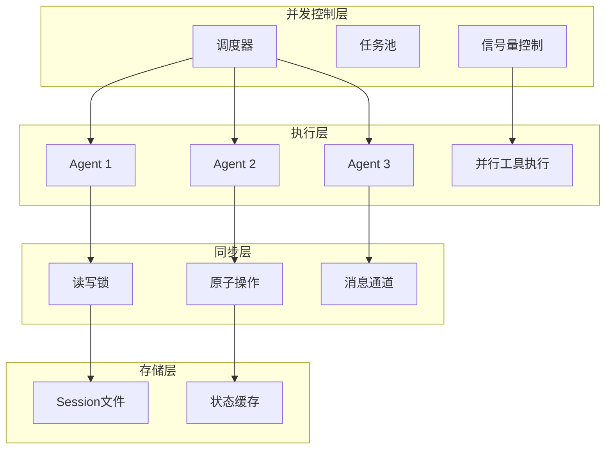
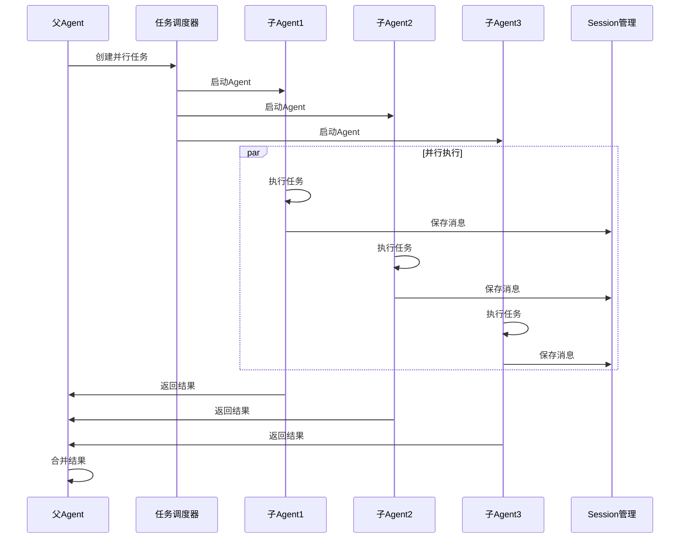
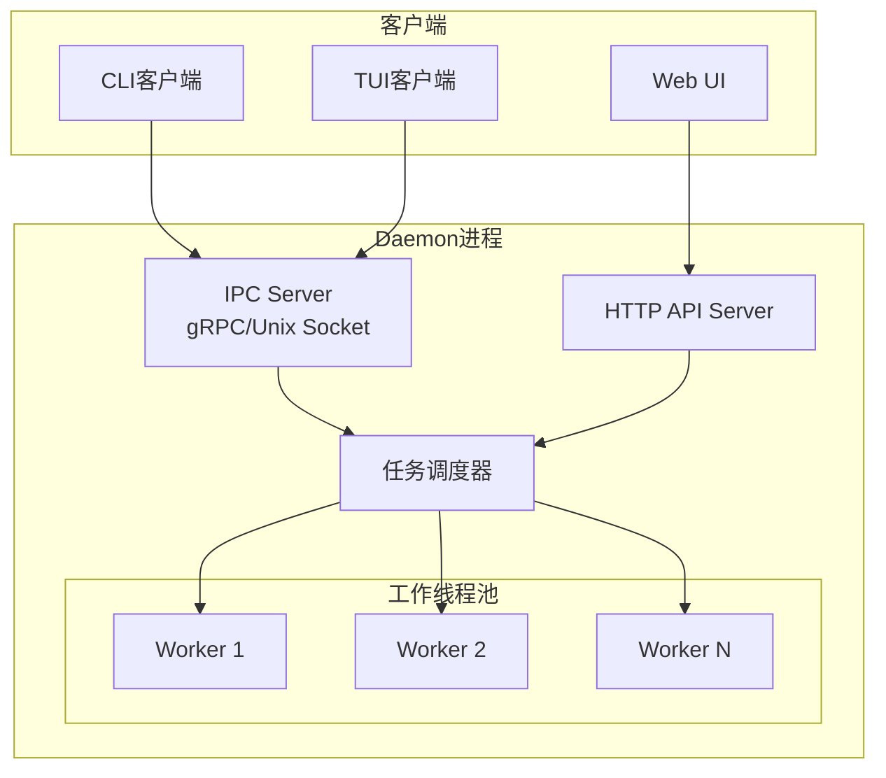

# 并发与错误处理技术文档

## 概述

并发与错误处理是 Neco 系统的关键基础设施，确保多智能体协作的高效性和可靠性。采用异步架构设计，支持多 Agent 并行执行、工作流节点并行和工具调用并行化。

---

## 并发模型架构

### 总体并发架构



---

## 多 Agent 并行执行

### 并行架构

```rust
pub struct AgentExecutor {
    agents: Arc<RwLock<HashMap<AgentUlid, Arc<Agent>>>>,
    task_scheduler: TaskScheduler,
    max_parallel_agents: usize,
}

pub struct TaskScheduler {
    task_queue: Arc<Mutex<VecDeque<Task>>>,
    active_tasks: Arc<AtomicUsize>,
    semaphore: Arc<Semaphore>,
}

impl AgentExecutor {
    pub async fn spawn_agent(
        &self,
        config: AgentConfig,
    ) -> Result<AgentUlid, SpawnError> {
        let ulid = AgentUlid::new();
        let agent = Arc::new(Agent::new(ulid.clone(), config));

        // 限制并发Agent数量
        let permit = self
            .task_scheduler
            .semaphore
            .acquire()
            .await
            .map_err(|_| SpawnError::ResourceExhausted)?;

        // 注册Agent
        {
            let mut agents = self.agents.write().await;
            agents.insert(ulid.clone(), agent.clone());
        }

        // 启动Agent任务
        let ulid_clone = ulid.clone();
        tokio::spawn(async move {
            let _permit = permit; // 保持permit直到任务结束
            agent.run().await;
        });

        Ok(ulid)
    }
}
```

### 父子 Agent 并发



---

## 工作流节点并行执行

### 节点并行控制

```rust
pub struct WorkflowExecutor {
    workflow_state: Arc<RwLock<WorkflowState>>,
    node_executors: Arc<Mutex<HashMap<NodeId, NodeExecutor>>>,
    max_parallel_nodes: usize,
}

pub struct NodeExecutor {
    node_id: NodeId,
    agent_executor: Arc<AgentExecutor>,
    status: Arc<AtomicU8>,  // 0=Pending, 1=Running, 2=Completed, 3=Failed
}

impl WorkflowExecutor {
    pub async fn execute_parallel_nodes(
        &self,
        node_ids: Vec<NodeId>,
    ) -> Vec<Result<NodeOutput, NodeError>> {
        // 使用信号量限制并发节点数
        let semaphore = Arc::new(Semaphore::new(self.max_parallel_nodes));

        let futures: Vec<_> = node_ids
            .into_iter()
            .map(|node_id| {
                let semaphore = Arc::clone(&semaphore);
                let node_executor = self.get_node_executor(&node_id);

                async move {
                    let _permit = semaphore.acquire().await?;
                    node_executor.execute().await
                }
            })
            .collect();

        join_all(futures).await
    }
}
```

---

## Session 状态并发访问

### 状态管理架构

```rust
pub struct SessionManager {
    sessions: Arc<DashMap<SessionId, Arc<Session>>>,
    file_locks: Arc<DashMap<PathBuf, Arc<Mutex<()>>>>,
    io_pool: Arc<ThreadPool>,
}

pub struct Session {
    session_id: SessionId,
    messages: Arc<RwLock<Vec<Message>>>,
    counters: Arc<DashMap<String, AtomicUsize>>,
    variables: Arc<DashMap<String, String>>,
    dirty: Arc<AtomicBool>,
}

impl Session {
    // 读操作使用读锁，允许多个并发读
    pub async fn get_messages(&self
) -> Result<Vec<Message>, SessionError> {
        let messages = self.messages.read().await;
        Ok(messages.clone())
    }

    // 写操作使用写锁，保证独占访问
    pub async fn add_message(&self,
        message: Message
    ) -> Result<(), SessionError> {
        let mut messages = self.messages.write().await;
        messages.push(message);
        self.dirty.store(true, Ordering::SeqCst);
        Ok(())
    }

    // 计数器使用原子操作，无需锁
    pub fn increment_counter(&self,
        name: &str,
        delta: usize
    ) -> usize {
        let counter = self.counters
            .entry(name.to_string())
            .or_insert_with(|| AtomicUsize::new(0));
        counter.fetch_add(delta, Ordering::SeqCst) + delta
    }
}
```

### 文件 IO 并发控制

```rust
impl SessionManager {
    pub async fn save_session(
        &self,
        session_id: &SessionId,
    ) -> Result<(), SessionError> {
        let session = self.sessions
            .get(session_id)
            .ok_or(SessionError::NotFound)?;

        if !session.dirty.swap(false, Ordering::SeqCst) {
            return Ok(()); // 没有修改，无需保存
        }

        let path = self.get_session_path(session_id);
        let file_lock = self.get_file_lock(&path).await;

        // 获取文件锁
        let _guard = file_lock.lock().await;

        // 在阻塞线程池中执行文件 IO
        let session_clone = Arc::clone(&session);
        self.io_pool.spawn(async move {
            let content = tokio::task::spawn_blocking(move || {
                let messages = session_clone.messages.blocking_read();
                toml::to_string(&*messages)
            }).await.unwrap()?;

            tokio::fs::write(&path, content).await?;
            Ok::<(), SessionError>(())
        }).await.unwrap()
    }
}
```

---

## 工具调用并行化

### 并行工具执行

```rust
// 并行工具执行器，支持工具调用的并行化
pub struct ParallelToolExecutor {
    tool_registry: Arc<ToolRegistry>,
    semaphore: Arc<Semaphore>,
    timeout: Duration,  // 默认 30 秒，可配置
}
```
```rust
impl ParallelToolExecutor {
    pub async fn execute_tools(
        &self,
        tool_calls: Vec<ToolCall>,
    ) -> Vec<Result<ToolResult, ToolError>> {
        let futures: Vec<_> = tool_calls
            .into_iter()
            .map(|call| {
                let registry = Arc::clone(&self.tool_registry);
                let semaphore = Arc::clone(&self.semaphore);

                async move {
                    // 获取执行许可
                    let _permit = semaphore.acquire().await?;

                    // 设置超时
                    tokio::time::timeout(
                        self.timeout,
                        registry.execute(call),
                    ).await.map_err(|_| ToolError::Timeout)?
                }
            })
            .collect();

        join_all(futures).await
    }
}
```
**默认配置**：
- 工具执行超时：30 秒（可通过配置覆盖）
- 最大并发数：10 个工具同时执行


---
## 异步设计

### 模型调用异步处理

```rust
pub struct AsyncModelClient {
    client: reqwest::Client,
    retry_policy: RetryPolicy,
}
```


```rust
pub struct AsyncModelClient {
    client: reqwest::Client,
    retry_policy: RetryPolicy,
}

impl AsyncModelClient {
    pub async fn call_with_retry(
        &self,
        request: ModelRequest,
    ) -> Result<ModelResponse, ModelError> {
        let mut last_error = None;

        for attempt in 0..self.retry_policy.max_attempts {
            match self.call_once(request.clone()).await {
                Ok(response) => return Ok(response),
                Err(e) => {
                    if !e.is_retryable() {
                        return Err(e);
                    }

                    last_error = Some(e);

                    // 检查是否是最后一次尝试
                    if attempt + 1 == self.retry_policy.max_attempts {
                        return Err(e);
                    }

                    // 指数退避
                    let delay = self.retry_policy.calculate_delay(attempt);
                    tokio::time::sleep(delay).await;
            }
        }

        Err(last_error.unwrap())
    }

    async fn call_once(
        &self,
        request: ModelRequest,
    ) -> Result<ModelResponse, ModelError> {
        self.client
            .post(&request.url)
            .json(&request.body)
            .send()
            .await?
            .json::<ModelResponse>()
            .await
            .map_err(ModelError::from)
    }
}
```

### 流式输出处理

```rust
pub struct StreamProcessor {
    session_manager: Arc<SessionManager>,
    buffer: Arc<Mutex<String>>,
}

impl StreamProcessor {
    pub async fn process_stream(
        &self,
        mut stream: StreamingResponse,
        session_id: &SessionId,
    ) -> Result<String, StreamError> {
        let mut full_content = String::new();

        while let Some(chunk) = stream.next().await {
            let chunk = chunk?;

            // 实时更新缓冲区
            {
                let mut buffer = self.buffer.lock().await;
                buffer.push_str(&chunk.content);
            }

            // 实时显示
            print!("{}", chunk.content);
            io::stdout().flush()?;

            full_content.push_str(&chunk.content);

            // 定期保存到 Session（每 100 个 token）
            if full_content.len() % 100 == 0 {
                self.save_partial(session_id, &full_content).await?;
            }
        }

        // 保存完整消息
        self.save_complete(session_id, &full_content).await?;

        Ok(full_content)
    }
}
```

---

## 错误处理策略

### 错误类型层次

```rust
#[derive(Error, Debug)]
pub enum NecoError {
    #[error("Session error: {0}")]
    Session(#[from] SessionError),

    #[error("Agent error: {0}")]
    Agent(#[from] AgentError),

    #[error("Model error: {0}")]
    Model(#[from] ModelError),

    #[error("Tool error: {0}")]
    Tool(#[from] ToolError),

    #[error("Workflow error: {0}")]
    Workflow(#[from] WorkflowError),

    #[error("Configuration error: {0}")]
    Config(#[from] ConfigError),

    #[error("System error: {0}")]
    System(#[from] SystemError),
}

// 模型错误细分
#[derive(Error, Debug)]
pub enum ModelError {
    #[error("Network error: {0}")]
    Network(String),

    #[error("API error (4xx): {0}")]
    ApiClient(String),

    #[error("API error (5xx): {0}")]
    ApiServer(String),

    #[error("Rate limited")]
    RateLimited,

    #[error("Model unavailable: {0}")]
    ModelUnavailable(String),

    #[error("All models failed")]
    AllModelsFailed,
}

impl ModelError {
    pub fn is_retryable(&self) -> bool {
        matches!(self,
            Self::Network(_) |
            Self::ApiServer(_) |
            Self::RateLimited
        )
    }
}
```

### 分层错误处理

```rust
// 应用层错误处理
pub async fn handle_user_request(
    request: UserRequest,
) -> Result<String, UserFacingError> {
    match process_request(request).await {
        Ok(result) => Ok(result),
        Err(e) => {
            // 转换为用户友好的错误
            let user_error = match e {
                NecoError::Model(ModelError::Network(_)) => {
                    UserFacingError::NetworkIssue
                }
                NecoError::Model(ModelError::RateLimited) => {
                    UserFacingError::RateLimited
                }
                NecoError::Agent(AgentError::MaxDepthExceeded) => {
                    UserFacingError::TooComplex
                }
                _ => UserFacingError::Internal,
            };

            // 记录详细错误日志
            tracing::error!("Internal error: {:?}", e);

            Err(user_error)
        }
    }
}
```

---

## 重试与退避策略

### 指数退避

```rust
pub struct ExponentialBackoff {
    base: Duration,
    max: Duration,
    multiplier: f64,
}

impl ExponentialBackoff {
    pub fn calculate_delay(&self,
        attempt: usize
    ) -> Duration {
        let delay_secs = self.base.as_secs_f64()
            * self.multiplier.powi(attempt as i32);

        Duration::from_secs_f64(
            delay_secs.min(self.max.as_secs_f64())
        )
    }
}

// 使用示例：1s, 2s, 4s
let backoff = ExponentialBackoff {
    base: Duration::from_secs(1),
    max: Duration::from_secs(4),
    multiplier: 2.0,
};
```

### 模型调用重试

```rust
impl ModelClient {
    pub async fn call_with_retry(
        &self,
        request: ModelRequest,
    ) -> Result<ModelResponse, ModelError> {
        let backoff = ExponentialBackoff::default();

        for attempt in 0..3 {
            match self.call(&request).await {
                Ok(response) => return Ok(response),
                Err(e) => {
                    if !e.is_retryable() || attempt == 2 {
                        return Err(e);
                    }

                    // 指数退避等待
                    let delay = backoff.calculate_delay(attempt);
                    tokio::time::sleep(delay).await;
                }
            }
        }

        unreachable!()
    }
}
```

---

## 状态同步机制

### 全局变量隔离

```rust
pub struct GlobalVariables {
    // 工作流级别的全局变量
    workflow_vars: Arc<DashMap<String, Value>>,

    // 节点级别的局部变量
    node_vars: Arc<DashMap<NodeId, Arc<DashMap<String, Value>>>>,
}

impl GlobalVariables {
    pub fn get_workflow_var(
        &self,
        key: &str
    ) -> Option<Value> {
        self.workflow_vars.get(key).map(|v| v.clone())
    }

    pub fn set_workflow_var(
        &self,
        key: String,
        value: Value
    ) {
        self.workflow_vars.insert(key, value);
    }

    pub fn get_node_var(
        &self,
        node_id: &NodeId,
        key: &str
    ) -> Option<Value> {
        self.node_vars
            .get(node_id)
            .and_then(|vars| vars.get(key).map(|v| v.clone()))
    }
}
```

### 工作流计数器原子操作

```rust
pub struct WorkflowCounters {
    counters: Arc<DashMap<String, AtomicUsize>>,
}

impl WorkflowCounters {
    pub fn increment(
        &self,
        name: &str,
        delta: usize
    ) -> usize {
        let counter = self.counters
            .entry(name.to_string())
            .or_insert_with(|| AtomicUsize::new(0));
        counter.fetch_add(delta, Ordering::SeqCst) + delta
    }

    pub fn get(&self, name: &str) -> usize {
        self.counters
            .get(name)
            .map(|c| c.load(Ordering::SeqCst))
            .unwrap_or(0)
    }

    pub fn compare_and_increment(
        &self,
        name: &str,
        expected: usize,
        delta: usize
    ) -> Result<usize, usize> {
        let counter = self.counters
            .entry(name.to_string())
            .or_insert_with(|| AtomicUsize::new(0));

        let current = counter.load(Ordering::SeqCst);
        if current == expected {
            Ok(counter.fetch_add(delta, Ordering::SeqCst) + delta)
        } else {
            Err(current)
        }
    }
}
```

---

## 后台模式（Daemon）并发架构

### 守护进程架构



### Daemon 核心实现

```rust
pub struct NecoDaemon {
    session_manager: Arc<SessionManager>,
    workflow_engine: Arc<WorkflowEngine>,
    ipc_server: IpcServer,
    http_server: HttpServer,
    worker_pool: WorkerPool,
}

impl NecoDaemon {
    pub async fn run(self) -> Result<(), DaemonError> {
        // 使用Arc包装以便在多个async块中共享
        let ipc_server = Arc::new(self.ipc_server);
        let http_server = Arc::new(self.http_server);

        
        // 启动 IPC 服务器
        let ipc_handle = {
            let server = Arc::clone(&ipc_server);
            tokio::spawn(async move {
                server.serve().await
            })
        };

        // 启动 HTTP 服务器
        let http_handle = {
            let server = Arc::clone(&http_server);
            tokio::spawn(async move {
                server.serve().await
            })
        };


        // 优雅关闭处理
        tokio::select! {
            _ = tokio::signal::ctrl_c() => {
                info!("Received shutdown signal");
                self.graceful_shutdown().await;
            }
            result = ipc_handle => {
                error!("IPC server error: {:?}", result);
            }
            result = http_handle => {
                error!("HTTP server error: {:?}", result);
            }
        }

        Ok(())
    }

    async fn graceful_shutdown(&self
) {
        // 停止接受新请求
        self.ipc_server.stop_accepting().await;
        self.http_server.stop_accepting().await;

        // 等待现有任务完成
        let timeout = Duration::from_secs(30);
        tokio::time::timeout(
            timeout,
            self.worker_pool.wait_for_completion(),
        ).await.ok();

        // 保存所有 Session
        self.session_manager.save_all().await.ok();

        info!("Graceful shutdown completed");
    }
}
```

---

## Rust 并发原语使用

### 核心原语

```rust
// 1. 异步同步原语
use tokio::sync::{
    RwLock,      // 读写锁 - Session状态访问
    Mutex,       // 互斥锁 - 互斥资源访问
    Semaphore,   // 信号量 - 并发控制
    mpsc,        // 通道 - 任务通信
    broadcast,   // 广播通道 - 事件通知
    watch,       // 监视通道 - 状态同步
};

// 2. 原子类型
use std::sync::atomic::{
    AtomicUsize,  // 计数器
    AtomicU32,    // 状态标记
    AtomicBool,   // 布尔标志
    Ordering,     // 内存序
};

// 3. 共享所有权
use std::sync::Arc;

// 4. 并发集合
use dashmap::DashMap;          // 并发HashMap
use crossbeam::queue::SegQueue; // 无锁队列
```

### 使用场景

| 原语 | 使用场景 | 说明 |
|------|----------|------|
| `RwLock` | Session消息列表 | 多读单写 |
| `Mutex` | 文件锁 | 独占访问 |
| `Semaphore` | 并发限制 | 限制Agent/工具数 |
| `AtomicUsize` | 计数器 | 无锁计数 |
| `DashMap` | Session缓存 | 并发HashMap |
| `mpsc` | 任务分发 | 多生产者单消费者 |
| `broadcast` | 事件通知 | 一对多广播 |

---

*本文档遵循 REQUIREMENT.md 中并发模型和错误处理相关需求设计。*
