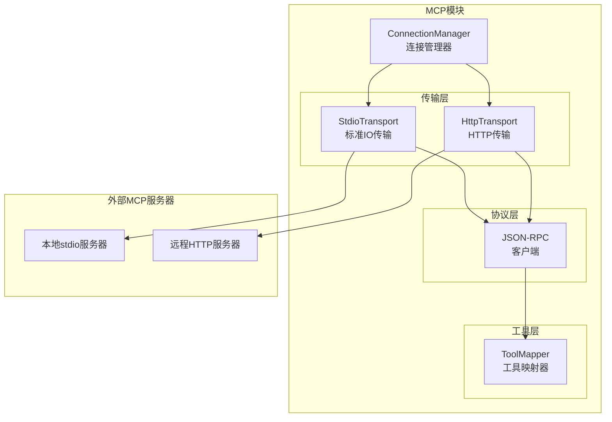

# TECH-MCP: MCP模块

本文档描述Neco项目的MCP（Model Context Protocol）模块设计，包括MCP客户端实现和服务器管理。

## 1. 模块概述

MCP模块提供与MCP服务器的通信能力，支持stdio和HTTP两种传输模式。

## 2. 架构设计

### 2.1 MCP系统架构



## 3. 数据结构设计

### 3.1 MCP服务器配置

```rust
/// MCP服务器配置
#[derive(Debug, Clone, Deserialize)]
pub struct McpServerConfig {
    /// 传输类型
    #[serde(flatten)]
    pub transport: McpTransport,
    
    /// 环境变量
    #[serde(default)]
    pub env: HashMap<String, String>,
}

/// MCP传输方式
#[derive(Debug, Clone, Deserialize)]
#[serde(tag = "type")]
pub enum McpTransport {
    /// 本地stdio传输
    #[serde(rename = "stdio")]
    Stdio {
        /// 命令
        command: String,
        /// 参数
        #[serde(default)]
        args: Vec<String>,
    },
    
    /// HTTP传输
    #[serde(rename = "http")]
    Http {
        /// 服务器URL
        url: Url,
        /// Bearer Token环境变量名
        bearer_token_env: Option<String>,
        /// 额外HTTP头
        #[serde(default)]
        headers: HashMap<String, String>,
    },
}

/// MCP服务器状态
#[derive(Debug, Clone, Copy, PartialEq, Eq)]
pub enum McpServerStatus {
    /// 未连接
    Disconnected,
    /// 连接中
    Connecting,
    /// 已连接
    Connected,
    /// 错误
    Error,
}
```

### 3.2 MCP连接

```rust
/// MCP连接
pub struct McpConnection {
    /// 服务器名称
    pub name: String,
    
    /// 配置
    pub config: McpServerConfig,
    
    /// 当前状态
    pub status: McpServerStatus,
    
    /// 传输层
    transport: Box<dyn McpTransport>,
    
    /// 可用工具列表
    pub tools: Vec<McpTool>,
}

/// MCP工具
#[derive(Debug, Clone, Deserialize)]
pub struct McpTool {
    pub name: String,
    pub description: String,
    pub input_schema: Value,
}

/// MCP传输接口
#[async_trait]
pub trait McpTransport: Send + Sync {
    /// 初始化连接
    async fn initialize(
        &mut self
    ) -> Result<InitializeResult, McpError>;
    
    /// 调用工具
    async fn call_tool(
        &self,
        name: &str,
        arguments: Value,
    ) -> Result<CallToolResult, McpError>;
    
    /// 关闭连接
    async fn close(
        &mut self
    ) -> Result<(), McpError>;
}

/// 初始化结果
#[derive(Debug, Deserialize)]
pub struct InitializeResult {
    pub protocol_version: String,
    pub capabilities: ServerCapabilities,
    pub server_info: ServerInfo,
}

#[derive(Debug, Deserialize)]
pub struct ServerCapabilities {
    pub tools: Option<ToolCapabilities>,
}

#[derive(Debug, Deserialize)]
pub struct ToolCapabilities {
    pub list_changed: bool,
}

#[derive(Debug, Deserialize)]
pub struct ServerInfo {
    pub name: String,
    pub version: String,
}

/// 工具调用结果
#[derive(Debug, Deserialize)]
pub struct CallToolResult {
    pub content: Vec<ToolContent>,
    pub is_error: bool,
}

#[derive(Debug, Deserialize)]
#[serde(tag = "type")]
pub enum ToolContent {
    #[serde(rename = "text")]
    Text { text: String },
    #[serde(rename = "image")]
    Image { data: String, mime_type: String },
}
```

## 4. 传输层实现

### 4.1 Stdio传输

```rust
use tokio::process::{Command, Child};
use tokio::io::{AsyncBufReadExt, AsyncWriteExt, BufReader};

/// Stdio传输实现
pub struct StdioTransport {
    /// 子进程
    child: Child,
    /// 标准输入写入器
    stdin: tokio::process::ChildStdin,
    /// 标准输出读取器
    stdout: BufReader<tokio::process::ChildStdout>,
    /// 请求ID计数器
    request_id: AtomicU64,
    /// 响应通道映射
    pending_requests: Arc<Mutex<HashMap<u64, oneshot::Sender<Value>>>>,
}

impl StdioTransport {
    pub async fn new(
        command: String,
        args: Vec<String>,
        env: HashMap<String, String>,
    ) -> Result<Self, McpError> {
        // TODO: 创建子进程并设置IO流
        // TODO: 初始化传输层组件
        // TODO: 启动响应读取任务
        panic!("Not implemented")
    }
    
    /// 启动响应读取任务
    fn spawn_response_reader(&self
    ) {
        // TODO: 启动异步任务读取服务器响应
        // TODO: 解析JSON-RPC响应
        // TODO: 根据请求ID映射到对应的响应通道
        panic!("Not implemented")
    }
}

#[async_trait]
impl McpTransport for StdioTransport {
    async fn initialize(
        &mut self
    ) -> Result<InitializeResult, McpError> {
        // TODO: 发送初始化请求到MCP服务器
        // TODO: 解析初始化响应
        // TODO: 发送initialized通知
        panic!("Not implemented")
    }
    
    async fn call_tool(
        &self,
        name: &str,
        arguments: Value,
    ) -> Result<CallToolResult, McpError> {
        // TODO: 生成请求ID
        // TODO: 构建工具调用JSON-RPC请求
        // TODO: 发送请求并等待响应
        // TODO: 解析工具调用结果
        panic!("Not implemented")
    }
    
    async fn close(&mut self
    ) -> Result<(), McpError> {
        // TODO: 发送关闭通知（如果支持）
        // TODO: 终止子进程
        panic!("Not implemented")
    }
}

impl StdioTransport {
    /// 发送请求并等待响应
    async fn send_request(
        &self,
        request: Value,
    ) -> Result<Value, McpError> {
        // TODO: 创建响应通道
        // TODO: 将请求映射到响应通道
        // TODO: 发送JSON-RPC请求到标准输入
        // TODO: 等待响应并处理超时
        // TODO: 清理已完成的请求
        panic!("Not implemented")
    }
    
    /// 发送通知（无需响应）
    async fn send_notification(
        &mut self,
        notification: Value,
    ) -> Result<(), McpError> {
        // TODO: 将通知序列化为JSON
        // TODO: 发送到MCP服务器标准输入
        panic!("Not implemented")
    }
}
```

### 4.2 HTTP传输

```rust
use reqwest::Client;

/// HTTP传输实现
pub struct HttpTransport {
    /// HTTP客户端
    client: Client,
    /// 基础URL
    base_url: Url,
    /// 认证头
    auth_header: Option<HeaderValue>,
    /// 额外头
    headers: HeaderMap,
}

impl HttpTransport {
    pub fn new(
        url: Url,
        bearer_token: Option<String>,
        headers: HashMap<String, String>,
    ) -> Result<Self, McpError> {
        // TODO: 创建认证头部
        // TODO: 构建HTTP头映射
        // TODO: 初始化HTTP客户端
        panic!("Not implemented")
    }
}

#[async_trait]
impl McpTransport for HttpTransport {
    async fn initialize(
        &mut self
    ) -> Result<InitializeResult, McpError> {
        // TODO: 构建初始化请求
        // TODO: 设置认证和HTTP头
        // TODO: 发送POST请求到/initialize端点
        // TODO: 解析初始化响应
        panic!("Not implemented")
    }
    
    async fn call_tool(
        &self,
        name: &str,
        arguments: Value,
    ) -> Result<CallToolResult, McpError> {
        // TODO: 构建工具调用请求
        // TODO: 设置认证和HTTP头
        // TODO: 发送POST请求到/tools/call端点
        // TODO: 解析工具调用结果
        panic!("Not implemented")
    }
    
    async fn close(&mut self
    ) -> Result<(), McpError> {
        // TODO: HTTP无状态，无需关闭
        // TODO: 可考虑清理资源
        panic!("Not implemented")
    }
}
```

## 5. MCP管理器

### 5.1 连接管理

```rust
/// MCP管理器
pub struct McpManager {
    /// 活跃连接
    connections: Arc<RwLock<HashMap<String, McpConnection>>>,
    
    /// 配置
    config: HashMap<String, McpServerConfig>,
}

impl McpManager {
    /// 创建MCP管理器
    pub fn new(
        config: HashMap<String, McpServerConfig>
    ) -> Self {
        // TODO: 初始化连接管理器
        // TODO: 加载服务器配置
        panic!("Not implemented")
    }
    
    /// 连接到MCP服务器
    pub async fn connect(
        &self,
        name: &str,
    ) -> Result<Vec<McpTool>, McpError> {
        // TODO: 检查是否已连接
        // TODO: 获取服务器配置
        // TODO: 根据传输类型创建对应的传输层
        // TODO: 初始化连接
        // TODO: 获取工具列表
        // TODO: 保存连接状态
        // TODO: 记录连接信息
        panic!("Not implemented")
    }
    
    /// 列出可用工具
    async fn list_tools(
        &self,
        transport: &dyn McpTransport,
    ) -> Result<Vec<McpTool>, McpError> {
        // TODO: 通过JSON-RPC调用tools/list端点
        // TODO: 解析并返回可用工具列表
        // TODO: 处理工具列表变化的场景
        panic!("Not implemented")
    }
    
    /// 调用MCP工具
    pub async fn call_tool(
        &self,
        server_name: &str,
        tool_name: &str,
        arguments: Value,
    ) -> Result<CallToolResult, McpError> {
        // TODO: 检查连接状态
        // TODO: 验证服务器是否已连接
        // TODO: 调用对应的传输层工具
        panic!("Not implemented")
    }
    
    /// 断开连接
    pub async fn disconnect(
        &self,
        name: &str,
    ) -> Result<(), McpError> {
        // TODO: 从连接管理器中移除连接
        // TODO: 关闭传输层连接
        // TODO: 记录断开连接信息
        panic!("Not implemented")
    }
    
    /// 断开所有连接
    pub async fn disconnect_all(&self
    ) -> Result<(), McpError> {
        // TODO: 获取所有连接名称
        // TODO: 依次断开每个连接
        // TODO: 处理断开连接过程中的错误
        panic!("Not implemented")
    }
}
```

## 6. 工具集成

### 6.1 MCP工具包装器

```rust
/// MCP工具包装器（实现ToolProvider）
pub struct McpToolWrapper {
    server_name: String,
    tool: McpTool,
    mcp_manager: Arc<McpManager>,
}

impl McpToolWrapper {
    pub fn new(
        server_name: String,
        tool: McpTool,
        mcp_manager: Arc<McpManager>,
    ) -> Self {
        // TODO: 初始化工具包装器
        // TODO: 设置服务器名称和工具信息
        // TODO: 引用MCP管理器
        panic!("Not implemented")
    }
}

impl ToolProvider for McpToolWrapper {
    fn name(&self) -> &str {
        &self.tool.name
    }
    
    fn description(&self) -> &str {
        &self.tool.description
    }
    
    fn parameters_schema(&self) -> Value {
        self.tool.input_schema.clone()
    }
    
    fn timeout(&self) -> Duration {
        Duration::from_secs(60) // MCP默认60秒
    }
    
    async fn execute(
        &self,
        args: Value,
    ) -> Result<ToolResult, ToolError> {
        // TODO: 通过MCP管理器调用工具
        // TODO: 处理执行错误
        // TODO: 转换工具结果为ToolResult格式
        // TODO: 处理文本和图像内容
        panic!("Not implemented")
    }
}
```

### 6.2 工具注册

```rust
/// 注册MCP服务器工具到工具注册表
pub async fn register_mcp_tools(
    mcp_manager: &McpManager,
    tool_registry: &mut ToolRegistry,
    server_name: &str,
) -> Result<usize, McpError> {
    // TODO: 连接到MCP服务器
    // TODO: 获取可用工具列表
    // TODO: 为每个工具创建包装器
    // TODO: 注册工具到工具注册表
    // TODO: 返回注册的工具数量
    panic!("Not implemented")
}
```

## 7. 错误处理

```rust
#[derive(Debug, Error)]
pub enum McpError {
    #[error("配置未找到: {0}")]
    ConfigNotFound(String),
    
    #[error("未连接到服务器: {0}")]
    NotConnected(String),
    
    #[error("启动失败: {0}")]
    SpawnFailed(String),
    
    #[error("IO错误: {0}")]
    Io(#[from] std::io::Error),
    
    #[error("序列化错误: {0}")]
    Serialization(#[from] serde_json::Error),
    
    #[error("HTTP错误: {0}")]
    Http(#[from] reqwest::Error),
    
    #[error("无效请求")]
    InvalidRequest,
    
    #[error("通道已关闭")]
    ChannelClosed,
    
    #[error("超时")]
    Timeout,
    
    #[error("无效头: {0}")]
    InvalidHeader(#[from] reqwest::header::InvalidHeaderValue),
    
    #[error("无效头名: {0}")]
    InvalidHeaderName(#[from] reqwest::header::InvalidHeaderName),
    
    #[error("URL解析错误: {0}")]
    UrlParse(#[from] url::ParseError),
}
```

---

*关联文档：*
- [TECH.md](TECH.md) - 总体架构文档
- [TECH-TOOL.md](TECH-TOOL.md) - 工具模块
- [TECH-CONFIG.md](TECH-CONFIG.md) - 配置管理模块
