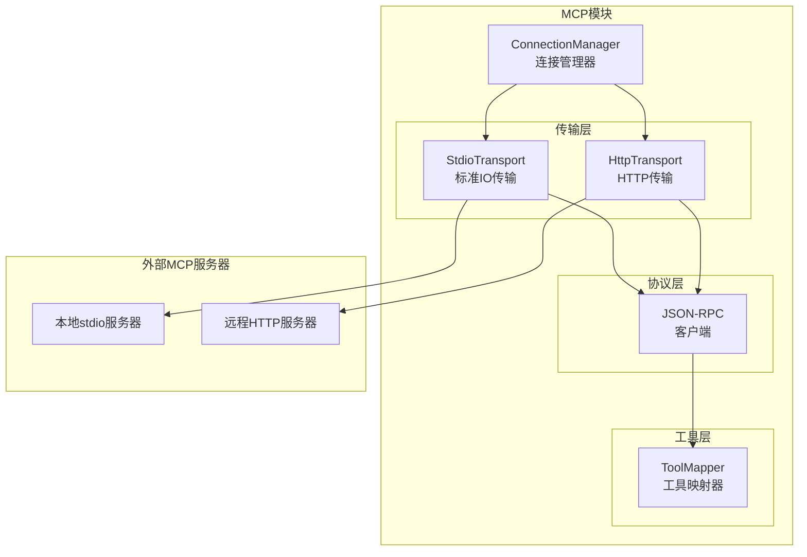

# TECH-MCP: MCP模块

本文档描述Neco项目的MCP（Model Context Protocol）模块设计，包括MCP客户端实现和服务器管理。

## 1. 模块概述

MCP模块提供与MCP服务器的通信能力，支持stdio和HTTP两种传输模式。

## 2. 架构设计

### 2.1 MCP系统架构



## 3. 数据结构设计

### 3.1 MCP服务器配置

```rust
/// MCP服务器配置
#[derive(Debug, Clone, Deserialize)]
pub struct McpServerConfig {
    /// 传输类型
    #[serde(flatten)]
    pub transport: McpTransport,
    
    /// 环境变量
    #[serde(default)]
    pub env: HashMap<String, String>,
}

/// MCP传输方式
#[derive(Debug, Clone, Deserialize)]
#[serde(tag = "type")]
pub enum McpTransport {
    /// 本地stdio传输
    #[serde(rename = "stdio")]
    Stdio {
        /// 命令
        command: String,
        /// 参数
        #[serde(default)]
        args: Vec<String>,
    },
    
    /// HTTP传输
    #[serde(rename = "http")]
    Http {
        /// 服务器URL
        url: Url,
        /// Bearer Token环境变量名
        bearer_token_env: Option<String>,
        /// 额外HTTP头
        #[serde(default)]
        headers: HashMap<String, String>,
    },
}

/// MCP服务器状态
#[derive(Debug, Clone, Copy, PartialEq, Eq)]
pub enum McpServerStatus {
    /// 未连接
    Disconnected,
    /// 连接中
    Connecting,
    /// 已连接
    Connected,
    /// 错误
    Error,
}
```

### 3.2 MCP连接

```rust
/// MCP连接
pub struct McpConnection {
    /// 服务器名称
    pub name: String,
    
    /// 配置
    pub config: McpServerConfig,
    
    /// 当前状态
    pub status: McpServerStatus,
    
    /// 传输层
    transport: Box<dyn McpTransport>,
    
    /// 可用工具列表
    pub tools: Vec<McpTool>,
}

/// MCP工具
#[derive(Debug, Clone, Deserialize)]
pub struct McpTool {
    pub name: String,
    pub description: String,
    pub input_schema: Value,
}

/// MCP传输接口
#[async_trait]
pub trait McpTransport: Send + Sync {
    /// 初始化连接
    async fn initialize(
        &mut self
    ) -> Result<InitializeResult, McpError>;
    
    /// 调用工具
    async fn call_tool(
        &self,
        name: &str,
        arguments: Value,
    ) -> Result<CallToolResult, McpError>;
    
    /// 关闭连接
    async fn close(
        &mut self
    ) -> Result<(), McpError>;
}

/// 初始化结果
#[derive(Debug, Deserialize)]
pub struct InitializeResult {
    pub protocol_version: String,
    pub capabilities: ServerCapabilities,
    pub server_info: ServerInfo,
}

#[derive(Debug, Deserialize)]
pub struct ServerCapabilities {
    pub tools: Option<ToolCapabilities>,
}

#[derive(Debug, Deserialize)]
pub struct ToolCapabilities {
    pub list_changed: bool,
}

#[derive(Debug, Deserialize)]
pub struct ServerInfo {
    pub name: String,
    pub version: String,
}

/// 工具调用结果
#[derive(Debug, Deserialize)]
pub struct CallToolResult {
    pub content: Vec<ToolContent>,
    pub is_error: bool,
}

#[derive(Debug, Deserialize)]
#[serde(tag = "type")]
pub enum ToolContent {
    #[serde(rename = "text")]
    Text { text: String },
    #[serde(rename = "image")]
    Image { data: String, mime_type: String },
}
```

## 4. 传输层实现

### 4.1 Stdio传输

```rust
use tokio::process::{Command, Child};
use tokio::io::{AsyncBufReadExt, AsyncWriteExt, BufReader};

/// Stdio传输实现
pub struct StdioTransport {
    /// 子进程
    child: Child,
    /// 标准输入写入器
    stdin: tokio::process::ChildStdin,
    /// 标准输出读取器
    stdout: BufReader<tokio::process::ChildStdout>,
    /// 请求ID计数器
    request_id: AtomicU64,
    /// 响应通道映射
    pending_requests: Arc<Mutex<HashMap<u64, oneshot::Sender<Value>>>>,
}

impl StdioTransport {
    pub async fn new(
        command: String,
        args: Vec<String>,
        env: HashMap<String, String>,
    ) -> Result<Self, McpError> {
        let mut cmd = Command::new(&command);
        cmd.args(&args)
            .envs(&env)
            .stdin(Stdio::piped())
            .stdout(Stdio::piped())
            .stderr(Stdio::piped());
        
        let mut child = cmd.spawn()
            .map_err(|e| McpError::SpawnFailed(e.to_string()))?;
        
        let stdin = child.stdin.take()
            .ok_or(McpError::SpawnFailed("Failed to open stdin".to_string()))?;
        
        let stdout = child.stdout.take()
            .ok_or(McpError::SpawnFailed("Failed to open stdout".to_string()))?;
        
        let transport = Self {
            child,
            stdin,
            stdout: BufReader::new(stdout),
            request_id: AtomicU64::new(1),
            pending_requests: Arc::new(Mutex::new(HashMap::new())),
        };
        
        // 启动响应读取任务
        transport.spawn_response_reader();
        
        Ok(transport)
    }
    
    /// 启动响应读取任务
    fn spawn_response_reader(&self
    ) {
        let mut stdout = self.stdout;
        let pending = self.pending_requests.clone();
        
        tokio::spawn(async move {
            let mut line = String::new();
            
            loop {
                line.clear();
                match stdout.read_line(&mut line).await {
                    Ok(0) => break, // EOF
                    Ok(_) => {
                        if let Ok(response) = serde_json::from_str::<Value>(&line
                        ) {
                            if let Some(id) = response["id"].as_u64() {
                                let mut pending = pending.lock().await;
                                if let Some(tx) = pending.remove(&id) {
                                    let _ = tx.send(response);
                                }
                            }
                        }
                    }
                    Err(_) => break,
                }
            }
        });
    }
}

#[async_trait]
impl McpTransport for StdioTransport {
    async fn initialize(
        &mut self
    ) -> Result<InitializeResult, McpError> {
        let request = json!({
            "jsonrpc": "2.0",
            "id": 0,
            "method": "initialize",
            "params": {
                "protocolVersion": "2024-11-05",
                "capabilities": {},
                "clientInfo": {
                    "name": "neco",
                    "version": env!("CARGO_PKG_VERSION")
                }
            }
        });
        
        let response = self.send_request(request).await?;
        
        let result = response["result"].clone();
        let init_result: InitializeResult = serde_json::from_value(result)?;
        
        // 发送initialized通知
        let notification = json!({
            "jsonrpc": "2.0",
            "method": "notifications/initialized"
        });
        self.send_notification(notification).await?;
        
        Ok(init_result)
    }
    
    async fn call_tool(
        &self,
        name: &str,
        arguments: Value,
    ) -> Result<CallToolResult, McpError> {
        let id = self.request_id.fetch_add(1, Ordering::SeqCst);
        
        let request = json!({
            "jsonrpc": "2.0",
            "id": id,
            "method": "tools/call",
            "params": {
                "name": name,
                "arguments": arguments
            }
        });
        
        let response = self.send_request(request).await?;
        
        let result = response["result"].clone();
        let tool_result: CallToolResult = serde_json::from_value(result)?;
        
        Ok(tool_result)
    }
    
    async fn close(&mut self
    ) -> Result<(), McpError> {
        // 发送关闭通知（如果支持）
        let _ = self.child.kill().await;
        Ok(())
    }
}

impl StdioTransport {
    /// 发送请求并等待响应
    async fn send_request(
        &self,
        request: Value,
    ) -> Result<Value, McpError> {
        let id = request["id"].as_u64()
            .ok_or(McpError::InvalidRequest)?;
        
        let (tx, rx) = oneshot::channel();
        {
            let mut pending = self.pending_requests.lock().await;
            pending.insert(id, tx);
        }
        
        // 发送请求
        let request_line = serde_json::to_string(&request)?;
        let mut stdin = self.stdin;
        stdin.write_all(request_line.as_bytes()).await?;
        stdin.write_all(b"\n").await?;
        stdin.flush().await?;
        
        // 等待响应
        match timeout(Duration::from_secs(30), rx).await {
            Ok(Ok(response)) => Ok(response),
            Ok(Err(_)) => Err(McpError::ChannelClosed),
            Err(_) => {
                // 超时，清理等待
                let mut pending = self.pending_requests.lock().await;
                pending.remove(&id);
                Err(McpError::Timeout)
            }
        }
    }
    
    /// 发送通知（无需响应）
    async fn send_notification(
        &mut self,
        notification: Value,
    ) -> Result<(), McpError> {
        let notification_line = serde_json::to_string(&notification)?;
        self.stdin.write_all(notification_line.as_bytes()).await?;
        self.stdin.write_all(b"\n").await?;
        self.stdin.flush().await?;
        Ok(())
    }
}
```

### 4.2 HTTP传输

```rust
use reqwest::Client;

/// HTTP传输实现
pub struct HttpTransport {
    /// HTTP客户端
    client: Client,
    /// 基础URL
    base_url: Url,
    /// 认证头
    auth_header: Option<HeaderValue>,
    /// 额外头
    headers: HeaderMap,
}

impl HttpTransport {
    pub fn new(
        url: Url,
        bearer_token: Option<String>,
        headers: HashMap<String, String>,
    ) -> Result<Self, McpError> {
        let auth_header = bearer_token.map(|token| {
            HeaderValue::from_str(&format!("Bearer {}", token))
                .expect("Invalid token")
        });
        
        let mut header_map = HeaderMap::new();
        for (key, value) in headers {
            let header_name = HeaderName::from_bytes(key.as_bytes())?;
            let header_value = HeaderValue::from_str(&value)?;
            header_map.insert(header_name, header_value);
        }
        
        Ok(Self {
            client: Client::new(),
            base_url: url,
            auth_header,
            headers: header_map,
        })
    }
}

#[async_trait]
impl McpTransport for HttpTransport {
    async fn initialize(
        &mut self
    ) -> Result<InitializeResult, McpError> {
        let request = json!({
            "protocolVersion": "2024-11-05",
            "capabilities": {},
            "clientInfo": {
                "name": "neco",
                "version": env!("CARGO_PKG_VERSION")
            }
        });
        
        let url = self.base_url.join("/initialize")?;
        let mut request_builder = self.client.post(url)
            .json(&request);
        
        if let Some(auth) = &self.auth_header {
            request_builder = request_builder
                .header(AUTHORIZATION, auth);
        }
        
        for (key, value) in &self.headers {
            request_builder = request_builder.header(key, value);
        }
        
        let response = request_builder.send().await?;
        let init_result: InitializeResult = response.json().await?;
        
        Ok(init_result)
    }
    
    async fn call_tool(
        &self,
        name: &str,
        arguments: Value,
    ) -> Result<CallToolResult, McpError> {
        let request = json!({
            "name": name,
            "arguments": arguments
        });
        
        let url = self.base_url.join("/tools/call")?;
        let mut request_builder = self.client.post(url)
            .json(&request);
        
        if let Some(auth) = &self.auth_header {
            request_builder = request_builder
                .header(AUTHORIZATION, auth);
        }
        
        for (key, value) in &self.headers {
            request_builder = request_builder.header(key, value);
        }
        
        let response = request_builder.send().await?;
        let tool_result: CallToolResult = response.json().await?;
        
        Ok(tool_result)
    }
    
    async fn close(&mut self
    ) -> Result<(), McpError> {
        // HTTP无状态，无需关闭
        Ok(())
    }
}
```

## 5. MCP管理器

### 5.1 连接管理

```rust
/// MCP管理器
pub struct McpManager {
    /// 活跃连接
    connections: Arc<RwLock<HashMap<String, McpConnection>>>,
    
    /// 配置
    config: HashMap<String, McpServerConfig>,
}

impl McpManager {
    /// 创建MCP管理器
    pub fn new(
        config: HashMap<String, McpServerConfig>
    ) -> Self {
        Self {
            connections: Arc::new(RwLock::new(HashMap::new())),
            config,
        }
    }
    
    /// 连接到MCP服务器
    pub async fn connect(
        &self,
        name: &str,
    ) -> Result<Vec<McpTool>, McpError> {
        // 检查是否已连接
        {
            let connections = self.connections.read().await;
            if let Some(conn) = connections.get(name) {
                if conn.status == McpServerStatus::Connected {
                    return Ok(conn.tools.clone());
                }
            }
        }
        
        // 获取配置
        let config = self.config.get(name)
            .ok_or(McpError::ConfigNotFound(name.to_string()))?;
        
        // 创建传输层
        let mut transport: Box<dyn McpTransport> = match &config.transport {
            McpTransport::Stdio { command, args } => {
                Box::new(StdioTransport::new(
                    command.clone(),
                    args.clone(),
                    config.env.clone(),
                ).await?)
            }
            McpTransport::Http { url, bearer_token_env, headers } => {
                let token = if let Some(env_var) = bearer_token_env {
                    std::env::var(env_var).ok()
                } else {
                    None
                };
                
                Box::new(HttpTransport::new(
                    url.clone(),
                    token,
                    headers.clone(),
                )?)
            }
        };
        
        // 初始化连接
        let init_result = transport.initialize().await?;
        
        // 获取工具列表
        let tools = self.list_tools(&*transport).await?;
        
        // 保存连接
        let connection = McpConnection {
            name: name.to_string(),
            config: config.clone(),
            status: McpServerStatus::Connected,
            transport,
            tools: tools.clone(),
        };
        
        {
            let mut connections = self.connections.write().await;
            connections.insert(name.to_string(), connection);
        }
        
        info!(
            "Connected to MCP server '{}' with {} tools",
            name,
            tools.len()
        );
        
        Ok(tools)
    }
    
    /// 列出可用工具
    async fn list_tools(
        &self,
        transport: &dyn McpTransport,
    ) -> Result<Vec<McpTool>, McpError> {
        // 这里简化处理，实际应通过JSON-RPC调用tools/list
        // 目前假设工具在初始化时已知
        Ok(Vec::new())
    }
    
    /// 调用MCP工具
    pub async fn call_tool(
        &self,
        server_name: &str,
        tool_name: &str,
        arguments: Value,
    ) -> Result<CallToolResult, McpError> {
        let connections = self.connections.read().await;
        let connection = connections.get(server_name)
            .ok_or(McpError::NotConnected(server_name.to_string()))?;
        
        if connection.status != McpServerStatus::Connected {
            return Err(McpError::NotConnected(server_name.to_string()));
        }
        
        connection.transport.call_tool(tool_name, arguments).await
    }
    
    /// 断开连接
    pub async fn disconnect(
        &self,
        name: &str,
    ) -> Result<(), McpError> {
        let mut connections = self.connections.write().await;
        
        if let Some(mut connection) = connections.remove(name) {
            connection.transport.close().await?;
            info!("Disconnected from MCP server '{}'", name);
        }
        
        Ok(())
    }
    
    /// 断开所有连接
    pub async fn disconnect_all(&self
    ) -> Result<(), McpError> {
        let names: Vec<String> = {
            let connections = self.connections.read().await;
            connections.keys().cloned().collect()
        };
        
        for name in names {
            let _ = self.disconnect(&name).await;
        }
        
        Ok(())
    }
}
```

## 6. 工具集成

### 6.1 MCP工具包装器

```rust
/// MCP工具包装器（实现ToolProvider）
pub struct McpToolWrapper {
    server_name: String,
    tool: McpTool,
    mcp_manager: Arc<McpManager>,
}

impl McpToolWrapper {
    pub fn new(
        server_name: String,
        tool: McpTool,
        mcp_manager: Arc<McpManager>,
    ) -> Self {
        Self {
            server_name,
            tool,
            mcp_manager,
        }
    }
}

impl ToolProvider for McpToolWrapper {
    fn name(&self) -> &str {
        &self.tool.name
    }
    
    fn description(&self) -> &str {
        &self.tool.description
    }
    
    fn parameters_schema(&self) -> Value {
        self.tool.input_schema.clone()
    }
    
    fn timeout(&self) -> Duration {
        Duration::from_secs(60) // MCP默认60秒
    }
    
    async fn execute(
        &self,
        args: Value,
    ) -> Result<ToolResult, ToolError> {
        let result = self.mcp_manager
            .call_tool(&self.server_name, &self.tool.name, args
            )
            .await
            .map_err(|e| ToolError::Execution(e.to_string()))?;
        
        // 转换结果
        let output = result.content.iter()
            .map(|c| match c {
                ToolContent::Text { text } => text.clone(),
                ToolContent::Image { data, mime_type } => {
                    format!("[Image: {} - {} bytes]", mime_type, data.len())
                }
            })
            .collect::<Vec<_>()
            .join("\n");
        
        Ok(ToolResult {
            output,
            data: None,
            is_error: result.is_error,
        })
    }
}
```

### 6.2 工具注册

```rust
/// 注册MCP服务器工具到工具注册表
pub async fn register_mcp_tools(
    mcp_manager: &McpManager,
    tool_registry: &mut ToolRegistry,
    server_name: &str,
) -> Result<usize, McpError> {
    // 连接到服务器
    let tools = mcp_manager.connect(server_name).await?;
    
    // 注册每个工具
    let mut count = 0;
    for tool in tools {
        let tool_id = format!("mcp::{}::{}", server_name, tool.name);
        let wrapper = McpToolWrapper::new(
            server_name.to_string(),
            tool,
            Arc::new(mcp_manager.clone()),
        );
        
        // 这里需要将wrapper注册到registry
        // 实际实现中可能需要调整接口
        count += 1;
    }
    
    Ok(count)
}
```

## 7. 错误处理

```rust
#[derive(Debug, Error)]
pub enum McpError {
    #[error("配置未找到: {0}")]
    ConfigNotFound(String),
    
    #[error("未连接到服务器: {0}")]
    NotConnected(String),
    
    #[error("启动失败: {0}")]
    SpawnFailed(String),
    
    #[error("IO错误: {0}")]
    Io(#[from] std::io::Error),
    
    #[error("序列化错误: {0}")]
    Serialization(#[from] serde_json::Error),
    
    #[error("HTTP错误: {0}")]
    Http(#[from] reqwest::Error),
    
    #[error("无效请求")]
    InvalidRequest,
    
    #[error("通道已关闭")]
    ChannelClosed,
    
    #[error("超时")]
    Timeout,
    
    #[error("无效头: {0}")]
    InvalidHeader(#[from] reqwest::header::InvalidHeaderValue),
    
    #[error("无效头名: {0}")]
    InvalidHeaderName(#[from] reqwest::header::InvalidHeaderName),
    
    #[error("URL解析错误: {0}")]
    UrlParse(#[from] url::ParseError),
}
```

---

*关联文档：*
- [TECH.md](TECH.md) - 总体架构文档
- [TECH-TOOL.md](TECH-TOOL.md) - 工具模块
- [TECH-CONFIG.md](TECH-CONFIG.md) - 配置管理模块
