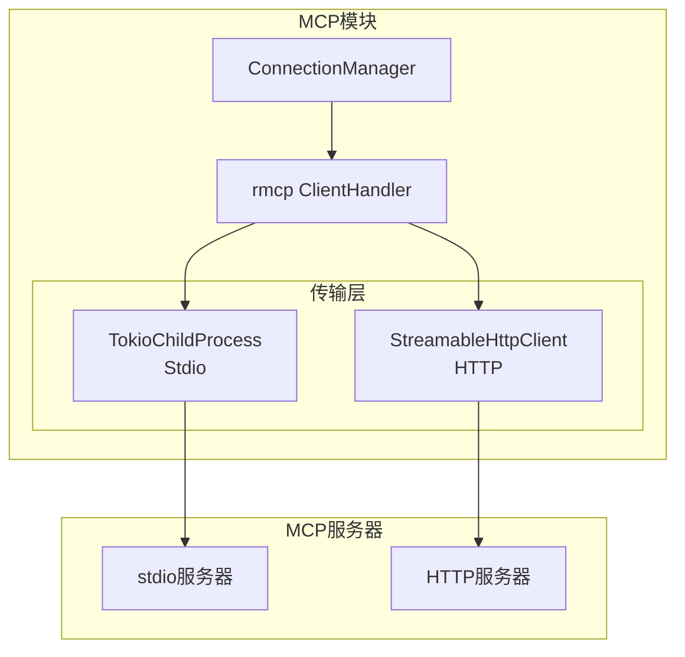

# TECH-MCP: MCP模块

本文档描述Neco项目的MCP（Model Context Protocol）模块设计。

## 1. 模块概述

MCP模块提供与MCP服务器的通信能力，支持stdio和HTTP两种传输模式。

## 2. 架构设计

### 2.1 系统架构



## 3. MCP管理

### 3.1 连接管理

```rust
pub struct McpManager {
    connections: Arc<RwLock<HashMap<String, McpConnection>>>,
    config: HashMap<String, McpServerConfig>,
}

#[derive(Debug, Clone)]
pub struct McpConnection {
    pub name: String,
    pub config: McpServerConfig,
    pub status: McpServerStatus,
    pub peer: Option<Peer>,
    pub tools: Vec<McpTool>,
}

#[derive(Debug, Clone, Copy, PartialEq, Eq)]
pub enum McpServerStatus {
    Disconnected,
    Connecting,
    Connected,
    Reconnecting,
    Error,
}
```

### 3.2 工具包装

```rust
pub struct McpToolWrapper {
    server_name: String,
    tool: McpTool,
    manager: Arc<McpManager>,
}

#[async_trait]
impl ToolExecutor for McpToolWrapper {
    fn definition(&self) -> &ToolDefinition {
        // TODO: 返回工具定义
        unimplemented!()
    }
    
    async fn execute(
        &self,
        context: &ToolContext,
        args: Value,
    ) -> Result<ToolResult, ToolError> {
        // TODO: 调用MCP工具
        unimplemented!()
    }
}
```

### 3.3 工具注册

```rust
pub async fn register_mcp_tools(
    manager: &McpManager,
    registry: &mut dyn ToolRegistry,
    server_name: &str,
) -> Result<usize, McpError> {
    // TODO: 连接MCP服务器并注册工具
    unimplemented!()
}
```

## 4. 传输实现

### 4.1 Stdio传输

```rust
pub async fn connect_stdio(
    command: String,
    args: Vec<String>,
) -> Result<Peer, McpError> {
    let transport = TokioChildProcess::new(
        Command::new(command).configure(|cmd| {
            for arg in args {
                cmd.arg(arg);
            }
        })?
    )?;
    
    let client = RmcpClient;
    client.serve(transport).await
}
```

### 4.2 HTTP传输

```rust
pub async fn connect_http(
    url: &str,
) -> Result<Peer, McpError> {
    let transport = StreamableHttpClientTransport::new(url);
    let client = RmcpClient;
    client.serve(transport).await
}
```

## 5. 错误处理

```rust
#[derive(Debug, Error)]
pub enum McpError {
    #[error("连接失败: {0}")]
    ConnectionFailed(String),
    
    #[error("工具调用失败: {0}")]
    ToolCallFailed(String),
    
    #[error("服务器错误: {0}")]
    ServerError(String),
}
```

---

*关联文档：*
- [TECH.md](TECH.md) - 总体架构文档
- [TECH-TOOL.md](TECH-TOOL.md) - 工具模块
- [TECH-CONFIG.md](TECH-CONFIG.md) - 配置管理模块
