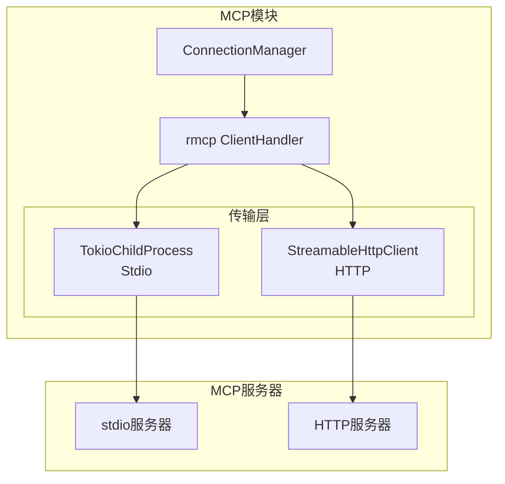
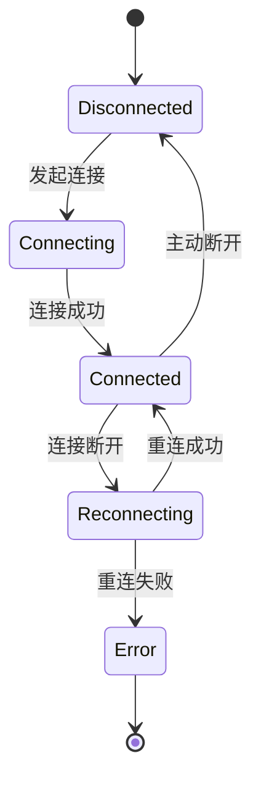

# TECH-MCP: MCP模块

/// 当前支持的协议版本
pub const CURRENT_PROTOCOL_VERSION: &str = "2025-11-25";

本文档描述NeoCo项目的MCP（Model Context Protocol）模块设计。

**设计原则：**
- 支持stdio和HTTP两种传输模式
- 连接状态自动管理（重连、心跳）
- 工具定义与执行分离

## 1. 模块概述

MCP模块提供与MCP服务器的通信能力，支持stdio和HTTP两种传输模式。

## 2. 架构设计

### 2.1 系统架构



## 3. MCP管理

### 3.1 连接管理

```rust
pub struct McpManager {
    connections: DashMap<String, Arc<RwLock<McpConnection>>>,
    config: HashMap<String, McpServerConfig>,
}

#[derive(Debug, Clone)]
pub struct McpConnection {
    pub name: String,
    pub config: McpServerConfig,
    pub status: McpServerStatus,
    pub peer: Option<Peer>,
    pub tools: Vec<McpTool>,
}

#[derive(Debug, Clone, Copy, PartialEq, Eq)]
pub enum McpServerStatus {
    Disconnected,
    Connecting,
    Connected,
    Reconnecting,
    Error,
}
```

**状态与peer关系：**

| `status` | `peer` | 说明 |
|----------|--------|------|
| `Disconnected` | `None` | 未连接，无peer实例 |
| `Connecting` | `None` | 连接中，peer尚未创建 |
| `Connected` | `Some(Peer)` | 已连接，peer可用 |
| `Reconnecting` | `None` | 重连中，旧peer已丢弃 |
| `Error` | `None` | 错误状态，peer已清理 |

### 3.2 工具包装

```rust
pub struct McpToolWrapper {
    server_name: String,
    tool: McpTool,
    manager: Arc<McpManager>,
}

#[async_trait]
impl ToolExecutor for McpToolWrapper {
    fn definition(&self) -> &ToolDefinition {
        // [TODO] 实现要点说明
        // 1. 从 self.tool 中提取工具名称、描述和参数模式
        // 2. 转换为 ToolDefinition 结构返回
        unimplemented!()
    }
    
    async fn execute(
        &self,
        context: &ToolContext,
        args: Value,
    ) -> Result<ToolResult, ToolError> {
        // [TODO] 实现要点说明
        // 1. 从连接池获取该server的连接
        // 2. 构建MCP JSON-RPC请求（tools/call方法）
        // 3. 发送请求并等待响应
        // 4. 解析响应结果
        // 5. 转换为ToolResult返回
        unimplemented!()
    }
}
```

### 3.3 工具定义

| 工具 | 功能 | 超时 |
|------|------|------|
| `mcp::server_name` | 调用MCP服务器工具 | 60秒 |

### 3.4 工具注册

```rust
pub async fn register_mcp_tools(
    manager: &McpManager,
    registry: &mut dyn ToolRegistry,
    server_name: &str,
) -> Result<usize, McpError> {
    // [TODO] 实现要点说明
    // 1. 根据 server_name 获取服务器配置
    // 2. 创建连接（stdio或http方式）
    // 3. 发送 initialize 请求进行协议握手
    // 4. 发送 tools/list 获取可用工具列表
    // 5. 为每个工具创建 McpToolWrapper
    // 6. 将工具包装器注册到 ToolRegistry
    // 7. 返回注册的工具数量

    // 错误处理策略：
    // - 连接失败：立即返回错误，不注册任何工具
    // - 部分工具注册失败：记录失败工具，继续注册其他工具
    // - 返回成功注册的工具数量（可能为0）
    // - 所有工具都失败：返回错误，包含失败详情
    unimplemented!()
}
```

## 4. 传输实现

### 4.1 Stdio传输

```rust
pub async fn connect_stdio(
    command: String,
    args: Vec<String>,
) -> Result<Peer, McpError> {
    // [TODO] 实现要点说明
    // 1. 使用 Command 创建子进程
    // 2. 配置子进程参数（args）
    // 3. 创建 TokioChildProcess 传输层
    // 4. 使用 RmcpClient 包装传输层
    // 5. 调用 client.serve() 启动客户端并返回 Peer
    unimplemented!()
}
```

### 4.2 HTTP传输

```rust
pub async fn connect_http(
    url: &str,
) -> Result<Peer, McpError> {
    // [TODO] 实现要点说明
    // 1. 创建 StreamableHttpClientTransport，传入 url
    // 2. 使用 RmcpClient 包装传输层
    // 3. 调用 client.serve() 启动客户端并返回 Peer
    unimplemented!()
}
```

## 5. 错误处理

```rust
#[derive(Debug, Error)]
pub enum McpError {
    #[error("连接失败: {0}")]
    ConnectionFailed(String),
    
    #[error("工具调用失败: {0}")]
    ToolCallFailed(String),
    
    #[error("服务器错误: {0}")]
    ServerError(String),
    
    #[error("超时")]
    Timeout,
    
    #[error("协议错误: {0}")]
    ProtocolError(String),
    
    #[error("认证失败")]
    AuthenticationFailed,
}

impl McpError {
    pub fn is_retryable(&self) -> bool {
        matches!(self, Self::Timeout | Self::ConnectionFailed(_))
    }
}
```

## 6. MCP协议消息定义

### 6.1 JSON-RPC消息格式

MCP协议基于JSON-RPC 2.0规范，主要消息类型包括：

```json
// 工具调用请求
{
    "jsonrpc": "2.0",
    "id": 1,
    "method": "tools/call",
    "params": {
        "name": "tool_name",
        "arguments": {}
    }
}

// 初始化请求
{
    "jsonrpc": "2.0",
    "id": 1,
    "method": "initialize",
    "params": {
        "protocolVersion": "2025-11-25",
        "capabilities": {}
    }
}

// 工具列表请求
{
    "jsonrpc": "2.0",
    "id": 1,
    "method": "tools/list",
    "params": {}
}
```

### 6.2 核心方法

| 方法 | 方向 | 说明 |
|------|------|------|
| `initialize` | Client→Server | 初始化连接，交换协议版本和能力 |
| `tools/list` | Client→Server | 获取可用工具列表 |
| `tools/call` | Client→Server | 调用指定工具 |
| `notifications/initialized` | Client→Server | 通知初始化完成 |
| `ping` | Client↔Server | 心跳保活 |

## 7. 连接生命周期

### 7.1 连接状态流转



### 7.2 连接管理策略

- **连接池**: 每个MCP服务器维护一个连接池，默认大小为1
- **心跳**: 每30秒发送ping请求，超时10秒视为连接断开
- **重连**: 断开后自动重连，最多尝试3次，间隔递增（1s, 2s, 4s）
- **健康检查**: 连接建立后立即进行tools/list调用验证可用性

**可配置的重连策略：**

```rust
pub struct ReconnectConfig {
    pub max_attempts: u32,      // 最大重连次数，默认3
    pub initial_delay_ms: u64,  // 初始延迟，默认1000ms
    pub max_delay_ms: u64,      // 最大延迟，默认4000ms
    pub backoff_multiplier: f64, // 退避倍数，默认2.0
}

impl Default for ReconnectConfig {
    fn default() -> Self {
        Self {
            max_attempts: 3,
            initial_delay_ms: 1000,
            max_delay_ms: 4000,
            backoff_multiplier: 2.0,
        }
    }
}
```

### 7.3 生命周期事件

```rust
pub enum ConnectionEvent {
    Connected { server: String },
    Disconnected { server: String, reason: DisconnectReason },
    Reconnecting { server: String, attempt: u32 },
    Error { server: String, error: McpError },
}

pub enum DisconnectReason {
    RemoteClosed,
    TransportError,
    Timeout,
    MaxRetriesExceeded,
}
```

---

## 8. 协议版本演进

### 8.1 版本历史

| 版本 | 日期 | 主要变更 |
|------|------|----------|
| 2025-11-25 | 最新 | 支持 Resources v2、Prompts v2、Session恢复增强 |
| 2024-11-05 | 稳定 | 初始版本，仅支持 Tools |

## 9. Resources 组件

Resources 允许 MCP 服务器暴露可读取的数据资源（如文件、数据库记录等）。

### 9.1 资源数据结构

```rust
/// 资源定义
#[derive(Debug, Clone, Serialize, Deserialize)]
pub struct Resource {
    /// 资源 URI (如 file:///path/to/file)
    pub uri: String,
    /// 资源名称
    pub name: String,
    /// 资源描述
    #[serde(skip_serializing_if = "Option::is_none")]
    pub description: Option<String>,
    /// MIME 类型
    #[serde(skip_serializing_if = "Option::is_none")]
    pub mime_type: Option<String>,
}

/// 资源列表响应
#[derive(Debug, Clone, Serialize, Deserialize)]
pub struct ResourceList {
    pub resources: Vec<Resource>,
}

/// 资源内容响应
#[derive(Debug, Clone, Serialize, Deserialize)]
pub struct ResourceContent {
    pub uri: String,
    pub mime_type: Option<String>,
    /// base64 编码的内容 (String 类型)
    pub blob: String,
}
```

### 9.2 核心方法

| 方法 | 方向 | 说明 |
|------|------|------|
| `resources/list` | Client→Server | 获取可用资源列表 |
| `resources/read` | Client→Server | 读取指定资源内容 |
| `resources/subscribe` | Client→Server | 订阅资源变更通知 |
| `resources/unsubscribe` | Client→Server | 取消订阅 |

### 9.3 消息格式

```json
// resources/list 请求
{
    "jsonrpc": "2.0",
    "id": 1,
    "method": "resources/list",
    "params": {}
}

// resources/list 响应
{
    "jsonrpc": "2.0",
    "id": 1,
    "result": {
        "resources": [
            {
                "uri": "file:///home/user/README.md",
                "name": "README",
                "description": "项目说明文件",
                "mimeType": "text/markdown"
            }
        ]
    }
}

// resources/read 请求
{
    "jsonrpc": "2.0",
    "id": 2,
    "method": "resources/read",
    "params": {
        "uri": "file:///home/user/README.md"
    }
}
```

## 10. Prompts 组件

Prompts 允许 MCP 服务器暴露预定义的提示词模板。

### 10.1 提示词数据结构

```rust
/// 提示词参数
#[derive(Debug, Clone, Serialize, Deserialize)]
pub struct PromptArgument {
    pub name: String,
    pub description: String,
    #[serde(skip_serializing_if = "Option::is_none")]
    pub r#type: Option<String>,
    #[serde(skip_serializing_if = "Option::is_none")]
    pub required: Option<bool>,
}

/// 提示词定义
#[derive(Debug, Clone, Serialize, Deserialize)]
pub struct Prompt {
    pub name: String,
    #[serde(skip_serializing_if = "Option::is_none")]
    pub description: Option<String>,
    #[serde(default)]
    pub arguments: Vec<PromptArgument>,
}

/// 提示词消息
#[derive(Debug, Clone, Serialize, Deserialize)]
pub struct PromptMessage {
    pub role: String,
    pub content: PromptContent,
}

/// 提示词内容
#[derive(Debug, Clone, Serialize, Deserialize)]
#[serde(tag = "type")]
pub enum PromptContent {
    #[serde(rename = "text")]
    Text { text: String },
    #[serde(rename = "resource")]
    Resource { resource: String },
}
```

### 10.2 核心方法

| 方法 | 方向 | 说明 |
|------|------|------|
| `prompts/list` | Client→Server | 获取可用提示词列表 |
| `prompts/get` | Client→Server | 获取指定提示词（含参数渲染） |

### 10.3 消息格式

```json
// prompts/list 请求
{
    "jsonrpc": "2.0",
    "id": 1,
    "method": "prompts/list",
    "params": {}
}

// prompts/get 请求
{
    "jsonrpc": "2.0",
    "id": 2,
    "method": "prompts/get",
    "params": {
        "name": "analyze-code",
        "arguments": {
            "file_path": "/src/main.rs"
        }
    }
}
```

## 11. Session 管理

### 11.1 MCP-Session-Id 机制

MCP 协议通过 `MCP-Session-Id` HTTP 头支持有状态的会话管理。

```rust
/// MCP 会话状态
#[derive(Debug, Clone)]
pub struct McpSession {
    pub id: SessionId,
    pub server_capabilities: ServerCapabilities,
    pub protocol_version: String,
    pub created_at: DateTime<Utc>,
    pub last_activity: DateTime<Utc>,
}

/// Session ID 类型
#[derive(Debug, Clone, PartialEq, Eq, Hash)]
pub struct SessionId(String);
```

### 11.2 Session 相关 HTTP 头

| 头名称 | 方向 | 说明 |
|--------|------|------|
| `MCP-Session-Id` | Request/Response | 会话标识符 |
| `MCP-Protocol-Version` | Request | 客户端支持的协议版本 |

### 11.3 会话恢复

```rust
/// 恢复会话流程
pub async fn restore_session(
    &self,
    session_id: &SessionId,
) -> Result<McpSession, McpError> {
    let mut params = serde_json::Map::new();
    params.insert("protocolVersion".to_string(), serde_json::Value::String(CURRENT_PROTOCOL_VERSION.to_string()));
    params.insert("sessionId".to_string(), serde_json::Value::String(session_id.as_str().to_string()));
    
    let request = Request::new("initialize", Value::Object(params));
    let response = self.peer.send_request(request).await?;
    
    // 解析响应中的服务器能力
    let result = response.result()
        .map_err(|e| McpError::ProtocolError(e.to_string()))?;
    
    // 重建会话状态
    // 注意：created_at 为恢复时间而非原始创建时间
    let session = McpSession {
        id: session_id.clone(),
        server_capabilities: parse_server_capabilities(&result)?,
        protocol_version: CURRENT_PROTOCOL_VERSION.to_string(),
        created_at: Utc::now(),
        last_activity: Utc::now(),
    };
    
    Ok(session)
}
```

## 12. 错误处理标准化

### 12.1 JSON-RPC 错误码映射

```rust
/// JSON-RPC 错误码
pub mod jsonrpc {
    // JSON-RPC 标准错误码
    pub const PARSE_ERROR: i32 = -32700;
    pub const INVALID_REQUEST: i32 = -32600;
    pub const METHOD_NOT_FOUND: i32 = -32601;
    pub const INVALID_PARAMS: i32 = -32602;
    pub const INTERNAL_ERROR: i32 = -32603;
    
    // MCP 扩展错误码
    pub const RESOURCE_NOT_FOUND: i32 = -32000;
    pub const RESOURCE_NOT_READABLE: i32 = -32001;
    pub const PROMPT_NOT_FOUND: i32 = -32002;
    pub const PROMPT_ARGUMENTS_MISSING: i32 = -32003;
    pub const TOOL_NOT_FOUND: i32 = -32004;
    pub const TOOL_ARGUMENTS_INVALID: i32 = -32005;
    pub const SESSION_NOT_INITIALIZED: i32 = -32006;
    pub const SESSION_RESUME_FAILED: i32 = -32007;
    pub const PROTOCOL_VERSION_MISMATCH: i32 = -32008;
}
```

### 12.2 错误类型定义

```rust
#[derive(Debug, Error)]
pub enum McpError {
    // ... 现有错误 ...
    
    // JSON-RPC 标准错误
    #[error("解析错误: {0}")]
    ParseError(String),
    
    #[error("无效请求: {0}")]
    InvalidRequest(String),
    
    #[error("方法未找到: {0}")]
    MethodNotFound(String),
    
    #[error("无效参数: {0}")]
    InvalidParams(String),
    
    #[error("内部错误: {0}")]
    InternalError(String),
    
    // MCP 扩展错误
    #[error("资源未找到: {0}")]
    ResourceNotFound(String),
    
    #[error("资源不可读: {0}")]
    ResourceNotReadable(String),
    
    #[error("提示词未找到: {0}")]
    PromptNotFound(String),
    
    #[error("提示词参数缺失: {0}")]
    PromptArgumentsMissing(String),
    
    #[error("工具未找到: {0}")]
    ToolNotFound(String),
    
    #[error("工具参数无效: {0}")]
    ToolArgumentsInvalid(String),
    
    #[error("会话未初始化")]
    SessionNotInitialized,
    
    #[error("会话恢复失败: {0}")]
    SessionResumeFailed(String),
    
    #[error("协议版本不匹配: 客户端={client}, 服务器={server}")]
    ProtocolVersionMismatch { client: String, server: String },
    
    #[error("安全错误: {0}")]
    SecurityError(String),
}

impl McpError {
    /// 转换为 JSON-RPC 错误响应
    pub fn to_jsonrpc_error(&self) -> JsonRpcError {
        let code = match self {
            Self::ParseError(_) => jsonrpc::PARSE_ERROR,
            Self::InvalidRequest(_) => jsonrpc::INVALID_REQUEST,
            Self::MethodNotFound(_) => jsonrpc::METHOD_NOT_FOUND,
            Self::InvalidParams(_) => jsonrpc::INVALID_PARAMS,
            Self::InternalError(_) => jsonrpc::INTERNAL_ERROR,
            Self::ResourceNotFound(_) => jsonrpc::RESOURCE_NOT_FOUND,
            Self::ResourceNotReadable(_) => jsonrpc::RESOURCE_NOT_READABLE,
            Self::PromptNotFound(_) => jsonrpc::PROMPT_NOT_FOUND,
            Self::PromptArgumentsMissing(_) => jsonrpc::PROMPT_ARGUMENTS_MISSING,
            Self::ToolNotFound(_) => jsonrpc::TOOL_NOT_FOUND,
            Self::ToolArgumentsInvalid(_) => jsonrpc::TOOL_ARGUMENTS_INVALID,
            Self::SessionNotInitialized => jsonrpc::SESSION_NOT_INITIALIZED,
            Self::SessionResumeFailed(_) => jsonrpc::SESSION_RESUME_FAILED,
            Self::ProtocolVersionMismatch { .. } => jsonrpc::PROTOCOL_VERSION_MISMATCH,
            Self::SecurityError(_) => jsonrpc::INTERNAL_ERROR,
            _ => jsonrpc::INTERNAL_ERROR,
        };
        
        JsonRpcError {
            code,
            message: self.to_string(),
            data: None,
        }
    }
    
    pub fn is_retryable(&self) -> bool {
        matches!(
            self,
            Self::Timeout | 
            Self::ConnectionFailed(_) |
            Self::SessionResumeFailed(_) |
            Self::InternalError(_)
        )
    }
}
```

## 13. 安全增强

### 13.1 Origin 验证

```rust
/// MCP 服务器安全配置
#[derive(Debug, Clone)]
pub struct McpSecurityConfig {
    /// 允许的 Origin 列表（空列表表示允许所有）
    pub allowed_origins: Vec<String>,
    /// 是否允许匿名 Origin
    pub allow_null_origin: bool,
    /// 是否启用 CORS
    pub enable_cors: bool,
}

impl Default for McpSecurityConfig {
    fn default() -> Self {
        Self {
            allowed_origins: Vec::new(),
            allow_null_origin: false,
            enable_cors: true,
        }
    }
}

/// Origin 验证器
pub struct OriginValidator {
    config: McpSecurityConfig,
}

impl OriginValidator {
    pub fn validate(&self, origin: &Option<String>) -> Result<(), McpError> {
        if origin.is_none() {
            if self.config.allow_null_origin {
                return Ok(());
            }
            return Err(McpError::SecurityError("Null origin not allowed".to_string()));
        }
        
        let origin = origin.as_ref().unwrap();
        
        if !self.config.allowed_origins.is_empty() {
            if !self.config.allowed_origins.iter().any(|o| o == origin) {
                return Err(McpError::SecurityError(
                    format!("Origin not allowed: {}", origin)
                ));
            }
        }
        
        Ok(())
    }
}
```

### 13.2 协议版本头验证

```rust
/// 协议版本管理器
pub struct ProtocolVersionManager {
    pub min_version: String,
    pub max_version: String,
}

impl Default for ProtocolVersionManager {
    fn default() -> Self {
        Self {
            min_version: "2024-11-05".to_string(),
            max_version: "2025-11-25".to_string(),
        }
    }
}

impl ProtocolVersionManager {
    pub fn validate(&self, client_version: &str) -> Result<String, McpError> {
        let client_date = NaiveDate::parse_from_str(client_version, "%Y-%m-%d")
            .map_err(|_| McpError::ProtocolVersionMismatch {
                client: client_version.to_string(),
                server: self.max_version.clone(),
            })?;
        
        const DEFAULT_MIN: NaiveDate = NaiveDate::from_ymd_opt(2024, 11, 5).expect("valid date");
        const DEFAULT_MAX: NaiveDate = NaiveDate::from_ymd_opt(2025, 11, 25).expect("valid date");
        
        let min_date = NaiveDate::parse_from_str(&self.min_version, "%Y-%m-%d")
            .unwrap_or(DEFAULT_MIN);
        let max_date = NaiveDate::parse_from_str(&self.max_version, "%Y-%m-%d")
            .unwrap_or(DEFAULT_MAX);
        
        if client_date < min_date {
            return Err(McpError::ProtocolVersionMismatch {
                client: client_version.to_string(),
                server: self.max_version.clone(),
            });
        }
        
        if client_date <= max_date {
            Ok(client_version.to_string())
        } else {
            Ok(self.max_version.clone())
        }
    }
}
```

---

*关联文档：*
- [TECH.md](TECH.md) - 总体架构文档
- [TECH-TOOL.md](TECH-TOOL.md) - 工具模块
- [TECH-CONFIG.md](TECH-CONFIG.md) - 配置管理模块
