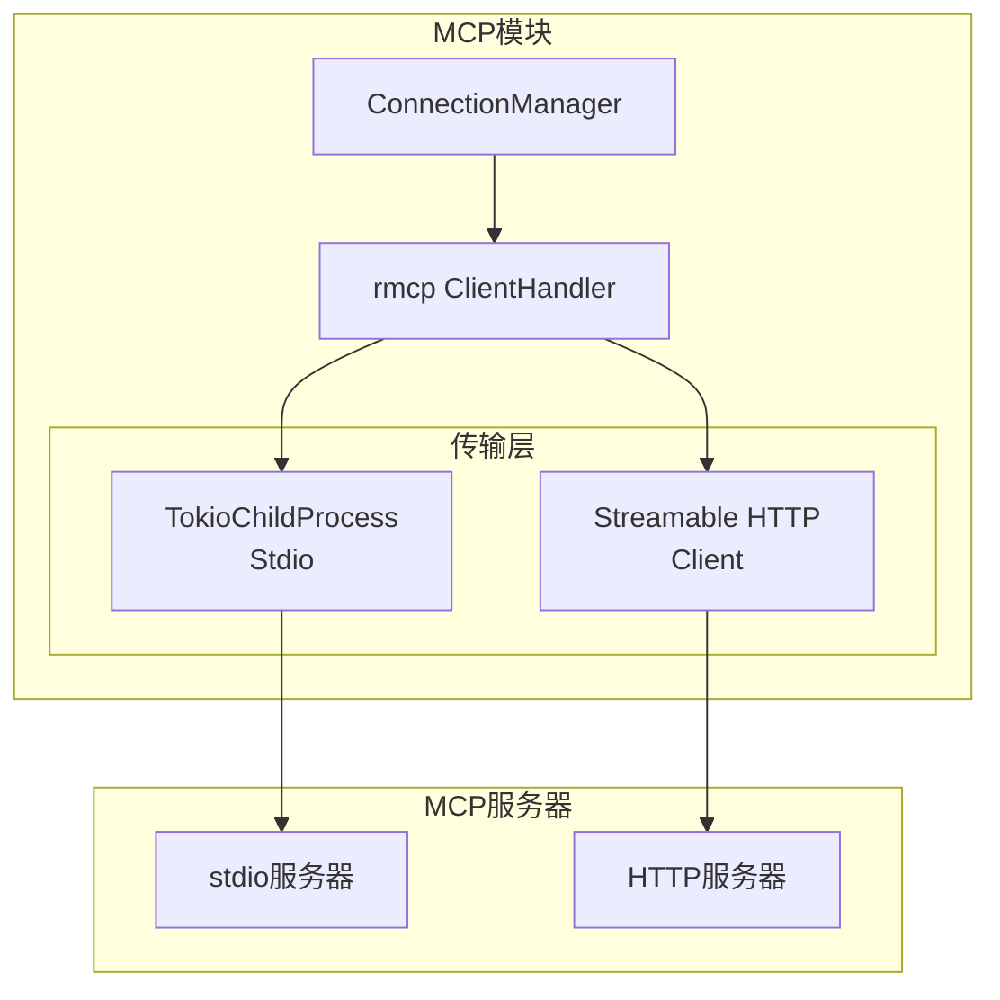
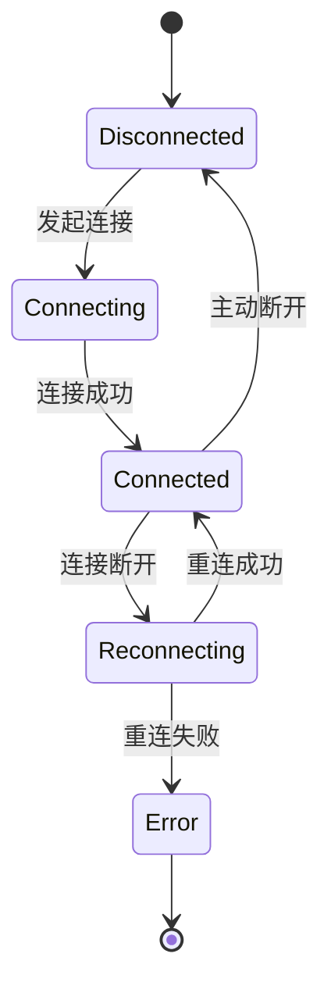

# TECH-MCP: MCP模块

本文档描述NeoCo项目的MCP（Model Context Protocol）模块设计。

**设计原则：**
- 支持stdio和HTTP两种传输模式
- 连接状态自动管理（重连、心跳）
- 工具定义与执行分离

## 1. 模块概述

MCP模块提供与MCP服务器的通信能力，支持stdio和HTTP两种传输模式。

## 2. 架构设计

### 2.1 系统架构



## 3. MCP管理

### 3.1 连接管理

```rust
pub struct McpManager {
    connections: DashMap<String, Arc<RwLock<McpConnection>>>,
    config: HashMap<String, McpServerConfig>,
}

#[derive(Debug, Clone)]
pub struct McpConnection {
    pub name: String,
    pub config: McpServerConfig,
    pub status: McpServerStatus,
    pub peer: Option<Peer>,
    pub tools: Vec<McpTool>,
}

#[derive(Debug, Clone, Copy, PartialEq, Eq)]
pub enum McpServerStatus {
    Disconnected,
    Connecting,
    Connected,
    Reconnecting,
    Error,
}
```

**状态与peer关系：**

| `status` | `peer` | 说明 |
|----------|--------|------|
| `Disconnected` | `None` | 未连接，无peer实例 |
| `Connecting` | `None` | 连接中，peer尚未创建 |
| `Connected` | `Some(Peer)` | 已连接，peer可用 |
| `Reconnecting` | `None` | 重连中，旧peer已丢弃 |
| `Error` | `None` | 错误状态，peer已清理 |

### 3.2 工具包装

```rust
pub struct McpToolWrapper {
    server_name: String,
    tool: McpTool,
    manager: Arc<McpManager>,
}

#[async_trait]
impl ToolExecutor for McpToolWrapper {
    fn definition(&self) -> &ToolDefinition {
        // [TODO] 实现要点说明
        // 1. 从 self.tool 中提取工具名称、描述和参数模式
        // 2. 转换为 ToolDefinition 结构返回
        unimplemented!()
    }
    
    async fn execute(
        &self,
        context: &ToolContext,
        args: Value,
    ) -> Result<ToolResult, ToolError> {
        // [TODO] 实现要点说明
        // 1. 从连接池获取该server的连接
        // 2. 构建MCP JSON-RPC请求（tools/call方法）
        // 3. 发送请求并等待响应
        // 4. 解析响应结果
        // 5. 转换为ToolResult返回
        unimplemented!()
    }
}
```

### 3.3 工具定义

| 工具 | 功能 | 超时 |
|------|------|------|
| `mcp::server_name` | 调用MCP服务器工具 | 60秒 |

### 3.4 工具注册

```rust
pub async fn register_mcp_tools(
    manager: &McpManager,
    registry: &mut dyn ToolRegistry,
    server_name: &str,
) -> Result<usize, McpError> {
    // [TODO] 实现要点说明
    // 1. 根据 server_name 获取服务器配置
    // 2. 创建连接（stdio或http方式）
    // 3. 发送 initialize 请求进行协议握手
    // 4. 发送 tools/list 获取可用工具列表
    // 5. 为每个工具创建 McpToolWrapper
    // 6. 将工具包装器注册到 ToolRegistry
    // 7. 返回注册的工具数量

    // 错误处理策略：
    // - 连接失败：立即返回错误，不注册任何工具
    // - 部分工具注册失败：记录失败工具，继续注册其他工具
    // - 返回成功注册的工具数量（可能为0）
    // - 所有工具都失败：返回错误，包含失败详情
    unimplemented!()
}
```

## 4. 传输实现

### 4.1 Stdio传输

```rust
pub async fn connect_stdio(
    command: String,
    args: Vec<String>,
) -> Result<Peer, McpError> {
    // [TODO] 实现要点说明
    // 1. 使用 Command 创建子进程
    // 2. 配置子进程参数（args）
    // 3. 创建 TokioChildProcess 传输层
    // 4. 使用 RmcpClient 包装传输层
    // 5. 调用 client.serve() 启动客户端并返回 Peer
    unimplemented!()
}
```

### 4.2 HTTP传输

```rust
pub async fn connect_http(
    url: &str,
) -> Result<Peer, McpError> {
    // [TODO] 实现要点说明
    // 1. 使用 Streamable HTTP 传输模式（MCP 2025-11-25+）
    // 2. 创建 StreamableHttpClientTransport，传入 url
    // 3. 支持 session 管理，支持请求/响应和 SSE 两种模式
    // 4. 使用 rmcp::Client 包装传输层
    // 5. 调用 client.serve() 启动客户端并返回 Peer
    unimplemented!()
}
```

## 5. 错误处理

作为公共错误边界供其他 crate 显式映射使用：

```rust
#[derive(Debug, Error)]
pub enum McpError {
    #[error("连接失败: {0}")]
    ConnectionFailed(String),
    
    #[error("工具调用失败: {0}")]
    ToolCallFailed(String),
    
    #[error("服务器错误: {0}")]
    ServerError(String),
    
    #[error("超时")]
    Timeout,
    
    #[error("协议错误: {0}")]
    ProtocolError(String),
    
    #[error("认证失败")]
    AuthenticationFailed,
}

impl McpError {
    pub fn is_retryable(&self) -> bool {
        matches!(self, Self::Timeout | Self::ConnectionFailed(_))
    }
}
```

## 6. MCP协议消息定义

### 6.1 JSON-RPC消息格式

MCP协议基于JSON-RPC 2.0规范，主要消息类型包括：

```json
// 工具调用请求
{
    "jsonrpc": "2.0",
    "id": 1,
    "method": "tools/call",
    "params": {
        "name": "tool_name",
        "arguments": {}
    }
}

// 初始化请求
{
    "jsonrpc": "2.0",
    "id": 1,
    "method": "initialize",
    "params": {
        "protocolVersion": "2025-06-18",
        "capabilities": {
            // 客户端能力声明
        },
        "clientInfo": {
            "name": "neoco",
            "version": "0.1.0"
        }
    }
}

// 工具列表请求
{
    "jsonrpc": "2.0",
    "id": 1,
    "method": "tools/list",
    "params": {}
}
```

### 6.2 核心方法

| 方法 | 方向 | 说明 |
|------|------|------|
| `initialize` | Client→Server | 初始化连接，交换协议版本和能力 |
| `tools/list` | Client→Server | 获取可用工具列表 |
| `tools/call` | Client→Server | 调用指定工具 |
| `resources/list` | Client→Server | 获取可用的资源列表 |
| `resources/read` | Client→Server | 读取指定资源内容 |
| `prompts/list` | Client→Server | 获取可用的提示词模板列表 |
| `prompts/get` | Client→Server | 获取指定提示词模板 |
| `notifications/initialized` | Client→Server | 通知初始化完成 |
| `notifications/tools/list_changed` | Server→Client | 工具列表变更通知 |
| `notifications/resources/list_changed` | Server→Client | 资源列表变更通知 |
| `notifications/prompts/list_changed` | Server→Client | 提示词列表变更通知 |
| `ping` | Client↔Server | 心跳保活 |

## 7. 连接生命周期

### 7.1 连接状态流转



### 7.2 连接管理策略

- **连接池**: 每个MCP服务器维护一个连接池，默认大小为1
- **心跳**: 每30秒发送ping请求，超时10秒视为连接断开
- **重连**: 断开后自动重连，最多尝试3次，间隔递增（1s, 2s, 4s）
- **健康检查**: 连接建立后立即进行tools/list调用验证可用性

**可配置的重连策略：**

```rust
pub struct ReconnectConfig {
    pub max_attempts: u32,      // 最大重连次数，默认3
    #[serde(with = "serde_human_readable_duration")]
    pub initial_backoff: Duration,  // 初始延迟，默认1s
    #[serde(with = "serde_human_readable_duration")]
    pub max_backoff: Duration,       // 最大延迟，默认4s
    pub backoff_multiplier: f64,     // 退避倍数，默认2.0
}

impl Default for ReconnectConfig {
    fn default() -> Self {
        Self {
            max_attempts: 3,
            initial_backoff: Duration::from_secs(1),
            max_backoff: Duration::from_secs(4),
            backoff_multiplier: 2.0,
        }
    }
}
```

### 7.3 生命周期事件

```rust
pub enum ConnectionEvent {
    Connected { server: String },
    Disconnected { server: String, reason: DisconnectReason },
    Reconnecting { server: String, attempt: u32 },
    Error { server: String, error: McpError },
}

pub enum DisconnectReason {
    RemoteClosed,
    TransportError,
    Timeout,
    MaxRetriesExceeded,
}
```

---

## 8. rmcp 依赖配置

### Cargo.toml 配置

```toml
rmcp = { version = "1.1", features = [
    "client",
    "transport-child-process",
    "transport-streamable-http-client-reqwest",
    "reqwest"  # TLS 后端
] }
```

### Feature 说明

| Feature | 说明 |
|---------|------|
| `client` | 启用客户端功能 |
| `transport-child-process` | 支持 stdio 传输 |
| `transport-streamable-http-client-reqwest` | 支持 Streamable HTTP 传输（使用 reqwest） |
| `reqwest` | reqwest 作为 HTTP 客户端后端 |

### 传输层使用示例

**Stdio 传输：**
```rust
use rmcp::{ServiceExt, transport::{ConfigureCommandExt, TokioChildProcess}};
use tokio::process::Command;

let client = ()
    .serve(TokioChildProcess::new(Command::new("npx").configure(|cmd| {
        cmd.args(["-y", "@modelcontextprotocol/server-filesystem", "/tmp"]);
    }))?)
    .await?;
```

**Streamable HTTP 传输：**
```rust
use rmcp::{ServiceExt, transport::StreamableHttpClientTransport};

let client = ()
    .serve(StreamableHttpClientTransport::from_uri("http://localhost:3000/mcp"))
    .await?;
```

---

*关联文档：*
- [TECH.md](TECH.md) - 总体架构文档
- [TECH-TOOL.md](TECH-TOOL.md) - 工具模块
- [TECH-CONFIG.md](TECH-CONFIG.md) - 配置管理模块
