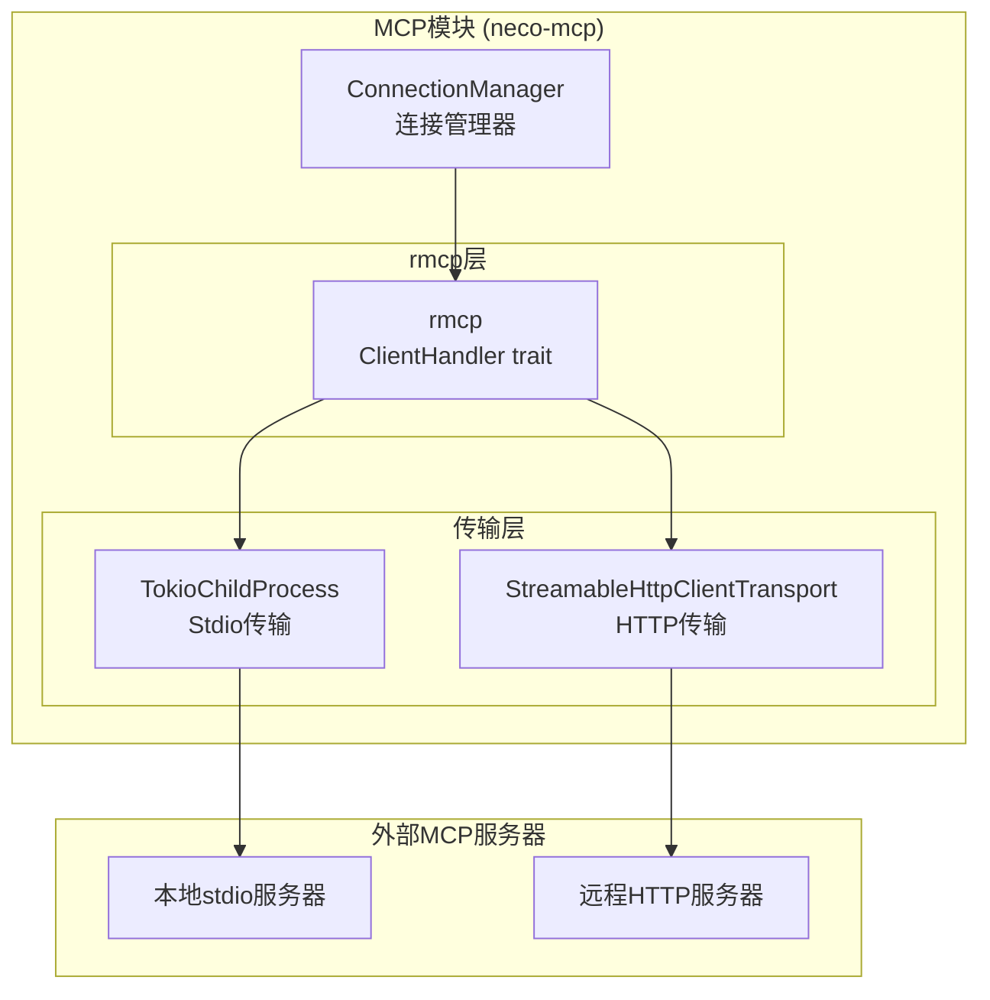
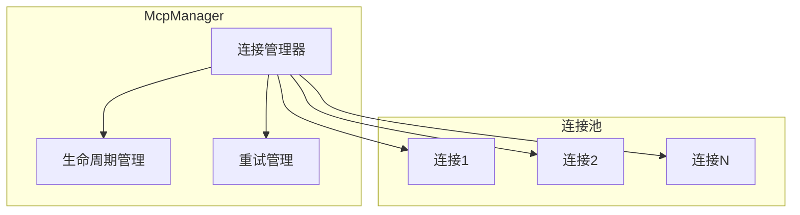
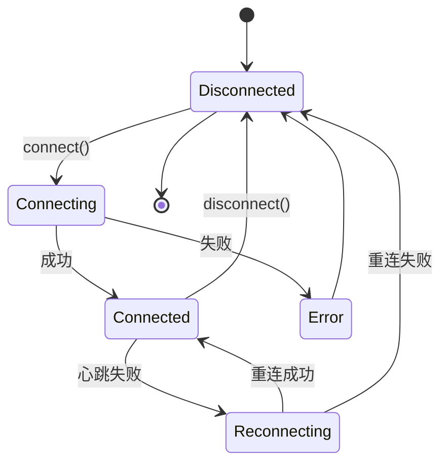

# TECH-MCP: MCP模块

本文档描述Neco项目的MCP（Model Context Protocol）模块设计，包括MCP客户端实现和服务器管理。

## 1. 模块概述

MCP模块提供与MCP服务器的通信能力，支持stdio和HTTP两种传输模式。

## 2. 架构设计

### 2.1 MCP系统架构

基于 [rmcp](https://crates.io/crates/rmcp) crate (版本 1.1.0) 实现，rmcp 是 Model Context Protocol 的官方 Rust SDK。



## 3. 数据结构设计

### 3.1 MCP服务器配置

配置与 TOML 文件格式对应，用于定义 MCP 服务器连接参数。

```rust
/// MCP服务器配置
#[derive(Debug, Clone, Deserialize)]
pub struct McpServerConfig {
    /// 传输类型
    #[serde(flatten)]
    pub transport: McpTransportConfig,
    
    /// 环境变量
    #[serde(default)]
    pub env: HashMap<String, String>,
}

/// MCP传输方式配置
#[derive(Debug, Clone, Deserialize)]
#[serde(tag = "type")]
pub enum McpTransportConfig {
    /// 本地stdio传输
    #[serde(rename = "stdio")]
    Stdio {
        /// 命令
        command: String,
        /// 参数
        #[serde(default)]
        args: Vec<String>,
    },
    
    /// HTTP传输
    #[serde(rename = "http")]
    Http {
        /// 服务器URL
        url: Url,
        /// Bearer Token环境变量名
        bearer_token_env: Option<String>,
        /// 额外HTTP头
        #[serde(default)]
        headers: HashMap<String, String>,
    },
}

/// MCP服务器状态
#[derive(Debug, Clone, Copy, PartialEq, Eq)]
pub enum McpServerStatus {
    /// 未连接
    Disconnected,
    /// 连接中
    Connecting,
    /// 已连接
    Connected,
    /// 错误
    Error,
}
```

## 4. 传输层实现

基于 rmcp crate 实现。rmcp 提供了完整的 MCP 协议支持，包括传输层。

### 4.1 核心类型

```rust
use rmcp::{
    ClientHandler, 
    ErrorData as McpError, 
    model::*, 
    service::{RequestContext, RoleClient, Peer},
    ServiceExt,
};
use rmcp::transport::{TokioChildProcess, ConfigureCommandExt, StreamableHttpClientTransport};
use tokio::process::Command;

/// 自定义 ClientHandler
/// 处理来自 MCP 服务器的请求
#[derive(Clone, Default)]
struct RmcpClient;

impl ClientHandler for RmcpClient {
    fn get_info(&self) -> ClientInfo {
        ClientInfo {
            name: "neco-mcp-client".into(),
            version: "0.1.0".into(),
            ..Default::default()
        }
    }
    
    // 处理服务器的采样请求
    // 提示：可以在这里调用 LLM 来处理采样请求
    async fn create_message(
        &self,
        params: CreateMessageRequestParams,
        _context: RequestContext<RoleClient>,
    ) -> Result<CreateMessageResult, McpError> {
        // TODO: 实现采样请求处理
        // 1. 将 params.messages 转换为模型调用
        // 2. 调用 LLM 获取响应
        // 3. 返回 CreateMessageResult
        todo!()
    }
    
    // 处理进度通知
    fn on_progress(
        &self,
        params: ProgressNotificationParam,
        _context: rmcp::service::NotificationContext<RoleClient>,
    ) {
        // TODO: 记录进度或通知 UI
        tracing::debug!("MCP progress: {}/{}", params.progress, params.total.unwrap_or(0));
    }
    
    // 处理日志消息
    fn on_logging_message(
        &self,
        params: LoggingMessageNotificationParam,
        _context: rmcp::service::NotificationContext<RoleClient>,
    ) {
        // TODO: 处理日志消息
    }
}
```

### 4.2 Stdio 传输

```rust
/// 连接到 MCP 服务器 (stdio 模式)
pub async fn connect_stdio(
    command: String,
    args: Vec<String>,
) -> Result<Peer, McpError> {
    let client = RmcpClient;
    
    // 使用 rmcp 的 TokioChildProcess
    let peer = client
        .serve(TokioChildProcess::new(
            Command::new(command).configure(|cmd| {
                for arg in args {
                    cmd.arg(arg);
                }
            })?
        )?)
        .await?;
    
    Ok(peer)
}

// TODO: 补充环境变量处理
// 提示：使用 Command::env() 设置环境变量
```

### 4.3 HTTP 传输

```rust
/// 连接到 MCP 服务器 (HTTP 模式)
pub async fn connect_http(
    url: &str,
) -> Result<Peer, McpError> {
    let client = RmcpClient;
    
    let peer = client
        .serve(StreamableHttpClientTransport::new(url))
        .await?;
    
    Ok(peer)
}

// TODO: 补充认证头处理
// 提示：通过 StreamableHttpClientTransport::with_auth() 设置
```

### 4.4 Feature Flags

```toml
rmcp = { version = "1.1.0", features = [
    "client",           # 客户端功能
    "macros",          # 工具宏
    "transport-child-process",  # stdio 传输
    "transport-streamable-http-client",  # HTTP 传输
] }
```

## 5. MCP 管理器

### 5.1 连接管理

```rust
use rmcp::model::*;
use std::sync::Arc;
use tokio::sync::RwLock;

/// MCP管理器
pub struct McpManager {
    /// 活跃连接
    connections: Arc<RwLock<HashMap<String, McpConnection>>>,
    
    /// 配置
    config: HashMap<String, McpServerConfig>,
}

/// MCP连接
pub struct McpConnection {
    pub name: String,
    pub config: McpServerConfig,
    pub status: McpServerStatus,
    pub peer: Option<Peer>,
    pub tools: Vec<McpTool>,
}

impl McpManager {
    /// 创建MCP管理器
    pub fn new(config: HashMap<String, McpServerConfig>) -> Self {
        // TODO: 初始化连接管理器
        todo!()
    }
    
    /// 连接到MCP服务器
    pub async fn connect(&self, name: &str) -> Result<Vec<McpTool>, McpError> {
        // TODO: 实现连接逻辑
        // 1. 获取服务器配置
        // 2. 根据传输类型调用 connect_stdio 或 connect_http
        // 3. 调用 peer.initialize() 初始化
        // 4. 调用 peer.list_tools() 获取工具列表
        // 5. 保存连接状态
        todo!()
    }
    
    /// 列出可用工具
    pub async fn list_tools(&self, server_name: &str) -> Result<Vec<McpTool>, McpError> {
        // TODO: 从连接中获取工具列表
        todo!()
    }
    
    /// 调用MCP工具
    pub async fn call_tool(
        &self,
        server_name: &str,
        tool_name: &str,
        arguments: Value,
    ) -> Result<CallToolResult, McpError> {
        // TODO: 实现工具调用
        // 1. 获取连接
        // 2. 调用 peer.call_tool()
        // 3. 返回结果
        todo!()
    }
    
    /// 断开连接
    pub async fn disconnect(&self, name: &str) -> Result<(), McpError> {
        // TODO: 关闭连接
        todo!()
    }
}
```

### 5.2 连接管理器扩展



### 5.3 连接状态机



### 5.4 连接池设计

```rust
/// MCP连接池配置
pub struct McpPoolConfig {
    /// 最大连接数
    pub max_connections: usize,
    /// 最小空闲连接
    pub min_idle: usize,
    /// 连接超时
    pub connection_timeout: Duration,
    /// 空闲超时
    pub idle_timeout: Duration,
    /// 最大生命周期
    pub max_lifetime: Duration,
}

/// 连接池统计
pub struct PoolStats {
    pub active: usize,
    pub idle: usize,
    pub waiting: usize,
    pub total: usize,
}
```

## 6. 工具集成

### 6.1 MCP工具包装器

```rust
/// MCP工具包装器（实现ToolProvider）
pub struct McpToolWrapper {
    server_name: String,
    tool: McpTool,
    mcp_manager: Arc<McpManager>,
}

impl McpToolWrapper {
    pub fn new(
        server_name: String,
        tool: McpTool,
        mcp_manager: Arc<McpManager>,
    ) -> Self {
        // TODO: 初始化
        todo!()
    }
}

impl ToolProvider for McpToolWrapper {
    fn name(&self) -> &str {
        // TODO: 返回格式为 "mcp::server_name::tool_name"
        todo!()
    }
    
    fn description(&self) -> &str {
        &self.tool.description
    }
    
    fn parameters_schema(&self) -> Value {
        self.tool.input_schema.clone()
    }
    
    fn timeout(&self) -> Duration {
        Duration::from_secs(60)
    }
    
    async fn execute(&self, args: Value) -> Result<ToolResult, ToolError> {
        // TODO: 调用 mcp_manager.call_tool()
        // 转换 CallToolResult 为 ToolResult
        todo!()
    }
}
```

### 6.2 工具注册

```rust
/// 注册MCP服务器工具到工具注册表
pub async fn register_mcp_tools(
    mcp_manager: &McpManager,
    tool_registry: &mut ToolRegistry,
    server_name: &str,
) -> Result<usize, McpError> {
    // TODO: 实现工具注册
    // 1. 调用 mcp_manager.connect() 连接服务器
    // 2. 调用 mcp_manager.list_tools() 获取工具列表
    // 3. 为每个工具创建 McpToolWrapper
    // 4. 注册到 tool_registry
    // 5. 返回注册数量
    todo!()
}
```

## 7. 错误处理

> **注意**: 所有模块错误类型统一在 `neco-core` 中汇总为 `AppError`。见 [TECH.md#53-统一错误类型设计](TECH.md#53-统一错误类型设计)。

MCP模块使用 `rmcp::ErrorData` 作为基础错误类型，相关错误会统一转换并汇总到 `neco-core::AppError` 中。

---

**关联文档：**
- [TECH.md](./TECH.md) - 总体架构文档
- [TECH-TOOL.md](./TECH-TOOL.md) - 工具模块
- [TECH-CONFIG.md](./TECH-CONFIG.md) - 配置管理模块
