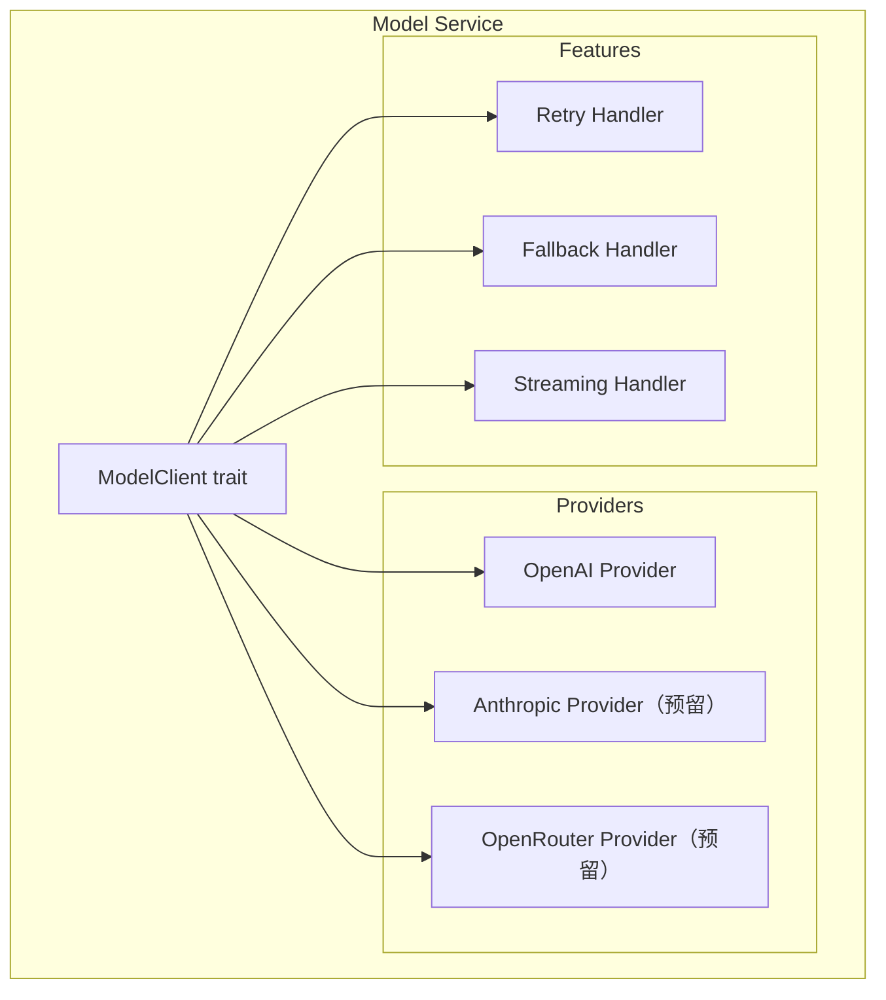
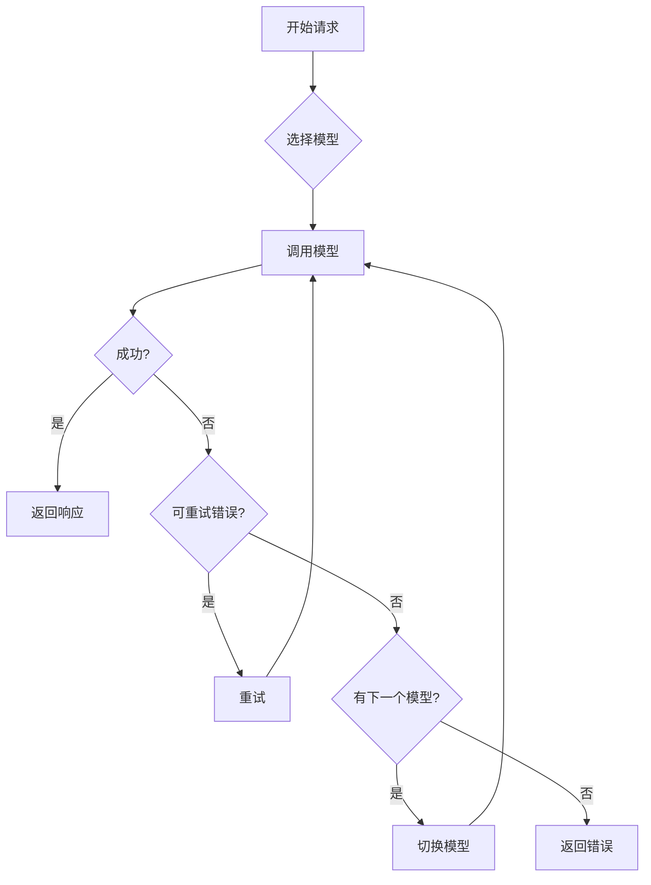
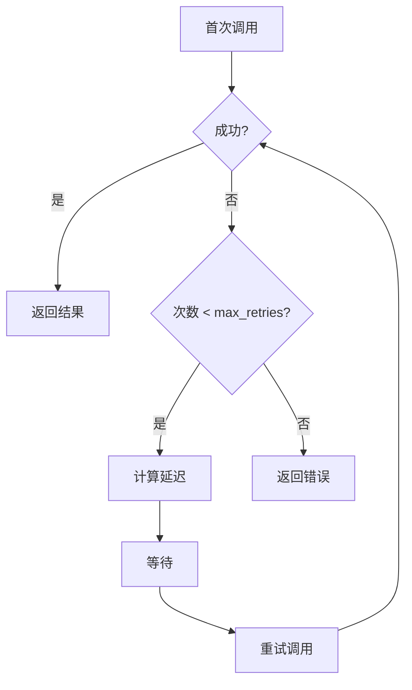
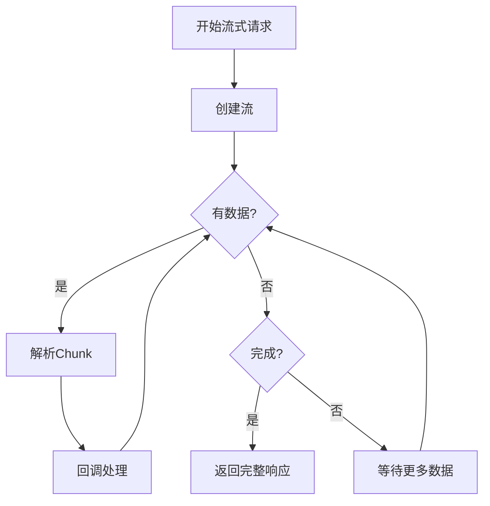

# TECH-MODEL: 模型服务模块

本文档描述NeoCo项目的模型服务模块设计。

## 1. 模块概述

模型服务模块负责与各种LLM提供商交互，提供统一的调用接口，支持故障转移、重试和流式输出。

## 2. 架构设计

### 2.1 模块结构



## 3. 模型客户端接口

### 3.1 ModelClient Trait

```rust
/// 模型能力
#[derive(Debug, Clone)]
pub struct ModelCapabilities {
    pub streaming: bool,
    pub tools: bool,
    pub functions: bool,
    pub json_mode: bool,
    pub vision: bool,
    pub context_window: usize,
}

/// 聊天完成请求
#[derive(Debug, Clone)]
pub struct ChatRequest<'a> {
    pub model: String,
    pub messages: Vec<ModelMessage<'a>>,
    pub stream: bool,
    pub temperature: Option<f64>,
    pub max_tokens: Option<u32>,
    /// 工具定义列表（provider-neutral 抽象）
    /// 由工具注册表统一管理，与具体 LLM Provider 无关
    pub tools: Option<Vec<crate::tool::ToolDefinition>>,
    pub tool_choice: Option<ToolChoice>,
    pub response_format: Option<ResponseFormat>,
    pub stop: Option<Vec<String>>,
    pub extra_params: ExtraParams,
}

/// 工具选择（强类型）
#[derive(Debug, Clone)]
pub enum ToolChoice {
    Auto,
    None,
    Function { name: String },
}

impl ToolChoice {
    pub fn to_value(&self) -> Value {
        match self {
            Self::Auto => Value::String("auto".to_string()),
            Self::None => Value::String("none".to_string()),
            Self::Function { name } => json!({ "type": "function", "function": { "name": name } }),
        }
    }
}

/// 响应格式（强类型）
#[derive(Debug, Clone)]
pub enum ResponseFormat {
    Text,
    JsonObject,
    JsonSchema { schema: Value },
}

impl ResponseFormat {
    pub fn to_value(&self) -> Value {
        match self {
            Self::Text => Value::String("text".to_string()),
            Self::JsonObject => Value::String("json_object".to_string()),
            Self::JsonSchema { schema } => json!({ "json_schema": schema }),
        }
    }
}

/// 额外参数（强类型map）
#[derive(Debug, Clone)]
pub struct ExtraParams(HashMap<String, Value>);

impl ExtraParams {
    pub fn new() -> Self {
        Self(HashMap::new())
    }
    
    pub fn insert(&mut self, key: impl Into<String>, value: Value) {
        self.0.insert(key.into(), value);
    }
    
    pub fn get(&self, key: &str) -> Option<&Value> {
        self.0.get(key)
    }
}

impl std::ops::Deref for ExtraParams {
    type Target = HashMap<String, Value>;
    fn deref(&self) -> &Self::Target {
        &self.0
    }
}

/// 聊天完成响应
#[derive(Debug, Clone)]
pub struct ChatResponse {
    pub id: String,
    pub model: String,
    pub choices: Vec<Choice>,
    pub usage: Usage,
}

#[derive(Debug, Clone)]
pub struct Choice {
    pub index: usize,
    pub message: Message,
    pub finish_reason: Option<String>,
}

#[derive(Debug, Clone)]
pub struct Usage {
    pub prompt_tokens: u32,
    pub completion_tokens: u32,
    pub total_tokens: u32,
}

/// 模型客户端接口
#[async_trait]
pub trait ModelClient: Send + Sync {
    async fn chat_completion(
        &self,
        request: ChatRequest,
    ) -> Result<ChatResponse, ModelError>;
    
    async fn chat_completion_stream(
        &self,
        request: ChatRequest,
    ) -> Result<BoxStream<Result<ChatChunk, ModelError>>, ModelError>;
    
    fn capabilities(&self) -> ModelCapabilities;
}
```

## 4. 类型定义

### 4.1 消息类型

```rust
/// 聊天消息（Model层使用，无id）
#[derive(Debug, Clone)]
pub struct ModelMessage<'a> {
    pub role: Role,
    pub content: Cow<'a, str>,
    pub tool_calls: Option<&'a [ToolCall]>,
    pub tool_call_id: Option<&'a str>,
}

impl<'a> ModelMessage<'a> {
    /// 验证消息状态组合是否合法
    pub fn validate(&self) -> Result<(), MessageValidationError> {
        match self.role {
            Role::Tool => {
                if self.tool_call_id.is_none() {
                    return Err(MessageValidationError { message: "Tool message must have tool_call_id".into() });
                }
                if self.tool_calls.is_some() {
                    return Err(MessageValidationError { message: "Tool message cannot have tool_calls".into() });
                }
            }
            Role::User => {
                if self.tool_call_id.is_some() {
                    return Err(MessageValidationError { message: "User message cannot have tool_call_id".into() });
                }
                if self.tool_calls.is_some() {
                    return Err(MessageValidationError { message: "User message cannot have tool_calls".into() });
                }
            }
            Role::Assistant => {
                if self.tool_call_id.is_some() {
                    return Err(MessageValidationError { message: "Assistant message cannot have tool_call_id".into() });
                }
            }
            Role::System => {
                if self.tool_calls.is_some() {
                    return Err(MessageValidationError { message: "System message cannot have tool_calls".into() });
                }
                if self.tool_call_id.is_some() {
                    return Err(MessageValidationError { message: "System message cannot have tool_call_id".into() });
                }
            }
        }
        Ok(())
    }
    
    /// 创建用户消息
    pub fn user(content: impl Into<Cow<'a, str>>) -> Self {
        Self {
            role: Role::User,
            content: content.into(),
            tool_calls: None,
            tool_call_id: None,
        }
    }
    
    /// 创建助手消息（可包含工具调用）
    pub fn assistant(content: impl Into<Cow<'a, str>>, tool_calls: Option<&'a [ToolCall]>) -> Self {
        Self {
            role: Role::Assistant,
            content: content.into(),
            tool_calls,
            tool_call_id: None,
        }
    }
    
    /// 创建工具结果消息
    pub fn tool(content: impl Into<Cow<'a, str>>, tool_call_id: &'a str) -> Self {
        Self {
            role: Role::Tool,
            content: content.into(),
            tool_calls: None,
            tool_call_id: Some(tool_call_id),
        }
    }
}

/// 消息验证错误
#[derive(Debug, Clone)]
pub struct MessageValidationError {
    pub message: String,
}
```

### 4.2 工具调用

```rust
/// 工具调用
#[derive(Debug, Clone)]
pub struct ToolCall {
    pub id: String,
    pub name: String,
    pub arguments: Value,
}
```

### 4.4 流式响应块

```rust
/// 流式响应块
#[derive(Debug, Clone)]
pub struct ChatChunk {
    pub id: String,
    pub choices: Vec<ChunkChoice>,
}
```

### 4.5 消息（响应中的消息）

```rust
#[derive(Debug, Clone)]
pub struct Message {
    pub role: String,
    pub content: String,
    pub tool_calls: Option<Vec<ToolCall>>,
    pub tool_call_id: Option<String>,
}
```

### 4.6 模型引用

```rust
/// 模型引用
#[derive(Debug, Clone)]
pub struct ModelRef {
    pub name: String,
    pub provider: String,
}
```

### 4.7 重试配置

```rust
/// 重试配置
/// 
/// 注意：此类型应与 TECH-CONFIG.md 中的 RetryConfig 保持一致
/// 实际实现应从 config 模块导入，避免重复定义
#[derive(Debug, Clone)]
pub struct RetryConfig {
    pub max_retries: u32,
    pub initial_delay_ms: u64,
    pub max_delay_ms: u64,
    pub backoff_multiplier: f64,
}

impl Default for RetryConfig {
    fn default() -> Self {
        Self {
            max_retries: 3,
            initial_delay_ms: 100,
            max_delay_ms: 5000,
            backoff_multiplier: 2.0,
        }
    }
}
```

## 5. 业务流程图

### 5.1 故障转移流程



### 5.2 重试流程



### 5.3 流式处理流程



## 6. 模型组客户端

```rust
pub struct ModelGroupClient {
    name: String,
    models: Vec<ModelRef>,
    clients: DashMap<String, Arc<dyn ModelClient>>,
    retry_config: RetryConfig,
}

impl ModelGroupClient {
    pub async fn chat_completion(
        &self,
        mut request: ChatRequest,
    ) -> Result<ChatResponse, ModelError> {
        // TODO: 实现故障转移逻辑
        // 1. 遍历模型列表，按优先级顺序尝试
        // 2. 对每个模型：设置模型参数并调用
        // 3. 调用失败时检查错误类型
        // 4. 可重试错误进行指数退避重试
        // 5. 不可重试错误或重试耗尽时切换下一个模型
        // 6. 所有模型都失败时返回聚合错误
        unimplemented!()
    }
}
```

## 7. OpenAI客户端实现

### 7.1 客户端结构

```rust
pub struct OpenAiClient {
    config: OpenAiClientConfig,
    inner: Client<OpenAIConfig>,
}

pub struct OpenAiClientConfig {
    pub api_key: Secret<String>,
    pub base_url: Url,
    pub model: String,
}

impl OpenAiClient {
    pub fn new(config: OpenAiClientConfig) -> Result<Self, ConfigError> {
        // TODO: 实现构造逻辑
        // 1. 使用config创建OpenAIConfig
        // 2. 从环境变量或config获取API Key
        // 3. 配置Base URL和超时
        // 4. 创建并返回OpenAiClient实例
        unimplemented!()
    }
}

#[async_trait]
impl ModelClient for OpenAiClient {
    async fn chat_completion(
        &self,
        request: ChatRequest,
    ) -> Result<ChatResponse, ModelError> {
        // TODO: 实现聊天完成请求
        // 1. 将ChatRequest转换为OpenAI API格式
        // 2. 调用OpenAI聊天完成API
        // 3. 处理API错误并转换为我们自己的ModelError
        // 4. 将响应转换回ChatResponse格式
        unimplemented!()
    }
    
    async fn chat_completion_stream(
        &self,
        request: ChatRequest,
    ) -> Result<BoxStream<Result<ChatChunk, ModelError>>, ModelError> {
        // TODO: 实现流式API
        // 1. 将ChatRequest转换为OpenAI API格式
        // 2. 调用OpenAI流式API (sse::Event)
        // 3. 将SSE事件转换为ChatChunk
        // 4. 处理连接错误和重连逻辑
        unimplemented!()
    }
    
    fn capabilities(&self) -> ModelCapabilities {
        // TODO: 使用能力注册表模式替代硬编码 (见 7.2 节)
        // 建议：从 MODEL_CAPABILITIES 静态注册表或配置文件获取能力
        self.get_capabilities_for_model(&self.config.model)
    }
}
```

### 7.2 更灵活的方案：能力注册表

对于生产环境，建议使用能力注册表模式，将模型能力配置外部化：

```rust
use std::collections::HashMap;
use std::sync::Arc;
use std::sync::LazyLock;

/// 模型能力标识符
#[derive(Debug, Clone, Hash, Eq, PartialEq)]
pub struct ModelCapabilityKey {
    pub provider: String,
    pub model: String,
}

/// 全局模型能力注册表
/// 使用(provider, model)组合键，支持不同提供商的同名模型
static MODEL_CAPABILITIES: LazyLock<HashMap<ModelCapabilityKey, ModelCapabilities>> = LazyLock::new(|| {
    let mut m = HashMap::new();
    
    // OpenAI - GPT-4 Vision 系列
    m.insert(ModelCapabilityKey { provider: "openai".into(), model: "gpt-4-vision-preview".into() }, ModelCapabilities {
        streaming: true,
        tools: true,
        functions: true,
        json_mode: true,
        vision: true,
        context_window: 128_000,
    });
    m.insert(ModelCapabilityKey { provider: "openai".into(), model: "gpt-4o".into() }, ModelCapabilities {
        streaming: true,
        tools: true,
        functions: true,
        json_mode: true,
        vision: true,
        context_window: 128_000,
    });
    
    // OpenAI - GPT-4 Turbo
    m.insert(ModelCapabilityKey { provider: "openai".into(), model: "gpt-4-turbo".into() }, ModelCapabilities {
        streaming: true,
        tools: true,
        functions: true,
        json_mode: true,
        vision: false,
        context_window: 128_000,
    });
    
    // OpenAI - GPT-3.5 系列
    m.insert(ModelCapabilityKey { provider: "openai".into(), model: "gpt-3.5-turbo".into() }, ModelCapabilities {
        streaming: true,
        tools: true,
        functions: true,
        json_mode: true,
        vision: false,
        context_window: 16_385,
    });
    
    m
});

impl OpenAiClient {
    /// 从注册表获取模型能力
    fn get_capabilities_for_model(&self, model: &str) -> ModelCapabilities {
        let key = ModelCapabilityKey {
            provider: "openai".into(),
            model: model.to_string(),
        };
        MODEL_CAPABILITIES
            .get(&key)
            .cloned()
            .unwrap_or_else(|| ModelCapabilities {
                // 未知模型的默认能力
                streaming: true,
                tools: false,
                functions: false,
                json_mode: false,
                vision: false,
                context_window: 4096,
            })
    }
    
    /// 动态查询API获取模型能力（可选）
    async fn fetch_capabilities_from_api(&self, model: &str) -> Result<ModelCapabilities, ModelError> {
        // 调用OpenAI的模型列表API获取最新信息
        // https://api.openai.com/v1/models
        // 这可以自动发现新模型和更新后的能力
        unimplemented!()
    }
}

#[async_trait]
impl ModelClient for OpenAiClient {
    fn capabilities(&self) -> ModelCapabilities {
        self.get_capabilities_for_model(&self.config.model)
    }
}
```

**优势：**
1. 集中管理所有模型能力，易于维护
2. 支持动态添加新模型，无需修改代码
3. 可以从配置文件或API加载能力信息
4. 避免硬编码，提高灵活性

**配置文件示例（TOML）：**
```toml
[model_capabilities.openai.gpt-4o]
streaming = true
tools = true
functions = true
json_mode = true
vision = true
context_window = 128000

[model_capabilities.openai.gpt-4-turbo]
streaming = true
tools = true
functions = true
json_mode = true
vision = false
context_window = 128000

[model_capabilities.anthropic.claude-3-opus]
streaming = true
tools = true
functions = true
json_mode = true
vision = true
context_window = 200000
```

## 8. 流式输出处理

```rust
use futures::StreamExt;

pub struct StreamHandler;

impl StreamHandler {
    pub async fn collect_full_response(
        stream: BoxStream<Result<ChatChunk, ModelError>>,
    ) -> Result<String, ModelError> {
        // TODO: 收集完整响应
        // 1. 遍历流中的所有chunk
        // 2. 累加每个chunk的content字段
        // 3. 处理stream结束信号
        // 4. 检查finish_reason确定是否正常结束
        // 5. 返回拼接后的完整文本
        unimplemented!()
    }
    
    pub async fn process_with_callback<F>(
        stream: BoxStream<Result<ChatChunk, ModelError>>,
        mut callback: F,
    ) -> Result<ChatResponse, ModelError>
    where
        F: FnMut(&str),
    {
        // TODO: 实时处理流
        // 1. 对每个chunk调用callback进行实时处理
        // 2. 同时收集增量内容用于构建最终响应
        // 3. 检测并合并工具调用增量(delta)
        // 4. 处理流结束，组装完整ChatResponse
        unimplemented!()
    }
}
```

## 9. 工具调用处理

```rust
pub struct ToolCallHandler;

impl ToolCallHandler {
    pub fn parse_tool_calls(response: &ChatResponse) -> Vec<ToolCall> {
        // TODO: 从响应中解析工具调用
        // 1. 检查choices中第一个choice的消息
        // 2. 从message.tool_calls字段提取工具调用列表
        // 3. 解析每个工具调用的id、type、function
        // 4. 处理流式响应中的增量工具调用
        unimplemented!()
    }
    
    pub fn build_tool_message(
        tool_call_id: &str,
        result: &str,
    ) -> Message {
        // TODO: 构建工具响应消息
        // 1. 创建role为tool的消息
        // 2. 设置tool_call_id关联到原始调用
        // 3. 设置content为工具执行结果
        // 4. 返回构建好的Message
        unimplemented!()
    }
}
```

## 10. 错误处理

```rust
#[derive(Debug, Error)]
pub enum ModelError {
    #[error("API错误: {provider} - {message}")]
    Api { provider: String, message: String },

    #[error("网络错误: {0}")]
    Network(#[from] reqwest::Error),

    #[error("速率限制: {0}")]
    RateLimit(String),

    #[error("服务器错误: {status} - {message}")]
    ServerError { status: u16, message: String },

    #[error("客户端未找到: {0}")]
    ClientNotFound(String),

    #[error("模型组 {group} 中所有模型都失败")]
    AllModelsFailed { group: String },

    #[error("配置错误: {0}")]
    Config(#[from] ConfigError),

    #[error("超时")]
    Timeout,
}

impl ModelError {
    pub fn is_retryable(&self) -> bool {
        matches!(self, Self::RateLimit(_) | Self::Timeout | Self::ServerError { .. })
    }
}
```

**错误信息改进说明：**

- `Api` 错误变体现在包含 `provider` 字段，明确标识是哪个提供商（如 "openai"、"anthropic"）
- 错误消息格式：`{provider} - {message}`，例如：`"openai - Invalid API key"`
- 便于在日志中追踪和调试特定提供商的问题

---

*关联文档：*
- [TECH.md](TECH.md) - 总体架构文档
- [TECH-CONFIG.md](TECH-CONFIG.md) - 配置管理模块
- [TECH-SESSION.md](TECH-SESSION.md) - Session管理模块
