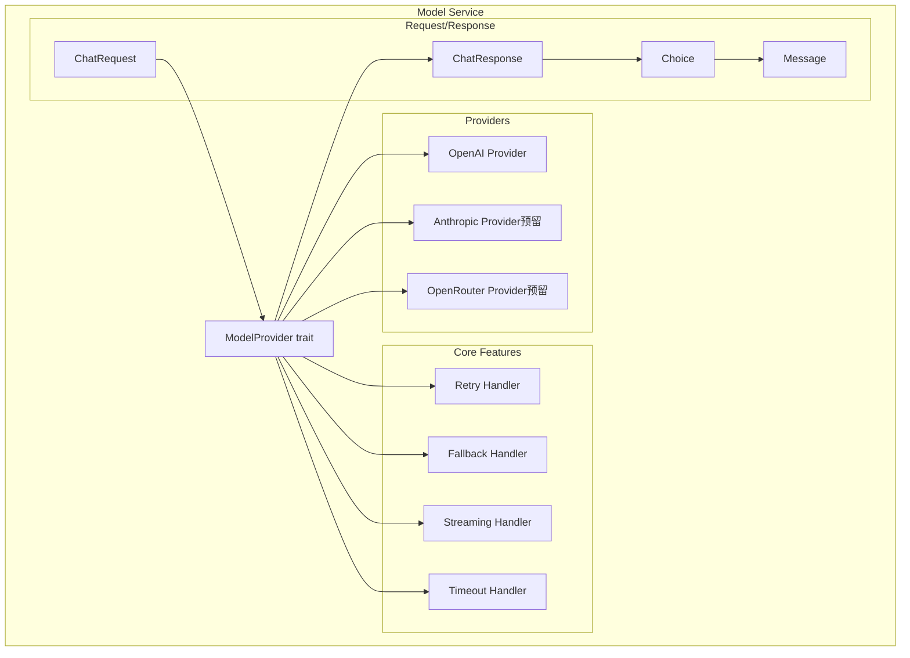
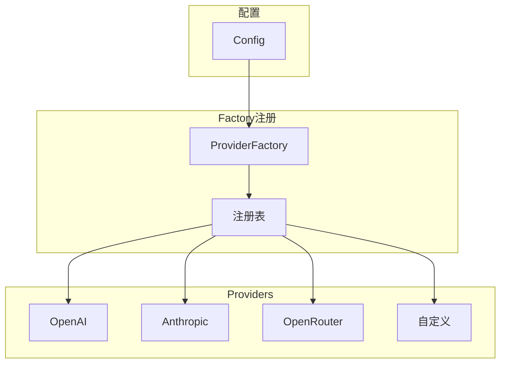

# TECH-MODEL: 模型服务模块

本文档描述Neco项目的模型服务模块设计，包括模型调用、流式输出、故障转移等核心功能。

## 1. 模块概述

模型服务模块负责与各种LLM提供商交互，提供统一的调用接口，支持故障转移、重试和流式输出。

### 1.1 交叉引用说明

本文档涉及以下其他文档定义的类型：
- **Role, Message**: 见 [TECH-SESSION.md](TECH-SESSION.md#33-消息结构)
- **Tool, ToolCall, ResponseFormat**: 见 [TECH-TOOL.md](TECH-TOOL.md#3-核心trait设计)
- **AppError**: 见 [TECH.md#5.3-统一错误类型设计](TECH.md#5.3-统一错误类型设计)

## 2. 架构设计

### 2.1 模块结构



## 3. Provider抽象与Factory

> 参考 ZeroClaw 的 Provider 抽象设计

### 4.1 Provider Trait 扩展

```rust
/// 模型提供者接口
#[async_trait]
pub trait ModelProvider: Send + Sync {
    /// 发送聊天完成请求
    async fn chat_completion(&self, request: ChatRequest) -> Result<ChatResponse, ProviderError>;
    
    /// 发送流式聊天完成请求
    async fn chat_completion_stream(&self, request: ChatRequest) -> Result<BoxStream<Result<ChatChunk, ProviderError>>, ProviderError>;
    
    /// 获取模型能力
    fn capabilities(&self) -> ModelCapabilities;
    
    /// 健康检查
    async fn health_check(&self) -> Result<(), ProviderError>;
    
    /// 提供商名称
    fn name(&self) -> &str;
}

/// 模型能力
#[derive(Debug, Clone)]
pub struct ModelCapabilities {
    /// 是否支持流式输出
    pub streaming: bool,
    /// 是否支持工具调用
    pub tools: bool,
    /// 是否支持函数调用
    pub functions: bool,
    /// 是否支持JSON模式
    pub json_mode: bool,
    /// 是否支持视觉输入
    pub vision: bool,
    /// 上下文窗口大小
    pub context_window: usize,
}
```

### 4.2 ProviderFactory 注册机制



### 4.3 已支持Provider

| Provider | 类型 | 特性 |
|----------|------|------|
| OpenAI | 官方 | GPT-4o, GPT-4o-mini, 完整支持 |
| Anthropic | 官方 | Claude 3.5, Claude 3, 预留 |
| OpenRouter | 兼容 | 50+模型, 自动路由 |
| 自定义 | 兼容 | OpenAI兼容API |

### 4.4 可靠性机制

```rust
/// 可靠Provider包装器（支持故障转移和重试）
pub struct ReliableProvider {
    primary: Box<dyn ModelProvider>,
    fallbacks: Vec<Box<dyn ModelProvider>>,
    retry_policy: RetryPolicy,
}

/// 模型路由器（根据复杂度选择合适的模型）
pub struct RouterProvider {
    routes: HashMap<String, Box<dyn ModelProvider>>,
    default: Box<dyn ModelProvider>,
    complexity_scorer: ComplexityScorer,
}
```

## 4. 数据结构设计

### 4.1 请求数据结构

> **设计说明**: 模型层请求使用 `ModelMessage`（不含 `id`），与 Session 层 `Message`（含 `id`）分离，实现层次职责隔离。

```rust
/// 模型层消息（不含Session管理的id字段）
pub struct ModelMessage {
    pub role: Role,
    pub content: String,
}

/// 聊天完成请求
pub struct ChatRequest {
    /// 使用的模型（格式：provider/model）
    pub model: String,
    /// 消息列表
    pub messages: Vec<ModelMessage>,
    /// 是否流式输出
    pub stream: bool,
    /// 温度参数（0.0 - 2.0）
    pub temperature: Option<f64>,
    /// 最大生成token数
    pub max_tokens: Option<u32>,
    /// 可用工具
    pub tools: Option<Vec<Tool>>,
    /// 工具选择策略
    pub tool_choice: Option<ToolChoice>,
    /// 响应格式
    pub response_format: Option<ResponseFormat>,
    
    /// 停止序列
    pub stop: Option<Vec<String>>,
    
    /// 额外参数（提供商特定）
    pub extra_params: HashMap<String, Value>,
}

> **注意**: `Tool` 和 `ToolCall` 类型定义见 [TECH-TOOL.md](TECH-TOOL.md#3-核心trait设计)

### 4.2 模型组与故障转移

```rust
/// 模型组客户端
pub struct ModelGroupClient {
    /// 组名
    name: String,
    /// 模型引用列表
    models: Vec<ModelRef>,
    /// 客户端缓存
    clients: HashMap<String, Arc<dyn ModelClient>>,
    /// 重试配置
    retry_config: RetryConfig,
}

impl ModelGroupClient {
    /// 创建模型组客户端
    pub fn new(
        name: String,
        models: Vec<ModelRef>,
        providers: &HashMap<String, Arc<dyn ModelProvider>>,
    ) -> Result<Self, ConfigError> {
        // TODO: 实现模型组客户端初始化
        // 遍历模型列表，为每个模型创建对应的客户端实例
        // 建立客户端缓存，支持故障转移和重试
        // TODO: 实现代码:
        // let mut clients = HashMap::new();
        // for model in &models {
        //     let provider = providers.get(&model.provider_id)
        //         .ok_or_else(|| ConfigError::ProviderNotFound {
        //             group: name.clone(),
        //             provider: model.provider_id.clone(),
        //         })?;
        //     let client = provider.as_ref().clone();
        //     clients.insert(
        //         format!("{}/{}", model.provider_id, model.model_name),
        //         client,
        //     );
        // }
        // Ok(Self { name, models, clients, retry_config: RetryConfig::default() })
        todo!()
    }
    
    /// 发送请求（带故障转移）
    pub async fn chat_completion(
        &self,
        mut request: ChatRequest,
    ) -> Result<ChatResponse, ModelError> {
        // TODO: 实现带故障转移的请求调用逻辑
        // 遍历模型列表，尝试调用每个模型直到成功
        // 支持重试机制和错误处理
        // TODO: 实现代码:
        // let mut last_error = None;
        // for model_ref in &self.models {
        //     let model_key = format!("{}/{}", model_ref.provider_id, model_ref.model_name);
        //     let client = self.clients.get(&model_key)
        //         .ok_or_else(|| ModelError::ClientNotFound(model_key.clone()))?;
        //     request.model = model_ref.model_name.clone();
        //     for (key, value) in &model_ref.params {
        //         request.extra_params.insert(key.clone(), json!(value));
        //     }
        //     match self.call_with_retry(client.as_ref(), &request).await {
        //         Ok(response) => return Ok(response),
        //         Err(e) => {
        //             warn!("Model {} failed: {}, trying next...", model_key, e);
        //             last_error = Some(e);
        //         }
        //     }
        // }
        // Err(ModelError::AllModelsFailed { group: self.name.clone(), source: last_error.unwrap() })
        todo!()
    }
    
    /// 带重试的调用
    async fn call_with_retry(
        &self,
        client: &dyn ModelClient,
        request: &ChatRequest,
    ) -> Result<ChatResponse, ModelError> {
        // TODO: 实现指数退避重试机制
        // 根据错误类型决定是否重试
        // 应用配置的重试次数和退避策略
        // TODO: 实现代码:
        // let mut backoff = self.retry_config.initial_backoff;
        // for attempt in 0..self.retry_config.max_retries {
        //     match client.chat_completion(request.clone()).await {
        //         Ok(response) => return Ok(response),
        //         Err(e) if attempt < self.retry_config.max_retries - 1 => {
        //             if e.is_retryable() {
        //                 warn!("Attempt {} failed: {}, retrying in {:?}...", attempt + 1, e, backoff);
        //                 tokio::time::sleep(backoff).await;
        //                 backoff = backoff.mul_f64(self.retry_config.backoff_multiplier);
        //                 backoff = backoff.min(self.retry_config.max_backoff);
        //             } else { return Err(e); }
        //         }
        //         Err(e) => return Err(e),
        //     }
        // }
        // unreachable!()
        todo!()
    }
}

impl ModelError {
    /// 判断错误是否可重试
    fn is_retryable(&self) -> bool {
        // TODO: 实现错误类型判断逻辑
        // 根据错误类型决定是否支持重试
        // TODO: 实现代码:
        // matches!(self, ModelError::Network(_) | ModelError::RateLimit(_) | ModelError::ServerError(_))
        todo!()
    }
}
```

## 5. OpenAI客户端实现

基于 [async-openai](https://crates.io/crates/async-openai) crate (版本 0.33.0) 实现。

### 5.1 客户端结构

```rust
use async_openai::{
    Client,
    config::OpenAIConfig,
    types::{
        ChatCompletionRequestMessage,
        ChatCompletionRequestSystemMessage,
        ChatCompletionRequestUserMessage,
        ChatCompletionRequestAssistantMessage,
        ChatCompletionRequestToolMessage,
        CreateChatCompletionRequest,
    },
};

/// OpenAI兼容API客户端
pub struct OpenAiClient {
    inner: Client<OpenAIConfig>,
    config: Arc<dyn ModelProvider>,
}

impl OpenAiClient {
    /// 创建新客户端
    pub fn new(config: Arc<dyn ModelProvider>) -> Result<Self, ConfigError> {
        // TODO: 实现OpenAI客户端初始化
        // 验证配置并创建async-openai客户端实例
        // TODO: 实现代码:
        // let api_key = config.api_key.get_key()
        //     .map_err(|_| ConfigError::NoEnvVarFound)?;
        // let openai_config = OpenAIConfig::new()
        //     .with_api_key(api_key.expose_secret())
        //     .with_api_base(config.base_url.to_string());
        // let client = Client::with_config(openai_config);
        // Ok(Self { inner: client, config: config.clone() })
        todo!()
    }
    
    /// 转换消息格式
    fn convert_message(msg: &ModelMessage) -> ChatCompletionRequestMessage {
        // TODO: 实现消息格式转换
        // 将通用Message格式转换为OpenAI特定的消息格式
        // TODO: 实现代码:
        // match msg.role {
        //     Role::System => ChatCompletionRequestSystemMessage { content: msg.content.clone().unwrap_or_default(), ..Default::default() }.into(),
        //     Role::User => ChatCompletionRequestUserMessage { content: msg.content.clone().unwrap_or_default().into(), ..Default::default() }.into(),
        //     Role::Assistant => ChatCompletionRequestAssistantMessage { content: msg.content.clone(), tool_calls: msg.tool_calls.as_ref().map(|tc| tc.iter().map(|t| t.into()).collect()), ..Default::default() }.into(),
        //     Role::Tool => ChatCompletionRequestToolMessage { content: msg.content.clone().unwrap_or_default(), tool_call_id: msg.tool_call_id.clone().unwrap_or_default(), ..Default::default() }.into(),
        // }
        todo!()
    }
}

#[async_trait]
impl ModelClient for OpenAiClient {
    async fn chat_completion(
        &self,
        request: ChatRequest,
    ) -> Result<ChatResponse, ModelError> {
        // TODO: 实现OpenAI聊天完成请求
        // 转换消息格式并调用OpenAI API
        // TODO: 实现代码:
        // let messages: Vec<_> = request.messages.iter().map(Self::convert_message).collect();
        // let mut openai_request = CreateChatCompletionRequest { model: request.model, messages, stream: Some(false), temperature: request.temperature, max_tokens: request.max_tokens, stop: request.stop, ..Default::default() };
        // if let Some(tools) = request.tools { openai_request.tools = Some(tools.into_iter().map(Into::into).collect()); openai_request.tool_choice = request.tool_choice.map(Into::into); }
        // let response = self.inner.chat().create(openai_request).await.map_err(ModelError::OpenAi)?;
        // Ok(ChatResponse { id: response.id, object: response.object, created: response.created as u64, model: response.model, choices: response.choices.into_iter().map(|c| Choice { index: c.index, message: Message { role: Role::Assistant, content: c.message.content, tool_calls: c.message.tool_calls.map(|tc| tc.into_iter().map(Into::into).collect()), tool_call_id: None }, finish_reason: c.finish_reason }).collect(), usage: Usage { prompt_tokens: response.usage.prompt_tokens, completion_tokens: response.usage.completion_tokens, total_tokens: response.usage.total_tokens } })
        todo!()
    }
    
    async fn chat_completion_stream(
        &self,
        request: ChatRequest,
    ) -> Result<BoxStream<Result<ChatStreamChunk, ModelError>>, ModelError> {
        // TODO: 实现OpenAI流式聊天完成
        // 处理流式响应和增量解析
        // TODO: 实现代码:
        // let messages: Vec<_> = request.messages.iter().map(Self::convert_message).collect();
        // let openai_request = CreateChatCompletionRequest { model: request.model, messages, stream: Some(true), temperature: request.temperature, max_tokens: request.max_tokens, ..Default::default() };
        // let stream = self.inner.chat().create_stream(openai_request).await.map_err(ModelError::OpenAi)?;
        // let converted = stream.map(|result| result.map(|chunk| ChatStreamChunk { id: chunk.id, object: chunk.object, created: chunk.created as u64, model: chunk.model, choices: chunk.choices.into_iter().map(|c| StreamChoice { index: c.index, delta: Delta { role: c.delta.role.map(|r| match r.as_str() { "system" => Role::System, "user" => Role::User, "assistant" => Role::Assistant, _ => Role::Assistant }), content: c.delta.content, tool_calls: c.delta.tool_calls.unwrap_or_default().into_iter().map(Into::into).collect() }, finish_reason: c.finish_reason }).collect() }).map_err(ModelError::OpenAi));
        // Ok(Box::pin(converted))
        todo!()
    }
    
    fn capabilities(&self) -> ModelCapabilities {
        // TODO: 根据配置和能力返回模型支持的功能
        // TODO: 实现代码:
        // ModelCapabilities { streaming: true, tools: true, functions: true, json_mode: true, vision: false, context_window: 128_000 }
        todo!()
    }
    
    async fn health_check(&self) -> Result<(), ModelError> {
        // TODO: 实现健康检查逻辑
        // 发送简单的测试请求验证连接状态
        // TODO: 实现代码:
        // let request = ChatRequest { model: self.config.default_model.clone().unwrap_or_default(), messages: vec![Message { role: Role::User, content: Some("Hi".to_string()), tool_calls: None, tool_call_id: None }], stream: false, max_tokens: Some(1), ..Default::default() };
        // self.chat_completion(request).await?;
        // Ok(())
        todo!()
    }
}
```

## 6. 流式输出处理

### 6.1 流处理器

```rust
use futures::{Stream, StreamExt};

/// 流式响应处理器
pub struct StreamHandler;

impl StreamHandler {
    /// 收集完整响应
    pub async fn collect_full_response(
        stream: BoxStream<Result<ChatStreamChunk, ModelError>>,
    ) -> Result<String, ModelError> {
        // TODO: 实现流式响应收集
        // 遍历流式数据，拼接完整的响应内容
        // TODO: 实现代码:
        // let mut content = String::new();
        // let mut pin_stream = stream;
        // while let Some(chunk) = pin_stream.next().await {
        //     let chunk = chunk?;
        //     for choice in chunk.choices {
        //         if let Some(delta_content) = choice.delta.content { content.push_str(&delta_content); }
        //     }
        // }
        // Ok(content)
        todo!()
    }
    
    /// 实时处理流（带回调）
    pub async fn process_stream_with_callback<F>(
        stream: BoxStream<Result<ChatStreamChunk, ModelError>>,
        mut callback: F,
    ) -> Result<ChatResponse, ModelError>
    where
        F: FnMut(&str),
    {
        // TODO: 实现实时流式处理
        // 支持回调函数实时显示输出
        // 处理流式工具调用和内容增量
        // TODO: 实现代码:
        // let mut full_content = String::new();
        // let mut tool_calls: Vec<ToolCall> = Vec::new();
        // let mut pin_stream = stream;
        // while let Some(chunk) = pin_stream.next().await {
        //     let chunk = chunk?;
        //     for choice in chunk.choices {
        //         if let Some(delta_content) = &choice.delta.content { callback(delta_content); full_content.push_str(delta_content); }
        //         for delta_tc in &choice.delta.tool_calls { Self::merge_tool_call_delta(&mut tool_calls, delta_tc); }
        //     }
        // }
        // Ok(ChatResponse { id: "stream".to_string(), object: "chat.completion".to_string(), created: chrono::Utc::now().timestamp() as u64, model: "streaming".to_string(), choices: vec![Choice { index: 0, message: Message { role: Role::Assistant, content: Some(full_content), tool_calls: if tool_calls.is_empty() { None } else { Some(tool_calls) }, tool_call_id: None }, finish_reason: Some("stop".to_string()) }], usage: Usage { prompt_tokens: 0, completion_tokens: 0, total_tokens: 0 } })
        todo!()
    }
    
    /// 合并工具调用增量
    fn merge_tool_call_delta(
        tool_calls: &mut Vec<ToolCall>,
        delta: &ToolCall,
    ) {
        // TODO: 实现流式工具调用合并
        // 处理增量工具调用，合并参数内容
        // 查找或创建工具调用，追加参数
        // TODO: 实现代码:
        // if let Some(existing) = tool_calls.iter_mut().find(|tc| tc.id == delta.id) { existing.function.arguments.push_str(&delta.function.arguments); } else { tool_calls.push(delta.clone()); }
        todo!()
    }
}
```

## 7. 工具调用支持

> **设计说明**: `ToolCallRequest` 和 `ToolCallResult` 是模型层用于处理工具调用的辅助类型，与核心的 `ToolCall` 类型（定义见 TECH-TOOL.md）分离。

### 7.1 工具调用处理

```rust
/// 工具调用请求
#[derive(Debug, Clone)]
pub struct ToolCallRequest {
    pub id: String,
    pub name: String,
    pub arguments: Value,
}

/// 工具调用结果
#[derive(Debug, Clone)]
pub struct ToolCallResult {
    pub id: String,
    pub result: Result<Value, ToolError>,
}

/// 工具调用处理器
pub struct ToolCallHandler;

impl ToolCallHandler {
    /// 解析工具调用请求
    pub fn parse_tool_calls(response: &ChatResponse) -> Vec<ToolCallRequest> {
        // TODO: 实现工具调用解析
        // 从响应中提取工具调用信息
        // 解析JSON参数并构建工具调用请求
        // TODO: 实现代码:
        // let mut requests = Vec::new();
        // for choice in &response.choices {
        //     if let Some(tool_calls) = &choice.message.tool_calls {
        //         for tc in tool_calls {
        //             let args = serde_json::from_str(&tc.function.arguments).unwrap_or(json!({}));
        //             requests.push(ToolCallRequest { id: tc.id.clone(), name: tc.function.name.clone(), arguments: args });
        //         }
        //     }
        // }
        // requests
        todo!()
    }
    
    /// 构建工具响应消息
    pub fn build_tool_response(
        tool_call_id: String,
        result: &ToolCallResult,
    ) -> Message {
        // TODO: 实现工具响应构建
        // 根据工具执行结果构建响应消息
        // TODO: 实现代码:
        // let content = match &result.result { Ok(value) => value.to_string(), Err(e) => format!("Error: {}", e) };
        // Message { role: Role::Tool, content: Some(content), tool_calls: None, tool_call_id: Some(tool_call_id) }
        todo!()
    }
}
```

### 7.2 并行工具调用

```rust
use futures::future::join_all;

/// 并行执行工具调用
pub async fn execute_tool_calls_parallel(
    requests: Vec<ToolCallRequest>,
    tool_registry: &ToolRegistry,
) -> Vec<ToolCallResult> {
    // TODO: 实现并行工具调用执行
    // 使用异步并发执行多个工具调用
    // 支持工具注册表和错误处理
    // TODO: 实现代码:
    // let futures: Vec<_> = requests.into_iter().map(|req| {
    //     let registry = tool_registry.clone();
    //     async move {
    //         let result = if let Some(tool) = registry.get(&req.name) { tool.execute(req.arguments).await.map_err(ToolError::Execution) } else { Err(ToolError::NotFound(req.name.clone())) };
    //         ToolCallResult { id: req.id, result }
    //     }
    // }).collect();
    // join_all(futures).await
    todo!()
}
```

## 8. 错误处理

> **设计说明**: `ModelError` 为模块内部错误，在模块边界通过 `From` 实现或映射函数转换为 `AppError`。例如，`ModelError::OpenAi` 携带的原生错误会通过 `#[source]` 属性传播到上层的 `AppError::Model`。

```rust
use thiserror::Error;

#[derive(Debug, Error)]
pub enum ModelError {
    #[error("OpenAI API错误: {0}")]
    OpenAi(#[from] async_openai::error::OpenAIError),
    
    #[error("网络错误: {0}")]
    Network(#[from] reqwest::Error),
    
    #[error("速率限制: {0}")]
    RateLimit(String),
    
    #[error("服务器错误: {status} - {message}")]
    ServerError { status: u16, message: String },
    
    #[error("客户端未找到: {0}")]
    ClientNotFound(String),
    
    #[error("模型组 {group} 中所有模型都失败")]
    AllModelsFailed {
        group: String,
        #[source]
        source: Box<ModelError>,
    },
    
    #[error("配置错误: {0}")]
    Config(#[from] ConfigError),
    
    #[error("序列化错误: {0}")]
    Serialization(#[from] serde_json::Error),
    
    #[error("超时")]
    Timeout,
}
```

## 9. 使用示例

### 9.1 基本调用

```rust
use neco_model::{ModelGroupClient, ChatRequest, ModelMessage, Role};

// 创建模型组客户端
let client = ModelGroupClient::new(
    "smart".to_string(),
    vec!["zhipuai/glm-4.7".parse()?],
    &config.model_providers,
)?;

// 构建请求
let request = ChatRequest {
    model: "glm-4.7".to_string(),
    messages: vec![
        ModelMessage {
            role: Role::System,
            content: "你是一个 helpful assistant".to_string(),
        },
        ModelMessage {
            role: Role::User,
            content: "Hello!".to_string(),
        },
    ],
    stream: false,
    temperature: Some(0.7),
    max_tokens: Some(100),
    tools: None,
    tool_choice: None,
    response_format: None,
    stop: None,
    extra_params: HashMap::new(),
};

// TODO: 发送请求并处理响应
let response = client.chat_completion(request).await?;
println!("Response: {}", response.choices[0].message.content.as_ref().unwrap());
```

### 9.2 流式输出

```rust
use neco_model::{StreamHandler};

// TODO: 发送流式请求并实时处理
let stream = client.chat_completion_stream(request).await?;

// 实时处理
let response = StreamHandler::process_stream_with_callback(
    stream,
    |chunk| {
        print!("{}", chunk);
        std::io::Write::flush(&mut std::io::stdout()).unwrap();
    },
).await?;
```

### 9.3 工具调用

```rust
use neco_model::{Tool, Function, ToolChoice};

// 定义工具
let tools = vec![
    Tool {
        r#type: "function".to_string(),
        function: Function {
            name: "fs::read".to_string(),
            description: "读取文件内容".to_string(),
            parameters: json!({
                "type": "object",
                "properties": {
                    "path": {
                        "type": "string",
                        "description": "文件路径"
                    }
                },
                "required": ["path"]
            }),
        },
    },
];

// 请求中启用工具
let request = ChatRequest {
    // ... 其他字段
    tools: Some(tools),
    tool_choice: Some(ToolChoice::Auto),
    ..Default::default()
};

// TODO: 处理响应中的工具调用
let response = client.chat_completion(request).await?;
let tool_requests = ToolCallHandler::parse_tool_calls(&response);

// 执行工具
for req in tool_requests {
    let result = execute_tool(req).await;
    let tool_msg = ToolCallHandler::build_tool_response(req.id, &result);
    // TODO: 将工具结果加入对话历史
}
```

---

*关联文档：*
- [TECH.md](TECH.md) - 总体架构文档
- [TECH-CONFIG.md](TECH-CONFIG.md) - 配置管理模块
- [TECH-SESSION.md](TECH-SESSION.md) - Session管理模块
