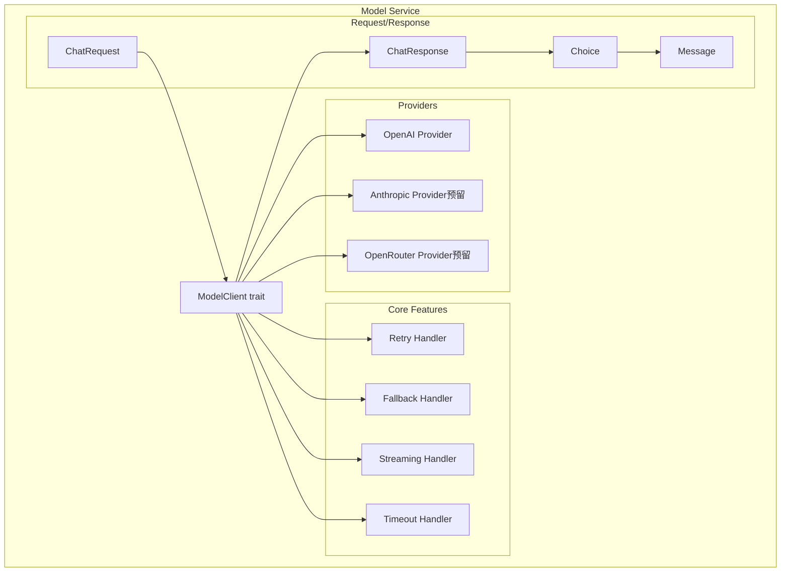

# TECH-MODEL: 模型服务模块

本文档描述Neco项目的模型服务模块设计，包括模型调用、流式输出、故障转移等核心功能。

## 1. 模块概述

模型服务模块负责与各种LLM提供商交互，提供统一的调用接口，支持故障转移、重试和流式输出。

## 2. 架构设计

### 2.1 模块结构



## 3. 核心Trait设计

### 3.1 ModelClient Trait

```rust
use async_trait::async_trait;
use futures::Stream;

/// 模型客户端抽象
#[async_trait]
pub trait ModelClient: Send + Sync {
    /// 发送聊天完成请求
    async fn chat_completion(
        &self,
        request: ChatRequest,
    ) -> Result<ChatResponse, ModelError>;
    
    /// 发送流式聊天完成请求
    async fn chat_completion_stream(
        &self,
        request: ChatRequest,
    ) -> Result<BoxStream<Result<ChatStreamChunk, ModelError>>, ModelError>;
    
    /// 获取模型能力
    fn capabilities(&self) -> ModelCapabilities;
    
    /// 健康检查
    async fn health_check(&self) -> Result<(), ModelError>;
}

/// 模型能力
pub struct ModelCapabilities {
    /// 是否支持流式输出
    pub streaming: bool,
    /// 是否支持工具调用
    pub tools: bool,
    /// 是否支持函数调用
    pub functions: bool,
    /// 是否支持JSON模式
    pub json_mode: bool,
    /// 是否支持视觉
    pub vision: bool,
    /// 上下文窗口大小
    pub context_window: usize,
}
```

### 3.2 Provider Factory

```rust
/// 提供商工厂
pub struct ProviderFactory;

impl ProviderFactory {
    /// 根据配置创建提供商客户端
    pub fn create(config: &ModelProvider) -> Result<Box<dyn ModelClient>, ConfigError> {
        match config.provider_type {
            ProviderType::OpenAI => {
                Ok(Box::new(OpenAiClient::new(config)?))
            }
            ProviderType::Anthropic => {
                // 预留：Anthropic支持
                Err(ConfigError::ProviderNotImplemented("Anthropic".to_string()))
            }
            ProviderType::OpenRouter => {
                // 预留：OpenRouter支持
                Err(ConfigError::ProviderNotImplemented("OpenRouter".to_string()))
            }
            ProviderType::OpenAIResponses => {
                // 预留：OpenAI Responses API
                Err(ConfigError::ProviderNotImplemented("OpenAIResponses".to_string()))
            }
        }
    }
}
```

## 4. 数据结构设计

### 4.1 请求数据结构

```rust
/// 聊天完成请求
pub struct ChatRequest {
    /// 使用的模型（格式：provider/model）
    pub model: String,
    /// 消息列表
    pub messages: Vec<Message>,
    /// 是否流式输出
    pub stream: bool,
    /// 温度参数（0.0 - 2.0）
    pub temperature: Option<f64>,
    /// 最大生成token数
    pub max_tokens: Option<u32>,
    /// 可用工具
    pub tools: Option<Vec<Tool>>,
    /// 工具选择策略
    pub tool_choice: Option<ToolChoice>,
    /// 响应格式
    pub response_format: Option<ResponseFormat>,
    /// 停止序列
    pub stop: Option<Vec<String>>,
    /// 额外参数（提供商特定）
    pub extra_params: HashMap<String, Value>,
}

/// 消息
#[derive(Debug, Clone, Serialize, Deserialize)]
pub struct Message {
    pub role: Role,
    pub content: Option<String>,
    #[serde(skip_serializing_if = "Option::is_none")]
    pub tool_calls: Option<Vec<ToolCall>>,
    #[serde(skip_serializing_if = "Option::is_none")]
    pub tool_call_id: Option<String>,
}

/// 角色
#[derive(Debug, Clone, Serialize, Deserialize)]
#[serde(rename_all = "lowercase")]
pub enum Role {
    System,
    User,
    Assistant,
    Tool,
}

/// 工具定义（OpenAI格式）
#[derive(Debug, Clone, Serialize, Deserialize)]
pub struct Tool {
    pub r#type: String,
    pub function: Function,
}

#[derive(Debug, Clone, Serialize, Deserialize)]
pub struct Function {
    pub name: String,
    pub description: String,
    pub parameters: Value,
}

/// 工具选择策略
#[derive(Debug, Clone, Serialize, Deserialize)]
#[serde(rename_all = "snake_case")]
pub enum ToolChoice {
    None,
    Auto,
    Required,
    Function { name: String },
}

/// 响应格式
#[derive(Debug, Clone, Serialize, Deserialize)]
pub struct ResponseFormat {
    pub r#type: String,
}
```

### 4.2 响应数据结构

```rust
/// 聊天完成响应
#[derive(Debug, Clone, Deserialize)]
pub struct ChatResponse {
    pub id: String,
    pub object: String,
    pub created: u64,
    pub model: String,
    pub choices: Vec<Choice>,
    pub usage: Usage,
}

/// 选择项
#[derive(Debug, Clone, Deserialize)]
pub struct Choice {
    pub index: u32,
    pub message: Message,
    pub finish_reason: Option<String>,
}

/// Token使用量
#[derive(Debug, Clone, Deserialize)]
pub struct Usage {
    pub prompt_tokens: u32,
    pub completion_tokens: u32,
    pub total_tokens: u32,
}

/// 工具调用
#[derive(Debug, Clone, Deserialize, Serialize)]
pub struct ToolCall {
    pub id: String,
    pub r#type: String,
    pub function: FunctionCall,
}

#[derive(Debug, Clone, Deserialize, Serialize)]
pub struct FunctionCall {
    pub name: String,
    pub arguments: String,
}

/// 流式响应块
#[derive(Debug, Clone, Deserialize)]
pub struct ChatStreamChunk {
    pub id: String,
    pub object: String,
    pub created: u64,
    pub model: String,
    pub choices: Vec<StreamChoice>,
}

#[derive(Debug, Clone, Deserialize)]
pub struct StreamChoice {
    pub index: u32,
    pub delta: Delta,
    pub finish_reason: Option<String>,
}

#[derive(Debug, Clone, Default, Deserialize)]
pub struct Delta {
    pub role: Option<Role>,
    pub content: Option<String>,
    #[serde(default)]
    pub tool_calls: Vec<ToolCall>,
}
```

### 4.3 模型组与故障转移

```rust
/// 模型组客户端
pub struct ModelGroupClient {
    /// 组名
    name: String,
    /// 模型引用列表
    models: Vec<ModelRef>,
    /// 客户端缓存
    clients: HashMap<String, Arc<dyn ModelClient>>,
    /// 重试配置
    retry_config: RetryConfig,
}

impl ModelGroupClient {
    /// 创建模型组客户端
    pub fn new(
        name: String,
        models: Vec<ModelRef>,
        providers: &HashMap<String, ModelProvider>,
    ) -> Result<Self, ConfigError> {
        let mut clients = HashMap::new();
        
        for model in &models {
            let provider = providers.get(&model.provider_id)
                .ok_or_else(|| ConfigError::ProviderNotFound {
                    group: name.clone(),
                    provider: model.provider_id.clone(),
                })?;
            
            let client = ProviderFactory::create(provider)?;
            clients.insert(
                format!("{}/{}", model.provider_id, model.model_name),
                Arc::from(client),
            );
        }
        
        Ok(Self {
            name,
            models,
            clients,
            retry_config: RetryConfig::default(),
        })
    }
    
    /// 发送请求（带故障转移）
    pub async fn chat_completion(
        &self,
        mut request: ChatRequest,
    ) -> Result<ChatResponse, ModelError> {
        let mut last_error = None;
        
        // 遍历模型列表
        for model_ref in &self.models {
            let model_key = format!("{}/{}", model_ref.provider_id, model_ref.model_name);
            let client = self.clients.get(&model_key)
                .ok_or_else(|| ModelError::ClientNotFound(model_key.clone()))?;
            
            // 更新请求中的模型名称
            request.model = model_ref.model_name.clone();
            
            // 应用模型特定参数
            for (key, value) in &model_ref.params {
                request.extra_params.insert(key.clone(), json!(value));
            }
            
            // 尝试调用（带重试）
            match self.call_with_retry(client.as_ref(), &request).await {
                Ok(response) => return Ok(response),
                Err(e) => {
                    warn!(
                        "Model {} failed: {}, trying next...",
                        model_key, e
                    );
                    last_error = Some(e);
                }
            }
        }
        
        // 所有模型都失败
        Err(ModelError::AllModelsFailed {
            group: self.name.clone(),
            source: last_error.unwrap(),
        })
    }
    
    /// 带重试的调用
    async fn call_with_retry(
        &self,
        client: &dyn ModelClient,
        request: &ChatRequest,
    ) -> Result<ChatResponse, ModelError> {
        let mut backoff = self.retry_config.initial_backoff;
        
        for attempt in 0..self.retry_config.max_retries {
            match client.chat_completion(request.clone()).await {
                Ok(response) => return Ok(response),
                Err(e) if attempt < self.retry_config.max_retries - 1 => {
                    if e.is_retryable() {
                        warn!(
                            "Attempt {} failed: {}, retrying in {:?}...",
                            attempt + 1, e, backoff
                        );
                        tokio::time::sleep(backoff).await;
                        backoff = backoff.mul_f64(self.retry_config.backoff_multiplier);
                        backoff = backoff.min(self.retry_config.max_backoff);
                    } else {
                        return Err(e);
                    }
                }
                Err(e) => return Err(e),
            }
        }
        
        unreachable!()
    }
}

impl ModelError {
    /// 判断错误是否可重试
    fn is_retryable(&self) -> bool {
        matches!(self,
            ModelError::Network(_)
            | ModelError::RateLimit(_)
            | ModelError::ServerError(_)
        )
    }
}
```

## 5. OpenAI客户端实现

### 5.1 客户端结构

```rust
use async_openai::{
    Client,
    config::OpenAIConfig,
    types::{
        ChatCompletionRequestMessage,
        ChatCompletionRequestSystemMessage,
        ChatCompletionRequestUserMessage,
        ChatCompletionRequestAssistantMessage,
        ChatCompletionRequestToolMessage,
        CreateChatCompletionRequest,
    },
};

/// OpenAI兼容API客户端
pub struct OpenAiClient {
    inner: Client<OpenAIConfig>,
    config: ModelProvider,
}

impl OpenAiClient {
    /// 创建新客户端
    pub fn new(config: &ModelProvider) -> Result<Self, ConfigError> {
        let api_key = config.api_key.get_key()
            .map_err(|_| ConfigError::NoEnvVarFound)?;
        
        let openai_config = OpenAIConfig::new()
            .with_api_key(api_key.expose_secret())
            .with_api_base(config.base_url.to_string());
        
        let client = Client::with_config(openai_config);
        
        Ok(Self {
            inner: client,
            config: config.clone(),
        })
    }
    
    /// 转换消息格式
    fn convert_message(msg: &Message) -> ChatCompletionRequestMessage {
        match msg.role {
            Role::System => ChatCompletionRequestSystemMessage {
                content: msg.content.clone().unwrap_or_default(),
                ..Default::default()
            }.into(),
            Role::User => ChatCompletionRequestUserMessage {
                content: msg.content.clone().unwrap_or_default().into(),
                ..Default::default()
            }.into(),
            Role::Assistant => ChatCompletionRequestAssistantMessage {
                content: msg.content.clone(),
                tool_calls: msg.tool_calls.as_ref().map(|tc| {
                    tc.iter().map(|t| t.into()).collect()
                }),
                ..Default::default()
            }.into(),
            Role::Tool => ChatCompletionRequestToolMessage {
                content: msg.content.clone().unwrap_or_default(),
                tool_call_id: msg.tool_call_id.clone().unwrap_or_default(),
                ..Default::default()
            }.into(),
        }
    }
}

#[async_trait]
impl ModelClient for OpenAiClient {
    async fn chat_completion(
        &self,
        request: ChatRequest,
    ) -> Result<ChatResponse, ModelError> {
        let messages: Vec<_ > = request.messages
            .iter()
            .map(Self::convert_message)
            .collect();
        
        let mut openai_request = CreateChatCompletionRequest {
            model: request.model,
            messages,
            stream: Some(false),
            temperature: request.temperature,
            max_tokens: request.max_tokens,
            stop: request.stop,
            ..Default::default()
        };
        
        // 添加工具（如果提供）
        if let Some(tools) = request.tools {
            openai_request.tools = Some(tools.into_iter().map(Into::into).collect());
            openai_request.tool_choice = request.tool_choice.map(Into::into);
        }
        
        // 发送请求
        let response = self.inner
            .chat()
            .create(openai_request)
            .await
            .map_err(ModelError::OpenAi)?;
        
        // 转换响应
        Ok(ChatResponse {
            id: response.id,
            object: response.object,
            created: response.created as u64,
            model: response.model,
            choices: response.choices.into_iter().map(|c| Choice {
                index: c.index,
                message: Message {
                    role: Role::Assistant,
                    content: c.message.content,
                    tool_calls: c.message.tool_calls.map(|tc| {
                        tc.into_iter().map(Into::into).collect()
                    }),
                    tool_call_id: None,
                },
                finish_reason: c.finish_reason,
            }).collect(),
            usage: Usage {
                prompt_tokens: response.usage.prompt_tokens,
                completion_tokens: response.usage.completion_tokens,
                total_tokens: response.usage.total_tokens,
            },
        })
    }
    
    async fn chat_completion_stream(
        &self,
        request: ChatRequest,
    ) -> Result<BoxStream<Result<ChatStreamChunk, ModelError>>, ModelError> {
        let messages: Vec<_> = request.messages
            .iter()
            .map(Self::convert_message)
            .collect();
        
        let openai_request = CreateChatCompletionRequest {
            model: request.model,
            messages,
            stream: Some(true),
            temperature: request.temperature,
            max_tokens: request.max_tokens,
            ..Default::default()
        };
        
        let stream = self.inner
            .chat()
            .create_stream(openai_request)
            .await
            .map_err(ModelError::OpenAi)?;
        
        // 转换流
        let converted = stream.map(|result| {
            result.map(|chunk| ChatStreamChunk {
                id: chunk.id,
                object: chunk.object,
                created: chunk.created as u64,
                model: chunk.model,
                choices: chunk.choices.into_iter().map(|c| StreamChoice {
                    index: c.index,
                    delta: Delta {
                        role: c.delta.role.map(|r| match r.as_str() {
                            "system" => Role::System,
                            "user" => Role::User,
                            "assistant" => Role::Assistant,
                            _ => Role::Assistant,
                        }),
                        content: c.delta.content,
                        tool_calls: c.delta.tool_calls.unwrap_or_default()
                            .into_iter()
                            .map(Into::into)
                            .collect(),
                    },
                    finish_reason: c.finish_reason,
                }).collect(),
            }).map_err(ModelError::OpenAi)
        });
        
        Ok(Box::pin(converted))
    }
    
    fn capabilities(&self) -> ModelCapabilities {
        ModelCapabilities {
            streaming: true,
            tools: true,
            functions: true,
            json_mode: true,
            vision: false, // 根据模型配置
            context_window: 128_000, // 根据模型配置
        }
    }
    
    async fn health_check(&self) -> Result<(), ModelError> {
        // 发送简单的健康检查请求
        let request = ChatRequest {
            model: self.config.default_model.clone().unwrap_or_default(),
            messages: vec![Message {
                role: Role::User,
                content: Some("Hi".to_string()),
                tool_calls: None,
                tool_call_id: None,
            }],
            stream: false,
            max_tokens: Some(1),
            ..Default::default()
        };
        
        self.chat_completion(request).await?;
        Ok(())
    }
}
```

## 6. 流式输出处理

### 6.1 流处理器

```rust
use futures::{Stream, StreamExt};

/// 流式响应处理器
pub struct StreamHandler;

impl StreamHandler {
    /// 收集完整响应
    pub async fn collect_full_response(
        stream: BoxStream<Result<ChatStreamChunk, ModelError>>,
    ) -> Result<String, ModelError> {
        let mut content = String::new();
        let mut pin_stream = stream;
        
        while let Some(chunk) = pin_stream.next().await {
            let chunk = chunk?;
            for choice in chunk.choices {
                if let Some(delta_content) = choice.delta.content {
                    content.push_str(&delta_content);
                }
            }
        }
        
        Ok(content)
    }
    
    /// 实时处理流（带回调）
    pub async fn process_stream_with_callback<F>(
        stream: BoxStream<Result<ChatStreamChunk, ModelError>>,
        mut callback: F,
    ) -> Result<ChatResponse, ModelError>
    where
        F: FnMut(&str),
    {
        let mut full_content = String::new();
        let mut tool_calls: Vec<ToolCall> = Vec::new();
        let mut pin_stream = stream;
        
        while let Some(chunk) = pin_stream.next().await {
            let chunk = chunk?;
            for choice in chunk.choices {
                // 处理内容增量
                if let Some(delta_content) = &choice.delta.content {
                    callback(delta_content);
                    full_content.push_str(delta_content);
                }
                
                // 处理工具调用增量
                for delta_tc in &choice.delta.tool_calls {
                    // 合并工具调用增量（处理流式分片）
                    Self::merge_tool_call_delta(&mut tool_calls,
                        delta_tc
                    );
                }
            }
        }
        
        Ok(ChatResponse {
            id: "stream".to_string(),
            object: "chat.completion".to_string(),
            created: chrono::Utc::now().timestamp() as u64,
            model: "streaming".to_string(),
            choices: vec![Choice {
                index: 0,
                message: Message {
                    role: Role::Assistant,
                    content: Some(full_content),
                    tool_calls: if tool_calls.is_empty() {
                        None
                    } else {
                        Some(tool_calls)
                    },
                    tool_call_id: None,
                },
                finish_reason: Some("stop".to_string()),
            }],
            usage: Usage {
                prompt_tokens: 0,
                completion_tokens: 0,
                total_tokens: 0,
            },
        })
    }
    
    /// 合并工具调用增量
    fn merge_tool_call_delta(
        tool_calls: &mut Vec<ToolCall>,
        delta: &ToolCall,
    ) {
        // 查找或创建工具调用
        if let Some(existing) = tool_calls.iter_mut()
            .find(|tc| tc.id == delta.id) {
            // 追加参数
            existing.function.arguments.push_str(&delta.function.arguments);
        } else {
            // 新的工具调用
            tool_calls.push(delta.clone());
        }
    }
}
```

## 7. 工具调用支持

### 7.1 工具调用处理

```rust
/// 工具调用请求
#[derive(Debug, Clone)]
pub struct ToolCallRequest {
    pub id: String,
    pub name: String,
    pub arguments: Value,
}

/// 工具调用结果
#[derive(Debug, Clone)]
pub struct ToolCallResult {
    pub id: String,
    pub result: Result<Value, ToolError>,
}

/// 工具调用处理器
pub struct ToolCallHandler;

impl ToolCallHandler {
    /// 解析工具调用请求
    pub fn parse_tool_calls(response: &ChatResponse) -> Vec<ToolCallRequest> {
        let mut requests = Vec::new();
        
        for choice in &response.choices {
            if let Some(tool_calls) = &choice.message.tool_calls {
                for tc in tool_calls {
                    let args = serde_json::from_str(&tc.function.arguments)
                        .unwrap_or(json!({}));
                    
                    requests.push(ToolCallRequest {
                        id: tc.id.clone(),
                        name: tc.function.name.clone(),
                        arguments: args,
                    });
                }
            }
        }
        
        requests
    }
    
    /// 构建工具响应消息
    pub fn build_tool_response(
        tool_call_id: String,
        result: &ToolCallResult,
    ) -> Message {
        let content = match &result.result {
            Ok(value) => value.to_string(),
            Err(e) => format!("Error: {}", e),
        };
        
        Message {
            role: Role::Tool,
            content: Some(content),
            tool_calls: None,
            tool_call_id: Some(tool_call_id),
        }
    }
}
```

### 7.2 并行工具调用

```rust
use futures::future::join_all;

/// 并行执行工具调用
pub async fn execute_tool_calls_parallel(
    requests: Vec<ToolCallRequest>,
    tool_registry: &ToolRegistry,
) -> Vec<ToolCallResult> {
    let futures: Vec<_> = requests
        .into_iter()
        .map(|req| {
            let registry = tool_registry.clone();
            async move {
                let result = if let Some(tool) = registry.get(&req.name) {
                    tool.execute(req.arguments).await
                        .map_err(ToolError::Execution)
                } else {
                    Err(ToolError::NotFound(req.name.clone()))
                };
                
                ToolCallResult {
                    id: req.id,
                    result,
                }
            }
        })
        .collect();
    
    join_all(futures).await
}
```

## 8. 错误处理

```rust
use thiserror::Error;

#[derive(Debug, Error)]
pub enum ModelError {
    #[error("OpenAI API错误: {0}")]
    OpenAi(#[from] async_openai::error::OpenAIError),
    
    #[error("网络错误: {0}")]
    Network(#[from] reqwest::Error),
    
    #[error("速率限制: {0}")]
    RateLimit(String),
    
    #[error("服务器错误: {status} - {message}")]
    ServerError { status: u16, message: String },
    
    #[error("客户端未找到: {0}")]
    ClientNotFound(String),
    
    #[error("模型组 {group} 中所有模型都失败")]
    AllModelsFailed {
        group: String,
        #[source]
        source: Box<ModelError>,
    },
    
    #[error("配置错误: {0}")]
    Config(#[from] ConfigError),
    
    #[error("序列化错误: {0}")]
    Serialization(#[from] serde_json::Error),
    
    #[error("超时")]
    Timeout,
}
```

## 9. 使用示例

### 9.1 基本调用

```rust
use neco_model::{ModelGroupClient, ChatRequest, Message, Role};

// 创建模型组客户端
let client = ModelGroupClient::new(
    "smart".to_string(),
    vec!["zhipuai/glm-4.7".parse()?],
    &config.model_providers,
)?;

// 构建请求
let request = ChatRequest {
    model: "glm-4.7".to_string(),
    messages: vec![
        Message {
            role: Role::System,
            content: Some("你是一个 helpful assistant".to_string()),
            tool_calls: None,
            tool_call_id: None,
        },
        Message {
            role: Role::User,
            content: Some("Hello!".to_string()),
            tool_calls: None,
            tool_call_id: None,
        },
    ],
    stream: false,
    temperature: Some(0.7),
    max_tokens: Some(100),
    tools: None,
    tool_choice: None,
    response_format: None,
    stop: None,
    extra_params: HashMap::new(),
};

// 发送请求
let response = client.chat_completion(request).await?;
println!("Response: {}", response.choices[0].message.content.as_ref().unwrap());
```

### 9.2 流式输出

```rust
use neco_model::{StreamHandler};

// 发送流式请求
let stream = client.chat_completion_stream(request).await?;

// 实时处理
let response = StreamHandler::process_stream_with_callback(
    stream,
    |chunk| {
        print!("{}", chunk);
        std::io::Write::flush(&mut std::io::stdout()).unwrap();
    },
).await?;
```

### 9.3 工具调用

```rust
use neco_model::{Tool, Function, ToolChoice};

// 定义工具
let tools = vec![
    Tool {
        r#type: "function".to_string(),
        function: Function {
            name: "fs::read".to_string(),
            description: "读取文件内容".to_string(),
            parameters: json!({
                "type": "object",
                "properties": {
                    "path": {
                        "type": "string",
                        "description": "文件路径"
                    }
                },
                "required": ["path"]
            }),
        },
    },
];

// 请求中启用工具
let request = ChatRequest {
    // ... 其他字段
    tools: Some(tools),
    tool_choice: Some(ToolChoice::Auto),
    ..Default::default()
};

// 处理响应中的工具调用
let response = client.chat_completion(request).await?;
let tool_requests = ToolCallHandler::parse_tool_calls(&response);

// 执行工具
for req in tool_requests {
    let result = execute_tool(req).await;
    let tool_msg = ToolCallHandler::build_tool_response(req.id, &result);
    // 将工具结果加入对话历史
}
```

---

*关联文档：*
- [TECH.md](TECH.md) - 总体架构文档
- [TECH-CONFIG.md](TECH-CONFIG.md) - 配置管理模块
- [TECH-SESSION.md](TECH-SESSION.md) - Session管理模块
