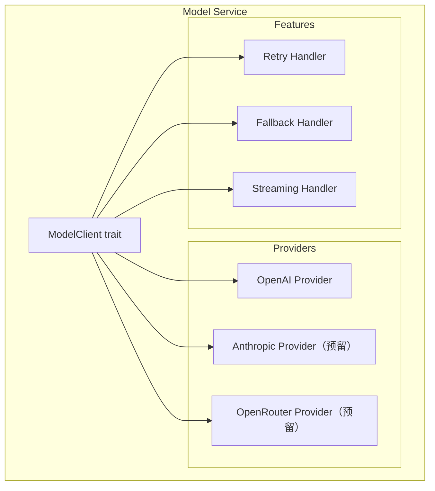

# TECH-MODEL: 模型服务模块

本文档描述Neco项目的模型服务模块设计。

## 1. 模块概述

模型服务模块负责与各种LLM提供商交互，提供统一的调用接口，支持故障转移、重试和流式输出。

## 2. 架构设计

### 2.1 模块结构



## 3. 模型客户端接口

### 3.1 ModelClient Trait

```rust
/// 模型能力
#[derive(Debug, Clone)]
pub struct ModelCapabilities {
    pub streaming: bool,
    pub tools: bool,
    pub functions: bool,
    pub json_mode: bool,
    pub vision: bool,
    pub context_window: usize,
}

/// 聊天完成请求
#[derive(Debug, Clone)]
pub struct ChatRequest {
    pub model: String,
    pub messages: Vec<ModelMessage<'static>>,
    pub stream: bool,
    pub temperature: Option<f64>,
    pub max_tokens: Option<u32>,
    pub tools: Option<Vec<ToolDefinition>>,
    pub tool_choice: Option<String>,
    pub response_format: Option<String>,
    pub stop: Option<Vec<String>>,
    pub extra_params: HashMap<String, Value>,
}

/// 聊天完成响应
#[derive(Debug, Clone)]
pub struct ChatResponse {
    pub id: String,
    pub model: String,
    pub choices: Vec<Choice>,
    pub usage: Usage,
}

#[derive(Debug, Clone)]
pub struct Choice {
    pub index: usize,
    pub message: Message,
    pub finish_reason: Option<String>,
}

#[derive(Debug, Clone)]
pub struct Usage {
    pub prompt_tokens: u32,
    pub completion_tokens: u32,
    pub total_tokens: u32,
}

/// 模型客户端接口
#[async_trait]
pub trait ModelClient: Send + Sync {
    async fn chat_completion(
        &self,
        request: ChatRequest,
    ) -> Result<ChatResponse, ModelError>;
    
    async fn chat_completion_stream(
        &self,
        request: ChatRequest,
    ) -> Result<BoxStream<Result<ChatChunk, ModelError>>, ModelError>;
    
    fn capabilities(&self) -> ModelCapabilities;
}
```

### 3.2 模型组客户端

```rust
pub struct ModelGroupClient {
    name: String,
    models: Vec<ModelRef>,
    clients: HashMap<String, Arc<dyn ModelClient>>,
    retry_config: RetryConfig,
}

impl ModelGroupClient {
    pub async fn chat_completion(
        &self,
        mut request: ChatRequest,
    ) -> Result<ChatResponse, ModelError> {
        // TODO: 实现故障转移逻辑
        // 1. 遍历模型列表
        // 2. 尝试调用
        // 3. 失败则重试+切换
        unimplemented!()
    }
}
```

## 4. OpenAI客户端实现

### 4.1 客户端结构

```rust
pub struct OpenAiClient {
    config: OpenAiClientConfig,
    inner: Client<OpenAIConfig>,
}

pub struct OpenAiClientConfig {
    pub api_key: Secret<String>,
    pub base_url: Url,
}

impl OpenAiClient {
    pub fn new(config: OpenAiClientConfig) -> Result<Self, ConfigError> {
        let openai_config = OpenAIConfig::new()
            .with_api_key(config.api_key.expose_secret().clone())
            .with_api_base(config.base_url.to_string());
        
        let client = Client::with_config(openai_config);
        
        Ok(Self { config, inner: client })
    }
}

#[async_trait]
impl ModelClient for OpenAiClient {
    async fn chat_completion(
        &self,
        request: ChatRequest,
    ) -> Result<ChatResponse, ModelError> {
        // TODO: 实现OpenAI聊天完成
        // 1. 转换消息格式
        // 2. 调用API
        // 3. 转换响应格式
        unimplemented!()
    }
    
    async fn chat_completion_stream(
        &self,
        request: ChatRequest,
    ) -> Result<BoxStream<Result<ChatChunk, ModelError>>, ModelError> {
        // TODO: 实现流式API
        unimplemented!()
    }
    
    fn capabilities(&self) -> ModelCapabilities {
        ModelCapabilities {
            streaming: true,
            tools: true,
            functions: true,
            json_mode: true,
            vision: false,
            context_window: 128_000,
        }
    }
}
```

## 5. 流式输出处理

```rust
use futures::StreamExt;

pub struct StreamHandler;

impl StreamHandler {
    pub async fn collect_full_response(
        stream: BoxStream<Result<ChatChunk, ModelError>>,
    ) -> Result<String, ModelError> {
        // TODO: 收集完整响应
        unimplemented!()
    }
    
    pub async fn process_with_callback<F>(
        stream: BoxStream<Result<ChatChunk, ModelError>>,
        mut callback: F,
    ) -> Result<ChatResponse, ModelError>
    where
        F: FnMut(&str),
    {
        // TODO: 实时处理流
        unimplemented!()
    }
}
```

## 6. 工具调用处理

```rust
pub struct ToolCallHandler;

impl ToolCallHandler {
    pub fn parse_tool_calls(response: &ChatResponse) -> Vec<ToolCall> {
        // TODO: 从响应中解析工具调用
        unimplemented!()
    }
    
    pub fn build_tool_message(
        tool_call_id: &str,
        result: &str,
    ) -> Message {
        // TODO: 构建工具响应消息
        unimplemented!()
    }
}
```

## 7. 错误处理

```rust
#[derive(Debug, Error)]
pub enum ModelError {
    #[error("API错误: {0}")]
    Api(String),
    
    #[error("网络错误: {0}")]
    Network(#[from] reqwest::Error),
    
    #[error("速率限制: {0}")]
    RateLimit(String),
    
    #[error("服务器错误: {status} - {message}")]
    ServerError { status: u16, message: String },
    
    #[error("客户端未找到: {0}")]
    ClientNotFound(String),
    
    #[error("模型组 {group} 中所有模型都失败")]
    AllModelsFailed { group: String },
    
    #[error("配置错误: {0}")]
    Config(#[from] ConfigError),
    
    #[error("超时")]
    Timeout,
}
```

---

*关联文档：*
- [TECH.md](TECH.md) - 总体架构文档
- [TECH-CONFIG.md](TECH-CONFIG.md) - 配置管理模块
- [TECH-SESSION.md](TECH-SESSION.md) - Session管理模块
