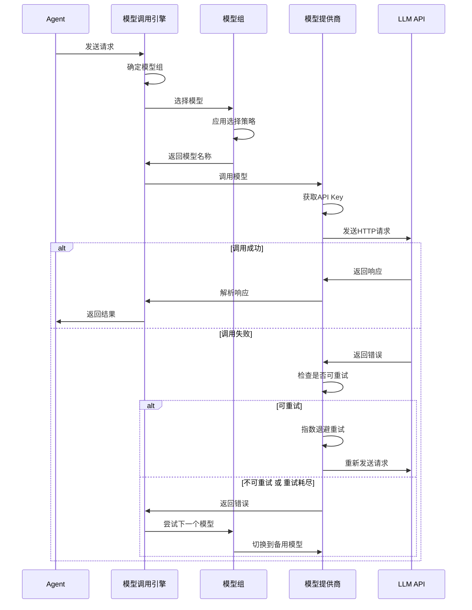
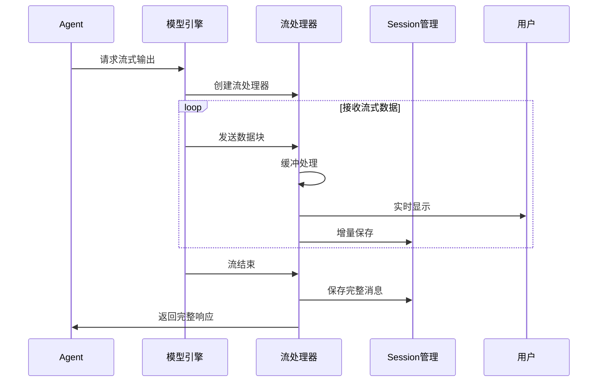
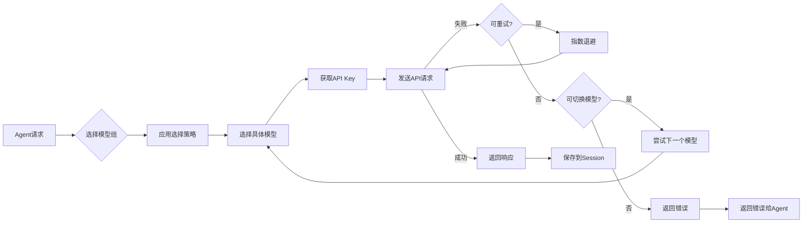

# 模型调用技术文档

## 概述

模型调用模块负责与各大语言模型提供商的交互，支持多模型组配置、负载均衡、故障转移和流式输出。基于 OpenAI Chat Completion API 设计，预留了扩展接口以支持其他提供商。

---

## 模型组配置

### 配置结构

```rust
pub struct ModelConfig {
    pub model_groups: HashMap<String, ModelGroup>,
    pub model_providers: HashMap<String, ModelProviderConfig>,
}

pub struct ModelGroup {
    pub models: Vec<String>,           // 模型名称列表
    pub strategy: SelectionStrategy,   // 选择策略
}

pub enum SelectionStrategy {
    RoundRobin,     // 轮询选择，配置值："round_robin"
    LoadBalance,    // 负载均衡，配置值："load_balance"  
    Failover,       // 失败切换，配置值："failover"
    Priority,       // 优先级选择，配置值："priority"
}
```

### 配置示例

**配置值说明**：
- `failover` - 失败时切换到下一个模型
- `round_robin` - 轮询使用多个模型
- `load_balance` - 基于负载动态选择
- `priority` - 按优先级顺序选择（TECH-Model.md 扩展）

```toml
# 模型组定义
[model_groups.think]
models = ["zhipuai/glm-4.7", "deepseek/deepseek-chat"]
strategy = "failover"

[model_groups.balanced]
models = ["zhipuai/glm-4.7", "minimax-cn/MiniMax-M2.5"]
strategy = "round_robin"

[model_groups.act]
models = ["zhipuai/glm-4.7-flashx"]
strategy = "priority"

[model_groups.image]
models = ["zhipuai/glm-4.6v"]
strategy = "failover"

# 模型提供商配置
[model_providers.zhipuai]
type = "openai"
name = "ZhipuAI"
base = "https://open.bigmodel.cn/api/paas/v4"
api_key_env = "ZHIPU_API_KEY"

[model_providers.minimax-cn]
type = "openai"
name = "MiniMax (CN)"
base = "https://api.minimaxi.com/v1"
api_key_envs = ["MINIMAX_API_KEY", "MINIMAX_API_KEY_2"]
```

---

## 模型提供商抽象

### 提供商类型

```rust
pub enum ProviderType {
    OpenAI,      // OpenAI API 格式
    Anthropic,   // Anthropic API（预留）
    OpenRouter,  // OpenRouter API（预留）
    Custom,      // 自定义 API 格式（预留）
}

pub struct ModelProviderConfig {
    pub name: String,
    pub provider_type: ProviderType,
    pub base_url: String,
    pub api_key_config: ApiKeyConfig,
    pub http_config: Option<HttpConfig>,
    pub default_model: Option<String>,
}

pub struct ApiKeyConfig {
    pub api_key_env: Option<String>,        // 最高优先级
    pub api_key_envs: Option<Vec<String>>,  // 多个环境变量轮询
    pub api_key: Option<String>,           // 直接密钥（最低优先级）
}

pub struct HttpConfig {
    pub timeout: Duration,
    pub max_retries: usize,
    pub retry_backoff: Duration,
    pub headers: HashMap<String, String>,
}
```

### 优先级策略

API 密钥优先级（从高到低）：

1. **api_key_env**：单个环境变量
2. **api_key_envs**：多个环境变量（轮询使用，失败则尝试下一个）
3. **api_key**：直接写入密钥（不推荐）

```rust
impl ApiKeyConfig {
    pub fn get_api_key(&self) -> Option<String> {
        // 优先级1：单个环境变量
        if let Some(env) = &self.api_key_env {
            if let Ok(key) = std::env::var(env) {
                return Some(key);
            }
        }

        // 优先级2：多个环境变量轮询
        if let Some(envs) = &self.api_key_envs {
            for env in envs {
                if let Ok(key) = std::env::var(env) {
                    return Some(key);
                }
            }
        }

        // 优先级3：直接密钥
        self.api_key.clone()
    }
}
```

---

## 模型调用流程

### 调用流程图



---

## 错误处理与重试

### 错误分类

```rust
#[derive(Error, Debug)]
pub enum ModelError {
    #[error("Network error: {0}")]
    Network(String),           // 网络错误

    #[error("API client error (4xx): {0}")]
    ApiClient(String),         // 客户端错误（4xx）

    #[error("API server error (5xx): {0}")]
    ApiServer(String),         // 服务器错误（5xx）

    #[error("Rate limit exceeded")]
    RateLimited,               // 限流

    #[error("Model not available: {0}")]
    ModelUnavailable(String),  // 模型不可用

    #[error("All models failed in group: {0}")]
    AllModelsFailed(String),   // 模型组中所有模型都失败
    
    #[error("Group not found: {0}")]
    GroupNotFound(String),    // 模型组未找到
}

impl ModelError {
    pub fn is_retryable(&self) -> bool {
        matches!(self,
            Self::Network(_) |
            Self::ApiServer(_) |
            Self::RateLimited
        )
    }

    pub fn should_try_next_model(&self) -> bool {
        matches!(self,
            Self::Network(_) |
            Self::ApiServer(_) |
            Self::ModelUnavailable(_) |
            Self::RateLimited
        )
    }
}
```

### 重试策略

```rust
pub struct RetryStrategy {
    pub max_attempts: usize,       // 最大尝试次数（默认3次，包括初始尝试）
    pub base_delay: Duration,      // 基础延迟（默认1s）
    pub max_delay: Duration,       // 最大延迟（默认4s）
    pub backoff_multiplier: f64,   // 退避倍数（默认2.0）
}

// 执行流程：
// 执行流程：
// 第1次：初始尝试（失败）→ 等待1s → 第2次：第1次重试 → 等待2s → 第3次：第2次重试（最后）

impl RetryStrategy {
    pub async fn execute_with_retry<F, T>(
        &self,
        operation: F,
    ) -> Result<T, ModelError>
    where
        F: Fn() -> Pin<Box<dyn Future<Output = Result<T, ModelError>> + Send>>,
    {
        for attempt in 0..self.max_attempts {
            match operation().await {
                Ok(result) => return Ok(result),
                Err(e) => {
                    if !e.is_retryable() || attempt == self.max_attempts - 1 {
                        return Err(e);
                    }

                    // 指数退避：1s, 2s, 4s
                    let delay = self.calculate_delay(attempt);
                    tokio::time::sleep(delay).await;
                }
            }
        }

        unreachable!()
    }

    fn calculate_delay(&self, attempt: usize) -> Duration {
        let delay_ms = (self.base_delay.as_millis() as f64
            * self.backoff_multiplier.powi(attempt as i32)) as u64;
        let delay = Duration::from_millis(delay_ms);
        delay.min(self.max_delay)
    }
}
```

### 指数退避时序

```
第1次失败 ──> 等待 1s ──> 第2次尝试
第2次失败 ──> 等待 2s ──> 第3次尝试
第3次失败 ──> 等待 4s ──> 第4次尝试
```

---

## 模型切换策略

### 故障转移机制

```rust
pub struct ModelSwitcher {
    model_groups: Arc<HashMap<String, ModelGroup>>,
    failure_counts: Arc<Mutex<HashMap<String, usize>>>,
}

impl ModelSwitcher {
    pub async fn call_with_fallback(
        &self,
        group_name: &str,
        request: ChatRequest,
    ) -> Result<ChatResponse, ModelError> {
        let group = self.model_groups
            .get(group_name)
            .ok_or(ModelError::GroupNotFound(group_name.to_string()))?;

        let models = self.get_models_in_order(group);
        let mut last_error = None;

        for model_name in models {
            // 检查模型失败次数
            let failure_count = self.get_failure_count(&model_name);
            if failure_count >= 3 {
                continue;  // 跳过失败次数过多的模型
            }

            match self.call_single_model(&model_name, request.clone()).await {
                Ok(response) => {
                    // 成功调用，重置失败计数
                    self.reset_failure_count(&model_name);
                    return Ok(response);
                }
                Err(e) => {
                    if !e.should_try_next_model() {
                        return Err(e);
                    }
                    last_error = Some(e);
                    self.increment_failure_count(&model_name);
                }
            }
        }

        // 所有模型都失败了
        Err(ModelError::AllModelsFailed(
            group_name.to_string(),
            last_error.map(|e| e.to_string()).unwrap_or_default(),
        ))
    }

    fn get_models_in_order(&self,
        group: &ModelGroup
    ) -> Vec<String> {
        match group.strategy {
            SelectionStrategy::RoundRobin => {
                // 轮询：记录当前索引，循环使用
                self.get_round_robin_order(&group.models)
            }
            SelectionStrategy::Priority => {
                // 优先级：按列表顺序
                group.models.clone()
            }
            SelectionStrategy::Failover => {
                // 故障转移：按优先级，失败时切换到下一个
                group.models.clone()
            }
            SelectionStrategy::LoadBalance => {
                // 负载均衡：基于当前负载动态选择
                self.get_load_balanced_order(&group.models)
            }
        }
    }
}
```

---

## 流式输出

### 流式处理架构

```rust
pub struct StreamingResponse {
    pub stream: Pin<Box<dyn Stream<Item = Result<StreamChunk, ModelError>> + Send>>,
}

pub struct StreamChunk {
    pub content: String,
    pub is_finished: bool,
    pub usage: Option<TokenUsage>,
}

pub struct TokenUsage {
    pub prompt_tokens: usize,
    pub completion_tokens: usize,
    pub total_tokens: usize,
}
```

### 流式处理流程



---

## 工具调用

### 工具调用流程

```rust
pub struct ToolCall {
    pub id: String,
    pub name: String,
    pub arguments: serde_json::Value,
}

pub struct ToolResult {
    pub tool_call_id: String,
    pub content: String,
    pub is_error: bool,
}

// 并行工具调用
pub struct ParallelToolCalls {
    pub calls: Vec<ToolCall>,
}
```

### 并行工具执行

```rust
pub struct ToolExecutor {
    tool_registry: Arc<ToolRegistry>,
    semaphore: Arc<Semaphore>,  // 限制并发数
    timeout: Duration,          // 工具执行超时，默认30秒
}

impl Default for ToolExecutor {
    fn default() -> Self {
        Self {
            tool_registry: Arc::new(ToolRegistry::default()),
            semaphore: Arc::new(Semaphore::new(10)),  // 默认最大10个并发工具
            timeout: Duration::from_secs(30),        // 默认30秒超时（与REQUIREMENT一致）
        }
    }
    pub async fn execute_parallel(
        &self,
        tool_calls: Vec<ToolCall>,
    ) -> Vec<ToolResult> {
        let futures: Vec<_> = tool_calls
            .into_iter()
            .map(|call| {
                let registry = Arc::clone(&self.tool_registry);
                let semaphore = Arc::clone(&self.semaphore);

                async move {
                    let _permit = semaphore.acquire().await;
                    let result = tokio::time::timeout(
                        self.timeout,
                        registry.execute(call),
                    ).await;

                    match result {
                        Ok(Ok(output)) => ToolResult {
                            tool_call_id: call.id,
                            content: output,
                            is_error: false,
                        },
                        Ok(Err(e)) => ToolResult {
                            tool_call_id: call.id,
                            content: e.to_string(),
                            is_error: true,
                        },
                        Err(_) => ToolResult {
                            tool_call_id: call.id,
                            content: "Tool execution timeout".to_string(),
                            is_error: true,
                        },
                    }
                }
            })
            .collect();

        join_all(futures).await
    }
}
```

---

## 扩展接口预留

### 预留提供商支持

```rust
// Anthropic API（预留）
pub struct AnthropicProvider {
    client: reqwest::Client,
    config: ModelProviderConfig,
}

#[async_trait]
impl ModelProvider for AnthropicProvider {
    async fn chat(&self,
        request: ChatRequest
    ) -> Result<ChatResponse, ModelError> {
        // 实现Anthropic API调用
        todo!("Anthropic API implementation")
    }

    async fn stream_chat(
        &self,
        request: ChatRequest
    ) -> Result<StreamingResponse, ModelError> {
        todo!("Anthropic streaming implementation")
    }
}

// OpenRouter API（预留）
pub struct OpenRouterProvider {
    client: reqwest::Client,
    config: ModelProviderConfig,
}

// Github Copilot API（预留）
pub struct CopilotProvider {
    client: reqwest::Client,
    config: ModelProviderConfig,
}
```

---

## 数据流

### 模型调用数据流



---

## 设计模式

### 1. 策略模式（Strategy Pattern）

模型选择策略使用策略模式：
- 轮询、负载均衡、故障转移、优先级都是具体策略
- 可动态切换选择策略

### 2. 责任链模式（Chain of Responsibility）

模型切换使用责任链：
- 当前模型失败时，传递到链中的下一个模型
- 直到有模型成功或链结束

### 3. 模板方法模式（Template Method Pattern）

模型提供商使用模板方法：
- 定义 API 调用的标准流程
- 具体提供商实现特定步骤

### 4. 观察者模式（Observer Pattern）

流式输出使用观察者：
- 订阅流式数据块
- 数据到达时通知消费者

---

*本文档遵循 REQUIREMENT.md 中模型组和模型调用相关需求设计。*
