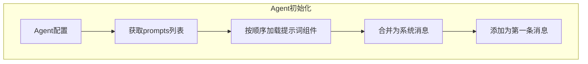

# TECH-PROMPT: 提示词组件模块

本文档描述Neco项目的提示词组件（Prompt Components）设计，包括提示词组件的定义、加载机制和内置组件。

## 1. 模块概述

提示词组件是用于组合Agent提示词的静态片段，在Agent初始化时加载。它是纯Markdown格式的轻量级提示词片段，不包含工具依赖、激活条件等复杂结构。

## 2. 核心概念

### 2.1 提示词组件定义

提示词组件存储在配置目录的 `prompts/` 子目录下：

```text
~/.config/neco/
├── prompts/
│   ├── base.md                   # 基础提示词组件
│   └── multi-agent.md            # 多智能体提示词
```

单个Markdown文件即为一个提示词组件，该Markdown文件的内容即为该组件的提示词内容，无头部信息。文件名（不含扩展名）即为提示词组件的标识名称。

### 2.3 提示词组件加载机制



### 2.4 内置组件与文件组件

在 Neco 系统中，提示词组件有两类来源：**内置组件**和**文件组件**。

#### 2.4.1 组件来源

| 来源类型 | 定义方式 | 存储位置 | 优先级 |
|---------|---------|---------|-------|
| **内置组件** | 代码中硬编码的常量 | 程序内部 | 高 |
| **文件组件** | 用户自定义的 Markdown 文件 | `~/.config/neco/prompts/*.md` | 低 |

#### 2.4.2 内置组件

内置组件是 Neco 系统预设的提示词片段，目前包括：

| 组件名称 | 说明 | 加载条件 |
|---------|------|---------|
| `base` | 基础提示词组件 | 默认加载（当未显式配置 prompts 时） |
| `multi-agent` | 多智能体提示词组件 | Agent 可以生成下级Agent时 |
| `multi-agent-child` | 子Agent提示词组件 | Agent 作为子Agent运行时 |

> **注意**：内置组件的具体内容见本文档第5节。

#### 2.4.3 文件组件

文件组件是用户自定义的提示词片段，存储在配置目录的 `prompts/` 子目录下：

```text
~/.config/neco/
├── prompts/
│   ├── base.md                   # 自定义基础提示词（可覆盖内置 base）
│   ├── multi-agent.md            # 自定义多智能体提示词
│   └── custom-component.md       # 自定义提示词组件
```

文件组件的命名规则：
- 文件名（不含 `.md` 扩展名）即为组件标识名称
- 支持任意合法文件名作为组件名

#### 2.4.4 加载优先级与覆盖机制

当组件名称冲突时，**文件组件优先于内置组件**：

```text
加载优先级（从高到低）：
1. 文件组件（~/.config/neco/prompts/*.md）
2. 内置组件（代码中的硬编码常量）
```

**覆盖示例**：
- 如果用户创建了 `~/.config/neco/prompts/base.md`，系统会加载该文件内容而非内置的 `base` 组件
- 这允许用户自定义基础提示词的行为

**使用场景**：
- 覆盖内置组件：创建同名文件（如 `base.md`）来替换默认行为
- 扩展组件：创建新文件（如 `custom-component.md`）来添加自定义提示词

## 3. 数据结构设计

### 3.1 Agent配置中的提示词组件

> 详细数据结构定义见 [TECH-SESSION.md#32-agent结构](TECH-SESSION.md#32-agent结构)

Agent配置中的 `prompts` 字段用于指定激活的提示词组件列表。

### 3.2 提示词组件存储格式

Agent消息文件中的提示词配置：

```toml
# Agent配置
[config]
model_group = "smart"
prompts = ["base", "multi-agent"]
```

## 4. Agent提示词加载实现

> 详细实现代码见 [TECH-AGENT.md#4-agent管理器](TECH-AGENT.md#4-agent管理器)

## 5. 内置提示词组件

### 5.1 base

基础提示词组件，默认加载（当未显式配置 prompts 时）。

```markdown
# base 提示词组件

你是Neco，一个原生支持多智能体协作的AI助手。

## 可用工具

你可以通过工具与外部系统交互：
- activate: 激活额外能力（skills、prompts、mcp）
- fs: 文件系统操作（read、write、edit、delete）
- mcp: MCP服务器工具
- multi-agent: 多智能体协作（spawn、send、report）
- question: 向用户提问
- workflow: 工作流控制（仅工作流模式）

## 如何加载内容

当需要额外能力时，使用 activate 工具：
- activate::skill <skill_id>: 激活Skill
- activate::mcp <server_name>: 连接MCP服务器
- activate::prompt <prompt_name>: 加载提示词组件

## 注意事项

- 谨慎使用文件写入操作
- 遇到错误时先尝试理解原因再重试
- 及时向用户汇报重要进展
```

### 5.2 multi-agent

如果Agent可以生成下级Agent，则加载此提示词组件。

```markdown
# multi-agent 提示词组件

你有能力生成下级Agent来协助完成任务。当你发现任务可以拆分为多个独立子任务时，可以使用 `multi-agent::spawn` 工具创建专门的下级Agent。

## 使用场景

1. **并行研究**：需要同时研究多个不同主题时
2. **分工协作**：不同方面需要不同专业知识的Agent
3. **效率提升**：可以并行执行的任务

## 创建下级Agent

使用 `multi-agent::spawn` 工具：
- `agent_id`: 要使用的Agent定义（如 'researcher'）
- `task`: 明确的任务描述
- `model_group`: （可选）覆盖模型组
- `prompts`: （可选）覆盖提示词组件

## 与下级Agent通信

- 使用 `multi-agent::send` 向指定下级Agent发送消息
- 下级Agent完成任务后会主动汇报

## 注意事项

- 保持对整体进度的掌控
- 适时要求下级Agent汇报进展
- 合并下级Agent的结果
```

### 5.3 multi-agent-child

如果Agent有上级Agent（作为子Agent），则加载此提示词组件。

```markdown
# multi-agent-child 提示词组件

你是一个下级Agent，被上级Agent创建来完成特定任务。

## 你的职责

1. **专注执行**：专注于被分配的任务
2. **主动汇报**：定期向上级汇报进度和结果
3. **寻求帮助**：遇到困难时及时询问上级

## 可用工具

- `multi-agent::report`: 向上级汇报进度或结果
  - `report_type`: "progress" | "result" | "question"
  - `content`: 汇报内容
  - `progress`: （可选）进度百分比

## 工作流程

1. 理解任务要求
2. 制定执行计划
3. 定期汇报进展
4. 完成后提交结果
5. 等待下一步指示

## 注意事项

- 不能创建自己的下级Agent（只有上级Agent可以）
- 只能通过report工具与上级通信
- 不要直接访问用户，所有交互通过上级转发
```

## 6. 提示词组件配置

### 6.1 配置目录结构

> 详细配置说明见 [TECH-CONFIG.md#2.1-配置目录结构](TECH-CONFIG.md#21-配置目录结构)

提示词组件存储在配置目录的 `prompts/` 子目录下。

```text
~/.config/neco/prompts/
├── base.md                   # 基础提示词组件
└── multi-agent.md            # 多智能体提示词
```

### 6.2 Agent定义中的提示词组件

在Agent定义文件中，可以通过头部信息指定激活的提示词组件：

```yaml
# Agent头部信息
# （可选）激活的提示词组件。按顺序激活。
# 如果未定义此字段，默认只加载 `base` 组件；
# 如果已定义，则仅按该列表加载（不额外强制注入 `base`）。
prompts:
  - base
  - multi-agent
```

## 7. 错误处理

> **注意**: 提示词组件加载错误作为AgentError的一部分处理。

```rust
#[derive(Debug, Error)]
pub enum AgentError {
    // ... 其他错误类型
    
    #[error("提示词未找到: {0}")]
    PromptNotFound(String),
    
    // ... 其他错误类型
}
```

---

---

*关联文档：*
- [TECH.md](TECH.md) - 总体架构文档
- [TECH-AGENT.md](TECH-AGENT.md) - 多智能体协作模块
- [TECH-SESSION.md](TECH-SESSION.md) - Session管理模块
- [TECH-CONFIG.md](TECH-CONFIG.md) - 配置管理模块
