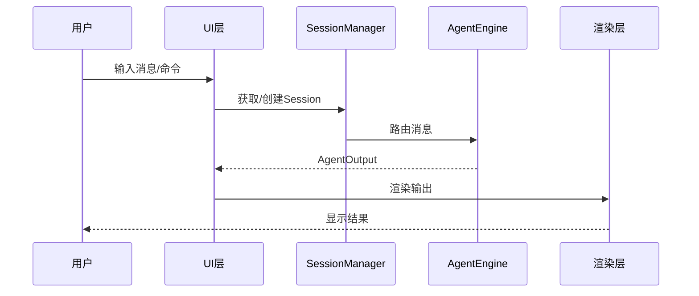

# TECH-PROMPT: 提示词组件模块

本文档描述Neco项目的提示词组件（Prompt Components）设计。

## 1. 模块概述

提示词组件是用于组合Agent提示词的静态片段，在Agent初始化时加载。

## 1.1 整体数据流图



## 2. 核心概念

### 2.1 提示词组件定义

提示词组件存储在配置目录的 `prompts/` 子目录下。

```text
# prompts/ 子目录结构
.neco/prompts/
├── base.md              # 基础提示词
├── multi-agent.md       # 多智能体提示词
└── custom.md           # 自定义提示词
```

### 2.2 组件类型

| 组件 | 加载条件 | 说明 |
|------|---------|------|
| `base` | 默认 | 始终加载 |
| `multi-agent` | 可创建子Agent时 | Agent可以生成下级 |
| `multi-agent-child` | 作为子Agent时 | Agent有上级 |

## 3. 提示词内容

### 3.1 base 提示词

```markdown
# base 提示词组件

你是Neco，一个原生支持多智能体协作的AI助手。

## 可用工具

- activate: 激活额外能力
- fs: 文件系统操作
- mcp: MCP服务器工具
- multi-agent: 多智能体协作
- question: 向用户提问

## 注意事项

- 谨慎使用文件写入操作
- 遇到错误时先尝试理解原因再重试
```

### 3.2 multi-agent 提示词

```markdown
# multi-agent 提示词组件

你有能力生成下级Agent来协助完成任务。

## 使用场景

1. 并行研究：需要同时研究多个不同主题
2. 分工协作：不同方面需要不同专业知识

## 创建下级Agent

使用 `multi-agent::spawn` 工具
```

## 4. Agent配置

```yaml
# Agent头部信息
prompts:
  - base
  - multi-agent
```

## 5. 接口规范

### 5.1 PromptLoader 接口

提示词加载器负责从文件系统加载提示词组件。

```rust
pub trait PromptLoader {
    fn load(&self, component: &str) -> Result<String, PromptError>;
    fn list_components(&self) -> Result<Vec<String>, PromptError>;
}

/// 加载行为规范：
/// - 文件编码：支持UTF-8（带BOM或不带BOM），自动检测并去除BOM
/// - 换行符处理：自动将\r\n（Windows）和\r（Classic Mac）转换为\n（Unix）
/// - 路径解析：component参数使用kebab-case命名，映射为{component}.md文件
/// - 路径遍历防护：不允许包含".."或绝对路径，仅限prompts/目录内
/// - 错误处理：文件不存在返回PromptError::NotFound，编码错误返回PromptError::Encoding
```

**参数说明：**
- `component: &str` - 提示词组件名称（如 "base", "multi-agent"）

**返回值定义：**
- `Result<String, PromptError>` - 成功返回提示词内容，失败返回错误

**编码规范：**
- 文件编码：UTF-8（带BOM或不带BOM均可）
- 换行符：支持 `\n`（Unix）和 `\r\n`（Windows），统一转换为 `\n`
- 空白处理：保留首尾空白行，但trim每行右侧空格
- 特殊字符：支持Unicode字符（包括中文、emoji等）

### 5.2 PromptBuilder 接口

提示词构建器负责组合多个组件生成最终提示词。

```rust
pub trait PromptBuilder {
    fn build(&self, components: &[String]) -> Result<String, PromptError>;
}
```

**参数说明：**
- `components: &[String]` - 要组合的组件名称列表

**返回值定义：**
- `Result<String, PromptError>` - 成功返回组合后的完整提示词，失败返回错误

### 5.3 会话管理接口

#### 5.3.1 SessionRepository（数据访问层）

会话仓储负责会话的持久化和检索。

```rust
pub trait SessionRepository: Send + Sync {
    async fn get_or_create(&self, session_id: &str) -> Result<Session, SessionError>;
    async fn save(&self, session: &Session) -> Result<(), SessionError>;
    async fn find_by_id(&self, session_id: &str) -> Result<Option<Session>, SessionError>;
}
```

**参数说明：**
- `session_id: &str` - 会话唯一标识符
- `session: &Session` - 会话实例

**返回值定义：**
- `Result<Session, SessionError>` - 成功返回会话实例（get_or_create）
- `Result<(), SessionError>` - 保存操作结果（save）
- `Result<Option<Session>, SessionError>` - 查询结果（find_by_id）

#### 5.3.2 MessageRoutingService（领域服务层）

消息路由服务负责消息路由的业务逻辑。

```rust
pub trait MessageRoutingService {
    async fn route_message(&self, session: &Session, message: &str) -> Result<AgentOutput, RouteError>;
}
```

**参数说明：**
- `session: &Session` - 会话实例引用
- `message: &str` - 用户消息内容

**返回值定义：**
- `Result<AgentOutput, RouteError>` - 成功返回Agent输出

**设计说明：**
- SessionRepository 只负责数据访问（CRUD）
- MessageRoutingService 只负责业务逻辑（路由规则）
- 两者通过依赖注入组合使用，确保职责单一且抽象层级一致

### 5.4 AgentEngine 接口

Agent引擎负责处理消息并生成响应。

```rust
pub trait AgentEngine {
    async fn process(&self, session: &Session, input: &str) -> Result<AgentOutput, AgentError>;
}
```

**参数说明：**
- `session: &Session` - 会话实例引用
- `input: &str` - 用户输入内容

**返回值定义：**
- `Result<AgentOutput, AgentError>` - 成功返回Agent输出结果


## 7. TODO 示例

### 7.1 CLI 运行逻辑

```rust
pub async fn run(&self) -> Result<(), UiError> {
    // TODO: 实现CLI运行逻辑
    // - 解析CliArgs
    // - 初始化SessionManager
    // - 执行消息处理循环
}
```

### 7.2 提示词加载

```rust
pub fn load(&self, component: &str) -> Result<String, PromptError> {
    // TODO: 实现提示词加载
    // - 验证组件名称
    // - 读取文件内容
    // - 返回提示词字符串
}
```

---

*关联文档：*
- [TECH.md](TECH.md) - 总体架构文档
- [TECH-AGENT.md](TECH-AGENT.md) - Agent模块
- [TECH-SESSION.md](TECH-SESSION.md) - Session管理模块
