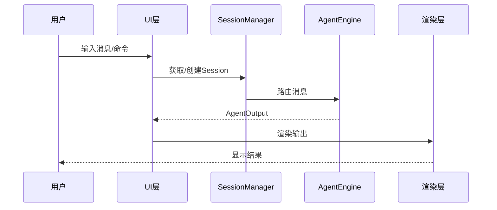

# TECH-PROMPT: 提示词组件模块

本文档描述NeoCo项目的提示词组件（Prompt Components）设计。

## 1. 模块概述

提示词组件是用于组合Agent提示词的静态片段，在Agent初始化时加载。

## 1.1 整体数据流图



## 2. 核心概念

### 2.1 提示词组件定义

提示词组件存储在配置目录的 `prompts/` 子目录下。
按以下优先级查找（高优先级先找到则使用）：
1. .neoco/prompts/（项目根目录）
2. .agents/prompts/（项目根目录）
3. ~/.config/neoco/prompts/
4. ~/.agents/prompts/

### 2.2 组件类型

#### 基础提示词组件

| 组件ID | 文件名 | 说明 |
|--------|--------|------|
| `base` | `base.md` | 始终加载，包含如何加载未加载的内容的提示 |
| `multi-agent` | `multi-agent.md` | 可创建子Agent时加载 |
| `multi-agent-child` | `multi-agent-child.md` | 作为子Agent时加载 |

#### 工具提示词组件

| 组件ID | 文件名 | 说明 |
|--------|--------|------|
| `fs::read` | `fs--read.md` | 文件读取工具提示词 |
| `fs::write` | `fs--write.md` | 文件写入工具提示词 |
| `fs::edit` | `fs--edit.md` | 文件编辑工具提示词 |
| `fs::delete` | `fs--delete.md` | 文件删除工具提示词 |
| `fs::list` | `fs--list.md` | 目录列表工具提示词 |
| `activate` | `activate.md` | 激活工具提示词 |
| `multi-agent::spawn` | `multi-agent--spawn.md` | 生成子Agent工具提示词 |
| `multi-agent::send` | `multi-agent--send.md` | 发送消息工具提示词 |
| `context::observe` | `context--observe.md` | 上下文观测工具提示词 |
| `context::compact` | `context--compact.md` | 上下文压缩工具提示词 |

#### 其他自定义组件

| 组件ID | 文件名 | 说明 |
|--------|--------|------|
| 其他 | 按需 | 自定义提示词组件 |

**说明**：
- 所有内置提示词组件都可通过在配置目录创建同名文件进行替换
- 文件名使用 `--` 替代 `::`（因为 `::` 无法出现在文件系统中）
- 例如：`fs::read` 对应文件 `fs--read.md`，可通过创建 `prompts/fs--read.md` 替换
- 如需动态启用能力，请使用 Skills 机制

## 3. 提示词内容

### 3.1 base 提示词

```markdown
# base 提示词组件

你是NeoCo，一个原生支持多智能体协作的AI助手。

## 可用工具

- activate: 激活额外能力
- fs: 文件系统操作
- mcp: MCP服务器工具
- multi-agent: 多智能体协作
- question: 向用户提问

## 注意事项

- 谨慎使用文件写入操作
- 遇到错误时先尝试理解原因再重试
```

### 3.2 multi-agent 提示词

```markdown
# multi-agent 提示词组件

你有能力生成下级Agent来协助完成任务。

## 使用场景

1. 并行研究：需要同时研究多个不同主题
2. 分工协作：不同方面需要不同专业知识

## 创建下级Agent

使用 `multi-agent::spawn` 工具
```

### 3.3 工具提示词组件

工具提示词组件在工具执行时自动加载，作为工具的额外上下文，帮助Agent正确使用工具。

#### 命名规则

- 工具提示词组件使用工具ID作为组件ID
- 文件名使用 `--` 替代 `::`（因为 `::` 无法出现在文件系统中）
- 例如：`fs::read` 对应文件 `fs--read.md`

#### 文件格式

```markdown
---
id: fs::read
visible: true
---

# fs::read 工具提示词

## 功能说明

读取指定文件的内容。

## 使用场景

- 查看代码文件内容
- 读取配置文件
- 检查文档内容

## 注意事项

- 文件路径必须是相对路径或绝对路径
- 读取大文件时可能需要指定 offset 和 limit 参数
```

#### 替换机制

- 所有内置工具提示词组件都可通过在配置目录创建同名文件进行替换
- 替换时优先使用用户配置目录中的版本
- 例如：创建 `prompts/fs--read.md` 可替换内置的 `fs::read` 工具提示词

#### 加载时机

- 工具提示词组件在工具执行时自动加载
- 加载后作为工具调用上下文的一部分，提供给Agent

## 4. Agent配置

```toml
# Agent头部信息
[prompts]
base = true
multi-agent = true
```

## 5. 接口规范

### 5.1 PromptLoader 接口

提示词加载器负责从文件系统加载提示词组件。

```rust
/// 提示词组件元数据
#[derive(Debug, Clone)]
pub struct PromptComponent {
    /// 组件标识，如 "fs::read"
    pub id: String,
    /// 文件名（不含扩展名），如 "fs--read"
    pub file_name: String,
    /// 组件内容（延迟加载）
    pub content: Option<String>,
}

pub trait PromptLoader {
    /// 通过组件ID加载提示词内容
    /// id 可以是组件标识（如 "fs::read"）或文件名（不含扩展名，如 "fs--read"）
    fn load(&self, id: &str) -> Result<String, PromptError>;
    
    /// 列出所有可用组件的元数据
    fn list_components(&self) -> Result<Vec<PromptComponent>, PromptError>;
    
    /// 根据工具ID获取对应的提示词组件
    /// 自动处理 :: 到 -- 的转换
    fn load_for_tool(&self, tool_id: &str) -> Result<Option<String>, PromptError> {
        // 将 tool_id 转换为文件名格式
        let file_name = tool_id.replace("::", "--");
        // 尝试加载
        match self.load(&file_name) {
            Ok(content) => Ok(Some(content)),
            Err(PromptError::NotFound(_)) => Ok(None),
            Err(e) => Err(e),
        }
    }
}

/// 加载行为规范：
/// - 文件编码：支持UTF-8（带BOM或不带BOM），自动检测并去除BOM
/// - 换行符处理：自动将\r\n（Windows）和\r（Classic Mac）转换为\n（Unix）
/// - 路径解析：id参数可以是组件标识（如 "fs::read"）或文件名（如 "fs--read"）
/// - 路径遍历防护：不允许包含".."或绝对路径，仅限prompts/目录内
/// - 错误处理：文件不存在返回PromptError::NotFound，编码错误返回PromptError::Encoding
/// - 替换优先级：用户配置目录 > 内置默认
```

**参数说明：**
- `id: &str` - 提示词组件标识（如 "base", "fs::read"）或文件名（不含扩展名，如 "fs--read"）
- `list_components()` - 返回所有可用组件的元数据列表

**返回值定义：**
- `load()` - 成功返回提示词内容，失败返回错误
- `list_components()` - 返回 `Vec<PromptComponent>`

**编码规范：**
- 文件编码：UTF-8（带BOM或不带BOM均可）
- 换行符：支持 `\n`（Unix）和 `\r\n`（Windows），统一转换为 `\n`
- 空白处理：保留首尾空白行，但trim每行右侧空格
- 特殊字符：支持Unicode字符（包括中文、emoji等）

**替换优先级：**
- 查找顺序：用户配置目录 → 内置默认
- 替换机制：所有内置提示词组件都可通过在配置目录创建同名文件进行替换

### 5.2 PromptBuilder 接口

提示词构建器负责组合多个组件生成最终提示词。

```rust
pub trait PromptBuilder {
    fn build(&self, components: &[String]) -> Result<String, PromptError>;
}
```

**参数说明：**
- `components: &[String]` - 要组合的组件名称列表

**返回值定义：**
- `Result<String, PromptError>` - 成功返回组合后的完整提示词，失败返回错误

### 5.3 会话管理接口

#### 5.3.1 SessionRepository（数据访问层）

会话仓储负责会话的持久化和检索。

```rust
pub trait SessionRepository: Send + Sync {
    async fn get_or_create(&self, session_ulid: &SessionUlid) -> Result<Session, SessionError>;
    async fn save(&self, session: &Session) -> Result<(), SessionError>;
    async fn find_by_id(&self, session_ulid: &SessionUlid) -> Result<Option<Session>, SessionError>;
}
```

**参数说明：**
- `session_ulid: &SessionUlid` - 会话ULID标识符
- `session: &Session` - 会话实例

**返回值定义：**
- `Result<Session, SessionError>` - 成功返回会话实例（get_or_create）
- `Result<(), SessionError>` - 保存操作结果（save）
- `Result<Option<Session>, SessionError>` - 查询结果（find_by_id）

#### 5.3.2 MessageRoutingService（领域服务层）

消息路由服务负责消息路由的业务逻辑。

```rust
pub trait MessageRoutingService {
    async fn route_message(&self, session: &Session, message: &str) -> Result<AgentOutput, RouteError>;
}
```

**参数说明：**
- `session: &Session` - 会话实例引用
- `message: &str` - 用户消息内容

**返回值定义：**
- `Result<AgentOutput, RouteError>` - 成功返回Agent输出

**设计说明：**
- SessionRepository 只负责数据访问（CRUD）
- MessageRoutingService 只负责业务逻辑（路由规则）
- 两者通过依赖注入组合使用，确保职责单一且抽象层级一致

### 5.4 AgentEngine 接口

Agent引擎负责处理消息并生成响应。

```rust
pub trait AgentEngine {
    async fn process(&self, session: &Session, input: &str) -> Result<AgentOutput, AgentError>;
}
```

**参数说明：**
- `session: &Session` - 会话实例引用
- `input: &str` - 用户输入内容

**返回值定义：**
- `Result<AgentOutput, AgentError>` - 成功返回Agent输出结果


## 7. TODO 示例

### 7.1 CLI 运行逻辑

```rust
pub async fn run(&self) -> Result<(), UiError> {
    // TODO: 实现CLI运行逻辑
    // - 解析CliArgs
    // - 初始化SessionManager
    // - 执行消息处理循环
}
```

### 7.2 提示词加载

```rust
pub fn load(&self, component: &str) -> Result<String, PromptError> {
    // TODO: 实现提示词加载
    // - 验证组件名称
    // - 读取文件内容
    // - 返回提示词字符串
}
```

---

*关联文档：*
- [TECH.md](TECH.md) - 总体架构文档
- [TECH-AGENT.md](TECH-AGENT.md) - Agent模块
- [TECH-SESSION.md](TECH-SESSION.md) - Session管理模块
