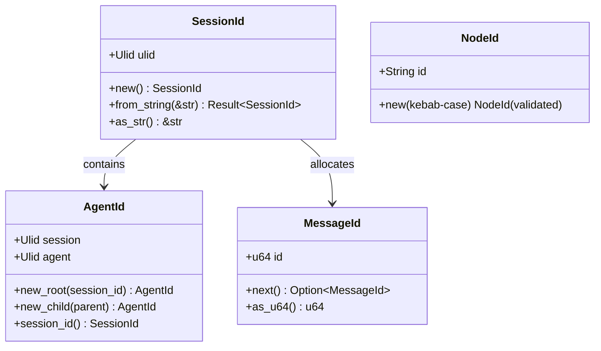
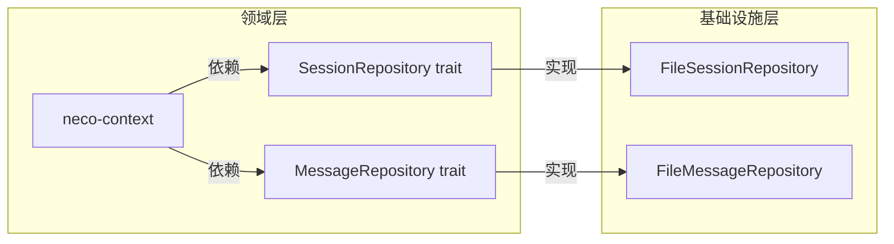
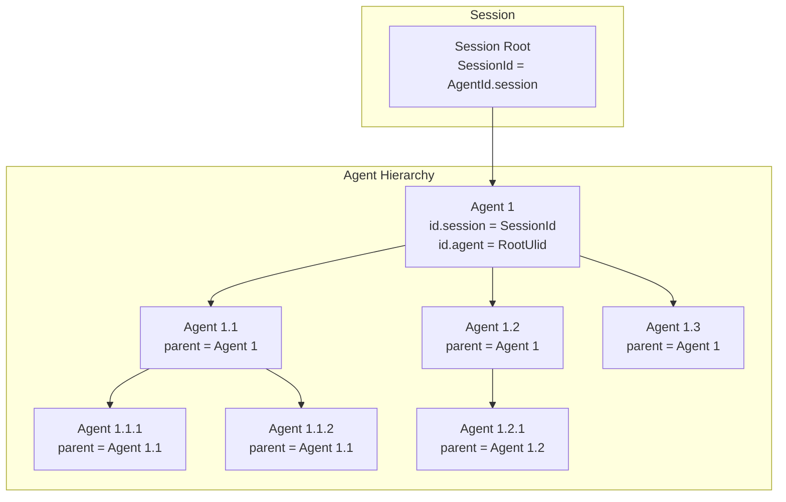
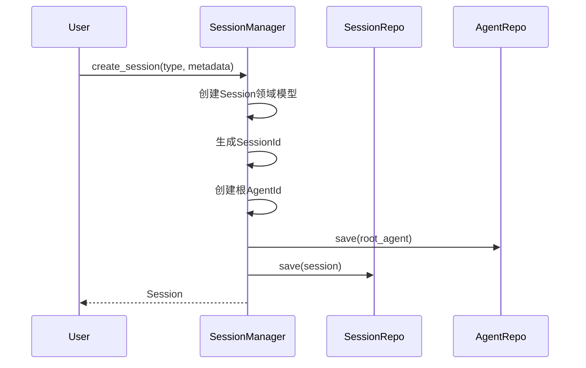
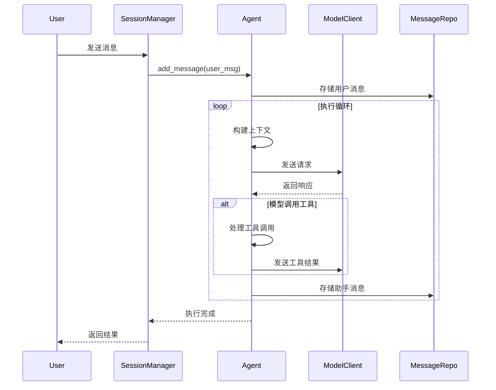
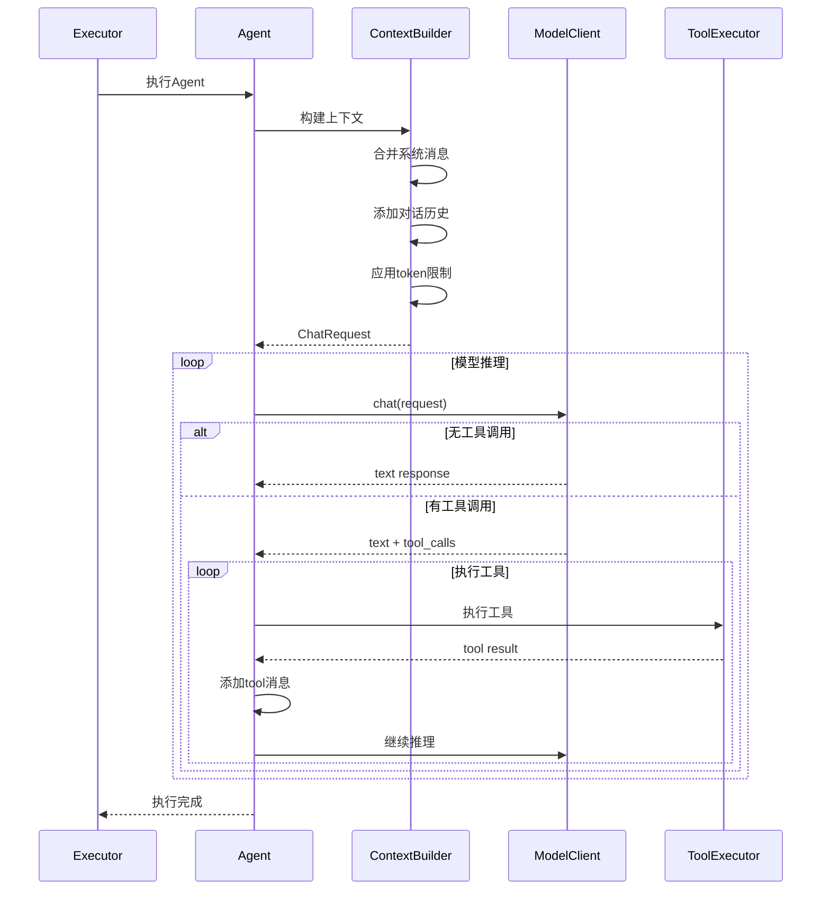

# TECH-SESSION: Session管理模块

本文档描述Neco项目的Session管理模块设计，采用领域驱动设计，分离领域模型与基础设施。

## 1. 模块概述

Session管理模块负责管理对话Session的生命周期、消息存储和Agent树形结构。采用领域驱动设计原则：
- **领域模型**：不含外部依赖（无 storage、model_client 字段）
- **仓储接口**：定义数据访问抽象
- **基础设施**：实现具体的存储后端

## 2. 核心概念

### 2.1 标识符体系（强类型）



**标识符规则：**

| 标识符 | 生成时机 | 结构 | 校验 |
|--------|---------|------|------|
| `SessionId` | 创建Session时 | `SessionId(Ulid)` | 26位Ulid |
| `AgentId` | Agent实例化时 | `{session: Ulid, agent: Ulid}` | 双Ulid |
| `MessageId` | 消息添加时 | `MessageId(u64)` | 原子自增 |
| `NodeId` | 工作流定义时 | `NodeId(String)` | kebab-case |

### 2.2 领域仓储接口（依赖反转）

> 为解决循环依赖问题，在 `neco-core` 中定义领域仓储接口：



**Session仓储接口：**

```rust
/// Session仓储接口 - 用于依赖反转
/// 
/// neco-context 依赖此 trait，neco-session 实现此 trait
/// 运行时通过依赖注入传递具体实现
#[async_trait]
pub trait SessionRepository: Send + Sync {
    /// 保存Session
    async fn save(&self, session: &Session) -> Result<(), StorageError>;
    
    /// 按ID查找Session
    async fn find_by_id(&self, id: &SessionId) -> Result<Option<Session>, StorageError>;
    
    /// 删除Session
    async fn delete(&self, id: &SessionId) -> Result<(), StorageError>;
    
    /// 列出所有Session
    async fn list(&self) -> Result<Vec<SessionId>, StorageError>;
}

/// Agent仓储接口
#[async_trait]
pub trait AgentRepository: Send + Sync {
    /// 保存Agent
    async fn save(&self, agent: &Agent) -> Result<(), StorageError>;
    
    /// 按ID查找Agent
    async fn find_by_id(&self, id: &AgentId) -> Result<Option<Agent>, StorageError>;
    
    /// 查找Session下的所有Agent
    async fn find_by_session(&self, session_id: &SessionId) -> Result<Vec<Agent>, StorageError>;
}

/// 消息仓储接口
#[async_trait]
pub trait MessageRepository: Send + Sync {
    /// 追加消息
    async fn append(&self, agent_id: &AgentId, message: &Message) -> Result<(), StorageError>;
    
    /// 列出Agent的所有消息
    async fn list(&self, agent_id: &AgentId) -> Result<Vec<Message>, StorageError>;
    
    /// 截断消息（保留<=指定id的消息）
    async fn truncate(&self, agent_id: &AgentId, up_to_id: MessageId) -> Result<(), StorageError>;
}
```

## 3. 领域模型设计

### 3.1 Session领域模型（不含基础设施）

```rust
/// Session类型
#[derive(Debug, Clone, PartialEq, Eq, Serialize, Deserialize)]
#[serde(tag = "type", rename_all = "lowercase")]
pub enum SessionType {
    Direct { initial_message: Option<String> },
    Repl,
    Workflow { workflow_id: String },
}

/// Session元数据
#[derive(Debug, Clone, Serialize, Deserialize)]
pub struct SessionMetadata {
    pub user_id: Option<String>,
    pub working_dir: PathBuf,
    pub initial_prompt: Option<String>,
    #[serde(default)]
    pub custom: HashMap<String, Value>,
}

/// Session领域模型（不含storage字段）
pub struct Session {
    pub id: SessionId,
    pub session_type: SessionType,
    pub root_agent_id: AgentId,
    pub hierarchy: AgentHierarchy,
    pub id_allocator: MessageIdAllocator,
    pub metadata: SessionMetadata,
    pub created_at: DateTime<Utc>,
    pub updated_at: DateTime<Utc>,
}

impl Session {
    pub fn new(
        session_type: SessionType,
        metadata: SessionMetadata,
    ) -> Self {
        let id = SessionId::new();
        let root_agent_id = AgentId::new_root(&id);
        
        Self {
            id: id.clone(),
            session_type,
            root_agent_id: root_agent_id.clone(),
            hierarchy: AgentHierarchy::new(root_agent_id),
            id_allocator: MessageIdAllocator::new(1),
            metadata,
            created_at: Utc::now(),
            updated_at: Utc::now(),
        }
    }
    
    pub fn spawn_agent(
        &mut self,
        parent_id: AgentId,
    ) -> Result<AgentId, SessionError> {
        if parent_id != self.root_agent_id && !self.hierarchy.has_agent(&parent_id) {
            return Err(SessionError::AgentNotFound(parent_id));
        }
        
        let agent_id = AgentId::new_child(&parent_id);
        self.hierarchy.add_child(parent_id, agent_id.clone());
        Ok(agent_id)
    }
    
    pub fn allocate_message_id(&self) -> Option<MessageId> {
        self.id_allocator.next_id()
    }
}

/// Session存储表示
#[derive(Debug, Clone, Serialize, Deserialize)]
pub struct SessionMeta {
    pub id: SessionId,
    pub session_type: SessionType,
    pub root_agent_id: AgentId,
    pub next_message_id: u64,
    pub created_at: DateTime<Utc>,
    pub updated_at: DateTime<Utc>,
    pub metadata: SessionMetadata,
}
```

### 3.2 Agent领域模型（分离配置与运行时）

```rust
/// Agent定义（静态配置）
#[derive(Debug, Clone, Serialize, Deserialize)]
pub struct AgentDefinition {
    pub id: String,
    pub name: String,
    pub description: Option<String>,
    pub model_group: String,
    pub prompts: Vec<String>,
    pub tools: Vec<String>,
    pub mcp_servers: Vec<String>,
    pub skills: Vec<String>,
}

impl AgentDefinition {
    pub fn from_file(path: &Path) -> Result<Self, AgentDefinitionError> {
        // [TODO] 实现要点说明
        // 1. 读取文件内容
        // 2. 解析YAML头部 (--- delimited)
        // 3. 提取配置字段
        // 4. 返回AgentDefinition
        unimplemented!()
    }
}

/// Agent运行时状态
#[derive(Debug, Clone)]
pub struct Agent {
    pub id: AgentId,
    pub parent_id: Option<AgentId>,
    pub definition_id: String,
    pub messages: Vec<Message>,
    pub state: AgentState,
    pub active_tools: Vec<ToolId>,
    pub active_mcp: Vec<McpServerId>,
    pub active_skills: Vec<SkillId>,
    pub created_at: DateTime<Utc>,
    pub last_activity: DateTime<Utc>,
}

impl Agent {
    pub fn new(
        id: AgentId,
        parent_id: Option<AgentId>,
        definition_id: String,
    ) -> Self {
        Self {
            id,
            parent_id,
            definition_id,
            messages: Vec::new(),
            state: AgentState::Idle,
            active_tools: Vec::new(),
            active_mcp: Vec::new(),
            active_skills: Vec::new(),
            created_at: Utc::now(),
            last_activity: Utc::now(),
        }
    }
    
    pub fn add_message(&mut self, message: Message) {
        self.last_activity = Utc::now();
        self.messages.push(message);
    }
}

/// Agent层级关系
#[derive(Debug, Clone)]
pub struct AgentHierarchy {
    root: AgentId,
    parent_map: HashMap<AgentId, AgentId>,
    children_map: HashMap<AgentId, Vec<AgentId>>,
}

impl AgentHierarchy {
    pub fn new(root: AgentId) -> Self {
        // TODO: 实现层级关系初始化
        // 1. 接收根节点ID作为参数
        // 2. 创建空的parent_map (HashMap<AgentId, AgentId>)
        // 3. 创建空的children_map (HashMap<AgentId, Vec<AgentId>>)
        // 4. 将根节点加入children_map，value为空Vec
        unimplemented!()
    }
    
    pub fn add_child(&mut self, parent: AgentId, child: AgentId) {
        // TODO: 实现添加子节点
        // 1. 在parent_map中插入 child -> parent 的映射
        // 2. 在children_map中为parent添加child到Vec
        // 3. 如果parent尚无children记录，创建新的Vec
        unimplemented!()
    }
    
    pub fn has_agent(&self, id: &AgentId) -> bool {
        // TODO: 实现存在性检查
        // 1. 检查id是否等于根节点
        // 2. 检查parent_map中是否包含该id作为key
        // 3. 满足任一条件返回true
        unimplemented!()
    }
    
    pub fn get_parent(&self, id: &AgentId) -> Option<&AgentId> {
        // TODO: 实现获取父节点
        // 1. 排除根节点情况（根节点无父节点）
        // 2. 从parent_map中查找id对应的parent
        // 3. 返回Some(parent_id)或None
        unimplemented!()
    }
    
    pub fn get_children(&self, id: &AgentId) -> Option<&Vec<AgentId>> {
        // TODO: 实现获取子节点列表
        // 1. 从children_map中查找id对应的Vec
        // 2. 返回Some(children)或None
        unimplemented!()
    }
    
    pub fn get_ancestors(&self, id: &AgentId) -> Vec<AgentId> {
        // TODO: 实现获取所有祖先节点
        // 1. 创建空的结果Vec
        // 2. 从id开始循环向上查找parent
        // 3. 每次获取parent后继续向上查找直到根节点
        // 4. 返回收集到的所有祖先（从近到远）
        unimplemented!()
    }
    
    pub fn get_descendants(&self, id: &AgentId) -> Vec<AgentId> {
        // TODO: 实现获取所有后代节点
        // 1. 使用BFS算法创建队列
        // 2. 将id的所有直接子节点入队
        // 3. 循环：从队列取出节点，加入结果，将该节点的子节点入队
        // 4. 队列为空时返回结果
        unimplemented!()
    }
}

/// Agent状态
#[derive(Debug, Clone, PartialEq, Eq, Serialize, Deserialize)]
#[serde(rename_all = "lowercase")]
pub enum AgentState {
    Idle,
    Running,
    WaitingForTool,
    WaitingForUser,
    Completed,
    Error(AgentErrorInfo),
}

#[derive(Debug, Clone, PartialEq, Eq, Serialize, Deserialize)]
pub struct AgentErrorInfo {
    pub code: String,
    pub message: String,
    pub recoverable: bool,
}
```

### 3.3 消息结构（统一消息系统）

```rust
/// 消息角色
#[derive(Debug, Clone, Copy, PartialEq, Eq, Hash, Serialize, Deserialize)]
#[serde(rename_all = "lowercase")]
pub enum Role {
    System,
    User,
    Assistant,
    Tool,
}

/// 工具调用
#[derive(Debug, Clone, Serialize, Deserialize)]
pub struct ToolCall {
    pub id: String,
    pub r#type: String,
    pub function: ToolFunction,
}

#[derive(Debug, Clone, Serialize, Deserialize)]
pub struct ToolFunction {
    pub name: String,
    pub arguments: String,
}

/// 消息元数据
#[derive(Debug, Clone, Serialize, Deserialize)]
pub struct MessageMetadata {
    pub prompt_tokens: Option<u32>,
    pub completion_tokens: Option<u32>,
    pub total_tokens: Option<u32>,
}

/// 领域消息（Session层使用）
#[derive(Debug, Clone, Serialize, Deserialize)]
pub struct Message {
    pub id: MessageId,
    pub role: Role,
    pub content: String,
    #[serde(skip_serializing_if = "Option::is_none")]
    pub tool_calls: Option<Vec<ToolCall>>,
    #[serde(skip_serializing_if = "Option::is_none")]
    pub tool_call_id: Option<String>,
    pub timestamp: DateTime<Utc>,
    #[serde(skip_serializing_if = "Option::is_none")]
    pub metadata: Option<MessageMetadata>,
}

/// 模型消息（Model层使用，无id）
#[derive(Debug, Clone)]
pub struct ModelMessage<'a> {
    pub role: Role,
    pub content: Cow<'a, str>,
    pub tool_calls: Option<&'a [ToolCall]>,
    pub tool_call_id: Option<&'a str>,
}

impl<'a> ModelMessage<'a> {
    pub fn from_message(msg: &'a Message) -> Self {
        Self {
            role: msg.role,
            content: Cow::Borrowed(&msg.content),
            tool_calls: msg.tool_calls.as_deref(),
            tool_call_id: msg.tool_call_id.as_deref(),
        }
    }
    
    pub fn from_str(role: Role, content: &'a str) -> Self {
        Self {
            role,
            content: Cow::Borrowed(content),
            tool_calls: None,
            tool_call_id: None,
        }
    }
    
    pub fn into_owned(self) -> Message {
        Message {
            id: MessageId(0),
            role: self.role,
            content: self.content.into_owned(),
            tool_calls: self.tool_calls.map(|v| v.to_vec()),
            tool_call_id: self.tool_call_id.map(|s| s.to_string()),
            timestamp: Utc::now(),
            metadata: None,
        }
    }
}

/// 消息构建器
pub struct MessageBuilder {
    role: Role,
    content: String,
    tool_calls: Option<Vec<ToolCall>>,
    tool_call_id: Option<String>,
}

impl MessageBuilder {
    pub fn new(role: Role) -> Self {
        Self {
            role,
            content: String::new(),
            tool_calls: None,
            tool_call_id: None,
        }
    }
    
    pub fn content(mut self, content: impl Into<String>) -> Self {
        self.content = content.into();
        self
    }
    
    pub fn tool_calls(mut self, calls: Vec<ToolCall>) -> Self {
        self.tool_calls = Some(calls);
        self
    }
    
    pub fn tool_call_id(mut self, id: impl Into<String>) -> Self {
        self.tool_call_id = Some(id.into());
        self
    }
    
    pub fn build(self) -> Message {
        Message {
            id: MessageId(0),
            role: self.role,
            content: self.content,
            tool_calls: self.tool_calls,
            tool_call_id: self.tool_call_id,
            timestamp: Utc::now(),
            metadata: None,
        }
    }
}
```

### 3.4 Agent树结构



## 4. 存储设计

### 4.1 存储后端接口

```rust
/// 存储后端Trait
#[async_trait]
pub trait StorageBackend: Send + Sync {
    // Session操作
    async fn save_session(&self, session: &Session) -> Result<(), StorageError>;
    async fn load_session(&self, id: &SessionId) -> Result<Session, StorageError>;
    async fn delete_session(&self, id: &SessionId) -> Result<(), StorageError>;
    
    // Agent操作
    async fn save_agent(&self, agent: &Agent) -> Result<(), StorageError>;
    async fn load_agent(&self, id: &AgentId) -> Result<Agent, StorageError>;
    async fn list_agents(&self, session_id: &SessionId) -> Result<Vec<AgentId>, StorageError>;
    
    // 消息操作
    async fn append_message(&self, agent_id: &AgentId, message: &Message) -> Result<(), StorageError>;
    async fn load_messages(&self, agent_id: &AgentId) -> Result<Vec<Message>, StorageError>;
}
```

### 4.2 文件系统存储实现

```
~/.local/neco/
└── {session_id}/
    ├── session.toml          # Session元数据
    ├── hierarchy.json        # Agent层级关系
    └── agents/
        └── {agent_id}.toml  # Agent消息文件
```

**Session元数据（session.toml）：**

```toml
[id]
session = "01HF8X5JQC8ZXJ3YKZ0J9K2D9Z"

[session]
type = "workflow"
created_at = "2026-03-04T10:00:00Z"
updated_at = "2026-03-04T10:30:00Z"

[metadata]
user_id = "user123"
working_dir = "/home/user/projects"

[workflow]
workflow_id = "prd"
```

**Agent消息（{agent_id}.toml）：**

```toml
[id]
session = "01HF8X5JQC8ZXJ3YKZ0J9K2D9Z"
agent = "01HF8X5JQC8ZXJ3YKZ0J9K2D9Z"

[agent]
definition_id = "coder"
parent_id = null  # 根Agent无parent
state = "running"

[messages]
[[messages]]
id = 1
role = "system"
content = "你是一个 helpful assistant。"
timestamp = "2026-03-04T10:00:00Z"

[[messages]]
id = 2
role = "user"
content = "帮我读取文件 README.md"
timestamp = "2026-03-04T10:01:00Z"

[[messages]]
id = 3
role = "assistant"
content = ""
timestamp = "2026-03-04T10:01:05Z"

[[messages.tool_calls]]
id = "call_1"
type = "function"

[messages.tool_calls.function]
name = "fs::read"
arguments = '{"path": "README.md"}'

[[messages]]
id = 4
role = "tool"
content = "# Project README\n..."
tool_call_id = "call_1"
timestamp = "2026-03-04T10:01:06Z"

[messages.metadata]
prompt_tokens = 100
completion_tokens = 50
total_tokens = 150
```

## 5. Session生命周期

### 5.1 创建Session

```rust
pub struct SessionManager {
    repository: Arc<dyn SessionRepository>,
    agent_repository: Arc<dyn AgentRepository>,
    message_repository: Arc<dyn MessageRepository>,
}

impl SessionManager {
    pub async fn create_session(
        &self,
        session_type: SessionType,
        metadata: SessionMetadata,
    ) -> Result<Session, SessionError> {
        // [TODO] 实现要点说明
        // 1. 创建Session领域模型
        // 2. 创建根Agent
        // 3. 保存到存储
        // 4. 返回Session
        unimplemented!()
    }
}

### 5.1.1 Session创建流程



### 5.2 恢复Session

```rust
impl SessionManager {
    pub async fn load_session(
        &self,
        session_id: &SessionId,
    ) -> Result<Session, SessionError> {
        // [TODO] 实现要点说明
        // 1. 从存储加载Session元数据
        // 2. 重建Agent层级关系
        // 3. 按需加载消息
        unimplemented!()
    }
}
```

## 6. 消息流转流程

### 6.1 消息流转完整流程



### 6.2 Agent执行流程



## 7. 上下文管理

### 7.1 上下文构建

```rust
/// 上下文构建器
pub struct ContextBuilder<'a> {
    system_messages: Vec<String>,
    conversation: Vec<ModelMessage<'a>>,
    active_tools: Vec<ToolDefinition>,
    max_tokens: Option<usize>,
    token_counter: Option<Box<dyn TokenCounter>>,
}

impl<'a> ContextBuilder<'a> {
    pub fn new() -> Self {
        Self {
            system_messages: Vec::new(),
            conversation: Vec::new(),
            active_tools: Vec::new(),
            max_tokens: None,
            token_counter: None,
        }
    }
    
    pub fn with_agent_messages(
        &mut self,
        agent: &'a Agent,
    ) -> &mut Self {
        // 转换Message为ModelMessage
        for msg in &agent.messages {
            self.conversation.push(ModelMessage::from_message(msg));
        }
        self
    }
    
    pub fn build(&self) -> Result<ChatRequest, ContextError> {
        // TODO: 实现上下文构建逻辑
        // 1. 组装系统消息：将system_messages join后包装为ChatMessage::System
        // 2. 添加对话历史：将conversation转换为ChatMessage并加入messages
        // 3. 如果设置了max_tokens：
        //    a. 使用token_counter估算每条消息的token数
        //    b. 从最新消息开始逆向遍历，保留在token限制内的消息
        //    c. 超过限制时停止，截断旧消息
        // 4. 创建ChatRequest并返回
        unimplemented!()
    }
}
```

## 7. 错误处理

> **注意**: 所有模块错误类型统一在 `neco-core` 的 `AppError` 中汇总。

```rust
#[derive(Debug, Error)]
pub enum SessionError {
    #[error("Session不存在: {0}")]
    NotFound(SessionId),
    
    #[error("Agent不存在: {0}")]
    AgentNotFound(AgentId),
    
    #[error("存储错误: {0}")]
    Storage(#[from] StorageError),
    
    #[error("序列化错误: {0}")]
    Serialization(String),
    
    #[error("消息ID分配失败")]
    MessageIdOverflow,
}

#[derive(Debug, Error)]
pub enum StorageError {
    #[error("IO错误: {0}")]
    Io(#[from] std::io::Error),
    
    #[error("文件不存在: {0}")]
    NotFound(PathBuf),
    
    #[error("序列化错误: {0}")]
    Serialization(String),
    
    #[error("文件损坏: {0}")]
    Corruption(String),
}
```

---

## 8. Memory抽象层

> 参考 ZeroClaw 的 Memory 抽象设计

### 8.1 Memory Trait 定义

```rust
/// Memory后端接口
#[async_trait]
pub trait Memory: Send + Sync {
    async fn store(&self, entry: MemoryEntry) -> Result<(), MemoryError>;
    async fn recall(&self, query: &str, limit: usize) -> Result<Vec<MemoryEntry>, MemoryError>;
    async fn get(&self, key: &str) -> Result<Option<MemoryEntry>, MemoryError>;
    async fn delete(&self, key: &str) -> Result<(), MemoryError>;
    async fn clear(&self) -> Result<(), MemoryError>;
}

/// 记忆条目
pub struct MemoryEntry {
    pub key: String,
    pub content: String,
    pub category: MemoryCategory,
    pub importance: f32,
    pub created_at: DateTime<Utc>,
}

/// 记忆分类
#[derive(Debug, Clone)]
pub enum MemoryCategory {
    Global,
    Directory(PathBuf),
    Session(SessionId),
}

#[derive(Debug, Error)]
pub enum MemoryError {
    #[error("存储失败: {0}")]
    StoreFailed(String),
    #[error("检索失败: {0}")]
    RecallFailed(String),
    #[error("不存在: {0}")]
    NotFound(String),
}
```

---

*关联文档：*
- [TECH.md](TECH.md) - 总体架构文档
- [TECH-MODEL.md](TECH-MODEL.md) - 模型服务模块
- [TECH-AGENT.md](TECH-AGENT.md) - 多智能体协作模块
- [TECH-DATA-REFACTOR.md](TECH-DATA-REFACTOR.md) - 数据结构重构设计
