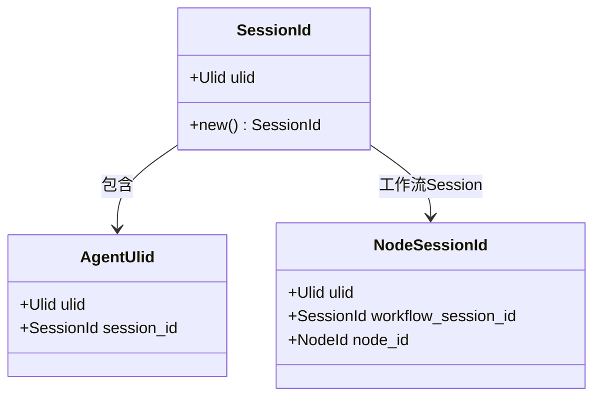
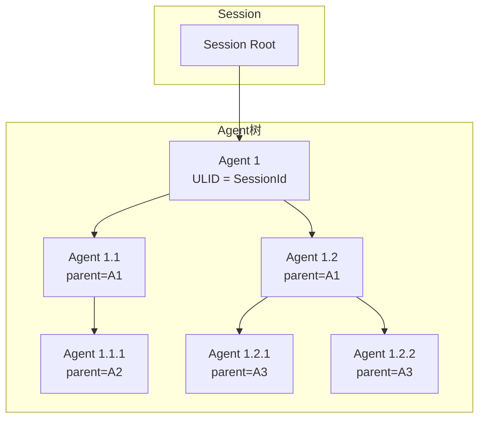

# TECH-SESSION: Session管理模块

本文档描述Neco项目的Session管理模块设计，包括Session生命周期、消息存储和上下文管理。

## 1. 模块概述

Session管理模块负责管理对话Session的生命周期、消息存储和Agent树形结构。它是整个系统的核心状态管理中心。

## 2. 核心概念

### 2.1 标识符体系



**标识符规则：**

| 标识符 | 生成时机 | 关系 | 用途 |
|-------|---------|------|------|
| SessionId | 创建Session时 | 顶级容器 | 标识整个对话或工作流 |
| AgentUlid | Agent实例化时 | 第一个=SessionId | 标识Agent实例 |
| NodeSessionId | 工作流节点启动时 | 归属Workflow Session | 标识工作流节点 |

### 2.2 Session类型

```rust
/// Session类型
pub enum SessionType {
    /// 直接模式：单次对话
    Direct {
        message: String,
    },
    /// REPL模式：交互式对话
    Repl,
    /// 工作流模式：结构化流程
    Workflow {
        workflow_def: WorkflowDef,
        current_node: Option<NodeId>,
    },
}
```

## 3. 数据结构设计

### 3.1 Session结构

```rust
/// Session是顶层容器
pub struct Session {
    /// Session唯一标识
    pub id: SessionId,
    
    /// Session类型
    pub session_type: SessionType,
    
    /// 根Agent（用户直接对话的Agent）
    pub root_agent: AgentUlid,
    
    /// 所有Agent的映射
    pub agents: HashMap<AgentUlid, Agent>,
    
    /// 消息ID分配器（Session范围内唯一）
    pub id_allocator: MessageIdAllocator,
    
    /// 创建时间
    pub created_at: DateTime<Utc>,
    
    /// 最后更新时间
    pub updated_at: DateTime<Utc>,
    
    /// 元数据
    pub metadata: SessionMetadata,
}

/// Session元数据
pub struct SessionMetadata {
    /// 用户标识
    pub user_id: Option<String>,
    /// 工作目录
    pub working_dir: PathBuf,
    /// 初始提示
    pub initial_prompt: Option<String>,
    /// 自定义数据
    pub custom_data: HashMap<String, Value>,
}

/// 消息ID分配器
pub struct MessageIdAllocator {
    counter: AtomicU64,
}

impl MessageIdAllocator {
    pub fn new() -> Self {
        Self {
            counter: AtomicU64::new(1),
        }
    }
    
    /// 获取下一个消息ID
    pub fn next_id(&self) -> u64 {
        self.counter.fetch_add(1, Ordering::SeqCst)
    }
}
```

### 3.2 Agent结构

```rust
/// Agent实例
pub struct Agent {
    /// Agent唯一标识
    pub ulid: AgentUlid,
    
    /// 上级Agent（None表示根Agent）
    pub parent_ulid: Option<AgentUlid>,
    
    /// 下级Agent列表
    pub children: Vec<AgentUlid>,
    
    /// Agent配置
    pub config: AgentConfig,
    
    /// 消息历史
    pub messages: Vec<Message>,
    
    /// Agent状态
    pub state: AgentState,
    
    /// 激活的工具列表
    pub active_tools: Vec<ToolId>,
    
    /// 激活的MCP服务器
    pub active_mcp_servers: Vec<String>,
    
    /// 激活的Skills
    pub active_skills: Vec<String>,
    
    /// 创建时间
    pub created_at: DateTime<Utc>,
    
    /// 最后活动时间
    pub last_activity: DateTime<Utc>,
}

/// Agent配置
pub struct AgentConfig {
    /// 使用的模型组
    pub model_group: String,
    /// 激活的提示词组件
    pub prompts: Vec<String>,
    /// Agent定义来源
    pub agent_def: Option<PathBuf>,
}

/// Agent状态
#[derive(Debug, Clone, Copy, PartialEq)]
pub enum AgentState {
    /// 空闲
    Idle,
    /// 运行中
    Running,
    /// 等待工具调用完成
    WaitingForTool,
    /// 等待用户输入
    WaitingForUser,
    /// 已完成
    Completed,
    /// 错误状态
    Error,
}
```

### 3.3 消息结构

```rust
/// 消息
#[derive(Debug, Clone, Serialize, Deserialize)]
pub struct Message {
    /// 消息ID（Session范围内唯一）
    pub id: u64,
    
    /// 角色
    pub role: Role,
    
    /// 内容
    pub content: String,
    
    /// 工具调用（Assistant角色时）
    #[serde(skip_serializing_if = "Option::is_none")]
    pub tool_calls: Option<Vec<ToolCall>>,
    
    /// 工具调用ID（Tool角色时）
    #[serde(skip_serializing_if = "Option::is_none")]
    pub tool_call_id: Option<String>,
    
    /// 时间戳
    pub timestamp: DateTime<Utc>,
    
    /// 元数据（如token使用量）
    #[serde(skip_serializing_if = "Option::is_none")]
    pub metadata: Option<MessageMetadata>,
}

/// 角色
#[derive(Debug, Clone, Copy, PartialEq, Serialize, Deserialize)]
#[serde(rename_all = "lowercase")]
pub enum Role {
    System,
    User,
    Assistant,
    Tool,
}

/// 消息元数据
#[derive(Debug, Clone, Serialize, Deserialize)]
pub struct MessageMetadata {
    pub prompt_tokens: u32,
    pub completion_tokens: u32,
    pub total_tokens: u32,
}
```

## 4. Agent树结构

### 4.1 树形关系



### 4.2 Agent关系管理

```rust
impl Session {
    /// 创建根Agent
    pub fn create_root_agent(
        &mut self,
        config: AgentConfig,
    ) -> Result<AgentUlid, SessionError> {
        let ulid = AgentUlid {
            ulid: self.id.ulid,
            session_id: self.id.clone(),
        };
        
        let agent = Agent {
            ulid: ulid.clone(),
            parent_ulid: None,
            children: Vec::new(),
            config,
            messages: Vec::new(),
            state: AgentState::Idle,
            active_tools: Vec::new(),
            active_mcp_servers: Vec::new(),
            active_skills: Vec::new(),
            created_at: Utc::now(),
            last_activity: Utc::now(),
        };
        
        self.agents.insert(ulid.clone(), agent);
        self.root_agent = ulid.clone();
        
        Ok(ulid)
    }
    
    /// 创建子Agent
    pub fn spawn_child_agent(
        &mut self,
        parent_ulid: AgentUlid,
        config: AgentConfig,
    ) -> Result<AgentUlid, SessionError> {
        // 验证父Agent存在
        let parent = self.agents.get(&parent_ulid)
            .ok_or(SessionError::AgentNotFound)?;
        
        // 生成新的ULID
        let ulid = AgentUlid {
            ulid: Ulid::new(),
            session_id: self.id.clone(),
        };
        
        let agent = Agent {
            ulid: ulid.clone(),
            parent_ulid: Some(parent_ulid.clone()),
            children: Vec::new(),
            config,
            messages: Vec::new(),
            state: AgentState::Idle,
            active_tools: Vec::new(),
            active_mcp_servers: Vec::new(),
            active_skills: Vec::new(),
            created_at: Utc::now(),
            last_activity: Utc::now(),
        };
        
        // 添加到父Agent的children列表
        self.agents.get_mut(&parent_ulid).unwrap()
            .children.push(ulid.clone());
        
        // 插入新Agent
        self.agents.insert(ulid.clone(), agent);
        
        Ok(ulid)
    }
    
    /// 获取Agent的所有祖先
    pub fn get_ancestors(
        &self,
        ulid: &AgentUlid,
    ) -> Vec<AgentUlid> {
        let mut ancestors = Vec::new();
        let mut current = ulid;
        
        while let Some(agent) = self.agents.get(current) {
            if let Some(parent) = &agent.parent_ulid {
                ancestors.push(parent.clone());
                current = parent;
            } else {
                break;
            }
        }
        
        ancestors
    }
    
    /// 获取Agent的所有后代（递归）
    pub fn get_descendants(
        &self,
        ulid: &AgentUlid,
    ) -> Vec<AgentUlid> {
        let mut descendants = Vec::new();
        let mut stack = vec![ulid.clone()];
        
        while let Some(current) = stack.pop() {
            if let Some(agent) = self.agents.get(&current) {
                for child in &agent.children {
                    descendants.push(child.clone());
                    stack.push(child.clone());
                }
            }
        }
        
        descendants
    }
}
```

## 5. 存储设计

### 5.1 文件存储结构

```
~/.local/neco/
└── {session_id}/                    # Session目录
    ├── session.toml                 # Session元数据
    ├── {agent_ulid}.toml           # Agent消息文件
    └── workflow_state.toml         # 工作流状态（如果是工作流）
```

### 5.2 TOML文件格式

**Session元数据文件（session.toml）：**

```toml
[session]
id = "01HF8X5JQC8ZXJ3YKZ0J9K2D9Z"
type = "workflow"  # direct, repl, workflow
created_at = "2026-03-04T10:00:00Z"
updated_at = "2026-03-04T10:30:00Z"
root_agent = "01HF8X5JQC8ZXJ3YKZ0J9K2D9Z"

[metadata]
user_id = "user123"
working_dir = "/home/user/projects"

[workflow]
workflow_id = "prd"
current_node = "write-prd"

[[agents]]
ulid = "01HF8X5JQC8ZXJ3YKZ0J9K2D9Z"
parent = null
state = "running"
last_activity = "2026-03-04T10:25:00Z"

[[agents]]
ulid = "01HF8X5JQC8ZXJ3YKZ0J9K2E0A"
parent = "01HF8X5JQC8ZXJ3YKZ0J9K2D9Z"
state = "idle"
last_activity = "2026-03-04T10:20:00Z"
```

**Agent消息文件（{agent_ulid}.toml）：**

```toml
# Agent配置
[config]
model_group = "smart"
prompts = ["base", "multi-agent"]

# 层级关系
parent_ulid = "01HF8X5JQC8ZXJ3YKZ0J9K2D9Z"  # 可选，根Agent省略

# 激活的工具/MCP/Skills
[active]
tools = ["fs::read", "fs::write"]
mcp_servers = ["context7"]
skills = []

# 消息列表
[[messages]]
id = 1
role = "system"
content = "你是一个 helpful assistant。"
timestamp = "2026-03-04T10:00:00Z"

[[messages]]
id = 2
role = "user"
content = "帮我读取文件 README.md"
timestamp = "2026-03-04T10:01:00Z"

[[messages]]
id = 3
role = "assistant"
content = null
timestamp = "2026-03-04T10:01:05Z"

[[messages.tool_calls]]
id = "call_1"
type = "function"

[messages.tool_calls.function]
name = "fs::read"
arguments = '{"path": "README.md"}'

[[messages]]
id = 4
role = "tool"
content = "# Project README\n..."
tool_call_id = "call_1"
timestamp = "2026-03-04T10:01:06Z"

[[messages]]
id = 5
role = "assistant"
content = "README.md 的内容是：..."
timestamp = "2026-03-04T10:01:10Z"

[messages.metadata]
prompt_tokens = 100
completion_tokens = 50
total_tokens = 150
```

### 5.3 存储后端Trait

```rust
/// 存储后端接口
#[async_trait]
pub trait StorageBackend: Send + Sync {
    /// 保存Session元数据
    async fn save_session_meta(
        &self,
        session: &Session,
    ) -> Result<(), StorageError>;
    
    /// 加载Session元数据
    async fn load_session_meta(
        &self,
        session_id: SessionId,
    ) -> Result<SessionMeta, StorageError>;
    
    /// 保存Agent数据
    async fn save_agent(
        &self,
        agent: &Agent,
    ) -> Result<(), StorageError>;
    
    /// 加载Agent数据
    async fn load_agent(
        &self,
        ulid: AgentUlid,
    ) -> Result<Agent, StorageError>;
    
    /// 追加消息到Agent
    async fn append_message(
        &self,
        ulid: AgentUlid,
        message: &Message,
    ) -> Result<(), StorageError>;
    
    /// 列出Session中的所有Agent
    async fn list_agents(
        &self,
        session_id: SessionId,
    ) -> Result<Vec<AgentUlid>, StorageError>;
    
    /// 删除Session
    async fn delete_session(
        &self,
        session_id: SessionId,
    ) -> Result<(), StorageError>;
}

/// 文件系统存储实现
pub struct FileStorage {
    base_dir: PathBuf,
}

impl FileStorage {
    pub fn new(base_dir: PathBuf) -> Self {
        Self { base_dir }
    }
    
    fn session_dir(&self, session_id: &SessionId) -> PathBuf {
        self.base_dir.join(session_id.to_string())
    }
    
    fn agent_file(&self, ulid: &AgentUlid) -> PathBuf {
        self.session_dir(&ulid.session_id)
            .join(format!("{}.toml", ulid.ulid))
    }
}

#[async_trait]
impl StorageBackend for FileStorage {
    async fn save_session_meta(
        &self,
        session: &Session,
    ) -> Result<(), StorageError> {
        let dir = self.session_dir(&session.id);
        fs::create_dir_all(&dir).await?;
        
        let meta = SessionMeta::from(session);
        let toml = toml::to_string_pretty(&meta)?;
        fs::write(dir.join("session.toml"), toml).await?;
        
        Ok(())
    }
    
    async fn save_agent(
        &self,
        agent: &Agent,
    ) -> Result<(), StorageError> {
        let path = self.agent_file(&agent.ulid);
        fs::create_dir_all(path.parent().unwrap()).await?;
        
        let agent_data = AgentData::from(agent);
        let toml = toml::to_string_pretty(&agent_data)?;
        fs::write(path, toml).await?;
        
        Ok(())
    }
    
    // ... 其他方法实现
}
```

## 6. Session生命周期

### 6.1 创建Session

```rust
impl SessionManager {
    /// 创建新Session
    pub async fn create_session(
        &self,
        session_type: SessionType,
        root_agent_config: AgentConfig,
    ) -> Result<Session, SessionError> {
        let session_id = SessionId::new();
        
        // 创建Session
        let mut session = Session {
            id: session_id.clone(),
            session_type,
            root_agent: AgentUlid {
                ulid: session_id.ulid,
                session_id: session_id.clone(),
            },
            agents: HashMap::new(),
            id_allocator: MessageIdAllocator::new(),
            created_at: Utc::now(),
            updated_at: Utc::now(),
            metadata: SessionMetadata {
                user_id: None,
                working_dir: std::env::current_dir()?,
                initial_prompt: None,
                custom_data: HashMap::new(),
            },
        };
        
        // 创建根Agent
        session.create_root_agent(root_agent_config)?;
        
        // 保存到存储
        self.storage.save_session_meta(&session).await?;
        
        // 添加到内存缓存
        self.cache.insert(session_id, session.clone());
        
        Ok(session)
    }
}
```

### 6.2 恢复Session

```rust
impl SessionManager {
    /// 加载已有Session
    pub async fn load_session(
        &self,
        session_id: SessionId,
    ) -> Result<Session, SessionError> {
        // 先检查缓存
        if let Some(session) = self.cache.get(&session_id) {
            return Ok(session.clone());
        }
        
        // 从存储加载
        let meta = self.storage.load_session_meta(session_id.clone()).await?;
        let agent_ulids = self.storage.list_agents(session_id.clone()).await?;
        
        let mut session = Session {
            id: session_id.clone(),
            session_type: meta.session_type,
            root_agent: meta.root_agent,
            agents: HashMap::new(),
            id_allocator: MessageIdAllocator::with_start(
                meta.next_message_id
            ),
            created_at: meta.created_at,
            updated_at: meta.updated_at,
            metadata: meta.metadata,
        };
        
        // 加载所有Agent
        for ulid in agent_ulids {
            let agent = self.storage.load_agent(ulid).await?;
            session.agents.insert(agent.ulid.clone(), agent);
        }
        
        // 添加到缓存
        self.cache.insert(session_id, session.clone());
        
        Ok(session)
    }
}
```

### 6.3 消息处理流程

```rust
impl Session {
    /// 添加消息到Agent
    pub async fn add_message(
        &mut self,
        ulid: AgentUlid,
        role: Role,
        content: String,
        tool_calls: Option<Vec<ToolCall>>,
        tool_call_id: Option<String>,
    ) -> Result<u64, SessionError> {
        let agent = self.agents.get_mut(&ulid)
            .ok_or(SessionError::AgentNotFound)?;
        
        let message_id = self.id_allocator.next_id();
        
        let message = Message {
            id: message_id,
            role,
            content,
            tool_calls,
            tool_call_id,
            timestamp: Utc::now(),
            metadata: None,
        };
        
        agent.messages.push(message.clone());
        agent.last_activity = Utc::now();
        
        // 异步保存到存储
        self.storage.append_message(ulid, &message).await?;
        
        self.updated_at = Utc::now();
        
        Ok(message_id)
    }
    
    /// 获取Agent的完整消息历史
    pub fn get_message_history(
        &self,
        ulid: AgentUlid,
        up_to_id: Option<u64>,
    ) -> Result<Vec<&Message>, SessionError> {
        let agent = self.agents.get(&ulid)
            .ok_or(SessionError::AgentNotFound)?;
        
        let messages: Vec<_> = match up_to_id {
            Some(max_id) => agent.messages
                .iter()
                .filter(|m| m.id <= max_id)
                .collect(),
            None => agent.messages.iter().collect(),
        };
        
        Ok(messages)
    }
    
    /// 回溯到指定消息ID（删除之后的所有消息）
    pub async fn rewind_to(
        &mut self,
        ulid: AgentUlid,
        message_id: u64,
    ) -> Result<(), SessionError> {
        let agent = self.agents.get_mut(&ulid)
            .ok_or(SessionError::AgentNotFound)?;
        
        // 保留id <= message_id的消息
        agent.messages.retain(|m| m.id <= message_id);
        
        // 重新保存整个Agent（因为需要删除文件中的消息）
        self.storage.save_agent(agent).await?;
        
        Ok(())
    }
}
```

## 7. 上下文管理

### 7.1 上下文组装

```rust
/// 上下文构建器
pub struct ContextBuilder {
    system_messages: Vec<String>,
    conversation: Vec<Message>,
    active_tools: Vec<Tool>,
}

impl ContextBuilder {
    pub fn new() -> Self {
        Self {
            system_messages: Vec::new(),
            conversation: Vec::new(),
            active_tools: Vec::new(),
        }
    }
    
    /// 添加系统提示
    pub fn add_system_prompt(&mut self,
        prompt: &str,
    ) -> &mut Self {
        self.system_messages.push(prompt.to_string());
        self
    }
    
    /// 添加Agent消息历史
    pub fn with_agent_history(
        &mut self,
        agent: &Agent,
    ) -> &mut Self {
        self.conversation.extend(agent.messages.clone());
        self
    }
    
    /// 添加激活的工具
    pub fn with_active_tools(
        &mut self,
        tools: Vec<Tool>,
    ) -> &mut Self {
        self.active_tools = tools;
        self
    }
    
    /// 构建最终上下文
    pub fn build(self) -> ChatRequest {
        let mut messages = Vec::new();
        
        // 1. 系统消息
        if !self.system_messages.is_empty() {
            messages.push(Message {
                role: Role::System,
                content: Some(self.system_messages.join("\n\n")),
                tool_calls: None,
                tool_call_id: None,
                timestamp: Utc::now(),
                metadata: None,
            });
        }
        
        // 2. 对话历史
        messages.extend(self.conversation);
        
        ChatRequest {
            model: String::new(), // 由调用者填充
            messages,
            stream: false,
            temperature: None,
            max_tokens: None,
            tools: if self.active_tools.is_empty() {
                None
            } else {
                Some(self.active_tools)
            },
            tool_choice: None,
            response_format: None,
            stop: None,
            extra_params: HashMap::new(),
        }
    }
}
```

## 8. 错误处理

```rust
#[derive(Debug, Error)]
pub enum SessionError {
    #[error("Agent未找到: {0}")]
    AgentNotFound,
    
    #[error("Session未找到: {0}")]
    SessionNotFound(SessionId),
    
    #[error("存储错误: {0}")]
    Storage(#[from] StorageError),
    
    #[error("IO错误: {0}")]
    Io(#[from] std::io::Error),
    
    #[error("序列化错误: {0}")]
    Serialization(#[from] toml::ser::Error),
    
    #[error("反序列化错误: {0}")]
    Deserialization(#[from] toml::de::Error),
    
    #[error("无效的Agent关系")]
    InvalidAgentRelation,
    
    #[error("消息ID冲突")]
    MessageIdConflict,
}

#[derive(Debug, Error)]
pub enum StorageError {
    #[error("IO错误: {0}")]
    Io(#[from] std::io::Error),
    
    #[error("序列化错误: {0}")]
    Serialization(String),
    
    #[error("文件损坏: {0}")]
    CorruptedFile(PathBuf),
}
```

---

*关联文档：*
- [TECH.md](TECH.md) - 总体架构文档
- [TECH-MODEL.md](TECH-MODEL.md) - 模型服务模块
- [TECH-AGENT.md](TECH-AGENT.md) - 多智能体协作模块
