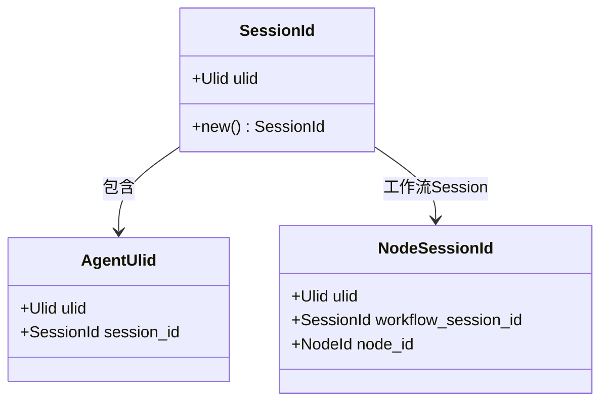
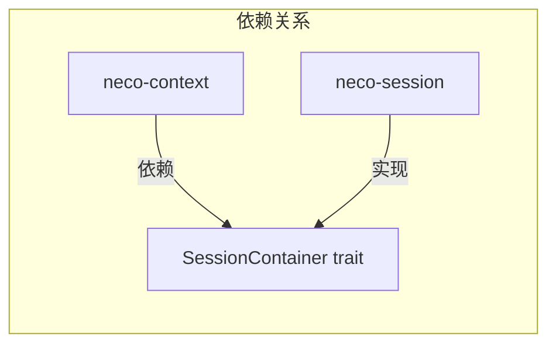
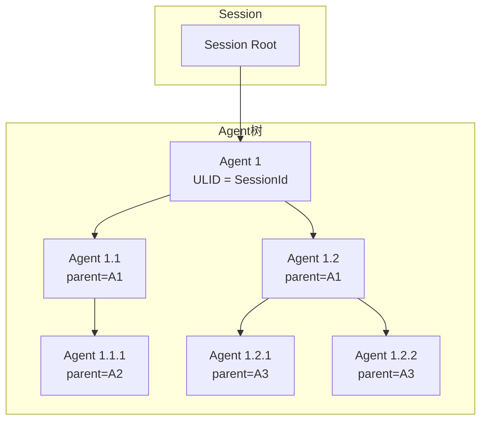
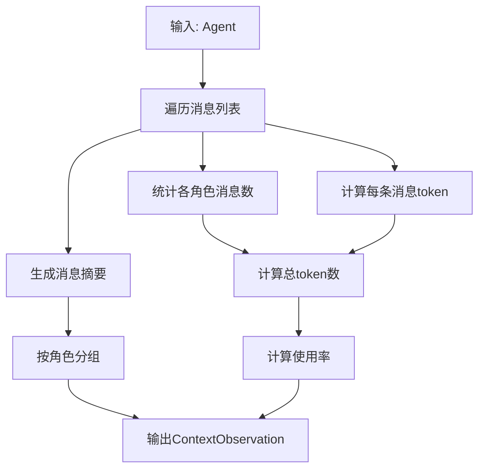
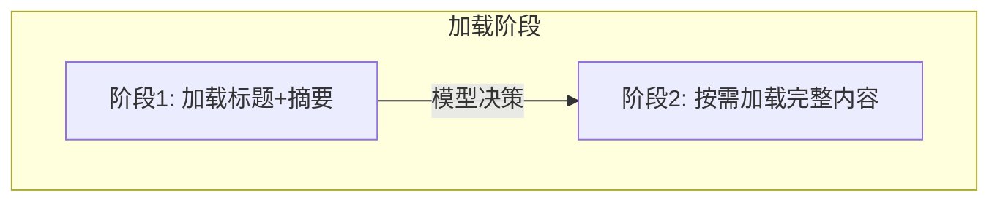

# TECH-SESSION: Session管理模块

本文档描述Neco项目的Session管理模块设计，包括Session生命周期、消息存储和上下文管理。

## 1. 模块概述

Session管理模块负责管理对话Session的生命周期、消息存储和Agent树形结构。它是整个系统的核心状态管理中心。

## 2. 核心概念

### 2.1 标识符体系



**标识符规则：**

| 标识符 | 生成时机 | 关系 | 用途 |
|-------|---------|------|------|
| SessionId | 创建Session时 | 顶级容器 | 标识整个对话或工作流 |
| AgentUlid | Agent实例化时 | 归属于SessionId | 标识Agent实例 |
| NodeSessionId | 工作流节点启动时 | 归属Workflow Session | 标识工作流节点 |

### 2.2 依赖反转接口（SessionContainer）

> 为解决 `session → agent → context → session` 的循环依赖问题，在 `neco-core` 中定义抽象接口：



**SessionContainer 接口定义：**

```rust
/// Session容器接口 - 用于依赖反转
/// 
/// neco-context 依赖此 trait，neco-session 实现此 trait
/// 运行时通过依赖注入传递具体实现
#[async_trait]
pub trait SessionContainer: Send + Sync {
    /// 获取Session ID
    fn session_id(&self) -> &SessionId;
    
    /// 获取根Agent ID
    fn root_agent_id(&self) -> Option<&AgentUlid>;
    
    /// 获取Agent数量
    fn agent_count(&self) -> usize;
    
    /// 获取消息数量
    fn message_count(&self) -> usize;
    
    /// 获取所有消息
    fn get_messages(&self) -> Vec<Message>;
    
    /// 获取指定Agent
    fn get_agent(&self, ulid: &AgentUlid) -> Option<Agent>;
    
    /// 添加消息
    async fn add_message(&self, message: Message) -> Result<MessageId, SessionError>;
}
```

**依赖反转说明：**
- `neco-context` 依赖 `neco-core::SessionContainer` trait
- `neco-session` 实现 `SessionContainer` trait
- 运行时通过依赖注入传递具体实现

### 2.3 Session类型

```rust
/// Session类型
pub enum SessionType {
    /// 直接模式：单次对话
    Direct {
        message: String,
    },
    /// REPL模式：交互式对话
    Repl,
    /// 工作流模式：结构化流程
    Workflow {
        workflow_def: WorkflowDef,
        current_node: Option<NodeId>,
    },
}
```

## 3. 数据结构设计

### 3.1 Session结构

```rust
/// Session是顶层容器
pub struct Session {
    /// Session唯一标识
    pub id: SessionId,
    
    /// Session类型
    pub session_type: SessionType,
    
    /// 根Agent（用户直接对话的Agent）
    pub root_agent: AgentUlid,
    
    /// 所有Agent的映射
    pub agents: HashMap<AgentUlid, Agent>,
    
    /// 消息ID分配器（Session范围内唯一）
    pub id_allocator: MessageIdAllocator,
    
    /// 创建时间
    pub created_at: DateTime<Utc>,
    
    /// 最后更新时间
    pub updated_at: DateTime<Utc>,
    
    /// 元数据
    pub metadata: SessionMetadata,
    
    /// 存储后端（用于持久化）
    #[doc(hidden)]
    pub storage: Arc<dyn StorageBackend>,
}

/// 用户自定义的Session元数据（业务层）
pub struct SessionMetadata {
    /// 用户标识
    pub user_id: Option<String>,
    /// 工作目录
    pub working_dir: PathBuf,
    /// 初始提示
    pub initial_prompt: Option<String>,
    /// 自定义数据
    pub custom_data: HashMap<String, Value>,
}

/// Session的基本信息（存储层使用）
pub struct SessionMeta {
    /// Session类型
    pub session_type: SessionType,
    /// 根Agent ULID
    pub root_agent: AgentUlid,
    /// 下一个消息ID
    pub next_message_id: u64,
    /// 创建时间
    pub created_at: DateTime<Utc>,
    /// 最后更新时间
    pub updated_at: DateTime<Utc>,
    /// 用户自定义元数据
    pub metadata: SessionMetadata,
}

use std::sync::atomic::{AtomicU64, Ordering};

/// 消息ID分配器
pub struct MessageIdAllocator {
    counter: AtomicU64,
}

impl MessageIdAllocator {
    pub fn new(initial: u64) -> Self {
        Self {
            counter: AtomicU64::new(initial),
        }
    }
    
    /// 获取下一个消息ID
    /// 
    /// 使用 fetch_update 实现原子检查+递增，避免 TOCTOU 并发漏洞
    /// 返回 None 表示 ID 已溢出
    pub fn next_id(&self) -> Option<u64> {
        self.counter
            .fetch_update(Ordering::SeqCst, Ordering::SeqCst, |current| {
                if current >= u64::MAX {
                    None
                } else {
                    Some(current + 1)
                }
            })
            .ok()
    }
}
```

### 3.2 Agent结构

```rust
/// Agent实例标识符
#[derive(Debug, Clone, PartialEq, Eq, Hash, Serialize, Deserialize)]
pub struct McpServerId(String);

/// Skill标识符
#[derive(Debug, Clone, PartialEq, Eq, Hash, Serialize, Deserialize)]
pub struct SkillId(String);

/// 工具标识符
#[derive(Debug, Clone, PartialEq, Eq, Hash, Serialize, Deserialize)]
pub struct ToolId(String);

/// Agent实例
pub struct Agent {
    /// Agent唯一标识
    pub ulid: AgentUlid,
    
    /// 上级Agent（None表示根Agent）
    pub parent_ulid: Option<AgentUlid>,
    
    /// 下级Agent列表
    pub children: Vec<AgentUlid>,
    
    /// Agent配置
    pub config: AgentConfig,
    
    /// 消息历史
    pub messages: Vec<Message>,
    
    /// Agent状态
    pub state: AgentState,
    
    /// 激活的工具列表
    pub active_tools: Vec<ToolId>,
    
    /// 激活的MCP服务器
    pub active_mcp_servers: Vec<McpServerId>,
    
    /// 激活的Skills
    pub active_skills: Vec<SkillId>,
    
    /// 创建时间
    pub created_at: DateTime<Utc>,
    
    /// 最后活动时间
    pub last_activity: DateTime<Utc>,
}

/// Agent配置
pub struct AgentConfig {
    /// 使用的模型组
    pub model_group: String,
    /// 激活的提示词组件
    pub prompts: Vec<String>,
    /// Agent定义来源
    pub agent_def: Option<PathBuf>,
}

/// Agent状态
#[derive(Debug, Clone, PartialEq)]
pub enum AgentState {
    /// 空闲
    Idle,
    /// 运行中
    Running,
    /// 等待工具调用完成
    WaitingForTool,
    /// 等待用户输入
    WaitingForUser,
    /// 已完成
    Completed,
    /// 错误状态
    Error(String),
}
```

### 3.3 消息结构

```rust
/// 消息
#[derive(Debug, Clone, Serialize, Deserialize)]
pub struct Message {
    /// 消息ID（Session范围内唯一）
    pub id: u64,
    
    /// 角色
    pub role: Role,
    
    /// 内容
    pub content: String,
    
    /// 工具调用（Assistant角色时）
    #[serde(skip_serializing_if = "Option::is_none")]
    pub tool_calls: Option<Vec<ToolCall>>,
    
    /// 工具调用ID（Tool角色时）
    #[serde(skip_serializing_if = "Option::is_none")]
    pub tool_call_id: Option<String>,
    
    /// 时间戳
    pub timestamp: DateTime<Utc>,
    
    /// 元数据（如token使用量）
    #[serde(skip_serializing_if = "Option::is_none")]
    pub metadata: Option<MessageMetadata>,
}

/// 角色
#[derive(Debug, Clone, Copy, PartialEq, Eq, Hash, Serialize, Deserialize)]
#[serde(rename_all = "lowercase")]
pub enum Role {
    System,
    User,
    Assistant,
    Tool,
}

/// 消息元数据
#[derive(Debug, Clone, Serialize, Deserialize)]
pub struct MessageMetadata {
    pub prompt_tokens: u32,
    pub completion_tokens: u32,
    pub total_tokens: u32,
}
```

## 4. Agent树结构

### 4.1 树形关系



### 4.2 Agent关系管理

```rust
impl Session {
    /// 创建根Agent
    pub fn create_root_agent(
        &mut self,
        config: AgentConfig,
    ) -> Result<AgentUlid, SessionError> {
        // TODO: 创建根Agent实现
        // 1. 生成AgentUlid（使用SessionId的ULID）
        // 2. 创建Agent实例，设置parent_ulid为None
        // 3. 初始化Agent状态为Idle
        // 4. 将Agent添加到agents HashMap中
        // 5. 设置root_agent为新创建的AgentUlid
        // 6. 返回AgentUlid
        unimplemented!()
    }
    
    /// 创建子Agent
    pub fn spawn_child_agent(
        &mut self,
        parent_ulid: AgentUlid,
        config: AgentConfig,
    ) -> Result<AgentUlid, SessionError> {
        // 1. 验证父Agent存在
        let parent = self.agents.get(&parent_ulid)
            .ok_or_else(|| SessionError::AgentNotFound(parent_ulid.clone()))?;
        
        // 2. 验证父Agent状态允许创建子Agent（不能是Error或Completed状态）
        match parent.state {
            AgentState::Error(_) | AgentState::Completed => {
                return Err(SessionError::InvalidAgentRelation {
                    subject: parent_ulid.clone(),
                    object: parent_ulid,
                    reason: "Cannot spawn child from agent in Error or Completed state".to_string(),
                });
            }
            _ => {}
        }
        
        // 3. 验证父Agent属于当前Session（通过SessionId匹配）
        if parent_ulid.session_id() != self.id {
            return Err(SessionError::InvalidAgentRelation {
                subject: parent_ulid.clone(),
                object: self.id.clone().into(),
                reason: "Parent agent belongs to a different session".to_string(),
            });
        }
        
        // 4. 生成子Agent的ULID
        let child_ulid = AgentUlid::new(&self.id);
        
        // 5. 创建Agent实例，设置parent_ulid
        let child_agent = Agent {
            ulid: child_ulid.clone(),
            parent_ulid: Some(parent_ulid.clone()),
            children: Vec::new(),
            config,
            messages: Vec::new(),
            state: AgentState::Idle,
            active_tools: Vec::new(),
            active_mcp_servers: Vec::new(),
            active_skills: Vec::new(),
            created_at: Utc::now(),
            last_activity: Utc::now(),
        };
        
        // 6. 将新Agent添加到父Agent的children列表
        if let Some(parent) = self.agents.get_mut(&parent_ulid) {
            parent.children.push(child_ulid.clone());
        }
        
        // 7. 插入新Agent到agents HashMap
        self.agents.insert(child_ulid.clone(), child_agent);
        
        // 8. 返回新AgentUlid
        Ok(child_ulid)
    }
    
    /// 获取Agent的所有祖先
    pub fn get_ancestors(
        &self,
        ulid: &AgentUlid,
    ) -> Vec<AgentUlid> {
        // TODO: 获取Agent的所有祖先
        // 1. 从当前Agent开始向上遍历parent_ulid
        // 2. 收集所有祖先AgentUlid直到根Agent
        // 3. 返回祖先列表
        unimplemented!()
    }
    
    /// 获取Agent的所有后代（递归）
    pub fn get_descendants(
        &self,
        ulid: &AgentUlid,
    ) -> Vec<AgentUlid> {
        // TODO: 获取Agent的所有后代（递归）
        // 1. 使用DFS或BFS遍历子树
        // 2. 收集所有后代AgentUlid
        // 3. 返回后代列表
        unimplemented!()
    }
}
```

## 5. 存储设计

### 5.1 文件存储结构

```
~/.local/neco/
└── {session_id}/                    # Session目录
    ├── session.toml                 # Session元数据
    ├── {agent_ulid}.toml           # Agent消息文件
    └── workflow_state.toml         # 工作流状态（如果是工作流）
```

### 5.2 TOML文件格式

**Session元数据文件（session.toml）：**

```toml
[session]
id = "01HF8X5JQC8ZXJ3YKZ0J9K2D9Z"
type = "workflow"  # direct, repl, workflow
created_at = "2026-03-04T10:00:00Z"
updated_at = "2026-03-04T10:30:00Z"
root_agent = "01HF8X5JQC8ZXJ3YKZ0J9K2D9Z"

[metadata]
user_id = "user123"
working_dir = "/home/user/projects"

[workflow]
workflow_id = "prd"
current_node = "write-prd"

[[agents]]
ulid = "01HF8X5JQC8ZXJ3YKZ0J9K2D9Z"
parent = null
state = "running"
last_activity = "2026-03-04T10:25:00Z"

[[agents]]
ulid = "01HF8X5JQC8ZXJ3YKZ0J9K2E0A"
parent = "01HF8X5JQC8ZXJ3YKZ0J9K2D9Z"
state = "idle"
last_activity = "2026-03-04T10:20:00Z"
```

**Agent消息文件（{agent_ulid}.toml）：**

```toml
# Agent配置
[config]
model_group = "smart"
prompts = ["base", "multi-agent"]

# 层级关系
parent_ulid = "01HF8X5JQC8ZXJ3YKZ0J9K2D9Z"  # 可选，根Agent省略

# 激活的工具/MCP/Skills
[active]
tools = ["fs::read", "fs::write"]
mcp_servers = ["context7"]
skills = []

# 消息列表
[[messages]]
id = 1
role = "system"
content = "你是一个 helpful assistant。"
timestamp = "2026-03-04T10:00:00Z"

[[messages]]
id = 2
role = "user"
content = "帮我读取文件 README.md"
timestamp = "2026-03-04T10:01:00Z"

[[messages]]
id = 3
role = "assistant"
content = null
timestamp = "2026-03-04T10:01:05Z"

[[messages.tool_calls]]
id = "call_1"
type = "function"

[messages.tool_calls.function]
name = "fs::read"
arguments = '{"path": "README.md"}'

[[messages]]
id = 4
role = "tool"
content = "# Project README\n..."
tool_call_id = "call_1"
timestamp = "2026-03-04T10:01:06Z"

[[messages]]
id = 5
role = "assistant"
content = "README.md 的内容是：..."
timestamp = "2026-03-04T10:01:10Z"

[messages.metadata]
prompt_tokens = 100
completion_tokens = 50
total_tokens = 150
```

### 5.3 存储后端Trait

```rust
use std::sync::Arc;
use tokio::sync::RwLock;

/// 存储后端接口
/// 
/// **锁定语义：**
/// - `append_message` 使用 RwLock 保护并发写入，多个读取可以并发，但写入需要独占访问
/// - 事务方法 (`begin_transaction`, `commit`, `rollback`) 提供原子性操作保证
/// - 建议在高层使用锁来保护整个 Session 的一致性
#[async_trait]
pub trait StorageBackend: Send + Sync {
    /// 保存Session元数据
    async fn save_session_meta(
        &self,
        session: &Session,
    ) -> Result<(), StorageError>;
    
    /// 加载Session元数据
    async fn load_session_meta(
        &self,
        session_id: SessionId,
    ) -> Result<SessionMeta, StorageError>;
    
    /// 保存Agent数据
    async fn save_agent(
        &self,
        agent: &Agent,
    ) -> Result<(), StorageError>;
    
    /// 加载Agent数据
    async fn load_agent(
        &self,
        ulid: AgentUlid,
    ) -> Result<Agent, StorageError>;
    
    /// 追加消息到Agent（使用 RwLock 进行并发控制）
    /// 
    /// 多个读取可以并发执行，写入会获取独占锁
    async fn append_message(
        &self,
        ulid: AgentUlid,
        message: &Message,
    ) -> Result<(), StorageError>;
    
    /// 列出Session中的所有Agent
    async fn list_agents(
        &self,
        session_id: SessionId,
    ) -> Result<Vec<AgentUlid>, StorageError>;
    
    /// 删除Session
    async fn delete_session(
        &self,
        session_id: SessionId,
    ) -> Result<(), StorageError>;
    
    /// 开始事务（用于原子性操作）
    async fn begin_transaction(
        &self,
        session_id: SessionId,
    ) -> Result<(), StorageError>;
    
    /// 提交事务
    async fn commit(
        &self,
        session_id: SessionId,
    ) -> Result<(), StorageError>;
    
    /// 回滚事务
    async fn rollback(
        &self,
        session_id: SessionId,
    ) -> Result<(), StorageError>;
}

/// 文件系统存储实现
pub struct FileStorage {
    base_dir: PathBuf,
    /// 事务锁：保护并发写入
    transaction_lock: Arc<RwLock<()>>,
}

impl FileStorage {
    pub fn new(base_dir: PathBuf) -> Result<Self, StorageError> {
        // 1. 验证目录存在
        if !base_dir.exists() {
            return Err(StorageError::Io(std::io::Error::new(
                std::io::ErrorKind::NotFound,
                format!("Base directory does not exist: {}", base_dir.display()),
            )));
        }
        
        // 2. 验证目录可写（尝试创建临时文件测试）
        let test_file = base_dir.join(".write_test");
        std::fs::write(&test_file, "test")?;
        std::fs::remove_file(test_file)?;
        
        // 3. 设置base_dir
        Ok(Self {
            base_dir,
            transaction_lock: Arc::new(RwLock::new(())),
        })
    }
    
    fn session_dir(&self, session_id: &SessionId) -> PathBuf {
        // 1. 组合base_dir和session_id字符串
        // 2. 返回完整路径
        self.base_dir.join(session_id.to_string())
    }
    
    fn agent_file(&self, ulid: &AgentUlid) -> PathBuf {
        // 1. 获取session_dir
        let session_dir = self.session_dir(ulid.session_id());
        // 2. 组合ulid字符串和".toml"后缀
        // 3. 返回完整路径
        session_dir.join(format!("{}.toml", ulid))
    }
}

#[async_trait]
impl StorageBackend for FileStorage {
    async fn save_session_meta(
        &self,
        session: &Session,
    ) -> Result<(), StorageError> {
        // TODO: 保存Session元数据
        // 1. 创建Session目录
        // 2. 将Session序列化为SessionMeta
        // 3. 序列化为TOML格式
        // 4. 写入session.toml文件
        unimplemented!()
    }
    
    async fn save_agent(
        &self,
        agent: &Agent,
    ) -> Result<(), StorageError> {
        // TODO: 保存Agent数据
        // 1. 创建Agent目录（如果不存在）
        // 2. 将Agent序列化为AgentData
        // 3. 序列化为TOML格式
        // 4. 写入Agent TOML文件
        unimplemented!()
    }
    
    // TODO: 实现其他StorageBackend方法
}
```

## 6. Session生命周期

### 6.1 创建Session

```rust
impl SessionManager {
    /// 创建新Session
    pub async fn create_session(
        &self,
        session_type: SessionType,
        root_agent_config: AgentConfig,
    ) -> Result<Session, SessionError> {
        // TODO: 创建新Session实现
        // 1. 生成SessionId
        // 2. 创建Session实例，初始化字段
        // 3. 创建根Agent并添加到Session
        // 4. 保存Session元数据到存储
        // 5. 添加到内存缓存
        // 6. 返回Session
        unimplemented!()
    }
}
```

### 6.2 恢复Session

```rust
use std::collections::{HashMap, VecDeque};

/// Session管理器
pub struct SessionManager {
    sessions: HashMap<SessionId, Arc<RwLock<Session>>>,
    storage: Arc<dyn StorageBackend>,
    /// Agent LRU缓存：用于懒加载，缓存最近访问的Agent
    agent_cache: Arc<RwLock<LruCache<AgentUlid, Agent>>>,
    max_agent_cache_size: usize,
}

/// LRU缓存实现（使用VecDeque优化性能）
/// 
/// **策略说明：**
/// - `push_front` 添加最新条目（队首为最新）
/// - `pop_back` 移除最旧条目（队尾为最旧）
/// - 新条目在队首，最旧条目在队尾，驱逐时从队尾移除
pub struct LruCache<K, V> {
    cache: VecDeque<(K, V)>,
    capacity: usize,
}

impl SessionManager {
    /// 加载已有Session
    /// 
    /// **懒加载策略：**
    /// 1. 先检查内存缓存
    /// 2. 如果缓存不存在，从存储加载Session元数据
    /// 3. 获取Session中的所有Agent列表（不立即加载所有Agent数据）
    /// 4. 创建Session实例，初始化字段
    /// 5. 添加到内存缓存
    /// 6. 返回Session（Agent数据在首次访问时按需加载）
    pub async fn load_session(
        &self,
        session_id: SessionId,
    ) -> Result<Arc<RwLock<Session>>, SessionError> {
        // 1. 先检查内存缓存
        if let Some(session) = self.sessions.get(&session_id) {
            return Ok(Arc::clone(session));
        }
        
        // 2. 如果缓存不存在，从存储加载Session元数据
        let metadata = self.storage.load_session_meta(session_id.clone()).await?;
        
        // 3. 获取Session中的所有Agent列表
        let agent_list = self.storage.list_agents(session_id.clone()).await?;
        
        // 4. 创建Session实例，初始化字段
        let session = Session {
            id: session_id.clone(),
            session_type: metadata.session_type,
            root_agent: metadata.root_agent,
            agents: HashMap::new(),  // 懒加载：初始为空
            id_allocator: MessageIdAllocator::new(metadata.next_message_id),
            created_at: metadata.created_at,
            updated_at: metadata.updated_at,
            metadata: metadata.metadata,
            storage: Arc::clone(&self.storage),  // 复用SessionManager的存储后端
        };
        
        // 5. 预加载根Agent到缓存
        if let Some(root_ulid) = agent_list.iter().find(|u| *u == &session.root_agent) {
            let root_agent = self.storage.load_agent(root_ulid.clone()).await?;
            self.agent_cache.write().await.put(root_ulid.clone(), root_agent);
        }
        
        // 6. 添加到内存缓存
        let session = Arc::new(RwLock::new(session));
        self.sessions.insert(session_id, Arc::clone(&session));
        
        // 7. 返回Session
        Ok(Arc::clone(&session))
    }
    
    /// 按需加载单个Agent（懒加载）
    pub async fn get_agent(
        &self,
        ulid: AgentUlid,
    ) -> Result<Agent, SessionError> {
        // 1. 先检查缓存
        if let Some(agent) = self.agent_cache.read().await.get(&ulid) {
            return Ok(agent.clone());
        }
        
        // 2. 从存储加载
        let agent = self.storage.load_agent(ulid.clone()).await?;
        
        // 3. 添加到缓存
        let mut cache = self.agent_cache.write().await;
        if cache.len() >= self.max_agent_cache_size {
            // 移除最旧的条目（队尾为最旧）
            if let Some((old_key, _)) = cache.pop_back() {
                tracing::debug!("Evicting agent from cache: {:?}", old_key);
            }
        }
        cache.push_front((ulid, agent.clone()));
        
        Ok(agent)
    }
}
```

### 6.3 消息处理流程

```rust
impl Session {
    /// 添加消息到Agent
    pub async fn add_message(
        &mut self,
        ulid: AgentUlid,
        role: Role,
        content: String,
        tool_calls: Option<Vec<ToolCall>>,
        tool_call_id: Option<String>,
    ) -> Result<u64, SessionError> {
        // 1. 验证Agent存在
        let agent = self.agents.get_mut(&ulid)
            .ok_or_else(|| SessionError::AgentNotFound(ulid.clone()))?;
        
        // 2. 生成下一个消息ID
        let message_id = self.id_allocator.next_id()
            .ok_or_else(|| SessionError::MessageIdOverflow("Message ID allocator overflow".to_string()))?;
        
        // 3. 创建Message实例
        let message = Message {
            id: message_id,
            role,
            content,
            tool_calls,
            tool_call_id,
            timestamp: Utc::now(),
            metadata: None,
        };
        
        // 4. 添加消息到Agent的消息列表
        agent.messages.push(message.clone());
        
        // 5. 更新Agent的最后活动时间
        agent.last_activity = Utc::now();
        
        // 6. 异步保存消息到存储
        // （这里假设self.storage是Session持有的StorageBackend引用）
        self.storage.append_message(ulid.clone(), &message)
            .await
            .map_err(SessionError::Storage)?;
        
        // 7. 更新Session的更新时间
        self.updated_at = Utc::now();
        
        // 8. 返回消息ID
        Ok(message_id)
    }
    
    /// 获取Agent的完整消息历史
    pub fn get_message_history(
        &self,
        ulid: AgentUlid,
        up_to_id: Option<u64>,
    ) -> Result<Vec<&Message>, SessionError> {
        // TODO: 获取Agent的完整消息历史
        // 1. 验证Agent存在
        // 2. 根据up_to_id过滤消息列表
        // 3. 返回消息引用列表
        unimplemented!()
    }
    
    /// 回溯到指定消息ID（删除之后的所有消息）
    pub async fn rewind_to(
        &mut self,
        ulid: AgentUlid,
        message_id: u64,
    ) -> Result<(), SessionError> {
        // TODO: 回溯到指定消息ID实现
        // 1. 验证Agent存在
        // 2. 保留id <= message_id的消息
        // 3. 重新保存整个Agent数据到存储
        unimplemented!()
    }
}
```

## 7. 上下文管理

### 7.1 上下文组装

> Token计数器接口定义见 [TECH-CONTEXT.md#61-token计数器](TECH-CONTEXT.md#61-token计数器)

```rust
/// Token截断错误
#[derive(Debug, Error)]
pub enum ContextError {
    #[error("Token数量超出限制: 期望 <= {max}, 实际 {actual}")]
    TokenLimitExceeded { max: usize, actual: usize },
    
    #[error("Token计数失败: {0}")]
    TokenCountFailed(String),
}

/// 上下文构建器
pub struct ContextBuilder {
    system_messages: Vec<String>,
    conversation: Vec<Message>,
    active_tools: Vec<Tool>,
    max_tokens: Option<usize>,
    token_counter: Option<Box<dyn TokenCounter>>,
}

impl ContextBuilder {
    pub fn new() -> Self {
        Self {
            system_messages: Vec::new(),
            conversation: Vec::new(),
            active_tools: Vec::new(),
            max_tokens: None,
            token_counter: None,
        }
    }
    
    /// 设置最大token数
    pub fn with_max_tokens(&mut self, max: usize) -> &mut Self {
        self.max_tokens = Some(max);
        self
    }
    
    /// 设置token计数器
    pub fn with_token_counter(&mut self, counter: Box<dyn TokenCounter>) -> &mut Self {
        self.token_counter = Some(counter);
        self
    }
    
    /// 添加系统提示
    pub fn add_system_prompt(&mut self,
        prompt: &str,
    ) -> &mut Self {
        // 1. 将prompt添加到system_messages
        self.system_messages.push(prompt.to_string());
        // 2. 返回self支持链式调用
        self
    }
    
    /// 添加Agent消息历史
    pub fn with_agent_history(
        &mut self,
        agent: &Agent,
    ) -> &mut Self {
        // 1. 将Agent的所有消息添加到conversation
        self.conversation.extend(agent.messages.clone());
        // 2. 返回self支持链式调用
        self
    }
    
    /// 添加激活的工具
    pub fn with_active_tools(
        &mut self,
        tools: Vec<Tool>,
    ) -> &mut Self {
        // 1. 设置active_tools为传入的tools
        self.active_tools = tools;
        // 2. 返回self支持链式调用
        self
    }
    
    /// 构建最终上下文
    pub fn build(self) -> Result<ChatRequest, ContextError> {
        // 1. 组装系统消息（如果有）
        let system_content = if !self.system_messages.is_empty() {
            Some(ChatMessage::system(self.system_messages.join("\n\n")))
        } else {
            None
        };
        
        // 2. 添加对话历史
        let mut messages: Vec<ChatMessage> = Vec::new();
        if let Some(sys_msg) = system_content {
            messages.push(sys_msg);
        }
        messages.extend(self.conversation.iter().map(|m| m.into()));
        
        // 3. 如果设置了max_tokens，进行token截断
        if let Some(max_tokens) = self.max_tokens {
            if let Some(ref counter) = self.token_counter {
                let mut total_tokens = 0;
                let mut truncated_messages = Vec::new();
                
                // 从最新的消息开始，保留在token限制内的消息
                for msg in messages.iter().rev() {
                    let msg_text = msg.content();
                    let msg_tokens = counter.estimate_string_tokens(msg_text);
                    
                    if total_tokens + msg_tokens > max_tokens {
                        break;
                    }
                    
                    total_tokens += msg_tokens;
                    truncated_messages.push(msg.clone());
                }
                
                // 反转以保持原始顺序
                truncated_messages.reverse();
                messages = truncated_messages;
            } else {
                return Err(ContextError::TokenCountFailed(
                    "max_tokens is set but no token_counter provided".to_string()
                ));
            }
        }
        
        // 4. 创建ChatRequest实例
        let mut request = ChatRequest {
            model: "default".to_string(),
            messages,
            ..Default::default()
        };
        
        // 5. 根据active_tools设置tools字段
        if !self.active_tools.is_empty() {
            request.tools = Some(self.active_tools);
        }
        
        // 6. 设置其他默认参数
        Ok(request)
    }
}
```

### 7.2 上下文观测

上下文观测功能提供了查看当前Agent上下文状态的能力，用于调试和分析。

> 数据结构统一定义在 [TECH.md#3.6-上下文观测数据结构](TECH.md#3.6-上下文观测数据结构)

#### 7.2.1 观测器接口

```rust
/// 上下文观测器接口
#[async_trait]
pub trait ContextObserver: Send + Sync {
    /// 观测Agent上下文
    async fn observe(
        &self,
        agent: &Agent,
        context_window: usize,
    ) -> ContextObservation;
}
```

#### 7.2.2 观测流程



## 8. 错误处理

> **注意**: 所有模块错误类型统一在 `neco-core` 中汇总为 `AppError`。见 [TECH.md#5.3-统一错误类型设计](TECH.md#5.3-统一错误类型设计)。
> 
> `SessionError` 和 `StorageError` 为模块内部错误，在模块边界通过 `From` 实现或映射函数转换为 `AppError`。

```rust
#[derive(Debug, Error)]
pub enum SessionError {
    #[error("Agent未找到: {0}")]
    AgentNotFound(AgentUlid),
    
    #[error("Session未找到: {0}")]
    SessionNotFound(SessionId),
    
    #[error("存储错误: {0}")]
    Storage(#[from] StorageError),
    
    #[error("IO错误: {0}")]
    Io(#[from] std::io::Error),
    
    #[error("序列化错误: {0}")]
    Serialization(#[from] toml::ser::Error),
    
    #[error("反序列化错误: {0}")]
    Deserialization(#[from] toml::de::Error),
    
    #[error("无效的Agent关系: subject={subject}, object={object}, reason={reason}")]
    InvalidAgentRelation { subject: AgentUlid, object: AgentUlid, reason: String },
    
    #[error("消息ID冲突: id={id}{context}")]
    MessageIdConflict { id: u64, context: Option<String> },
    
    #[error("消息ID溢出: {0}")]
    MessageIdOverflow(String),
}

#[derive(Debug, Error)]
pub enum StorageError {
    #[error("IO错误: {0}")]
    Io(#[from] std::io::Error),
    
    #[error("序列化错误: {0}")]
    Serialization(String),
    
    #[error("文件损坏: path={path}, cause={cause}")]
    CorruptedFile { path: PathBuf, cause: String },
    
    #[error("事务错误: {0}")]
    Transaction(String),
}
```

---

## 9. Memory抽象层

> 参考 ZeroClaw 的 Memory 抽象设计

### 9.1 Memory Trait 定义

```rust
/// Memory后端接口
#[async_trait]
pub trait Memory: Send + Sync {
    /// 存储记忆
    async fn store(&self, entry: MemoryEntry) -> Result<(), MemoryError>;
    
    /// 检索记忆
    async fn recall(&self, query: &str, limit: usize) -> Result<Vec<MemoryEntry>, MemoryError>;
    
    /// 获取指定记忆
    async fn get(&self, key: &str) -> Result<Option<MemoryEntry>, MemoryError>;
    
    /// 删除记忆
    async fn delete(&self, key: &str) -> Result<(), MemoryError>;
    
    /// 清空记忆
    async fn clear(&self) -> Result<(), MemoryError>;
}

/// 记忆条目
pub struct MemoryEntry {
    /// 唯一键
    pub key: String,
    /// 内容
    pub content: String,
    /// 分类
    pub category: MemoryCategory,
    /// 重要性
    pub importance: f32,
    /// 创建时间
    pub created_at: DateTime<Utc>,
}

/// 记忆分类
#[derive(Debug, Clone)]
pub enum MemoryCategory {
    /// 全局记忆
    Global,
    /// 目录记忆
    Directory(PathBuf),
    /// 会话记忆
    Session(SessionId),
}

/// Memory错误类型
#[derive(Debug, Error)]
pub enum MemoryError {
    #[error("存储失败: {0}")]
    StoreFailed(String),
    
    #[error("检索失败: {0}")]
    RecallFailed(String),
    
    #[error("记忆未找到: {0}")]
    NotFound(String),
    
    #[error("删除失败: {0}")]
    DeleteFailed(String),
    
    #[error("清空失败: {0}")]
    ClearFailed(String),
    
    #[error("序列化错误: {0}")]
    Serialization(String),
    
    #[error("IO错误: {0}")]
    Io(#[from] std::io::Error),
}
```

### 9.2 Memory后端实现

| 后端 | 描述 | 适用场景 |
|------|------|---------|
| `MemoryBackend::File` | 文件系统存储 | 本地开发 |
| `MemoryBackend::Sqlite` | SQLite持久化 | 单机部署 |
| `MemoryBackend::Postgres` | PostgreSQL存储 | 生产部署 |
| `MemoryBackend::None` | 禁用 | 调试 |

### 9.3 记忆加载策略



**两层加载模式：**
- 第一层（始终加载）：标题 + 摘要
- 第二层（按需加载）：完整内容

---

*关联文档：*
- [TECH.md](TECH.md) - 总体架构文档
- [TECH-MODEL.md](TECH-MODEL.md) - 模型服务模块
- [TECH-AGENT.md](TECH-AGENT.md) - 多智能体协作模块
