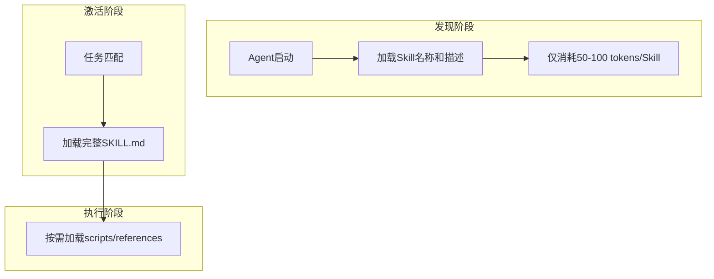
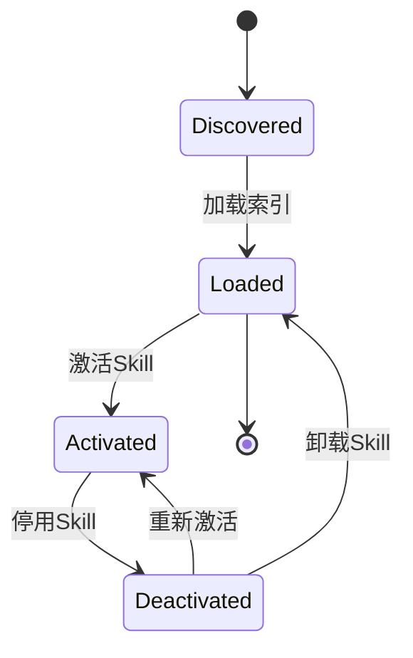
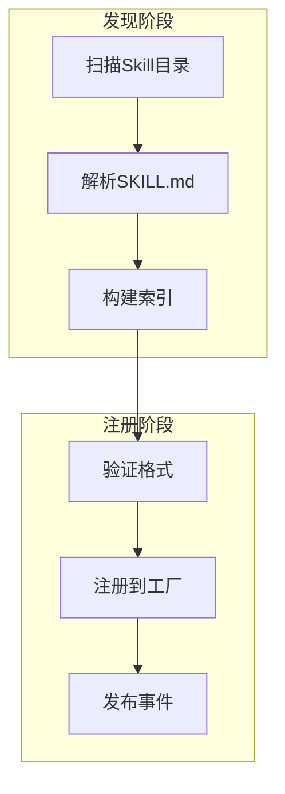

# TECH-SKILL: Skills模块

本文档描述Neco项目的Skills模块设计，参考[agentskills.io](https://agentskills.io/)的设计理念，实现技能的按需加载。

## 1. 模块概述

Skills模块提供可复用的能力扩展机制，允许用户定义自定义技能并在需要时动态加载。Skill本质上是提示词片段的打包，用于增强Agent在特定领域的能力。

## 2. 核心概念

### 2.1 Skill定义

Skills是轻量级、开放的格式，用于通过专业知识和工作流程来扩展AI代理的能力。Skill是包含指令、脚本和资源的文件夹，代理可以发现并利用这些内容来更准确、更高效地完成任务。

**Skill与Prompt的区别：**
- **Prompt组件**：静态片段，用于组合提示词
- **Skill**：完整的可复用能力单元，包含提示词、工具依赖、激活条件等

### 2.2 渐进式披露

Skills采用**渐进式披露**策略来高效管理上下文：



| 阶段 | 加载内容 | 上下文消耗 |
|------|---------|-----------|
| 发现阶段 | 名称 + 描述 | ~50-100 tokens/Skill |
| 激活阶段 | 完整SKILL.md | 完整内容 |
| 执行阶段 | scripts/references | 按需 |

## 3. 数据结构设计

### 3.1 Skill目录结构

```
my-skill/
├── SKILL.md          # 必需：指令和元数据
├── scripts/          # 可选：可执行代码
├── references/       # 可选：参考资料
└── assets/          # 可选：模板、资源
```

### 3.2 SKILL.md 格式

采用agentskills.io规范的YAML前置元数据：

```yaml
---
# 必需字段
name: rust-coding-assistant     # 技能名称：小写字母、数字、连字符
description: 提供Rust语言最佳实践、unsafe代码检查、生命周期分析等能力

# 可选字段
license: MIT                    # 许可证
compatibility:                  # 兼容性说明
  - neco
metadata:                       # 自定义元数据
  author: neco-team
  version: 1.0.0
allowed-tools:                   # 预批准的工具列表（实验性）
  - fs::read
  - fs::edit
---

# 技能指令内容
# ... Markdown格式的指令 ...
```

**前置元数据字段说明：**

| 字段 | 必需 | 说明 |
|------|------|------|
| `name` | 是 | 技能名称，最多64字符，只能用小写字母、数字、连字符，不能以连字符开头/结尾 |
| `description` | 是 | 技能描述，最多1024字符 |
| `license` | 否 | 许可证信息 |
| `compatibility` | 否 | 兼容产品列表 |
| `metadata` | 否 | 自定义键值对 |
| `allowed-tools` | 否 | 预批准的工具列表（实验性） |

### 3.3 Skill定义结构

```rust
/// Skill标识符
#[derive(Debug, Clone, PartialEq, Eq, Hash, Serialize, Deserialize)]
pub struct SkillId(pub String);

/// Skill定义
pub struct Skill {
    /// 唯一标识（目录名）
    pub id: SkillId,
    
    /// 显示名称
    pub name: String,
    
    /// 描述
    pub description: String,
    
    /// 指令内容
    pub content: String,
    
    /// 许可证
    pub license: Option<String>,
    
    /// 兼容性
    pub compatibility: Vec<String>,
    
    /// 预批准的工具
    #[serde(default)]
    pub allowed_tools: Vec<String>,
    
    /// 自定义元数据
    #[serde(default)]
    pub metadata: HashMap<String, Value>,
    
    /// 资源文件
    #[serde(default)]
    pub resources: SkillResources,
}

/// Skill资源
#[derive(Debug, Clone, Default, Serialize, Deserialize)]
pub struct SkillResources {
    /// 脚本目录
    pub scripts: Vec<PathBuf>,
    /// 参考资料
    pub references: Vec<PathBuf>,
    /// 资源文件
    pub assets: Vec<PathBuf>,
}
```

### 3.4 Skill内容示例

**rust-coding-assistant/SKILL.md:**

YAML前置元数据格式见 [3.2节 SKILL.md 格式](#32-skillmd-格式)。

以下为Markdown正文部分示例：

```markdown
# Rust编码最佳实践

你擅长编写高质量的Rust代码。以下是你的核心能力：

## 1. 安全优先
- 默认使用安全方案，只有在性能关键且安全可证明时才使用unsafe
- 优先使用标准库的安全抽象

## 2. 所有权与生命周期
- 充分利用Rust的所有权系统避免数据竞争
- 正确使用生命周期标注避免 dangling references

## 3. 错误处理
- 优先使用Result而非panic处理可恢复错误
- 为自定义错误实现Debug和Display

## 4. 性能优化
- 避免不必要的clone
- 使用Arc/Rc进行共享所有权的场景

## 5. 代码组织
- 遵循crate的最佳实践
- 合理划分模块
- 使用trait进行抽象

请参阅 [references/safety-checklist.md](references/safety-checklist.md) 了解安全检查清单。

运行代码分析脚本：
[scripts/analyze.rs](scripts/analyze.rs)
```

## 4. Skill服务

### 4.1 服务结构

```rust
/// Skill服务
pub struct SkillService {
    /// Skill缓存
    skills: Arc<RwLock<HashMap<SkillId, Skill>>>,
    
    /// Skill索引
    index: Arc<RwLock<SkillIndex>>,
    
    /// 配置目录
    config_dir: PathBuf,
    
    /// 激活的Skills（每个Session独立）
    active_skills: Arc<RwLock<HashMap<SessionId, HashSet<SkillId>>>>,
    
    /// 渐进式披露上下文大小
    discovery_token_budget: usize,
}

/// Skill索引
#[derive(Debug, Clone, Default, Serialize, Deserialize)]
pub struct SkillIndex {
    pub skills: Vec<SkillInfo>,
}

/// Skill信息（用于发现阶段）
#[derive(Debug, Clone, Serialize, Deserialize)]
pub struct SkillInfo {
    pub id: SkillId,
    pub name: String,
    pub description: String,
    pub license: Option<String>,
    pub compatibility: Vec<String>,
    pub tags: Vec<String>,
}
```

### 4.2 加载流程

```rust
impl SkillService {
    /// 加载Skill索引（发现阶段）
    pub async fn load_index(&self) -> Result<SkillIndex, SkillError> {
        // TODO: 扫描skills目录，构建索引
        // 每个Skill只加载name和description
    }
    
    /// 获取发现阶段上下文
    pub fn get_discovery_context(&self) -> String {
        // TODO: 生成用于发现阶段的简短上下文
        // 格式: "可用Skills: skill1 - 描述1; skill2 - 描述2; ..."
    }
    
    /// 加载完整Skill（激活阶段）
    pub async fn load_skill(
        &self,
        skill_id: &SkillId,
    ) -> Result<Skill, SkillError> {
        // TODO: 加载完整SKILL.md内容
    }
    
    /// 加载Skill资源（执行阶段）
    pub async fn load_resource(
        &self,
        skill_id: &SkillId,
        path: &Path,
    ) -> Result<String, SkillError> {
        // TODO: 按需加载scripts/references/assets中的文件
    }
    
    /// 激活Skill
    pub async fn activate_skill(
        &self,
        session_id: SessionId,
        skill_id: &SkillId,
    ) -> Result<ActivatedSkill, SkillError> {
        // TODO: 加载完整Skill，添加到激活列表
    }
    
    /// 停用Skill
    pub async fn deactivate_skill(
        &self,
        session_id: SessionId,
        skill_id: &SkillId,
    ) -> Result<(), SkillError> {
        // TODO: 从激活列表移除
    }
    
    /// 列出所有Skills
    pub fn list_skills(&self) -> Vec<SkillInfo> {
        // TODO: 返回Skill索引
    }
    
    /// 搜索Skills
    pub fn search_skills(&self, query: &str) -> Vec<SkillInfo> {
        // TODO: 基于名称/描述搜索
    }
}
```

### 4.3 激活的Skill

```rust
/// 已激活的Skill实例
pub struct ActivatedSkill {
    /// Skill ID
    pub skill_id: SkillId,
    
    /// 完整指令内容
    pub content: String,
    
    /// 预批准的工具
    pub allowed_tools: Vec<String>,
    
    /// 激活时间
    pub activated_at: DateTime<Utc>,
}
```

## 5. 代理集成

### 5.1 基于文件系统的代理

Neco作为基于文件系统的代理，通过`activate::skill`工具激活Skill：

```rust
/// 激活Skill时执行的命令
fn get_skill_activation_command(skill_id: &str) -> String {
    // 读取SKILL.md文件内容
    format!("cat ~/.config/neco/skills/{}/SKILL.md", skill_id)
}
```

### 5.2 资源访问

```rust
/// 访问Skill资源
fn get_skill_resource_command(skill_id: &str, resource_path: &str) -> String {
    format!(
        "cat ~/.config/neco/skills/{}/{}",
        skill_id,
        resource_path
    )
}
```

## 6. Skill使用

### 6.1 activate::skill 工具

```rust
/// activate::skill 工具
pub struct ActivateSkillTool {
    skill_service: Arc<SkillService>,
}

impl ToolProvider for ActivateSkillTool {
    fn name(&self) -> &str {
        "activate::skill"
    }
    
    fn description(&self) -> &str {
        "激活/停用Skill，扩展Agent能力"
    }
    
    fn parameters_schema(&self) -> Value {
        json!({
            "type": "object",
            "properties": {
                "action": {
                    "type": "string",
                    "enum": ["activate", "deactivate", "list", "search"],
                    "description": "操作类型"
                },
                "skill_id": {
                    "type": "string",
                    "description": "Skill标识符"
                },
                "query": {
                    "type": "string",
                    "description": "搜索关键词"
                }
            },
            "required": ["action"]
        })
    }
    
    async fn execute(
        &self,
        args: Value,
    ) -> Result<ToolResult, ToolError> {
        // TODO: 实现Skill激活/停用/列表/搜索逻辑
    }
}
```

### 6.2 使用示例

```
# 查看可用Skills（发现阶段）
Agent: 请列出所有可用的Skills
响应: 可用Skills: rust-coding-assistant - Rust编码助手; web-security - Web安全专家; ...

# 激活Skill（激活阶段）
Agent: 请激活 rust-coding-assistant
响应: Skill "rust-coding-assistant" 已激活。

# 访问资源（执行阶段）
Agent: 请查看安全检查清单
响应: [自动加载 references/safety-checklist.md 内容]

# 停用Skill
Agent: 请停用 rust-coding-assistant
```

## 7. 内置Skills

> 提示词组件是轻量级片段，Skill是完整的能力单元。内置Skills共享内置提示词组件的基础内容，并添加Skill特有的元数据和扩展能力。

### 7.1 base

```yaml
---
name: base
description: Agent的基础能力，包含通用提示和工具使用说明
---

# 基础能力

> 详细提示词内容见 [TECH-PROMPT.md#5.1-base](TECH-PROMPT.md#51-base)
```

### 7.2 multi-agent

```yaml
---
name: multi-agent
description: 生成和管理下级Agent的能力
---

# 多智能体协作

> 详细提示词内容见 [TECH-PROMPT.md#52-multi-agent](TECH-PROMPT.md#52-multi-agent)
```

### 7.3 multi-agent-child

```yaml
---
name: multi-agent-child
description: 下级Agent的行为规范
---

# 下级Agent规范

> 详细提示词内容见 [TECH-PROMPT.md#53-multi-agent-child](TECH-PROMPT.md#53-multi-agent-child)
```

## 8. Skill市场

### 8.1 市场结构

```
~/.config/neco/skills/
├── rust-coding-assistant/
│   ├── SKILL.md
│   ├── scripts/
│   │   └── analyze.rs
│   └── references/
│       └── safety-checklist.md
├── web-security/
│   ├── SKILL.md
│   └── ...
└── database-design/
    ├── SKILL.md
    └── ...
```

### 8.2 CLI命令

```bash
# 列出Skills
neco skill list

# 搜索Skills
neco skill search database

# 激活Skill
neco skill activate rust-coding-assistant

# 停用Skill
neco skill deactivate rust-coding-assistant

# 验证Skill格式
neco skill validate ./rust-coding-assistant

# 安装来自URL的Skill
neco skill install https://example.com/skills/my-skill

# 更新Skill
neco skill update rust-coding-assistant
```

## 9. 安全考量

```rust
/// Skill执行安全配置
#[derive(Debug, Clone)]
pub struct SkillSecurityConfig {
    /// 是否允许执行脚本
    pub allow_scripts: bool,
    /// 沙箱环境配置
    pub sandbox: SandboxConfig,
    /// 需要用户确认的操作
    pub confirmation_required: Vec<String>,
    /// 是否记录执行日志
    pub audit_log: bool,
}

/// 沙箱配置
#[derive(Debug, Clone)]
pub struct SandboxConfig {
    /// 最大内存使用
    pub max_memory: u64,
    /// 最大执行时间
    pub max_execution_time: Duration,
    /// 允许的系统调用
    pub allowed_syscalls: Vec<String>,
}
```

**安全最佳实践：**
- 使用沙箱环境隔离脚本执行
- 仅执行来自可信Skill的脚本
- 在执行潜在危险操作前请求用户确认
- 记录所有脚本执行以供审计

## 10. 错误处理

> **注意**: 所有模块错误类型统一在 `neco-core` 中汇总为 `AppError`。见 [TECH.md#5.3-统一错误类型设计](TECH.md#5.3-统一错误类型设计)。
>
> `SkillError` 为模块内部错误，在模块边界通过 `From` 实现或映射函数转换为 `AppError::Skill`。

```rust
#[derive(Debug, Error)]
pub enum SkillError {
    #[error("Skill未找到: {0}")]
    SkillNotFound(SkillId),
    
    #[error("Skill已激活: {0}")]
    SkillAlreadyActivated(SkillId),
    
    #[error("Skill未激活: {0}")]
    SkillNotActivated(SkillId),
    
    #[error("无效的Skill格式: {0}")]
    InvalidFormat(String),
    
    #[error("验证失败: {0}")]
    ValidationFailed(String),
    
    #[error("脚本执行失败: {0}")]
    ScriptExecutionFailed(String),
    
    #[error("资源未找到: {0}")]
    ResourceNotFound(String),
    
    #[error("权限不足: {0}")]
    PermissionDenied(String),
}
```

## 11. Skill生命周期管理



**生命周期状态：**

| 状态 | 描述 |
|------|------|
| `Discovered` | 发现Skill但未加载 |
| `Loaded` | 已加载索引到内存 |
| `Activated` | Skill已激活 |
| `Deactivated` | Skill已停用 |

## 12. Skill发现与注册



**发现配置：**

```rust
/// Skill发现配置
pub struct SkillDiscoveryConfig {
    /// Skill目录列表
    pub skill_dirs: Vec<PathBuf>,
    /// 自动加载
    pub auto_load: bool,
    /// 扫描深度
    pub max_depth: usize,
}
```

## 13. UI集成

### 13.1 Skill面板

```rust
/// 渲染Skill面板
impl TuiRenderer {
    pub fn render_skill_panel(
        &self,
        active_skills: &[SkillId],
        available_skills: &[SkillInfo],
    ) -> impl Widget {
        // 显示：
        // - 已激活的Skills列表
        // - 可用Skills市场
        // - 快速激活按钮
    }
}
```

---

*关联文档：*
- [TECH.md](TECH.md) - 总体架构文档
- [TECH-TOOL.md](TECH-TOOL.md) - 工具模块
- [TECH-AGENT.md](TECH-AGENT.md) - 多智能体协作模块
