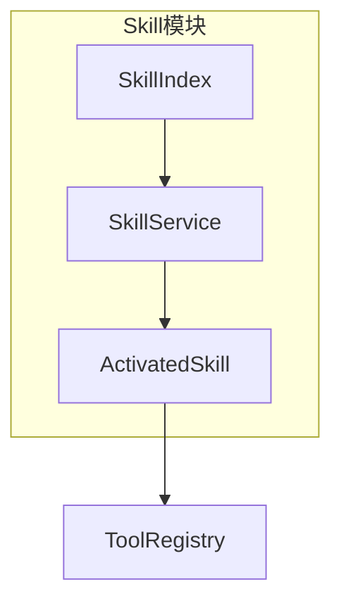
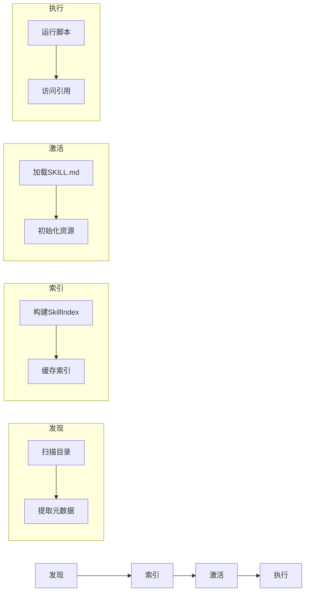

# TECH-SKILL: Skills模块

本文档描述NeoCo项目的Skills模块设计。

## 1. 模块概述

Skills是轻量级、开放的格式，用于通过专业知识和工作流程来扩展AI代理的能力。

## 2. 核心概念

### 2.1 Skill定义

Skill是包含指令、脚本和资源的文件夹：

```text
my-skill/
├── SKILL.md          # 必需：指令和元数据（YAML frontmatter + Markdown指令）
├── scripts/          # 可选：可执行脚本（Shell、Python、Rust等）
├── references/       # 可选：参考资料（文档、数据文件、配置模板）
└── assets/           # 可选：资源文件（图片、图标、二进制文件）
```

**目录用途说明：**
- `scripts/`: 存放可执行脚本，用于扩展Skill的执行能力。脚本可通过ToolRegistry注册为可调用工具。
- `references/`: 存放参考资料，如API文档、代码片段、数据文件等，可在运行时按需加载。
- `assets/`: 存放静态资源，如图标、图片、二进制文件等，供Skill展示或处理使用。

### 2.2 渐进式披露

| 阶段 | 加载内容 | 上下文消耗 |
|------|---------|-----------|
| 发现阶段 | 名称 + 描述 | ~50-100 tokens |
| 激活阶段 | 完整SKILL.md | 完整内容 |
| 执行阶段 | scripts/references | 按需 |

### 2.3 核心组件关系



### 2.4 数据流图



## 3. SKILL.md格式

```yaml
---
name: rust-coding-assistant
description: 提供Rust语言最佳实践、unsafe代码检查等能力
tags:
  - rust
  - security
---

# 技能指令内容
...
```

## 4. Skill服务

### 4.1 SkillId 强类型

```rust
/// Skill ID 强类型（ULID Newtype）
#[derive(Debug, Clone, PartialEq, Eq, Hash, Serialize, Deserialize)]
pub struct SkillUlid(Ulid);

impl SkillUlid {
    pub fn new() -> Self {
        Self(Ulid::new())
    }
    
    pub fn from_string(s: &str) -> Result<Self, SkillError> {
        Ok(Self(Ulid::from_string(s)?))
    }
    
    pub fn as_str(&self) -> &str {
        self.0.encode().as_str()
    }
}

impl std::fmt::Display for SkillUlid {
    fn fmt(&self, f: &mut std::fmt::Formatter<'_>) -> std::fmt::Result {
        write!(f, "{}", self.0.encode())
    }
}
```

### 4.1 SkillService Trait

```rust
#[async_trait]
pub trait SkillService: Send + Sync {
    async fn discover_skills(&self) -> Result<Vec<SkillDefinition>, SkillError>;
    async fn activate(&self, skill_ulid: &SkillUlid) -> Result<ActivatedSkill, SkillError>;
    async fn deactivate(&self, skill_ulid: &SkillUlid) -> Result<(), SkillError>;
}
```

### 4.2 ActivatedSkill 结构

```rust
pub struct ActivatedSkill {
    pub id: SkillUlid,
    pub name: String,
    pub instruction: String,
    pub metadata: SkillMetadata,
    pub resources: SkillResources,
    pub tools: Vec<ToolDefinition>,
}

pub struct SkillMetadata {
    pub version: String,
    pub author: Option<String>,
    pub tags: Vec<String>,
    pub dependencies: Vec<String>,
}

pub struct SkillResources {
    pub base_path: PathBuf,
    pub scripts: HashMap<String, ScriptInfo>,
    pub references: HashMap<String, ReferenceInfo>,
    pub assets: HashMap<String, AssetInfo>,
}

pub struct ScriptInfo {
    pub path: PathBuf,
    pub language: ScriptLanguage,
    pub entry_point: Option<String>,
}

pub struct ReferenceInfo {
    pub path: PathBuf,
    pub content_type: String,
}

pub struct AssetInfo {
    pub path: PathBuf,
    pub mime_type: String,
}

#[derive(Debug, Clone, Copy)]
pub enum ScriptLanguage {
    Shell,
    Python,
    Rust,
    JavaScript,
}
```

### 4.3 核心数据结构

```rust
pub struct SkillService {
    index: Arc<RwLock<SkillIndex>>,
}

pub struct Skill {
    pub id: SkillUlid,
    pub name: String,
    pub description: String,
    pub content: String,
    pub tags: Vec<String>,
}

#[derive(Debug, Clone, Default)]
pub struct SkillIndex {
    pub skills: Vec<SkillInfo>,
}

pub struct SkillInfo {
    pub id: SkillUlid,
    pub name: String,
    pub description: String,
    pub tags: Vec<String>,
}

impl SkillIndex {
    pub fn get(&self, id: &SkillUlid) -> Option<&SkillInfo> {
        self.skills.iter().find(|s| &s.id == id)
    }
}
```

### 4.4 加载流程

```rust
impl SkillService {
    pub async fn load_index(&self) -> Result<SkillIndex, SkillError> {
        // [TODO] 实现Skill索引加载
        // 1. 扫描配置的skills目录（默认 ~/.neoco/skills 或项目内 ./skills）
        // 2. 遍历顶层目录，每个有效目录视为一个Skill
        // 3. 解析SKILL.md的YAML frontmatter提取元数据
        // 4. 验证必需字段（name, description）
        // 5. 缓存索引到self.index中

        // 索引缓存策略：
        // - 首次加载：全量扫描并缓存
        // - 后续访问：直接从缓存返回，不重复扫描
        // - 缓存失效：手动调用reload_index()或检测目录变更
        // - 缓存结构：使用RwLock<SkillIndex>支持并发读取
        unimplemented!()
    }

    pub async fn reload_index(&self) -> Result<SkillIndex, SkillError> {
        // [TODO] 实现索引重新加载
        // 1. 清空现有索引缓存
        // 2. 重新扫描目录
        // 3. 更新self.index
        // 4. 返回新索引
        unimplemented!()
    }
    
    async fn parse_skill_info(&self, path: &Path) -> Result<SkillInfo, SkillError> {
        // [TODO] 实现Skill元数据解析
        // 1. 读取SKILL.md文件内容
        // 2. 解析YAML frontmatter提取name、description、tags等字段
        // 3. 构建SkillInfo结构体并返回
        unimplemented!()
    }
    
    pub async fn load_skill(&self, id: &SkillUlid) -> Result<Skill, SkillError> {
        // [TODO] 实现完整Skill加载
        // 1. 根据skill_ulid查找Skill目录路径
        // 2. 读取完整的SKILL.md内容
        // 3. 解析frontmatter和指令内容
        // 4. 构建Skill结构体（包含id、name、description、content、tags等）
        unimplemented!()
    }
    
    pub async fn activate(&self, id: &SkillUlid) -> Result<ActivatedSkill, SkillError> {
        // [TODO] 实现Skill激活
        // 1. 加载完整Skill内容（调用load_skill）
        // 2. 扫描scripts/references/assets目录
        // 3. 构建SkillResources（脚本、引用、资源信息）
        // 4. 注册工具（如果有可执行脚本）
        // 5. 构建ActivatedSkill并返回
        // 6. 记录激活状态到activated_skills集合
        unimplemented!()
    }

    pub async fn deactivate(&self, id: &SkillUlid) -> Result<(), SkillError> {
        // [TODO] 实现Skill停用
        // 1. 从activated_skills中查找Skill
        // 2. 遍历Skill.tools，从ToolRegistry中注销所有工具
        // 3. 清理运行时资源（如打开的文件句柄、临时文件）
        // 4. 从activated_skills中移除
        // 5. 保留磁盘上的Skill文件，仅移除内存状态
        unimplemented!()
    }
}
```

## 5. 错误处理

```rust
#[derive(Debug, Error)]
pub enum SkillError {
    #[error("Skill未找到: {0}")]
    NotFound(SkillUlid),
    
    #[error("解析失败: {0}")]
    ParseError(#[source] serde_yaml::Error),
    
    #[error("IO错误: {0}")]
    IoError(#[source] std::io::Error),
    
    #[error("验证失败: {0}")]
    ValidationError(String),
    
    #[error("加载失败: {0}")]
    LoadFailed(String),
    
    #[error("激活失败: {0}")]
    ActivationFailed(String),
}
```

---

*关联文档：*
- [TECH.md](TECH.md) - 总体架构文档
- [TECH-TOOL.md](TECH-TOOL.md) - 工具模块
- [TECH-AGENT.md](TECH-AGENT.md) - Agent模块
