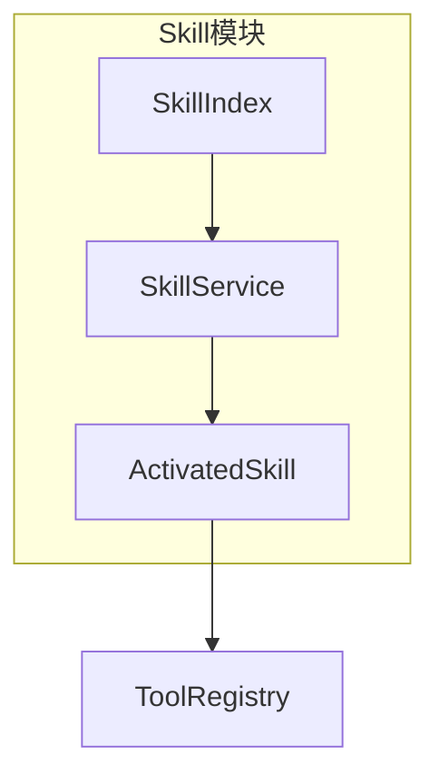
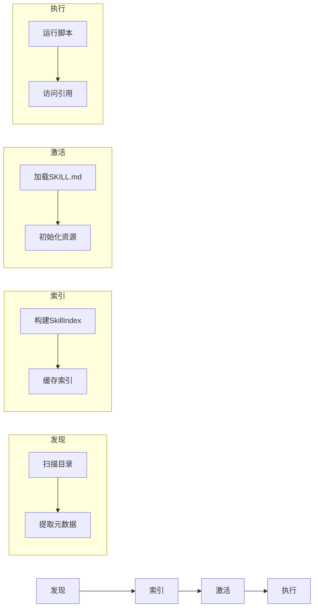

# TECH-SKILL: Skills模块

本文档描述NeoCo项目的Skills模块设计。

## 1. 模块概述

Skills是轻量级、开放的格式，用于通过专业知识和工作流程来扩展AI代理的能力。

## 2. 核心概念

### 2.1 Skill定义

Skill是包含指令、脚本和资源的文件夹：

```text
my-skill/
├── SKILL.md          # 必需：指令和元数据（YAML frontmatter + Markdown指令）
├── scripts/          # 可选：可执行脚本（Shell、Python、Rust等）
├── references/       # 可选：参考资料（文档、数据文件、配置模板）
└── assets/           # 可选：资源文件（图片、图标、二进制文件）
```

**目录用途说明：**
- `scripts/`: 存放可执行脚本，用于扩展Skill的执行能力。脚本可通过ToolRegistry注册为可调用工具。
- `references/`: 存放参考资料，如API文档、代码片段、数据文件等，可在运行时按需加载。
- `assets/`: 存放静态资源，如图标、图片、二进制文件等，供Skill展示或处理使用。

### 2.2 渐进式披露

| 阶段 | 加载内容 | 上下文消耗 |
|------|---------|-----------|
| 发现阶段 | 名称 + 描述 | ~50-100 tokens |
| 激活阶段 | 完整SKILL.md | 完整内容 |
| 执行阶段 | scripts/references | 按需 |

### 2.3 核心组件关系



### 2.4 数据流图



## 3. SKILL.md格式

```yaml
---
name: rust-coding-assistant
description: 提供Rust语言最佳实践、unsafe代码检查等能力
tags:
  - rust
  - security
---

# 技能指令内容
...
```

## 4. Skill服务

### 4.1 SkillName 字符串标识

```rust
/// Skill Name 字符串标识
///
/// 注意：Skill使用字符串名称（如"rust-coding"）作为标识符，而非ULID
/// Agent配置中的skills字段使用字符串列表格式
///
/// [TODO] 与TECH-SESSION.md中SkillUlid的关系：
/// - SkillName（字符串）：用户可见的Skill名称，对应SKILL.md中的name字段
/// - SkillUlid（ULID）：内部运行时标识，用于Session中追踪激活的Skill实例
/// - 用户配置使用SkillName（字符串），运行时内部映射到SkillUlid
#[derive(Debug, Clone, PartialEq, Eq, Hash, Serialize, Deserialize)]
pub struct SkillName(String);

impl SkillName {
    pub fn new(name: impl Into<String>) -> Self {
        Self(name.into())
    }

    pub fn as_str(&self) -> &str {
        self.0.as_str()
    }
}

impl std::fmt::Display for SkillName {
    fn fmt(&self, f: &mut std::fmt::Formatter<'_>) -> std::fmt::Result {
        write!(f, "{}", self.0)
    }
}
```

### 4.2 SkillService Trait

```rust
#[async_trait]
pub trait SkillService: Send + Sync {
    /// 发现所有可用技能
    async fn discover_skills(&self) -> Result<Vec<SkillDefinition>, SkillError>;
    
    /// 激活指定名称的Skill
    /// [TODO] 参数说明：
    /// - skill_name: Skill名称（字符串），对应SKILL.md中的name字段
    /// - 示例：activate("rust-coding") 激活 rust-coding 技能
    async fn activate(&self, skill_name: &str) -> Result<ActivatedSkill, SkillError>;
    
    /// 停用指定名称的Skill
    async fn deactivate(&self, skill_name: &str) -> Result<(), SkillError>;
}
```

### 4.3 ActivatedSkill 结构

```rust
pub struct ActivatedSkill {
    /// Skill名称（字符串标识）
    pub name: SkillName,
    pub instruction: String,
    pub metadata: SkillMetadata,
    pub resources: SkillResources,
    pub tools: Vec<ToolDefinition>,
}

pub struct SkillMetadata {
    pub version: String,
    pub author: Option<String>,
    pub tags: Vec<String>,
    pub dependencies: Vec<String>,
}

pub struct SkillResources {
    pub base_path: PathBuf,
    pub scripts: HashMap<String, ScriptInfo>,
    pub references: HashMap<String, ReferenceInfo>,
    pub assets: HashMap<String, AssetInfo>,
}

pub struct ScriptInfo {
    pub path: PathBuf,
    pub language: ScriptLanguage,
    pub entry_point: Option<String>,
}

pub struct ReferenceInfo {
    pub path: PathBuf,
    pub content_type: String,
}

pub struct AssetInfo {
    pub path: PathBuf,
    pub mime_type: String,
}

#[derive(Debug, Clone, Copy)]
pub enum ScriptLanguage {
    Shell,
    Python,
    Rust,
    JavaScript,
}
```

### 4.4 核心数据结构

```rust
pub struct SkillService {
    index: Arc<RwLock<SkillIndex>>,
}

pub struct Skill {
    /// Skill名称（字符串标识）
    pub name: SkillName,
    pub description: String,
    pub content: String,
    pub tags: Vec<String>,
}

#[derive(Debug, Clone, Default)]
pub struct SkillIndex {
    pub skills: Vec<SkillInfo>,
}

pub struct SkillInfo {
    /// Skill名称（字符串标识）
    pub name: SkillName,
    pub description: String,
    pub tags: Vec<String>,
}

impl SkillIndex {
    /// 根据Skill名称查找
    pub fn get(&self, name: &str) -> Option<&SkillInfo> {
        self.skills.iter().find(|s| s.name.as_str() == name)
    }
}
```

### 4.5 加载流程

```rust
impl SkillService {
    /// 加载Skill索引
    /// [TODO] 实现Skill索引加载
    /// 1. 扫描配置的skills目录（遵循配置目录优先级）
    ///    - 优先级：.neoco/skills > .agents/skills > ~/.config/neoco/skills > ~/.agents/skills
    /// 2. 遍历顶层目录，每个有效目录视为一个Skill
    /// 3. 解析SKILL.md的YAML frontmatter提取元数据
    /// 4. 验证必需字段（name, description）
    /// 5. 缓存索引到self.index中
    ///
    /// 索引缓存策略：
    /// - 首次加载：全量扫描并缓存
    /// - 后续访问：直接从缓存返回，不重复扫描
    /// - 缓存失效：手动调用reload_index()或检测目录变更
    /// - 缓存结构：使用RwLock<SkillIndex>支持并发读取
    pub async fn load_index(&self) -> Result<SkillIndex, SkillError> {
        unimplemented!()
    }

    /// 重新加载索引
    /// [TODO] 实现索引重新加载
    /// 1. 清空现有索引缓存
    /// 2. 重新扫描目录
    /// 3. 更新self.index
    /// 4. 返回新索引
    pub async fn reload_index(&self) -> Result<SkillIndex, SkillError> {
        unimplemented!()
    }
    
    /// 解析Skill元数据
    /// [TODO] 实现Skill元数据解析
    /// 1. 读取SKILL.md文件内容
    /// 2. 解析YAML frontmatter提取name、description、tags等字段
    /// 3. 构建SkillInfo结构体并返回
    async fn parse_skill_info(&self, path: &Path) -> Result<SkillInfo, SkillError> {
        unimplemented!()
    }
    
    /// 加载完整Skill内容
    /// [TODO] 实现完整Skill加载
    /// 1. 根据skill_name查找Skill目录路径
    /// 2. 读取完整的SKILL.md内容
    /// 3. 解析frontmatter和指令内容
    /// 4. 构建Skill结构体（包含name、description、content、tags等）
    pub async fn load_skill(&self, name: &str) -> Result<Skill, SkillError> {
        unimplemented!()
    }
    
    /// 激活Skill
    /// [TODO] 实现Skill激活
    /// 1. 加载完整Skill内容（调用load_skill）
    /// 2. 扫描scripts/references/assets目录
    /// 3. 构建SkillResources（脚本、引用、资源信息）
    /// 4. 注册工具（如果有可执行脚本）
    /// 5. 构建ActivatedSkill并返回
    /// 6. 记录激活状态到activated_skills集合
    pub async fn activate(&self, name: &str) -> Result<ActivatedSkill, SkillError> {
        unimplemented!()
    }

    /// 停用Skill
    /// [TODO] 实现Skill停用
    /// 1. 从activated_skills中查找Skill
    /// 2. 遍历Skill.tools，从ToolRegistry中注销所有工具
    /// 3. 清理运行时资源（如打开的文件句柄、临时文件）
    /// 4. 从activated_skills中移除
    /// 5. 保留磁盘上的Skill文件，仅移除内存状态
    pub async fn deactivate(&self, name: &str) -> Result<(), SkillError> {
        unimplemented!()
    }
}
```

## 5. 错误处理

```rust
#[derive(Debug, Error)]
pub enum SkillError {
    #[error("Skill未找到: {0}")]
    NotFound(SkillName),
    
    #[error("解析失败: {0}")]
    ParseError(#[source] serde_yaml::Error),
    
    #[error("IO错误: {0}")]
    IoError(#[source] std::io::Error),
    
    #[error("验证失败: {0}")]
    ValidationError(String),
    
    #[error("加载失败: {0}")]
    LoadFailed(String),
    
    #[error("激活失败: {0}")]
    ActivationFailed(String),
}
```

## 6. Skill目录位置

Skills目录遵循配置目录优先级规则：

> 配置目录优先级规则 **详见 [REQUIREMENT.md](../REQUIREMENT.md#配置目录优先级)**

**目录扫描顺序：**
- 从高优先级到低优先级扫描
- 相同名称的Skill：高优先级覆盖低优先级
- 支持工作流级别的skills配置（`workflows/xxx/skills/`）

## 7. activate工具

```rust
/// activate::skill 工具
/// 
/// 参数：skill_name (字符串)
/// 示例：
///   - activate::skill { "skill_name": "rust-coding" }
///   - activate::skill { "skill_name": "web-dev" }
///
/// [TODO] 实现：
/// 1. 验证skill_name是否存在于索引中
/// 2. 调用SkillService::activate()激活Skill
/// 3. 将ActivatedSkill的instruction注入到Agent上下文
/// 4. 注册Skill中的工具到ToolRegistry
```

---

*关联文档：*
- [TECH.md](TECH.md) - 总体架构文档
- [TECH-TOOL.md](TECH-TOOL.md) - 工具模块
- [TECH-AGENT.md](TECH-AGENT.md) - Agent模块
