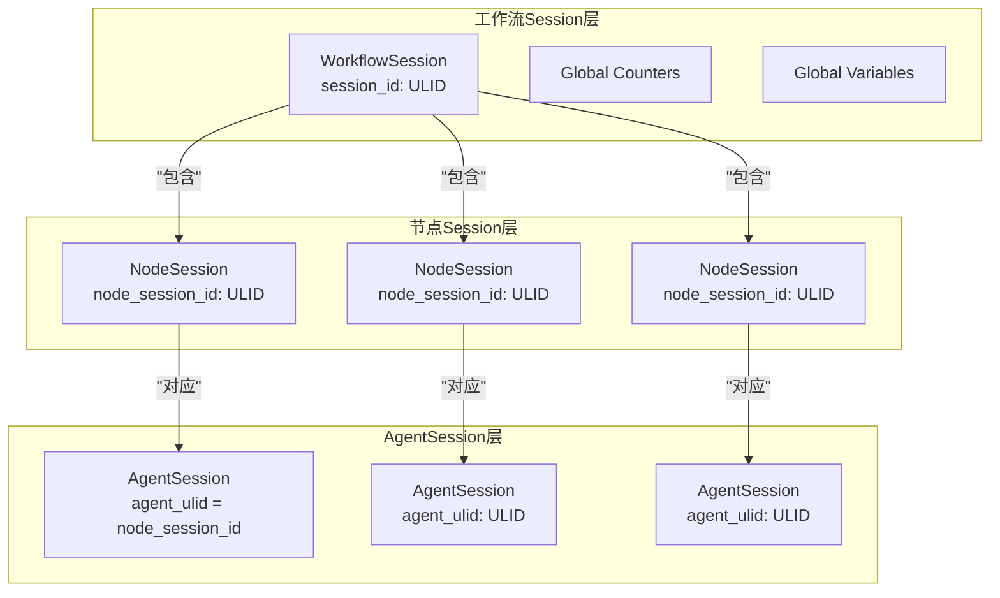
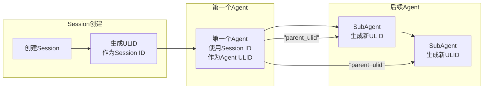
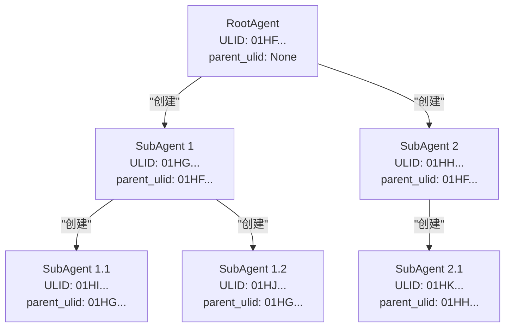
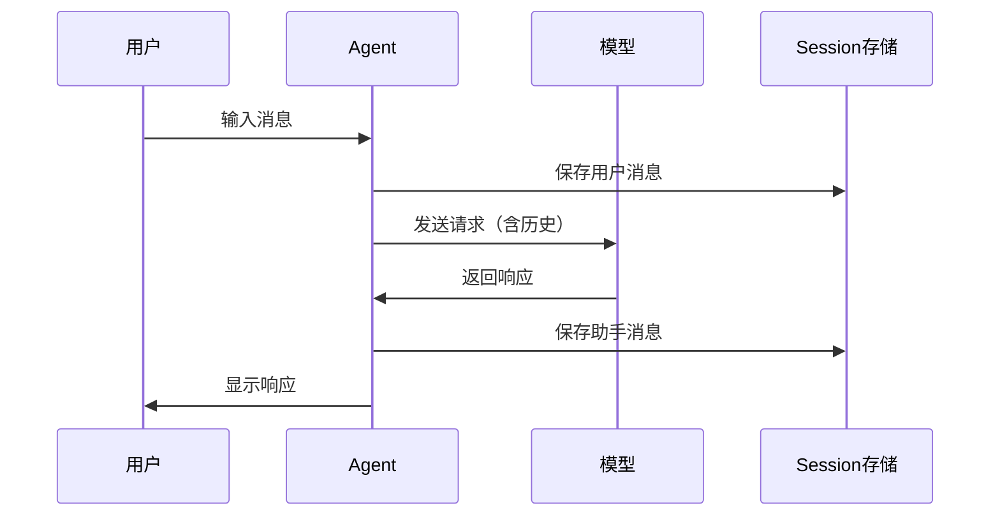
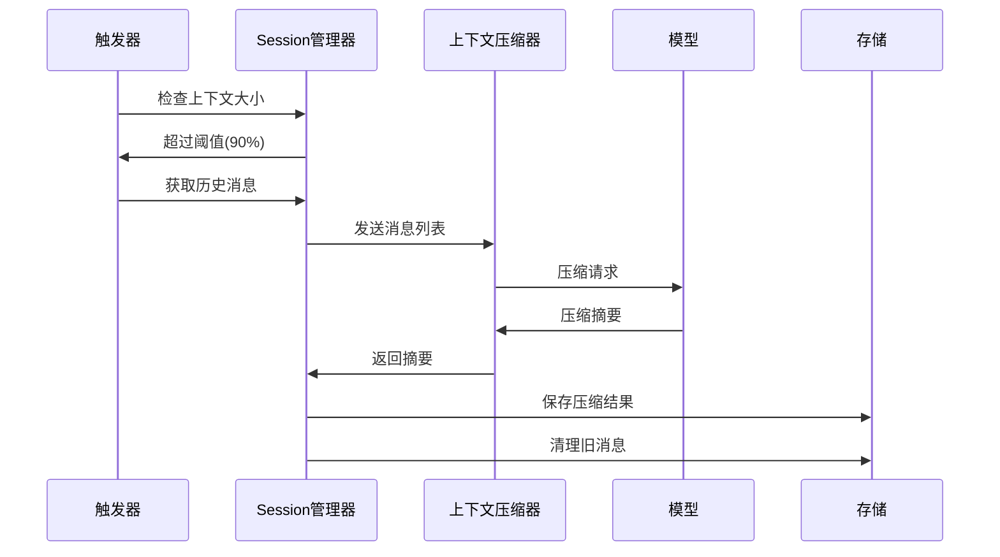
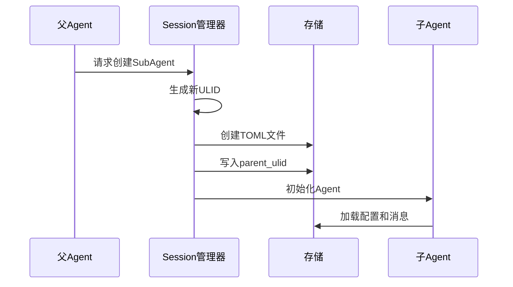

# Session 管理技术文档

## 概述

Session 管理是 Neco 系统的核心基础设施，负责管理多智能体会话的生命周期、状态持久化和层次关系。采用 ULID 标识系统和 TOML 文件存储，实现高效的会话管理。

---

## Session 层次结构

### 三层 Session 架构



### 层次说明

#### 1. 工作流 Session（顶层容器）

**标识**：使用 ULID 作为 Session ID，在创建工作流时生成

**存储内容**：
- `global_counters`: HashMap<String, usize> - 全局计数器，用于边条件控制
- `global_variables`: HashMap<String, String> - 全局变量，跨节点共享数据
- `node_sessions`: HashMap<NodeSessionId, NodeSession> - 子节点 Session 集合

**生命周期**：
- 创建：工作流启动时创建
- 销毁：工作流完成或终止时销毁

#### 2. 节点 Session（工作流节点的执行上下文）

**标识**：使用 ULID 作为 node_session_id

**与工作流 Session 的关系**：
- 每个节点 Session 归属于一个工作流 Session
- 通过 `workflow_session_id` 字段关联

**存储内容**：
- `node_session_id`: 节点唯一标识
- `agent_ulid`: 与 Agent Session 关联（等于 node_session_id）
- `state`: 节点执行状态
- `messages`: 节点内的消息历史

**创建方式**：
- `SingleSession`: 复用已有节点 Session
- `NewSession`: 创建新的节点 Session

#### 3. Agent Session（智能体会话）

**标识**：使用 ULID 作为 agent_ulid

**与节点 Session 的关系**：
- **重要规则**：节点 Agent 的 ULID 与节点 Session ID 相同
- 这是 Session ID 与 Agent ULID 关系规则的特例

**存储内容**：
- `agent_ulid`: Agent 唯一标识
- `parent_ulid`: Option<AgentUlid> - 上级 Agent 的 ULID（树形结构）
- `session_file_path`: 存储文件路径
- `prompts`: 激活的提示词组件列表
- `messages`: 消息列表

---

## ULID 标识系统

### Session ID 与 Agent ULID 的关系



### 关键规则

1. **Session ID**：顶级容器的 ULID，在创建 Session 时生成
2. **Agent ULID**：每个 Agent 实例的 ULID，在 Agent 开始对话时生成
3. **特例规则**：第一个 Agent（最上层）的 Agent ULID 与 Session ID 相同
4. **节点 Agent 规则**：工作流节点的 Agent ULID 等于节点 Session ID

### 标识示例

```
Session ID:             01HF1234567890ABCDEF123456
├── Agent ULID:         01HF1234567890ABCDEF123456  (第一个Agent，与Session ID相同)
│   ├── SubAgent ULID:  01HF2345678901BCDEF234567
│   └── SubAgent ULID:  01HF3456789012CDEF345678
└── (其他独立Agent)
```

---

## 文件存储结构

### 目录结构

```
~/.local/neco/
├── (workflow_session_id)/                    # 工作流Session目录
│   ├── (node_session_id_1).toml              # 节点1的Agent消息
│   ├── (node_session_id_2).toml              # 节点2的Agent消息
│   ├── (node_session_id_3).toml              # 节点3的Agent消息
│   └── workflow_state.toml                   # 工作流全局状态
├── (standalone_session_id_1)/                  # 独立Session目录（非工作流）
│   └── (agent_ulid).toml                        # Agent消息文件
├── (standalone_session_id_2)/                  # 独立Session目录（非工作流）
│   └── (agent_ulid).toml                        # Agent消息文件
└── ...
```

### 路径生成规则

```
# 通用路径格式（适用于所有Agent）
~/.local/neco/(session_id)/(agent_ulid).toml

# 其中：
# - session_id: 顶层容器的ULID
# - agent_ulid: Agent实例的ULID
#   * 对于第一个（最上层）Agent，agent_ulid = session_id
#   * 对于工作流节点Agent，agent_ulid = node_session_id
```

### 目录结构示例

```
~/.local/neco/
├── 01HF1234567890ABCDEF123456/           # 工作流Session目录
│   ├── 01HF1234567890ABCDEF123456.toml   # 根Agent（与Session ID相同）
│   ├── 01HG2345678901BCDEF234567.toml    # 子Agent 1
│   └── 01HH3456789012CDEF345678.toml     # 子Agent 2
└── 01HI4567890123DEF45678901/               # 独立Session目录（非工作流）
    └── agent_01HI.toml                        # Agent消息文件
```

---

## TOML 文件格式

### Agent 消息文件格式

```toml
# Agent配置
prompts = ["base", "multi-agent"]

# Agent层级关系（用于SubAgent模式）
# 最上层Agent省略此字段
parent_ulid = "01HF1234567890ABCDEF123456"

# Agent消息列表
[[messages]]
role = "user"
content = "请帮我分析这段代码"
timestamp = "2024-01-01T00:00:00Z"

[[messages]]
role = "assistant"
content = "我来帮你分析这段代码..."
timestamp = "2024-01-01T00:01:00Z"
tool_calls = [
    { name = "read", arguments = { path = "src/main.rs" } }
]

[[messages]]
role = "tool"
content = "文件内容..."
tool_call_id = "call_123"
timestamp = "2024-01-01T00:01:05Z"

[[messages]]
role = "assistant"
content = "根据代码分析..."
timestamp = "2024-01-01T00:02:00Z"
```

### 工作流状态文件格式

```toml
# 工作流元数据
workflow_name = "prd-workflow"
created_at = "2024-01-01T00:00:00Z"

# 全局计数器（用于边条件控制）
[counters]
approve_prd = 1
approve_tech = 0
reject_count = 0

# 全局变量
[variables]
project_name = "Neco"
current_stage = "review"

# 节点状态
[[nodes]]
node_id = "WRITE_PRD"
status = "completed"
started_at = "2024-01-01T00:00:00Z"
completed_at = "2024-01-01T00:05:00Z"

[[nodes]]
node_id = "REVIEW_PRD"
status = "running"
started_at = "2024-01-01T00:05:00Z"
```

---

## 数据结构定义

### 核心类型

```rust
// ULID 包装类型
#[derive(Debug, Clone, PartialEq, Eq, Hash)]
pub struct SessionId(pub Ulid);

#[derive(Debug, Clone, PartialEq, Eq, Hash)]
pub struct AgentUlid(pub Ulid);

#[derive(Debug, Clone, PartialEq, Eq, Hash)]
pub struct NodeSessionId(pub Ulid);
```

### 工作流 Session

```rust
pub struct WorkflowSession {
    pub session_id: SessionId,
    pub global_counters: HashMap<String, usize>,
    pub global_variables: HashMap<String, String>,
    pub node_sessions: HashMap<NodeSessionId, NodeSession>,
    pub created_at: DateTime<Utc>,
    pub updated_at: DateTime<Utc>,
}
```

### 节点 Session

```rust
pub struct NodeSession {
    pub node_session_id: NodeSessionId,
    pub workflow_session_id: SessionId,
    pub agent_ulid: AgentUlid,
    pub state: NodeState,
    pub created_at: DateTime<Utc>,
}

pub enum NodeState {
    Pending,      // 等待执行
    Running,      // 执行中
    Completed,    // 已完成
    Failed,       // 执行失败
    Cancelled,    // 已取消
}
```

### Agent Session

```rust
pub struct AgentSession {
    pub agent_ulid: AgentUlid,
    pub parent_ulid: Option<AgentUlid>,
    pub session_file_path: PathBuf,
    pub prompts: Vec<String>,
    pub messages: Vec<Message>,
}

pub struct Message {
    pub role: MessageRole,
    pub content: String,
    pub timestamp: DateTime<Utc>,
    pub tool_calls: Option<Vec<ToolCall>>,
    pub tool_call_id: Option<String>,
}

pub enum MessageRole {
    User,
    Assistant,
    Tool,
    System,
}

pub struct ToolCall {
    pub name: String,
    pub arguments: serde_json::Value,
}
```

---

## Agent 树形结构

### 树形关系建立



### 树恢复机制

通过 `parent_ulid` 字段，可以从任意 Agent 文件恢复完整的 Agent 树：

1. 读取所有 Agent 文件
2. 构建 ULID 到 Agent 的映射
3. 根据 `parent_ulid` 建立父子关系
4. 找到 parent_ulid 为 None 的根节点
5. 递归构建完整树形结构

---

## 数据流向

### 消息数据流



### 上下文压缩数据流



### SubAgent 创建数据流



---

## 生命周期管理

### Session 生命周期

```
创建 ──> 激活 ──> 运行 ──> 压缩 ──> 完成/终止
 │        │       │        │
 │        │       │        └─ 保存最终状态
 │        │       └─ 持续消息交换
 │        └─ 加载配置和历史
 └─ 生成ULID，创建文件
```

### Agent 生命周期

```
实例化 ──> 初始化 ──> 执行 ──> 完成/销毁
   │          │         │
   │          │         └─ 保存最终状态
   │          └─ 加载提示词、历史消息
   └─ 分配ULID，建立父子关系
```

---

## 设计模式

### 1. 分层存储模式

- **工作流层**：管理全局状态和节点集合
- **节点层**：管理节点执行上下文
- **Agent 层**：管理智能体对话历史

### 2. 树形组织模式

- 使用 `parent_ulid` 建立父子关系
- 支持动态添加和删除节点
- 可恢复的树形结构

### 3. 文件隔离模式

- 每个 Agent 独立 TOML 文件
- 避免并发写入冲突
- 便于备份和迁移

### 4. 序列化模式

- 使用 TOML 格式存储
- 人类可读，便于调试
- 支持版本升级

---

*本文档遵循 REQUIREMENT.md 中 Session 管理相关需求设计。*
