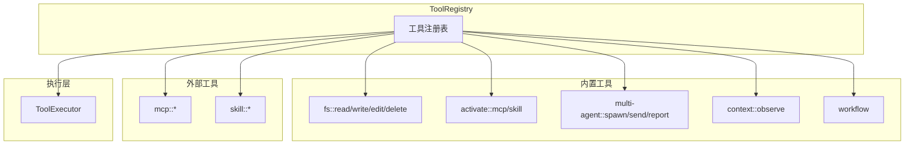
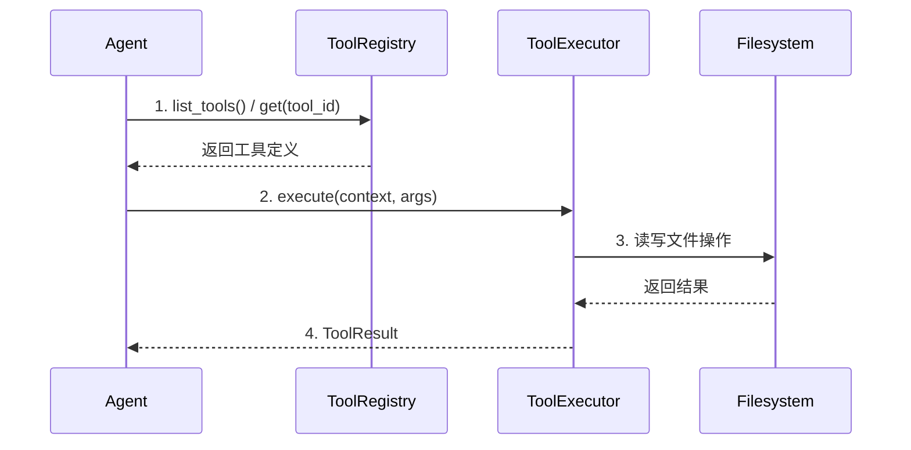
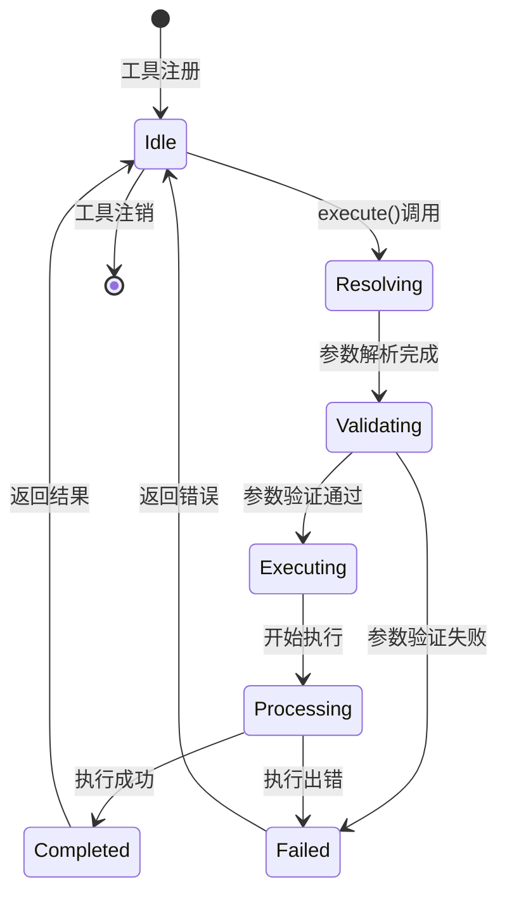

# TECH-TOOL: 工具模块

本文档描述NeoCo项目的工具模块设计，采用统一的工具接口设计。

## 1. 模块概述

工具模块提供Agent与外部系统交互的能力。

**设计原则：**
- 统一的工具执行接口（ToolExecutor）
- 工具注册表管理所有可用工具
- 工具定义与执行分离

## 2. 工具架构

### 2.1 工具系统架构



### 2.2 工具命名规范

| 工具 | 命名格式 | 示例 |
|------|----------|------|
| 文件系统 | `namespace::action` | `fs::read`, `fs::write` |
| MCP | `mcp::server_name` | `mcp::context7` |
| 多智能体 | `multi-agent::action` | `multi-agent::spawn` |
| 上下文 | `context::action` | `context::observe` |
| 工作流 | `workflow::action` | `workflow::pass`, `workflow::option` |
| 激活 | `activate::type` | `activate::skill` |

## 3. 工具接口设计

### 3.1 ToolExecutor Trait

```rust
/// 工具能力
#[derive(Debug, Clone, Default)]
pub struct ToolCapabilities {
    pub streaming: bool,
    pub requires_network: bool,
    pub resource_level: ResourceLevel,
    pub concurrent: bool,
}

#[derive(Debug, Clone, Copy, PartialEq, Eq, Default)]
pub enum ResourceLevel {
    #[default]
    Low,
    Medium,
    High,
}

/// 工具分类
#[derive(Debug, Clone, Copy, PartialEq, Eq, Default)]
pub enum ToolCategory {
    /// 通用工具，所有模式可用
    #[default]
    Common,
    /// TUI 专用工具，仅在 TUI 模式下生效
    Tui,
    /// CLI 专用工具，仅在 CLI 模式下生效
    Cli,
    /// Daemon 专用工具，仅在 Daemon 模式下生效
    Daemon,
}

/// 工具定义
#[derive(Debug, Clone)]
pub struct ToolDefinition {
    pub id: ToolId,
    pub description: String,
    /// JSON Schema 格式的参数定义
    /// 使用 JSON Schema Draft 2020-12 规范
    /// 参考：https://json-schema.org/draft/2020-12/schema
    pub schema: Value,
    pub capabilities: ToolCapabilities,
    pub timeout: Duration,
    /// 工具分类，影响工具的可用性
    pub category: ToolCategory,
}

/// 工具执行上下文
pub struct ToolContext {
    pub session_ulid: SessionUlid,
    pub agent_ulid: AgentUlid,
    pub working_dir: PathBuf,
}

/// 工具执行结果
#[derive(Debug, Clone)]
pub struct ToolResult {
    pub output: ToolOutput,
    pub is_error: bool,
}

#[derive(Debug, Clone)]
pub enum ToolOutput {
    Text(String),
    Json(Value),
    Binary(Vec<u8>),
    Empty,
}

/// 工具执行器Trait
#[async_trait]
pub trait ToolExecutor: Send + Sync {
    fn definition(&self) -> &ToolDefinition;
    
    async fn execute(
        &self,
        context: &ToolContext,
        args: Value,
    ) -> Result<ToolResult, ToolError>;
}
```

### 3.2 ToolRegistry Trait

```rust
/// 工具注册表Trait
#[async_trait]
pub trait ToolRegistry: Send + Sync {
    async fn register(&self, tool: Arc<dyn ToolExecutor>);
    
    fn get(&self, id: &ToolId) -> Option<Arc<dyn ToolExecutor>>;
    
    fn definitions(&self) -> Vec<ToolDefinition>;
    
    fn timeout(&self, id: &ToolId) -> Option<Duration>;
    
    fn set_timeout(&self, prefix: &str, duration: Duration);
    
    fn list_tools(&self) -> Vec<ToolId>;
}

/// 工具ID（静态命名空间标识符）
/// 格式：[namespace, name]（如 ["fs", "read"], ["multi-agent", "spawn"]）
/// 注意：工具ID是静态的，在工具注册时确定，不同于动态生成的ULID
#[derive(Debug, Clone, PartialEq, Eq, Hash, Serialize, Deserialize)]
pub struct ToolId(pub Vec<String>);

impl ToolId {
    pub fn new(namespace: impl Into<String>, name: impl Into<String>) -> Self {
        vec![namespace.into(), name.into()]
    }

    pub fn from_parts(namespace: &str, name: &str) -> Self {
        vec![namespace.to_string(), name.to_string()]
    }

    pub fn from_parts_validated(namespace: &str, name: &str) -> Result<Self, ToolError> {
        if !namespace.chars().all(|c| c.is_ascii_lowercase() || c.is_ascii_digit() || c == '-') {
            return Err(ToolError::InvalidArgs(format!(
                "Invalid namespace '{}': only lowercase letters, digits, and hyphens allowed",
                namespace
            )));
        }

        if !name.chars().all(|c| c.is_ascii_lowercase() || c.is_ascii_digit() || c == '-' || c == '_') {
            return Err(ToolError::InvalidArgs(format!(
                "Invalid name '{}': only lowercase letters, digits, hyphens, and underscores allowed",
                name
            )));
        }

        Ok(Self(vec![namespace.to_string(), name.to_string()]))
    }

    pub fn namespace(&self) -> Option<&str> {
        self.0.first().map(|s| s.as_str())
    }

    pub fn name(&self) -> Option<&str> {
        self.0.get(1).map(|s| s.as_str())
    }
}

/// 运行模式
#[derive(Debug, Clone, Copy, PartialEq, Eq, Default)]
pub enum RunMode {
    #[default]
    /// 命令行模式
    Cli,
    /// TUI交互模式
    Tui,
    /// 守护进程模式
    Daemon,
}

/// 资源调度器
pub trait ResourceScheduler: Send + Sync {
    fn can_execute(&self, level: ResourceLevel) -> bool;
    async fn acquire(&self, level: ResourceLevel) -> Result<(), ToolError>;
    fn release(&self, level: ResourceLevel);
}

/// 3.3 默认工具注册表实现

```rust
/// 默认工具注册表实现
pub struct DefaultToolRegistry {
    tools: RwLock<HashMap<ToolId, Arc<dyn ToolExecutor>>>,
    timeouts: RwLock<HashMap<String, Duration>>,
    run_mode: RwLock<RunMode>,
    resource_scheduler: Option<Arc<dyn ResourceScheduler>>,
}

impl DefaultToolRegistry {
    pub async fn new() -> Self {
        Self::new_with_scheduler(None).await
    }

    pub async fn new_with_scheduler(scheduler: Option<Arc<dyn ResourceScheduler>>) -> Self {
        let mut registry = Self {
            tools: RwLock::new(HashMap::new()),
            timeouts: RwLock::new(HashMap::new()),
            run_mode: RwLock::new(RunMode::default()),
            resource_scheduler: scheduler,
        };

        // 注册内置工具（按优先级排序）
        // 1. 核心工具（文件系统）：fs::read, fs::write, fs::edit, fs::delete, fs::list, fs::ls
        registry.register(Arc::new(FileReadTool));
        registry.register(Arc::new(FileWriteTool));
        registry.register(Arc::new(FileEditTool));
        registry.register(Arc::new(FileDeleteTool));
        registry.register(Arc::new(FileListTool));
        registry.register(Arc::new(FileLsTool::new()));  // fs::ls 别名
        
        // 2. 上下文工具：context::observe
        // 依赖注入方式：通过工厂函数或服务容器获取实例
        // 示例: let observer = ctx.container().resolve::<dyn ContextObserver>();
        let context_observer = create_context_observer().await;
        registry.register(Arc::new(ContextObserveTool::new(context_observer)));
        
        // 2.1 上下文工具：context::compact
        // 依赖注入方式：通过工厂函数或服务容器获取实例
        // 示例: let compression = ctx.container().resolve::<CompressionService>();
        let compression_service = create_compression_service().await;
        registry.register(Arc::new(ContextCompactTool::new(compression_service)));
        
        // 3. 多智能体工具：multi-agent::spawn, multi-agent::send, multi-agent::report
        registry.register(Arc::new(MultiAgentSpawnTool));
        registry.register(Arc::new(MultiAgentSendTool));
        registry.register(Arc::new(MultiAgentReportTool));
        
        // 4. 激活工具：activate::skill, activate::mcp
        registry.register(Arc::new(ActivateSkillTool));
        registry.register(Arc::new(ActivateMcpTool));
        
        // 5. 工作流工具：workflow::pass, workflow::option
        registry.register(Arc::new(WorkflowOptionTool));
        registry.register(Arc::new(WorkflowPassTool));
        
        // 6. TUI工具：tui::question
        registry.register(Arc::new(QuestionAskTool));

        // 注意：MCP和Skill外部工具在运行时动态注册

        registry
    }
}

#[async_trait]
impl ToolRegistry for DefaultToolRegistry {
    async fn register(&self, tool: Arc<dyn ToolExecutor>) {
        let def = tool.definition();
        
        // 根据运行模式过滤工具
        if !self.should_register_for_mode(def.category) {
            return;
        }
        
        let mut tools = self.tools.write().await;
        tools.insert(def.id.clone(), tool);
    }
    
    async fn get(&self, id: &ToolId) -> Option<Arc<dyn ToolExecutor>> {
        self.tools.read().await.get(id).cloned()
    }
    
    async fn definitions(&self) -> Vec<ToolDefinition> {
        self.tools.read().await.values()
            .map(|tool| tool.definition().clone())
            .collect()
    }
    
    async fn timeout(&self, id: &ToolId) -> Option<Duration> {
        let tools = self.tools.read().await;
        if let Some(tool) = tools.get(id) {
            Some(tool.definition().timeout)
        } else {
            self.timeouts.read().await.get(id.0.as_str()).copied()
        }
    }
    
    async fn set_timeout(&self, prefix: &str, timeout: Duration) {
        self.timeouts.write().await.insert(prefix.to_string(), timeout);
    }
    
    async fn list_tools(&self) -> Vec<ToolId> {
        self.tools.read().await.keys().cloned().collect()
    }
}

/// 工具执行器封装器（添加资源级别调度控制）
pub struct ToolExecutorWrapper {
    inner: Arc<dyn ToolExecutor>,
    scheduler: Arc<dyn ResourceScheduler>,
}

impl ToolExecutorWrapper {
    pub fn new(inner: Arc<dyn ToolExecutor>, scheduler: Arc<dyn ResourceScheduler>) -> Self {
        Self { inner, scheduler }
    }
}

#[async_trait]
impl ToolExecutor for ToolExecutorWrapper {
    fn definition(&self) -> &ToolDefinition {
        self.inner.definition()
    }

    async fn execute(
        &self,
        context: &ToolContext,
        args: Value,
    ) -> Result<ToolResult, ToolError> {
        let level = self.definition().capabilities.resource_level;
        
        // 资源级别调度控制
        self.scheduler.acquire(level).await?;
        
        let result = self.inner.execute(context, args).await;
        
        self.scheduler.release(level);
        
        result
    }
}

/// 资源调度器默认实现
pub struct DefaultResourceScheduler {
    semaphores: RwLock<HashMap<ResourceLevel, Arc<Semaphore>>>,
}

impl DefaultResourceScheduler {
    pub fn new() -> Self {
        let mut semaphores = HashMap::new();
        semaphores.insert(ResourceLevel::Low, Arc::new(Semaphore::new(usize::MAX)));
        semaphores.insert(ResourceLevel::Medium, Arc::new(Semaphore::new(10)));
        semaphores.insert(ResourceLevel::High, Arc::new(Semaphore::new(1)));
        
        Self {
            semaphores: RwLock::new(semaphores),
        }
    }
}

impl Default for DefaultResourceScheduler {
    fn default() -> Self {
        Self::new()
    }
}

impl ResourceScheduler for DefaultResourceScheduler {
    fn can_execute(&self, level: ResourceLevel) -> bool {
        let semaphores = self.semaphores.read().unwrap();
        semaphores.get(&level)
            .map(|s| s.available_permits() > 0)
            .unwrap_or(false)
    }

    async fn acquire(&self, level: ResourceLevel) -> Result<(), ToolError> {
        let semaphores = self.semaphores.read().unwrap();
        let semaphore = semaphores.get(&level)
            .ok_or_else(|| ToolError::Execution(std::io::Error::new(
                std::io::ErrorKind::NotFound,
                format!("Unknown resource level: {:?}", level)
            ).into()))?;
        
        // TODO: 使用 tokio::sync::Semaphore 获取许可
        // permit 会作为资源持有者，在 drop 时自动释放
        let _permit = semaphore.acquire().await
            .map_err(|_| ToolError::Execution("Failed to acquire resource permit".into()))?;
        
        // 持有 _permit 直到方法结束（资源级别调度控制）
        Ok(())
    }

    fn release(&self, level: ResourceLevel) {
        let semaphores = self.semaphores.read().unwrap();
        if let Some(semaphore) = semaphores.get(&level) {
            semaphore.release();
        }
    }
}

## 4. 文件系统工具

### 4.1 工具定义

| 工具 | 功能 | 超时 |
|------|------|------|
| `fs::read` | 读取文件内容 | 10秒 |
| `fs::write` | 写入文件（完全覆盖） | 10秒 |
| `fs::append` | 追加文件内容 | 10秒 |
| `fs::edit` | 编辑文件（基于verify） | 10秒 |
| `fs::delete` | 删除文件 | 10秒 |
| `fs::list` / `fs::ls` | 读取目录内容 | 10秒 |

### 4.2 fs::read 实现

```rust
pub mod fs {
    pub struct FileReadTool;
    
    #[async_trait]
    impl ToolExecutor for FileReadTool {
        fn definition(&self) -> &ToolDefinition {
            static DEF: Lazy<ToolDefinition> = Lazy::new(|| ToolDefinition {
                id: ToolId::new("fs", "read"),
                description: "读取文件内容".into(),
                schema: json!({
                    "type": "object",
                    "properties": {
                        "path": {
                            "type": "string",
                            "description": "文件路径"
                        },
                        "offset": {
                            "type": "integer",
                            "description": "起始行号（1-based）"
                        },
                        "limit": {
                            "type": "integer",
                            "description": "最大读取行数"
                        }
                    },
                    "required": ["path"]
                }),
                capabilities: ToolCapabilities::default(),
                timeout: Duration::from_secs(10),
                category: ToolCategory::Common,
            });
            &DEF
        }
        
        async fn execute(
            &self,
            context: &ToolContext,
            args: Value,
        ) -> Result<ToolResult, ToolError> {
            // TODO: 实现文件读取逻辑
            // 1. 从args中解析path为String
            // 2. 验证路径安全性：
            //    a. 使用std::fs::canonicalize规范化路径，解析所有符号链接和相对路径
            //    b. 确保规范化后的绝对路径以context.working_dir的规范化路径为前缀
            //    c. 防止路径遍历攻击（../）、符号链接逃逸、硬链接逃逸
            // 3. 调用std::fs::read_to_string读取文件内容
            // 4. 按行分割后应用offset和limit进行截取
            // 5. 返回包含文件内容的ToolResult
            unimplemented!()
        }
    }
}
```

### 4.3 fs::write 实现

```rust
pub struct FileWriteTool;
    
#[async_trait]
impl ToolExecutor for FileWriteTool {
    fn definition(&self) -> &ToolDefinition {
            static DEF: Lazy<ToolDefinition> = Lazy::new(|| ToolDefinition {
                id: ToolId::new("fs", "write"),
                description: "写入文件内容（完全覆盖）".into(),
            schema: json!({
                "type": "object",
                "properties": {
                    "path": { "type": "string" },
                    "content": { "type": "string" }
                },
                "required": ["path", "content"]
            }),
            capabilities: ToolCapabilities::default(),
            timeout: Duration::from_secs(10),
            category: ToolCategory::Common,
        });
        &DEF
    }
    
    async fn execute(
        &self,
        context: &ToolContext,
        args: Value,
    ) -> Result<ToolResult, ToolError> {
            // TODO: 实现文件写入逻辑
            // 1. 从args解析path和content
            // 2. 验证路径安全性：
            //    a. 使用std::fs::canonicalize规范化路径，解析所有符号链接和相对路径
            //    b. 确保规范化后的绝对路径以context.working_dir的规范化路径为前缀
            //    c. 防止路径遍历攻击（../）、符号链接逃逸、硬链接逃逸
            // 3. 检查父目录是否存在，不存在则创建
        // 4. 使用原子写入模式：写入临时文件后rename
        // 5. 返回写入成功的结果
        unimplemented!()
    }
}
```

### 4.3.1 fs::append 实现（追加写入）

```rust
pub struct FileAppendTool;
    
#[async_trait]
impl ToolExecutor for FileAppendTool {
    fn definition(&self) -> &ToolDefinition {
        static DEF: Lazy<ToolDefinition> = Lazy::new(|| ToolDefinition {
            id: ToolId::new("fs", "append"),
            description: "追加文件内容".into(),
            schema: json!({
                "type": "object",
                "properties": {
                    "path": { "type": "string" },
                    "content": { "type": "string" }
                },
                "required": ["path", "content"]
            }),
            capabilities: ToolCapabilities::default(),
            timeout: Duration::from_secs(10),
            category: ToolCategory::Common,
        });
        &DEF
    }
    
    async fn execute(
        &self,
        context: &ToolContext,
        args: Value,
    ) -> Result<ToolResult, ToolError> {
        // TODO: 实现文件追加写入逻辑
        // 1. 从args解析path和content
        // 2. 验证路径安全性（同fs::write）
        // 3. 打开文件并追加内容
        // 4. 返回写入成功的结果
        unimplemented!()
    }
}
```

### 4.4 fs::edit 实现（带verify）

```rust
pub struct FileEditTool;
    
#[async_trait]
impl ToolExecutor for FileEditTool {
    fn definition(&self) -> &ToolDefinition {
            static DEF: Lazy<ToolDefinition> = Lazy::new(|| ToolDefinition {
                id: ToolId::new("fs", "edit"),
                description: "基于verify编辑文件内容".into(),
            schema: json!({
                "type": "object",
                "properties": {
                    "path": { "type": "string" },
                    "verify": {
                        "type": "object",
                        "properties": {
                            "line": { "type": "integer" },
                            "content": { "type": "string" }
                        },
                        "required": ["line", "content"]
                    },
                    "new_content": { "type": "string" }
                },
                "required": ["path", "verify", "new_content"]
            }),
            capabilities: ToolCapabilities::default(),
            timeout: Duration::from_secs(10),
            category: ToolCategory::Common,
        });
        &DEF
    }
    
    async fn execute(
        &self,
        context: &ToolContext,
        args: Value,
    ) -> Result<ToolResult, ToolError> {
            // TODO: 实现文件编辑逻辑
            // 1. 解析参数：path, verify.line, verify.content, new_content
            // 2. 验证路径安全性：
            //    a. 使用std::fs::canonicalize规范化路径，解析所有符号链接和相对路径
            //    b. 确保规范化后的绝对路径以context.working_dir的规范化路径为前缀
            //    c. 防止路径遍历攻击（../）、符号链接逃逸、硬链接逃逸
            // 3. 读取文件全部内容，按行分割
            // 4. 定位到verify.line指定的行，调用verify_line_content进行验证
            // 5. 验证通过后，将new_content替换该行内容
            // 6. 使用原子写入方式保存修改后的文件
            // 7. 返回编辑成功的结果
        unimplemented!()
    }
}

/// Verify验证结果
#[derive(Debug, Clone, PartialEq)]
#[must_use = "VerifyResult must be handled"]
pub enum VerifyResult {
    ExactMatch,
    PrefixMatch,
    Mismatch,
    TooShort,
}

/// Verify验证配置
pub struct VerifyConfig {
    /// 前缀匹配的最小长度阈值
    pub prefix_match_threshold: usize,
}

impl Default for VerifyConfig {
    fn default() -> Self {
        Self {
            prefix_match_threshold: 20,
        }
    }
}

/// Verify验证
pub fn verify_line_content(
    actual: &str,
    expected: &str,
) -> VerifyResult {
    verify_line_content_with_config(actual, expected, &VerifyConfig::default())
}

/// 使用自定义配置的Verify验证
pub fn verify_line_content_with_config(
    actual: &str,
    expected: &str,
    config: &VerifyConfig,
) -> VerifyResult {
    // TODO: 实现verify验证逻辑
    // 1. 去除actual和expected的行尾换行符
    // 2. 如果actual和expected完全相等，返回ExactMatch
    // 3. 如果actual以expected开头且expected长度≥config.prefix_match_threshold，返回PrefixMatch
    // 4. 如果actual长度不足config.prefix_match_threshold且非完全匹配，返回TooShort
    // 5. 其他情况返回Mismatch
    unimplemented!()
}
```

### 4.5 fs::list / fs::ls 实现

> **别名实现方案**：采用双注册方案。`fs::list` 和 `fs::ls` 分别注册为独立工具，但共享同一执行逻辑。

```rust
/// 文件列表工具（主工具 fs::list）
pub struct FileListTool;

#[async_trait]
impl ToolExecutor for FileListTool {
    fn definition(&self) -> &ToolDefinition {
            static DEF: Lazy<ToolDefinition> = Lazy::new(|| ToolDefinition {
                id: ToolId::new("fs", "list"),
                description: "列出目录内容".into(),
            schema: json!({
                "type": "object",
                "properties": {
                    "path": {
                        "type": "string",
                        "description": "目录路径（默认为当前工作目录）"
                    },
                    "include_hidden": {
                        "type": "boolean",
                        "description": "是否包含隐藏文件（默认false）",
                        "default": false
                    }
                },
                "required": []
            }),
            capabilities: ToolCapabilities::default(),
            timeout: Duration::from_secs(10),
        });
        &DEF
    }
    
    async fn execute(
        &self,
        context: &ToolContext,
        args: Value,
    ) -> Result<ToolResult, ToolError> {
        // TODO: 实现目录列表逻辑
        // 1. 从args解析path（可选，默认为context.working_dir）
        // 2. 验证路径安全性（同fs::read）
        // 3. 调用std::fs::read_dir读取目录
        // 4. 构建目录条目列表：名称、类型、大小、修改时间
        // 5. 根据include_hidden过滤隐藏文件
        // 6. 返回目录内容
        unimplemented!()
    }
}

/// fs::ls 别名工具 - 复用 FileListTool 的执行逻辑
pub struct FileLsTool(FileListTool);

impl FileLsTool {
    pub fn new() -> Self {
        Self(FileListTool)
    }
}

#[async_trait]
impl ToolExecutor for FileLsTool {
    fn definition(&self) -> &ToolDefinition {
            static DEF: Lazy<ToolDefinition> = Lazy::new(|| ToolDefinition {
                id: ToolId::new("fs", "ls"),
                description: "列出目录内容（fs::list 的别名）".into(),
            schema: json!({
                "type": "object",
                "properties": {
                    "path": {
                        "type": "string",
                        "description": "目录路径（默认为当前工作目录）"
                    },
                    "include_hidden": {
                        "type": "boolean",
                        "description": "是否包含隐藏文件（默认false）",
                        "default": false
                    }
                },
                "required": []
            }),
            capabilities: ToolCapabilities::default(),
            timeout: Duration::from_secs(10),
        });
        &DEF
    }
    
    async fn execute(
        &self,
        context: &ToolContext,
        args: Value,
    ) -> Result<ToolResult, ToolError> {
        // 委托给 FileListTool 执行
        self.0.execute(context, args).await
    }
}
```

### 4.6 fs::delete 实现

```rust
pub struct FileDeleteTool;
    
#[async_trait]
impl ToolExecutor for FileDeleteTool {
    fn definition(&self) -> &ToolDefinition {
            static DEF: Lazy<ToolDefinition> = Lazy::new(|| ToolDefinition {
                id: ToolId::new("fs", "delete"),
                description: "删除文件".into(),
            schema: json!({
                "type": "object",
                "properties": {
                    "path": {
                        "type": "string",
                        "description": "要删除的文件路径"
                    }
                },
                "required": []
            }),
            capabilities: ToolCapabilities::default(),
            timeout: Duration::from_secs(10),
            category: ToolCategory::Common,
        });
        &DEF
    }
    
    async fn execute(
        &self,
        context: &ToolContext,
        args: Value,
    ) -> Result<ToolResult, ToolError> {
        // TODO: 实现文件/目录删除逻辑
        // 1. 从args解析path为String
        // 2. 验证路径安全性：
        //    a. 使用std::fs::canonicalize规范化路径，解析所有符号链接和相对路径
        //    b. 确保规范化后的绝对路径以context.working_dir的规范化路径为前缀
        //    c. 防止路径遍历攻击（../）、符号链接逃逸、硬链接逃逸
        // 3. 检查文件/目录是否存在
        // 4. 如果目标是目录，必须验证目录为空（ REQUIREMENT.md 规定）
        //    a. 使用std::fs::read_dir读取目录
        //    b. 如果目录中包含任何条目（文件、子目录），返回错误
        //    c. 仅当目录为空时，才调用std::fs::remove_dir删除目录
        // 5. 如果目标是文件，调用std::fs::remove_file删除文件
        // 6. 返回删除成功的结果
        unimplemented!()
    }
}
```

## 5. 上下文工具

> 上下文工具帮助 Agent 管理内存，遵循 Arena Allocator 心智模型。

### 5.1.1 工具定义

| 工具 | 功能 | 超时 |
|------|------|------|
| `context::observe` | 观测上下文状态，获取 Dashboard | 5秒 |
| `context::compact` | 主动压缩上下文（Layer A） | 30秒 |
| `tui::question` | 向用户提问（仅限TUI非no-ask模式） | 30秒 |

### 5.1.2 context::observe

```rust
impl ContextObserveTool {
    pub fn new(observer: Arc<dyn ContextObserver>) -> Self {
        Self { observer }
    }
}

pub struct ContextObserveTool {
    observer: Arc<dyn ContextObserver>,
}

impl ContextObserveTool {
    pub fn with_observer(observer: Arc<dyn ContextObserver>) -> Self {
        Self { observer }
    }
}

#[async_trait]
impl ToolExecutor for ContextObserveTool {
    fn definition(&self) -> &ToolDefinition {
            static DEF: Lazy<ToolDefinition> = Lazy::new(|| ToolDefinition {
                id: ToolId::new("context", "observe"),
                description: "观测上下文状态，获取内存使用仪表盘".into(),
            schema: json!({
                "type": "object",
                "properties": {
                    "filter": {
                        "type": "object",
                        "description": "可选的过滤条件"
                    }
                }
            }),
            capabilities: ToolCapabilities::default(),
            timeout: Duration::from_secs(5),
            category: ToolCategory::Common,
        });
        &DEF
    }
    
    async fn execute(
        &self,
        context: &ToolContext,
        args: Value,
    ) -> Result<ToolResult, ToolError> {
        // TODO: 实现上下文观测
        // 1. 从 args 解析 filter 参数
        // 2. 调用 ContextObserver 获取上下文状态
        // 3. 构建 Dashboard 返回：
        //    • Usage: xx% (used/total)
        //    • Steps since tag: xx
        //    • Pruning status: Stage X
        //    • Est. turns left: ~xx
        unimplemented!()
    }
}
```

### 5.1.3 tui::question

```rust
pub struct QuestionAskTool;

#[async_trait]
impl ToolExecutor for QuestionAskTool {
    fn definition(&self) -> &ToolDefinition {
            static DEF: Lazy<ToolDefinition> = Lazy::new(|| ToolDefinition {
                id: ToolId::new("tui", "question"),
                description: "向用户提问（仅限TUI非no-ask模式）".into(),
            schema: json!({
                "type": "object",
                "properties": {
                    "question": {
                        "type": "string",
                        "description": "要询问用户的问题"
                    },
                    "timeout": {
                        "type": "integer",
                        "description": "等待用户响应的超时时间（秒），默认30秒",
                        "default": 30
                    }
                },
                "required": ["question"]
            }),
            capabilities: ToolCapabilities::default(),
            timeout: Duration::from_secs(30),
            category: ToolCategory::Tui,
        });
        &DEF
    }
    
    async fn execute(
        &self,
        context: &ToolContext,
        args: Value,
    ) -> Result<ToolResult, ToolError> {
        // TODO: 实现向用户提问逻辑
        // 1. 从args解析question和timeout
        // 2. 检查当前运行模式是否为TUI且非no-ask模式
        // 3. 向用户显示问题并等待响应
        // 4. 返回用户的响应内容
        // 5. 超时时返回超时错误
        unimplemented!()
    }
}
```

**执行约束：**
- 仅在TUI交互模式下可用，且未启用 `--no-ask` 参数
- 在CLI或Agent模式下调用时返回 `ToolError::PermissionDenied` 错误
- 超时时间可通过timeout参数配置，默认30秒

### 5.1.4 context::compact

```rust
impl ContextCompactTool {
    pub fn new(compression_service: Arc<CompressionService>) -> Self {
        Self { compression_service }
    }
}

pub struct ContextCompactTool {
    compression_service: Arc<CompressionService>,
}

impl ContextCompactTool {
    pub fn with_service(compression_service: Arc<CompressionService>) -> Self {
        Self { compression_service }
    }
}

#[async_trait]
impl ToolExecutor for ContextCompactTool {
    fn definition(&self) -> &ToolDefinition {
            static DEF: Lazy<ToolDefinition> = Lazy::new(|| ToolDefinition {
                id: ToolId::new("context", "compact"),
                description: "主动压缩上下文，将历史消息压缩为摘要（Agent主动管理内存）".into(),
            schema: json!({
                "type": "object",
                "properties": {
                    "tag": {
                        "type": "string",
                        "description": "压缩起点标记，从该标记到当前位置的消息将被压缩"
                    }
                },
                "required": []
            }),
            capabilities: ToolCapabilities::default(),
            timeout: Duration::from_secs(5),
            category: ToolCategory::Common,
        });
        &DEF
    }
    
    async fn execute(
        &self,
        context: &ToolContext,
        args: Value,
    ) -> Result<ToolResult, ToolError> {
        // TODO: 实现上下文压缩 (Layer A: Agent 主动压缩)
        // 1. 从 args 解析 tag 参数
        // 2. 定位 tag 位置到当前位置的消息区间
        // 3. 调用 CompressionService 生成摘要
        // 4. 替换消息区间为 summary
        // 5. 保留原始历史（添加 backup tag）
        unimplemented!()
    }
}
```

## 6. 工具数据流



**数据流说明：**
1. Agent通过ToolRegistry获取可用工具列表或特定工具定义
2. Agent调用ToolExecutor的execute方法，传入执行上下文和参数
3. ToolExecutor执行具体的工具逻辑（如文件读写）
4. 工具执行完成后返回ToolResult给Agent

## 7. 工具执行状态机



**状态说明：**
| 状态 | 描述 |
|------|------|
| Idle | 工具空闲，可被调用 |
| Resolving | 正在解析参数 |
| Validating | 正在验证参数 |
| Executing | 正在执行工具逻辑 |
| Processing | 正在处理具体操作 |
| Completed | 执行成功完成 |
| Failed | 执行失败 |

**状态转换触发：**
- `execute()` 调用 → Resolving
- 参数解析完成 → Validating
- 验证通过 → Executing
- 验证失败 → Failed
- 执行完成 → Completed
- 执行出错 → Failed

## 8. 工具错误

```rust
#[derive(Debug, Error)]
pub enum ToolError {
    #[error("参数无效: {0}")]
    InvalidArgs(String),
    
    #[error("执行失败: {0}")]
    Execution(#[source] std::io::Error),
    
    #[error("超时")]
    Timeout,
    
    #[error("权限不足")]
    PermissionDenied,
    
    #[error("资源未找到")]
    NotFound,
    
    #[error("工具未找到: {0}")]
    NotFoundTool(String),
    
    #[error("需要确认")]
    ConfirmationRequired,
    
    #[error("序列化错误: {0}")]
    Serialization(#[from] serde_json::Error),
}

impl ToolError {
    pub fn is_retryable(&self) -> bool {
        matches!(self, Self::Timeout | Self::Execution(e) if e.kind() == std::io::ErrorKind::NotFound)
    }
}
```

## 19. JSON Schema 使用说明

### 规范版本
本项目使用 JSON Schema Draft 2020-12 规范定义工具参数。

### $schema 声明
建议在工具的 inputSchema 中添加 $schema 声明：
```json
{
    "$schema": "https://json-schema.org/draft/2020-12/schema",
    "type": "object",
    "properties": { ... }
}
```

### 建议添加的字段
- `title`: 人类可读的名称
- `description`: 详细描述
- `examples`: 参数示例

---

*关联文档：*
- [TECH.md](TECH.md) - 总体架构文档
- [TECH-SESSION.md](TECH-SESSION.md) - Session管理模块
- [TECH-AGENT.md](TECH-AGENT.md) - Agent模块
- [TECH-MCP.md](TECH-MCP.md) - MCP模块
- [TECH-SKILL.md](TECH-SKILL.md) - Skills模块
