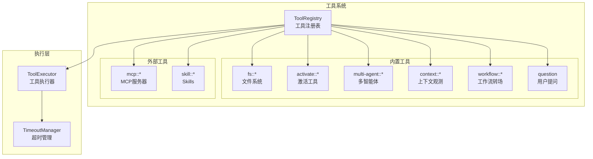

# TECH-TOOL: 工具模块

本文档描述Neco项目的工具模块设计，包括工具注册、调用和各类工具的实现。

## 1. 模块概述

工具模块提供Agent与外部系统交互的能力，包括文件系统操作、MCP调用、多智能体通信等功能。

## 2. 工具架构

### 2.1 工具系统架构



### 2.2 工具命名规范

工具名统一使用 `::` 作为分隔符，格式为：`namespace::action` 或 `namespace::name::action`。

| 工具 | 命名格式 | 示例 |
|------|----------|------|
| 文件系统 | `fs::action` | `fs::read`, `fs::write` |
| MCP | `mcp::server_name` | `mcp::context7` |
| 多智能体 | `multi-agent::action` | `multi-agent::spawn` |
| 上下文观测 | `context::action` | `context::observe` |
| 工作流 | `workflow::option` | `workflow::approve` |
| 激活 | `activate::type` | `activate::mcp`, `activate::skill` |

## 3. 核心Trait设计

### 3.1 ToolProvider Trait

```rust
use async_trait::async_trait;
use serde_json::Value;

/// 工具提供者接口
#[async_trait]
pub trait ToolProvider: Send + Sync {
    /// 工具名称
    fn name(&self) -> &str;
    
    /// 工具描述
    fn description(&self) -> &str;
    
    /// JSON Schema格式的参数定义
    fn parameters_schema(&self) -> Value;
    
    /// 执行工具
    async fn execute(
        &self,
        args: Value,
    ) -> Result<ToolResult, ToolError>;
    
    /// 工具超时时间（默认30秒）
    fn timeout(&self) -> Duration {
        Duration::from_secs(30)
    }
    
    /// 是否需要用户确认（危险操作）
    fn requires_confirmation(&self) -> bool {
        false
    }
}

/// 工具执行结果
#[derive(Debug, Clone)]
pub struct ToolResult {
    /// 输出内容
    pub output: String,
    
    /// 结构化数据（可选）
    pub data: Option<Value>,
    
    /// 是否成功
    pub is_error: bool,
}

/// 工具错误
#[derive(Debug, Error)]
pub enum ToolError {
    #[error("参数无效: {0}")]
    InvalidArgs(String),
    
    #[error("执行失败: {0}")]
    Execution(String),
    
    #[error("超时")]
    Timeout,
    
    #[error("权限不足")]
    PermissionDenied,
    
    #[error("资源未找到")]
    NotFound,
    
    #[error("工具未找到")]
    ToolNotFound(String),
    
    #[error("需要用户确认")]
    ConfirmationRequired,
    
    #[error("用户取消")]
    UserCancelled,
    
    #[error("序列化错误: {0}")]
    Serialization(#[from] serde_json::Error),
    
    #[error("内部错误: {0}")]
    Internal(String),
}
```

### 3.2 工具注册表

```rust
/// 工具注册表
pub struct ToolRegistry {
    /// 工具映射（使用Arc支持跨线程共享）
    tools: HashMap<String, Arc<dyn ToolProvider>>,
    
    /// 超时配置（按工具前缀）
    timeout_overrides: HashMap<String, Duration>,
}

impl ToolRegistry {
    /// 创建空注册表
    pub fn new() -> Self {
        Self {
            tools: HashMap::new(),
            timeout_overrides: HashMap::new(),
        }
    }
    
    /// 注册工具
    pub fn register(
        &mut self,
        tool: Arc<dyn ToolProvider>,
    ) {
        let name = tool.name().to_string();
        self.tools.insert(name, tool);
    }
    
    /// 获取工具
    pub fn get(&self, name: &str) -> Option<&dyn ToolProvider> {
        self.tools.get(name).map(|t| t.as_ref())
    }
    
    /// 获取所有工具定义（用于模型）
    pub fn get_tool_definitions(&self,
    ) -> Vec<ToolDefinition> {
        self.tools.values()
            .map(|t| ToolDefinition {
                name: t.name().to_string(),
                description: t.description().to_string(),
                parameters: t.parameters_schema(),
            })
            .collect()
    }
    
    /// 获取工具超时（最长前缀匹配）
    pub fn get_timeout(&self,
        tool_name: &str,
    ) -> Duration {
        let mut best_match: Option<(&str, Duration)> = None;
        
        for (prefix, duration) in &self.timeout_overrides {
            if tool_name.starts_with(prefix) {
                if best_match.map_or(true, |(best, _)| prefix.len() > best.len()) {
                    best_match = Some((prefix, *duration));
                }
            }
        }
        
        // 如果没有配置，使用工具自身的超时
        if let Some((_, duration)) = best_match {
            return duration;
        }
        
        if let Some(tool) = self.get(tool_name) {
            return tool.timeout();
        }
        
        Duration::from_secs(30) // 默认30秒
    }
    
    /// 配置超时
    pub fn set_timeout(
        &mut self,
        prefix: &str,
        duration: Duration,
    ) {
        self.timeout_overrides.insert(
            prefix.to_string(),
            duration
        );
    }
}

/// 工具定义（用于发送给模型）
#[derive(Debug, Clone, Serialize)]
pub struct ToolDefinition {
    pub name: String,
    pub description: String,
    pub parameters: Value,
}
```

## 4. 文件系统工具

### 4.1 工具概述

| 工具 | 功能 | 超时 |
|------|------|------|
| `fs::read` | 读取文件内容 | 5秒 |
| `fs::write` | 写入文件（完全覆盖） | 10秒 |
| `fs::edit` | 编辑文件（基于verify） | 10秒 |
| `fs::delete` | 删除文件 | 5秒 |

### 4.2 fs::read 实现

```rust
/// 文件读取工具
pub struct FileReadTool;

impl ToolProvider for FileReadTool {
    fn name(&self) -> &str {
        "fs::read"
    }
    
    fn description(&self) -> &str {
        "读取文件内容（内容可用于后续verify验证）"
    }
    
    fn parameters_schema(&self) -> Value {
        json!({
            "type": "object",
            "properties": {
                "path": {
                    "type": "string",
                    "description": "文件路径（相对或绝对）"
                },
                "offset": {
                    "type": "integer",
                    "description": "起始行号（1-based，可选）"
                },
                "limit": {
                    "type": "integer",
                    "description": "最大读取行数（可选）"
                }
            },
            "required": ["path"]
        })
    }
    
    fn timeout(&self) -> Duration {
        Duration::from_secs(5)
    }
    
    async fn execute(
        &self,
        args: Value,
    ) -> Result<ToolResult, ToolError> {
        // TODO: 实现文件读取逻辑
        // 1. 解析路径参数
        // 2. 应用offset和limit参数
        // 3. 读取文件内容
        // 4. 返回结果
        unimplemented!()
    }
}

/// Verify验证
/// 返回 VerifyResult 枚举以提供更丰富的验证结果信息
fn verify_line_content(
    actual_line: &str,
    verify_content: &str,
) -> VerifyResult {
    // TODO: 实现Verify验证逻辑
    // 1. 去除行尾换行符（统一LF和CRLF）
    // 2. 检查完全匹配或前缀匹配（≥20字符）
    //    - 完全匹配 -> ExactMatch
    //    - 前缀匹配（内容≥20字符）-> PrefixMatch
    //    - 内容不足20字符且非完全匹配 -> TooShort
    // 3. 处理编码问题（降级为字节匹配）-> EncodingError
    // 4. 以上都不满足 -> Mismatch
    unimplemented!()
}

/// Verify验证结果枚举
/// 用于提供更丰富的验证结果信息
#[derive(Debug, Clone, PartialEq)]
pub enum VerifyResult {
    /// 完全匹配
    ExactMatch,
    /// 前缀匹配（内容≥20字符）
    PrefixMatch,
    /// 不匹配
    Mismatch,
    /// 内容长度不足20字符且非完全匹配
    TooShort,
    /// 编码错误
    EncodingError,
}
```

### 4.3 fs::edit 实现

```rust
/// 文件编辑工具
pub struct FileEditTool;

impl ToolProvider for FileEditTool {
    fn name(&self) -> &str {
        "fs::edit"
    }
    
    fn description(&self) -> &str {
        "基于verify编辑文件内容"
    }
    
    fn parameters_schema(&self) -> Value {
        json!({
            "type": "object",
            "properties": {
                "path": {
                    "type": "string",
                    "description": "文件路径"
                },
                "verify": {
                    "type": "object",
                    "description": "行内容验证",
                    "properties": {
                        "line": {
                            "type": "integer",
                            "description": "要验证的行号"
                        },
                        "content": {
                            "type": "string",
                            "description": "该行内容（完全匹配或前缀匹配，≥20字符）"
                        }
                    },
                    "required": ["line", "content"]
                },
                "new_content": {
                    "type": "string",
                    "description": "替换的新内容"
                }
            },
            "required": ["path", "verify", "new_content"]
        })
    }
    
    fn timeout(&self) -> Duration {
        Duration::from_secs(10)
    }
    
    async fn execute(
        &self,
        args: Value,
    ) -> Result<ToolResult, ToolError> {
        // TODO: 实现文件编辑逻辑
        // 1. 解析路径、verify、新内容参数
        // 2. 读取当前文件内容
        // 3. 验证指定行的内容（verify）
        //    - 验证失败时返回 EditError::VerifyFailed，包含期望内容和实际内容
        // 4. 执行文件编辑和写入
        //    - 采用原子写入模式：先写入临时文件，然后 rename 替换原文件
        //    - 并发控制：写入前重新读取并比对内容，冲突时返回错误（可重试）
        unimplemented!()
    }
}

/// Verify验证处理
/// 
/// # 替换语义
/// - verify_line: 1-based 行号，指定要验证和替换的单行
/// - new_content: 替换该行的内容，可以包含多行（会展开文档）
/// 
/// # 验证逻辑
/// 调用 verify_line_content 获取 VerifyResult：
/// - ExactMatch / PrefixMatch: 验证通过，执行替换
/// - Mismatch / TooShort / EncodingError: 返回 EditError::VerifyFailed
fn verify_and_apply_edit(
    content: &str,
    verify_line: usize,
    verify_content: &str,
    new_content: &str,
) -> Result<String, EditError> {
    // TODO: 实现Verify验证编辑逻辑
    // 1. 按行分割内容
    // 2. 验证指定行内容（超出范围返回 EditError::LineOutOfRange）
    //    - 调用 verify_line_content(actual_line, verify_content) -> VerifyResult
    //    - 根据 VerifyResult 决定下一步：
    //      - ExactMatch / PrefixMatch: 继续执行替换
    //      - Mismatch / TooShort / EncodingError: 返回 EditError::VerifyFailed
    // 3. 替换该行为 new_content（new_content 可包含多行）
    // 4. 返回修改后的内容
    unimplemented!()
}

/// 文件编辑错误类型
#[derive(Debug, Error)]
pub enum EditError {
    /// 验证失败：行内容不匹配
    #[error("验证失败: 第{line}行不匹配\n期望: {expected}\n实际: {actual}")]
    VerifyFailed {
        line: usize,
        expected: String,
        actual: String,
    },
    
    /// 行号超出文件范围
    #[error("行号超出范围: {line}，文件共有{total}行")]
    LineOutOfRange {
        line: usize,
        total: usize,
    },
    
    /// IO错误
    #[error("IO错误: {0}")]
    Io(#[from] std::io::Error),
}
```

### 4.4 fs::write 实现

```rust
/// 文件写入工具（完全覆盖）
pub struct FileWriteTool;

impl ToolProvider for FileWriteTool {
    fn name(&self) -> &str {
        "fs::write"
    }
    
    fn description(&self) -> &str {
        "写入文件内容（完全覆盖）"
    }
    
    fn parameters_schema(&self) -> Value {
        json!({
            "type": "object",
            "properties": {
                "path": {
                    "type": "string",
                    "description": "文件路径"
                },
                "content": {
                    "type": "string",
                    "description": "文件内容"
                }
            },
            "required": ["path", "content"]
        })
    }
    
    fn requires_confirmation(&self) -> bool {
        true // 覆盖操作需要确认
    }
    
    async fn execute(
        &self,
        args: Value,
    ) -> Result<ToolResult, ToolError> {
        // TODO: 实现文件写入逻辑
        // 1. 解析路径和内容参数
        // 2. 确保父目录存在
        // 3. 执行文件写入（完全覆盖）
        // 4. 返回成功结果
        unimplemented!()
    }
}
```

## 5. activate工具

### 5.1 工具概述

`activate` 工具用于按需加载内容（提示词、工具、MCP、Skills）。

```rust
/// activate工具
pub struct ActivateTool {
    suffix: String,
    agent_manager: Arc<AgentManager>,
    mcp_manager: Arc<McpManager>,
    skill_manager: Arc<SkillManager>,
}

impl ToolProvider for ActivateTool {
    fn name(&self) -> &str {
        &self.suffix
    }
    
    fn description(&self) -> &str {
        "激活/加载内容（prompt、mcp、skill、tool）"
    }
    
    fn parameters_schema(&self) -> Value {
        json!({
            "type": "object",
            "properties": {
                "type": {
                    "type": "string",
                    "enum": ["prompt", "mcp", "skill", "tool"],
                    "description": "要激活的内容类型"
                },
                "name": {
                    "type": "string",
                    "description": "内容名称"
                }
            },
            "required": ["type", "name"]
        })
    }
    
    async fn execute(
        &self,
        args: Value,
    ) -> Result<ToolResult, ToolError> {
        // TODO: 实现内容激活逻辑
        // 1. 解析内容类型和名称参数
        // 2. 根据类型分发到对应的激活方法
        // 3. 处理未知内容类型错误
        unimplemented!()
    }
}

impl ActivateTool {
    pub fn new(suffix: &str) -> Self {
        Self {
            suffix: suffix.to_string(),
            agent_manager: Arc::new(AgentManager::new()),
            mcp_manager: Arc::new(McpManager::new()),
            skill_manager: Arc::new(SkillManager::new()),
        }
    }

    pub async fn activate_skill(
        &self,
        name: &str,
    ) -> Result<ToolResult, ToolError> {
        // TODO: 实现Skill激活逻辑
        // 1. 加载Skill内容
        // 2. 添加Skill提示词到Agent
        // 3. 返回激活结果
        unimplemented!()
    }
    
    // ... 其他激活方法
}
```

## 6. context工具

### 6.1 工具概述

| 工具 | 功能 | 超时 |
|------|------|------|
| `context::observe` | 查看当前上下文的详细信息 | 5秒 |

### 6.2 context::observe 接口

```rust
/// 上下文观测工具
pub struct ContextObserveTool {
    observation_service: Arc<ContextObservationService>,
}

impl ContextObserveTool {
    /// 创建观测工具
    pub fn new(observation_service: Arc<ContextObservationService>) -> Self {
        Self { observation_service }
    }
}

impl ToolProvider for ContextObserveTool {
    fn name(&self) -> &str {
        "context::observe"
    }
    
    fn description(&self) -> &str {
        "查看当前上下文的详细信息，包括消息列表、统计信息和内容分组"
    }
    
    fn parameters_schema(&self) -> Value {
        json!({
            "type": "object",
            "properties": {
                "roles": {
                    "type": "array",
                    "items": {"type": "string", "enum": ["system", "user", "assistant", "tool"]},
                    "description": "只显示指定角色的消息"
                },
                "min_id": {"type": "integer", "description": "最小消息ID"},
                "max_id": {"type": "integer", "description": "最大消息ID"},
                "with_tool_calls": {"type": "boolean", "description": "是否只显示包含工具调用的消息"},
                "sort": {
                    "type": "string",
                    "enum": ["id_asc", "id_desc", "size_asc", "size_desc", "time_asc", "time_desc"],
                    "description": "排序方式"
                },
                "format": {
                    "type": "string",
                    "enum": ["table", "json", "summary"],
                    "description": "输出格式"
                }
            }
        })
    }
    
    fn timeout(&self) -> Duration {
        Duration::from_secs(5)
    }

    async fn execute(&self, args: Value) -> Result<ToolResult, ToolError>;
}
```

### 6.3 参数Schema

```json
{
  "type": "object",
  "properties": {
    "roles": {
      "type": "array",
      "items": {"type": "string", "enum": ["system", "user", "assistant", "tool"]},
      "description": "只显示指定角色的消息"
    },
    "min_id": {"type": "integer", "description": "最小消息ID"},
    "max_id": {"type": "integer", "description": "最大消息ID"},
    "with_tool_calls": {"type": "boolean", "description": "是否只显示包含工具调用的消息"},
    "sort": {
      "type": "string",
      "enum": ["id_asc", "id_desc", "size_asc", "size_desc", "time_asc", "time_desc"],
      "description": "排序方式"
    },
    "format": {
      "type": "string",
      "enum": ["table", "json", "summary"],
      "description": "输出格式"
    }
  }
}
```

### 6.4 输出格式示例

#### table格式（默认）

```
## 上下文统计

- 总消息数: 15
- 总字符数: 12,458
- 总token数: 3,245
- 使用率: 2.5%

## 消息列表

| ID | 角色      | 大小   | Token | 预览                          |
|----|-----------|--------|-------|-------------------------------|
| 1  | system    | 1,245  | 320   | You are a helpful AI...      |
| 2  | user      | 156    | 40    | Hello, how are you?          |
| 3  | assistant | 892    | 230   | I'm doing well, thank you... |
| 4  | user      | 234    | 60    | What can you help me with?   |
```

#### summary格式

```
# 上下文摘要

当前上下文共有 15 条消息，总计 3,245 tokens，使用率为 2.5%

## 按角色分组

系统提示词: 2 条
用户消息: 6 条
助手消息: 5 条
工具返回: 2 条
```

#### json格式

```json
{
  "agent_ulid": "01HF8X5JQC8",
  "statistics": {
    "total_messages": 15,
    "total_chars": 12458,
    "total_tokens": 3245,
    "usage_percentage": 2.5
  },
  "messages": [
    {
      "id": 1,
      "role": "system",
      "char_count": 1245,
      "estimated_tokens": 320,
      "timestamp": "2026-03-06T10:00:00Z"
    }
  ]
}
```

## 7. question工具

```rust
/// 用户提问工具（仅限REPL模式）
pub struct QuestionTool {
    ui_handle: Arc<dyn UiHandle>,
}

impl ToolProvider for QuestionTool {
    fn name(&self) -> &str {
        "question"
    }
    
    fn description(&self) -> &str {
        "向用户提问（仅限REPL模式，no-ask模式不可用）"
    }
    
    fn parameters_schema(&self) -> Value {
        json!({
            "type": "object",
            "properties": {
                "question": {
                    "type": "string",
                    "description": "问题内容"
                },
                "options": {
                    "type": "array",
                    "items": { "type": "string" },
                    "description": "选项列表（可选，单选）"
                }
            },
            "required": ["question"]
        })
    }
    
    async fn execute(
        &self,
        args: Value,
    ) -> Result<ToolResult, ToolError> {
        // TODO: 实现用户提问逻辑
        // 1. 解析问题内容和选项参数
        // 2. 通过UI向用户提问
        // 3. 获取用户回答
        // 4. 返回结果
        unimplemented!()
    }
}
```

## 8. 工具执行器

### 8.1 执行流程

```rust
/// 工具执行器
pub struct ToolExecutor {
    registry: Arc<ToolRegistry>,
}

impl ToolExecutor {
    /// 执行工具
    pub async fn execute(
        &self,
        tool_call: &ToolCall,
    ) -> Result<ToolResult, ToolError> {
        // TODO: 实现工具执行逻辑
        // 1. 解析工具名称和参数
        // 2. 从注册表查找工具
        // 3. 获取工具超时配置
        // 4. 检查是否需要用户确认
        // 5. 执行工具（带超时处理）
        unimplemented!()
    }
    
    /// 并行执行多个工具
    pub async fn execute_parallel(
        &self,
        tool_calls: Vec<ToolCall>,
    ) -> Vec<Result<ToolResult, ToolError>> {
        let futures: Vec<_> = tool_calls
            .into_iter()
            .map(|tc| self.execute(&tc))
            .collect();
        
        join_all(futures).await
    }
}
```

---

*关联文档：*
- [TECH.md](TECH.md) - 总体架构文档
- [TECH-MCP.md](TECH-MCP.md) - MCP模块
- [TECH-SKILL.md](TECH-SKILL.md) - Skills模块
