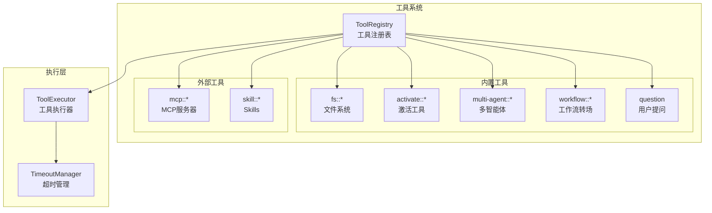

# TECH-TOOL: 工具模块

本文档描述Neco项目的工具模块设计，包括工具注册、调用和各类工具的实现。

## 1. 模块概述

工具模块提供Agent与外部系统交互的能力，包括文件系统操作、MCP调用、多智能体通信等功能。

## 2. 工具架构

### 2.1 工具系统架构



### 2.2 工具命名规范

工具名统一使用 `::` 作为分隔符，格式为：`namespace::action` 或 `namespace::name::action`。

| 工具 | 命名格式 | 示例 |
|-----|---------|------|
| 文件系统 | `fs::action` | `fs::read`, `fs::write` |
| MCP | `mcp::server_name` | `mcp::context7` |
| 多智能体 | `multi-agent::action` | `multi-agent::spawn` |
| 工作流 | `workflow::option` | `workflow::approve` |
| 激活 | `activate::type` | `activate::mcp`, `activate::skill` |

## 3. 核心Trait设计

### 3.1 ToolProvider Trait

```rust
use async_trait::async_trait;
use serde_json::Value;

/// 工具提供者接口
#[async_trait]
pub trait ToolProvider: Send + Sync {
    /// 工具名称
    fn name(&self) -> &str;
    
    /// 工具描述
    fn description(&self) -> &str;
    
    /// JSON Schema格式的参数定义
    fn parameters_schema(&self) -> Value;
    
    /// 执行工具
    async fn execute(
        &self,
        args: Value,
    ) -> Result<ToolResult, ToolError>;
    
    /// 工具超时时间（默认30秒）
    fn timeout(&self) -> Duration {
        Duration::from_secs(30)
    }
    
    /// 是否需要用户确认（危险操作）
    fn requires_confirmation(&self) -> bool {
        false
    }
}

/// 工具执行结果
#[derive(Debug, Clone)]
pub struct ToolResult {
    /// 输出内容
    pub output: String,
    
    /// 结构化数据（可选）
    pub data: Option<Value>,
    
    /// 是否成功
    pub is_error: bool,
}

/// 工具错误
#[derive(Debug, Error)]
pub enum ToolError {
    #[error("参数无效: {0}")]
    InvalidArgs(String),
    
    #[error("执行失败: {0}")]
    Execution(String),
    
    #[error("超时")]
    Timeout,
    
    #[error("权限不足")]
    PermissionDenied,
    
    #[error("资源未找到")]
    NotFound,
    
    #[error("内部错误: {0}")]
    Internal(String),
}
```

### 3.2 工具注册表

```rust
/// 工具注册表
pub struct ToolRegistry {
    /// 工具映射
    tools: HashMap<String, Box<dyn ToolProvider>>,
    
    /// 超时配置（按工具前缀）
    timeout_overrides: HashMap<String, Duration>,
}

impl ToolRegistry {
    /// 创建空注册表
    pub fn new() -> Self {
        Self {
            tools: HashMap::new(),
            timeout_overrides: HashMap::new(),
        }
    }
    
    /// 注册工具
    pub fn register(
        &mut self,
        tool: Box<dyn ToolProvider>,
    ) {
        let name = tool.name().to_string();
        self.tools.insert(name, tool);
    }
    
    /// 获取工具
    pub fn get(&self, name: &str) -> Option<&dyn ToolProvider> {
        self.tools.get(name).map(|t| t.as_ref())
    }
    
    /// 获取所有工具定义（用于模型）
    pub fn get_tool_definitions(&self,
    ) -> Vec<ToolDefinition> {
        self.tools.values()
            .map(|t| ToolDefinition {
                name: t.name().to_string(),
                description: t.description().to_string(),
                parameters: t.parameters_schema(),
            })
            .collect()
    }
    
    /// 获取工具超时（最长前缀匹配）
    pub fn get_timeout(&self,
        tool_name: &str,
    ) -> Duration {
        let mut best_match: Option<(&str, Duration)> = None;
        
        for (prefix, duration) in &self.timeout_overrides {
            if tool_name.starts_with(prefix) {
                if best_match.map_or(true, |(best, _)| prefix.len() > best.len()) {
                    best_match = Some((prefix, *duration));
                }
            }
        }
        
        // 如果没有配置，使用工具自身的超时
        if let Some((_, duration)) = best_match {
            return duration;
        }
        
        if let Some(tool) = self.get(tool_name) {
            return tool.timeout();
        }
        
        Duration::from_secs(30) // 默认30秒
    }
    
    /// 配置超时
    pub fn set_timeout(
        &mut self,
        prefix: &str,
        duration: Duration,
    ) {
        self.timeout_overrides.insert(
            prefix.to_string(),
            duration
        );
    }
}

/// 工具定义（用于发送给模型）
#[derive(Debug, Clone, Serialize)]
pub struct ToolDefinition {
    pub name: String,
    pub description: String,
    pub parameters: Value,
}
```

## 4. 文件系统工具

### 4.1 工具概述

| 工具 | 功能 | 超时 |
|-----|------|------|
| `fs::read` | 读取文件内容 | 5秒 |
| `fs::write` | 写入文件（完全覆盖） | 10秒 |
| `fs::edit` | 编辑文件（基于行哈希） | 10秒 |
| `fs::delete` | 删除文件 | 5秒 |

### 4.2 fs::read 实现

```rust
/// 文件读取工具
pub struct FileReadTool;

impl ToolProvider for FileReadTool {
    fn name(&self) -> &str {
        "fs::read"
    }
    
    fn description(&self) -> &str {
        "读取文件内容，返回带有Hashline的内容"
    }
    
    fn parameters_schema(&self) -> Value {
        json!({
            "type": "object",
            "properties": {
                "path": {
                    "type": "string",
                    "description": "文件路径（相对或绝对）"
                },
                "offset": {
                    "type": "integer",
                    "description": "起始行号（1-based，可选）"
                },
                "limit": {
                    "type": "integer",
                    "description": "最大读取行数（可选）"
                }
            },
            "required": ["path"]
        })
    }
    
    fn timeout(&self) -> Duration {
        Duration::from_secs(5)
    }
    
    async fn execute(
        &self,
        args: Value,
    ) -> Result<ToolResult, ToolError> {
        // TODO: 实现文件读取逻辑
        // 1. 解析路径参数
        // 2. 应用offset和limit参数
        // 3. 读取文件内容
        // 4. 应用Hashline标记
        // 5. 返回结果
        unimplemented!()
    }
}

/// Hashline应用
fn apply_hashline(
    content: &str,
    offset: usize,
    limit: Option<usize>,
) -> String {
    let lines: Vec<&str> = content.lines().collect();
    let start = offset.saturating_sub(1);
    let end = limit.map(|l| (start + l).min(lines.len()))
        .unwrap_or(lines.len());
    
    let mut result = String::new();
    
    for (i, line) in lines[start..end].iter().enumerate() {
        let line_num = start + i + 1;
        let hash = compute_line_hash(content, line_num);
        result.push_str(&format!("{}|{}\n", hash, line));
    }
    
    result
}

/// 计算行哈希
fn compute_line_hash(content: &str, line_num: usize) -> String {
    let lines: Vec<&str> = content.lines().collect();
    
    // 获取第 MAX(N-4,1) 行到第 N 行的内容窗口
    let window_start = line_num.saturating_sub(5);
    let window: Vec<&str> = lines[window_start..line_num]
        .to_vec();
    
    let window_content = window.join("\n");
    
    // 使用xxHash
    let mut seed = 0u64;
    loop {
        let hash = xxhash_rust::xxh3::xxh3_64_with_seed(
            window_content.as_bytes(),
            seed
        );
        
        let hash_str = format!("{:04X}", hash & 0xFFFF);
        
        // 检查冲突（需要在文件范围内检查）
        // 简化：假设无冲突
        return hash_str;
    }
}
```

### 4.3 fs::edit 实现

```rust
/// 文件编辑工具
pub struct FileEditTool;

impl ToolProvider for FileEditTool {
    fn name(&self) -> &str {
        "fs::edit"
    }
    
    fn description(&self) -> &str {
        "基于行哈希编辑文件内容"
    }
    
    fn parameters_schema(&self) -> Value {
        json!({
            "type": "object",
            "properties": {
                "path": {
                    "type": "string",
                    "description": "文件路径"
                },
                "start_hash": {
                    "type": "string",
                    "description": "开始行的哈希值"
                },
                "end_hash": {
                    "type": "string",
                    "description": "结束行的哈希值"
                },
                "new_content": {
                    "type": "string",
                    "description": "替换的新内容"
                }
            },
            "required": ["path", "start_hash", "end_hash", "new_content"]
        })
    }
    
    fn timeout(&self) -> Duration {
        Duration::from_secs(10)
    }
    
    async fn execute(
        &self,
        args: Value,
    ) -> Result<ToolResult, ToolError> {
        // TODO: 实现文件编辑逻辑
        // 1. 解析路径、起始/结束哈希、新内容参数
        // 2. 读取当前文件内容
        // 3. 查找哈希匹配的位置
        // 4. 处理唯一匹配/多个匹配/无匹配情况
        // 5. 执行文件编辑和写入
        unimplemented!()
    }
}

/// 查找哈希匹配位置
fn find_hash_matches(
    content: &str,
    start_hash: &str,
    end_hash: &str,
) -> Vec<(usize, usize)> {
    let mut matches = Vec::new();
    let lines: Vec<&str> = content.lines().collect();
    
    // 查找所有可能的开始位置
    for i in 0..lines.len() {
        let computed_hash = compute_line_hash(content, i + 1);
        if computed_hash == start_hash {
            // 查找对应的结束位置
            for j in i..lines.len() {
                let end_computed = compute_line_hash(content, j + 1);
                if end_computed == end_hash {
                    matches.push((i, j));
                    break;
                }
            }
        }
    }
    
    matches
}
```

### 4.4 fs::write 实现

```rust
/// 文件写入工具（完全覆盖）
pub struct FileWriteTool;

impl ToolProvider for FileWriteTool {
    fn name(&self) -> &str {
        "fs::write"
    }
    
    fn description(&self) -> &str {
        "写入文件内容（完全覆盖）"
    }
    
    fn parameters_schema(&self) -> Value {
        json!({
            "type": "object",
            "properties": {
                "path": {
                    "type": "string",
                    "description": "文件路径"
                },
                "content": {
                    "type": "string",
                    "description": "文件内容"
                }
            },
            "required": ["path", "content"]
        })
    }
    
    fn requires_confirmation(&self) -> bool {
        true // 覆盖操作需要确认
    }
    
    async fn execute(
        &self,
        args: Value,
    ) -> Result<ToolResult, ToolError> {
        // TODO: 实现文件写入逻辑
        // 1. 解析路径和内容参数
        // 2. 确保父目录存在
        // 3. 执行文件写入（完全覆盖）
        // 4. 返回成功结果
        unimplemented!()
    }
}
```

## 5. activate工具

### 5.1 工具概述

`activate` 工具用于按需加载内容（提示词、工具、MCP、Skills）。

```rust
/// activate工具
pub struct ActivateTool {
    agent_manager: Arc<AgentManager>,
    mcp_manager: Arc<McpManager>,
    skill_manager: Arc<SkillManager>,
}

impl ToolProvider for ActivateTool {
    fn name(&self) -> &str {
        "activate"
    }
    
    fn description(&self) -> &str {
        "激活/加载内容（prompt、mcp、skill、tool）"
    }
    
    fn parameters_schema(&self) -> Value {
        json!({
            "type": "object",
            "properties": {
                "type": {
                    "type": "string",
                    "enum": ["prompt", "mcp", "skill", "tool"],
                    "description": "要激活的内容类型"
                },
                "name": {
                    "type": "string",
                    "description": "内容名称"
                }
            },
            "required": ["type", "name"]
        })
    }
    
    async fn execute(
        &self,
        args: Value,
    ) -> Result<ToolResult, ToolError> {
        // TODO: 实现内容激活逻辑
        // 1. 解析内容类型和名称参数
        // 2. 根据类型分发到对应的激活方法
        // 3. 处理未知内容类型错误
        unimplemented!()
    }
}

impl ActivateTool {
    async fn activate_mcp(
        &self,
        name: &str,
    ) -> Result<ToolResult, ToolError> {
        // 解析MCP服务器配置名称
        let server_name = name.replace("::", "-");
        
        // 启动MCP服务器
        let tools = self.mcp_manager
            .connect_server(&server_name)
            .await
            .map_err(|e| ToolError::Execution(format!(
                "Failed to connect MCP server: {}", e
            )))?;
        
        // 注册MCP工具到Agent
        for tool in tools {
            let tool_id = format!("mcp::{}", tool.name);
            self.agent_manager.register_tool(tool_id, tool).await
                .map_err(|e| ToolError::Execution(format!(
                    "Failed to register tool: {}", e
                )))?;
        }
        
        Ok(ToolResult {
            output: format!(
                "Activated MCP server '{}' with {} tools",
                name,
                tools.len()
            ),
            data: Some(json!({
                "server": name,
                "tools_count": tools.len(),
            })),
            is_error: false,
        })
    }
    
    async fn activate_skill(
        &self,
        name: &str,
    ) -> Result<ToolResult, ToolError> {
        let skill = self.skill_manager
            .load_skill(name)
            .await
            .map_err(|e| ToolError::Execution(format!(
                "Failed to load skill: {}", e
            )))?;
        
        // 添加skill提示词
        self.agent_manager.add_skill_prompt(name, &skill)
            .await
            .map_err(|e| ToolError::Execution(format!(
                "Failed to add skill prompt: {}", e
            )))?;
        
        Ok(ToolResult {
            output: format!("Activated skill '{}'", name),
            data: None,
            is_error: false,
        })
    }
    
    // ... 其他激活方法
}
```

## 6. question工具

```rust
/// 用户提问工具（仅限REPL模式）
pub struct QuestionTool {
    ui_handle: Arc<dyn UiHandle>,
}

impl ToolProvider for QuestionTool {
    fn name(&self) -> &str {
        "question"
    }
    
    fn description(&self) -> &str {
        "向用户提问（仅限REPL模式，no-ask模式不可用）"
    }
    
    fn parameters_schema(&self) -> Value {
        json!({
            "type": "object",
            "properties": {
                "question": {
                    "type": "string",
                    "description": "问题内容"
                },
                "options": {
                    "type": "array",
                    "items": { "type": "string" },
                    "description": "选项列表（可选，单选）"
                }
            },
            "required": ["question"]
        })
    }
    
    async fn execute(
        &self,
        args: Value,
    ) -> Result<ToolResult, ToolError> {
        // TODO: 实现用户提问逻辑
        // 1. 解析问题内容和选项参数
        // 2. 通过UI向用户提问
        // 3. 获取用户回答
        // 4. 返回结果
        unimplemented!()
    }
}
```

## 7. 工具执行器

### 7.1 执行流程

```rust
/// 工具执行器
pub struct ToolExecutor {
    registry: Arc<ToolRegistry>,
}

impl ToolExecutor {
    /// 执行工具
    pub async fn execute(
        &self,
        tool_call: &ToolCall,
    ) -> Result<ToolResult, ToolError> {
        // TODO: 实现工具执行逻辑
        // 1. 解析工具名称和参数
        // 2. 从注册表查找工具
        // 3. 获取工具超时配置
        // 4. 检查是否需要用户确认
        // 5. 执行工具（带超时处理）
        unimplemented!()
    }
    
    /// 并行执行多个工具
    pub async fn execute_parallel(
        &self,
        tool_calls: Vec<ToolCall>,
    ) -> Vec<Result<ToolResult, ToolError>> {
        let futures: Vec<_> = tool_calls
            .into_iter()
            .map(|tc| self.execute(&tc))
            .collect();
        
        join_all(futures).await
    }
}
```

## 8. 错误处理

```rust
#[derive(Debug, Error)]
pub enum ToolError {
    #[error("参数无效: {0}")]
    InvalidArgs(String),
    
    #[error("执行失败: {0}")]
    Execution(String),
    
    #[error("超时")]
    Timeout,
    
    #[error("权限不足")]
    PermissionDenied,
    
    #[error("资源未找到")]
    NotFound,
    
    #[error("工具未找到")]
    ToolNotFound(String),
    
    #[error("需要用户确认")]
    ConfirmationRequired,
    
    #[error("用户取消")]
    UserCancelled,
    
    #[error("序列化错误: {0}")]
    Serialization(#[from] serde_json::Error),
    
    #[error("内部错误: {0}")]
    Internal(String),
}
```

---

*关联文档：*
- [TECH.md](TECH.md) - 总体架构文档
- [TECH-MCP.md](TECH-MCP.md) - MCP模块
- [TECH-SKILL.md](TECH-SKILL.md) - Skills模块
