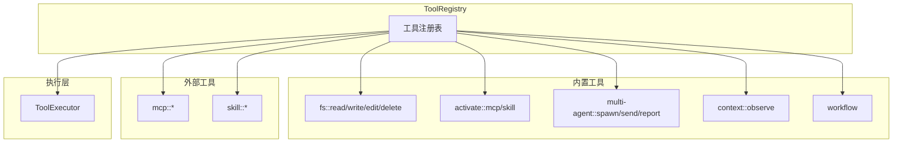

# TECH-TOOL: 工具模块

本文档描述Neco项目的工具模块设计，采用统一的工具接口设计。

## 1. 模块概述

工具模块提供Agent与外部系统交互的能力。

**设计原则：**
- 统一的工具执行接口（ToolExecutor）
- 工具注册表管理所有可用工具
- 工具定义与执行分离

## 2. 工具架构

### 2.1 工具系统架构



> **注意**：静态工具定义使用 `Lazy<ToolDefinition>` 模式，需要添加以下导入：
> ```rust
> use once_cell::sync::Lazy; // 或 std::sync::LazyLock (Rust 1.80+)
> ```

### 2.2 工具命名规范

| 工具 | 命名格式 | 示例 |
|------|----------|------|
| 文件系统 | `namespace::action` | `fs::read`, `fs::write` |
| MCP | `mcp::server_name` | `mcp::context7` |
| 多智能体 | `multi-agent::action` | `multi-agent::spawn` |
| 上下文 | `context::action` | `context::observe` |
| 工作流 | `workflow::option` | `workflow::approve` |
| 激活 | `activate::type` | `activate::skill` |

## 3. 工具接口设计

### 3.1 ToolExecutor Trait

```rust
/// 工具能力
#[derive(Debug, Clone, Default)]
pub struct ToolCapabilities {
    pub streaming: bool,
    pub requires_network: bool,
    pub resource_level: ResourceLevel,
    pub concurrent: bool,
}

#[derive(Debug, Clone, Copy, Default)]
pub enum ResourceLevel {
    #[default]
    Low,
    Medium,
    High,
}

/// 工具定义
#[derive(Debug, Clone)]
pub struct ToolDefinition {
    pub id: ToolId,
    pub description: String,
    pub schema: Value,
    pub capabilities: ToolCapabilities,
    pub timeout: Duration,
}

/// 工具执行上下文
pub struct ToolContext {
    pub session_id: SessionId,
    pub agent_id: AgentId,
    pub working_dir: PathBuf,
}

/// 工具执行结果
/// 
/// 注意：不包含 `is_error` 字段，因为 `execute` 方法返回 `Result<ToolResult, ToolError>`
/// 已经足够表达成功/失败状态。如果返回 `Err`，则表示执行失败。
#[derive(Debug, Clone)]
pub struct ToolResult {
    pub output: String,
    pub data: Option<Value>,
}

/// 工具执行器Trait
#[async_trait]
pub trait ToolExecutor: Send + Sync {
    fn definition(&self) -> &ToolDefinition;
    
    async fn execute(
        &self,
        context: &ToolContext,
        args: Value,
    ) -> Result<ToolResult, ToolError>;
}
```

### 3.2 ToolRegistry Trait

```rust
/// 工具注册表Trait
#[async_trait]
pub trait ToolRegistry: Send + Sync {
    fn register(&self, tool: Arc<dyn ToolExecutor>);
    
    fn get(&self, id: &ToolId) -> Option<Arc<dyn ToolExecutor>>;
    
    fn definitions(&self) -> Vec<ToolDefinition>;
    
    fn timeout(&self, id: &ToolId) -> Duration;
    
    fn set_timeout(&self, prefix: &str, duration: Duration);
    
    fn list_tools(&self) -> Vec<ToolId>;
}

/// 工具ID（强类型）
#[derive(Debug, Clone, PartialEq, Eq, Hash, Serialize, Deserialize)]
pub struct ToolId(String);

impl ToolId {
    pub fn from_parts(namespace: &str, name: &str) -> Self {
        Self(format!("{}::{}", namespace, name))
    }
    
    pub fn namespace(&self) -> Option<&str> {
        self.0.split("::").next()
    }
    
    pub fn name(&self) -> Option<&str> {
        self.0.split("::").nth(1)
    }
    
    pub fn as_str(&self) -> &str {
        &self.0
    }
}
```

### 3.3 默认工具注册表实现

```rust
pub struct DefaultToolRegistry {
    tools: RwLock<HashMap<ToolId, Arc<dyn ToolExecutor>>>,
    timeouts: RwLock<HashMap<String, Duration>>,
}

impl DefaultToolRegistry {
    pub fn new() -> Self {
        let registry = Self {
            tools: RwLock::new(HashMap::new()),
            timeouts: RwLock::new(HashMap::new()),
        };
        
        // 注册内置工具
        // TODO: 注册 fs 工具
        // TODO: 注册 multi-agent 工具
        // TODO: 注册 context 工具
        
        registry
    }
}

#[async_trait]
impl ToolRegistry for DefaultToolRegistry {
    fn register(&self, tool: Arc<dyn ToolExecutor>) {
        let def = tool.definition();
        self.tools.write().unwrap().insert(def.id.clone(), tool);
    }
    
    fn get(&self, id: &ToolId) -> Option<Arc<dyn ToolExecutor>> {
        self.tools.read().unwrap().get(id).cloned()
    }
    
    fn definitions(&self) -> Vec<ToolDefinition> {
        self.tools.read().unwrap()
            .values()
            .map(|t| t.definition().clone())
            .collect()
    }
    
    fn timeout(&self, id: &ToolId) -> Duration {
        let timeouts = self.timeouts.read().unwrap();
        
        // 前缀匹配
        let id_str = id.as_str();
        let mut best_match: Option<(&str, Duration)> = None;
        
        for (prefix, timeout) in timeouts.iter() {
            if id_str.starts_with(prefix) {
                if best_match.map_or(true, |(best, _)| prefix.len() > best.len()) {
                    best_match = Some((prefix.as_str(), *timeout));
                }
            }
        }
        
        best_match.map(|(_, d)| d).unwrap_or_else(|| {
            self.tools.read().unwrap()
                .get(id)
                .map(|t| t.definition().timeout)
                .unwrap_or(Duration::from_secs(30))
        })
    }
    
    fn set_timeout(&self, prefix: &str, duration: Duration) {
        self.timeouts.write().unwrap().insert(prefix.to_string(), duration);
    }
    
    fn list_tools(&self) -> Vec<ToolId> {
        self.tools.read().unwrap().keys().cloned().collect()
    }
}
```

## 4. 文件系统工具

### 4.1 工具定义

| 工具 | 功能 | 超时 |
|------|------|------|
| `fs::read` | 读取文件内容 | 5秒 |
| `fs::write` | 写入文件（完全覆盖） | 10秒 |
| `fs::edit` | 编辑文件（基于verify） | 10秒 |
| `fs::delete` | 删除文件 | 5秒 |

### 4.2 fs::read 实现

```rust
pub mod fs {
    pub struct FileReadTool;
    
    #[async_trait]
    impl ToolExecutor for FileReadTool {
        fn definition(&self) -> &ToolDefinition {
            static DEF: Lazy<ToolDefinition> = Lazy::new(|| ToolDefinition {
                id: ToolId("fs::read".into()),
                description: "读取文件内容".into(),
                schema: json!({
                    "type": "object",
                    "properties": {
                        "path": {
                            "type": "string",
                            "description": "文件路径"
                        },
                        "offset": {
                            "type": "integer",
                            "description": "起始行号（1-based）"
                        },
                        "limit": {
                            "type": "integer",
                            "description": "最大读取行数"
                        }
                    },
                    "required": ["path"]
                }),
                capabilities: ToolCapabilities::default(),
                timeout: Duration::from_secs(5),
            });
            &DEF
        }
        
        async fn execute(
            &self,
            context: &ToolContext,
            args: Value,
        ) -> Result<ToolResult, ToolError> {
            // TODO: 实现文件读取逻辑
            // 1. 解析path参数
            // 2. 验证路径安全性（不允许../）
            // 3. 读取文件内容
            // 4. 应用offset/limit
            // 5. 返回结果
            unimplemented!()
        }
    }
}
```

### 4.3 fs::write 实现

```rust
pub struct FileWriteTool;
    
#[async_trait]
impl ToolExecutor for FileWriteTool {
    fn definition(&self) -> &ToolDefinition {
        static DEF: Lazy<ToolDefinition> = Lazy::new(|| ToolDefinition {
            id: ToolId("fs::write".into()),
            description: "写入文件内容（完全覆盖）".into(),
            schema: json!({
                "type": "object",
                "properties": {
                    "path": { "type": "string" },
                    "content": { "type": "string" }
                },
                "required": ["path", "content"]
            }),
            capabilities: ToolCapabilities::default(),
            timeout: Duration::from_secs(10),
        });
        &DEF
    }
    
    async fn execute(
        &self,
        context: &ToolContext,
        args: Value,
    ) -> Result<ToolResult, ToolError> {
        // TODO: 实现文件写入逻辑
        // 1. 解析参数
        // 2. 确保父目录存在
        // 3. 原子写入（临时文件+rename）
        // 4. 返回结果
        unimplemented!()
    }
}
```

### 4.4 fs::edit 实现（带verify）

```rust
pub struct FileEditTool;
    
#[async_trait]
impl ToolExecutor for FileEditTool {
    fn definition(&self) -> &ToolDefinition {
        static DEF: Lazy<ToolDefinition> = Lazy::new(|| ToolDefinition {
            id: ToolId("fs::edit".into()),
            description: "基于verify编辑文件内容".into(),
            schema: json!({
                "type": "object",
                "properties": {
                    "path": { "type": "string" },
                    "verify": {
                        "type": "object",
                        "properties": {
                            "line": { "type": "integer" },
                            "content": { "type": "string" }
                        },
                        "required": ["line", "content"]
                    },
                    "new_content": { "type": "string" }
                },
                "required": ["path", "verify", "new_content"]
            }),
            capabilities: ToolCapabilities::default(),
            timeout: Duration::from_secs(10),
        });
        &DEF
    }
    
    async fn execute(
        &self,
        context: &ToolContext,
        args: Value,
    ) -> Result<ToolResult, ToolError> {
        // TODO: 实现文件编辑逻辑
        // 1. 解析参数
        // 2. 读取文件内容
        // 3. 验证指定行内容
        // 4. 执行编辑
        // 5. 原子写入
        unimplemented!()
    }
}

/// Verify验证结果
#[derive(Debug, Clone, PartialEq)]
pub enum VerifyResult {
    ExactMatch,
    PrefixMatch,
    Mismatch,
    TooShort,
}

/// 前缀匹配的最小长度阈值
pub const VERIFY_PREFIX_MATCH_MIN_LEN: usize = 20;

/// Verify验证
pub fn verify_line_content(
    actual: &str,
    expected: &str,
) -> VerifyResult {
    // TODO: 实现verify验证逻辑
    // 1. 去除行尾换行符
    // 2. 完全匹配 -> ExactMatch
    // 3. 前缀匹配（内容≥VERIFY_PREFIX_MATCH_MIN_LEN字符）-> PrefixMatch
    // 4. 内容不足VERIFY_PREFIX_MATCH_MIN_LEN字符且非完全匹配 -> TooShort
    // 5. 不匹配 -> Mismatch
    unimplemented!()
}
```

## 5. 工具错误

```rust
#[derive(Debug, Error)]
pub enum ToolError {
    #[error("参数无效: {0}")]
    InvalidArgs(String),
    
    #[error("执行失败: {0}")]
    Execution(String),
    
    #[error("超时")]
    Timeout,
    
    #[error("权限不足")]
    PermissionDenied,
    
    #[error("资源未找到")]
    NotFound,
    
    #[error("工具未找到: {0}")]
    NotFoundTool(String),
    
    #[error("需要确认")]
    ConfirmationRequired,
    
    #[error("序列化错误: {0}")]
    Serialization(#[from] serde_json::Error),
}
```

---

*关联文档：*
- [TECH.md](TECH.md) - 总体架构文档
- [TECH-SESSION.md](TECH-SESSION.md) - Session管理模块
- [TECH-AGENT.md](TECH-AGENT.md) - Agent模块
- [TECH-MCP.md](TECH-MCP.md) - MCP模块
- [TECH-SKILL.md](TECH-SKILL.md) - Skills模块
