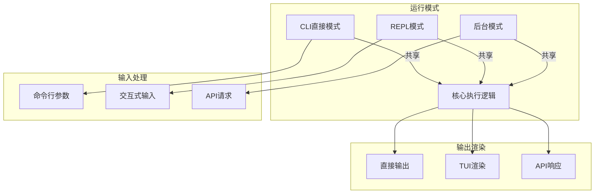

# TECH-UI: 用户接口模块

本文档描述Neco项目的用户接口模块设计，包括CLI直接模式、REPL模式和后台运行模式。

## 1. 模块概述

用户接口模块提供多种交互方式，包括一次性命令执行、交互式REPL和后台守护进程模式。

## 2. 架构设计

### 2.1 三种运行模式



## 3. 核心Trait设计

### 3.1 UI接口

```rust
/// 用户接口抽象
#[async_trait]
pub trait UserInterface: Send + Sync {
    /// 初始化UI
    async fn init(&mut self
    ) -> Result<(), UiError>;
    
    /// 获取用户输入
    async fn get_input(&mut self
    ) -> Result<UserInput, UiError>;
    
    /// 渲染输出
    async fn render_output(
        &mut self,
        output: AgentOutput,
    ) -> Result<(), UiError>;
    
    /// 向用户提问
    async fn ask_user(
        &mut self,
        question: &str,
        options: Option<Vec<String>>,
    ) -> Result<String, UiError>;
    
    /// 清理资源
    async fn shutdown(
        &mut self
    ) -> Result<(), UiError>;
}

/// 用户输入
#[derive(Debug, Clone)]
pub enum UserInput {
    /// 普通消息
    Message(String),
    /// 命令
    Command { name: String, args: Vec<String> },
    /// 退出请求
    Exit,
    /// 中断（Ctrl+C）
    Interrupt,
}

/// Agent输出
#[derive(Debug, Clone)]
pub struct AgentOutput {
    pub content: String,
    pub output_type: OutputType,
    pub metadata: OutputMetadata,
}

#[derive(Debug, Clone)]
pub enum OutputType {
    Text,
    Markdown,
    Code { language: String },
    ToolResult { tool_name: String },
    Error,
}

#[derive(Debug, Clone, Default)]
pub struct OutputMetadata {
    pub tokens_used: Option<u32>,
    pub model: Option<String>,
    pub duration: Option<Duration>,
}
```

## 4. CLI直接模式

### 4.1 实现

```rust
/// CLI直接模式
pub struct CliInterface {
    args: CliArgs,
    session_manager: Arc<SessionManager>,
}

#[derive(Debug, Parser)]
#[command(name = "neco")]
#[command(about = "Neco - 多智能体协作AI应用")]
pub struct CliArgs {
    /// 消息内容（直接执行）
    #[arg(short, long)]
    message: Option<String>,
    
    /// Session ID（接续对话）
    #[arg(short, long)]
    session: Option<String>,
    
    /// Agent定义
    #[arg(short, long)]
    agent: Option<String>,
    
    /// 工作流
    #[arg(short, long)]
    workflow: Option<String>,
    
    /// 工作目录
    #[arg(short, long)]
    working_dir: Option<PathBuf>,
    
    /// 后台运行
    #[arg(long)]
    daemon: bool,
    
    /// 不询问（仅后台模式）
    #[arg(long)]
    no_ask: bool,
}

impl CliInterface {
    pub async fn run(self) -> Result<(), UiError> {
        if let Some(message) = self.args.message {
            // 直接执行模式
            self.run_direct(message).await
        } else if self.args.daemon {
            // 后台模式
            DaemonInterface::new().run().await
        } else {
            // 默认进入REPL
            ReplInterface::new(self.session_manager).run().await
        }
    }
    
    async fn run_direct(
        &self,
        message: String,
    ) -> Result<(), UiError> {
        // 创建或加载Session
        let session = if let Some(session_id) = &self.args.session {
            self.session_manager
                .load_session(session_id.parse()?)                .await?
        } else {
            self.session_manager
                .create_session(
                    SessionType::Direct { message: message.clone() },
                    AgentConfig::default()
                ).await?
        };
        
        // 执行Agent
        let result = self.execute_agent(
            session.root_agent,
            &message
        ).await?;
        
        // 输出结果
        println!("{}", result.content);
        println!("\n--session {}", session.id);
        
        Ok(())
    }
}
```

## 5. REPL模式

### 5.1 架构

```rust
use ratatui::{
    backend::CrosstermBackend,
    Terminal,
    widgets::{Block, Borders, Paragraph},
    layout::{Layout, Constraint, Direction},
};
use crossterm::{
    event::{self, Event, KeyCode, KeyModifiers},
};

/// REPL界面
pub struct ReplInterface {
    terminal: Terminal<CrosstermBackend<std::io::Stdout>>,
    session_manager: Arc<SessionManager>,
    current_session: Option<SessionId>,
    input_buffer: String,
    output_history: Vec<AgentOutput>,
    mode: ReplMode,
}

#[derive(Debug, Clone, Copy, PartialEq)]
pub enum ReplMode {
    Normal,      // 正常输入模式
    Command,     // 命令模式（/开头）
    MultiLine,   // 多行输入模式
}

impl ReplInterface {
    pub fn new(
        session_manager: Arc<SessionManager>,
    ) -> Result<Self, UiError> {
        crossterm::terminal::enable_raw_mode()?;
        
        let stdout = std::io::stdout();
        let backend = CrosstermBackend::new(stdout);
        let terminal = Terminal::new(backend)?;
        
        Ok(Self {
            terminal,
            session_manager,
            current_session: None,
            input_buffer: String::new(),
            output_history: Vec::new(),
            mode: ReplMode::Normal,
        })
    }
    
    /// 运行REPL主循环
    pub async fn run(mut self) -> Result<(), UiError> {
        loop {
            // 绘制UI
            self.draw().await?;
            
            // 处理事件
            if let Event::Key(key) = event::read()? {
                match self.handle_key_event(key).await? {
                    ControlFlow::Continue => {}
                    ControlFlow::Break => break,
                }
            }
        }
        
        self.shutdown().await?;
        Ok(())
    }
    
    /// 绘制界面
    async fn draw(&mut self
    ) -> Result<(), UiError> {
        self.terminal.draw(|f| {
            let chunks = Layout::default()
                .direction(Direction::Vertical)
                .constraints([
                    Constraint::Min(1),      // 输出区域
                    Constraint::Length(3),   // 输入框
                    Constraint::Length(1),   // 状态栏
                ])
                .split(f.size());
            
            // 输出历史
            let output_text = self.output_history.iter()
                .map(|o| format_output(o))
                .collect::<Vec<_>()
                .join("\n");
            
            let output = Paragraph::new(output_text)
                .block(Block::default()
                    .title("Neco")
                    .borders(Borders::ALL)
                )
                .wrap(ratatui::widgets::Wrap { trim: true });
            
            f.render_widget(output, chunks[0]);
            
            // 输入框
            let input = Paragraph::new(self.input_buffer.clone())
                .block(Block::default()
                    .title("Input")
                    .borders(Borders::ALL)
                );
            
            f.render_widget(input, chunks[1]);
            
            // 状态栏
            let status = Paragraph::new(format_status(
                self.current_session.as_ref()
            ));
            
            f.render_widget(status, chunks[2]);
        })?;
        
        Ok(())
    }
    
    /// 处理按键事件
    async fn handle_key_event(
        &mut self,
        key: event::KeyEvent,
    ) -> Result<ControlFlow<(), ()>, UiError> {
        match (key.code, key.modifiers) {
            // Ctrl+C: 退出
            (KeyCode::Char('c'), KeyModifiers::CONTROL) => {
                return Ok(ControlFlow::Break);
            }
            
            // Shift+Enter: 多行输入换行
            (KeyCode::Enter, KeyModifiers::SHIFT) => {
                self.input_buffer.push('\n');
            }
            
            // Enter: 发送消息
            (KeyCode::Enter, _) => {
                self.submit_input().await?;
            }
            
            // Ctrl+P: 命令面板
            (KeyCode::Char('p'), KeyModifiers::CONTROL) => {
                self.show_command_palette().await?;
            }
            
            // 普通字符输入
            (KeyCode::Char(c), _) => {
                self.input_buffer.push(c);
            }
            
            // 退格
            (KeyCode::Backspace, _) => {
                self.input_buffer.pop();
            }
            
            _ => {}
        }
        
        Ok(ControlFlow::Continue)
    }
    
    /// 提交输入
    async fn submit_input(
        &mut self
    ) -> Result<(), UiError> {
        let input = self.input_buffer.trim().to_string();
        self.input_buffer.clear();
        
        if input.is_empty() {
            return Ok(());
        }
        
        // 检查是否是命令
        if input.starts_with('/') {
            self.handle_command(input).await?;
        } else {
            // 发送给Agent
            self.send_to_agent(input).await?;
        }
        
        Ok(())
    }
    
    /// 处理命令
    async fn handle_command(
        &mut self,
        input: String,
    ) -> Result<(), UiError> {
        let parts: Vec<&str> = input.split_whitespace().collect();
        let cmd = parts[0];
        let args = &parts[1..];
        
        match cmd {
            "/new" => {
                // 创建新Session
                let session = self.session_manager
                    .create_session(
                        SessionType::Repl,
                        AgentConfig::default()
                    ).await?;
                self.current_session = Some(session.id);
                self.output_history.clear();
            }
            "/exit" => {
                return Ok(());
            }
            "/compact" => {
                // 手动触发压缩
                if let Some(session_id) = &self.current_session {
                    // ... 执行压缩
                }
            }
            "/workflow" => {
                // 工作流相关命令
                self.handle_workflow_command(args).await?;
            }
            "/agents" => {
                // Agent树相关命令
                self.handle_agents_command(args).await?;
            }
            _ => {
                self.output_history.push(AgentOutput {
                    content: format!("Unknown command: {}", cmd),
                    output_type: OutputType::Error,
                    metadata: Default::default(),
                });
            }
        }
        
        Ok(())
    }
}
```

### 5.2 工作流/Agent树可视化

```rust
impl ReplInterface {
    /// 渲染工作流状态
    fn render_workflow_status(
        &self,
        workflow_session: &WorkflowSession,
    ) -> String {
        let mut output = String::new();
        output.push_str("\n📊 Workflow Status:\n");
        
        // 使用Mermaid语法渲染工作流图
        output.push_str("```mermaid\n");
        output.push_str("graph LR\n");
        
        for (node_id, state) in &workflow_session.node_states {
            let status_icon = match state {
                NodeState::Waiting => "⏳",
                NodeState::Running => "▶️",
                NodeState::Success => "✅",
                NodeState::Failed => "❌",
                NodeState::Skipped => "⏭️",
            };
            
            output.push_str(&format!(
                "    {}[{} {}]\n",
                node_id.0,
                status_icon,
                node_id.0
            ));
        }
        
        // 添加边
        for edge in &workflow_session.definition.edge_defs {
            output.push_str(&format!(
                "    {} --> {}\n",
                edge.from.0,
                edge.to.0
            ));
        }
        
        output.push_str("```\n");
        output
    }
    
    /// 渲染Agent树
    fn render_agent_tree(
        &self,
        session: &Session,
    ) -> String {
        let mut output = String::new();
        output.push_str("\n🌳 Agent Tree:\n");
        
        // 从根Agent开始递归渲染
        if let Ok(root) = self.render_agent_node(
            session,
            &session.root_agent,
            ""
        ) {
            output.push_str(&root);
        }
        
        output
    }
    
    fn render_agent_node(
        &self,
        session: &Session,
        ulid: &AgentUlid,
        prefix: &str,
    ) -> Result<String, ()> {
        let agent = session.agents.get(ulid)
            .ok_or(())?;
        
        let status_icon = match agent.state {
            AgentState::Idle => "⚪",
            AgentState::Running => "🔵",
            AgentState::WaitingForTool => "⏳",
            AgentState::WaitingForUser => "👤",
            AgentState::Completed => "✅",
            AgentState::Error => "❌",
        };
        
        let mut output = format!(
            "{}{} {} ({} messages)\n",
            prefix,
            status_icon,
            ulid,
            agent.messages.len()
        );
        
        // 递归渲染子Agent
        for (i, child_ulid) in agent.children.iter().enumerate() {
            let is_last = i == agent.children.len() - 1;
            let child_prefix = format!(
                "{}{}   ",
                prefix,
                if is_last { "└──" } else { "├──" }
            );
            
            if let Ok(child_output) = self.render_agent_node(
                session,
                child_ulid,
                &child_prefix
            ) {
                output.push_str(&child_output);
            }
        }
        
        Ok(output)
    }
}
```

## 6. 后台运行模式

### 6.1 守护进程架构

```rust
use axum::{
    routing::{get, post},
    Router,
    Json,
    extract::{Path, State},
};

/// 后台守护进程
pub struct DaemonInterface {
    config: DaemonConfig,
    session_manager: Arc<SessionManager>,
    workflow_engine: Arc<WorkflowEngine>,
}

#[derive(Debug, Clone)]
pub struct DaemonConfig {
    /// 监听地址
    pub host: String,
    /// 监听端口
    pub port: u16,
    /// API密钥（可选）
    pub api_key: Option<String>,
}

impl DaemonInterface {
    pub async fn run(self) -> Result<(), UiError> {
        // 构建路由
        let app = Router::new()
            // Session API
            .route("/api/v1/sessions", post(create_session))
            .route("/api/v1/sessions/:id", get(get_session))
            .route("/api/v1/sessions/:id/messages", post(send_message))
            // Agent API
            .route("/api/v1/sessions/:id/agents/tree", get(get_agent_tree))
            .route("/api/v1/sessions/:id/agents/:agent_id/messages", 
                   get(get_agent_messages))
            // Workflow API
            .route("/api/v1/workflows", post(start_workflow))
            .route("/api/v1/workflows/:id/status", get(get_workflow_status))
            .route("/api/v1/workflows/:id/control", post(control_workflow))
            // WebSocket实时事件
            .route("/api/v1/events", get(event_stream))
            .with_state(AppState {
                session_manager: self.session_manager,
                workflow_engine: self.workflow_engine,
            });
        
        // 启动服务器
        let addr = format!("{}:{}", self.config.host, self.config.port);
        let listener = tokio::net::TcpListener::bind(&addr).await?;
        
        println!("Daemon listening on http://{}", addr);
        
        axum::serve(listener, app).await?;
        
        Ok(())
    }
}

/// 应用状态
#[derive(Clone)]
struct AppState {
    session_manager: Arc<SessionManager>,
    workflow_engine: Arc<WorkflowEngine>,
}
```

### 6.2 API端点

```rust
/// 创建Session
async fn create_session(
    State(state): State<AppState>,
    Json(req): Json<CreateSessionRequest>,
) -> Result<Json<SessionResponse>, ApiError> {
    let session = state.session_manager
        .create_session(
            SessionType::Direct {
                message: req.initial_message.clone()
            },
            AgentConfig {
                model_group: req.model_group
                    .unwrap_or_else(|| "default".to_string()),
                ..Default::default()
            }
        ).await?;
    
    Ok(Json(SessionResponse {
        id: session.id.to_string(),
        status: "created".to_string(),
        root_agent: session.root_agent.to_string(),
    }))
}

/// 获取工作流状态
async fn get_workflow_status(
    State(state): State<AppState>,
    Path(workflow_id): Path<String>,
) -> Result<Json<WorkflowStatusResponse>, ApiError> {
    let session_id: SessionId = workflow_id.parse()?;
    
    let status = state.workflow_engine
        .get_status(session_id)
        .await?;
    
    Ok(Json(WorkflowStatusResponse {
        workflow_id,
        status: format!("{:?}", status.status),
        active_nodes: status.active_nodes
            .into_iter()
            .map(|n| n.0)
            .collect(),
        counters: status.counters,
        graph_mermaid: render_workflow_mermaid(&status.definition
        ),
    }))
}

/// 控制工作流
async fn control_workflow(
    State(state): State<AppState>,
    Path(workflow_id): Path<String>,
    Json(req): Json<ControlRequest>,
) -> Result<Json<ControlResponse>, ApiError> {
    let session_id: SessionId = workflow_id.parse()?;
    
    match req.action.as_str() {
        "pause" => {
            state.workflow_engine.pause(session_id).await?;
        }
        "resume" => {
            state.workflow_engine.resume(session_id).await?;
        }
        "terminate" => {
            state.workflow_engine.terminate(
                session_id,
                req.reason.unwrap_or_default()
            ).await?;
        }
        _ => return Err(ApiError::InvalidAction),
    }
    
    Ok(Json(ControlResponse {
        success: true,
        message: format!("Workflow {}", req.action),
    }))
}

/// 事件流（WebSocket）
async fn event_stream(
    State(state): State<AppState>,
    ws: WebSocketUpgrade,
) -> Response {
    ws.on_upgrade(|socket| handle_socket(socket, state))
}

async fn handle_socket(
    mut socket: WebSocket,
    state: AppState,
) {
    // 订阅事件
    let mut event_rx = state.session_manager
        .subscribe_events();
    
    while let Ok(event) = event_rx.recv().await {
        let event_json = serde_json::to_string(&event).unwrap();
        if socket.send(Message::Text(event_json)).await.is_err() {
            break;
        }
    }
}
```

## 7. 错误处理

```rust
#[derive(Debug, Error)]
pub enum UiError {
    #[error("IO错误: {0}")]
    Io(#[from] std::io::Error),
    
    #[error("终端错误: {0}")]
    Terminal(String),
    
    #[error("Session错误: {0}")]
    Session(#[from] SessionError),
    
    #[error("网络错误: {0}")]
    Network(#[from] std::net::AddrParseError),
    
    #[error("API错误: {0}")]
    Api(#[from] ApiError),
}

#[derive(Debug, Error)]
pub enum ApiError {
    #[error("Session未找到")]
    SessionNotFound,
    
    #[error("无效的动作")]
    InvalidAction,
    
    #[error("权限不足")]
    Unauthorized,
    
    #[error("内部错误: {0}")]
    Internal(String),
}

impl IntoResponse for ApiError {
    fn into_response(self) -> Response {
        let (status, message) = match self {
            ApiError::SessionNotFound => {
                (StatusCode::NOT_FOUND, "Session not found")
            }
            ApiError::Unauthorized => {
                (StatusCode::UNAUTHORIZED, "Unauthorized")
            }
            _ => (StatusCode::INTERNAL_SERVER_ERROR, "Internal error"),
        };
        
        (status, Json(json!({"error": message}))).into_response()
    }
}
```

---

*关联文档：*
- [TECH.md](TECH.md) - 总体架构文档
- [TECH-SESSION.md](TECH-SESSION.md) - Session管理模块
- [TECH-WORKFLOW.md](TECH-WORKFLOW.md) - 工作流模块
