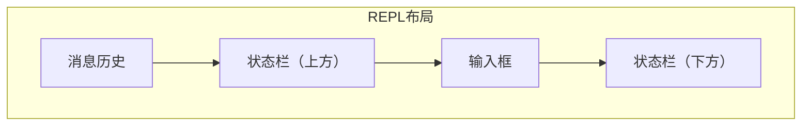

# TECH-UI: 用户接口模块

本文档描述Neco项目的用户接口模块设计。

## 1. 模块概述

用户接口模块提供多种交互方式：
- CLI直接模式
- REPL交互模式
- 后台守护进程模式

## 2. 用户接口抽象

```rust
#[async_trait]
pub trait UserInterface: Send + Sync {
    async fn init(&mut self) -> Result<(), UiError>;
    async fn get_input(&mut self) -> Result<UserInput, UiError>;
    async fn render(&mut self, output: &AgentOutput) -> Result<(), UiError>;
    async fn ask(&mut self, question: &str, options: Option<Vec<String>>) -> Result<String, UiError>;
    async fn shutdown(&mut self) -> Result<(), UiError>;
}

pub enum UserInput {
    Message(String),
    Command { name: String, args: Vec<String> },
    Exit,
    Interrupt,
}

pub struct AgentOutput {
    pub content: String,
    pub output_type: OutputType,
}

pub enum OutputType {
    Text,
    Markdown,
    Code { language: String },
    ToolResult { tool_name: String },
    Error,
}
```

## 3. CLI直接模式

```rust
pub struct CliInterface {
    args: CliArgs,
    session_manager: Arc<SessionManager>,
}

#[derive(Debug, Parser)]
pub struct CliArgs {
    #[arg(short, long)]
    message: Option<String>,
    
    #[arg(short, long)]
    session: Option<String>,
    
    #[arg(short, long)]
    agent: Option<String>,
    
    #[arg(short, long)]
    workflow: Option<String>,
    
    #[arg(short, long)]
    working_dir: Option<PathBuf>,
}

impl CliInterface {
    pub async fn run(&self) -> Result<(), UiError> {
        // TODO: 实现CLI运行逻辑
        unimplemented!()
    }
}
```

## 4. REPL模式

### 4.1 REPL界面结构

```rust
pub struct ReplInterface {
    terminal: Terminal<CrosstermBackend<std::io::Stdout>>,
    session_manager: Arc<SessionManager>,
    input_buffer: String,
    output_history: Vec<AgentOutput>,
    mode: ReplMode,
}

#[derive(Debug, Clone, Copy, PartialEq)]
pub enum ReplMode {
    Normal,
    Command,
    MultiLine,
}

impl ReplInterface {
    pub fn new(session_manager: Arc<SessionManager>) -> Result<Self, UiError> {
        // TODO: 初始化终端
        unimplemented!()
    }
    
    pub async fn run(&mut self) -> Result<(), UiError> {
        // TODO: REPL主循环
        unimplemented!()
    }
}
```

### 4.2 TUI布局



### 4.3 命令列表

| 命令 | 功能 |
|------|------|
| `/new` | 创建新Session |
| `/exit` | 退出应用 |
| `/compact` | 上下文压缩 |
| `/workflow status` | 工作流状态 |
| `/agents tree` | Agent树结构 |

## 5. 后台模式

### 5.1 API端点

```rust
pub struct DaemonInterface {
    config: DaemonConfig,
    session_manager: Arc<SessionManager>,
    workflow_engine: Arc<WorkflowEngine>,
}

pub struct DaemonConfig {
    pub host: String,
    pub port: u16,
}

impl DaemonInterface {
    pub async fn run(&self) -> Result<(), UiError> {
        // TODO: 启动HTTP服务器
        unimplemented!()
    }
}
```

### 5.2 REST API

| 端点 | 方法 | 功能 |
|------|------|------|
| `/api/v1/sessions` | POST | 创建Session |
| `/api/v1/sessions/{id}` | GET | 获取Session |
| `/api/v1/workflows/{id}/status` | GET | 工作流状态 |
| `/api/v1/workflows/{id}/control` | POST | 控制工作流 |

## 6. 错误处理

```rust
#[derive(Debug, Error)]
pub enum UiError {
    #[error("IO错误: {0}")]
    Io(#[from] std::io::Error),
    
    #[error("终端错误: {0}")]
    Terminal(String),
    
    #[error("Session错误: {0}")]
    Session(#[from] SessionError),
    
    #[error("API错误: {0}")]
    Api(#[from] ApiError),
}

#[derive(Debug, Error)]
pub enum ApiError {
    #[error("Session未找到")]
    SessionNotFound,
    
    #[error("无效请求: {0}")]
    BadRequest(String),
    
    #[error("内部错误: {0}")]
    Internal(String),
}
```

---

*关联文档：*
- [TECH.md](TECH.md) - 总体架构文档
- [TECH-SESSION.md](TECH-SESSION.md) - Session管理模块
- [TECH-WORKFLOW.md](TECH-WORKFLOW.md) - 工作流模块
