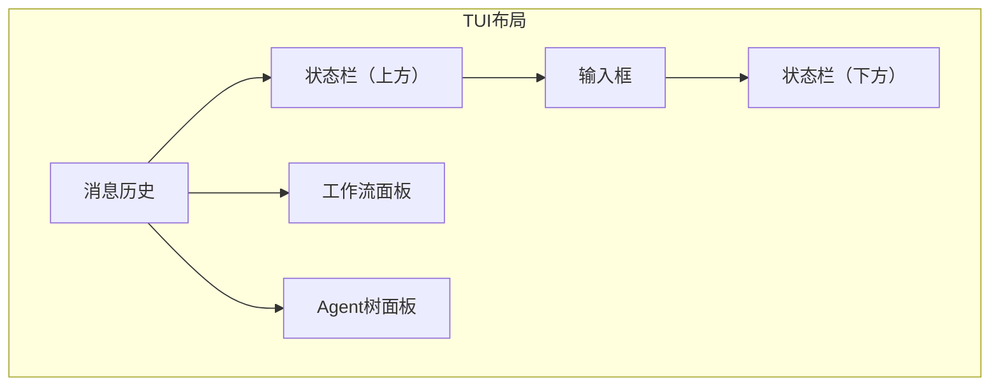

# TECH-UI: 用户接口模块

本文档描述NeoCo项目的用户接口模块设计。

## 1. 模块概述

用户接口模块提供多种交互方式：
- **TUI交互模式**（默认）：不提供任何参数时启动，提供交互式终端界面
- **CLI直接模式**（`-m/--message`）：单次执行模式，发送消息后直接返回结果
- **后台守护进程模式**（`daemon`子命令）：启动HTTP API服务器

## 2. 用户接口抽象

```rust
#[async_trait]
pub trait UserInterface: Send + Sync {
    async fn init(&mut self) -> Result<(), UiError>;
    async fn get_input(&mut self) -> Result<UserInput, UiError>;
    async fn render(&mut self, output: &AgentOutput) -> Result<(), UiError>;
    async fn ask(&mut self, question: &str, options: Option<Vec<String>>) -> Result<String, UiError>;
    async fn shutdown(&mut self) -> Result<(), UiError>;
}

pub enum UserInput {
    Message(String),
    Command { name: String, args: Vec<String> },
    Exit,
    Interrupt,
}

pub struct AgentOutput {
    pub content: String,
    pub output_type: OutputType,
}

pub enum OutputType {
    Text,
    Markdown,
    Code { language: String },
    ToolResult { tool_name: String },
    Error,
}
```

## 3. CLI直接模式

```rust
pub struct CliInterface {
    args: CliArgs,
    session_manager: Arc<SessionManager>,
}

#[derive(Debug, Parser)]
#[command(name = "neoco")]
#[command(about = "NeoCo - 多智能体协作AI应用", long_about = None)]
#[command(version)]
pub struct CliArgs {
    /// 子命令（用于启动守护进程模式）
    #[command(subcommand)]
    command: Option<Commands>,
    
    /// 直接发送消息（CLI模式），与TUI模式互斥
    /// 
    /// 提供此参数将进入CLI直接模式，执行后立即退出。
    /// 消息内容不能为空，否则将返回错误。
    #[arg(short = 'm', long, global = true)]
    message: Option<String>,
    
    /// 指定Session ULID（用于恢复已有会话）
    /// 
    /// 可在TUI模式或CLI模式下使用。
    /// 在TUI模式下，恢复指定会话的交互。
    /// 在CLI模式下，在指定会话中发送消息。
    #[arg(short = 's', long, global = true)]
    session: Option<SessionUlid>,
    
    /// 指定配置文件路径（覆盖默认合并行为）
    /// 
    /// 配置文件优先级规则 **详见 [TECH-CONFIG.md](./TECH-CONFIG.md#21-配置目录结构)**
    /// 
    /// 提供此参数将跳过默认合并，直接使用指定文件。
    #[arg(short = 'c', long, global = true)]
    config: Option<PathBuf>,
    
    /// 工作目录（默认为当前目录 "."）
    /// 
    /// 指定项目根目录，用于：
    /// 1. 查找配置文件：相对路径（.neoco/, .agents/）以此目录为基准
    /// 2. 存储数据：Session数据存储位置 **详见 [TECH-SESSION.md](./TECH-SESSION.md#session存储)**
    /// 
    /// 注意：绝对路径配置（~/.config/neoco/, ~/.agents/）不受此参数影响。
    #[arg(short = 'w', long, global = true, default_value = ".")]
    working_dir: PathBuf,
}

#[derive(Debug, Subcommand)]
enum Commands {
    /// 启动后台守护进程模式，提供HTTP API服务
    /// 
    /// 守护进程将启动HTTP服务器，通过REST API提供会话管理和消息交互功能。
    /// 默认监听地址由配置文件指定。
    /// 
    /// 注意：此子命令与 --message 参数互斥，不能同时使用。
    Daemon {
    },
}

impl CliInterface {
    pub async fn run(&self) -> Result<i32, UiError> {
        // [TODO] 实现CLI运行逻辑
        // 1. 解析CliArgs参数
        // 2. 加载配置文件：
        //    - 如果提供--config参数，使用指定文件
        //    - 否则按优先级查找并合并所有配置文件：
        //      1. {working_dir}/.neoco/neoco.toml → 2. {working_dir}/.agents/neoco.toml → 3. ~/.config/neoco/neoco.toml → 4. ~/.agents/neoco.toml
        //      其中 {working_dir} 默认为当前目录（"."）
        //      相对路径配置以 working_dir 为基准，绝对路径配置不受 working_dir 影响
        //      高优先级覆盖低优先级配置，嵌套对象深度合并
        // 3. 参数校验：
        //    - daemon子命令与--message同时提供 → 返回错误（互斥）
        //    - message参数为空 → 返回错误
        // 4. 根据参数决定运行模式：
        //    - command=Some(Commands::Agent) → 启动守护进程模式
        //    - message=Some(msg) → CLI直接模式（执行后立即退出）
        //    - 无参数 → TUI交互模式（默认）
        // 5. 如果提供--session参数，恢复已有会话
        // 6. 处理错误并返回适当的退出码
        
        // 参数互斥校验
        if self.args.command.is_some() && self.args.message.is_some() {
            return Err(UiError::BadRequest(
                "daemon 子命令与 --message 参数互斥，不能同时使用".to_string()
            ));
        }
        
        // 空消息校验
        if let Some(msg) = &self.args.message {
            if msg.trim().is_empty() {
                return Err(UiError::BadRequest("消息内容不能为空".to_string()));
            }
        }
        
        unimplemented!()
    }
}
```

## 4. TUI交互模式（默认）

### 4.1 TUI界面结构

```rust
pub struct TuiInterface {
    terminal: Terminal<RatatuiBackend<std::io::Stdout>>,
    session_manager: Arc<SessionManager>,
    input_buffer: String,
    output_history: VecDeque<AgentOutput>,
    max_history_size: usize,
    mode: TuiMode,
    viewport: Viewport,
    panels: PanelState,
}

pub enum Viewport {
    Main,           // 主界面（消息历史+输入框）
    Workflow,       // 工作流面板
    AgentTree,      // Agent树面板
}

pub struct PanelState {
    pub workflow_visible: bool,
    pub agent_tree_visible: bool,
    pub command_palette_open: bool,
    pub command_completion_index: Option<usize>,
}

impl TuiInterface {
    pub fn new(session_manager: Arc<SessionManager>, max_history_size: usize) -> Result<Self, UiError> {
        // [TODO] 初始化终端
        // 1. 使用ratatui创建终端实例，启用Viewport::Inline模式（非全屏）
        // 2. 设置终端原始模式和非阻塞输入
        // 3. 初始化输入缓冲区和输出历史（使用VecDeque限制大小）
        // 4. 设置初始TuiMode为Normal
        // 5. 配置终端尺寸监听（用于响应式布局）
        // 6. 初始化面板状态：默认显示主界面，两个辅助面板隐藏
        unimplemented!()
    }

    pub async fn run(&mut self) -> Result<(), UiError> {
        // [TODO] TUI主循环
        // 1. 进入事件循环，持续读取用户输入直到Exit命令
        // 2. 处理输入：根据TuiMode解析输入（Normal模式发送消息，Command模式执行命令）
        //    - 输入为空时按"/"触发命令补全
        //    - Ctrl+p 打开命令面板
        //    - Shift+Enter 换行输入
        //    - Ctrl+hjkl 移动光标
        // 3. 面板切换：Ctrl+o切换工作流面板，Ctrl+i切换Agent树面板
        // 4. 执行用户输入：调用Agent处理消息或执行特殊命令
        // 5. 渲染输出：将AgentOutput渲染到终端（消息历史区域）
        // 6. 更新状态栏：显示当前模式、会话信息等
        // 7. 处理Interrupt信号（Ctrl+C）中断当前操作
        // 8. 清理终端设置并退出
        unimplemented!()
    }
}

#[derive(Debug, Clone, Copy, PartialEq)]
pub enum TuiMode {
    Normal,
    Command,
    MultiLine,
}

### 4.2 TUI界面布局

#### 启动方式

```bash
# 新建会话（默认）
neoco

# 恢复已有会话
neoco --session <session_id>

# 指定配置文件
neoco --config /path/to/config.toml

# 指定工作目录
neoco --working-dir /path/to/project
```

#### 界面布局



#### 输入框样式

- 上下左右边框线宽1字符
- 支持多行输入：`Shift+Enter` 换行
- 光标移动：`Ctrl+hjkl`（左下上右）

### 4.4 工作流与Agent树可视化

#### 4.4.1 工作流状态面板

```rust
pub struct WorkflowPanel {
    graph: WorkflowGraph,
    active_node_id: Option<String>,
    node_states: HashMap<String, NodeState>,
    edge_counters: HashMap<String, u32>,
}

pub enum NodeState {
    Waiting,      // 等待执行
    Running,      // 执行中
    Success,      // 执行成功
    Failed,       // 执行失败
    Skipped,      // 跳过
}

impl WorkflowPanel {
    pub fn render(&self, area: Rect, buf: &mut Buffer) {
        // [TODO] 渲染工作流图结构
        // 1. 绘制节点：矩形框显示节点ID/名称
        // 2. 高亮活动节点：使用不同颜色/样式标识当前执行节点
        // 3. 显示节点状态：等待(灰)、执行中(黄)、成功(绿)、失败(红)、跳过(淡灰)
        // 4. 绘制边：箭头连接节点，显示边条件
        // 5. 显示边条件计数器：select触发+1，require显示阈值
        // 6. 支持缩放和平移（复杂工作流）
    }

    pub fn handle_click(&mut self, position: Position) -> Option<NodeDetail> {
        // [TODO] 处理点击事件
        // 1. 判断点击位置是否在某个节点内
        // 2. 返回节点详细信息（执行历史、输入输出等）
    }
}
```

#### 4.4.2 Agent树面板

```rust
pub struct AgentTreePanel {
    tree: AgentTree,
    expanded_nodes: HashSet<AgentUlid>,
}

pub struct AgentTree {
    root: AgentNode,
}

pub struct AgentNode {
    id: AgentUlid,
    definition_id: String,
    children: Vec<AgentNode>,
    state: AgentState,
    message_count: usize,
    parent_id: Option<AgentUlid>,
}

pub enum AgentState {
    Active,   // 活跃
    Waiting,  // 等待
    Completed,// 完成
    Error,    // 错误
}

impl AgentTreePanel {
    pub fn render(&self, area: Rect, buf: &mut Buffer) {
        // [TODO] 渲染Agent树形结构
        // 1. 树状显示层级关系：缩进+连接线
        // 2. 显示Agent状态：活跃(绿点)、等待(灰点)、完成(蓝点)、错误(红点)
        // 3. 显示Agent间通信关系：消息数量、最后通信时间
        // 4. 支持展开/折叠节点
    }

    pub fn handle_click(&mut self, position: Position) -> Option<AgentDetail> {
        // [TODO] 处理点击事件
        // 1. 判断点击位置是否在某个Agent节点内
        // 2. 返回Agent详细信息（消息记录、工具调用历史等）
    }
}
```

#### 4.4.3 交互操作

| 操作 | 说明 |
|------|------|
| 点击工作流节点 | 查看节点详细信息和执行历史 |
| 点击Agent节点 | 查看Agent消息记录和工具调用历史 |
| `Ctrl+o` | 切换工作流面板显示/隐藏 |
| `Ctrl+i` | 切换Agent树面板显示/隐藏 |
| `Ctrl+p` | 打开命令面板 |
| `/` | 输入为空时输入"/"触发命令补全 |

#### 4.4.4 实时更新机制

```rust
pub trait UiEventListener: Send + Sync {
    fn on_workflow_state_change(&self, event: WorkflowEvent);
    fn on_agent_state_change(&self, event: AgentEvent);
}

pub enum WorkflowEvent {
    NodeStarted { node_id: String },
    NodeCompleted { node_id: String, status: NodeState },
    EdgeTriggered { from: String, to: String, counter: u32 },
}

pub enum AgentEvent {
    AgentCreated { parent_id: Option<AgentUlid>, agent_id: AgentUlid },
    AgentStateChanged { agent_id: AgentUlid, state: AgentState },
    MessageSent { from: AgentUlid, to: AgentUlid },
}

impl TuiInterface {
    fn setup_event_listeners(&self) {
        // [TODO] 设置事件监听
        // 1. 订阅WorkflowEngine的状态变更事件
        // 2. 订阅SessionManager的Agent事件
        // 3. 事件触发时更新对应面板并重绘
    }
}
```

#### 4.4.5 命令扩展

| 命令 | 功能 |
|------|------|
| `/workflow status` | 显示工作流详细状态 |
| `/workflow graph` | 导出工作流图为Mermaid或图片 |
| `/agents tree` | 显示Agent树详细结构 |
| `/agents stats` | 显示Agent执行统计信息 |

### 4.3 命令补全

- 输入框为空时输入 `/`，出现命令补全提示
- `Ctrl+p` 打开命令面板（显示所有可用命令）

### 4.4 命令列表

| 命令 | 功能 |
|------|------|
| `/new` | 创建新Session |
| `/exit` | 退出应用 |
| `/compact` | 上下文压缩 |
| `/workflow status` | 工作流状态 |
| `/agents tree` | Agent树结构 |

## 5. 后台守护进程模式（daemon子命令）

### 5.1 启动方式

```bash
# 使用默认配置启动
neoco daemon

# 指定配置文件
neoco daemon --config /path/to/config.toml

# 指定工作目录
neoco daemon --working-dir /path/to/project
```

### 5.2 配置结构

```rust
pub struct DaemonInterface {
    config: DaemonConfig,
    session_manager: Arc<SessionManager>,
    workflow_engine: Arc<WorkflowEngine>,
}

pub struct TlsConfig {
    pub cert_path: PathBuf,
    pub key_path: PathBuf,
    pub client_ca_path: Option<PathBuf>,
}

// [TODO] 暂不实现：认证配置
// pub struct AuthConfig {
//     pub api_keys: Vec<String>,
//     pub jwt_secret: Option<String>,
//     pub jwt_expiration_sec: Option<u64>,
// }

// [TODO] 暂不实现：速率限制配置
// pub struct RateLimitConfig {
//     pub enabled: bool,
//     pub requests_per_minute: u32,
//     pub burst_size: u32,
// }

// [TODO] 暂不实现：CORS配置
// pub struct CorsConfig {
//     pub allowed_origins: Vec<String>,
//     pub allowed_methods: Vec<String>,
//     pub allowed_headers: Vec<String>,
//     pub allow_credentials: bool,
//     pub max_age_sec: u64,
// }

pub struct ServerConfig {
    pub max_connections: usize,
    pub request_timeout_sec: u64,
    pub shutdown_timeout_sec: u64,
    pub worker_threads: Option<usize>,
}

pub struct DaemonConfig {
    // 服务器绑定地址
    pub host: String,
    pub port: u16,
    
    // TLS配置
    pub tls: Option<TlsConfig>,
    
    // 认证配置
    pub auth: AuthConfig,
    
    // 速率限制
    pub rate_limit: RateLimitConfig,
    
    // CORS配置
    pub cors: CorsConfig,
    
    // 服务器配置
    pub server: ServerConfig,
}

pub struct TlsConfig {
    pub cert_path: PathBuf,
    pub key_path: PathBuf,
    pub client_ca_path: Option<PathBuf>,
}

pub struct AuthConfig {
    pub api_keys: Vec<String>,
    pub jwt_secret: Option<String>,
    pub jwt_expiration_sec: Option<u64>,
}

pub struct RateLimitConfig {
    pub enabled: bool,
    pub requests_per_minute: u32,
    pub burst_size: u32,
}

pub struct CorsConfig {
    pub allowed_origins: Vec<String>,
    pub allowed_methods: Vec<String>,
    pub allowed_headers: Vec<String>,
    pub allow_credentials: bool,
    pub max_age_sec: u64,
}

pub struct ServerConfig {
    pub max_connections: usize,
    pub request_timeout_sec: u64,
    pub shutdown_timeout_sec: u64,
    pub worker_threads: Option<usize>,
}

impl DaemonInterface {
    pub async fn run(&self) -> Result<(), UiError> {
        // [TODO] 启动HTTP服务器
        // 1. 从DaemonConfig读取host和port配置
        // 2. 使用HTTP框架（如axum或actix-web）创建服务
        // 3. 注册REST API路由（/api/v1/sessions, /api/v1/workflows等）
        // 4. 挂载SessionManager和WorkflowEngine到应用状态
        // 5. 启动HTTP服务器监听指定地址
        // 6. 处理优雅关闭（处理SIGTERM/SIGINT信号）
        unimplemented!()
    }
}
```

### 5.3 REST API

#### 5.3.1 创建会话

**请求：**
```json
POST /api/v1/sessions
Content-Type: application/json

{
    "session_id": "session_001",
    "config": {
        "model": "gpt-5.2",
        "temperature": 0.7
    }
}
```

**响应：**
```json
{
    "status": "success",
    "session_id": "session_001",
    "created_at": "2026-03-07T10:00:00Z"
}
```

#### 5.3.2 发送消息

**请求：**
```json
POST /api/v1/sessions/{session_id}/messages
Content-Type: application/json

{
    "content": "帮我分析这段代码",
    "type": "text"
}
```

**响应：**
```json
{
    "status": "success",
    "message_id": "msg_001",
    "output": {
        "content": "分析结果...",
        "type": "text"
    },
    "timestamp": "2026-03-07T10:01:00Z"
}
```

#### 5.3.3 获取会话状态

**请求：**
```json
GET /api/v1/sessions/{session_id}/status
```

**响应：**
```json
{
    "status": "active",
    "session_id": "session_001",
    "message_count": 5,
    "last_activity": "2026-03-07T10:01:00Z"
}
```

#### 5.3.4 终止会话

**请求：**
```json
DELETE /api/v1/sessions/{session_id}
```

**响应：**
```json
{
    "status": "success",
    "session_id": "session_001",
    "terminated_at": "2026-03-07T10:05:00Z"
}
```

#### 5.3.5 错误响应格式

```json
{
    "status": "error",
    "error": {
        "code": "SESSION_NOT_FOUND",
        "message": "会话不存在",
        "details": {}
    }
}
```

## 6. 错误处理

```rust
use crate::session::SessionError;
use crate::config::ConfigError;

#[derive(Debug, Error)]
pub enum UiError {
    #[error("IO错误: {0}")]
    Io(#[source] std::io::Error),
    
    #[error("终端错误: {0}")]
    Terminal(#[source] std::io::Error),
    
    #[error("配置错误: {0}")]
    Config(#[source] ConfigError),
    
    #[error("会话错误: {0}")]
    Session(#[source] SessionError),
    
    #[error("API错误: {0}")]
    Api(#[source] ApiError),

    #[error("请求错误: {0}")]
    BadRequest(String),
}

#[derive(Debug, Error)]
pub enum ApiError {
    #[error("Session未找到")]
    SessionNotFound,

    // [TODO] 暂不实现：认证相关错误
    // #[error("未授权访问: {0}")]
    // Unauthorized(String),

    #[error("无效请求: {0}")]
    BadRequest(String),

    #[error("冲突: {0}")]
    Conflict(String),

    #[error("资源不存在: {0}")]
    NotFound(String),

    #[error("请求超时")]
    RequestTimeout,

    #[error("内部错误: {0}")]
    Internal(String),

    #[error("服务不可用: {0}")]
    ServiceUnavailable(String),

    #[error("网关错误: {0}")]
    BadGateway(String),
}

impl ApiError {
    pub fn status_code(&self) -> u16 {
        match self {
            ApiError::SessionNotFound => 404,
            // ApiError::Unauthorized(_) => 401,
            ApiError::BadRequest(_) => 400,
            ApiError::Conflict(_) => 409,
            ApiError::NotFound(_) => 404,
            ApiError::RequestTimeout => 408,
            ApiError::Internal(_) => 500,
            ApiError::ServiceUnavailable(_) => 503,
            ApiError::BadGateway(_) => 502,
        }
    }

    pub fn error_code(&self) -> &'static str {
        match self {
            ApiError::SessionNotFound => "SESSION_NOT_FOUND",
            // ApiError::Unauthorized(_) => "UNAUTHORIZED",
            ApiError::BadRequest(_) => "BAD_REQUEST",
            ApiError::Conflict(_) => "CONFLICT",
            ApiError::NotFound(_) => "NOT_FOUND",
            ApiError::RequestTimeout => "REQUEST_TIMEOUT",
            ApiError::Internal(_) => "INTERNAL_ERROR",
            ApiError::ServiceUnavailable(_) => "SERVICE_UNAVAILABLE",
            ApiError::BadGateway(_) => "BAD_GATEWAY",
        }
    }
}
```

## 7. 使用示例

### 7.1 TUI交互模式

```bash
# 启动交互式会话
$ neoco
> 你好，请帮我分析这段代码
[AI响应...]

# 恢复上次会话
$ neoco --session 01HF8X5JQC8ZXJ3YKZ0J9K2D9Z
> 继续我们之前的话题
[AI响应...]
```

### 7.2 CLI直接模式

```bash
# 单次查询
$ neoco -m "什么是Rust的所有权系统？"
[直接返回结果，退出]
--session 01HF8X5JQC8ZXJ3YKZ0J9K2D9Z

# 在已有会话中查询
$ neoco -m "继续解释" --session 01HF8X5JQC8ZXJ3YKZ0J9K2D9Z
[直接返回结果，退出]

# 指定配置文件
$ neoco -m "帮我分析" --config ~/.config/neoco/custom.toml
```

**错误处理示例**：
```bash
# 消息为空（应用层校验失败）
$ neoco -m ""
error: 消息内容不能为空

# 缺少消息值（参数解析失败）
$ neoco -m
error: a value is required for '--message <MESSAGE>' but none was supplied

# 未找到配置文件
$ neoco --config /nonexistent/config.toml
error: 配置文件未找到: /nonexistent/config.toml
```

### 7.3 后台守护进程模式

```bash
# 启动守护进程
$ neoco daemon
[INFO] Starting NeoCo daemon on http://127.0.0.1:8080
[INFO] Config loaded from ~/.config/neoco/neoco.toml
[INFO] Ready to accept connections

# 使用API（通过curl）
$ curl -X POST http://127.0.0.1:8080/api/v1/sessions \
  -H "Content-Type: application/json" \
  -d '{"config": {"model": "gpt-5.2"}}'

$ curl -X POST http://127.0.0.1:8080/api/v1/sessions/{session_id}/messages \
  -H "Content-Type: application/json" \
  -d '{"content": "你好，请分析这段代码"}'
```

### 7.4 配置文件合并示例

```bash
# 不指定--config时，自动按优先级合并所有配置文件（相对于当前目录）
$ neoco
[INFO] Merging config files:
[INFO]   - .neoco/neoco.toml (priority 1)
[INFO]   - .agents/neoco.toml (priority 2)
[INFO]   - ~/.config/neoco/neoco.toml (priority 3)
[INFO]   - ~/.agents/neoco.toml (priority 4)
[INFO] Config merged successfully (4 files)

# 指定working-dir时，相对路径配置以此目录为基准
$ neoco --working-dir /path/to/project
[INFO] Merging config files:
[INFO]   - /path/to/project/.neoco/neoco.toml (priority 1)
[INFO]   - /path/to/project/.agents/neoco.toml (priority 2)
[INFO]   - ~/.config/neoco/neoco.toml (priority 3, absolute path)
[INFO]   - ~/.agents/neoco.toml (priority 4, absolute path)
[INFO] Config merged successfully (4 files)

# 使用--config覆盖默认合并行为
$ neoco --config /custom/path/config.toml
[INFO] Loading config from: /custom/path/config.toml
[INFO] Config loaded successfully (single file)

# 合并行为示例：
# .neoco/neoco.toml:         { model = "gpt-5.2", temperature = 0.7 }
# .agents/neoco.toml:       { model = "gpt-3.5", max_tokens = 2000 }
# ~/.config/neoco/neoco.toml: { api_key = "sk-xxx" }
# 
# 最终合并结果：           { model = "gpt-5.2", temperature = 0.7, max_tokens = 2000, api_key = "sk-xxx" }
#                         ^^^^^^^^^^^   来自.neoco/（最高优先级覆盖）
#                                                         ^^^^^^^^^^^^^^   来自.agents/
#                                                                            ^^^^^^^^^^^^^^   来自~/.config/
```

---

## 10. 依赖配置

### Cargo.toml 配置

```toml
ratatui = "0.29"          # TUI框架（非全屏，使用Viewport::Inline模式）
axum = "0.8"              # HTTP 服务框架（daemon 模式可选）
```

### Feature 说明

| Feature | 说明 |
|---------|------|
| `bracketed-paste` | 支持终端粘贴模式（更准确的粘贴处理） |

---

*关联文档：*
- [TECH.md](TECH.md) - 总体架构文档
- [TECH-SESSION.md](TECH-SESSION.md) - Session管理模块
- [TECH-WORKFLOW.md](TECH-WORKFLOW.md) - 工作流模块
