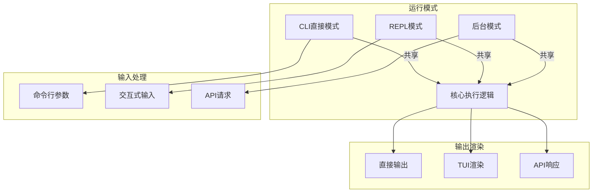
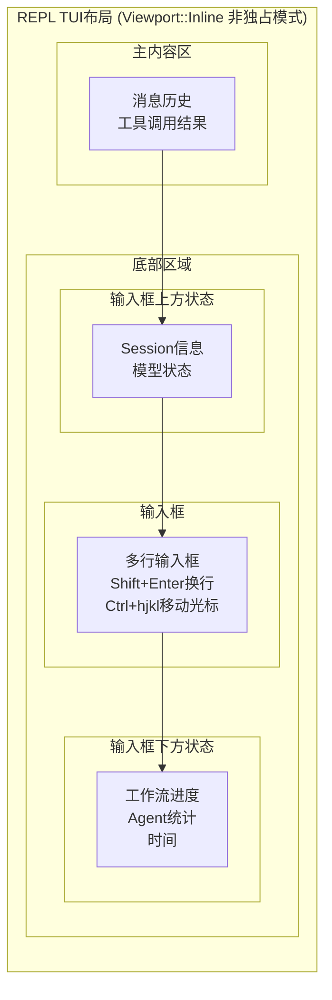

# TECH-UI: 用户接口模块

本文档描述Neco项目的用户接口模块设计，包括CLI直接模式、REPL模式和后台运行模式。

## 1. 模块概述

用户接口模块提供多种交互方式，包括一次性命令执行、交互式REPL和后台守护进程模式。

## 2. 架构设计

### 2.1 三种运行模式



## 3. 核心Trait设计

### 3.1 UI接口

```rust
/// 用户接口抽象
#[async_trait]
pub trait UserInterface: Send + Sync {
    /// 初始化UI
    async fn init(&mut self) -> Result<(), UiError>;
    
    /// 获取用户输入
    async fn get_input(&mut self) -> Result<UserInput, UiError>;
    
    /// 渲染输出
    async fn render_output(
        &mut self,
        output: AgentOutput,
    ) -> Result<(), UiError>;
    
    /// 向用户提问
    async fn ask_user(
        &mut self,
        question: &str,
        options: Option<Vec<String>>,
    ) -> Result<String, UiError>;
    
    /// 清理资源
    async fn shutdown(&mut self) -> Result<(), UiError>;
}

/// 用户输入
#[derive(Debug, Clone)]
pub enum UserInput {
    /// 普通消息
    Message(String),
    /// 命令
    Command { name: String, args: Vec<String> },
    /// 退出请求
    Exit,
    /// 中断（Ctrl+C）
    Interrupt,
}

/// Agent输出
#[derive(Debug, Clone)]
pub struct AgentOutput {
    pub content: String,
    pub output_type: OutputType,
    pub metadata: OutputMetadata,
}

#[derive(Debug, Clone)]
pub enum OutputType {
    Text,
    Markdown,
    Code { language: String },
    ToolResult { tool_name: String },
    Error,
}

#[derive(Debug, Clone, Default)]
pub struct OutputMetadata {
    pub tokens_used: Option<u32>,
    pub model: Option<String>,
    pub duration: Option<Duration>,
}
```

## 4. CLI直接模式

### 4.1 实现

```rust
/// CLI直接模式
pub struct CliInterface {
    args: CliArgs,
    session_manager: Arc<SessionManager>,
}

#[derive(Debug, Parser)]
#[command(name = "neco")]
#[command(about = "Neco - 多智能体协作AI应用")]
pub struct CliArgs {
    /// 消息内容（直接执行）
    #[arg(short, long)]
    #[arg(conflicts_with = "daemon")]
    message: Option<String>,
    
    /// Session ID（接续对话）
    #[arg(short, long)]
    session: Option<String>,
    
    /// Agent定义
    #[arg(short, long)]
    agent: Option<String>,
    
    /// 工作流
    #[arg(short, long)]
    workflow: Option<String>,
    
    /// 工作目录
    #[arg(short, long)]
    working_dir: Option<PathBuf>,
    
    /// 后台运行
    #[arg(long)]
    #[arg(requires = "message")]
    daemon: bool,
    
    /// 不询问（仅后台模式）
    #[arg(long)]
    #[arg(requires = "daemon")]
    no_ask: bool,
}

impl CliInterface {
    pub async fn run(self) -> Result<(), UiError> {
        // TODO: 判断运行模式
        // TODO: 如果有message参数，执行直接模式
        // TODO: 如果指定了daemon参数，进入后台守护进程模式
        // TODO: 否则默认进入REPL交互模式
        
        Ok(())
    }
    
    async fn run_direct(
        &self,
        message: String,
    ) -> Result<(), UiError> {
        // TODO: 创建或加载Session
        // TODO: 根据session_id决定是加载现有session还是创建新session
        // TODO: 创建SessionType::Direct类型的session
        
        // TODO: 执行Agent
        // TODO: 调用execute_agent方法处理消息
        
        // TODO: 输出结果
        // TODO: 打印Agent执行结果内容
        // TODO: 打印session信息供后续使用
        
        Ok(())
    }
}
```

## 5. REPL模式

### 5.1 架构

```rust
use ratatui::{
    backend::CrosstermBackend,
    Terminal,
    widgets::{Block, Borders, Paragraph},
    layout::{Layout, Constraint, Direction},
};
use crossterm::{
    event::{self, Event, KeyCode, KeyModifiers},
};

/// REPL界面
pub struct ReplInterface {
    terminal: Terminal<CrosstermBackend<std::io::Stdout>>,
    session_manager: Arc<SessionManager>,
    current_session: Option<SessionId>,
    input_buffer: String,
    output_history: Vec<AgentOutput>,
    mode: ReplMode,
}

#[derive(Debug, Clone, Copy, PartialEq)]
pub enum ReplMode {
    Normal,      // 正常输入模式
    Command,     // 命令模式（/开头）
    MultiLine,   // 多行输入模式
}

#[derive(Debug, Clone, Copy)]
pub enum EventResult {
    Continue,
    Exit,
}

impl ReplInterface {
    pub fn new(
        session_manager: Arc<SessionManager>,
    ) -> Result<Self, UiError> {
        // TODO: 启用终端原始模式（禁用行缓冲）
        // TODO: 创建Crossterm后端
        // TODO: 创建Terminal实例
        // TODO: 初始化会话管理器引用
        // TODO: 初始化空输入缓冲区
        // TODO: 初始化空输出历史
        // TODO: 设置默认REPL模式为Normal
        
        Ok(Self {
            terminal: Terminal::new(CrosstermBackend::new(std::io::stdout()))?,
            session_manager,
            current_session: None,
            input_buffer: String::new(),
            output_history: Vec::new(),
            mode: ReplMode::Normal,
        })
    }
    
    /// 运行REPL主循环
    pub async fn run(mut self) -> Result<(), UiError> {
        loop {
            // TODO: 绘制UI界面
            // TODO: 调用draw方法渲染终端界面
            
            // TODO: 处理用户输入事件
            // TODO: 监听键盘事件并分发处理
            // TODO: 根据ControlFlow决定是否退出循环
            
            // TODO: 清理资源
            // TODO: 调用shutdown方法关闭终端
        }
    }
    
    /// 绘制界面
    async fn draw(&mut self) -> Result<(), UiError> {
        // TODO: 使用ratatui绘制终端界面
        // TODO: 垂直分割界面为输出区、输入区、状态栏
        // TODO: 渲染输出历史文本
        // TODO: 渲染当前输入内容
        // TODO: 渲染状态信息（session等）
        
        Ok(())
    }
    
    /// 处理按键事件
    async fn handle_key_event(
        &mut self,
        key: event::KeyEvent,
    ) -> Result<EventResult, UiError> {
        // TODO: 根据按键和修饰键执行相应操作
        // TODO: Ctrl+C: 退出REPL
        // TODO: Shift+Enter: 多行输入换行
        // TODO: Enter: 提交输入内容
        // TODO: Ctrl+P: 显示命令面板
        // TODO: 普通字符: 添加到输入缓冲区
        // TODO: 退格: 删除最后一个字符
        
        Ok(EventResult::Continue)
    }
    
    /// 提交输入
    async fn submit_input(&mut self) -> Result<(), UiError> {
        // TODO: 获取输入内容并清空缓冲区
        // TODO: 检查输入是否为空
        // TODO: 判断是否为命令（以/开头）
        // TODO: 如果是命令，调用handle_command处理
        // TODO: 如果是普通消息，调用send_to_agent发送给Agent
        
        Ok(())
    }
    
    /// 处理命令
    async fn handle_command(
        &mut self,
        input: String,
    ) -> Result<(), UiError> {
        // TODO: 解析命令和参数
        // TODO: /new: 创建新的REPL session
        // TODO: /exit: 退出当前session
        // TODO: /compact: 手动触发session压缩
        // TODO: /workflow: 处理工作流相关命令
        // TODO: /agents: 处理Agent树相关命令
        // TODO: 未知命令：添加错误信息到输出历史
        
        Ok(())
    }
}
```

### 5.2 工作流/Agent树可视化

```rust
impl ReplInterface {
    /// 渲染工作流状态
    fn render_workflow_status(
        &self,
        workflow_session: &WorkflowSession,
    ) -> String {
        // TODO: 使用Mermaid语法渲染工作流状态图
        // TODO: 为每个节点生成状态图标（等待/运行/成功/失败/跳过）
        // TODO: 渲染节点之间的依赖关系边
        // TODO: 返回格式化的Mermaid图表字符串
        
        String::new()
    }
    
    /// 渲染Agent树
    fn render_agent_tree(
        &self,
        session: &Session,
    ) -> String {
        // TODO: 从根Agent开始递归渲染Agent树结构
        // TODO: 为每个Agent节点显示状态图标和消息数量
        // TODO: 使用树形前缀显示父子关系（├── └──）
        // TODO: 递归渲染所有子Agent节点
        
        String::new()
    }
    
    fn render_agent_node(
        &self,
        session: &Session,
        ulid: &AgentUlid,
        prefix: &str,
    ) -> Result<String, UiError> {
        // TODO: 获取Agent节点信息
        let agent_info = session.get_agent(ulid)
            .map_err(|e| UiError::Session(e))?;
        
        // TODO: 根据Agent状态选择对应图标
        let status_icon = match agent_info.status {
            AgentStatus::Idle => "○",
            AgentStatus::Running => "◐",
            AgentStatus::Completed => "●",
            AgentStatus::Failed => "✗",
            AgentStatus::Paused => "◔",
        };
        
        // TODO: 格式化输出：前缀+状态图标+Agent ID+消息数量
        let message_count = agent_info.messages.len();
        let line = format!("{}{} Agent({}): {} messages\n",
            prefix, status_icon, ulid, message_count);
        
        // TODO: 递归处理子Agent节点
        let children = agent_info.children;
        let mut result = line;
        for (i, child_ulid) in children.iter().enumerate() {
            let child_prefix = if i == children.len() - 1 {
                format!("{}└── ", prefix)
            } else {
                format!("{}├── ", prefix)
            };
            let child_result = self.render_agent_node(session, child_ulid, &child_prefix)?;
            result.push_str(&child_result);
        }
        
        Ok(result)
    }
}
```

### 5.3 TUI布局设计



**说明**：
- 使用`ratatui`的`Viewport::Inline`模式（非全屏TUI）
- 状态栏分两部分：输入框上方显示Session/模型信息，下方显示工作流进度/Agent统计

#### 5.3.1 布局配置

```rust
/// TUI布局配置
pub struct TuiLayout {
    /// 输入框上方状态行数
    pub top_status_lines: u8,
    /// 输入框下方状态行数
    pub bottom_status_lines: u8,
    /// 是否显示时间
    pub show_timestamp: bool,
}

/// 输入框上方状态内容
pub struct TopStatus {
    pub session_id: Option<String>,
    pub model_group: String,
    pub session_type: SessionType,
}

/// 输入框下方状态内容
pub struct BottomStatus {
    pub workflow_progress: Option<String>,
    pub agent_count: usize,
    pub active_agents: usize,
    pub timestamp: String,
}
```
    Dotted,
}
```

### 5.4 状态显示内容

#### 5.4.1 输入框上方状态

```
[Session: 01HF8X5JQC8] [Model: glm-4.7] [Type: REPL]
```

#### 5.4.2 输入框下方状态

```
Workflow: PRD工作流 | Nodes: 2/6 | Agents: 3 运行中, 1 完成 | 14:32:05
```

#### 5.4.3 工作流/Agent状态查询

通过命令查看详细信息：

| 命令 | 功能 |
|------|------|
| `/workflow status` | 显示工作流详细状态 |
| `/workflow graph` | 导出工作流图为Mermaid |
| `/agents tree` | 显示Agent树结构 |
| `/agents stats` | 显示Agent执行统计 |

### 5.5 交互操作

#### 5.5.1 快捷键

| 快捷键 | 功能 |
|--------|------|
| `Ctrl+p` | 打开命令面板 |
| `Ctrl+c` | 中断当前操作 |
| `Shift+Enter` | 多行输入换行 |
| `Ctrl+hjkl` | 移动光标 |
| `Esc` | 取消输入 |

### 5.6 命令系统

```rust
impl ReplInterface {
    /// 处理工作流命令
    pub async fn handle_workflow_command(
        &mut self,
        args: &[&str],
    ) -> Result<(), UiError> {
        match args[0] {
            "status" => self.show_workflow_status().await?,
            "graph" => self.export_workflow_graph().await?,
            _ => return Err(UiError::UnknownCommand("workflow".to_string())),
        }
        Ok(())
    }
    
    /// 处理Agent命令
    pub async fn handle_agent_command(
        &mut self,
        args: &[&str],
    ) -> Result<(), UiError> {
        match args[0] {
            "tree" => self.show_agent_tree().await?,
            "stats" => self.show_agent_stats().await?,
            _ => return Err(UiError::UnknownCommand("agents".to_string())),
        }
        Ok(())
    }
}
```

#### 命令输出示例

```
/workflow status
Workflow: PRD工作流
  write-prd        ● Success  (2次)
  review-prd       ● Running
  write-tech-doc   ○ Waiting
  ...

/agents tree
Agent(01HF8...): Root [Running] 15 msgs
├── Agent(01HG9...): research [Idle] 8 msgs
│   └── Agent(01HJ2...): detail [Idle] 3 msgs
└── Agent(01HK3...): writer [Completed] 4 msgs

/agents stats
总计: 4 Agents (运行中:1 完成:1 空闲:2)
消息总数: 30 | 平均响应: 2.3s
```

### 5.7 实时更新

```rust
impl ReplInterface {
    /// 处理UI事件，更新状态显示
    pub async fn handle_ui_event(&mut self, event: UiEvent) {
        match event {
            UiEvent::WorkflowProgress { completed, total } => {
                self.update_workflow_status(completed, total);
            }
            UiEvent::AgentStateChanged { .. } => {
                self.update_agent_stats();
            }
            UiEvent::MessageAdded { .. } => {
                self.update_message_count();
            }
        }
        self.request_redraw();
    }
}

pub enum UiEvent {
    WorkflowProgress { completed: usize, total: usize },
    AgentStateChanged { ulid: AgentUlid, state: AgentState },
    MessageAdded { agent_ulid: AgentUlid, count: usize },
    Error { message: String },
}
```

## 6. 后台运行模式

### 6.1 守护进程架构

```rust
use axum::{
    routing::{get, post},
    Router,
    Json,
    extract::{Path, State},
    response::Response,
    ws::{WebSocketUpgrade, WebSocket},
};
use serde::{Deserialize, Serialize};
use serde_json::json;
use chrono::{DateTime, Utc};
use axum::{
    http::StatusCode,
    response::IntoResponse,
};

/// 后台守护进程
pub struct DaemonInterface {
    config: DaemonConfig,
    session_manager: Arc<SessionManager>,
    workflow_engine: Arc<WorkflowEngine>,
}

#[derive(Debug, Clone)]
pub struct DaemonConfig {
    /// 监听地址
    pub host: String,
    /// 监听端口
    pub port: u16,
    /// API密钥（可选）
    pub api_key: Option<String>,
    /// CORS允许的源
    pub cors_allowed_origins: Vec<String>,
    /// 速率限制配置
    pub rate_limit_config: Option<RateLimitConfig>,
    /// TLS配置
    pub tls_config: Option<TlsConfig>,
    /// 健康检查路径
    pub health_check_paths: Vec<String>,
}

#[derive(Debug, Clone)]
pub struct RateLimitConfig {
    /// 每分钟最大请求数
    pub requests_per_minute: u32,
    /// 每小时最大请求数
    pub requests_per_hour: u32,
    /// burst大小
    pub burst_size: u32,
}

#[derive(Debug, Clone)]
pub struct TlsConfig {
    /// TLS证书路径
    pub cert_path: String,
    /// TLS密钥路径
    pub key_path: String,
}

impl DaemonInterface {
    pub async fn run(self) -> Result<(), UiError> {
        // TODO: 构建Axum路由器
        // TODO: 配置Session相关API端点（创建、获取、消息）
        // TODO: 配置Agent相关API端点（树形结构、消息获取）
        // TODO: 配置Workflow相关API端点（启动、状态、控制）
        // TODO: 配置WebSocket实时事件端点
        // TODO: 设置应用状态（session_manager、workflow_engine）
        
        // TODO: 添加CORS中间件
        // TODO: 添加速率限制中间件
        // TODO: 添加日志中间件
        // TODO: 添加压缩中间件
        
        // TODO: 如果配置了TLS，启动HTTPS服务器
        // TODO: 否则启动普通HTTP服务器
        
        // TODO: 启动HTTP服务器
        // TODO: 绑定监听地址和端口
        // TODO: 打印服务器启动信息
        // TODO: 启动Axum服务
        
        Ok(())
    }
}

/// 应用状态
#[derive(Clone)]
struct AppState {
    session_manager: Arc<SessionManager>,
    workflow_engine: Arc<WorkflowEngine>,
}
```

### 6.2 API端点

```rust
/// 创建Session请求
#[derive(Debug, Deserialize)]
pub struct CreateSessionRequest {
    /// 初始消息
    pub message: Option<String>,
    /// 模型组配置
    pub model_group: Option<String>,
    /// Agent配置
    pub agent_config: Option<AgentConfig>,
}

/// Session响应
#[derive(Debug, Serialize)]
pub struct SessionResponse {
    /// Session ID
    pub id: String,
    /// Session状态
    pub status: String,
    /// 根Agent ID
    pub root_agent: String,
    /// 创建时间
    pub created_at: DateTime<Utc>,
}

/// 工作流状态响应
#[derive(Debug, Serialize)]
pub struct WorkflowStatusResponse {
    /// 工作流ID
    pub workflow_id: String,
    /// 状态
    pub status: String,
    /// 活跃节点
    pub active_nodes: Vec<String>,
    /// 计数器
    pub counters: WorkflowCounters,
    /// Mermaid图
    pub graph_mermaid: String,
}

#[derive(Debug, Default, Serialize)]
pub struct WorkflowCounters {
    pub total: u32,
    pub completed: u32,
    pub failed: u32,
    pub pending: u32,
}

/// 控制请求
#[derive(Debug, Deserialize)]
pub struct ControlRequest {
    /// 操作动作：pause, resume, terminate
    pub action: String,
}

/// 控制响应
#[derive(Debug, Serialize)]
pub struct ControlResponse {
    /// 是否成功
    pub success: bool,
    /// 消息
    pub message: String,
}

/// 创建Session
async fn create_session(
    State(state): State<AppState>,
    Json(req): Json<CreateSessionRequest>,
) -> Result<Json<SessionResponse>, ApiError> {
    // 验证请求
    if req.message.is_none() && req.agent_config.is_none() {
        return Err(ApiError::BadRequest("message or agent_config required".to_string()));
    }
    
    // TODO: 从请求中获取初始消息和模型组配置
    // TODO: 调用session_manager创建新的Direct类型session
    // TODO: 设置默认的AgentConfig配置
    // TODO: 返回创建的session信息（ID、状态、根Agent）
    
    Ok(Json(SessionResponse {
        id: String::new(),
        status: "created".to_string(),
        root_agent: String::new(),
        created_at: Utc::now(),
    }))
}

/// 获取工作流状态
async fn get_workflow_status(
    State(state): State<AppState>,
    Path(workflow_id): Path<String>,
) -> Result<Json<WorkflowStatusResponse>, ApiError> {
    // 验证workflow_id格式
    if workflow_id.is_empty() {
        return Err(ApiError::BadRequest("workflow_id cannot be empty".to_string()));
    }
    
    // TODO: 解析workflow_id为SessionId
    // TODO: 调用workflow_engine获取工作流状态
    // TODO: 格式化状态信息（状态、活跃节点、计数器）
    // TODO: 生成Mermaid格式的流程图表示
    
    Ok(Json(WorkflowStatusResponse {
        workflow_id,
        status: "status".to_string(),
        active_nodes: Vec::new(),
        counters: Default::default(),
        graph_mermaid: String::new(),
    }))
}

/// 控制工作流
async fn control_workflow(
    State(state): State<AppState>,
    Path(workflow_id): Path<String>,
    Json(req): Json<ControlRequest>,
) -> Result<Json<ControlResponse>, ApiError> {
    // 验证workflow_id
    if workflow_id.is_empty() {
        return Err(ApiError::BadRequest("workflow_id cannot be empty".to_string()));
    }
    
    // 验证action
    match req.action.as_str() {
        "pause" | "resume" | "terminate" => {}
        _ => return Err(ApiError::InvalidAction),
    }
    
    // TODO: 解析workflow_id为SessionId
    // TODO: 根据请求action执行相应操作
    // TODO: "pause": 暂停工作流执行
    // TODO: "resume": 恢复工作流执行  
    // TODO: "terminate": 终止工作流执行
    // TODO: 无效action时返回错误
    
    Ok(Json(ControlResponse {
        success: true,
        message: format!("Workflow {}", req.action),
    }))
}

/// 事件流（WebSocket）
async fn event_stream(
    State(state): State<AppState>,
    ws: WebSocketUpgrade,
) -> Response {
    // TODO: 处理WebSocket升级连接
    // TODO: 将连接升级为WebSocket
    ws.on_upgrade(|socket| handle_socket(socket, state))
}

async fn handle_socket(
    mut socket: WebSocket,
    state: AppState,
) {
    // TODO: 订阅session_manager的事件流
    // TODO: 持续监听事件并转发到WebSocket
    // TODO: 处理发送失败情况（连接断开等）
}
```

## 7. 错误处理

```rust
#[derive(Debug, Error)]
pub enum UiError {
    #[error("IO错误: {0}")]
    Io(#[from] std::io::Error),
    
    #[error("终端错误: {0}")]
    Terminal(String),
    
    #[error("Session错误: {0}")]
    Session(#[from] SessionError),
    
    #[error("网络错误: {0}")]
    Network(#[from] std::net::AddrParseError),
    
    #[error("API错误: {0}")]
    Api(#[from] ApiError),
}

#[derive(Debug, Error)]
pub enum ApiError {
    #[error("Session未找到")]
    SessionNotFound,
    
    #[error("无效的动作")]
    InvalidAction,
    
    #[error("权限不足")]
    Unauthorized,
    
    #[error("请求错误: {0}")]
    BadRequest(String),
    
    #[error("资源冲突: {0}")]
    Conflict(String),
    
    #[error("服务不可用")]
    ServiceUnavailable,
    
    #[error("内部错误: {0}")]
    Internal(String),
}

impl IntoResponse for ApiError {
    fn into_response(self) -> Response {
        let (status, message) = match self {
            ApiError::SessionNotFound => (StatusCode::NOT_FOUND, "Session not found".to_string()),
            ApiError::Unauthorized => (StatusCode::UNAUTHORIZED, "Unauthorized".to_string()),
            ApiError::BadRequest(msg) => (StatusCode::BAD_REQUEST, msg),
            ApiError::Conflict(msg) => (StatusCode::CONFLICT, msg),
            ApiError::ServiceUnavailable => (StatusCode::SERVICE_UNAVAILABLE, "Service unavailable".to_string()),
            ApiError::InvalidAction => (StatusCode::BAD_REQUEST, "Invalid action".to_string()),
            ApiError::Internal(msg) => (StatusCode::INTERNAL_SERVER_ERROR, msg),
        };
        
        let body = Json(json!({ "error": message }));
        (status, body).into_response()
    }
}
```

---

*关联文档：*
- [TECH.md](TECH.md) - 总体架构文档
- [TECH-SESSION.md](TECH-SESSION.md) - Session管理模块
- [TECH-WORKFLOW.md](TECH-WORKFLOW.md) - 工作流模块
