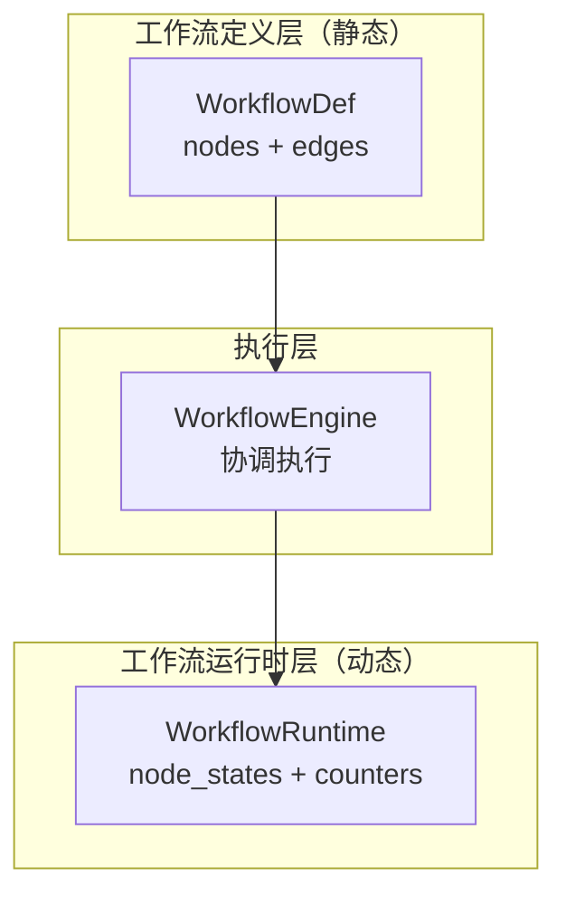
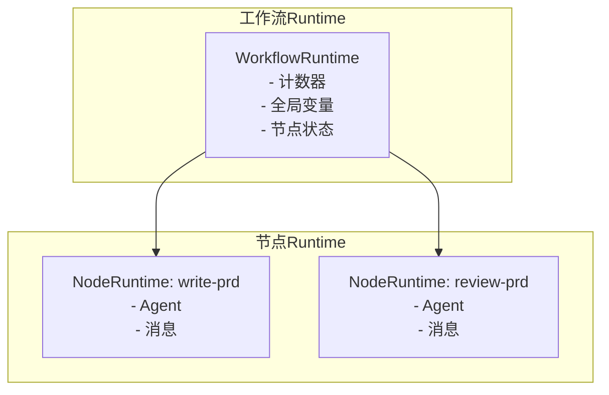

# TECH-WORKFLOW: 工作流模块

本文档描述Neco项目的工作流模块设计，采用领域驱动设计，分离工作流定义与运行时状态。

## 1. 模块概述

工作流模块实现了一个基于有向图工作流的引擎，支持节点并行执行、条件转换、循环控制和状态管理。

**设计原则：**
- 工作流定义（WorkflowDef）不含运行时状态
- 工作流运行时（WorkflowRuntime）不含执行逻辑
- 引擎负责协调，不持有状态

## 2. 核心概念

### 2.1 双层架构



**关键理解：**
- **工作流图**：定义"做什么任务"（任务编排）
- **Agent树**：定义"怎么做任务"（任务执行）
- **工作流边**：控制节点之间的转换
- **Agent层级**：通过`parent_ulid`建立上下级关系

### 2.2 工作流Session层次



## 3. 工作流领域模型

### 3.1 工作流定义（静态配置）

```rust
/// 工作流定义（静态配置）
#[derive(Debug, Clone, Serialize, Deserialize)]
pub struct WorkflowDefinition {
    pub id: String,
    pub name: String,
    pub description: Option<String>,
    pub params: WorkflowParams,
    pub nodes: Vec<NodeDefinition>,
    pub edges: Vec<EdgeDefinition>,
}

/// 工作流参数
#[derive(Debug, Clone, Default, Serialize, Deserialize)]
pub struct WorkflowParams(pub HashMap<String, Value>);

/// 节点定义
#[derive(Debug, Clone, Serialize, Deserialize)]
pub struct NodeDefinition {
    pub id: NodeId,
    pub agent: Option<String>,
    #[serde(default)]
    pub new_session: bool,
}

/// 边目标（支持类型安全的 END 表示）
#[derive(Debug, Clone, PartialEq, Eq, Hash, Serialize, Deserialize)]
#[serde(untagged)]
pub enum NodeTarget {
    Node(NodeId),
    End,
}

impl NodeTarget {
    pub fn is_end(&self) -> bool {
        matches!(self, NodeTarget::End)
    }
}

impl From<NodeId> for NodeTarget {
    fn from(node: NodeId) -> Self {
        NodeTarget::Node(node)
    }
}

/// 边定义
#[derive(Debug, Clone, Serialize, Deserialize)]
pub struct EdgeDefinition {
    pub from: NodeId,
    pub to: NodeTarget,
    #[serde(default)]
    pub select: Option<Vec<String>>,
    #[serde(default)]
    pub require: Option<Vec<Requirement>>,
}

#[derive(Debug, Clone, Serialize, Deserialize)]
pub struct Requirement {
    pub option: String,
    pub min_count: u32,
    pub param_ref: Option<String>,
}

/// 节点ID（强类型）
#[derive(Debug, Clone, PartialEq, Eq, Hash, Serialize, Deserialize)]
pub struct NodeId(pub String);

impl NodeId {
    pub fn new(s: impl Into<String>) -> Self {
        let s = s.into();
        // 验证kebab-case格式
        if !s.is_empty() && s.chars().all(|c| c.is_ascii_lowercase() || c == '-' || c.is_ascii_digit()) {
            Self(s)
        } else {
            panic!("NodeId must be kebab-case: {}", s)
        }
    }
}
```

### 3.2 工作流运行时（动态状态）

```rust
/// 工作流运行时状态
#[derive(Debug, Clone)]
pub struct WorkflowRuntime {
    pub session_id: SessionId,
    pub definition: Arc<WorkflowDefinition>,
    pub node_states: HashMap<NodeId, NodeRuntimeState>,
    pub counters: HashMap<String, u32>,
    pub variables: HashMap<String, Value>,
    pub active_nodes: HashSet<NodeId>,
    pub status: WorkflowStatus,
    pub created_at: DateTime<Utc>,
    pub updated_at: DateTime<Utc>,
}

impl WorkflowRuntime {
    pub fn new(
        session_id: SessionId,
        definition: WorkflowDefinition,
    ) -> Self {
        Self {
            session_id,
            definition: Arc::new(definition),
            node_states: HashMap::new(),
            counters: HashMap::new(),
            variables: HashMap::new(),
            active_nodes: HashSet::new(),
            status: WorkflowStatus::Ready,
            created_at: Utc::now(),
            updated_at: Utc::now(),
        }
    }
    
    pub fn start_node(&mut self, node_id: NodeId, agent_id: AgentId) {
        self.node_states.insert(
            node_id.clone(),
            NodeRuntimeState::Running { agent_id }
        );
        self.active_nodes.insert(node_id);
        self.updated_at = Utc::now();
    }
    
    pub fn complete_node(&mut self, node_id: &NodeId, output: String) {
        self.node_states.insert(
            node_id.clone(),
            NodeRuntimeState::Success { output }
        );
        self.active_nodes.remove(node_id);
        self.updated_at = Utc::now();
    }
    
    pub fn increment_counter(&mut self, option: &str) {
        *self.counters.entry(option.to_string()).or_insert(0) += 1;
    }
    
    pub fn get_counter(&self, option: &str) -> u32 {
        *self.counters.get(option).unwrap_or(&0)
    }
}

/// 节点运行时状态
#[derive(Debug, Clone, PartialEq, Eq, Serialize, Deserialize)]
pub enum NodeRuntimeState {
    Waiting,
    Running { agent_id: AgentId },
    Success { output: String },
    Failed { error: String },
    Skipped,
}

/// 工作流状态
#[derive(Debug, Clone, Copy, PartialEq, Eq, Serialize, Deserialize)]
pub enum WorkflowStatus {
    Ready,
    Running,
    Paused,
    Completed,
    Failed,
}
```

## 4. 工作流引擎

### 4.1 引擎核心

```rust
/// 工作流引擎
pub struct WorkflowEngine {
    agent_engine: Arc<AgentEngine>,
    event_publisher: Arc<dyn EventPublisher>,
}

impl WorkflowEngine {
    pub async fn start_workflow(
        &self,
        definition: WorkflowDefinition,
        initial_input: String,
    ) -> Result<WorkflowRuntime, WorkflowError> {
        // TODO: 实现工作流启动逻辑
        // 1. 创建workflow runtime
        // 2. 查找起始节点
        // 3. 启动起始节点
        // 4. 发布WorkflowStarted事件
        unimplemented!()
    }
    
    pub async fn handle_node_complete(
        &self,
        runtime: &mut WorkflowRuntime,
        node_id: NodeId,
        output: String,
    ) -> Result<(), WorkflowError> {
        // TODO: 实现节点完成处理
        // 1. 更新节点状态
        // 2. 评估边条件
        // 3. 触发下一节点
        // 4. 检查工作流完成
        unimplemented!()
    }
    
    pub fn find_start_nodes(
        &self,
        definition: &WorkflowDefinition,
    ) -> Vec<NodeId> {
        // 找没有入边的节点
        let mut has_incoming: HashSet<&NodeId> = HashSet::new();
        for edge in &definition.edges {
            has_incoming.insert(&edge.to);
        }
        
        definition.nodes.iter()
            .filter(|n| !has_incoming.contains(&n.id))
            .map(|n| n.id.clone())
            .collect()
    }
    
    pub fn evaluate_edges(
        &self,
        runtime: &WorkflowRuntime,
        current_node: &NodeId,
    ) -> Vec<NodeId> {
        let definition = &runtime.definition;
        let edges: Vec<_> = definition.edges.iter()
            .filter(|e| e.from == *current_node)
            .collect();
        
        let mut next_nodes = Vec::new();
        
        for edge in edges {
            // 检查require条件
            if let Some(ref requirements) = edge.require {
                let mut satisfied = false;
                for req in requirements {
                    let count = runtime.get_counter(&req.option);
                    if count >= req.min_count {
                        satisfied = true;
                        break;
                    }
                }
                if !satisfied {
                    continue;
                }
            }
            
            // 无条件边或select边直接触发
            if edge.to.is_end() {
                continue;
            }
            if let NodeTarget::Node(next_node) = &edge.to {
                next_nodes.push(next_node.clone());
            }
        }
        
        next_nodes
    }
}
```

## 5. 边条件控制

### 5.1 条件语法

```toml
[[edges]]
from = "review-prd"
to = "write-prd"
select = ["reject"]  # 触发时 counters.reject += 1

[[edges]]
from = "write-prd"
to = "write-tech-doc"
require = ["approve_prd"]  # 需要 counters.approve_prd > 0

# 支持参数引用
[[edges]]
from = "review-prd"
to = "final-approve"
require = ["@params.min_approvers"]  # 引用workflow_params
```

### 5.2 条件评估实现

```rust
impl WorkflowEngine {
    fn evaluate_requirement(
        req: &Requirement,
        counters: &HashMap<String, u32>,
        params: &WorkflowParams,
    ) -> bool {
        let count = if let Some(param_ref) = &req.param_ref {
            // 参数引用处理
            if param_ref.starts_with("@params.") {
                let key = &param_ref[8..];
                params.0.get(key)
                    .and_then(|v| v.as_u64())
                    .map(|v| v as u32)
                    .unwrap_or(0)
            } else {
                0
            }
        } else {
            *counters.get(&req.option).unwrap_or(&0)
        };
        
        count >= req.min_count
    }
}
```

## 6. 转场工具

### 6.1 workflow工具

```rust
pub struct WorkflowTransitionTool {
    runtime: Arc<RwLock<WorkflowRuntime>>,
    node_id: NodeId,
}

#[async_trait]
impl ToolExecutor for WorkflowTransitionTool {
    fn definition(&self) -> &ToolDefinition {
        static DEF: Lazy<ToolDefinition> = Lazy::new(|| ToolDefinition {
            id: ToolId("workflow".into()),
            description: "控制工作流节点之间的转换".into(),
            schema: json!({
                "type": "object",
                "properties": {
                    "option": {
                        "type": "string",
                        "description": "转场选项"
                    },
                    "message": {
                        "type": "string",
                        "description": "传递给下一节点的消息"
                    }
                },
                "required": ["option"]
            }),
            capabilities: ToolCapabilities::default(),
            timeout: Duration::from_secs(30),
        });
        &DEF
    }
    
    async fn execute(
        &self,
        context: &ToolContext,
        args: Value,
    ) -> Result<ToolResult, ToolError> {
        // TODO: 实现转场工具逻辑
        // 1. 解析option和message
        // 2. 更新计数器
        // 3. 触发转场
        unimplemented!()
    }
}

/// 注册工作流工具
pub fn register_workflow_tools(
    registry: &mut dyn ToolRegistry,
    runtime: Arc<RwLock<WorkflowRuntime>>,
    node_id: NodeId,
) {
    // 注册 workflow 工具
    registry.register(Arc::new(WorkflowTransitionTool {
        runtime: runtime.clone(),
        node_id: node_id.clone(),
    }));
    
    // 注册 pass 工具
    registry.register(Arc::new(PassTool {
        runtime,
        node_id,
    }));
}
```

## 7. 工作流定义示例

```toml
# workflows/prd/workflow.toml
name = "PRD工作流"
description = "产品需求文档生成与审阅流程"

[workflow_params]
min_approvers = 2
quality_threshold = 0.7

# 节点定义
[[nodes]]
id = "write-prd"
new_session = false

[[nodes]]
id = "review-prd"
agent = "review"
new_session = true

[[nodes]]
id = "write-tech-doc"
new_session = false

[[nodes]]
id = "review-tech-doc"
agent = "review"
new_session = true

[[nodes]]
id = "write-impl"
new_session = false

[[nodes]]
id = "review-impl"
agent = "review"
new_session = true

# 边定义
[[edges]]
from = "write-prd"
to = "review-prd"

[[edges]]
from = "review-prd"
to = "write-prd"
select = ["reject"]

[[edges]]
from = "review-prd"
to = "write-tech-doc"
require = ["approve_prd"]

[[edges]]
from = "write-tech-doc"
to = "review-tech-doc"

[[edges]]
from = "review-tech-doc"
to = "write-tech-doc"
select = ["reject"]

[[edges]]
from = "review-tech-doc"
to = "write-impl"
require = ["approve_tech"]

[[edges]]
from = "write-impl"
to = "review-impl"

[[edges]]
from = "review-impl"
to = "write-impl"
select = ["reject"]

[[edges]]
from = "review-impl"
to = "END"
require = ["approve"]
```

### 7.1 数据流图


## 8. 控制API

```rust
#[async_trait]
pub trait WorkflowControl: Send + Sync {
    async fn pause(&self, session_id: SessionId) -> Result<(), WorkflowError>;
    async fn resume(&self, session_id: SessionId) -> Result<(), WorkflowError>;
    async fn terminate(&self, session_id: SessionId, reason: String) -> Result<(), WorkflowError>;
    async fn get_status(&self, session_id: SessionId) -> Result<WorkflowStatusInfo, WorkflowError>;
}
```

## 9. 错误处理

```rust
#[derive(Debug, Error)]
pub enum WorkflowError {
    #[error("节点未找到: {0}")]
    NodeNotFound(NodeId),
    
    #[error("没有起始节点")]
    NoStartNode,
    
    #[error("检测到循环依赖")]
    CycleDetected,
    
    #[error("工作流已完成")]
    WorkflowCompleted,
    
    #[error("死锁检测：超过5分钟无进度")]
    DeadlockDetected,
    
    #[error("存储错误: {0}")]
    Storage(#[from] StorageError),
}
```

---

*关联文档：*
- [TECH.md](TECH.md) - 总体架构文档
- [TECH-SESSION.md](TECH-SESSION.md) - Session管理模块
- [TECH-AGENT.md](TECH-AGENT.md) - 多智能体协作模块
