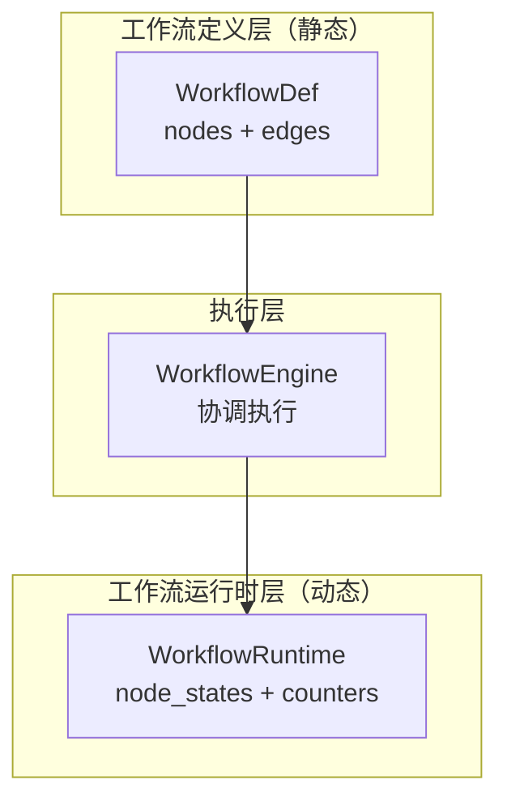
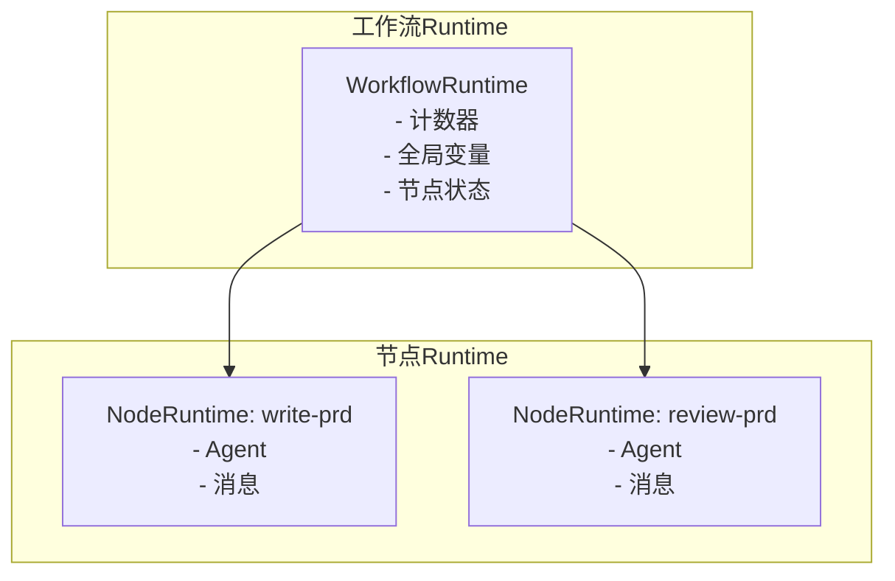
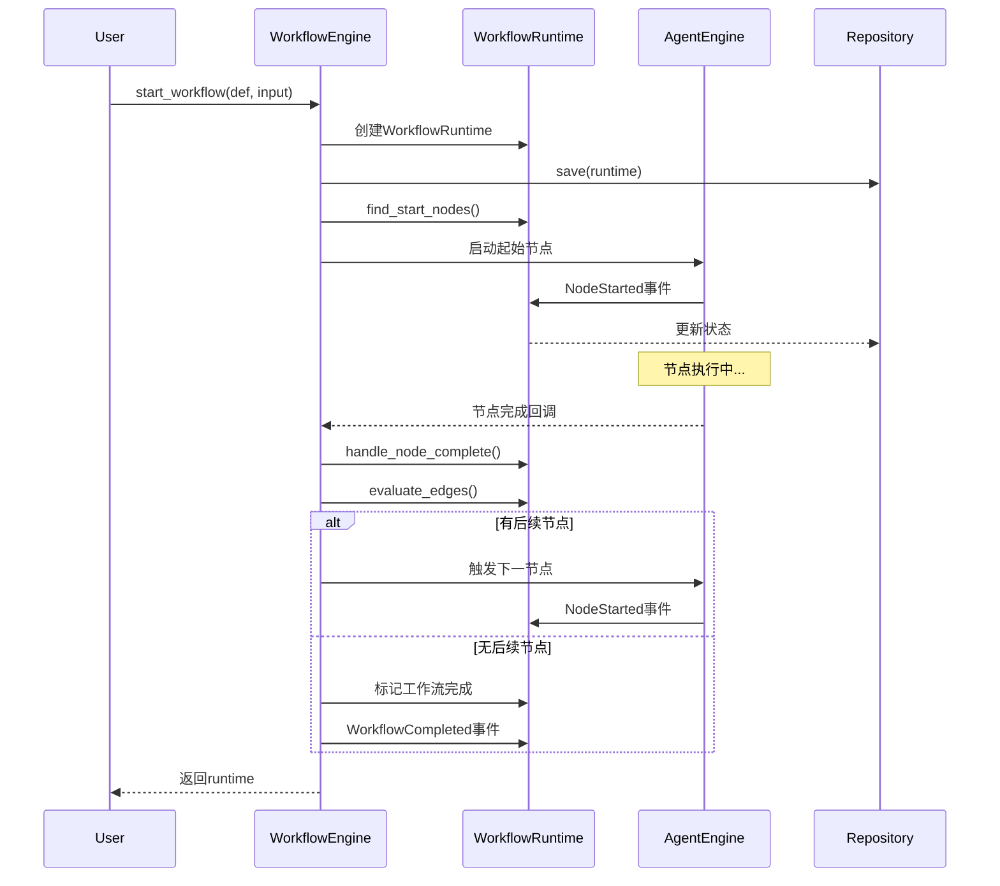

# TECH-WORKFLOW: 工作流模块

本文档描述Neco项目的工作流模块设计，采用领域驱动设计，分离工作流定义与运行时状态。

## 1. 模块概述

工作流模块实现了一个基于有向图工作流的引擎，支持节点并行执行、条件转换、循环控制和状态管理。

**设计原则：**
- 工作流定义（WorkflowDef）不含运行时状态
- 工作流运行时（WorkflowRuntime）不含执行逻辑
- 引擎负责协调，不持有状态

## 2. 核心概念

### 2.1 双层架构



**关键理解：**
- **工作流图**：定义"做什么任务"（任务编排）
- **Agent树**：定义"怎么做任务"（任务执行）
- **工作流边**：控制节点之间的转换
- **Agent层级**：通过`parent_ulid`建立上下级关系

### 2.2 工作流Session层次



## 3. 工作流领域模型

### 3.1 工作流定义（静态配置）

```rust
/// 工作流定义（静态配置）
#[derive(Debug, Clone, Serialize, Deserialize)]
pub struct WorkflowDefinition {
    pub id: String,
    pub name: String,
    pub description: Option<String>,
    pub params: WorkflowParams,
    pub nodes: Vec<NodeDefinition>,
    pub edges: Vec<EdgeDefinition>,
}

/// 工作流参数
#[derive(Debug, Clone, Default, Serialize, Deserialize)]
pub struct WorkflowParams(pub HashMap<String, Value>);

/// 节点定义
#[derive(Debug, Clone, Serialize, Deserialize)]
pub struct NodeDefinition {
    pub id: NodeId,
    pub agent: Option<String>,
    #[serde(default)]
    pub new_session: bool,
}

/// 边定义
#[derive(Debug, Clone, Serialize, Deserialize)]
pub struct EdgeDefinition {
    pub from: NodeId,
    pub to: NodeId,
    #[serde(default)]
    pub select: Option<Vec<String>>,
    #[serde(default)]
    pub require: Option<Vec<Requirement>>,
}

#[derive(Debug, Clone, Serialize, Deserialize)]
pub struct Requirement {
    pub option: String,
    pub min_count: u32,
    pub param_ref: Option<String>,
}

/// 节点ID（强类型）
/// 
/// 节点ID采用kebab-case格式，确保跨工作流的一致性命名。
#[derive(Debug, Clone, PartialEq, Eq, Hash, Serialize, Deserialize)]
pub struct NodeId(pub String);

impl NodeId {
    pub fn new(s: impl Into<String>) -> Self {
        let s = s.into();
        // 验证kebab-case格式
        if !s.is_empty() && s.chars().all(|c| c.is_ascii_lowercase() || c == '-' || c.is_ascii_digit()) {
            Self(s)
        } else {
            panic!("NodeId must be kebab-case: {}", s)
        }
    }
}
```

### 3.2 工作流运行时（动态状态）

```rust
/// 工作流运行时状态
#[derive(Debug, Clone)]
pub struct WorkflowRuntime {
    pub session_id: SessionId,
    pub definition: Arc<WorkflowDefinition>,
    pub node_states: HashMap<NodeId, NodeRuntimeState>,
    pub counters: HashMap<String, u32>,
    pub variables: HashMap<String, Value>,
    pub active_nodes: HashSet<NodeId>,
    pub status: WorkflowStatus,
    pub created_at: DateTime<Utc>,
    pub updated_at: DateTime<Utc>,
}

impl WorkflowRuntime {
    pub fn new(
        session_id: SessionId,
        definition: WorkflowDefinition,
    ) -> Self {
        // TODO: 实现工作流运行时初始化
        // 1. 接收session_id和definition作为参数
        // 2. 初始化空的active_nodes HashSet<NodeId>
        // 3. 初始化空的node_states HashMap<NodeId, NodeRuntimeState>
        // 4. 初始化空的counters HashMap<String, u32>
        // 5. 设置status为WorkflowRuntimeState::Ready
        // 6. 设置created_at和updated_at为当前UTC时间
        unimplemented!()
    }
    
    pub fn start_node(&mut self, node_id: NodeId, agent_id: AgentId) {
        // TODO: 实现节点启动逻辑
        // 1. 检查节点是否已在active_nodes中
        // 2. 创建NodeRuntimeState::Running { agent_id }
        // 3. 将状态插入node_states
        // 4. 将node_id加入active_nodes
        // 5. 更新updated_at为当前时间
        unimplemented!()
    }
    
    pub fn complete_node(&mut self, node_id: &NodeId, output: String) {
        // TODO: 实现节点完成逻辑
        // 1. 更新node_states中该节点的状态为Success { output }
        // 2. 从active_nodes HashSet中移除该node_id
        // 3. 更新updated_at为当前时间
        unimplemented!()
    }
    
    pub fn increment_counter(&mut self, option: &str) {
        // TODO: 实现计数器递增逻辑
        // 1. 使用counters.entry(option).or_insert(0)获取或创建计数器
        // 2. 对获取的可变引用执行加1操作
        unimplemented!()
    }
    
    pub fn get_counter(&self, option: &str) -> u32 {
        // TODO: 实现获取计数器值逻辑
        // 1. 调用counters.get(option)查找计数器
        // 2. 如果Some(v)返回*v，否则返回0
        unimplemented!()
    }
}

/// 节点运行时状态
#[derive(Debug, Clone, PartialEq, Eq, Serialize, Deserialize)]
pub enum NodeRuntimeState {
    Waiting,
    Running { agent_id: AgentId },
    Success { output: String },
    Failed { error: String },
    Skipped,
}

/// 工作流状态
#[derive(Debug, Clone, Copy, PartialEq, Eq, Serialize, Deserialize)]
pub enum WorkflowStatus {
    Ready,
    Running,
    Paused,
    Completed,
    Failed,
}
```

## 3.2 仓储接口

```rust
use async_trait::async_trait;

/// 工作流仓储接口
#[async_trait]
pub trait WorkflowRepository: Send + Sync {
    async fn save(&self, runtime: &WorkflowRuntime) -> Result<(), StorageError>;
    async fn find_by_id(&self, session_id: &SessionId) -> Result<Option<WorkflowRuntime>, StorageError>;
    async fn find_by_status(&self, status: WorkflowStatus) -> Result<Vec<WorkflowRuntime>, StorageError>;
    async fn delete(&self, session_id: &SessionId) -> Result<(), StorageError>;
}

/// 存储错误类型
#[derive(Debug, Error)]
pub enum StorageError {
    #[error("数据未找到: {0}")]
    NotFound(String),
    
    #[error("数据库错误: {0}")]
    Database(String),
    
    #[error("序列化错误: {0}")]
    Serialization(String),
}
```

## 3.3 事件类型

```rust
/// 工作流事件类型
#[derive(Debug, Clone, Serialize, Deserialize)]
#[serde(tag = "type")]
pub enum WorkflowEvent {
    WorkflowStarted {
        session_id: SessionId,
        definition_id: String,
    },
    NodeStarted {
        session_id: SessionId,
        node_id: NodeId,
        agent_id: AgentId,
    },
    NodeCompleted {
        session_id: SessionId,
        node_id: NodeId,
        output: String,
    },
    NodeFailed {
        session_id: SessionId,
        node_id: NodeId,
        error: String,
    },
    EdgeTriggered {
        session_id: SessionId,
        from: NodeId,
        to: NodeId,
        option: Option<String>,
    },
    WorkflowCompleted {
        session_id: SessionId,
    },
    WorkflowFailed {
        session_id: SessionId,
        reason: String,
    },
}

pub trait EventPublisher: Send + Sync {
    fn publish(&self, event: WorkflowEvent);
}
```

## 4. 工作流引擎

### 4.1 引擎核心

```rust
/// 工作流引擎
/// 
/// 引擎协调工作流执行，负责节点调度和状态管理。
/// 事件发布见 [TECH-SESSION.md#3-消息模型设计](TECH-SESSION.md#3-消息模型设计)
pub struct WorkflowEngine {
    agent_engine: Arc<AgentEngine>,
    event_publisher: Arc<dyn EventPublisher>,
}

impl WorkflowEngine {
    pub async fn start_workflow(
        &self,
        definition: WorkflowDefinition,
        initial_input: String,
    ) -> Result<WorkflowRuntime, WorkflowError> {
        // TODO: 实现工作流启动逻辑
        // 1. 调用WorkflowRuntime::new创建运行时实例
        // 2. 调用find_start_nodes查找所有起始节点
        // 3. 对每个起始节点创建Agent并调用start_node
        // 4. 发布WorkflowStarted事件到event_publisher
        // 5. 返回创建的runtime
        unimplemented!()
    }
    
    pub async fn handle_node_complete(
        &self,
        runtime: &mut WorkflowRuntime,
        node_id: NodeId,
        output: String,
    ) -> Result<(), WorkflowError> {
        // TODO: 实现节点完成处理
        // 1. 调用runtime.complete_node更新节点状态
        // 2. 调用evaluate_edges查找满足条件的出边
        // 3. 对每个目标节点调用agent_engine启动Agent
        // 4. 发布NodeCompleted事件
        // 5. 检查是否所有节点都已完成，若是则发布WorkflowCompleted
        unimplemented!()
    }
    
    pub fn find_start_nodes(
        &self,
        definition: &WorkflowDefinition,
    ) -> Vec<NodeId> {
        // TODO: 实现查找起始节点逻辑
        // 1. 创建HashSet收集所有有入边的节点ID
        // 2. 遍历所有edges，将target加入HashSet
        // 3. 遍历所有nodes，返回不在HashSet中的节点（无入边的节点）
        unimplemented!()
    }
    
    pub fn evaluate_edges(
        &self,
        runtime: &WorkflowRuntime,
        current_node: &NodeId,
    ) -> Vec<NodeId> {
        // TODO: 实现边条件评估逻辑
        // 1. 查找定义中从current_node出发的所有边
        // 2. 对每条边调用evaluate_requirement评估条件
        // 3. 收集所有条件满足的边的target节点
        // 4. 返回目标节点ID列表
        unimplemented!()
    }
        // 2. 对每条边检查require条件是否满足
        // 3. 跳过指向END的边
        // 4. 返回满足条件的后续节点列表
        unimplemented!()
    }
}
```

### 4.2 执行流程

工作流引擎通过以下步骤协调节点执行：



**执行步骤说明：**

1. **启动工作流**：创建运行时实例，保存到存储，查找并启动起始节点
2. **节点执行**：Agent引擎负责执行具体任务
3. **边评估**：节点完成后，引擎评估边条件确定下一节点
4. **状态更新**：每个事件都会触发运行时状态更新和持久化

## 5. 边条件控制

### 5.1 条件语法

```toml
[[edges]]
from = "review-prd"
to = "write-prd"
select = ["reject"]  # 触发时 counters.reject += 1

[[edges]]
from = "write-prd"
to = "write-tech-doc"
require = ["approve_prd"]  # 需要 counters.approve_prd > 0

# 支持参数引用
[[edges]]
from = "review-prd"
to = "final-approve"
require = ["@params.min_approvers"]  # 引用workflow_params
```

### 5.2 条件评估实现

```rust
impl WorkflowEngine {
    fn evaluate_requirement(
        req: &Requirement,
        counters: &HashMap<String, u32>,
        params: &WorkflowParams,
    ) -> bool {
        // TODO: 实现需求条件评估逻辑
        // 1. 检查req.param_ref是否以"@params."开头
        // 2. 如果是参数引用：从params中提取对应的参数值作为threshold
        // 3. 如果不是：使用req.min_count作为threshold
        // 4. 从counters中获取req.option对应的计数器值
        // 5. 比较计数器值是否 >= threshold，返回比较结果
        unimplemented!()
    }
}
```

## 6. 转场工具

### 6.1 workflow工具

```rust
pub struct WorkflowTransitionTool {
    runtime: Arc<RwLock<WorkflowRuntime>>,
    node_id: NodeId,
}

#[async_trait]
impl ToolExecutor for WorkflowTransitionTool {
    fn definition(&self) -> &ToolDefinition {
        static DEF: Lazy<ToolDefinition> = Lazy::new(|| ToolDefinition {
            id: ToolId("workflow".into()),
            description: "控制工作流节点之间的转换".into(),
            schema: json!({
                "type": "object",
                "properties": {
                    "option": {
                        "type": "string",
                        "description": "转场选项"
                    },
                    "message": {
                        "type": "string",
                        "description": "传递给下一节点的消息"
                    }
                },
                "required": ["option"]
            }),
            capabilities: ToolCapabilities::default(),
            timeout: Duration::from_secs(30),
        });
        &DEF
    }
    
    async fn execute(
        &self,
        context: &ToolContext,
        args: Value,
    ) -> Result<ToolResult, ToolError> {
        // TODO: 实现转场工具逻辑
        // 1. 从args中解析option（必选）和message（可选）
        // 2. 获取runtime的write lock
        // 3. 调用runtime.increment_counter(option)增加计数
        // 4. 发布NodeTransition事件
        // 5. 返回转场成功的ToolResult
        unimplemented!()
    }
}

/// 注册工作流工具
pub fn register_workflow_tools(
    registry: &mut dyn ToolRegistry,
    runtime: Arc<RwLock<WorkflowRuntime>>,
    node_id: NodeId,
) {
    // 注册 workflow 工具
    registry.register(Arc::new(WorkflowTransitionTool {
        runtime: runtime.clone(),
        node_id: node_id.clone(),
    }));
    
    // 注册 pass 工具
    registry.register(Arc::new(PassTool {
        runtime,
        node_id,
    }));
}
```

## 7. 工作流定义示例

```toml
# workflows/prd/workflow.toml
name = "PRD工作流"
description = "产品需求文档生成与审阅流程"

[workflow_params]
min_approvers = 2
quality_threshold = 0.7

# 节点定义
[[nodes]]
id = "write-prd"
new_session = false

[[nodes]]
id = "review-prd"
agent = "review"
new_session = true

[[nodes]]
id = "write-tech-doc"
new_session = false

[[nodes]]
id = "review-tech-doc"
agent = "review"
new_session = true

[[nodes]]
id = "write-impl"
new_session = false

[[nodes]]
id = "review-impl"
agent = "review"
new_session = true

# 边定义
[[edges]]
from = "write-prd"
to = "review-prd"

[[edges]]
from = "review-prd"
to = "write-prd"
select = ["reject"]

[[edges]]
from = "review-prd"
to = "write-tech-doc"
require = ["approve_prd"]

[[edges]]
from = "write-tech-doc"
to = "review-tech-doc"

[[edges]]
from = "review-tech-doc"
to = "write-tech-doc"
select = ["reject"]

[[edges]]
from = "review-tech-doc"
to = "write-impl"
require = ["approve_tech"]

[[edges]]
from = "write-impl"
to = "review-impl"

[[edges]]
from = "review-impl"
to = "write-impl"
select = ["reject"]

[[edges]]
from = "review-impl"
to = "END"
require = ["approve"]
```

### 7.1 数据流图


## 8. 控制API

> 见 [TECH-SESSION.md](TECH-SESSION.md) 中的Session生命周期管理

```rust
#[async_trait]
pub trait WorkflowControl: Send + Sync {
    async fn pause(&self, session_id: SessionId) -> Result<(), WorkflowError>;
    async fn resume(&self, session_id: SessionId) -> Result<(), WorkflowError>;
    async fn terminate(&self, session_id: SessionId, reason: String) -> Result<(), WorkflowError>;
    async fn get_status(&self, session_id: SessionId) -> Result<WorkflowStatusInfo, WorkflowError>;
}
```

## 9. 错误处理

```rust
#[derive(Debug, Error)]
pub enum WorkflowError {
    #[error("节点未找到: {0}")]
    NodeNotFound(NodeId),
    
    #[error("没有起始节点")]
    NoStartNode,
    
    #[error("检测到循环依赖")]
    CycleDetected,
    
    #[error("工作流已完成")]
    WorkflowCompleted,
    
    #[error("死锁检测：超过5分钟无进度")]
    DeadlockDetected,
    
    #[error("存储错误: {0}")]
    Storage(#[from] StorageError),
}
```

---

*关联文档：*
- [TECH.md](TECH.md) - 总体架构文档
- [TECH-SESSION.md](TECH-SESSION.md) - Session管理模块（SessionId定义、消息模型）
- [TECH-AGENT.md](TECH-AGENT.md) - 多智能体协作模块（AgentEngine）
- [TECH-TOOL.md](TECH-TOOL.md) - 工具系统（ToolExecutor、ToolRegistry）
- [TECH-CONFIG.md](TECH-CONFIG.md) - 配置管理（WorkflowDef加载）
