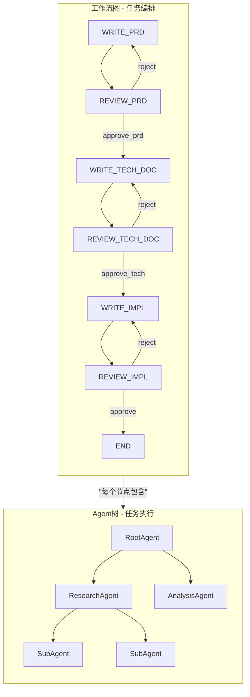
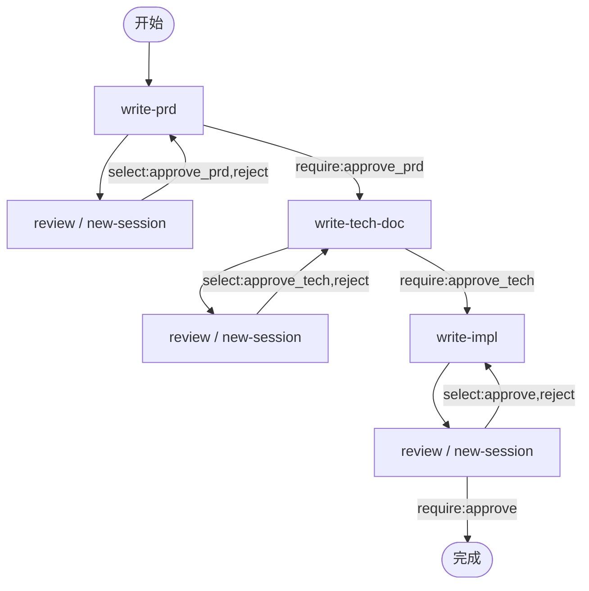
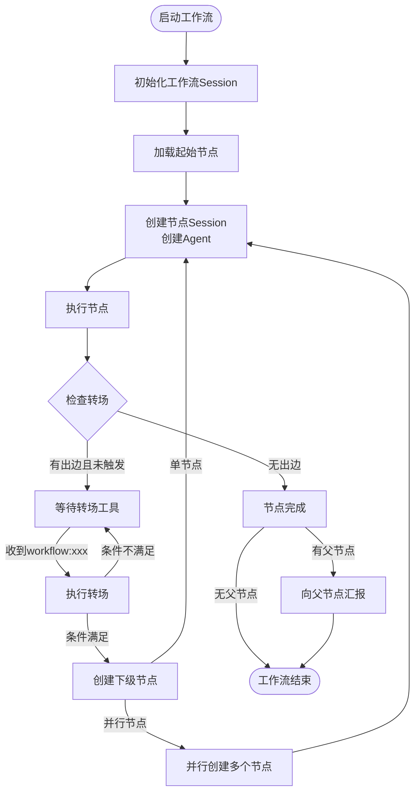
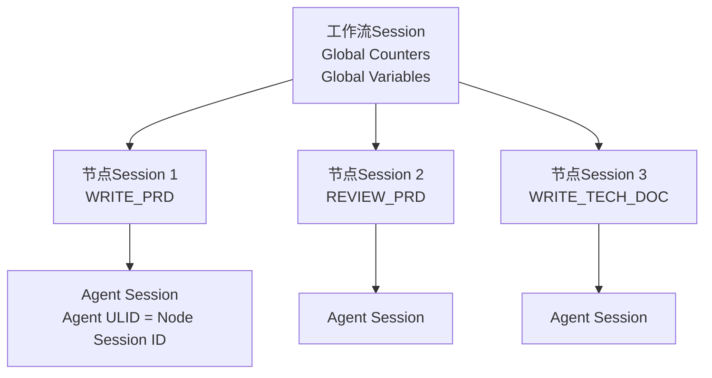
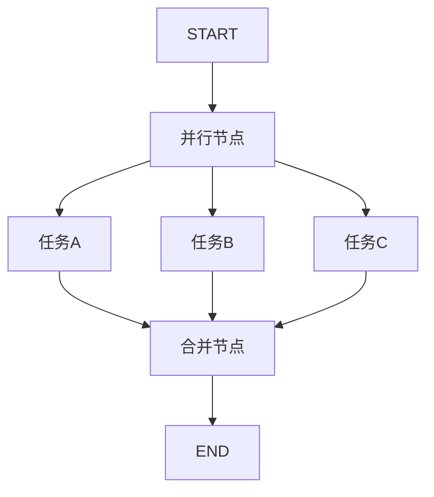
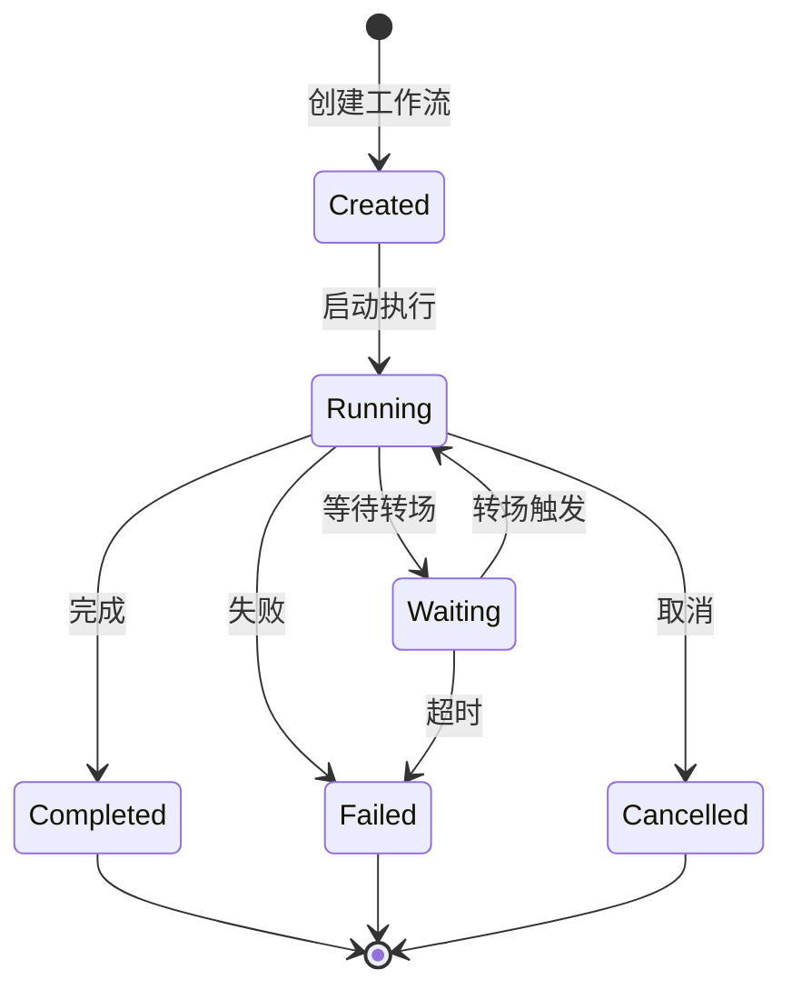
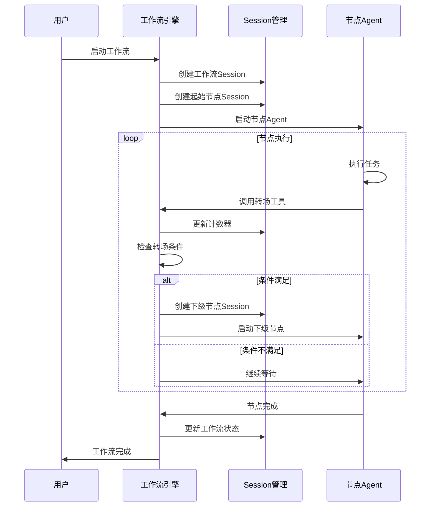

# 工作流引擎技术文档

## 概述

工作流引擎是 Neco 系统的任务编排核心，负责管理工作流的执行、节点转场和状态维护。采用双层架构设计，将任务编排（工作流图）与任务执行（Agent 树）分离。

---

## 双层架构设计

### 架构对比



### 职责分离

| 维度 | 工作流图（Workflow-Level） | Agent 树（Node-Level） |
|------|---------------------------|----------------------|
| **关注点** | 任务编排（做什么） | 任务执行（怎么做） |
| **定义方式** | Mermaid 图静态定义 | 运行时动态创建 |
| **结构类型** | 有向图（DAG） | 树形结构 |
| **控制机制** | 边条件（select/require） | parent_ulid 父子关系 |
| **存储内容** | 计数器、全局变量 | Agent 消息历史 |
| **生命周期** | 工作流启动到完成 | 节点启动到完成 |

---

## 工作流定义

### Mermaid 图定义

工作流使用 Mermaid 流程图语法定义：



### Agent 查找规则

工作流节点**不**使用`nodes`目录。Mermaid图中的节点名称直接对应Agent定义：

**查找优先级**：
1. `workflows/xxx/agents/<agent_name>.md`（工作流特定，优先）
2. `~/.config/neco/agents/<agent_name>.md`（全局配置，后备）

同名Agent：工作流特定覆盖全局配置

**示例**：
- Mermaid图中的`WRITE_PRD`节点 → 查找`workflows/xxx/agents/write-prd.md`
- Mermaid图中的`REVIEW_PRD`节点 → 查找`workflows/xxx/agents/review.md`

### 工作流目录结构

```
workflows/prd/
├── workflow.mermaid          # 工作流图定义
├── neco.toml                 # 工作流特定配置
├── agents/                   # 工作流特定Agent定义
│   ├── write-prd.md          # WRITE_PRD节点使用的Agent
│   ├── write-tech-doc.md     # WRITE_TECH_DOC节点使用的Agent  
│   ├── write-impl.md         # WRITE_IMPL节点使用的Agent
│   └── review.md             # REVIEW_*节点使用的Agent
└── prompts/                  # 工作流特定提示词
    ├── prd-specialist.md
    └── tech-writer.md
```

**注意**：工作流节点配置直接引用`agents`目录的Agent定义，无需额外的`nodes`目录。

---

## 工作流数据结构

### 核心类型定义

```rust
// 工作流定义
pub struct Workflow {
    pub name: String,
    pub nodes: HashMap<NodeId, WorkflowNode>,
    pub edges: HashMap<EdgeId, WorkflowEdge>,
    pub start_node: NodeId,
}

// 工作流节点
pub struct WorkflowNode {
    pub node_id: NodeId,
    pub agent_type: String,           // 对应Agent定义名称
    pub node_type: NodeType,
    pub description: String,
    pub config: NodeConfig,
}

// 节点类型
pub enum NodeType {
    SingleSession,    // 复用现有节点Session
    NewSession,       // 创建新的节点Session
    Parallel,         // 并行执行多个下级节点
}

// 节点配置
pub struct NodeConfig {
    pub new_session: bool,            // 是否创建新Session
    pub model_group: Option<String>,  // 覆盖模型组
    pub prompts: Vec<String>,          // 激活的提示词组件
    pub timeout: Option<Duration>,   // 节点执行超时
}
```

### 边定义

```rust
// 工作流边
pub struct WorkflowEdge {
    pub edge_id: EdgeId,
    pub from_node: NodeId,
    pub to_node: NodeId,
    pub condition: EdgeCondition,
    pub transition: TransitionType,
}

// 边条件
pub struct EdgeCondition {
    pub select_counters: HashMap<String, usize>,  // select触发计数
    pub require_conditions: Vec<String>,          // require条件列表
}

// 转场类型
pub enum TransitionType {
    Automatic,        // 自动转场
    Conditional,      // 条件转场
    Manual,           // 手动转场
}
```

---

## 边条件控制

### select 计数器机制

**原理**：每次触发 select 时，对应计数器 +1

```rust
// 示例：REVIEW_PRD -->|select:approve_prd| WRITE_TECH_DOC
// 当Agent调用 workflow:approve_prd 时：
// counters["approve_prd"] += 1

pub struct CounterManager {
    counters: HashMap<String, AtomicUsize>,
}

impl CounterManager {
    pub fn increment(&self, name: &str) -> usize {
        self.counters
            .get(name)
            .map(|c| c.fetch_add(1, Ordering::SeqCst) + 1)
            .unwrap_or(0)
    }

    pub fn get(&self, name: &str) -> usize {
        self.counters
            .get(name)
            .map(|c| c.load(Ordering::SeqCst))
            .unwrap_or(0)
    }
}
```

### require 条件机制

**原理**：要求计数器 > 0 才能执行

```rust
// 示例：WRITE_TECH_DOC -->|require:approve_prd| NEXT_NODE
// 要求 counters["approve_prd"] > 0

impl EdgeCondition {
    pub fn is_satisfied(&self, counters: &CounterManager) -> bool {
        // 检查所有require条件
        for condition in &self.require_conditions {
            if counters.get(condition) == 0 {
                return false;
            }
        }
        true
    }
}
```

### 转场工具

Agent 使用 `workflow:<option>` 工具触发转场：

```rust
pub struct WorkflowTool {
    pub option: String,      // 转场选项，如 "approve_prd"
    pub message: String,     // 传递的信息内容
}

// 使用示例：
// workflow:approve_prd("PRD已通过审查，可以进入技术文档编写阶段")
```

---

## 工作流执行流程

### 执行流程图



### 执行步骤

1. **初始化工作流 Session**：
   - 生成工作流 Session ID
   - 初始化全局计数器（所有值设为 0）
   - 初始化全局变量

2. **加载起始节点**：
   - 解析 Mermaid 图找到起始节点
   - 加载节点配置

3. **创建节点 Session**：
   - 生成节点 Session ID
   - 关联到工作流 Session
   - 创建 Agent Session

4. **执行节点**：
   - Agent 开始执行节点任务
   - 消息历史保存到节点 Session

5. **等待转场**：
   - 监控转场工具调用
   - 更新计数器状态

6. **执行转场**：
   - 检查边条件是否满足
   - 如满足，创建下级节点
   - 如不满足，继续等待

7. **完成处理**：
   - 节点执行完成
   - 向父节点汇报（如有）
   - 工作流完成

---

## 节点 Session 层次

### 层次结构



### 状态管理

```rust
pub struct WorkflowSession {
    pub session_id: SessionId,
    pub global_counters: HashMap<String, AtomicUsize>,
    pub global_variables: HashMap<String, String>,
    pub node_sessions: HashMap<NodeSessionId, NodeSessionState>,
    pub active_nodes: HashSet<NodeId>,
}

pub struct NodeSessionState {
    pub node_session_id: NodeSessionId,
    pub node_id: NodeId,
    pub status: NodeStatus,
    pub created_at: DateTime<Utc>,
    pub started_at: Option<DateTime<Utc>>,
    pub completed_at: Option<DateTime<Utc>>,
}

pub enum NodeStatus {
    Pending,      // 等待执行
    Running,      // 执行中
    Waiting,      // 等待转场
    Completed,    // 已完成
    Failed,       // 失败
    Cancelled,    // 已取消
}
```

---

## 并行执行

### 并行节点示例



### 并行执行机制

```rust
pub struct ParallelExecution {
    pub parent_node: NodeId,
    pub parallel_nodes: Vec<NodeId>,
    pub completion_required: bool,  // 是否等待所有节点完成
}

impl WorkflowEngine {
    pub async fn execute_parallel(
        &mut self,
        parallel_nodes: Vec<NodeId>,
    ) -> Result<Vec<NodeResult>> {
        let futures: Vec<_> = parallel_nodes
            .into_iter()
            .map(|node_id| {
                self.execute_node(node_id)
            })
            .collect();

        // 并行执行所有节点
        join_all(futures).await
    }
}
```

---

## 工作流状态机

### 状态转换



### 状态说明

| 状态 | 说明 | 转换条件 |
|------|------|----------|
| Created | 已创建但未启动 | 手动启动 -> Running |
| Running | 有节点正在执行 | 节点完成且无需等待 -> Completed |
| Waiting | 等待转场工具调用 | 收到 workflow:xxx -> Running |
| Completed | 所有节点完成 | 结束 |
| Failed | 节点执行失败 | 结束 |
| Cancelled | 被用户取消 | 结束 |

---

## 错误处理

### 节点失败处理

```rust
pub enum NodeFailurePolicy {
    Stop,           // 停止工作流
    Continue,       // 继续执行其他节点
    Retry {         // 重试
        max_attempts: usize,
        backoff: Duration,
    },
    Fallback(NodeId), // 切换到备用节点
}

impl WorkflowEngine {
    pub async fn handle_node_failure(
        &mut self,
        node_id: NodeId,
        error: NodeError,
    ) -> WorkflowAction {
        let policy = self.get_failure_policy(node_id);

        match policy {
            NodeFailurePolicy::Stop => {
                self.stop_workflow().await;
                WorkflowAction::Stop
            }
            NodeFailurePolicy::Continue => {
                self.continue_workflow().await;
                WorkflowAction::Continue
            }
            NodeFailurePolicy::Retry { max_attempts, backoff } => {
                self.retry_node(node_id, max_attempts, backoff).await
            }
            NodeFailurePolicy::Fallback(fallback_node) => {
                self.transition_to(fallback_node).await
            }
        }
    }
}
```

### 死锁检测

```rust
pub struct DeadlockDetector {
    last_progress: Instant,
    timeout: Duration,
}

impl DeadlockDetector {
    pub fn check_progress(&self, workflow: &WorkflowSession
) -> bool {
        // 超过5分钟无进度，判定为死锁
        self.last_progress.elapsed() < self.timeout
    }
}
```

---

## 设计模式

### 1. 状态模式（State Pattern）

节点状态使用状态模式管理：
- 不同状态有不同的行为
- 状态转换由工作流引擎控制

### 2. 观察者模式（Observer Pattern）

工作流事件使用观察者模式：
- 订阅工作流状态变化
- 事件发生时通知观察者

### 3. 命令模式（Command Pattern）

转场工具使用命令模式：
- `workflow:xxx` 封装为命令对象
- 支持命令的撤销和重做

### 4. 模板方法模式（Template Method Pattern）

节点执行使用模板方法：
- 定义节点执行的标准流程
- 具体节点可覆盖特定步骤

---

## 数据流

### 工作流数据流



---

*本文档遵循 REQUIREMENT.md 中工作流和自定义工作流相关需求设计。*
