# Neco 技术架构文档

本文档描述Neco项目的技术架构，包括模块划分、数据结构设计、数据流向和模块间关系。

## 1. 架构概述

Neco是一个原生支持多智能体协作的智能体应用，采用Rust开发，遵循模块化、可扩展的设计原则。

### 1.1 核心设计原则

- **模块化设计**：每个功能模块独立成crate，通过清晰的trait接口交互
- **类型安全**：利用Rust的类型系统防止无效状态
- **异步优先**：基于tokio的异步运行时，支持高并发
- **可扩展性**：通过trait抽象支持不同的模型提供商、工具和通道
- **数据驱动**：所有状态变化通过显式的数据结构传递

### 1.2 架构分层

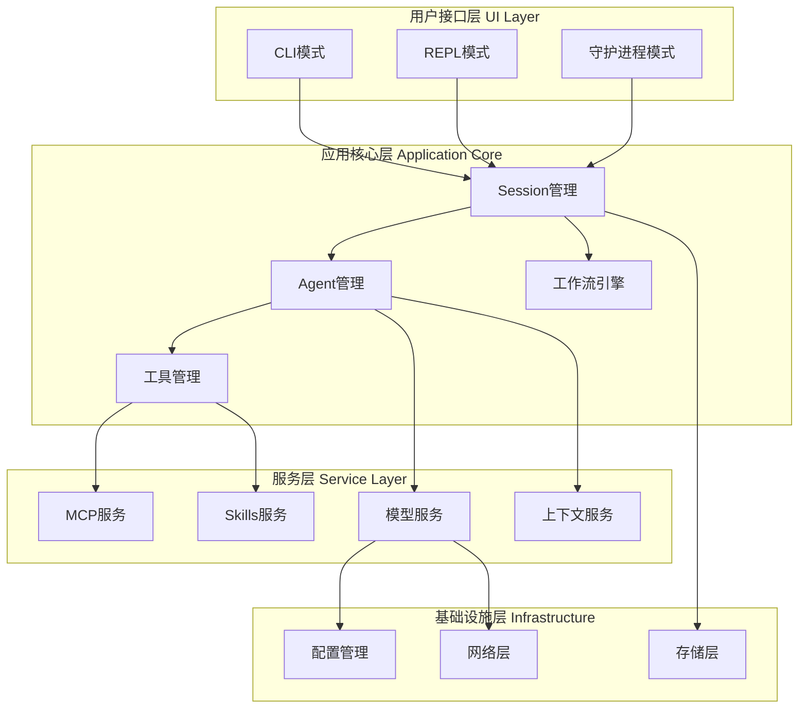
```mermaid
graph TB
    subgraph "用户接口层 UI Layer"
        CLI[CLI模式]
        REPL[REPL模式]
        Daemon[守护进程模式]
    end

    subgraph "应用核心层 Application Core"
        SessionMgr[Session管理]
        Workflow[工作流引擎]
        AgentMgr[Agent管理]
        ToolMgr[工具管理]
    end

    subgraph "服务层 Service Layer"
        ModelService[模型服务]
        MCPService[MCP服务]
        SkillService[Skills服务]
        ContextService[上下文服务]
    end

    subgraph "基础设施层 Infrastructure"
        Config[配置管理]
        Storage[存储层]
        Network[网络层]
    end

    CLI --> SessionMgr
    REPL --> SessionMgr
    Daemon --> SessionMgr
    
    SessionMgr --> AgentMgr
    SessionMgr --> Workflow
    AgentMgr --> ToolMgr
    
    AgentMgr --> ModelService
    ToolMgr --> MCPService
    ToolMgr --> SkillService
    AgentMgr --> ContextService
    
    ModelService --> Config
    ModelService --> Network
    SessionMgr --> Storage
```

## 2. Crate划分

基于功能内聚和依赖关系，项目划分为以下crate：

| Crate | 职责 | 关键依赖 |
|-------|------|----------|
| `neco-core` | 核心类型和trait定义 | - |
| `neco-config` | 配置管理 | neco-core, toml |
| `neco-model` | 模型调用服务 | neco-core, async-openai |
| `neco-session` | Session管理 | neco-core, ulid |
| `neco-mcp` | MCP客户端 | neco-core, rmcp |
| `neco-skill` | Skills管理 | neco-core |
| `neco-context` | 上下文压缩 | neco-core |
| `neco-agent` | Agent逻辑 | neco-core, neco-model, neco-tool |
| `neco-workflow` | 工作流引擎 | neco-core, neco-agent |
| `neco-tool` | 工具实现 | neco-core, neco-fs, neco-mcp |
| `neco-fs` | 文件系统工具 | neco-core |
| `neco-ui` | 用户接口 | neco-core, ratatui |
| `neco-daemon` | 守护进程 | neco-core, axum |
| `neco` | 主入口 | 所有上述crate |

### 2.1 Crate依赖关系

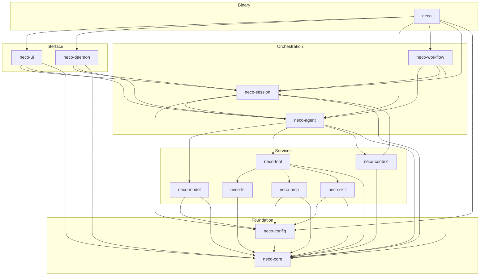
```mermaid
graph TD
    neco[neco]
    
    subgraph "Binary"
        neco
    end
    
    subgraph "Interface"
        ui[neco-ui]
        daemon[neco-daemon]
    end
    
    subgraph "Orchestration"
        agent[neco-agent]
        workflow[neco-workflow]
        session[neco-session]
    end
    
    subgraph "Services"
        model[neco-model]
        mcp[neco-mcp]
        skill[neco-skill]
        context[neco-context]
        tool[neco-tool]
        fs[neco-fs]
    end
    
    subgraph "Foundation"
        config[neco-config]
        core[neco-core]
    end
    
    neco --> ui
    neco --> daemon
    neco --> agent
    neco --> workflow
    neco --> session
    neco --> config
    
    ui --> session
    ui --> agent
    daemon --> session
    daemon --> agent
    
    session --> agent
    session --> config
    
    workflow --> agent
    workflow --> session
    
    agent --> model
    agent --> tool
    agent --> context
    
    tool --> fs
    tool --> mcp
    tool --> skill
    
    model --> config
    mcp --> config
    skill --> config
    context --> session
    
    config --> core
    model --> core
    mcp --> core
    skill --> core
    context --> core
    agent --> core
    workflow --> core
    session --> core
    tool --> core
    fs --> core
    ui --> core
    daemon --> core
```

## 3. 核心数据结构设计

### 3.1 标识符系统

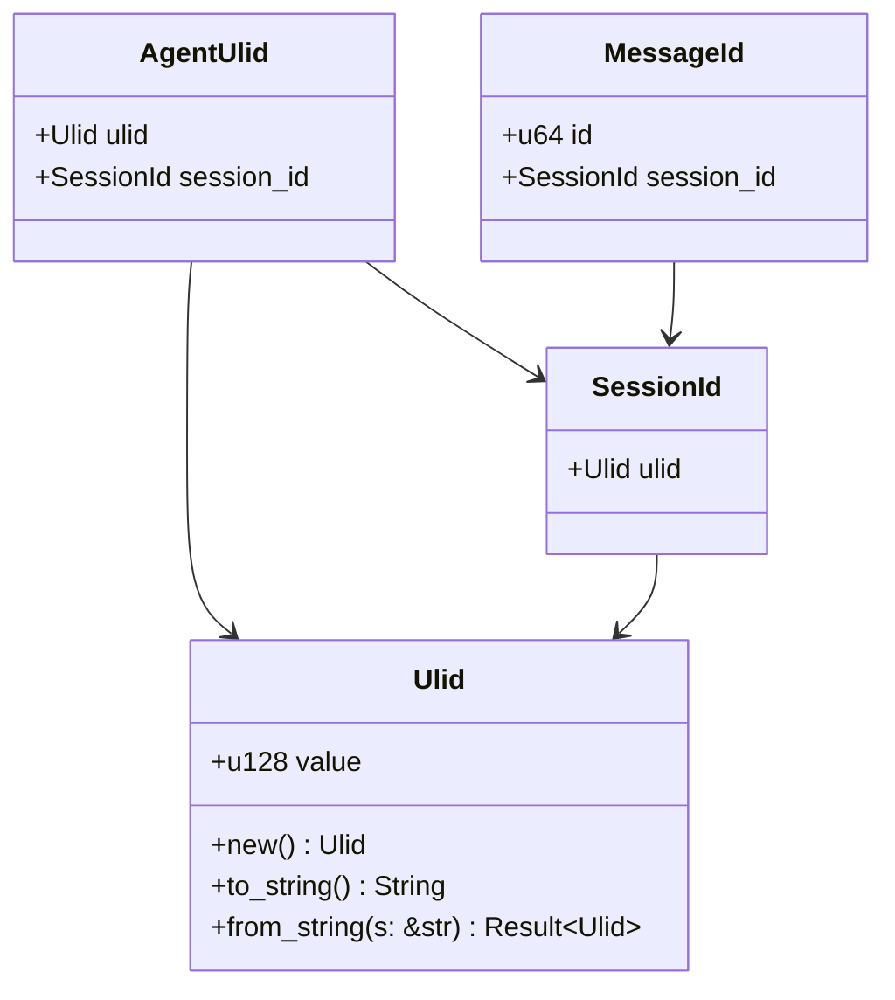
```mermaid
classDiagram
    class Ulid {
        +u128 value
        +new() Ulid
        +to_string() String
        +from_string(s: &str) Result~Ulid~
    }
    
    class SessionId {
        +Ulid ulid
    }
    
    class AgentUlid {
        +Ulid ulid
        +SessionId session_id
    }
    
    class MessageId {
        +u64 id
        +SessionId session_id
    }
    
    SessionId --> Ulid
    AgentUlid --> Ulid
    AgentUlid --> SessionId
    MessageId --> SessionId
```

**设计说明：**

- **SessionId**: 顶级容器标识，创建工作流或对话时生成
- **AgentUlid**: 每个Agent实例的唯一标识
  - 第一个Agent的ULID与SessionId相同
  - 后续Agent生成新的ULID
  - 通过`parent_ulid`建立树形关系
- **MessageId**: Session范围内的唯一消息ID，使用原子自增分配器

### 3.2 Session数据结构

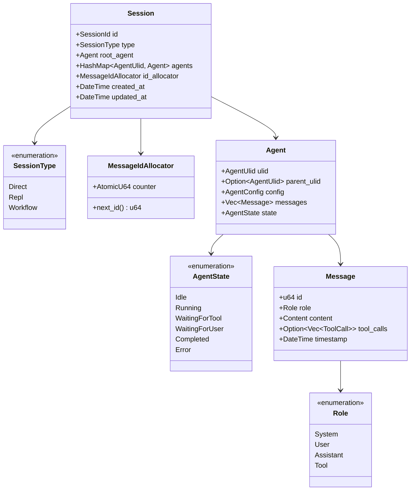
```mermaid
classDiagram
    class Session {
        +SessionId id
        +SessionType type
        +Agent root_agent
        +HashMap~AgentUlid, Agent~ agents
        +MessageIdAllocator id_allocator
        +DateTime created_at
        +DateTime updated_at
    }
    
    class SessionType {
        <<enumeration>>
        Direct
        Repl
        Workflow
    }
    
    class MessageIdAllocator {
        +AtomicU64 counter
        +next_id() u64
    }
    
    class Agent {
        +AgentUlid ulid
        +Option~AgentUlid~ parent_ulid
        +AgentConfig config
        +Vec~Message~ messages
        +AgentState state
    }
    
    class AgentState {
        <<enumeration>>
        Idle
        Running
        WaitingForTool
        WaitingForUser
        Completed
        Error
    }
    
    class Message {
        +u64 id
        +Role role
        +Content content
        +Option~Vec~ToolCall~~ tool_calls
        +DateTime timestamp
    }
    
    class Role {
        <<enumeration>>
        System
        User
        Assistant
        Tool
    }
    
    Session --> SessionType
    Session --> MessageIdAllocator
    Session --> Agent
    Agent --> AgentState
    Agent --> Message
    Message --> Role
```

### 3.3 工作流数据结构

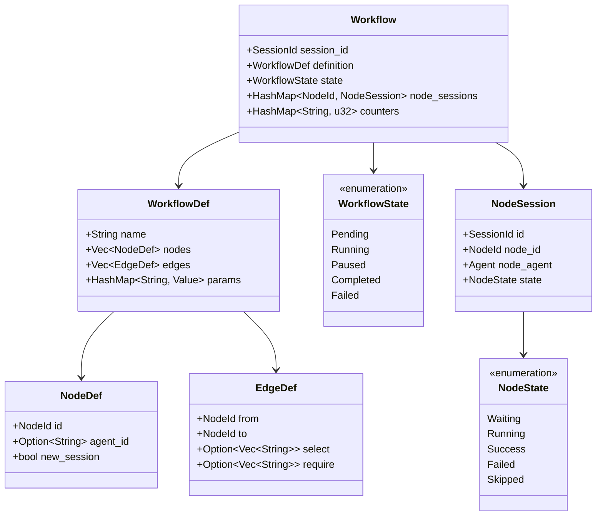
```mermaid
classDiagram
    class Workflow {
        +SessionId session_id
        +WorkflowDef definition
        +WorkflowState state
        +HashMap~NodeId, NodeSession~ node_sessions
        +HashMap~String, u32~ counters
    }
    
    class WorkflowDef {
        +String name
        +Vec~NodeDef~ nodes
        +Vec~EdgeDef~ edges
        +HashMap~String, Value~ params
    }
    
    class NodeDef {
        +NodeId id
        +Option~String~ agent_id
        +bool new_session
    }
    
    class EdgeDef {
        +NodeId from
        +NodeId to
        +Option~Vec~String~~ select
        +Option~Vec~String~~ require
    }
    
    class WorkflowState {
        <<enumeration>>
        Pending
        Running
        Paused
        Completed
        Failed
    }
    
    class NodeSession {
        +SessionId id
        +NodeId node_id
        +Agent node_agent
        +NodeState state
    }
    
    class NodeState {
        <<enumeration>>
        Waiting
        Running
        Success
        Failed
        Skipped
    }
    
    Workflow --> WorkflowDef
    Workflow --> WorkflowState
    Workflow --> NodeSession
    WorkflowDef --> NodeDef
    WorkflowDef --> EdgeDef
    NodeSession --> NodeState
```

**关键设计：**

- **双层结构**：
  - 工作流层（Workflow-Level）：管理节点图结构和转换控制
  - 节点层（Node-Level）：每个节点有自己的Agent树
  
- **计数器系统**：边的`select`触发时计数器+1，`require`检查计数器>0

- **节点Agent**：工作流节点的Agent同时也是该节点的最上级Agent，其ULID与节点Session ID相同

### 3.4 配置数据结构

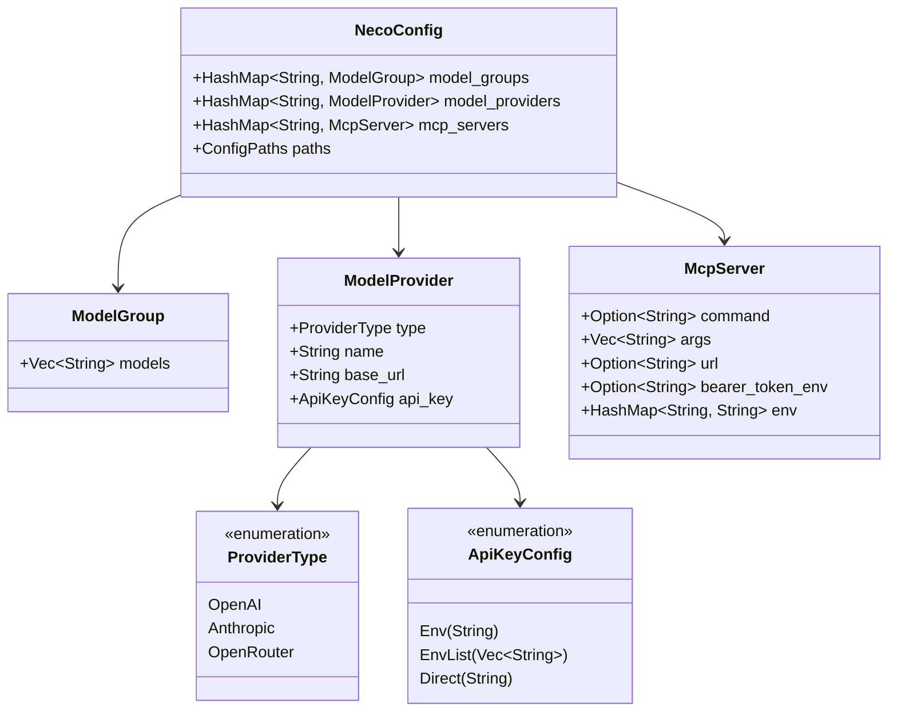
```mermaid
classDiagram
    class NecoConfig {
        +HashMap~String, ModelGroup~ model_groups
        +HashMap~String, ModelProvider~ model_providers
        +HashMap~String, McpServer~ mcp_servers
        +ConfigPaths paths
    }
    
    class ModelGroup {
        +Vec~String~ models
    }
    
    class ModelProvider {
        +ProviderType type
        +String name
        +String base_url
        +ApiKeyConfig api_key
    }
    
    class ProviderType {
        <<enumeration>>
        OpenAI
        Anthropic
        OpenRouter
    }
    
    class ApiKeyConfig {
        <<enumeration>>
        Env(String)
        EnvList(Vec~String~)
        Direct(String)
    }
    
    class McpServer {
        +Option~String~ command
        +Vec~String~ args
        +Option~String~ url
        +Option~String~ bearer_token_env
        +HashMap~String, String~ env
    }
    
    NecoConfig --> ModelGroup
    NecoConfig --> ModelProvider
    NecoConfig --> McpServer
    ModelProvider --> ProviderType
    ModelProvider --> ApiKeyConfig
```

### 3.5 工具数据结构

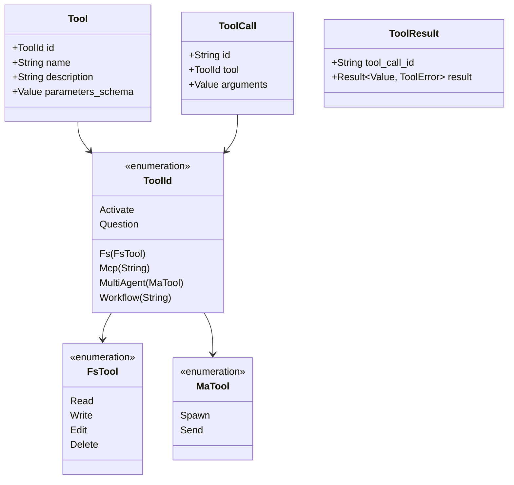
```mermaid
classDiagram
    class Tool {
        +ToolId id
        +String name
        +String description
        +Value parameters_schema
    }
    
    class ToolId {
        <<enumeration>>
        Activate
        Fs(FsTool)
        Mcp(String)
        MultiAgent(MaTool)
        Question
        Workflow(String)
    }
    
    class FsTool {
        <<enumeration>>
        Read
        Write
        Edit
        Delete
    }
    
    class MaTool {
        <<enumeration>>
        Spawn
        Send
    }
    
    class ToolCall {
        +String id
        +ToolId tool
        +Value arguments
    }
    
    class ToolResult {
        +String tool_call_id
        +Result~Value, ToolError~ result
    }
    
    Tool --> ToolId
    ToolId --> FsTool
    ToolId --> MaTool
    ToolCall --> ToolId
```

## 4. 数据流向

### 4.1 用户输入到模型响应的主流程

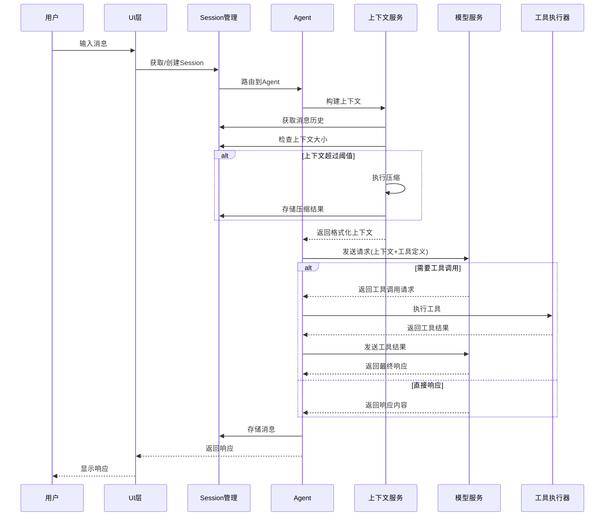
```mermaid
sequenceDiagram
    participant User as 用户
    participant UI as UI层
    participant Session as Session管理
    participant Agent as Agent
    participant Context as 上下文服务
    participant Model as 模型服务
    participant Tool as 工具执行器

    User->>UI: 输入消息
    UI->>Session: 获取/创建Session
    Session->>Agent: 路由到Agent
    
    Agent->>Context: 构建上下文
    Context->>Session: 获取消息历史
    Context->>Session: 检查上下文大小
    
    alt 上下文超过阈值
        Context->>Context: 执行压缩
        Context->>Session: 存储压缩结果
    end
    
    Context-->>Agent: 返回格式化上下文
    
    Agent->>Model: 发送请求(上下文+工具定义)
    
    alt 需要工具调用
        Model-->>Agent: 返回工具调用请求
        Agent->>Tool: 执行工具
        Tool-->>Agent: 返回工具结果
        Agent->>Model: 发送工具结果
        Model-->>Agent: 返回最终响应
    else 直接响应
        Model-->>Agent: 返回响应内容
    end
    
    Agent->>Session: 存储消息
    Agent-->>UI: 返回响应
    UI-->>User: 显示响应
```

### 4.2 SubAgent创建流程

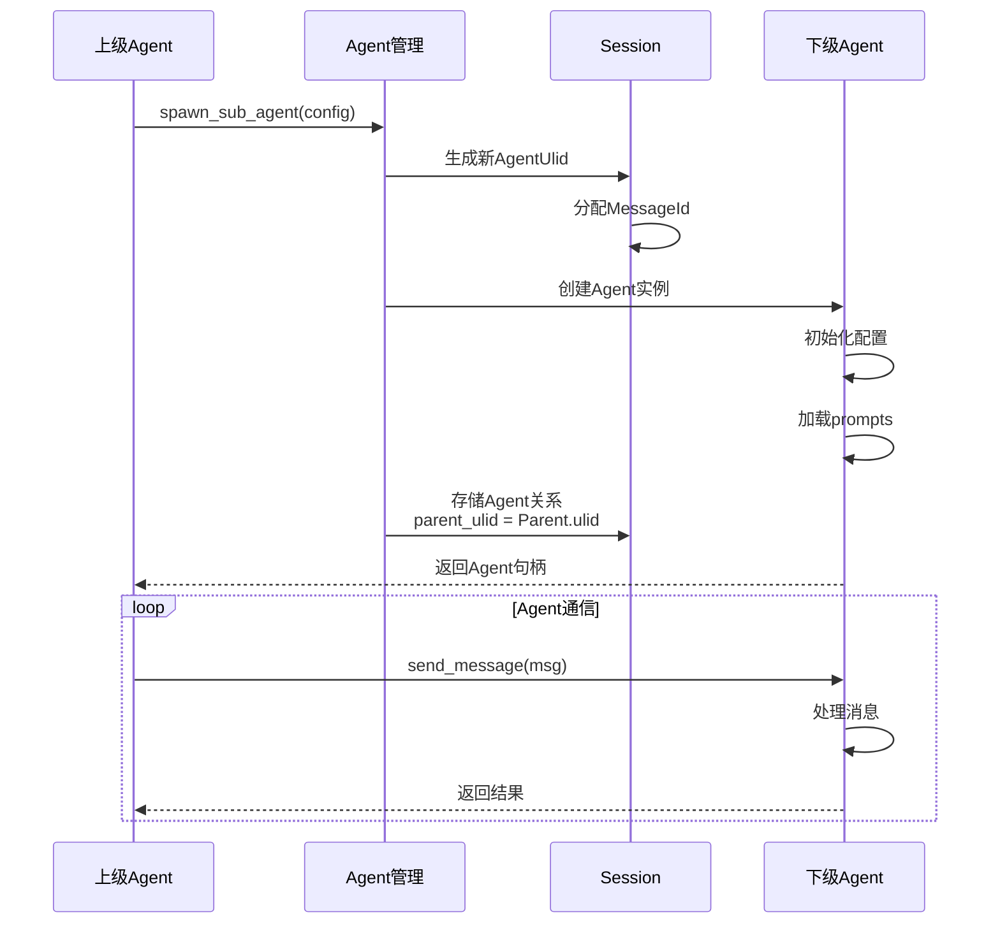
```mermaid
sequenceDiagram
    participant Parent as 上级Agent
    participant AgentMgr as Agent管理
    participant Session as Session
    participant Child as 下级Agent

    Parent->>AgentMgr: spawn_sub_agent(config)
    AgentMgr->>Session: 生成新AgentUlid
    Session->>Session: 分配MessageId
    
    AgentMgr->>Child: 创建Agent实例
    Child->>Child: 初始化配置
    Child->>Child: 加载prompts
    
    AgentMgr->>Session: 存储Agent关系<br/>parent_ulid = Parent.ulid
    
    Child-->>Parent: 返回Agent句柄
    
    loop Agent通信
        Parent->>Child: send_message(msg)
        Child->>Child: 处理消息
        Child-->>Parent: 返回结果
    end
```

### 4.3 工作流执行流程

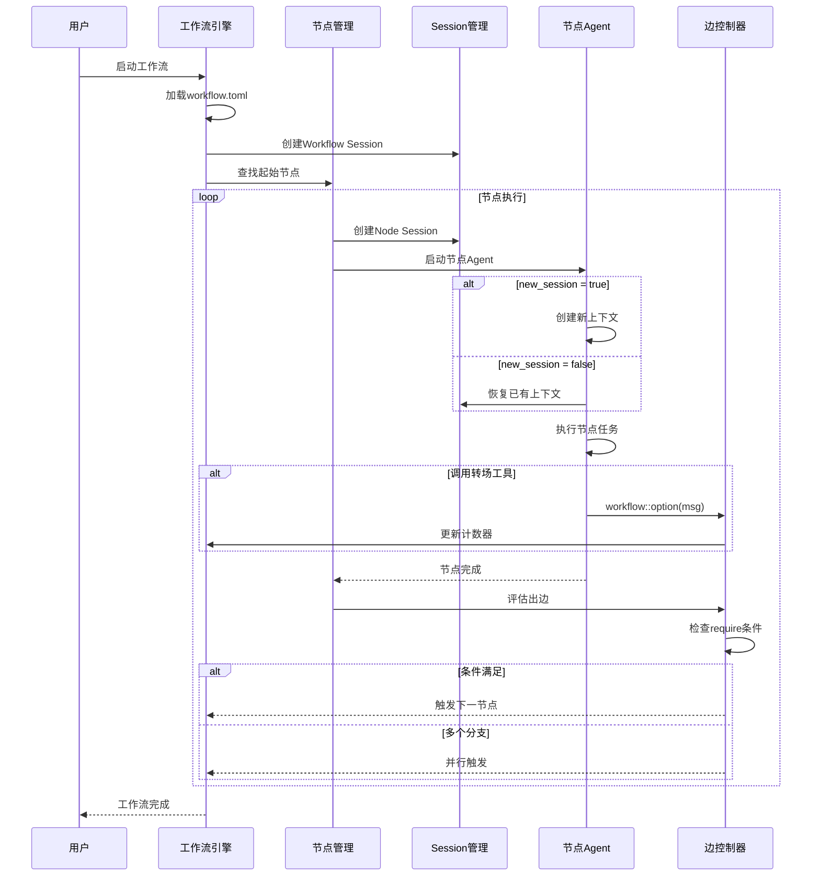
```mermaid
sequenceDiagram
    participant User as 用户
    participant Workflow as 工作流引擎
    participant NodeMgr as 节点管理
    participant Session as Session管理
    participant Agent as 节点Agent
    participant Edge as 边控制器

    User->>Workflow: 启动工作流
    Workflow->>Workflow: 加载workflow.toml
    Workflow->>Session: 创建Workflow Session
    
    Workflow->>NodeMgr: 查找起始节点
    
    loop 节点执行
        NodeMgr->>Session: 创建Node Session
        NodeMgr->>Agent: 启动节点Agent
        
        alt new_session = true
            Agent->>Agent: 创建新上下文
        else new_session = false
            Agent->>Session: 恢复已有上下文
        end
        
        Agent->>Agent: 执行节点任务
        
        alt 调用转场工具
            Agent->>Edge: workflow::option(msg)
            Edge->>Workflow: 更新计数器
        end
        
        Agent-->>NodeMgr: 节点完成
        
        NodeMgr->>Edge: 评估出边
        Edge->>Edge: 检查require条件
        
        alt 条件满足
            Edge-->>Workflow: 触发下一节点
        else 多个分支
            Edge-->>Workflow: 并行触发
        end
    end
    
    Workflow-->>User: 工作流完成
```

### 4.4 模型调用与故障转移流程

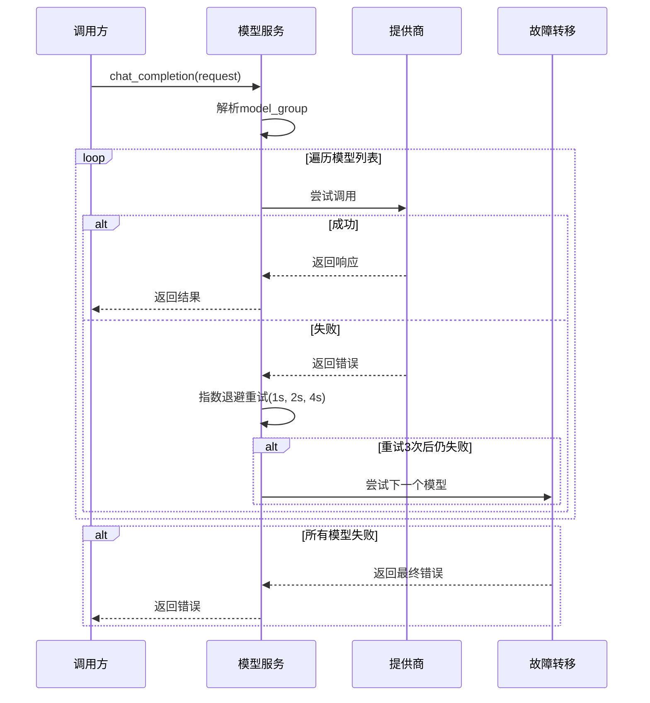
```mermaid
sequenceDiagram
    participant Caller as 调用方
    participant ModelSvc as 模型服务
    participant Provider as 提供商
    participant Fallback as 故障转移

    Caller->>ModelSvc: chat_completion(request)
    ModelSvc->>ModelSvc: 解析model_group
    
    loop 遍历模型列表
        ModelSvc->>Provider: 尝试调用
        
        alt 成功
            Provider-->>ModelSvc: 返回响应
            ModelSvc-->>Caller: 返回结果
        else 失败
            Provider-->>ModelSvc: 返回错误
            ModelSvc->>ModelSvc: 指数退避重试(1s, 2s, 4s)
            
            alt 重试3次后仍失败
                ModelSvc->>Fallback: 尝试下一个模型
            end
        end
    end
    
    alt 所有模型失败
        Fallback-->>ModelSvc: 返回最终错误
        ModelSvc-->>Caller: 返回错误
    end
```

### 4.5 MCP工具调用流程

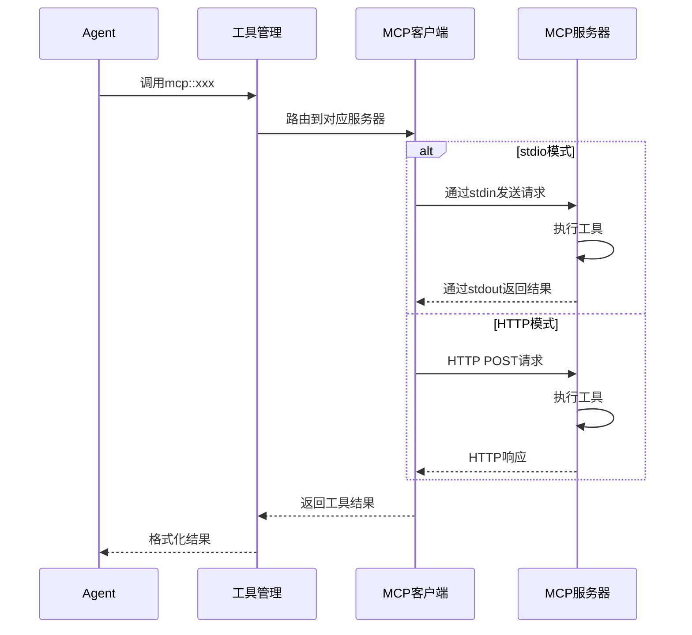
```mermaid
sequenceDiagram
    participant Agent as Agent
    participant ToolMgr as 工具管理
    participant McpClient as MCP客户端
    participant Server as MCP服务器

    Agent->>ToolMgr: 调用mcp::xxx
    ToolMgr->>McpClient: 路由到对应服务器
    
    alt stdio模式
        McpClient->>Server: 通过stdin发送请求
        Server->>Server: 执行工具
        Server-->>McpClient: 通过stdout返回结果
    else HTTP模式
        McpClient->>Server: HTTP POST请求
        Server->>Server: 执行工具
        Server-->>McpClient: HTTP响应
    end
    
    McpClient-->>ToolMgr: 返回工具结果
    ToolMgr-->>Agent: 格式化结果
```

### 4.6 上下文压缩流程

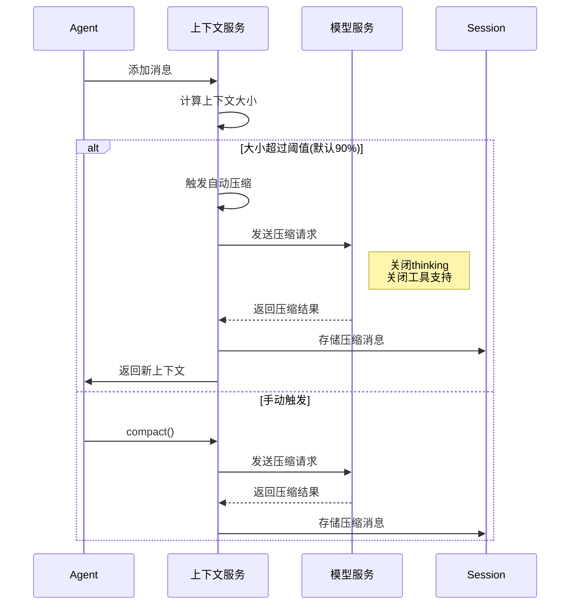
```mermaid
sequenceDiagram
    participant Agent as Agent
    participant ContextSvc as 上下文服务
    participant ModelSvc as 模型服务
    participant Session as Session

    Agent->>ContextSvc: 添加消息
    ContextSvc->>ContextSvc: 计算上下文大小
    
    alt 大小超过阈值(默认90%)
        ContextSvc->>ContextSvc: 触发自动压缩
        ContextSvc->>ModelSvc: 发送压缩请求
        Note right of ModelSvc: 关闭thinking<br/>关闭工具支持
        ModelSvc-->>ContextSvc: 返回压缩结果
        ContextSvc->>Session: 存储压缩消息
        ContextSvc->>Agent: 返回新上下文
    else 手动触发
        Agent->>ContextSvc: compact()
        ContextSvc->>ModelSvc: 发送压缩请求
        ModelSvc-->>ContextSvc: 返回压缩结果
        ContextSvc->>Session: 存储压缩消息
    end
```

## 5. 模块间接口设计

### 5.1 核心Trait定义

```rust
// neco-core/src/traits.rs

/// 可配置的组件
pub trait Configurable {
    type Config;
    fn configure(config: Self::Config) -> Self {
        // TODO: 实现配置逻辑
        todo!()
    }
}

/// Agent能力提供者
#[async_trait]
pub trait AgentCapability: Send + Sync {
    async fn execute(&self, input: AgentInput) -> Result<AgentOutput, AgentError> {
        // TODO: 实现Agent执行逻辑
        // - 解析输入消息
        // - 构建上下文
        // - 调用模型或工具
        // - 返回结果
        todo!()
    }
}

/// 模型客户端
#[async_trait]
pub trait ModelClient: Send + Sync {
    async fn chat_completion(&self, request: ChatRequest) -> Result<ChatResponse, ModelError> {
        // TODO: 实现模型调用逻辑
        // - 解析请求参数
        // - 选择合适模型
        // - 发送API请求
        // - 处理响应
        todo!()
    }
    async fn chat_completion_stream(&self, request: ChatRequest) -> Result<ChatStream, ModelError> {
        // TODO: 实现流式模型调用逻辑
        // - 解析请求参数
        // - 选择合适模型
        // - 建立流式连接
        // - 返回流式响应
        todo!()
    }
}

/// 工具提供者
#[async_trait]
pub trait ToolProvider: Send + Sync {
    fn name(&self) -> &str {
        // TODO: 返回工具名称
        todo!()
    }
    fn description(&self) -> &str {
        // TODO: 返回工具描述
        todo!()
    }
    fn schema(&self) -> Value {
        // TODO: 返回工具参数的JSON Schema
        todo!()
    }
    async fn execute(&self, args: Value) -> Result<ToolResult, ToolError> {
        // TODO: 实现工具执行逻辑
        // - 验证参数
        // - 执行工具逻辑
        // - 返回结果或错误
        todo!()
    }
}

/// 存储后端
#[async_trait]
pub trait StorageBackend: Send + Sync {
    async fn save_session(&self, session: &Session) -> Result<(), StorageError> {
        // TODO: 实现Session保存逻辑
        // - 序列化Session数据
        // - 写入存储系统
        todo!()
    }
    async fn load_session(&self, id: SessionId) -> Result<Session, StorageError> {
        // TODO: 实现Session加载逻辑
        // - 从存储系统读取数据
        // - 反序列化Session对象
        todo!()
    }
    async fn save_agent(&self, session_id: SessionId, agent: &Agent) -> Result<(), StorageError> {
        // TODO: 实现Agent保存逻辑
        // - 序列化Agent数据
        // - 关联到Session保存
        todo!()
    }
    async fn load_agent(&self, ulid: AgentUlid) -> Result<Agent, StorageError> {
        // TODO: 实现Agent加载逻辑
        // - 根据ULID查找Agent
        // - 反序列化Agent对象
        todo!()
    }
}
```

### 5.2 事件系统

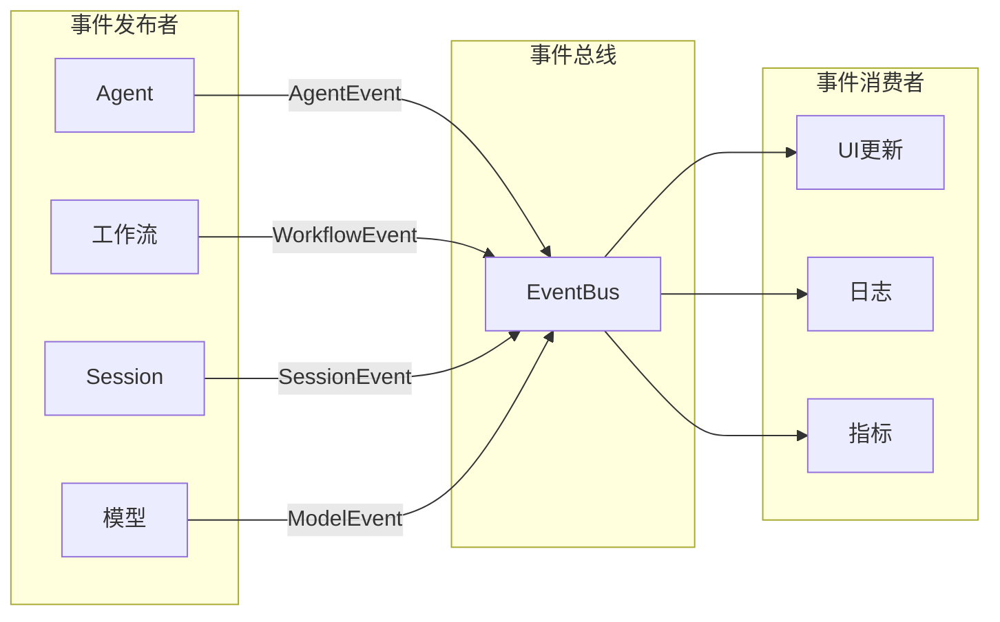
```mermaid
graph LR
    subgraph "事件发布者"
        A[Agent]
        W[工作流]
        S[Session]
        M[模型]
    end
    
    subgraph "事件总线"
        Bus[EventBus]
    end
    
    subgraph "事件消费者"
        UI[UI更新]
        Log[日志]
        Metric[指标]
    end
    
    A -->|AgentEvent| Bus
    W -->|WorkflowEvent| Bus
    S -->|SessionEvent| Bus
    M -->|ModelEvent| Bus
    
    Bus --> UI
    Bus --> Log
    Bus --> Metric
```

**事件类型定义：**

```rust
pub enum Event {
    Session(SessionEvent),
    Agent(AgentEvent),
    Workflow(WorkflowEvent),
    Model(ModelEvent),
    Tool(ToolEvent),
}

pub enum AgentEvent {
    Created { ulid: AgentUlid, parent: Option<AgentUlid> },
    MessageAdded { ulid: AgentUlid, message_id: u64 },
    StateChanged { ulid: AgentUlid, state: AgentState },
    ToolCalled { ulid: AgentUlid, tool: ToolId },
}

pub enum WorkflowEvent {
    Started { session_id: SessionId },
    NodeStarted { node_id: NodeId },
    NodeCompleted { node_id: NodeId, result: NodeResult },
    Transition { from: NodeId, to: NodeId },
    Completed { session_id: SessionId },
}

// TODO: 实现事件处理逻辑
// - 事件序列化/反序列化
// - 事件路由分发
// - 事件监听器管理
```

## 6. 存储设计

### 6.1 文件系统布局

```
~/.config/neco/           # 配置目录
├── neco.toml            # 主配置
├── prompts/
│   ├── base.md
│   └── multi-agent.md
├── agents/
│   ├── coder.md
│   └── reviewer.md
└── workflows/
    └── prd/
        ├── workflow.toml
        └── agents/
            └── review.md

~/.local/neco/           # 数据目录
└── {session_id}/        # Session目录
    ├── workflow.toml    # 工作流状态（如果是工作流）
    ├── {agent_ulid}.toml # Agent消息文件
    └── ...
```

### 6.2 Agent TOML格式

```toml
# Agent配置
prompts = ["base", "multi-agent"]

# 层级关系
parent_ulid = "01HF..."  # 可选

# 消息列表
[[messages]]
id = 1
role = "user"
content = "..."

[[messages]]
id = 2
role = "assistant"
content = "..."
tool_calls = [
    { id = "call_1", type = "function", function = { name = "fs::read", arguments = "..." } }
]
```

### 6.3 工作流Session TOML格式

```toml
# 工作流状态
workflow_id = "prd"
created_at = "2026-03-04T10:00:00Z"

# 计数器
[counters]
approve_prd = 1
reject = 0

# 全局变量
[variables]
quality_score = 0.85

# 节点状态
[[nodes]]
id = "write-prd"
state = "completed"
agent_ulid = "01HF..."

[[nodes]]
id = "review-prd"
state = "running"
agent_ulid = "01HG..."
```

## 7. 错误处理策略

### 7.1 错误分类

| 错误类型 | 处理策略 | 恢复机制 |
|---------|---------|---------|
| 模型调用错误 | 自动重试3次 → 故障转移 | 指数退避(1s, 2s, 4s) |
| 工具调用错误 | 返回给Agent决定 | Agent决定重试/跳过/终止 |
| 配置错误 | 启动时panic | 修复配置后重启 |
| 工作流错误 | 根据配置决定 | 死锁检测(5分钟) |
| 存储错误 | 记录日志，返回错误 | 手动修复 |

### 7.2 错误传播

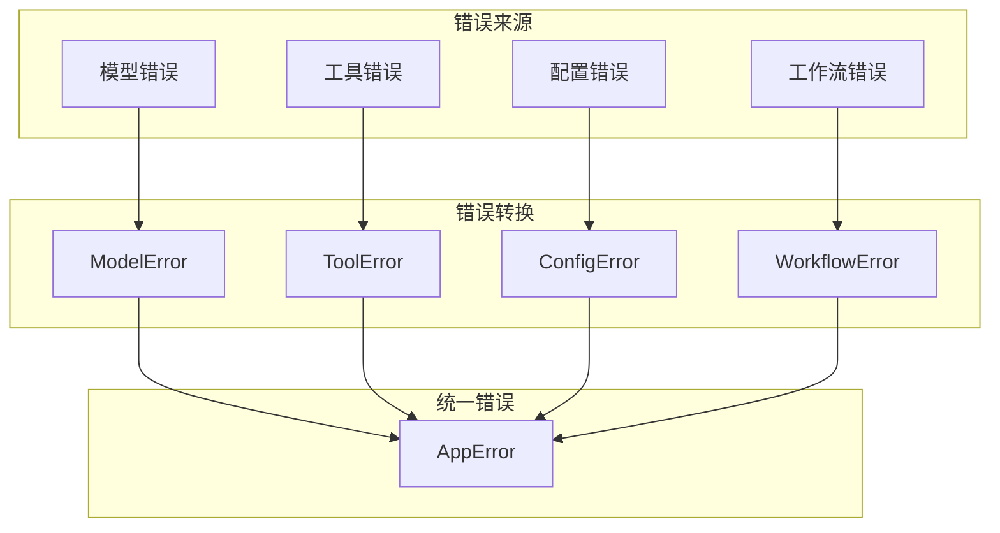
```mermaid
graph TD
    subgraph "错误来源"
        Model[模型错误]
        Tool[工具错误]
        Config[配置错误]
        Workflow[工作流错误]
    end
    
    subgraph "错误转换"
        E1[ModelError]
        E2[ToolError]
        E3[ConfigError]
        E4[WorkflowError]
    end
    
    subgraph "统一错误"
        App[AppError]
    end
    
    Model --> E1
    Tool --> E2
    Config --> E3
    Workflow --> E4
    
    E1 --> App
    E2 --> App
    E3 --> App
    E4 --> App
```

## 8. 并发设计

### 8.1 并发模型

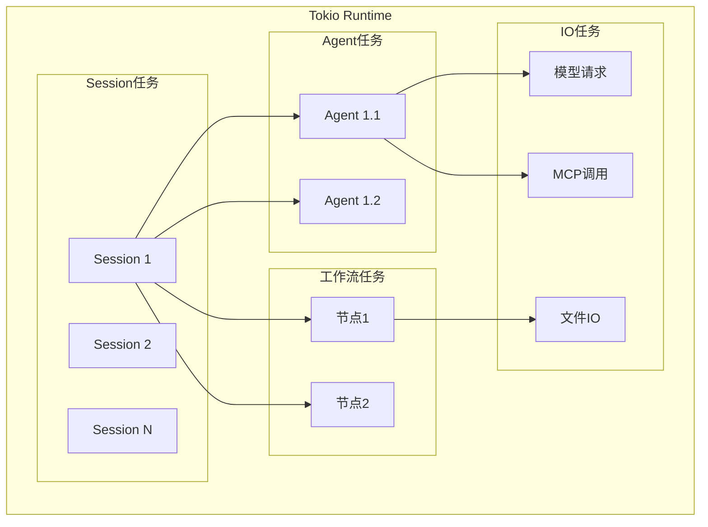
```mermaid
graph TB
    subgraph "Tokio Runtime"
        subgraph "Session任务"
            S1[Session 1]
            S2[Session 2]
            S3[Session N]
        end
        
        subgraph "Agent任务"
            A1[Agent 1.1]
            A2[Agent 1.2]
        end
        
        subgraph "工作流任务"
            W1[节点1]
            W2[节点2]
        end
        
        subgraph "IO任务"
            I1[模型请求]
            I2[MCP调用]
            I3[文件IO]
        end
    end
    
    S1 --> A1
    S1 --> A2
    S1 --> W1
    S1 --> W2
    
    A1 --> I1
    A1 --> I2
    W1 --> I3
```

### 8.2 同步原语使用

| 场景 | 原语 | 说明 |
|-----|------|------|
| Session消息ID分配 | `AtomicU64` | 原子自增，无锁 |
| Agent状态变更 | `RwLock<AgentState>` | 多读单写 |
| 工作流计数器 | `Mutex<HashMap>` | 多线程安全 |
| Session缓存 | `Arc<RwLock<Session>>` | 共享可变 |
| 配置热重载 | `RwLock<Config>` | 读取频繁，写入少 |

## 9. 安全设计

### 9.1 权限隔离

参考OpenFang的设计，考虑以下安全措施：

1. **文件系统隔离**：工具只能访问允许的目录
2. **网络隔离**：MCP服务器的网络访问控制
3. **环境变量隔离**：敏感信息通过环境变量传递，不存储在代码中
4. **API密钥管理**：支持轮询和自动切换

### 9.2 输入验证

| 输入类型 | 验证方式 |
|---------|---------|
| 配置文件 | Schema验证 + 运行时检查 |
| 工具参数 | JSON Schema验证 |
| 用户输入 | 长度限制 + 内容过滤 |
| 模型输出 | 敏感信息脱敏 |

## 10. 扩展点

### 10.1 新增模型提供商

实现`ModelClient` trait：

```rust
pub struct NewProvider {
    config: ProviderConfig,
}

#[async_trait]
impl ModelClient for NewProvider {
    async fn chat_completion(&self, request: ChatRequest) -> Result<ChatResponse, ModelError> {
        // TODO: 实现提供商特定的调用逻辑
        // - 解析请求参数
        // - 构建HTTP请求
        // - 处理响应
        // - 返回ChatResponse
        todo!()
    }
    
    async fn chat_completion_stream(&self, request: ChatRequest) -> Result<ChatStream, ModelError> {
        // TODO: 实现流式调用逻辑
        todo!()
    }
}
```

### 10.2 新增工具

实现`ToolProvider` trait：

```rust
pub struct NewTool;

#[async_trait]
impl ToolProvider for NewTool {
    fn name(&self) -> &str { 
        // TODO: 返回工具名称
        "new_tool"
    }
    fn schema(&self) -> Value { 
        // TODO: 返回工具参数的JSON Schema
        // 示例：定义工具的输入参数结构
        todo!()
    }
    async fn execute(&self, args: Value) -> Result<ToolResult, ToolError> {
        // TODO: 实现工具逻辑
        // - 验证输入参数
        // - 执行具体功能
        // - 返回结果或错误
        todo!()
    }
}
```

## 11. 性能考虑

### 11.1 优化策略

| 优化点 | 策略 |
|-------|------|
| 上下文大小 | 压缩阈值(默认90%)、增量更新 |
| 模型调用 | 连接池、请求合并 |
| 存储 | 异步IO、批量写入 |
| 内存 | Session缓存LRU、消息分页 |

### 11.2 资源限制

- 工具超时：默认30s（可配置）
- 上下文上限：模型限制
- 并发Agent数：由运行时配置决定

## 12. 参考项目

### 12.1 ZeroClaw

- **架构特点**：Trait-driven架构、守护进程模式、IPC通信
- **借鉴点**：
  - 模块化设计，每个核心系统都是trait
  - 守护进程与前端分离的架构
  - RESTful API作为IPC机制

### 12.2 OpenFang

- **架构特点**：14个crates、模块化内核、16层安全
- **借鉴点**：
  - 细粒度的crate划分
  - 事件驱动的内部通信
  - 完善的安全体系

---

*文档版本：0.1.0*
*最后更新：2026-03-04*
