# NeoCo 技术架构文档

本文档描述NeoCo项目的技术架构，采用领域驱动设计理念，重新划分模块边界、数据结构设计和数据流向。

## 1. 架构设计原则

### 1.1 核心设计原则

- **领域驱动设计**：分离领域模型与基础设施，领域模型不含外部依赖
- **强类型标识符**：使用 newtype 模式替代类型别名，提供编译期校验
- **零成本抽象**：通过 trait 对象和静态分发结合实现性能与灵活性的平衡
- **统一消息系统**：消除 Session 层与 Model 层的消息类型重复
- **事件驱动架构**：所有状态变更通过事件传播

### 1.2 领域分层架构

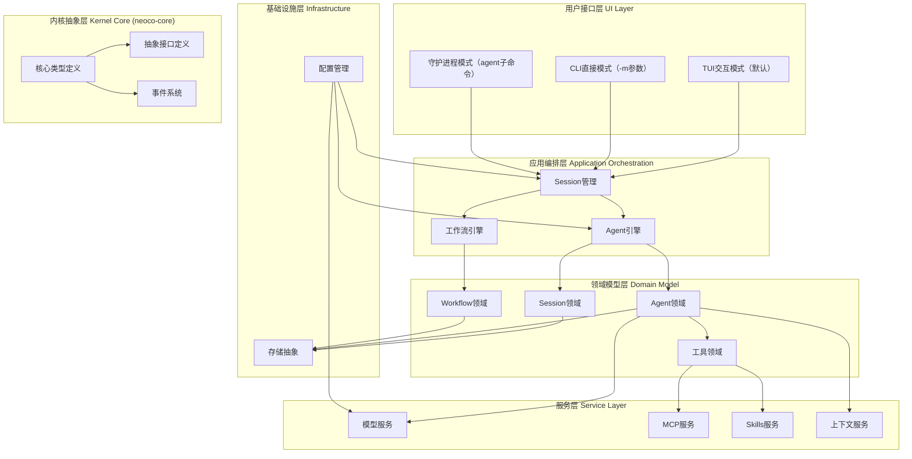
```mermaid
graph TB
    subgraph "用户接口层 UI Layer"
        TUI[TUI交互模式（默认）]
        CLI[CLI直接模式（-m参数）]
        Agent[守护进程模式（agent子命令）]
    end
    
    subgraph "应用编排层 Application Orchestration"
        SessionMgr[Session管理]
        Workflow[工作流引擎]
        AgentMgr[Agent引擎]
    end
    
    subgraph "领域模型层 Domain Model"
        SessionDomain[Session领域]
        AgentDomain[Agent领域]
        WorkflowDomain[Workflow领域]
        ToolDomain[工具领域]
    end
    
    subgraph "服务层 Service Layer"
        ModelService[模型服务]
        MCPService[MCP服务]
        SkillService[Skills服务]
        ContextService[上下文服务]
    end
    
    subgraph "基础设施层 Infrastructure"
        Config[配置管理]
        Storage[存储抽象]
    end
    
    subgraph "内核抽象层 Kernel Core (neoco-core)"
        Types[核心类型定义]
        Traits[抽象接口定义]
        Events[事件系统]
    end
    
    TUI --> SessionMgr
    CLI --> SessionMgr  
    Agent --> SessionMgr
    
    SessionMgr --> AgentMgr
    SessionMgr --> Workflow
    
    AgentMgr --> SessionDomain
    AgentMgr --> AgentDomain
    Workflow --> WorkflowDomain
    
    AgentDomain --> ModelService
    AgentDomain --> ToolDomain
    ToolDomain --> MCPService
    ToolDomain --> SkillService
    AgentDomain --> ContextService
    
    SessionDomain --> Storage
    AgentDomain --> Storage
    WorkflowDomain --> Storage
    
    Config --> SessionMgr
    Config --> AgentMgr
    Config --> ModelService
    
    Types --> Traits
    Types --> Events
```

### 1.3 领域模型与基础设施分离

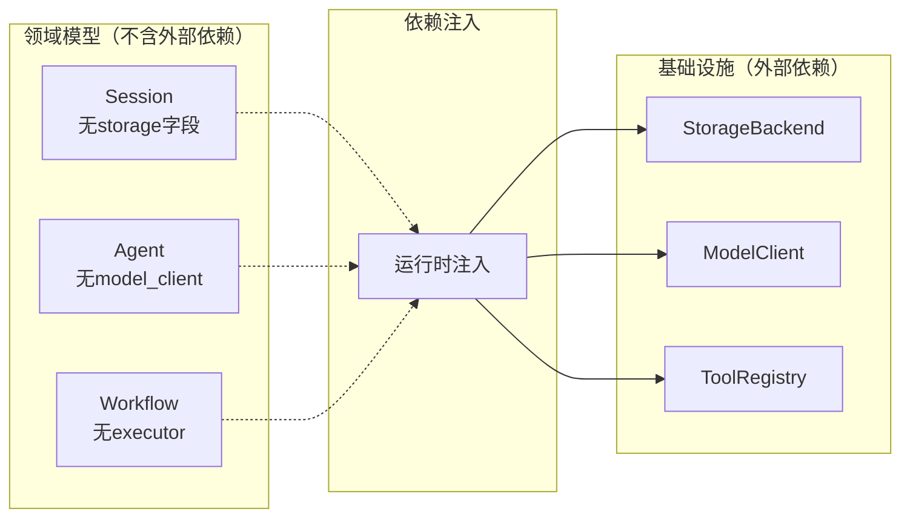
```mermaid
graph LR
    subgraph "领域模型（不含外部依赖）"
        DM1[Session<br/>无storage字段]
        DM2[Agent<br/>无model_client]
        DM3[Workflow<br/>无executor]
    end
    
    subgraph "基础设施（外部依赖）"
        INF1[StorageBackend]
        INF2[ModelClient]
        INF3[ToolRegistry]
    end
    
    subgraph "依赖注入"
        DI[运行时注入]
    end
    
    DM1 -.-> DI
    DM2 -.-> DI
    DM3 -.-> DI
    DI --> INF1
    DI --> INF2
    DI --> INF3
```

### 1.4 数据流全景图

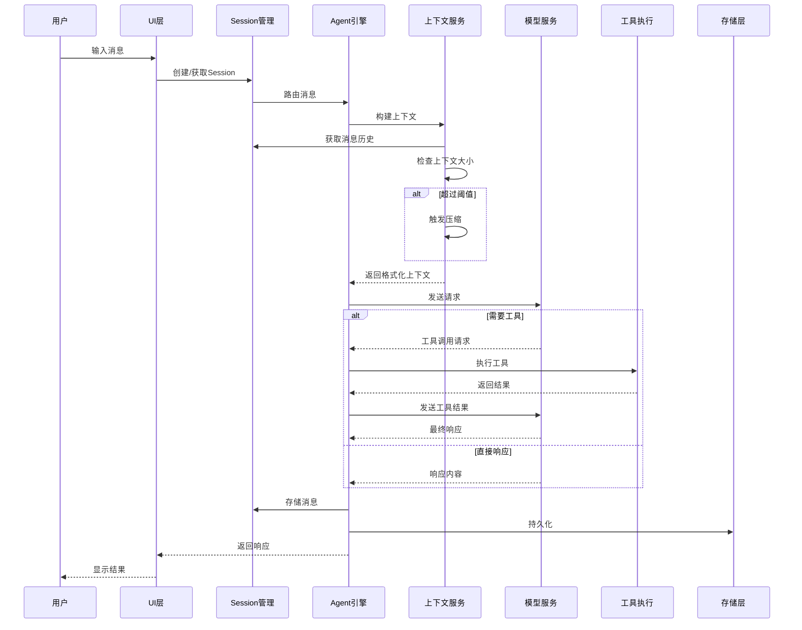
```mermaid
sequenceDiagram
    participant User as 用户
    participant UI as UI层
    participant Session as Session管理
    participant Agent as Agent引擎
    participant Context as 上下文服务
    participant Model as 模型服务
    participant Tool as 工具执行
    participant Storage as 存储层

    User->>UI: 输入消息
    UI->>Session: 创建/获取Session
    Session->>Agent: 路由消息
    Agent->>Context: 构建上下文
    Context->>Session: 获取消息历史
    Context->>Context: 检查上下文大小
    alt 超过阈值
        Context->>Context: 触发压缩
    end
    Context-->>Agent: 返回格式化上下文
    Agent->>Model: 发送请求
    alt 需要工具
        Model-->>Agent: 工具调用请求
        Agent->>Tool: 执行工具
        Tool-->>Agent: 返回结果
        Agent->>Model: 发送工具结果
        Model-->>Agent: 最终响应
    else 直接响应
        Model-->>Agent: 响应内容
    end
    Agent->>Session: 存储消息
    Agent->>Storage: 持久化
    Agent-->>UI: 返回响应
    UI-->>User: 显示结果
```

## 2. Crate划分

基于领域驱动设计原则，项目划分为以下crate：

| Crate | 职责 | 关键依赖 |
|-------|------|----------|
| `neoco-core` | 核心类型、强类型ID、事件系统、领域接口 | - |
| `neoco-config` | 配置管理、类型安全配置结构 | neoco-core |
| `neoco-model` | 模型调用服务、故障转移 | neoco-core |
| `neoco-session` | Session领域模型、Agent领域模型、仓库接口 | neoco-core |
| `neoco-storage` | 存储后端实现（文件系统） | neoco-core, neoco-session |
| `neoco-mcp` | MCP客户端 | neoco-core |
| `neoco-skill` | Skills管理 | neoco-core |
| `neoco-context` | 上下文管理（压缩+观测） | neoco-core |
| `neoco-agent` | Agent引擎、Agent生命周期 | neoco-core, neoco-session, neoco-model |
| `neoco-workflow` | 工作流引擎 | neoco-core, neoco-session |
| `neoco-tool` | 工具执行器、工具注册表 | neoco-core |
| `neoco-ui` | 用户接口 | neoco-core |
| `neoco` | 主入口 | 所有上述crate |

### 2.1 Crate依赖关系（领域驱动）

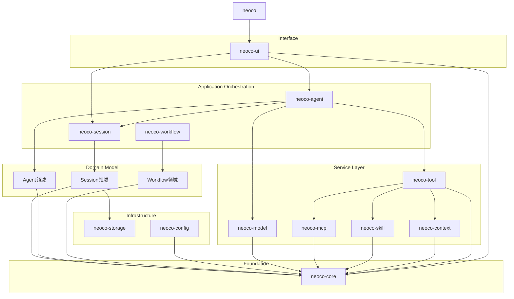
```mermaid
graph TD
    neoco[neoco]
    
    subgraph "Interface"
        ui[neoco-ui]
    end
    
    subgraph "Application Orchestration"
        agent[neoco-agent]
        workflow[neoco-workflow]
        session[neoco-session]
    end
    
    subgraph "Domain Model"
        session_domain[Session领域]
        agent_domain[Agent领域]
        workflow_domain[Workflow领域]
    end
    
    subgraph "Service Layer"
        model[neoco-model]
        mcp[neoco-mcp]
        skill[neoco-skill]
        context[neoco-context]
        tool[neoco-tool]
    end
    
    subgraph "Infrastructure"
        storage[neoco-storage]
        config[neoco-config]
    end
    
    subgraph "Foundation"
        core[neoco-core]
    end
    
    neoco --> ui
    
    ui --> session
    ui --> agent
    
    session --> session_domain
    workflow --> workflow_domain
    agent --> agent_domain
    
    agent --> model
    agent --> tool
    agent --> session
    
    tool --> mcp
    tool --> skill
    tool --> context
    
    session_domain --> storage
    session_domain --> core
    agent_domain --> core
    workflow_domain --> core
    
    config --> core
    model --> core
    mcp --> core
    skill --> core
    context --> core
    tool --> core
    ui --> core
```

### 2.2 核心模块职责

| 模块 | 领域边界 | 核心类型 |
|------|---------|----------|
| neoco-core | 通用类型系统 | SessionUlid, AgentUlid, MessageId, Event |
| neoco-session | 会话与Agent管理 | Session, Agent, Hierarchy |
| neoco-workflow | 工作流编排 | WorkflowDef, NodeRuntime |
| neoco-tool | 工具执行 | ToolExecutor, ToolRegistry |
| neoco-model | LLM调用 | ModelClient, ChatRequest |

## 3. 核心数据类型系统（强类型标识符）

> 详细数据结构定义见各功能模块文档：
> - [TECH-SESSION.md](TECH-SESSION.md) - Session、Agent、Message、存储结构
> - [TECH-WORKFLOW.md](TECH-WORKFLOW.md) - 工作流、节点、边定义
> - [TECH-CONFIG.md](TECH-CONFIG.md) - 配置数据结构
> - [TECH-TOOL.md](TECH-TOOL.md) - 工具、ToolCall定义
> - [TECH-CONTEXT.md](TECH-CONTEXT.md) - 上下文观测结构
> - [TECH-PROMPT.md](TECH-PROMPT.md) - 提示词组件
> - [TECH-SKILL.md](TECH-SKILL.md) - Skills技能

### 3.1 统一标识符系统（ULID Newtype模式）

**设计原则**：使用 newtype 模式替代类型别名，提供编译期校验

| 类型 | 结构 | 校验规则 |
|------|------|----------|
| `SessionUlid` | `struct SessionUlid(Ulid)` | 26位Ulid字符串 |
| `AgentUlid` | `struct AgentUlid { session: Ulid, agent: Ulid }` | 双Ulid结构。session字段直接标识所属Session，agent字段标识唯一Agent实例。查询Agent所属Session可直接从AgentUlid.session获取，无需通过SessionManager索引 |
| `MessageId` | `struct MessageId(u64)` | 原子自增，Session范围唯一（保持u64） |
| `NodeUlid` | `struct NodeUlid(Ulid)` | 26位Ulid字符串 |
| `ToolId` | `struct ToolId(Vec<String>)` | namespace::name 格式（如 `["fs", "read"]`） |
| `SkillUlid` | `struct SkillUlid(Ulid)` | 26位Ulid字符串 |

### 3.2 统一消息系统

> **详细数据结构定义见** [TECH-SESSION.md](TECH-SESSION.md)

**设计原则**：消除 Session 层 `Message`（有id）与 Model 层 `ModelMessage`（无id）的重复

**TODO**: 统一消息系统详细设计见 [TECH-SESSION.md#3-消息模型设计](TECH-SESSION.md#3-消息模型设计)

```rust
// 领域消息（Session层使用，有id）
// TODO: 详细字段定义见 TECH-SESSION.md
pub struct Message {
    pub id: MessageId,
    pub role: Role,
    pub content: String,
    pub tool_calls: Option<Vec<ToolCall>>,
    pub tool_call_id: Option<String>,
    pub timestamp: DateTime<Utc>,
    pub metadata: Option<MessageMetadata>,
}

// 角色枚举
#[derive(Debug, Clone, Copy, PartialEq, Eq, Hash)]
pub enum Role {
    System,
    User,
    Assistant,
    Tool,
}

// 模型消息（Model层使用，无id）
// TODO: 详细字段定义见 TECH-SESSION.md
pub struct ModelMessage<'a> {
    pub role: Role,
    pub content: Cow<'a, str>,
    pub tool_calls: Option<&'a [ToolCall]>,
    pub tool_call_id: Option<&'a str>,
}

// 转换方法
impl<'a> ModelMessage<'a> {
    pub fn from_message(msg: &'a Message) -> Self;
    pub fn into_owned(self, id: MessageId) -> Message;
}
```


## 4. 数据流向

### 4.1 SubAgent创建流程

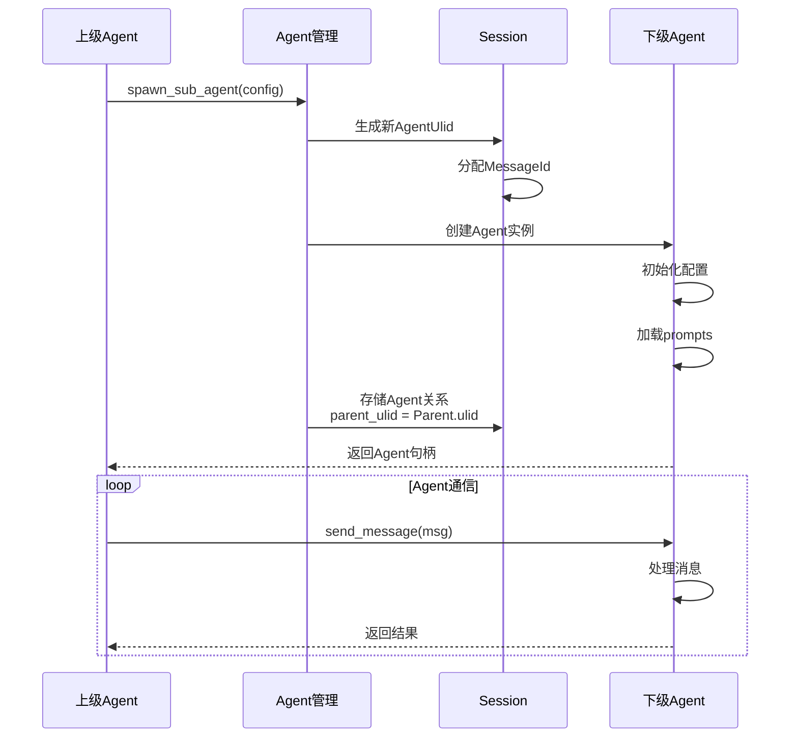
```mermaid
sequenceDiagram
    participant Parent as 上级Agent
    participant AgentMgr as Agent管理
    participant Session as Session
    participant Child as 下级Agent

    Parent->>AgentMgr: spawn_sub_agent(config)
    AgentMgr->>Session: 生成新AgentUlid
    Session->>Session: 分配MessageId
    
    AgentMgr->>Child: 创建Agent实例
    Child->>Child: 初始化配置
    Child->>Child: 加载prompts
    
    AgentMgr->>Session: 存储Agent关系<br/>parent_ulid = Parent.ulid
    
    Child-->>Parent: 返回Agent句柄
    
    loop Agent通信
        Parent->>Child: send_message(msg)
        Child->>Child: 处理消息
        Child-->>Parent: 返回结果
    end
```

### 4.2 工作流执行流程

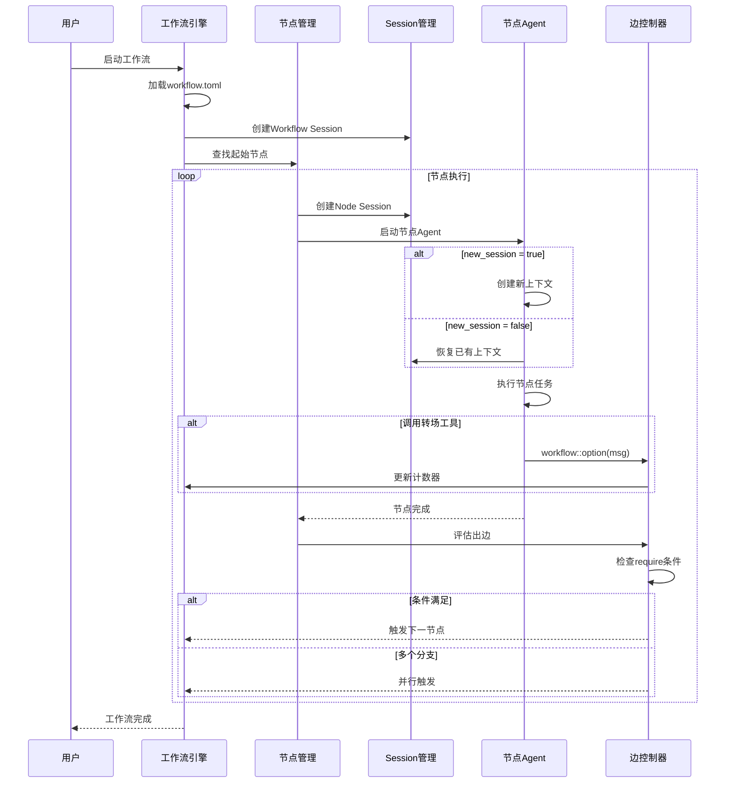
```mermaid
sequenceDiagram
    participant User as 用户
    participant Workflow as 工作流引擎
    participant NodeMgr as 节点管理
    participant Session as Session管理
    participant Agent as 节点Agent
    participant Edge as 边控制器

    User->>Workflow: 启动工作流
    Workflow->>Workflow: 加载workflow.toml
    Workflow->>Session: 创建Workflow Session
    
    Workflow->>NodeMgr: 查找起始节点
    
    loop 节点执行
        NodeMgr->>Session: 创建Node Session
        NodeMgr->>Agent: 启动节点Agent
        
        alt new_session = true
            Agent->>Agent: 创建新上下文
        else new_session = false
            Agent->>Session: 恢复已有上下文
        end
        
        Agent->>Agent: 执行节点任务
        
        alt 调用转场工具
            Agent->>Edge: workflow::option(msg)
            Edge->>Workflow: 更新计数器
        end
        
        Agent-->>NodeMgr: 节点完成
        
        NodeMgr->>Edge: 评估出边
        Edge->>Edge: 检查require条件
        
        alt 条件满足
            Edge-->>Workflow: 触发下一节点
        else 多个分支
            Edge-->>Workflow: 并行触发
        end
    end
    
    Workflow-->>User: 工作流完成
```

### 4.3 模型调用与故障转移流程

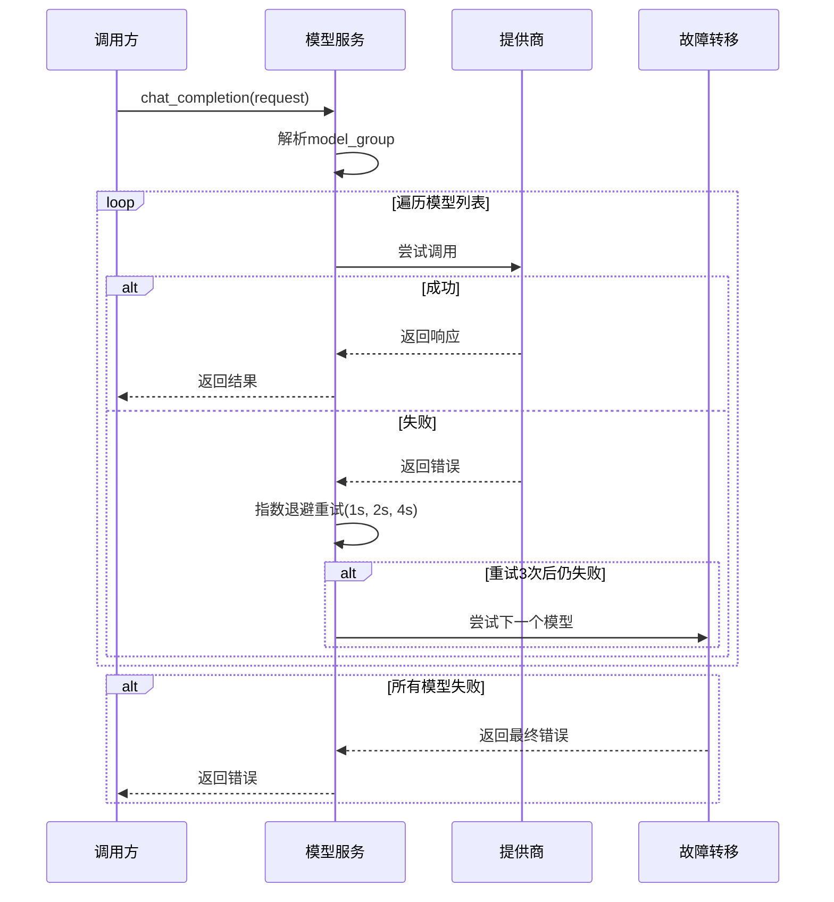
```mermaid
sequenceDiagram
    participant Caller as 调用方
    participant ModelSvc as 模型服务
    participant Provider as 提供商
    participant Fallback as 故障转移

    Caller->>ModelSvc: chat_completion(request)
    ModelSvc->>ModelSvc: 解析model_group
    
    loop 遍历模型列表
        ModelSvc->>Provider: 尝试调用
        
        alt 成功
            Provider-->>ModelSvc: 返回响应
            ModelSvc-->>Caller: 返回结果
        else 失败
            Provider-->>ModelSvc: 返回错误
            ModelSvc->>ModelSvc: 指数退避重试(1s, 2s, 4s)
            
            alt 重试3次后仍失败
                ModelSvc->>Fallback: 尝试下一个模型
            end
        end
    end
    
    alt 所有模型失败
        Fallback-->>ModelSvc: 返回最终错误
        ModelSvc-->>Caller: 返回错误
    end
```

### 4.4 MCP工具调用流程

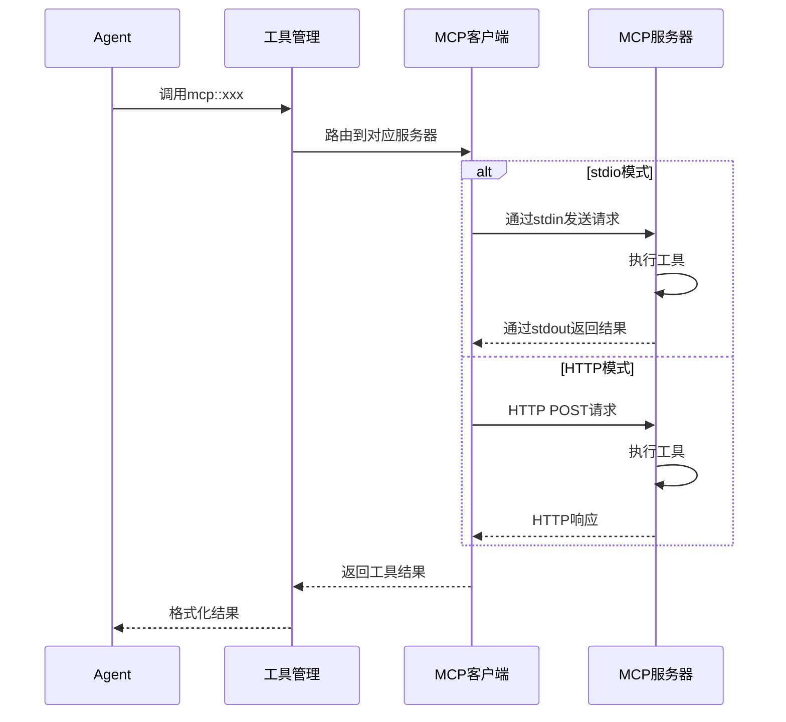
```mermaid
sequenceDiagram
    participant Agent as Agent
    participant ToolMgr as 工具管理
    participant McpClient as MCP客户端
    participant Server as MCP服务器

    Agent->>ToolMgr: 调用mcp::xxx
    ToolMgr->>McpClient: 路由到对应服务器
    
    alt stdio模式
        McpClient->>Server: 通过stdin发送请求
        Server->>Server: 执行工具
        Server-->>McpClient: 通过stdout返回结果
    else HTTP模式
        McpClient->>Server: HTTP POST请求
        Server->>Server: 执行工具
        Server-->>McpClient: HTTP响应
    end
    
    McpClient-->>ToolMgr: 返回工具结果
    ToolMgr-->>Agent: 格式化结果
```

### 4.5 上下文压缩流程

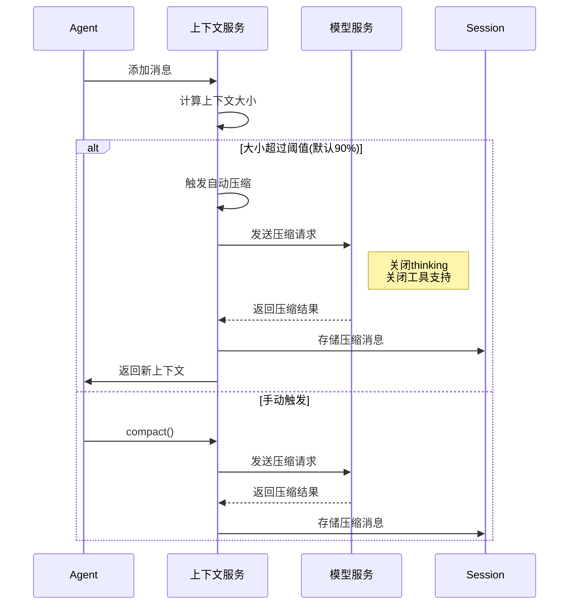
```mermaid
sequenceDiagram
    participant Agent as Agent
    participant ContextSvc as 上下文服务
    participant ModelSvc as 模型服务
    participant Session as Session

    Agent->>ContextSvc: 添加消息
    ContextSvc->>ContextSvc: 计算上下文大小
    
    alt 大小超过阈值(默认90%)
        ContextSvc->>ContextSvc: 触发自动压缩
        ContextSvc->>ModelSvc: 发送压缩请求
        Note right of ModelSvc: 关闭thinking<br/>关闭工具支持
        ModelSvc-->>ContextSvc: 返回压缩结果
        ContextSvc->>Session: 存储压缩消息
        ContextSvc->>Agent: 返回新上下文
    else 手动触发
        Agent->>ContextSvc: compact()
        ContextSvc->>ModelSvc: 发送压缩请求
        ModelSvc-->>ContextSvc: 返回压缩结果
        ContextSvc->>Session: 存储压缩消息
    end
```

## 5. 模块间接口设计（领域驱动）

### 5.1 核心Trait定义（按领域划分）

> 核心Trait定义分布在各功能模块中，详细定义请参考各模块文档。

#### 领域仓储接口（Domain Repository）

| Trait | 定义模块 | 职责 |
|-------|---------|------|
| `SessionRepository` | neoco-session | Session领域接口 |
| `AgentRepository` | neoco-session | Agent领域接口 |
| `MessageRepository` | neoco-session | 消息领域接口 |

#### 服务接口（Service）

| Trait | 定义模块 | 职责 |
|-------|---------|------|
| `ModelClient` | neoco-model | 模型调用 |
| `ToolExecutor` | neoco-tool | 工具执行 |
| `ToolRegistry` | neoco-tool | 工具注册 |
| `SkillProvider` | neoco-skill | Skill提供 |

#### 基础设施接口（Infrastructure）

| Trait | 定义模块 | 职责 |
|-------|---------|------|
| `StorageBackend` | neoco-storage | 存储后端 |
| `TokenCounter` | neoco-context | Token计数 |

### 5.2 事件系统

> 完整的事件驱动架构设计见 [TECH-AGENT.md#5-事件驱动架构](TECH-AGENT.md#5-事件驱动架构)

**统一事件类型：**

```rust
// 统一事件类型
pub enum Event {
    Session(SessionEvent),
    Agent(AgentEvent),
    Workflow(WorkflowEvent),
    Tool(ToolEvent),
    System(SystemEvent),
}

/// Session领域事件
#[derive(Debug, Clone)]
pub enum SessionEvent {
    Created { id: SessionUlid, session_type: SessionType },
    Updated { id: SessionUlid },
    Deleted { id: SessionUlid },
}

/// Agent领域事件
#[derive(Debug, Clone)]
pub enum AgentEvent {
    Created { id: AgentUlid, parent_ulid: Option<AgentUlid> },
    StateChanged { id: AgentUlid, old: AgentState, new: AgentState },
    MessageAdded { id: AgentUlid, message_id: MessageId },
    ToolCalled { id: AgentUlid, tool_id: ToolId },
    ToolResult { id: AgentUlid, tool_id: ToolId, success: bool },
    Completed { id: AgentUlid, output: String },
    Error { id: AgentUlid, error: String },
}

/// Workflow领域事件
#[derive(Debug, Clone)]
pub enum WorkflowEvent {
    Started { session_ulid: SessionUlid, definition_id: String },
    NodeStarted { session_ulid: SessionUlid, node_ulid: NodeUlid },
    NodeCompleted { session_ulid: SessionUlid, node_ulid: NodeUlid, result: String },
    Transition { session_ulid: SessionUlid, from: NodeUlid, to: NodeUlid },
    Completed { session_ulid: SessionUlid },
    Failed { session_ulid: SessionUlid, error: String },
}

/// Tool领域事件
#[derive(Debug, Clone)]
pub enum ToolEvent {
    Registered { tool_id: ToolId },
    Executing { tool_id: ToolId, agent_ulid: AgentUlid },
    Executed { tool_id: ToolId, agent_ulid: AgentUlid, success: bool },
    Error { tool_id: ToolId, error: String },
}

/// 系统事件
#[derive(Debug, Clone)]
pub enum SystemEvent {
    Startup,
    Shutdown,
    Error { source: String, message: String },
}
```

| 事件类型 | 描述 |
|----------|------|
| `SessionEvent` | Session创建、更新、删除 |
| `AgentEvent` | Agent创建、状态变更、消息、工具调用 |
| `WorkflowEvent` | 工作流启动、节点执行、转场、完成 |
| `ToolEvent` | 工具注册、执行、错误 |
| `SystemEvent` | 系统错误、关闭 |

**事件发布/订阅接口：**

```rust
pub trait EventPublisher: Send + Sync {
    fn publish(&self, event: Event);
    fn subscribe(&self, filter: EventFilter) -> Arc<dyn EventSubscriber>;
}

pub trait EventSubscriber: Send + Sync {
    async fn on_event(&self, event: Event);
}
```

### 5.3 统一错误类型设计

> **设计原则**: 所有模块错误类型统一在 `neoco-core` 的 `AppError` 中定义，采用领域错误分类。

> 各领域错误的详细定义见各模块技术文档，例如 [TECH-SESSION.md#6-错误类型设计](TECH-SESSION.md#6-错误类型设计)

```rust
/// 统一错误类型 - 应用层错误
///
/// 所有模块的错误类型统一在 AppError 中汇总，提供统一的错误处理接口。
/// 使用 #[from] 属性自动实现 From trait，便于错误传播和转换。
#[derive(Debug, Error)]
pub enum AppError {
    /// Session相关错误
    #[error("Session错误: {0}")]
    Session(#[from] SessionError),
    
    /// Agent相关错误
    #[error("Agent错误: {0}")]
    Agent(#[from] AgentError),
    
    /// 工作流相关错误
    #[error("工作流错误: {0}")]
    Workflow(#[from] WorkflowError),
    
    /// 模型相关错误
    #[error("模型错误: {0}")]
    Model(#[from] ModelError),
    
    /// 工具相关错误
    #[error("工具错误: {0}")]
    Tool(#[from] ToolError),
    
    /// 配置相关错误
    #[error("配置错误: {0}")]
    Config(#[from] ConfigError),
    
    /// 存储相关错误
    #[error("存储错误: {0}")]
    Storage(#[from] StorageError),
    
    /// MCP相关错误
    #[error("MCP错误: {0}")]
    Mcp(#[from] McpError),
    
    /// 上下文相关错误
    #[error("上下文错误: {0}")]
    Context(#[from] ContextError),
    
    /// Skill相关错误
    #[error("Skill错误: {0}")]
    Skill(#[from] SkillError),
    
    /// ID相关错误
    #[error("ID错误: {0}")]
    Id(#[from] IdError),
}

impl AppError {
    /// 检查错误是否可重试
    pub fn is_retryable(&self) -> bool {
        match self {
            Self::Session(e) => e.is_retryable(),
            Self::Agent(e) => e.is_recoverable(),
            Self::Workflow(e) => e.is_retryable(),
            Self::Model(e) => e.is_retryable(),
            Self::Tool(e) => e.is_retryable(),
            Self::Config(_) | Self::Storage(_) | Self::Mcp(e) => e.is_retryable(),
            Self::Context(_) | Self::Skill(_) | Self::Id(_) => false,
        }
    }
    
    /// 检查错误是否面向用户
    /// - 用户相关错误：Session、Agent、Workflow、Config、Id
    /// - 系统内部错误：Model、Tool、Storage、MCP、Context、Skill
    pub fn is_user_facing(&self) -> bool {
        matches!(
            self,
            Self::Session(_) | Self::Agent(_) | Self::Workflow(_) | Self::Config(_) | Self::Id(_)
        )
    }
}

/// 标识符错误
/// 
/// 标识符是系统的核心概念，所有实体的唯一标识都必须通过Id<T>类型系统确保类型安全。
#[derive(Debug, Error)]
pub enum IdError {
    /// ID格式错误
    #[error("ID格式错误: {0}")]
    InvalidFormat(String),
    
    /// ID类型不匹配
    #[error("ID类型不匹配: 期望 {expected}, 实际 {actual}")]
    TypeMismatch { 
        expected: &'static str, 
        actual: &'static str 
    },
    
    /// ID解析失败
    #[error("无法解析ID: {input}, 原因: {reason}")]
    ParseError { 
        input: String, 
        reason: String 
    },
    
    /// ID验证失败
    #[error("ID验证失败: {0}")]
    ValidationFailed(String),
    
    /// ID为空
    #[error("ID不能为空")]
    Empty,
    
    /// ID不存在
    #[error("ID不存在: {0}")]
    NotFound(String),
    
    /// ID生成失败
    #[error("ID生成失败: {0}")]
    GenerationFailed(String),
}
```

**各模块错误类型定义位置：**

| 模块 | 错误类型 | 定义位置 |
|------|---------|---------|
| 标识符 | `IdError` | neoco-core |
| Session | `SessionError` | neoco-session |
| Storage | `StorageError` | neoco-storage |
| Agent | `AgentError` | neoco-agent |
| Workflow | `WorkflowError` | neoco-workflow |
| Model | `ModelError` | neoco-model |
| Tool | `ToolError` | neoco-tool |
| Config | `ConfigError` | neoco-config |
| Context | `ContextError` | neoco-context |
| MCP | `McpError` | neoco-mcp |
| Skill | `SkillError` | neoco-skill |
| UI | `UiError` | neoco-ui |

## 6. 存储设计

> 详细存储设计见 [TECH-SESSION.md#5-存储设计](TECH-SESSION.md#5-存储设计)

### 6.1 文件系统布局

配置目录与数据目录分离。配置目录支持多级查找。

> 配置目录优先级规则详见 [TECH-CONFIG.md#2.1 配置目录结构](TECH-CONFIG.md#21-配置目录结构)

```text
# 配置目录结构
.neoco/                    # 当前项目 .neoco
├── neoco.toml
├── prompts/
├── skills/
├── agents/
└── workflows/

.agents/                  # 当前项目 .agents
├── prompts/
├── skills/
├── agents/
└── workflows/

~/.config/neoco/           # 全局主配置
├── neoco.toml            # 主配置
├── prompts/
├── skills/
├── agents/
└── workflows/

~/.agents/               # 全局通用配置
├── prompts/
├── skills/
├── agents/
└── workflows/

~/.local/neoco/           # 数据目录
└── {session_id}/        # Session目录
    ├── session.toml     # Session元数据
    └── agents/
        └── {agent_id}.toml  # Agent消息
```

> 详细目录结构定义见 [TECH-CONFIG.md#21-配置目录结构](TECH-CONFIG.md#21-配置目录结构)

## 7. 错误处理策略

### 7.1 错误分类

| 错误类型 | 处理策略 | 恢复机制 |
|---------|---------|---------|
| 模型调用错误 | 自动重试3次 → 故障转移 | 指数退避(1s, 2s, 4s) |
| 工具调用错误 | 返回给Agent决定 | Agent决定重试/跳过/终止 |
| 配置错误 | 启动时panic | 修复配置后重启 |
| 工作流错误 | 根据配置决定 | 死锁检测(5分钟) |
| 存储错误 | 记录日志，返回错误 | 手动修复 |

### 7.2 错误传播

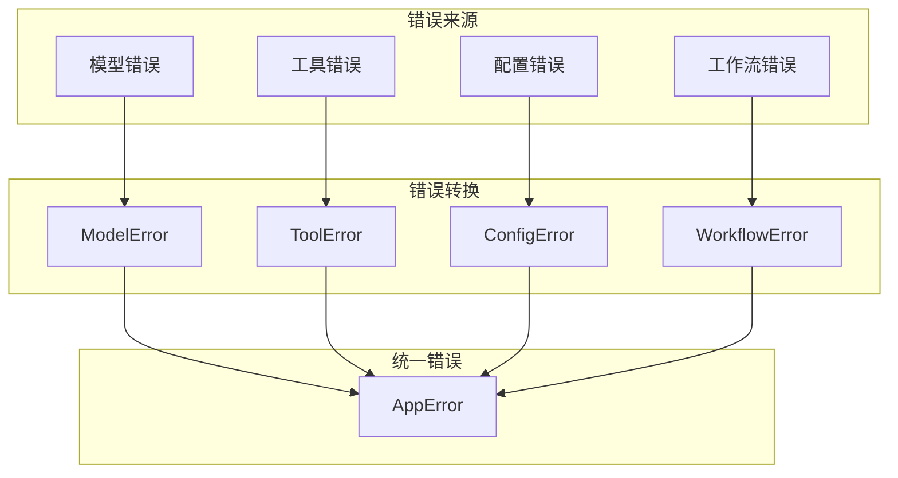
```mermaid
graph TD
    subgraph "错误来源"
        Model[模型错误]
        Tool[工具错误]
        Config[配置错误]
        Workflow[工作流错误]
    end
    
    subgraph "错误转换"
        E1[ModelError]
        E2[ToolError]
        E3[ConfigError]
        E4[WorkflowError]
    end
    
    subgraph "统一错误"
        App[AppError]
    end
    
    Model --> E1
    Tool --> E2
    Config --> E3
    Workflow --> E4
    
    E1 --> App
    E2 --> App
    E3 --> App
    E4 --> App
```

## 8. 并发设计

### 8.1 并发模型

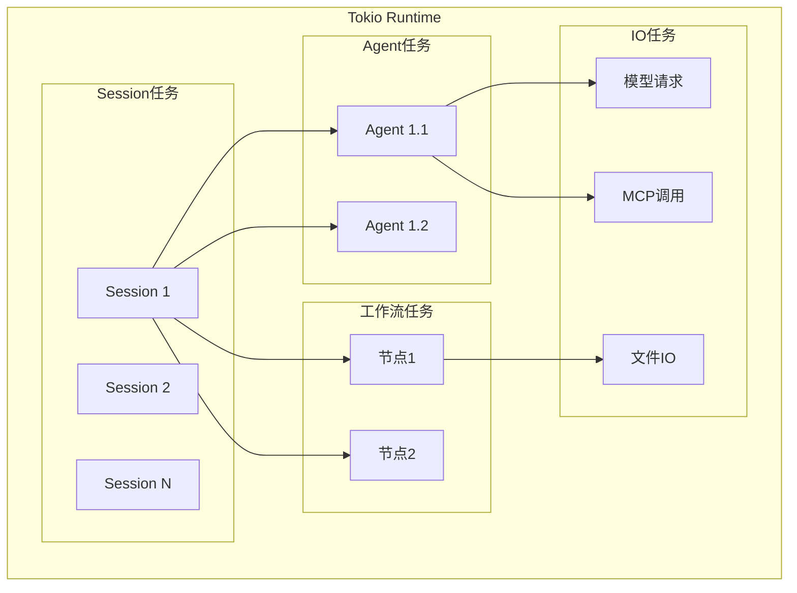
```mermaid
graph TB
    subgraph "Tokio Runtime"
        subgraph "Session任务"
            S1[Session 1]
            S2[Session 2]
            S3[Session N]
        end
        
        subgraph "Agent任务"
            A1[Agent 1.1]
            A2[Agent 1.2]
        end
        
        subgraph "工作流任务"
            W1[节点1]
            W2[节点2]
        end
        
        subgraph "IO任务"
            I1[模型请求]
            I2[MCP调用]
            I3[文件IO]
        end
    end
    
    S1 --> A1
    S1 --> A2
    S1 --> W1
    S1 --> W2
    
    A1 --> I1
    A1 --> I2
    W1 --> I3
```

### 8.2 同步原语使用

| 场景 | 原语 | 说明 |
|-----|------|------|
| Session消息ID分配 | `AtomicU64` | 原子自增，无锁 |
| Agent状态变更 | `RwLock<AgentState>` | 多读单写 |
| 工作流计数器 | `Mutex<HashMap>` | 多线程安全 |
| Session缓存 | `Arc<RwLock<Session>>` | 共享可变 |
| 配置热重载 | `RwLock<Config>` | 读取频繁，写入少 |

## 9. 安全设计

> 参考 OpenFang 的 16 层安全体系设计

### 9.1 安全架构分层


```mermaid
graph TB
    subgraph "N Layer 安全体系 (对齐OpenFang 16层)"
        S1[1. WASM双计量沙箱]
        S2[2. Merkle哈希链审计]
        S3[3. 信息流污点追踪]
        S4[4. Ed25519签名清单]
        S5[5. SSRF防护]
        S6[6. 密钥零化]
        S7[7. OFP双向认证]
        S8[8. Capability能力门]
        S9[9. 安全响应头]
        S10[10. 健康端点管控]
        S11[11. 子进程沙箱]
        S12[12. Prompt注入扫描]
        S13[13. 循环守卫]
        S14[14. 会话修复]
        S15[15. 路径穿越防护]
        S16[16. GCRA速率限制]
    end
    
    S1 --> S2
    S2 --> S3
    S3 --> S4
    S4 --> S5
    S5 --> S6
    S6 --> S7
    S7 --> S8
    S8 --> S9
    S9 --> S10
    S10 --> S11
    S11 --> S12
    S12 --> S13
    S13 --> S14
    S14 --> S15
    S15 --> S16
```

### 9.2 核心安全机制

| 层级 | 安全机制 | 描述 |
|------|----------|------|
| L1 | WASM双计量沙箱 | 燃料计量+时代中断 |
| L2 | Merkle哈希链审计 | 加密链接，防篡改 |
| L3 | 信息流污点追踪 | 敏感信息追踪 |
| L4 | Ed25519签名清单 | 身份密码学验证 |
| L5 | SSRF防护 | 阻止内网IP、云元数据 |
| L6 | 密钥零化 | Zeroizing自动内存擦除 |
| L7 | OFP双向认证 | HMAC-SHA256 P2P认证 |
| L8 | Capability能力门 | RBAC能力驱动访问控制 |
| L9 | 安全响应头 | CSP, HSTS, X-Frame-Options |
| L10 | 健康端点管控 | 公开/私有诊断分离 |
| L11 | 子进程沙箱 | env_clear+进程树隔离 |
| L12 | Prompt注入扫描 | 检测override/exfiltration |
| L13 | 循环守卫 | SHA256循环检测+断路器 |
| L14 | 会话修复 | 7阶段消息历史验证 |
| L15 | 路径穿越防护 | 规范化+symlink转义检测 |
| L16 | GCRA速率限制 | 成本感知令牌桶限流 |

### 9.3 Capability能力驱动安全模型

> 详细设计见 [TECH-AGENT.md#5-事件驱动架构](TECH-AGENT.md#5-事件驱动架构)

### 9.4 输入验证

| 输入类型 | 验证方式 |
|---------|---------|
| 配置文件 | Schema验证 + 运行时检查 |
| 工具参数 | JSON Schema验证 |
| 用户输入 | 长度限制 + 内容过滤 |
| 模型输出 | 敏感信息脱敏 |

### 9.5 应急停止机制

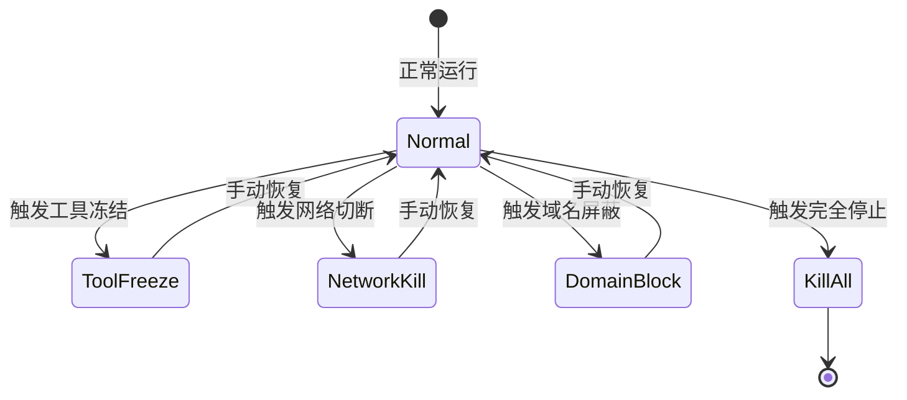
```mermaid
stateDiagram-v2
    [*] --> Normal: 正常运行
    Normal --> ToolFreeze: 触发工具冻结
    ToolFreeze --> Normal: 手动恢复
    Normal --> NetworkKill: 触发网络切断
    NetworkKill --> Normal: 手动恢复
    Normal --> DomainBlock: 触发域名屏蔽
    DomainBlock --> Normal: 手动恢复
    Normal --> KillAll: 触发完全停止
    KillAll --> [*]
```

**E-Stop 级别：**

| 级别 | 名称 | 描述 |
|------|------|------|
| L1 | ToolFreeze | 冻结指定工具 |
| L2 | NetworkKill | 禁用网络访问 |
| L3 | DomainBlock | 屏蔽指定域名 |
| L4 | KillAll | 完全停止 |

---

## 10. 扩展性设计

> 参考 ZeroClaw 的 Trait-driven 架构设计

### 10.1 扩展点总览

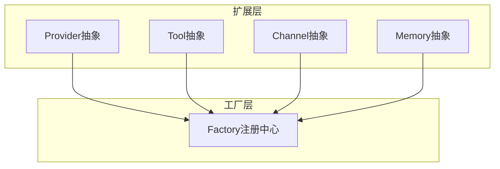
```mermaid
graph TB
    subgraph "扩展层"
        P[Provider抽象]
        T[Tool抽象]
        C[Channel抽象]
        M[Memory抽象]
    end
    
    subgraph "工厂层"
        F[Factory注册中心]
    end
    
    P --> F
    T --> F
    C --> F
    M --> F
```

### 10.2 核心扩展 Trait 定义

> 详细Trait定义请参考各模块文档。

| Trait | 定义模块 | 说明 |
|-------|---------|------|
| `ModelProvider` | TECH-MODEL.md | 模型提供者接口 |
| `ToolProvider` | TECH-TOOL.md | 工具提供者接口 |
| `StorageBackend` | TECH-SESSION.md | 存储后端接口 |
| `Channel` | TECH-CONFIG.md | 消息通道接口 |
| `Memory` | TECH-SESSION.md | 记忆抽象接口 |
| `SkillProvider` | TECH-SKILL.md | Skills技能提供者接口 |

### 10.3 Factory 注册机制

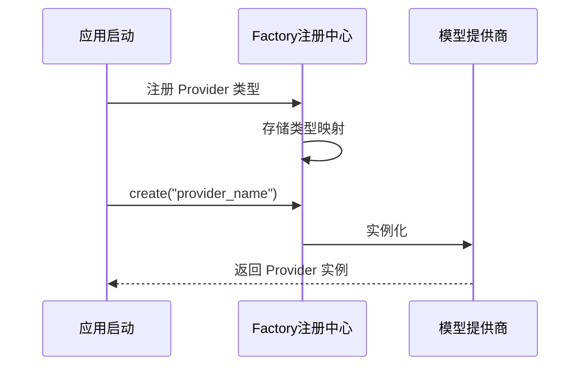
```mermaid
sequenceDiagram
    participant App as 应用启动
    participant Factory as Factory注册中心
    participant Provider as 模型提供商
    
    App->>Factory: 注册 Provider 类型
    Factory->>Factory: 存储类型映射
    
    App->>Factory: create("provider_name")
    Factory->>Provider: 实例化
    Provider-->>App: 返回 Provider 实例
```

### 10.4 动态组件发现

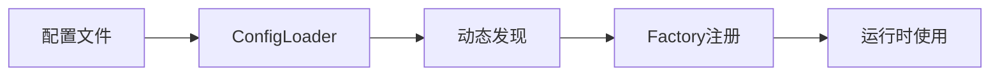
```mermaid
graph LR
    A[配置文件] --> B[ConfigLoader]
    B --> C[动态发现]
    C --> D[Factory注册]
    D --> E[运行时使用]
```

### 10.5 内核抽象层

> 参考 OpenFang 的 Kernel Handle Trait 设计

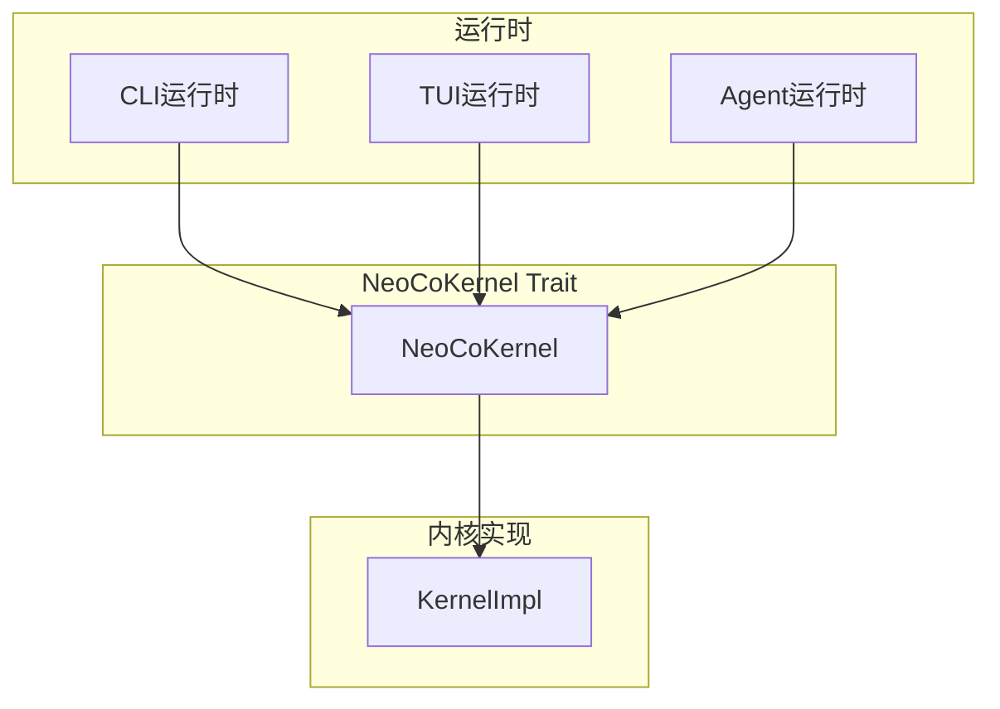
```mermaid
graph TB
    subgraph "运行时"
        R1[CLI运行时]
        R2[TUI运行时]
        R3[Agent运行时]
    end
    
    subgraph "NeoCoKernel Trait"
        NK[NeoCoKernel]
    end
    
    subgraph "内核实现"
        K1[KernelImpl]
    end
    
    R1 --> NK
    R2 --> NK
    R3 --> NK
    NK --> K1
```

**NeoCoKernel Trait 定义：**

> **设计说明**：`shutdown()` 使用 `async fn` 而非 `fn shutdown() -> impl Future`。这是因为 NeoCoKernel 主要用于库内部直接调用，而非作为 `dyn NeoCoKernel` trait object 使用。多个运行时连接到同一个 handle 的场景在当前架构中不存在，此设计简化了异步处理。如需 trait object 支持，可改用 `async_trait` 或 `Box<dyn Future>`。

```rust
pub trait NeoCoKernel: Send + Sync {
    fn agent_engine(&self) -> Arc<dyn AgentEngine>;
    fn workflow_engine(&self) -> Arc<dyn WorkflowEngine>;
    fn tool_registry(&self) -> Arc<dyn ToolRegistry>;
    fn context_manager(&self) -> Arc<dyn ContextManager>;
    fn config(&self) -> Arc<Config>;
    
    fn session_manager(&self) -> Arc<SessionManager>;
    
    async fn shutdown(&self);
}
```

## 11. 提示词组件与Skills

NeoCo提供两种扩展Agent能力的机制：**提示词组件(Prompt Components)** 和 **Skills**。它们是独立的系统，没有内置关联。

### 11.1 概念对比

| 维度 | 提示词组件 (Prompt Component) | Skills |
|------|-------------------------------|--------|
| **本质** | 静态Markdown文本片段 | 完整的能力单元 |
| **文件格式** | 纯Markdown | YAML前置元数据 + Markdown |
| **目录结构** | 扁平（`prompts/*.md`） | 目录级（`skill_name/SKILL.md`） |
| **资源支持** | 无 | scripts/, references/, assets/ |
| **复用性** | 组件复用 | 完整能力复用 |
| **加载时机** | Agent初始化时加载 | 按需激活 |
| **渐进披露** | 不支持 | 支持 |
| **发现机制** | 文件扫描 | 目录扫描 + 索引构建 |

### 11.2 设计差异

**提示词组件**：
- 轻量级纯Markdown片段
- 存储于配置目录的 `prompts/` 子目录下
- Agent初始化时按配置加载
- 适合简单的行为规范提示

**Skills**：
- 完整的可复用能力单元
- 存储于配置目录的 `skills/` 子目录下
- 按需激活使用（发现→激活→执行）
- 包含元数据、脚本、参考资料
- 适合复杂领域知识

### 11.3 详细文档

- [TECH-PROMPT.md](TECH-PROMPT.md) - 提示词组件模块
- [TECH-SKILL.md](TECH-SKILL.md) - Skills模块

### 11.4 选择指南

**使用提示词组件的场景**：
- 简单的行为规范或指令
- Agent启动时就需要的核心提示
- 不需要额外资源文件
- 示例：base、multi-agent

**使用Skills的场景**：
- 复杂的领域知识
- 需要脚本或参考资料
- 按需加载以节省上下文
- 示例：rust-coding-assistant、web-security

## 12. 性能设计

### 12.1 性能目标

| 指标 | 目标值 | 参考 |
|------|--------|------|
| 内存占用 | <50MB | OpenFang ~40MB |
| 冷启动 | <200ms | OpenFang <200ms |
| 二进制大小 | <20MB | OpenFang ~32MB |
| 工具超时 | 默认30s | 可配置 |
| 上下文上限 | 模型限制 | - |

### 12.2 优化策略

| 优化点 | 策略 |
|-------|------|
| 上下文大小 | 压缩阈值(默认90%)、增量更新 |
| 模型调用 | 连接池、请求合并 |
| 存储 | 异步IO、批量写入 |
| 内存 | Session缓存LRU、消息分页 |

### 12.3 资源限制

- 工具超时：默认30s（可配置）
- 上下文上限：模型限制
- 并发Agent数：由运行时配置决定

### 12.4 编译优化配置

```toml
[profile.release]
opt-level = "z"
lto = "fat"
codegen-units = 1
strip = true
```

## 13. 参考项目

### 13.1 ZeroClaw

| 维度 | ZeroClaw | NeoCo |
|------|----------|------|
| **定位** | Rust 原生自主 AI 助手运行时 | 多智能体协作 AI 应用 |
| **架构** | Trait-driven + Factory | Trait-driven + 依赖反转 |
| **内存占用** | <5MB | 待优化 |
| **启动速度** | <10ms | 待优化 |
| **Provider** | 多 Provider 抽象 | 多 Provider 支持 |
| **安全** | OTP/E-Stop/配对/沙箱 | 16 层安全体系 |
| **通信** | IPC + Channel 抽象 | EventBus + 工具调用 |

**核心借鉴点：**
- 统一 Trait 接口定义（Provider, Channel, Tool, Memory）
- Factory 注册机制实现动态组件发现
- 分层安全模型（OTP + E-Stop + 沙箱）
- 极致性能优化（opt-level = "z", lto = "fat"）

### 13.2 OpenFang

| 维度 | OpenFang | NeoCo |
|------|----------|------|
| **规模** | 137K LOC, 14 crates | 待评估 |
| **架构** | Kernel Handle Trait | 依赖反转接口 |
| **安全** | 16 层独立安全系统 | 16 层安全体系 |
| **通信** | EventBus + Trigger | EventBus |
| **工具** | Wasmtime 双计量沙箱 | 工具执行沙箱 |
| **Provider** | 27 个 LLM 驱动 | 多 Provider 支持 |
| **Channel** | 40 个消息适配器 | MCP 协议 |

**核心借鉴点：**
- Kernel Handle Trait 解耦内核与运行时
- EventBus + TriggerEngine 事件驱动架构
- Capability 能力驱动安全模型
- 防御深度（Defense in Depth）安全理念

### 13.3 架构对比总结

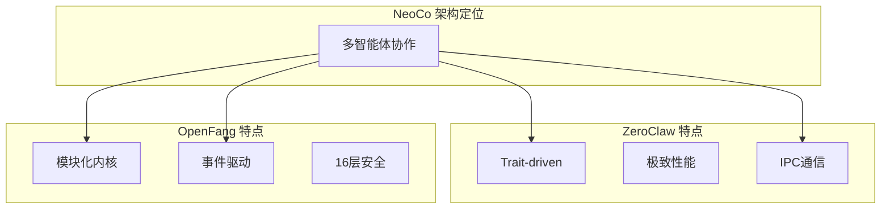
```mermaid
graph TB
    subgraph "NeoCo 架构定位"
        N[多智能体协作]
    end
    
    subgraph "ZeroClaw 特点"
        Z1[Trait-driven]
        Z2[极致性能]
        Z3[IPC通信]
    end
    
    subgraph "OpenFang 特点"
        O1[模块化内核]
        O2[事件驱动]
        O3[16层安全]
    end
    
    N --> Z1
    N --> O1
    N --> O2
    N --> Z3
```

**NeoCo 架构演进方向：**
1. 引入 Kernel Handle Trait 模式解耦核心模块
2. 完善 EventBus + Trigger 事件驱动机制
3. 扩展安全体系至 16 层
4. 优化性能达到 ZeroClaw 级别

## 版本要求

### 最低 Rust 版本（MSRV）

本项目要求 Rust **1.94.0** 或更高版本。

**原因**：确保兼容性，使用最新的 Rust 稳定版特性。

### 依赖版本

| 依赖 | 最低版本 | 说明 |
|------|----------|------|
| tokio | 1.40 | 异步运行时 |
| serde | 1.0 | 序列化框架 |
| reqwest | 0.11 | HTTP 客户端 |
| rmcp | 1.1 | MCP 客户端 |

---


*文档版本：0.3.0*
*最后更新：2026-03-06*
