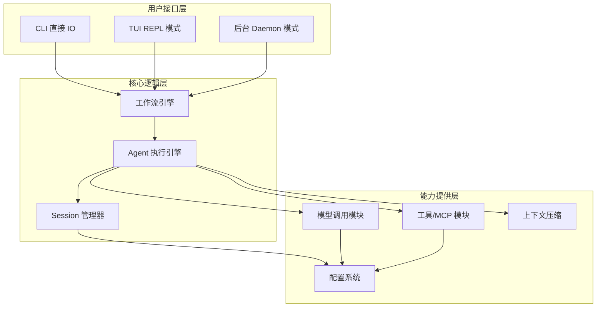
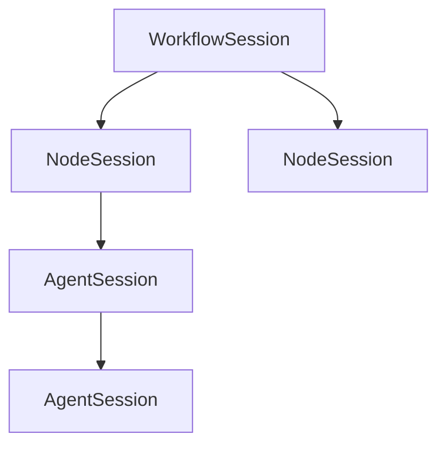

# Neco 技术架构文档

## 概述

Neco 是一个原生支持多智能体协作的 AI Agent 应用，采用双层架构设计，旨在解决现有方案在多智能体协作和工作流自动化方面的不足。

### 核心设计理念

1. **双层架构分离**：工作流图负责"做什么任务"，Agent 树负责"怎么做任务"
2. **按需加载**：提示词、工具、MCP、Skills 等模块化组件按需激活
3. **原生多智能体**：上下级智能体之间可直接通信，支持动态树形结构
4. **可共享工作流**：使用 Mermaid 图定义工作流，支持多节点并行执行

---

## 总体架构



---

## 三层 Session 架构

Neco 使用三层 Session 架构管理状态，将工作流状态、节点执行上下文和 Agent 会话分离：

- **WorkflowSession**：工作流级别的全局状态（计数器、变量）
- **NodeSession**：单个工作流节点的执行上下文
- **AgentSession**：单个 Agent 的会话状态（消息历史、配置）

> 详细设计见 [TECH-Session.md](./TECH-Session.md)



---

## 双层架构设计

Neco 采用双层架构分离任务编排与任务执行：

### 第一层：工作流图（Workflow-Level Graph）
- **关注点**：任务编排（做什么）
- **定义方式**：静态 Mermaid 图
- **控制机制**：边条件（select/require 计数器）

### 第二层：Agent 树（Node-Level Agent Tree）
- **关注点**：任务执行（怎么做）
- **定义方式**：运行时动态创建
- **协作机制**：parent_ulid 建立上下级关系

> 详细设计见 [TECH-Workflow.md](./TECH-Workflow.md)

### 关键区别

| 维度 | 工作流图 | Agent 树 |
|------|----------|----------|
| 关注点 | 任务编排 | 任务执行 |
| 定义时机 | 静态定义 | 运行时动态 |
| 关系字段 | select/require | parent_ulid |
| 存储内容 | 计数器、变量 | 消息历史 |
---

## 模块划分

### 核心模块清单

#### A. Session 管理模块
- **职责**：管理多智能体会话的生命周期和状态持久化
- **功能点**：
  - Session/Agent ULID 生成和管理
  - 消息历史存储（TOML 格式）
  - Agent 树形结构维护
  - 工作流 Session 与节点 Session 层次管理

#### B. Agent 执行模块
- **职责**：智能体的核心执行逻辑和行为控制
- **功能点**：
  - SubAgent 创建和父子关系管理
  - 上下级智能体通信工具
  - Agent 状态管理
  - 消息处理和响应生成

#### C. 模型调用模块
- **职责**：与大语言模型的交互和调用管理
- **功能点**：
  - 多模型提供商支持（OpenAI 兼容接口）
  - 模型组管理和负载均衡
  - 流式输出处理
  - 工具调用支持
  - 错误重试机制（指数退避）

#### D. MCP/工具模块
- **职责**：管理外部工具和 MCP 服务
- **功能点**：
  - 工具注册和调用
  - MCP 服务连接（local/http）
  - 工具超时管理
  - Hashline 技术实现

#### E. 工作流引擎模块
- **职责**：工作流执行和节点管理
- **功能点**：
  - Mermaid 图解析
  - DAG 节点执行
  - 节点转场控制（select/require 计数器）
  - 新 Session 创建逻辑
  - 并行节点执行

#### F. 上下文压缩模块
- **职责**：管理上下文生命周期和压缩
- **功能点**：
  - 上下文大小监控
  - 自动压缩触发（90% 阈值）
  - 手动压缩命令支持
  - 压缩提示词应用

#### G. 用户接口模块
- **职责**：提供多种用户交互方式
- **三个子模块**：
  - **直接 IO 模式**：命令行参数输入输出
  - **终端 REPL 模式**：交互式终端界面
  - **后台运行模式**：系统服务模式

---

## Crate 划分建议

### 基础层

```text
neco-core/         # 核心逻辑、trait 定义、公共数据结构
neco-session/      # Session 管理、消息持久化
neco-config/       # 配置加载、验证、热加载
```

### 功能层

```text
neco-model/        # 模型提供商接口、模型组管理、重试机制
neco-agent/        # Agent 执行逻辑、SubAgent 管理、父子通信
neco-workflow/     # 工作流定义、DAG 执行引擎、节点转场控制
neco-tools/        # 工具注册系统、MCP 连接管理
neco-context/      # 上下文压缩算法、触发条件管理
```

### 接口层

```text
neco-cli/          # 命令行参数解析、直接 IO 模式
neco-tui/          # ratatui 界面实现、REPL 交互
neco-daemon/       # 系统服务实现、IPC 通信、HTTP API
```

---

## 参考项目借鉴

### ZeroClaw

**特点**：
- 守护进程架构，作为系统服务运行
- 使用 gRPC 或 Unix Socket 与前端交互
- 提供 HTTP API 查询 Session 状态和进度
- 支持 CLI、Web UI、IDE 插件等多种前端

**借鉴点**：
- 后台运行模式的设计参考
- IPC 通信机制
- Session 生命周期管理
- 多前端支持架构

### OpenFang

**特点**：
- 微内核架构，14 个 crate
- 基于能力的权限系统（Capability-Based Security）
- 16 层安全系统，包括沙箱、审批、污点分析
- 40 个渠道适配器
- 基于 embedding 的语义记忆检索

**借鉴点**：
- 模块化 crate 划分策略
- 能力系统的设计思路
- 审批机制（Risk Level 分级）
- 错误处理和恢复机制

---

## 数据流向

### 主要数据流

```text
用户输入 → 用户接口模块 → 工作流引擎模块
    ↓              ↓            ↓
    ↓         Agent 执行模块 → 模型调用模块
    ↓              ↓            ↓
    ↓              ↓         MCP/工具模块
    ↓              ↓
    ↓         Session 管理模块 ← 上下文压缩模块
```

### Session 数据流

```text
用户输入 → Agent 消息列表 → 模型上下文 → 模型响应 → 新消息
    ↓ ↓           ↓              ↓           ↓
 Session 持久化  压缩触发     工具调用结果  SubAgent 通信
```

---

## 接口设计原则

1. **Trait 抽象**：使用 trait 定义模块间接口，便于扩展和测试
2. **事件驱动**：模块间通过事件而非直接调用来通信，降低耦合
3. **异步优先**：所有 IO 操作采用异步设计，提高并发性能
4. **错误传播**：使用 `Result<T, E>` 类型，错误可传播可恢复
5. **配置分离**：配置与代码分离，支持热加载和合并策略

---

## 文档索引

- [TECH-Session.md](./TECH-Session.md) - Session 管理和数据流
- [TECH-Agent.md](./TECH-Agent.md) - Agent 执行和树形结构
- [TECH-Workflow.md](./TECH-Workflow.md) - 工作流引擎
- [TECH-Model.md](./TECH-Model.md) - 模型调用和配置
- [TECH-Concurrency.md](./TECH-Concurrency.md) - 并发和错误处理

---

## 设计模式

### 1. 分层模式
- **工作流层**：负责任务编排和状态管理
- **Agent 层**：负责任务执行和智能交互
- **数据层**：负责消息存储和持久化

### 2. 树形模式
- **Agent 树**：上下级 Agent 的层次结构
- **父子关系**：通过 `parent_ulid` 建立
- **动态创建**：运行时根据需求动态扩展

### 3. 状态模式
- **节点状态**：不同阶段的不同行为
- **计数器状态**：控制工作流流转
- **全局状态**：跨节点的共享状态

### 4. 策略模式
- **模型选择**：不同的负载均衡和故障转移策略
- **提示词管理**：按需激活不同的提示词组件
- **错误处理**：分层的错误处理和重试机制

### 5. 观察者模式
- **工作流进度**：节点状态变化通知
- **Agent 通信**：上下级 Agent 之间的消息传递
- **事件驱动**：基于事件的系统架构

---

*本文档遵循 REQUIREMENT.md 定义的需求，描述 Neco 系统的技术架构和模块关系。*
